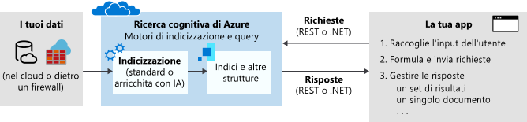

# Che cos'è la ricerca cognitiva di Azure?

Ricerca cognitiva di Azure ([precedentemente nota come "Ricerca di Azure"](whats-new.md#new-service-name)) è una soluzione cloud di ricerca distribuita come servizio che offre agli sviluppatori le API e gli strumenti per ottenere un'esperienza di ricerca avanzata su contenuti eterogenei e privati nelle applicazioni Web, per dispositivi mobili e aziendali. Il codice o uno strumento richiama l'inserimento dei dati (indicizzazione) per creare e caricare un indice. Facoltativamente, è possibile aggiungere competenze cognitive per applicare i processi di intelligenza artificiale durante l'indicizzazione. In questo modo è possibile aggiungere nuove informazioni e strutture utili per la ricerca e altri scenari.

Dall'altro lato del servizio, il codice dell'applicazione invia richieste di query e gestisce le risposte. L'esperienza di ricerca viene definita nel client tramite funzionalità di Ricerca cognitiva di Azure, con l'esecuzione di query su un indice persistente creato dall'utente, di sua proprietà e archiviato nel servizio.

La funzionalità viene esposta tramite una semplice [API REST](/rest/api/searchservice/) o un [SDK .NET](search-howto-dotnet-sdk.md) che maschera la complessità intrinseca del recupero delle informazioni. Oltre alle API, il portale di Azure fornisce il supporto di amministrazione e gestione dei contenuti, con strumenti per la creazione di prototipi e per le query degli indici. Poiché il servizio viene eseguito nel cloud, disponibilità e infrastruttura sono gestite da Microsoft.

## Quando usare Ricerca cognitiva di Azure

Ricerca cognitiva di Azure è una soluzione particolarmente adatta agli scenari di applicazione seguenti:

+ Consolidamento di tipi di contenuto eterogenei in un indice privato, singolo e in cui è possibile eseguire ricerche. Le query vengono eseguite sempre su un indice creato e caricato dall'utente con i documenti e l'indice risiede sempre nel cloud nel servizio Ricerca cognitiva di Azure dell'utente. È possibile popolare un indice con flussi di documenti JSON da qualsiasi origine o piattaforma. In alternativa, per i contenuti con origine in Azure, è possibile usare un *indicizzatore* per eseguire il pull dei dati in un indice. La definizione dell'indice e la relativa gestione/proprietà sono motivi importanti per usare Ricerca cognitiva di Azure.

+ Il contenuto non elaborato è costituito da testo non differenziato, file di immagine o file applicazione di grandi dimensioni, ad esempio tipi di contenuto di Office in un'origine dati di Azure, ad esempio archiviazione BLOB di Azure o Cosmos DB. È possibile applicare competenze cognitive durante l'indicizzazione per aggiungere struttura o estrarre il significato dai file di immagine e applicazione.

+ Facile implementazione delle funzionalità correlate alla ricerca. Le API di Ricerca cognitiva di Azure semplificano la costruzione di query, l'esplorazione in base a facet, i filtri (inclusa la ricerca geospaziale), il mapping dei sinonimi, le query con completamento automatico e l'ottimizzazione della pertinenza. Grazie alle funzionalità predefinite, è possibile soddisfare le aspettative degli utenti finali per un'esperienza di ricerca simile ai motori di ricerca Web commerciali.

+ Indicizzazione di testo non strutturato o estrazione di testo e informazioni dai file di immagine. La funzionalità di [arricchimento tramite intelligenza artificiale](cognitive-search-concept-intro.md) di Ricerca cognitiva di Azure aggiunge l'elaborazione tramite intelligenza artificiale a una pipeline di indicizzazione. Alcuni casi d'uso comuni includono OCR su documenti digitalizzati, riconoscimento di entità ed estrazione di frasi chiave da documenti di grandi dimensioni, rilevamento della lingua e traduzione testuale, nonché analisi del sentiment.

+ Possibilità di soddisfare i requisiti linguistici usando gli analizzatori del linguaggio e personalizzati di Ricerca cognitiva di Azure. Per il contenuto non in lingua inglese, Ricerca cognitiva di Azure supporta sia gli analizzatori Lucene che i processori di linguaggio naturale Microsoft. È anche possibile configurare gli analizzatori per ottenere un'elaborazione specializzata di contenuto non elaborato, ad esempio l'esclusione tramite filtro dei segni diacritici.

## Descrizione delle funzionalità

| Ricerca&nbsp;di base&nbsp;&nbsp;&nbsp;&nbsp;&nbsp;&nbsp;&nbsp;&nbsp;&nbsp;&nbsp;&nbsp;&nbsp;&nbsp;&nbsp;&nbsp;&nbsp;&nbsp;&nbsp;&nbsp;&nbsp;&nbsp;&nbsp;&nbsp;&nbsp;  | Funzionalità |
|-------------------|----------|
|Ricerca di testo in formato libero | [**Ricerca full-text**](search-lucene-query-architecture.md) è un caso d'uso principale per la maggior parte delle app basate sulla ricerca. È possibile formulare query servendosi di una sintassi supportata.   La [**sintassi di query semplice**](query-simple-syntax.md) offre operatori logici, operatori di ricerca di una frase, operatori di suffisso, operatori di precedenza.  La [**sintassi di query Lucene**](query-lucene-syntax.md) include tutte le operazioni della sintassi semplice, con estensioni per ricerche fuzzy, ricerche per prossimità, aumento della priorità dei termini ed espressioni regolari.|
| Pertinenza | La [**semplicità di assegnazione dei punteggi**](index-add-scoring-profiles.md) è uno dei vantaggi principali di Ricerca cognitiva di Azure. I profili di punteggio vengono usati per modellare la rilevanza in funzione dei valori nei documenti stessi. Ad esempio, si potrebbe decidere che prodotti più recenti o prodotti scontati compaiano prima tra i risultati della ricerca. È inoltre possibile compilare profili di puntaggio utilizzando tag per il punteggio personalizzati in base alle preferenze di ricerca cliente che sono stati rilevati e archiviati separatamente. |
| Ricerca geografica | Ricerca cognitiva di Azure elabora, filtra e visualizza le posizioni geografiche. Consente agli utenti di esplorare i dati in base alla prossimità di un risultato della ricerca a una posizione fisica. [Guardare questo video](https://channel9.msdn.com/Shows/Data-Exposed/Azure-Search-and-Geospatial-Data) o [rivedere questo esempio](https://github.com/Azure-Samples/search-dotnet-asp-net-mvc-jobs) per altre informazioni. |
| Filtri e facet | L'[**Esplorazione in base a facet**](search-faceted-navigation.md) viene abilitata tramite un singolo parametro di query. La Ricerca cognitiva di Azure restituisce una struttura di esplorazione in base a facet che è possibile usare come codice alla base di un elenco di categorie per i filtri autoguidati, ad esempio per filtrare gli elementi di un catalogo in base alla fascia di prezzo o al marchio.    È possibile usare i [**filtri**](query-odata-filter-orderby-syntax.md) per incorporare l'esplorazione in base a facet nell'interfaccia utente dell'applicazione, migliorare la formulazione di query e filtrare in base a criteri specificati dall'utente o dallo sviluppatore. Creare filtri mediante la sintassi OData. |
| Funzioni per l'esperienza utente | [**Completamento automatico**](search-autocomplete-tutorial.md) può essere abilitato per le query con completamento automatico in una barra di ricerca.   [**Suggerimenti per la ricerca**](https://docs.microsoft.com/rest/api/searchservice/suggesters) funziona anche all'esterno di input di testo parziale in una barra di ricerca, ma i risultati sono documenti effettivi nell'indice anziché nei termini della query.   [**Sinonimi**](search-synonyms.md) associa termini equivalenti, che espandono in modo implicito l'ambito di una query, senza che l'utente debba fornire il termine alternativo.   L'[**evidenziazione dei risultati**](https://docs.microsoft.com/rest/api/searchservice/Search-Documents) applica la formattazione del testo a una parola chiave corrispondente nei risultati della ricerca. È possibile scegliere i campi che devono restituire i frammenti evidenziati.  L'[**ordinamento**](https://docs.microsoft.com/rest/api/searchservice/Search-Documents) è disponibile per più campi tramite lo schema dell'indice e viene attivato o disattivato in fase di query con un solo parametro di ricerca.   La [**paginazione**](search-pagination-page-layout.md) e la limitazione dei risultati della ricerca non comportano alcuna difficoltà grazie al controllo accurato che Ricerca cognitiva di Azure offre sui risultati della ricerca.    |

| Arricchimenti di&nbsp;intelligenza artificiale&nbsp;&nbsp;&nbsp;&nbsp;&nbsp;&nbsp;&nbsp;&nbsp;&nbsp;&nbsp;&nbsp;       | Funzionalità |
|-------------------|----------|
|Documenti arricchiti con intelligenza artificiale | L'[**arricchimento tramite intelligenza artificiale**](cognitive-search-concept-intro.md) per l'analisi di testo e immagini può essere applicato a una pipeline di indicizzazione per estrarre informazioni di testo dal contenuto non elaborato. Alcuni esempi di [competenze predefinite](cognitive-search-predefined-skills.md) includono il riconoscimento ottico dei caratteri (che permette di eseguire ricerche nelle immagini JPEG digitalizzate), il riconoscimento di entità (identificazione di un'organizzazione, un nome o una località) e il riconoscimento di frasi chiave. È anche possibile [sviluppare competenze personalizzate](cognitive-search-create-custom-skill-example.md) da collegare alla pipeline. |
| Arricchimenti archiviati per l'analisi e l'utilizzo| [**Knowledge store (anteprima)** ](knowledge-store-concept-intro.md) è un'estensione dell'indicizzazione basata su intelligenza artificiale. Con l'archiviazione di Azure come back-end, è possibile salvare gli arricchimenti creati durante l'indicizzazione. Questi artefatti possono essere usati per definire set di competenze più efficaci oppure per creare forme e strutture da dati amorfi o ambigui. È possibile creare proiezioni di queste strutture destinate a specifici carichi di lavoro o utenti. È anche possibile analizzare direttamente i dati estratti oppure caricarli in altre app.   |

| Importazione/indicizzazione di&nbsp;dati | Funzionalità |
|----------------------------------|----------|
| Origini dati | Gli indici di Ricerca cognitiva di Azure accettano i dati provenienti da qualsiasi origine, purché vengano inviati come struttura dei dati JSON.    Gli [**indicizzatori**](search-indexer-overview.md) automatizzano l'inserimento dati per le origini dati supportate da Azure e gestiscono la serializzazione JSON. Per estrarre contenuto ricercabile negli archivi dati principali, connettersi a [Database SQL di Azure](search-howto-connecting-azure-sql-database-to-azure-search-using-indexers.md), [Azure Cosmos DB](search-howto-index-cosmosdb.md) o [Archiviazione BLOB di Azure](search-howto-indexing-azure-blob-storage.md). Gli indicizzatori BLOB di Azure possono eseguire la *decifrazione del documento* per [estrarre il testo dai principali formati di file](search-howto-indexing-azure-blob-storage.md) inclusi documenti Microsoft Office, PDF e HTML. |
| Strutture di dati gerarchici e annidati | I [**tipi complessi**](search-howto-complex-data-types.md) e le raccolte consentono di modellare di fatto qualsiasi tipo di struttura JSON come indice di Ricerca cognitiva di Azure. Le cardinalità uno-a-molti e molti-a-molti possono essere espresse in modo nativo tramite raccolte, tipi complessi e raccolte di tipi complessi.|
| Analisi linguistica | Gli analizzatori sono componenti usati per l'elaborazione del testo durante le operazioni di indicizzazione e di ricerca. Sono disponibili due tipi.   Gli [**analizzatori lessicali personalizzati**](index-add-custom-analyzers.md) sono usati per le query di ricerca complesse che usano la corrispondenza fonetica e le espressioni regolari.   Gli [**analizzatori di linguaggio**](index-add-language-analyzers.md) di Lucene o Microsoft sono usati per gestire in modo intelligente le funzionalità linguistiche specifiche di una lingua tra cui i tempi verbali, il genere, i sostantivi plurali irregolari, ad esempio "uomo" e "uomini", la scomposizione delle parole, il ritorno a capo, per le lingue senza spazi, e altro.   |

| Livello di&nbsp;piattaforma&nbsp;&nbsp;&nbsp;&nbsp;&nbsp;&nbsp;&nbsp;&nbsp;&nbsp;&nbsp;&nbsp;&nbsp;&nbsp;| Funzionalità |
|-------------------|----------|
| Strumenti per la creazione di prototipi e l'ispezione | Nel portale è possibile usare la [**procedura guidata di importazione dei dati**](search-import-data-portal.md) per configurare gli indicizzatori, indicizzare la finestra di progettazione e usare [**Esplora ricerche**](search-explorer.md) per testare le query e migliorare i profili di punteggio. È inoltre possibile aprire un indice qualsiasi per visualizzarne lo schema. |
| Monitoraggio e diagnostica | [**Abilitare le funzionalità di monitoraggio**](search-monitor-usage.md) per andare oltre le metriche sempre visibili a colpo d'occhio nel portale. Le metriche sulle query al secondo, sulla latenza e sulla limitazione vengono acquisite e inserite in report nelle pagine del portale, senza necessità di configurazioni aggiuntive.|
| Modello di crittografia lato server | La [**crittografia dei dati inattivi gestita da Microsoft**](search-security-overview.md#encrypted-transmission-and-storage) è incorporata nel livello di archiviazione interno ed è irrevocabile. Facoltativamente, è possibile integrare la crittografia predefinita con [**chiavi di crittografia gestite dal cliente (anteprima)** ](search-security-manage-encryption-keys.md). Le chiavi create e gestite in Azure Key Vault vengono usate per crittografare indici e mappe di sinonimi in Ricerca di Azure. |
| Infrastruttura | La **piattaforma a disponibilità elevata** garantisce un'esperienza del servizio di ricerca estremamente affidabile. Se si applica una scala corretta, [Ricerca di Azure offre un contratto di servizio con disponibilità del 99,9%](https://azure.microsoft.com/support/legal/sla/search/v1_0/).   **Gestione completa e scalabile** come soluzione end-to-end, Ricerca di Azure non richiede assolutamente alcun tipo di gestione dell'infrastruttura. Il servizio può essere adattato alle proprie esigenze scalando in due dimensioni per gestire più archivi di documenti, carichi di query maggiori o entrambi.  |

## Come usare Ricerca cognitiva di Azure
### Passaggio 1: Servizio di provisioning
È possibile effettuare il provisioning di un servizio Ricerca cognitiva di Azure nel [portale di Azure](https://portal.azure.com/) o tramite l'[API Azure Resource Management](/rest/api/searchmanagement/). È possibile scegliere il servizio gratuito condiviso con altri sottoscrittori, o un [livello a pagamento](https://azure.microsoft.com/pricing/details/search/) che dedica risorse usate solo dal proprio servizio. Per i livelli a pagamento, è possibile scalare il servizio in due dimensioni: 

- Aggiungere Repliche per aumentare la capacità di gestire carichi di lavoro elevati di query.   
- Aggiungere Partizioni per aumentare la risorsa di archiviazione per più documenti. 

Tramite la gestione separata della risorsa di archiviazione del documento e della velocità effettiva della query, è possibile calibrare le risorse in base ai requisiti di produzione.

### Passaggio 2: Creare un indice
Per poter caricare il contenuto ricercabile, è prima necessario definire un indice di Ricerca cognitiva di Azure. Un indice è simile a una tabella di database che contiene i dati e può accettare query di ricerca. È necessario definire lo schema di indice per riflettere la struttura dei documenti in cui si desidera eseguire la ricerca, in modo analogo ai campi in un database.

È possibile creare uno schema nel portale di Azure o a livello di codice usando [.NET SDK](search-howto-dotnet-sdk.md) o l'[API REST](/rest/api/searchservice/).

### Passaggio 3: Caricare i dati
Dopo aver definito un indice, si è pronti per caricare il contenuto. È possibile usare un modello push o pull.

Il modello pull recupera i dati da origini dati esterne. È supportato tramite *indicizzatori* che semplificano e automatizzano degli aspetti dell'operazione di inserimento di dati, ad esempio la connessione, la lettura e la serializzazione dei dati. Gli [indicizzatori](/rest/api/searchservice/Indexer-operations) sono disponibili per Azure Cosmos DB, Database SQL di Azure, Archiviazione BLOB di Azure e SQL Server ospitato in una macchina virtuale di Azure. È possibile configurare un indicizzatore per l'aggiornamento dati su richiesta o pianificato.

Il modello push viene fornito tramite il componente SDK o l'API REST per l'invio di documenti aggiornati a un indice. È possibile eseguire il push dei dati da qualsiasi set di dati usando il formato JSON. Per informazioni sul caricamento dei dati, vedere [Aggiungere, aggiornare o eliminare documenti](/rest/api/searchservice/addupdate-or-delete-documents) oppure [Come usare .NET SDK](search-howto-dotnet-sdk.md).

### Passaggio 4: Ricerca
Dopo avere compilato un indice, è possibile [eseguire query di ricerca](search-query-overview.md) nell'endpoint di servizio tramite semplici richieste HTTP con l'[API REST](/rest/api/searchservice/Search-Documents) o [.NET SDK](https://docs.microsoft.com/dotnet/api/microsoft.azure.search.idocumentsoperations).

Per creare ed estendere una pagina Web che raccoglie l'input degli utenti e gestisce i risultati, vedere [Creare la prima app di ricerca](tutorial-csharp-create-first-app.md). Per eseguire query su un indice esistente, è anche possibile usare [Postman per le chiamate REST interattive](search-get-started-postman.md) oppure la funzionalità predefinita [Esplora ricerche](search-explorer.md) nel portale di Azure.

## Confronto

Spesso i clienti chiedono quali siano le differenze tra Ricerca cognitiva di Azure e le altre soluzioni di ricerca. Nella tabella seguente sono riepilogate le principali differenze.

| Confronto con | Differenze principali |
|-------------|-----------------|
|Bing | [API Ricerca Web Bing](https://docs.microsoft.com/azure/cognitive-services/bing-web-search/) ricerca i termini corrispondenti inviati negli indici in Bing.com. Gli indici sono generati da contenuti Web HTML, XML e di altro tipo nei siti pubblici. Con la medesima base, [Ricerca personalizzata Bing ](https://docs.microsoft.com/azure/cognitive-services/bing-custom-search/) offre la stessa tecnologia di ricerca Web per tipi di contenuto Web aventi come ambito siti Web specifici.  Ricerca cognitiva di Azure esegue le ricerche in un indice definito e popolato con dati e documenti di cui si è proprietari e spesso aventi origini diverse. Ricerca cognitiva di Azure dispone di funzionalità di ricerca Web per alcune origini dati tramite gli [indicizzatori](search-indexer-overview.md), ma è possibile eseguire il push di qualsiasi documento JSON conforme allo schema di indicizzazione in un'unica risorsa ricercabile consolidata. |
|Ricerca nel database | Molte piattaforme di database includono un'esperienza di ricerca predefinita. SQL Server include la [ricerca full-text](https://docs.microsoft.com/sql/relational-databases/search/full-text-search). Cosmos DB e tecnologie simili usano indici disponibili per query. Durante la valutazione di prodotti che combinano ricerca e archiviazione, può essere difficile operare una scelta. Molte soluzioni usano entrambe le tecnologie, ovvero un sistema DBMS per l'archiviazione e Ricerca cognitiva di Azure per le funzionalità di ricerca specializzate.  Rispetto alla ricerca DBMS, Ricerca cognitiva di Azure archivia il contenuto da origini eterogenee e offre funzionalità di elaborazione del testo specialistiche, come l'elaborazione del testo con riconoscimento linguistico (stemming, lemmatizzazione, forme delle parole) in [56 lingue](https://docs.microsoft.com/rest/api/searchservice/language-support). Supporta anche la correzione automatica di parole con errori di digitazione, [sinonimi](https://docs.microsoft.com/rest/api/searchservice/synonym-map-operations), [suggerimenti](https://docs.microsoft.com/rest/api/searchservice/suggestions), [controlli per il punteggio](https://docs.microsoft.com/rest/api/searchservice/add-scoring-profiles-to-a-search-index), [facet](https://docs.microsoft.com/azure/search/search-filters-facets)e [tokenizzazione personalizzata](https://docs.microsoft.com/rest/api/searchservice/custom-analyzers-in-azure-search). Il [motore di ricerca full-text](search-lucene-query-architecture.md) di Ricerca cognitiva di Azure è basato su Apache Lucene, uno standard del settore per il recupero delle informazioni. Anche se Ricerca cognitiva di Azure salva in modo permanente i dati sotto forma di indice invertito, raramente è una soluzione alternativa a una vera funzionalità di archiviazione dei dati. Per altre informazioni, vedere questo [post di forum](https://stackoverflow.com/questions/40101159/can-azure-search-be-used-as-a-primary-database-for-some-data).   L'utilizzo delle risorse è un altro punto da considerare in questo ambito. L'indicizzazione e alcune operazioni di query sono spesso onerose dal punto di vista dei calcoli. L'offload della ricerca dal sistema DBMS a una soluzione dedicata nel cloud consente di risparmiare risorse da destinare all'elaborazione delle transazioni. Con l'esternalizzazione della ricerca, inoltre, è possibile modificare facilmente la scala in modo che corrisponda al volume di query.|
|Soluzione di ricerca dedicata | Presupponendo di aver deciso per la ricerca dedicata con funzionalità complete, è opportuno un confronto finale tra soluzioni locali o servizio cloud. Molte tecnologie di ricerca consentono di controllare le pipeline di query e indicizzazione, offrono l'accesso a sintassi di query e filtro più complete, controllano la priorità e la rilevanza e sono caratterizzate da funzionalità di ricerca intelligente e mirata.   Un servizio cloud è la scelta giusta se si vuole una soluzione chiavi in mano con sovraccarico e manutenzione minimi e scala regolabile.   All'interno del paradigma di cloud, molti provider offrono funzionalità di base simili, con ricerca full-text, ricerca geografica e la possibilità di gestire un certo livello di ambiguità negli input di ricerca. In genere sono una [funzionalità specializzata](#feature-drilldown) o la semplicità e la facilità d'uso generale di API, strumenti e gestione a determinare la scelta ideale. |

Tra i provider di servizi cloud, Ricerca cognitiva di Azure offre le migliori prestazioni per i carichi di lavoro con ricerca full-text in archivi di contenuti e database in Azure, per le app che fanno principalmente affidamento sulla ricerca per il recupero delle informazioni e l'esplorazione dei contenuti. 

Ecco i principali vantaggi:

+ Integrazione dei dati in Azure (crawler) al livello di indicizzazione
+ Portale di Azure per la gestione centralizzata
+ Scalabilità, affidabilità e massima disponibilità proprie di Azure
+ Elaborazione dei dati non elaborati tramite intelligenza artificiale per agevolare la ricerca, anche nel testo delle immagini, o individuazione di modelli in contenuto non strutturato.
+ Analisi linguistica e personalizzata, con analizzatori per una robusta ricerca full-text in 56 lingue
+ [Funzionalità di base comuni per le app basate sulla ricerca](#feature-drilldown): assegnazione dei punteggi, esplorazione in base a facet, suggerimenti, sinonimi, ricerca geografica e così via.

> [!Note]
> Le origini dati diverse da Azure non sono completamente supportate, ma si basano su una metodologia di push più dispendiosa a livello di codice piuttosto che sugli indicizzatori. Usando le API è possibile reindirizzare qualsiasi raccolta di documenti JSON in un indice di Ricerca cognitiva di Azure.

Tra i clienti, i casi in grado di sfruttare la gamma più ampia di funzionalità di Ricerca cognitiva di Azure includono cataloghi online, programmi line-of-business e applicazioni di individuazione di documenti.

## API REST | .NET SDK

Sebbene sia possibile eseguire numerose attività nel portale, la Ricerca cognitiva di Azure è pensata per gli sviluppatori che vogliono integrare funzionalità di ricerca nelle applicazioni esistenti. Sono disponibili le seguenti interfacce di programmazione.

|Piattaforma |DESCRIZIONE |
|-----|------------|
|[REST](/rest/api/searchservice/) | Comandi HTTP supportati da qualsiasi piattaforma e linguaggio di programmazione, inclusi Xamarin, Java e JavaScript|
|[.NET SDK](search-howto-dotnet-sdk.md) | Il wrapper .NET per l'API REST offre una codifica efficiente in C# e altri linguaggi di codice destinati a .NET Framework |

## Versione di prova gratuita
I sottoscrittori di Azure possono [effettuare il provisioning di un servizio al livello gratuito](search-create-service-portal.md).

Se non si è abbonati, è possibile [aprire un account Azure gratuitamente](https://azure.microsoft.com/pricing/free-trial/?WT.mc_id=A261C142F). Si riceveranno crediti per provare i servizi di Azure a pagamento. Quando i crediti saranno esauriti, sarà possibile mantenere l'account e usare i [servizi di Azure gratuiti](https://azure.microsoft.com/free/). Verranno applicati addebiti alla carta di credito solo se l'utente modifica le impostazioni e richiede esplicitamente l'addebito.

In alternativa, è possibile [attivare i vantaggi della sottoscrizione MSDN](https://azure.microsoft.com/pricing/member-offers/msdn-benefits-details/?WT.mc_id=A261C142F): con l'abbonamento MSDN ogni mese si accumulano crediti che è possibile usare per i servizi di Azure a pagamento. 

## Attività iniziali

1. Creare un [servizio gratuito](search-create-service-portal.md). Tutte le guide introduttive e le esercitazioni possono essere completate nel servizio gratuito.

2. Eseguire l'[esercitazione sull'uso degli strumenti predefiniti per indicizzazione e query](search-get-started-portal.md). Apprendere concetti importanti e acquisire familiarità con le informazioni disponibili nel portale.

3. Procedere con il codice usando l'API REST o .NET:

   + [Come usare .NET SDK](search-howto-dotnet-sdk.md) illustra il flusso di lavoro principale nel codice gestito.  
   + [Introduzione all'API REST](https://github.com/Azure-Samples/search-rest-api-getting-started) mostra gli stessi passaggi con l'API REST. È anche possibile usare questa guida introduttiva per chiamare le API REST da Postman o Fiddler: [Esplorare le API REST di Ricerca cognitiva di Azure](search-get-started-postman.md).

## Guardare questo video

I motori di ricerca sono i principali fautori del recupero delle informazioni nelle app per dispositivi mobili, sul Web e negli archivi dati aziendali. La Ricerca cognitiva di Azure offre gli strumenti per creare un'esperienza di ricerca simile a quella dei siti Web commerciali di grandi dimensioni.

In questo video di 9 minuti prodotto dal program manager Liam Cavanagh, sono presenti informazioni su come l'app possa trarre vantaggio dall'integrazione di un motore di ricerca. Brevi demo riguardano le funzionalità principali in Ricerca cognitiva di Azure e l'aspetto di un tipico flusso di lavoro. 

>[!VIDEO https://channel9.msdn.com/Events/Connect/2016/138/player]
 
+ Da 0 a 3 minuti: funzionalità chiave e casi d'uso.
+ Da 3 a 4 minuti: provisioning del servizio. 
+ Da 4 a 6 minuti: procedura guidata di importazione dei dati per creare un indice usando il set di dati predefinito per il mercato immobiliare.
+ Da 6 a 9 minuti: Esplora ricerche e varie query.
