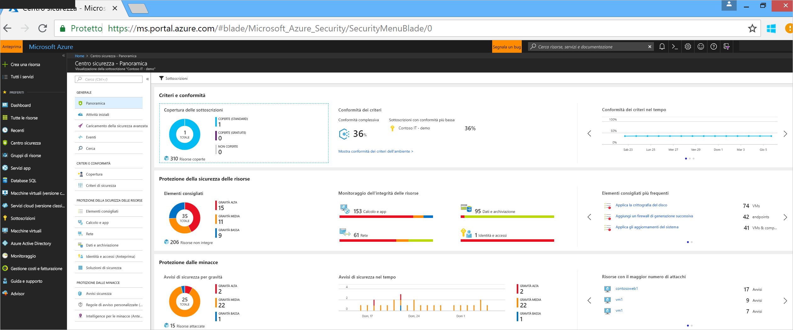
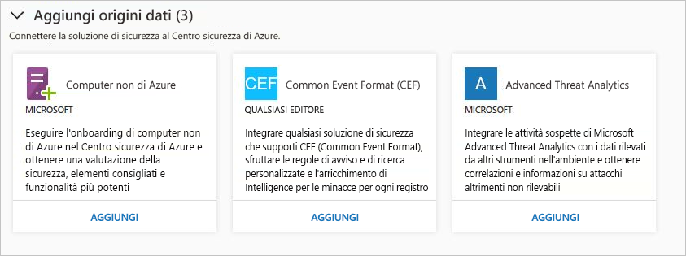
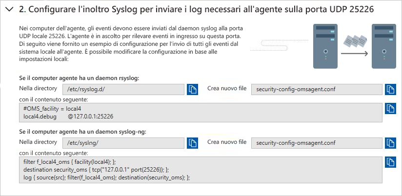
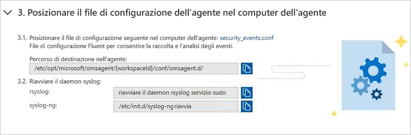
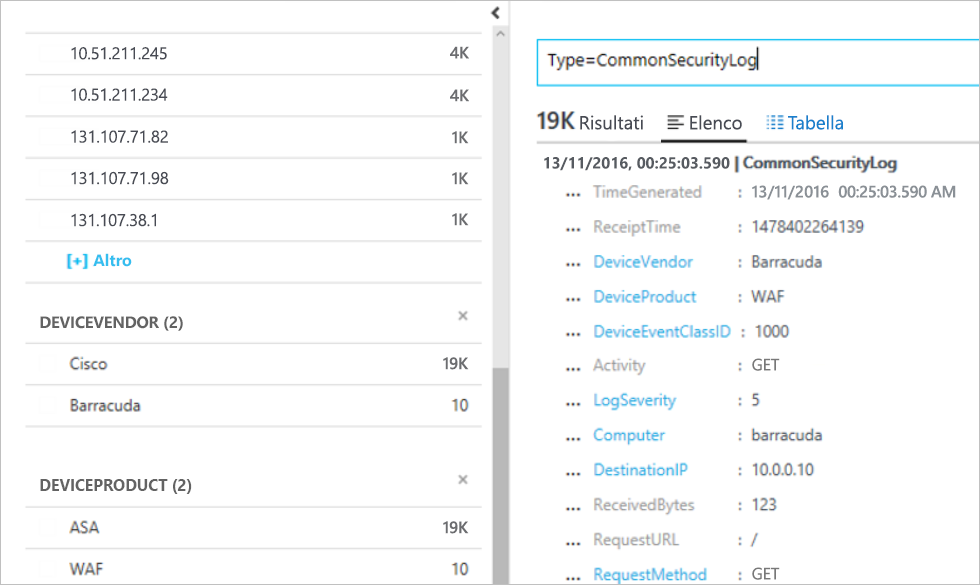

# Guida introduttiva: Connettere soluzioni di sicurezza al Centro sicurezza

Oltre a raccogliere dati di sicurezza dai computer, è possibile integrare dati di sicurezza da una serie di altre soluzioni di sicurezza, incluse quelle che supportano Common Event Format (CEF). Common Event Format (CEF) è un formato standard di settore applicato ai messaggi Syslog, usato da molti fornitori di soluzioni per la sicurezza per consentire l'integrazione degli eventi tra diverse piattaforme.

Questa guida introduttiva illustra come effettuare le operazioni seguenti:
- Connettere una soluzione di sicurezza al Centro sicurezza usando i log di CEF
- Convalidare la connessione alla soluzione di sicurezza

## Prerequisiti
Per iniziare a usare Centro sicurezza, è necessario avere una sottoscrizione di Microsoft Azure. Se non si ha una sottoscrizione, è possibile ottenere un [account gratuito](https://azure.microsoft.com/free/).

Per usare questa guida introduttiva è necessario il piano tariffario Standard del Centro sicurezza. È possibile provare gratuitamente il livello Standard del Centro sicurezza per i primi 60 giorni. La [Guida introduttiva per il Centro sicurezza di Azure ](security-center-get-started.md) illustra come eseguire l'aggiornamento al livello Standard.

È anche necessario un [computer Linux](https://docs.microsoft.com/azure/log-analytics/log-analytics-agent-linux) con il servizio Syslog già connesso al Centro sicurezza.

## Connettere la soluzione usando CEF

1. Accedere al [portale di Azure](https://azure.microsoft.com/features/azure-portal/).
2. Scegliere **Centro sicurezza** dal menu **Microsoft Azure**. Si apre **Centro sicurezza - Panoramica**.

      

3. Selezionare **Soluzioni di sicurezza** nel menu principale del Centro sicurezza.
4. In **Aggiungi origini dati (3)** nella pagina Soluzioni di sicurezza, fare clic su **Aggiungi** nell'area **Common Event Format**.

    

5. Nella pagina Log Common Event Format espandere il secondo passaggio, ovvero **Configurare l'inoltro Syslog per inviare i log necessari all'agente sulla porta UDP 25226**, e seguire queste istruzioni nel computer Linux:

    

6. Espandere il terzo passaggio, ovvero **Salvare il file di configurazione dell'agente nel computer dell'agente**, e seguire queste istruzioni nel computer Linux:

    

7. Espandere il quarto passaggio, ovvero **Riavvia il daemon syslog e l'agente**, e seguire queste istruzioni nel computer Linux:

    

## Convalidare la connessione

Prima di procedere con i passaggi seguenti è necessario attendere che il Syslog inizi a inviare report al Centro sicurezza. Questa operazione può richiedere del tempo, in funzione delle dimensioni dell'ambiente.

1.  Nel riquadro sinistro del dashboard del Centro sicurezza fare clic su **Cerca**.
2.  Selezionare l'area di lavoro alla quale è connesso Syslog (computer Linux).
3.  Digitare *CommonSecurityLog* e fare clic sul pulsante **Cerca**.

L'esempio seguente mostra il risultato di questi passaggi: 

## Pulire le risorse
Altre guide introduttive ed esercitazioni della raccolta si basano su questa. Se si prevede di usare le guide introduttive e le esercitazioni successive, continuare a eseguire il livello Standard e tenere abilitato il provisioning automatico. Se non si intende proseguire oppure si vuole tornare al livello gratuito:

1. Tornare al menu principale del Centro sicurezza e selezionare **Criteri di sicurezza**.
2. Selezionare la sottoscrizione o i criteri per i quali si vuole tornare al livello gratuito. Si aprirà **Criteri di sicurezza**.
3. In **COMPONENTI DEI CRITERI** selezionare **Piano tariffario**.
4. Selezionare **Gratuito** per modificare il livello della sottoscrizione da Standard a Gratuito.
5. Selezionare **Salva**.

Se si vuole disabilitare il provisioning automatico:

1. Tornare al menu principale del Centro sicurezza e selezionare **Criteri di sicurezza**.
2. Selezionare la sottoscrizione per cui si desidera disabilitare il provisioning automatico.
3. In **Criteri di sicurezza - Raccolta dati** selezionare **No** in **Onboarding** per disabilitare il provisioning automatico.
4. Selezionare **Salva**.

>[!NOTE]
> La disabilitazione del provisioning automatico non rimuove Microsoft Monitoring Agent dalle macchine virtuali di Azure in cui è stato eseguito il provisioning dell'agente. La disabilitazione automatica del provisioning limita il monitoraggio delle risorse.
>

## Passaggi successivi
In questa guida introduttiva si è appreso come connettere una soluzione Syslog Linux al Centro sicurezza usando CEF. Connettendo i log CEF al Centro sicurezza è possibile sfruttare i vantaggi delle funzionalità di ricerca, regole di avviso personalizzate e intelligence per le minacce per ogni log. Per altre informazioni su come usare il Centro sicurezza, continuare con l'esercitazione per configurare i criteri di sicurezza e valutare la sicurezza delle risorse.

> [!div class="nextstepaction"]
> [Esercitazione: Definire e valutare i criteri di sicurezza](./tutorial-security-policy.md)
