# Avvisi di sicurezza per tipo nel Centro sicurezza di Azure
Questo documento consente di comprendere i diversi tipi di avvisi di sicurezza disponibili nel Centro sicurezza di Azure. Per altre informazioni sulla gestione degli avvisi, vedere [Gestione e risposta agli avvisi di sicurezza nel Centro sicurezza di Azure](security-center-managing-and-responding-alerts.md) .

> [!NOTE]
> Per abilitare le funzionalità di rilevamento avanzato, eseguire l'aggiornamento al livello Standard del Centro sicurezza di Azure. È disponibile una versione di valutazione gratuita di 90 giorni. Per eseguire l'aggiornamento, selezionare il piano tariffario nei [criteri di sicurezza](security-center-policies.md). Per altre informazioni, vedere la [pagina dei prezzi](https://azure.microsoft.com/pricing/details/security-center/) .
>
>

## Quali tipi di avvisi sono disponibili?
Centro sicurezza di Azure offre una serie di avvisi in linea con le fasi delle catene di attacco. La figura seguente illustra alcuni esempi di diversi avvisi relativi ad alcune di queste fasi.

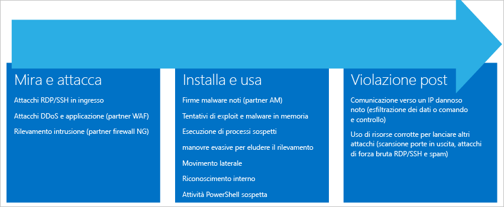

**Puntamento e attacco**

* Attacchi RDP o SSH in ingresso
* Attacchi DDoS e ad applicazioni (partner WAF)
* Rilevamento delle intrusioni (partner NG Firewall)

**Installazione ed exploit**

* Firme di malware note (partner AM)
* Tentativi di exploit e malware in memoria
* Esecuzione di processo sospetto
* Azioni evasive per evitare l'individuazione
* Spostamento laterale
* Ricognizione interna
* Attività PowerShell sospetta

**Post-violazione**  

* Comunicazione a un IP dannoso noto (esfiltrazione dei dati o comando e controllo)
* Uso delle risorse compromesse per sferrare altri attacchi (attacchi di forza bruta RDP/SSH di scansione di porte in uscita e posta indesiderata)

Diversi tipi di attacchi sono associati a ogni fase e colpiscono sottosistemi differenti. Per intervenire sugli attacchi in queste fasi, il Centro sicurezza offre tre categorie di avvisi:

* Analisi del comportamento delle macchine virtuali (VMBA)
* Analisi di rete
* Analisi delle risorse

## Analisi del comportamento delle macchine virtuali
Il Centro sicurezza di Azure può usare le analisi del comportamento per identificare le risorse compromesse in base all'analisi del registro eventi delle macchine virtuali, ad esempio eventi di creazione di processi, eventi di accesso e così via. Esiste inoltre una correlazione con altri segnali per verificare la presenza di elementi a riprova di una campagna su larga scala.

> [!NOTE]
> Per altre informazioni sulle funzionalità di rilevamento del Centro sicurezza, vedere [Funzionalità di rilevamento del Centro sicurezza di Azure](security-center-detection-capabilities.md).
>
>

### Analisi degli arresti anomali
L'analisi della memoria del dump di arresto anomalo è un metodo usato per rilevare malware sofisticato in grado di eludere le soluzioni di sicurezza tradizionali. Varie forme di malware provano a ridurre le probabilità di essere rilevate dai prodotti antivirus non scrivendo mai sul disco oppure crittografando i componenti software scritti sul disco. Ciò rende il malware difficile da rilevare con gli approcci antimalware tradizionali. Il malware può essere tuttavia rilevato tramite l'analisi della memoria, perché per funzionare il malware deve lasciare tracce in memoria.

Quando il software si arresta in modo anomalo, un dump di arresto anomalo acquisisce una porzione della memoria al momento dell'arresto. L'arresto anomalo può essere causato da malware o da problemi generali del sistema o delle applicazioni. Analizzando la memoria nel dump di arresto anomalo, il Centro sicurezza può rilevare le tecniche usate per sfruttare le vulnerabilità del software, accedere ai dati riservati e rimanere permanentemente all'interno di un computer infetto in modo furtivo. Questa operazione viene eseguita con un impatto minimo sulle prestazioni degli host perché l'analisi viene eseguita dal Centro sicurezza in back-end.

Questi campi sono comuni agli avvisi dell'analisi del dump di arresto anomalo elencati di seguito:

* DUMPFILE (FILE DUMP): nome del file di dump di arresto anomalo del sistema
* PROCESSNAME (NOME PROCESSO): nome del processo bloccato
* PROCESSVERSION (VERSIONE PROCESSO): versione del processo bloccato

### Individuato attacco shellcode
Uno shellcode è il payload che viene eseguito dopo che il malware ha sfruttato una vulnerabilità del software. Questo avviso indica che l'analisi di dump di arresto anomalo del sistema ha rilevato codice eseguibile che presenta un comportamento comunemente adottato dai payload dannosi. Sebbene anche il software non dannoso possa mostrare comportamenti simili, questo non fa generalmente parte delle normali procedure di sviluppo software.

Questo avviso fornisce il campo aggiuntivo seguente:

* ADDRESS (INDIRIZZO): posizione in memoria dello shellcode

Esempio di questo tipo di avviso:

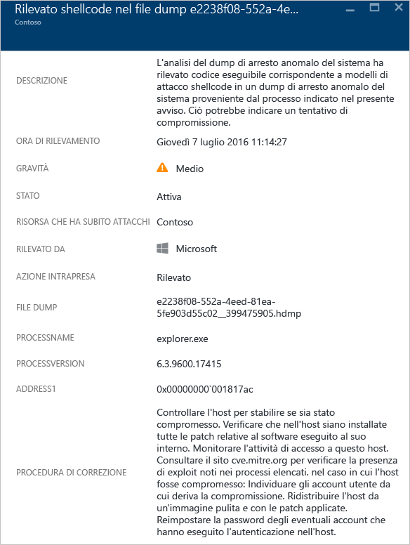

### Individuato hijack del modulo
Windows si basa sulle librerie a collegamento dinamico (DLL) per consentire al software di usare funzionalità del sistema di Windows comuni. L'hijack della DLL si verifica quando il malware modifica l'ordine di caricamento della DLL per caricare payload dannosi in memoria, dove è possibile eseguire codice arbitrario. Questo avviso indica che l'analisi di dump di arresto anomalo del sistema ha rilevato un modulo con un nome simile caricato da due percorsi diversi, dove uno dei percorsi caricati proviene da un percorso binario del sistema Windows comune.

Gli sviluppatori di software legittimo cambiano occasionalmente l'ordine di caricamento della DLL per motivi non dannosi, ad esempio per instrumentare o estendere il sistema operativo Windows o le applicazioni Windows. Per distinguere le modifiche dannose da quelle potenzialmente non dannose all'ordine di caricamento della DLL, il Centro sicurezza di Azure verifica se un modulo caricato corrisponde o meno a un profilo sospetto. Il risultato di questa verifica è indicato dal campo "SIGNATURE" (FIRMA) dell'avviso e si riflette nella gravità dell'avviso, nella descrizione dell'avviso e nella procedura di correzione dell'avviso. L'analisi della copia su disco del modulo di hijack, ad esempio tramite la verifica della firma digitale dei file o l'esecuzione di un'analisi antivirus, può fornire altre informazioni in merito alla natura legittima o dannosa del modulo di hijack.

Oltre ai campi comuni descritti nella sezione "Individuato shellcode" precedente, questo avviso presenta i campi seguenti:

* SIGNATURE (FIRMA): indica se il modulo di hijack corrisponde a un profilo di comportamento sospetto
* HIJACKEDMODULE (MODULO CONTROLLATO): nome del modulo di sistema Windows di cui è stato assunto il controllo
* HIJACKEDMODULEPATH (PERCORSO MODULO CONTROLLATO): percorso del modulo di sistema Windows di cui è stato assunto il controllo
* HIJACKINGMODULEPATH (PERCORSO MODULO HIJACK): percorso del modulo di hijack

Esempio di questo tipo di avviso:

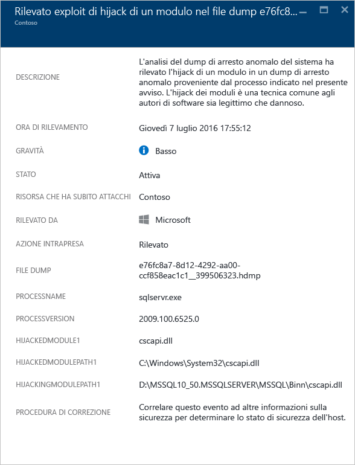

### Rilevato modulo Windows mascherato
Il malware può usare nomi comuni di file binari di sistema Windows, ad esempio SVCHOST.EXE, oppure moduli, come NTDLL.DLL, per mimetizzarsi e nascondere la natura del software dannoso agli amministratori di sistema. Questo avviso indica che l'analisi di dump di arresto anomalo del sistema ha rilevato che il file di dump di arresto anomalo del sistema contiene moduli che usano nomi di moduli di sistema Windows ma che non soddisfano i criteri tipici dei moduli di Windows. L'analisi della copia su disco del modulo mascherato può fornire altre informazioni in merito alla natura legittima o dannosa di questo modulo. L'analisi può includere:

* La conferma che indica che il file in questione è incluso in un pacchetto software legittimo
* La verifica della firma digitale del file
* L'esecuzione dell'analisi antivirus sul file

Oltre ai campi comuni descritti nella sezione "Individuato shellcode" precedente, questo avviso presenta i campi aggiuntivi seguenti:

* DETAILS (DETTAGLI): descrive se i metadati dei moduli sono validi e se il modulo è stato caricato da un percorso di sistema.
* NAME (NOME): nome del modulo di Windows mascherato
* PATH (PERCORSO): percorso del modulo di Windows mascherato.

Questo avviso, inoltre, estrae e visualizza determinati campi dell'intestazione del modulo PE, ad esempio "CHECKSUM" e "TIMESTAMP". Questi campi vengono visualizzati solo se sono presenti nel modulo. Per informazioni dettagliate su questi campi, vedere il documento [Microsoft PE and COFF Specification](https://msdn.microsoft.com/windows/hardware/gg463119.aspx) (Specifica dei formati PE e COFF Microsoft).

Esempio di questo tipo di avviso:

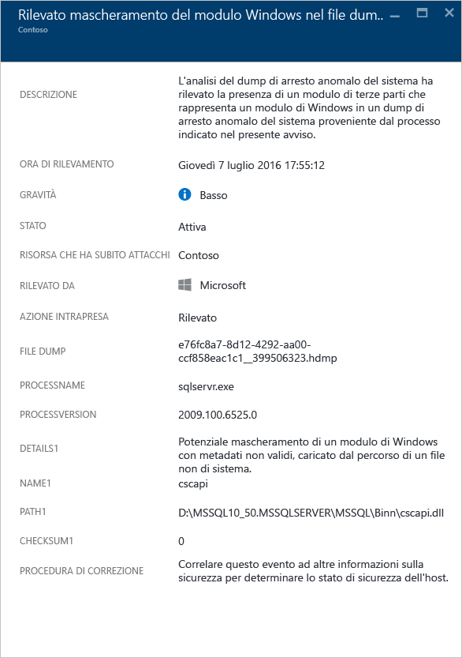

### Individuato file binario di sistema modificato
Il malware può modificare i file binari del sistema di base per accedere di nascosto ai dati o per essere furtivamente salvato in modo permanente in un sistema compromesso. Questo avviso indica che l'analisi di dump di arresto anomalo del sistema ha rilevato che i file binari del sistema operativo Windows di base sono stati modificati in memoria o su disco.
Gli sviluppatori di software legittimo modificano occasionalmente i moduli del sistema in memoria per motivi non dannosi, ad esempio per il pacchetto Detours o per la compatibilità delle applicazioni. Per distinguere i moduli dannosi da quelli potenzialmente legittimi, il Centro sicurezza di Azure verifica se un modulo caricato corrisponde o meno a un profilo sospetto. Il risultato di questa verifica si riflette nella gravità dell'avviso, nella descrizione dell'avviso e nella procedura di correzione dell'avviso.

Oltre ai campi comuni descritti nella sezione "Individuato shellcode" precedente, questo avviso presenta i campi aggiuntivi seguenti:

* MODULENAME (NOME MODULO): nome del file binario di sistema modificato
* MODULEVERSION (VERSIONE MODULO): versione del file binario di sistema modificato

Esempio di questo tipo di avviso:

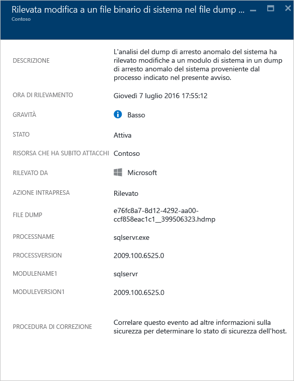

### Processo sospetto eseguito
Centro sicurezza identifica il processo sospetto in esecuzione nella macchina virtuale di destinazione e attiva un avviso. Il rilevamento non avviene in base al nome specifico, ma in base al parametro, quindi anche se l'autore dell'attacco rinomina il file eseguibile, Centro sicurezza è comunque in grado di eseguire il rilevamento.

Esempio di questo tipo di avviso:

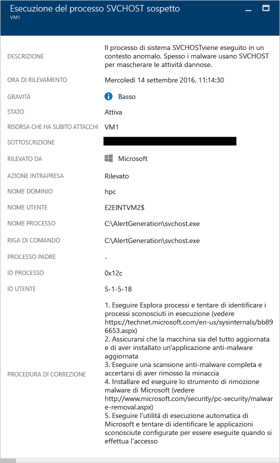

### Tentativi ripetuti di query sugli account di dominio
Centro sicurezza può rilevare tentativi di query ripetuti sugli account di dominio, attività in genere eseguita dagli utenti malintenzionati durante la ricognizione della rete. Gli utenti malintenzionati possono sfruttare questa tecnica per eseguire query sul dominio e identificare gli utenti, gli account di amministrazione del dominio, i computer che fungono da controller di dominio e anche potenziali relazioni di trust di dominio con altri domini.

Esempio di questo tipo di avviso:

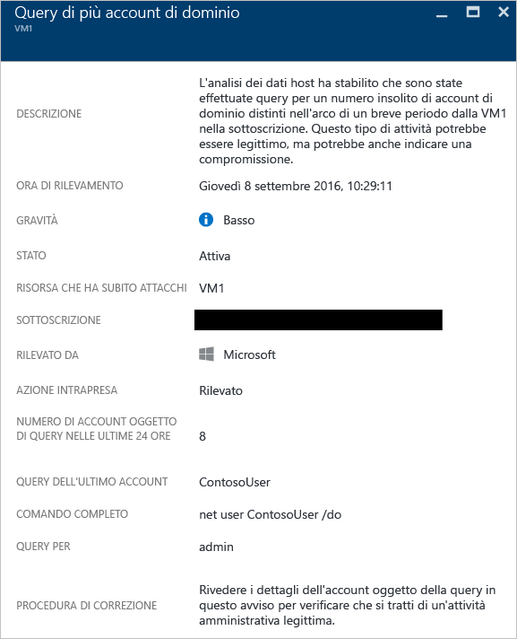

## Analisi di rete
Il sistema di rilevamento delle minacce di rete del Centro sicurezza funziona mediante la raccolta automatica di informazioni sulla sicurezza dal traffico IPFIX (Internet Protocol Flow Information Export) di Azure. Per identificare le minacce, analizza queste informazioni, correlando spesso quelle raccolte da più origini.

### Rilevamento di traffico in uscita sospetto
I dispositivi di rete possono essere individuati e profilati così come altri tipi di sistemi. L'attacco ha in genere inizio con la scansione o la scansione sistematica delle porte. Nell'esempio di seguito è presente un traffico SSH sospetto da una VM che può eseguire un attacco di scansione sistematica delle porte o di forza bruta SSH contro una risorsa esterna.

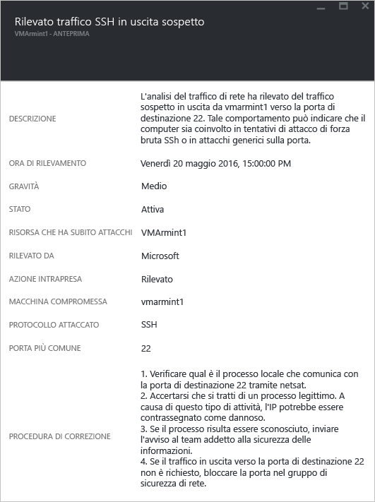

L'avviso contiene informazioni che consentono di identificare la risorsa usata per avviare l'attacco, il computer compromesso, la data e l'ora di rilevamento, il protocollo e la porta usata. Il pannello contiene anche un elenco dei passaggi di correzione che possono essere usati per attenuare il problema.

### Comunicazione di rete con un computer dannoso
Sfruttando i feed di intelligence per le minacce di Microsoft, il Centro sicurezza di Azure può rilevare i computer compromessi che comunicano con indirizzi IP dannosi, corrispondenti in molti casi a un centro di comando e controllo. In questo caso, il Centro sicurezza di Azure ha rilevato la comunicazione con il malware Pony Loader, noto anche come [Fareit](https://www.microsoft.com/security/portal/threat/encyclopedia/entry.aspx?Name=PWS:Win32/Fareit.AF).

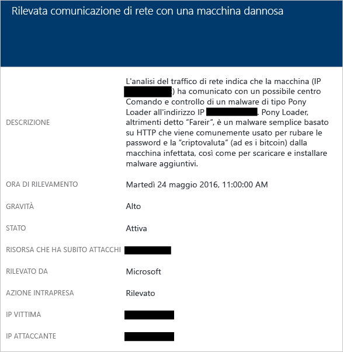

L'avviso contiene informazioni che consentono di identificare la risorsa usata per avviare l'attacco, la risorsa che ha subito attacchi, l'IP vittima, l'IP dell'utente malintenzionato e la data e l'ora di rilevamento.

> [!NOTE]
> Gli indirizzi IP attivi sono stati rimossi dallo screenshot per motivi di privacy.
>
>

### Rilevato possibile attacco Denial of Service in uscita
Il traffico di rete anomalo generato da una macchina virtuale può indurre il Centro sicurezza ad attivare un avviso di potenziale attacco Denial of Service.

Esempio di questo tipo di avviso:

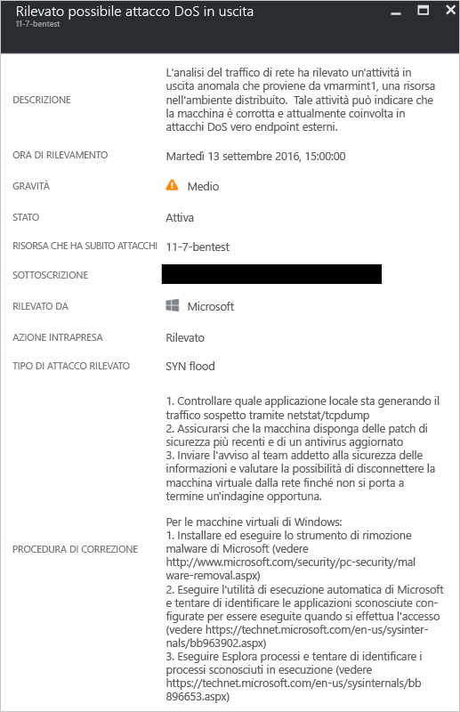

## Analisi delle risorse
L'analisi delle risorse del Centro sicurezza si concentra sui servizi PaaS, ad esempio l'integrazione con la funzione di [rilevamento delle minacce nel database SQL di Azure](../sql-database/sql-database-threat-detection.md). In base ai risultati dell'analisi di queste aree, Centro sicurezza attiva un avviso correlato alle risorse.

### Potenziale attacco SQL injection
In un attacco SQL injection, il malware viene inserito in stringhe che vengono successivamente passate a un'istanza di SQL Server per l'analisi e l'esecuzione. È consigliabile verificare la presenza di vulnerabilità a questo tipo di attacco in qualsiasi procedura che crea istruzioni SQL, perché SQL Server esegue tutte le query sintatticamente valide che riceve. Il rilevamento delle minacce SQL usa Machine Learning, l'analisi del comportamento e il rilevamento delle anomalie per individuare eventi sospetti che possono verificarsi nei database SQL di Azure. Ad esempio:

* Tentativo di accesso al database da parte di un ex dipendente
* Attacchi SQL injection
* Accesso insolito al database di produzione da parte di un utente da casa

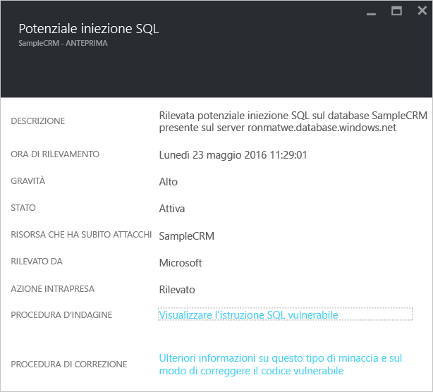

L'avviso contiene informazioni che consentono di identificare la risorsa che ha subito attacchi, la data e l'ora di rilevamento e lo stato dell'attacco, nonché un collegamento ad altri passaggi di analisi.

### Vulnerabilità agli attacchi SQL injection
Questo avviso viene generato quando viene rilevato un errore di applicazione in un database che potrebbe indicare una vulnerabilità ad attacchi SQL injection.

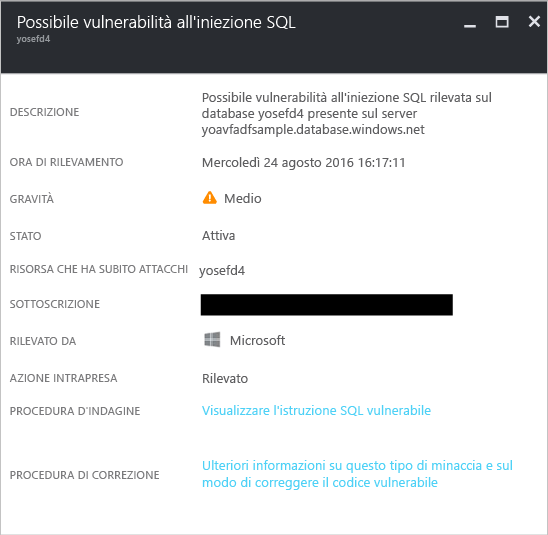

### Accesso da posizione insolita
Questo avviso viene generato quando nel server è stato rilevato un accesso da un indirizzo IP insolito non osservato nell'ultimo periodo.

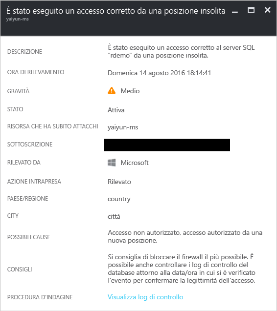

## Vedere anche
In questo documento sono stati descritti i diversi tipi di avvisi di sicurezza del Centro sicurezza. Per altre informazioni sul Centro sicurezza, vedere gli argomenti seguenti:

* [Gestione degli eventi imprevisti della sicurezza nel Centro sicurezza di Azure](security-center-incident.md)
* [Funzionalità di rilevamento del Centro sicurezza di Azure](security-center-detection-capabilities.md)
* [Guida alla pianificazione e alla gestione del Centro sicurezza di Azure](security-center-planning-and-operations-guide.md)
* [Domande frequenti sul Centro sicurezza di Azure](security-center-faq.md) : domande frequenti sull'uso del servizio.
* [Blog sulla sicurezza di Azure](http://blogs.msdn.com/b/azuresecurity/) : post di blog sulla sicurezza e sulla conformità di Azure.

