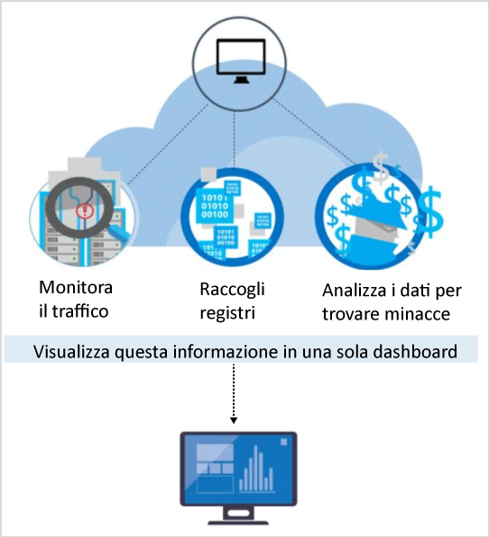

# Funzionalità di rilevamento del Centro sicurezza di Azure
Questo documento illustra le funzionalità di rilevamento avanzate del Centro sicurezza di Azure, che consentono di identificare le minacce attive rivolte alle risorse di Microsoft Azure e fornisce le informazioni dettagliate necessarie per rispondere rapidamente a tali minacce.

Il piano Standard del Centro sicurezza di Azure include funzionalità di rilevamento avanzate. È disponibile una versione di valutazione gratuita di 60 giorni. È possibile eseguire l'aggiornamento dal piano tariffario selezionato in [Criteri di sicurezza](security-center-policies.md). Per altre informazioni sui prezzi, vedere la [pagina del Centro sicurezza](https://azure.microsoft.com/pricing/details/security-center/) . 

> [!NOTE]
> Il Centro sicurezza ha rilasciato un'anteprima limitata di un nuovo set di strumenti di rilevamento, che sfruttano i record di controllo, un framework di controllo comune, per rilevare comportamenti dannosi nei computer Linux. Inviare un messaggio di posta elettronica con l'ID sottoscrizione a [Microsoft](mailto:ASC_linuxdetections@microsoft.com) per accedere all'anteprima.

## Rispondere alle minacce attuali
Negli ultimi 20 anni sono state introdotte modifiche significative nel panorama delle minacce . In passato, le aziende dovevano in genere preoccuparsi solo del danneggiamento del sito Web da parte di singoli utenti malintenzionati, interessati soprattutto a "provare cosa potevano fare". Oggi gli utenti malintenzionati sono molto più sofisticati e organizzati. Hanno spesso obiettivi finanziari e strategici specifici, inoltre hanno a disposizione più risorse, perché possono essere finanziati da stati o da organizzazioni criminali.

Questo approccio ha portato a un livello di professionalità senza precedenti nelle schiere di utenti malintenzionati. Non sono più interessati al danneggiamento del Web. Ora sono interessati al furto di informazioni, conti finanziari e dati privati, che possono usare per generare liquidità nel mercato aperto o per sfruttare una particolare posizione aziendale, politica o militare. Ancora più preoccupanti di quelli con un obiettivo finanziario sono gli utenti malintenzionati che violano le reti per danneggiare l'infrastruttura e le persone.

Per rispondere a questa situazione, le organizzazioni distribuiscono spesso varie soluzioni specifiche, concentrandosi sulla difesa del perimetro o degli endpoint dell'organizzazione attraverso la ricerca delle firme di attacchi noti. Queste soluzioni tendono a generare un numero elevato di avvisi con un basso livello di affidabilità, che richiedono l'intervento di un analista di sicurezza per la valutazione e l'analisi. La maggior parte delle organizzazioni non ha il tempo e le competenze che servono per rispondere a questi avvisi, quindi molti rimangono senza risposta.  Nel frattempo, gli utenti malintenzionati hanno cambiato i metodi di attacco, per compromettere molte difese basate sulle firme e [adattarsi agli ambienti cloud](https://azure.microsoft.com/blog/detecting-threats-with-azure-security-center/). Per identificare le minacce emergenti più rapidamente e accelerare le operazioni di rilevamento e risposta, sono quindi necessari nuovi approcci. 

## Modalità di rilevamento e risposta alle minacce del Centro sicurezza di Azure
I ricercatori Microsoft nell'ambito della sicurezza sono costantemente impegnati nella ricerca delle minacce. Hanno accesso a un ampio set di dati di telemetria acquisiti grazie alla presenza globale di Microsoft nel cloud e in locale. Questa raccolta di set di dati di vasta portata e diversificata consente a Microsoft di individuare nuovi modelli di attacco e tendenze nei propri prodotti consumer e aziendali locali, nonché nei servizi online. Di conseguenza, il Centro sicurezza può aggiornare rapidamente gli algoritmi di rilevamento a fronte del rilascio di exploit nuovi e sofisticati da parte di utenti malintenzionati. Questo approccio consente di tenere il passo con un ambiente caratterizzato da minacce in rapida evoluzione. 

Il sistema di rilevamento delle minacce del Centro sicurezza funziona mediante la raccolta automatica di informazioni sulla sicurezza dalle risorse di Azure, dalla rete e dalle soluzioni dei partner connessi. Per identificare le minacce, analizza queste informazioni, correlando spesso quelle raccolte da più origini. Gli avvisi di sicurezza sono classificati in ordine di priorità nel Centro sicurezza insieme a indicazioni su come su correggere la minaccia.

Il Centro sicurezza si avvale di analisi della sicurezza avanzate, che vanno ben oltre gli approcci basati sulle firme. I progressi tecnologici in ambito Big Data e [Machine Learning](https://azure.microsoft.com/blog/machine-learning-in-azure-security-center/) vengono sfruttati per valutare gli eventi nell'intera l'infrastruttura cloud, rilevando minacce che sarebbe impossibile identificare con approcci manuali e stimando l'evoluzione degli attacchi. Queste analisi della sicurezza includono: 

* **Intelligence per le minacce integrata**: cerca gli attori dannosi noti sfruttando le informazioni sulle minacce globali da prodotti e servizi Microsoft, Microsoft Digital Crimes Unit (DCU) e Microsoft Security Response Center (MSRC), nonché da feed esterni.
* **Analisi del comportamento**: applica i modelli noti per individuare comportamenti dannosi. 
* **Rilevamento anomalie**: usa la tecnica di profilatura statistica per creare una baseline cronologica. Genera avvisi sulle deviazioni dalle baseline stabilite che risultano conformi a un potenziale vettore di attacco .

### Intelligence per le minacce
Microsoft vanta un'enorme quantità di dati di intelligence per le minacce globali. Il flusso di dati di telemetria proviene da più origini, ad esempio Azure, Office 365, Microsoft CRM Online, Microsoft Dynamics AX, outlook.com, MSN.com, Microsoft Digital Crimes Unit (DCU) e Microsoft Security Response Center (MSRC). I ricercatori ricevono anche informazioni di intelligence per le minacce condivise tra i principali provider di servizi cloud e sottoscrivono i feed di terze parti di intelligence per le minacce. Il Centro sicurezza di Azure usa queste informazioni per avvisare gli utenti nel caso di minacce provenienti da attori dannosi noti. Di seguito sono riportati alcuni esempi:

* **Comunicazioni in uscita a un indirizzo IP dannoso**: il traffico in uscita a un botnet o una darknet nota indica probabilmente che la risorsa è stata compromessa e un utente malintenzionato tenta di eseguire comandi nel sistema o di sottrarre dati. Il Centro sicurezza di Azure confronta il traffico di rete con il database Microsoft delle minacce globali e avvisa gli utenti se rileva una comunicazione verso un indirizzo IP dannoso.

## Analisi del comportamento
L'analisi del comportamento è una tecnica che analizza e confronta i dati con una raccolta di modelli noti. Tuttavia, questi modelli non sono semplici firme. Sono determinati usando algoritmi di Machine Learning complessi applicati a set di dati di grandi dimensioni. Sono anche definiti tramite l'attento esame di comportamenti dannosi da parte di analisti esperti. Il Centro sicurezza di Azure può usare le analisi del comportamento per identificare le risorse compromesse in base all'analisi dei log delle macchine virtuali, dei dispositivi di rete virtuale, dell'infrastruttura, nonché dei dump di arresto anomalo del sistema e di altre origini. 

Esiste inoltre una correlazione con altri segnali per verificare la presenza di elementi a riprova di una campagna su larga scala. La correlazione consente di identificare gli eventi che risultano coerenti con gli indicatori di violazione stabiliti. Di seguito sono riportati alcuni esempi:

* **Esecuzione di processi sospetti**: gli utenti malintenzionati usano diverse tecniche per eseguire software dannoso senza che venga rilevato. Ad esempio, un utente malintenzionato potrebbe assegnare al malware gli stessi nomi di file di sistema legittimi, inserendo però questi file in percorsi alternativi, usare un nome molto simile a un file innocuo o mascherare la vera estensione del file. I modelli del Centro sicurezza elaborano i comportamenti e monitorano l'esecuzione dei processi per rilevare outlier come questi.  
* **Malware nascosto e tentativi di exploit**: il malware sofisticato è in grado di eludere i prodotti antimalware tradizionali, non scrivendo mai su disco o crittografando i componenti software archiviati su disco.  Tuttavia, il malware può essere rilevato tramite l'analisi della memoria, perché per funzionare il malware deve lasciare tracce in memoria. Quando il software si arresta in modo anomalo, un dump di arresto anomalo acquisisce una porzione della memoria al momento dell'arresto.  Analizzando la memoria nel dump di arresto anomalo, il Centro sicurezza di Azure può rilevare le tecniche usate per sfruttare le vulnerabilità del software, accedere ai dati riservati e rimanere permanentemente all'interno di un computer infetto in modo furtivo senza influire sulle relative prestazioni.
* **Spostamento laterale e ricognizione interna**: per rimanere permanentemente all'interno di una rete compromessa e individuare/raccogliere dati importanti, gli utenti malintenzionati provano spesso a muoversi lateralmente dal computer compromesso spostandosi in altri computer all'interno della stessa rete. Il Centro sicurezza consente di monitorare le attività di elaborazione e accesso per individuare i tentativi di espansione del punto di appoggio di un utente malintenzionato all'interno della rete, ad esempio il probing della rete per individuare l'esecuzione di comandi remoti e l'enumerazione di account.
* **Script PowerShell dannosi**: PowerShell viene usato da utenti malintenzionati per eseguire codice dannoso in macchine virtuali di destinazione per molteplici scopi. Il Centro sicurezza ispeziona l'attività di PowerShell alla ricerca di prove di attività sospette. 
* **Attacchi in uscita**: gli utenti malintenzionati attaccano spesso le risorse cloud con l'obiettivo di usarle per organizzare altri attacchi. Le macchine virtuali compromesse, ad esempio, possono essere usate per sferrare attacchi di forza bruta contro altre macchine virtuali, inviare posta indesiderata o analizzare le porte aperte e altri dispositivi su Internet. Applicando le tecniche di apprendimento automatico al traffico di rete, il Centro sicurezza può rilevare quando le comunicazioni di rete in uscita superano la norma. Nel caso di posta indesiderata, il Centro sicurezza correla anche il traffico di posta elettronica insolito con le informazioni di Office 365 per determinare se la posta elettronica è probabilmente dannosa o il risultato di una campagna di posta elettronica legittima.  

### Rilevamento anomalie
Il Centro sicurezza di Azure usa inoltre il rilevamento anomalie per identificare le minacce. A differenza dell'analisi del comportamento, che dipende da modelli noti derivati da set di dati di grandi dimensioni, il rilevamento anomalie è più "personalizzato" e incentrato sulle baseline specifiche delle distribuzioni. Le tecniche di apprendimento automatico vengono applicate per determinare la normale attività per le distribuzioni dei clienti e quindi vengono generate regole per definire le condizioni degli outlier che possono rappresentare un evento di sicurezza. Ecco un esempio:

* **Attacchi di forza bruta RDP/SSH in ingresso**: nelle distribuzioni dei clienti possono essere presenti macchine virtuali occupate da molti accessi ogni giorno e altre con pochi o nessun accesso. Il Centro sicurezza di Azure può determinare l'attività di accesso di base per queste macchine virtuali e usare le tecniche di apprendimento automatico per definire gli eventi al di fuori della normale attività di accesso. Se il numero di accessi o l'ora del giorno degli accessi oppure la località da cui provengono le richieste di accesso o altre funzionalità correlate all'accesso sono significativamente diverse dalla baseline, è possibile che venga generato un avviso. Anche in questo caso, le tecniche di apprendimento automatico determinano gli eventi significativi.

## Monitoraggio continuo dell'intelligence per le minacce
Nel Centro sicurezza di Azure operano team dedicati alle ricerche sulla sicurezza e all'analisi scientifica dei dati che monitorano costantemente le modifiche che avvengono nel panorama delle minacce. Sono incluse le iniziative seguenti:

* **Monitoraggio dell'intelligence per le minacce**: questo tipo di intelligence include meccanismi, indicatori, implicazioni e consigli utili sulle minacce esistenti o emergenti. Queste informazioni sono condivise nella community sulla sicurezza e Microsoft monitora costantemente i feed di intelligence per le minacce da origini interne ed esterne.
* **Condivisione dei segnali**: le informazioni dettagliate dai team della sicurezza nell'ampio portfolio di servizi, server e dispositivi endpoint client locali e cloud di Microsoft vengono condivise e analizzate. 
* **Specialisti della sicurezza Microsoft**: in contatto costante con i team Microsoft che operano in ambiti di sicurezza specializzati, ad esempio analisi scientifiche e rilevamento di attacchi Web.
* **Ottimizzazione del rilevamento**: gli algoritmi vengono eseguiti su set di dati reali del cliente e ricercatori dedicati alla sicurezza collaborano con i clienti per convalidare i risultati. Per perfezionare gli algoritmi di Machine Learning vengono usati veri e falsi positivi.

Questi sforzi combinati convergono in rilevamenti nuovi e migliorati, da cui è possibile trarre vantaggio immediatamente, senza che sia richiesta alcuna azione.

## Vedere anche 
In questo documento si è appreso come utilizzare le funzionalità di monitoraggio nel Centro sicurezza di Azure. Per altre informazioni sul Centro sicurezza, vedere gli argomenti seguenti:

* [Guida alla pianificazione e alla gestione del Centro sicurezza di Azure](security-center-planning-and-operations-guide.md)
* [Gestione e risposta agli avvisi di sicurezza nel Centro sicurezza di Azure](security-center-managing-and-responding-alerts.md)
* [Avvisi di sicurezza per tipo nel Centro sicurezza di Azure](security-center-alerts-type.md)
* [Monitoraggio dell'integrità della sicurezza nel Centro sicurezza di Azure](security-center-monitoring.md) : informazioni su come monitorare l'integrità delle risorse di Azure.
* [Monitoraggio delle soluzioni dei partner con il Centro sicurezza di Azure](security-center-partner-solutions.md) : informazioni su come monitorare l'integrità delle soluzioni dei partner.
* [Domande frequenti sul Centro sicurezza di Azure](security-center-faq.md) : domande frequenti sull'uso del servizio.
* [Blog sulla sicurezza di Azure](http://blogs.msdn.com/b/azuresecurity/) : post di blog sulla sicurezza e sulla conformità di Azure.

