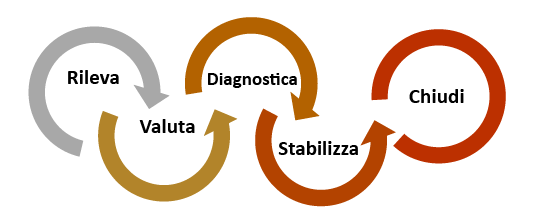
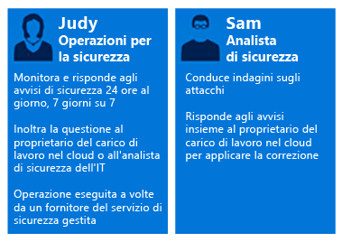
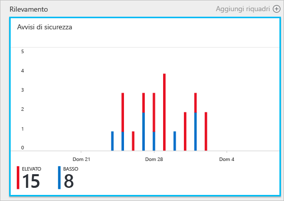
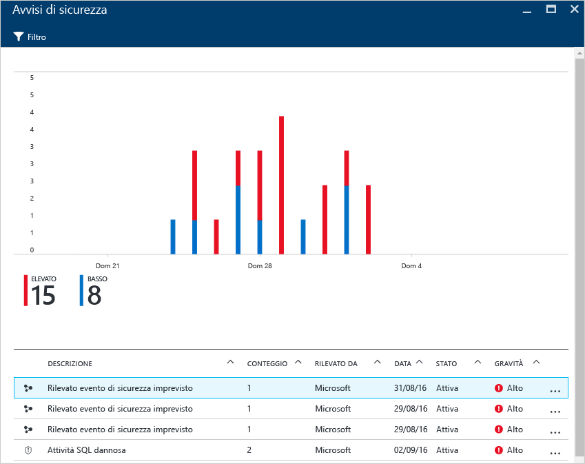
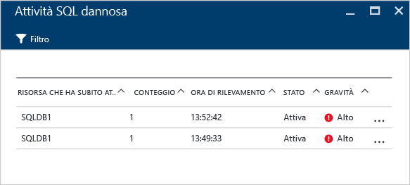
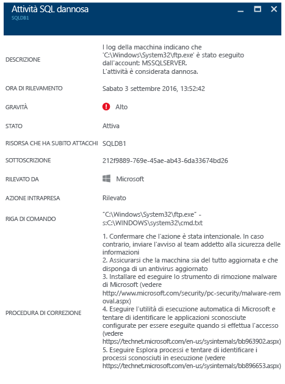

# Uso del Centro sicurezza di Azure per rispondere a un evento imprevisto
Molte organizzazioni imparano a rispondere agli eventi imprevisti della sicurezza solo dopo aver subito un attacco. Per ridurre i costi e i danni è importante implementare un piano di risposta agli eventi imprevisti prima di un attacco. Centro sicurezza di Azure può essere usato nelle diverse fasi della risposta agli eventi imprevisti.

## Pianificazione della risposta agli eventi imprevisti
Un piano efficace dipende da tre capacità principali: proteggere, rilevare e rispondere alle minacce. La protezione consiste nella prevenzione degli eventi imprevisti, il rilevamento nella tempestiva identificazione delle minacce e la risposta nella neutralizzazione di un utente malintenzionato con il conseguente ripristino dei sistemi per ridurre gli effetti della violazione.

Questo articolo usa le fasi di risposta agli eventi imprevisti della sicurezza illustrate nell'articolo [Microsoft Azure Security Response in the Cloud](https://gallery.technet.microsoft.com/Azure-Security-Response-in-dd18c678) (Centro sicurezza di Microsoft Azure nel cloud) e indicate nel diagramma seguente:

Il Centro sicurezza può essere usato nelle fasi di rilevamento, valutazione e diagnosi. Di seguito sono descritti esempi dell'utilità del Centro sicurezza nelle tre fasi di risposta iniziali agli eventi imprevisti della sicurezza:

* **Rilevamento**: esame della prima indicazione di un'analisi per un evento.
  * Esempio: esame della verifica iniziale dell'attivazione di un avviso di sicurezza ad alta priorità nel dashboard del Centro sicurezza.
* **Valutazione**: esecuzione della valutazione iniziale per ottenere altre informazioni sull'attività sospetta.
  * Esempio: recupero di altre informazioni sull'avviso di sicurezza.
* **Diagnosi**: conduzione di un'analisi tecnica, identificazione di strategie di contenimento, mitigazione e di soluzioni alternative.
  * Esempio: seguire la procedura correttiva descritta dal Centro sicurezza nell'avviso di sicurezza specifico.

Lo scenario che segue illustra come usare il Centro sicurezza durante le fasi di rilevamento, valutazione e diagnosi/risposta di un evento imprevisto della sicurezza. Nel Centro sicurezza, un [evento imprevisto della sicurezza](security-center-incident.md) è un'aggregazione di tutti gli avvisi relativi a una risorsa, in linea con i modelli delle [catene di attacco](https://blogs.technet.microsoft.com/office365security/addressing-your-cxos-top-five-cloud-security-concerns/). Gli eventi imprevisti vengono visualizzati nel riquadro e nel pannello [Avvisi di sicurezza](security-center-managing-and-responding-alerts.md). Un evento imprevisto riporta un elenco degli avvisi correlati, che consente di ottenere altre informazioni su ogni occorrenza. Centro sicurezza presenta anche avvisi di sicurezza autonomi che possono essere usati per rilevare un'attività sospetta.

## Scenario
Contoso ha recentemente eseguito la migrazione di alcune delle risorse locali in Azure, inclusi alcuni carichi di lavoro e database SQL di linea di business basati sulle macchine virtuali. Il team di risposta agli eventi imprevisti della sicurezza di Contoso ha attualmente difficoltà nell'analisi dei problemi di sicurezza, data la mancanza di una intelligence di sicurezza integrata con gli attuali strumenti di risposta agli eventi imprevisti. Questa mancata integrazione costituisce un problema durante la fase di rilevamento (troppi falsi positivi) e durante le fasi di valutazione e diagnosi. Nell'ambito di questa migrazione, il team ha deciso di ricorrere al Centro sicurezza per risolvere questo problema.

La prima fase della migrazione è stata completata dopo l'onboarding di tutte le risorse e l'adozione di tutte le raccomandazioni del Centro sicurezza. Il team di risposta agli eventi imprevisti della sicurezza di Contoso è il punto focale per la gestione degli eventi imprevisti della sicurezza relativi ai computer. Il team è costituito da un gruppo di persone responsabili della gestione di eventuali eventi imprevisti della sicurezza. I membri del team hanno mansioni chiaramente definite per garantire che vengano coperte tutte le aree della risposta.

Ai fini di questo scenario verranno presi in esame i ruoli degli utenti seguenti che appartengono al team di risposta agli eventi imprevisti della sicurezza di Contoso:

Alice si occupa delle attività di sicurezza. Le sue responsabilità includono:

* Monitoraggio e risposta alle minacce per la sicurezza&24; ore su&24;.
* Escalation al proprietario dei carichi di lavoro nel cloud o all'analista della sicurezza in base alle esigenze.

Guido è un analista della sicurezza e le sue responsabilità includono:

* Analisi degli attacchi.
* Risoluzione degli avvisi.
* Collaborazione con i proprietari dei carichi di lavoro per determinare e applicare soluzioni di mitigazione.

Come si può notare, Alice e Guido hanno responsabilità diverse e devono interagire tra loro per condividere le informazioni del Centro sicurezza.

## Soluzione consigliata
Avendo ruoli diversi, Alice e Guido useranno aree diverse del Centro sicurezza per ottenere informazioni attinenti alle proprie attività quotidiane. Alice userà gli **avvisi di sicurezza** nell'ambito delle attività di monitoraggio giornaliere.

Alice userà gli avvisi di sicurezza durante le fasi di rilevamento e valutazione. Quando avrà terminato la valutazione iniziale, Alice potrà inoltrare il problema a Guido, se sono necessarie altre analisi. Guido userà a questo punto le informazioni messe a disposizione dal Centro sicurezza, a volte in combinazione con altre fonti di dati, per passare alla fase di diagnosi.

## Come implementare questa soluzione
Per vedere come usare il Centro sicurezza di Azure in uno scenario di risposta agli eventi imprevisti della sicurezza, verranno seguite le attività di Alice nelle fasi di rilevamento e valutazione, quindi le attività svolte da Guido per la diagnosi del problema.

### Fasi di rilevamento e valutazione nella risposta agli eventi imprevisti della sicurezza
Alice ha effettuato l'accesso al portale di Azure e si trova nella console del Centro sicurezza. Nell'ambito delle proprie attività di monitoraggio giornaliere, ha iniziato a esaminare avvisi di sicurezza ad alta priorità seguendo questa procedura:

1. Fare clic sul riquadro **Avvisi di sicurezza** e accedere al pannello **Avvisi di sicurezza**.
    

   > [!NOTE]
   > Ai fini di questo scenario, Alice eseguirà la valutazione dell'avviso riguardante attività SQL dannose, come illustrato nella figura precedente.
   >
   >
2. Fare clic su **Malicious SQL Activity** (Attività SQL dannosa) ed esaminare le risorse che hanno subito l'attacco nel pannello **Malicious SQL Activity** (Attività SQL dannosa):  

    In questo pannello Alice può vedere le risorse che hanno subito l'attacco, quante volte si è verificato l'attacco e quando è stato rilevato.
3. Fare clic sulla **risorsa che ha subito l'attacco** per ottenere altre informazioni sull'attacco.

Dopo aver letto la descrizione, Alice è convinta che non si tratti di un falso positivo e che è necessario inoltrare questo caso a Guido.

### Fase di diagnosi nella risposta agli eventi imprevisti della sicurezza
Guido riceve il caso da Alice e inizia a esaminare la procedura correttiva consigliata dal Centro sicurezza.

### Risorse aggiuntive
Il team di risposta agli eventi imprevisti della sicurezza può anche usare la funzionalità [Power BI nel Centro sicurezza](security-center-powerbi.md) per visualizzare diversi tipi di report. Questi report possono essere utili durante un'analisi più approfondita per visualizzare, analizzare e filtrare raccomandazioni e avvisi di sicurezza. Le aziende che usano la propria soluzione SIEM (Security Information and Event Management, Sistema di gestione delle informazioni e degli eventi di sicurezza) durante il processo di analisi possono anche [integrare il Centro sicurezza con la propria soluzione](security-center-integrating-alerts-with-log-integration.md). È anche possibile integrare i log di controllo di Azure e gli eventi di sicurezza delle macchine virtuali con lo [strumento di integrazione dei log di Azure](https://blogs.msdn.microsoft.com/azuresecurity/2016/07/21/microsoft-azure-log-integration-preview/). Queste informazioni possono essere usate insieme a quelle messe a disposizione dal Centro sicurezza per analizzare un attacco.

## Conclusione
La creazione di un team prima che si verifichi un evento imprevisto è molto importante per l'organizzazione e avrà effetti positivi sulla gestione degli eventi imprevisti. Con gli strumenti giusti per monitorare le risorse, questo team potrà prendere provvedimenti mirati per la risoluzione di un evento imprevisto della sicurezza. Le [funzionalità di rilevamento](security-center-detection-capabilities.md) del Centro sicurezza consentono all'IT di rispondere rapidamente agli eventi imprevisti della sicurezza e di attuare interventi correttivi per i problemi di sicurezza.

<!--HONumber=Feb17_HO3-->

