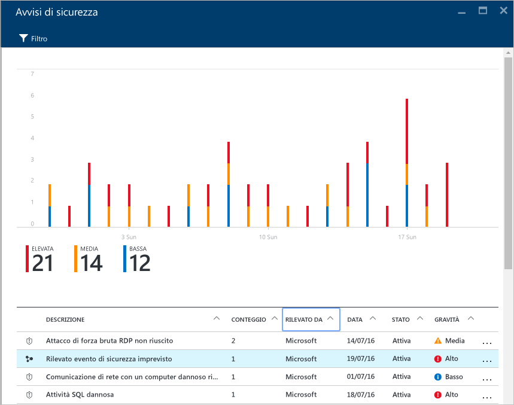
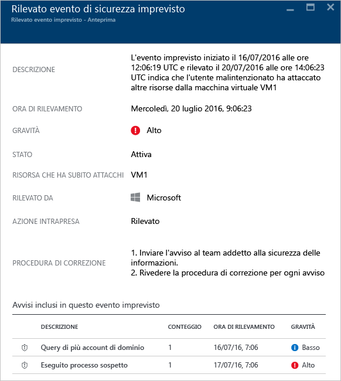
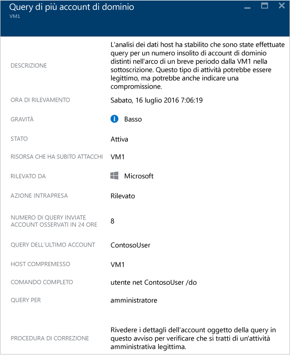

# Gestione degli eventi imprevisti della sicurezza nel Centro sicurezza di Azure
La valutazione e l'analisi degli avvisi di sicurezza possono essere dispendiose in termini di tempo anche per gli analisti della sicurezza più esperti e per molti è difficile addirittura stabilire da dove iniziare. Usando funzionalità di [analisi](security-center-detection-capabilities.md) per collegare le informazioni di [avvisi di sicurezza](security-center-managing-and-responding-alerts.md) distinti, il Centro sicurezza può offrire una singola visualizzazione di una campagna di attacco e di tutti gli avvisi correlati, consentendo di comprendere rapidamente le azioni intraprese dall'utente malintenzionato e le risorse interessate.

Questo documento illustra come usare le funzionalità degli avvisi del Centro sicurezza per gestire gli eventi imprevisti della sicurezza.

## Che cos'è un evento imprevisto della sicurezza?
Nel Centro sicurezza un evento imprevisto della sicurezza è un'aggregazione di tutti gli avvisi relativi a una risorsa, in linea con i modelli delle [catene di attacco](https://blogs.technet.microsoft.com/office365security/addressing-your-cxos-top-five-cloud-security-concerns/). Gli eventi imprevisti vengono visualizzati nel riquadro e nel pannello [Avvisi di sicurezza](security-center-managing-and-responding-alerts.md). Un evento imprevisto riporta un elenco degli avvisi correlati, che consente di ottenere altre informazioni su ogni occorrenza.

## Gestione degli eventi imprevisti della sicurezza
È possibile esaminare gli eventi imprevisti della sicurezza correnti visualizzando il riquadro Avvisi di sicurezza. Accedere al portale di Azure e seguire questa procedura per visualizzare altri dettagli su ogni evento imprevisto della sicurezza:

1. Nel dashboard del Centro sicurezza è disponibile il riquadro **Avvisi di sicurezza**.
   
    
2. Fare clic sul riquadro per espanderlo. In caso di rilevamento di un evento imprevisto della sicurezza, verrà visualizzato nel grafico degli avvisi di sicurezza come illustrato nell'immagine seguente:
   
   
3. Si noti che la descrizione dell'evento imprevisto della sicurezza ha un'icona diversa rispetto agli altri avvisi. Fare clic su di essa per visualizzare altri dettagli sull'evento imprevisto.
   
   
4. Nel pannello **Evento imprevisto** saranno visualizzati altri dettagli sull'evento imprevisto della sicurezza, inclusa la descrizione completa, la gravità (che in questo caso è alta), lo stato corrente (che in questo caso è ancora *attivo* e implica che l'utente non ha provveduto a *ignorarlo*, operazione eseguibile facendo clic con il pulsante destro del mouse sull'evento imprevisto nel pannello **Avvisi di sicurezza**), la risorsa che ha subito attacchi (in questo caso *VM1*), la procedura di correzione e gli avvisi inclusi nell'evento imprevisto nel riquadro inferiore. Per ottenere altre informazioni su ogni avviso, basta selezionarlo. Verrà aperto un altro pannello, come illustrato di seguito:
   
   

Le informazioni visualizzate in questo pannello variano in base all'avviso. Per altre informazioni su come gestire questi avvisi, vedere [Gestione e risposta agli avvisi di sicurezza nel Centro sicurezza di Azure](security-center-managing-and-responding-alerts.md). Alcune considerazioni importanti in merito a questa funzionalità:

* Un nuovo filtro consente di personalizzare la visualizzazione in modo che contenga solo l'evento imprevisto, solo gli avvisi o entrambi.
* Lo stesso avviso può essere incluso in un evento imprevisto (se applicabile) ed essere anche visibile come avviso autonomo.
* Ignorando un evento imprevisto non verranno ignorati gli avvisi correlati.

## Vedere anche
In questo documento è stato descritto come usare le funzionalità relative agli eventi imprevisti della sicurezza nel Centro sicurezza di Azure. Per altre informazioni sul Centro sicurezza, vedere gli argomenti seguenti:

* [Gestione e risposta agli avvisi di sicurezza nel Centro sicurezza di Azure](security-center-managing-and-responding-alerts.md)
* [Funzionalità di rilevamento del Centro sicurezza di Azure](security-center-detection-capabilities.md)
* [Guida alla pianificazione e alla gestione del Centro sicurezza di Azure](security-center-planning-and-operations-guide.md)
* [Gestione e risposta agli avvisi di sicurezza nel Centro sicurezza di Azure](security-center-managing-and-responding-alerts.md)
* [Domande frequenti sul Centro sicurezza di Azure](security-center-faq.md): domande frequenti sull'uso del servizio.
* [Blog sulla sicurezza di Azure](http://blogs.msdn.com/b/azuresecurity/): post di blog sulla sicurezza e sulla conformità in Azure.

<!---HONumber=AcomDC_0817_2016-->