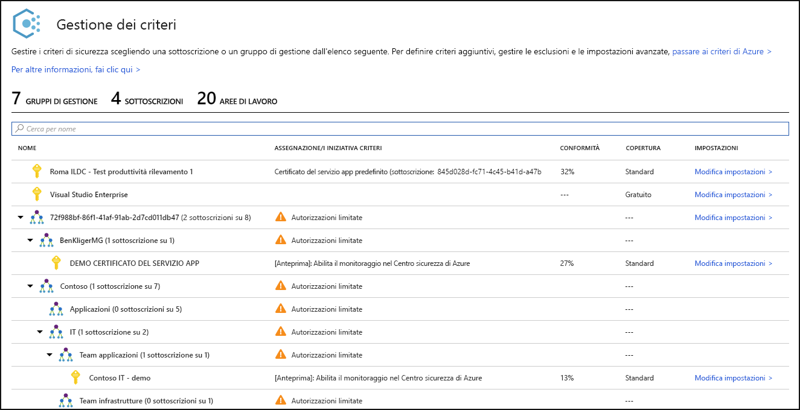
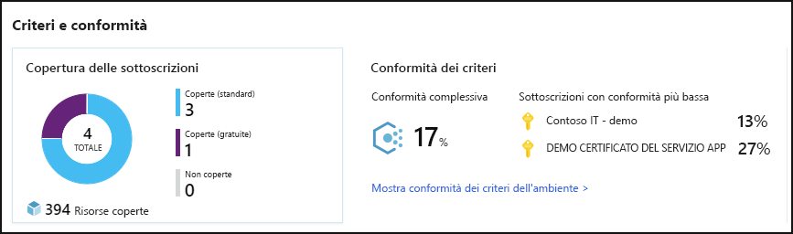
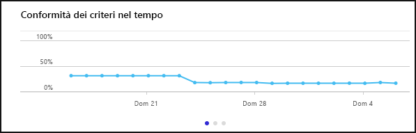
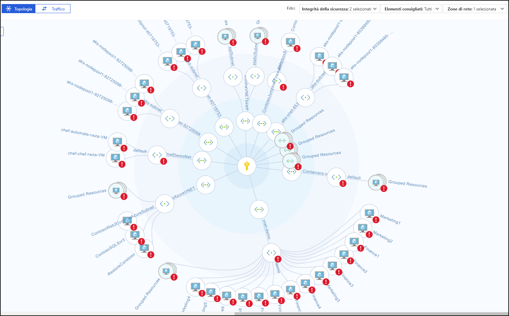
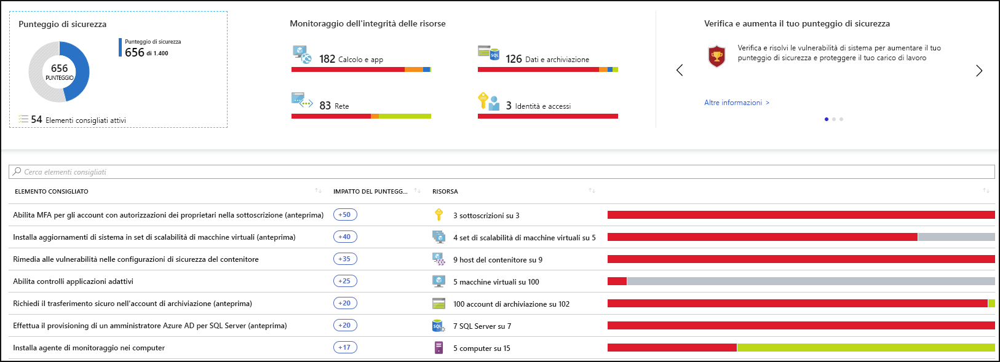
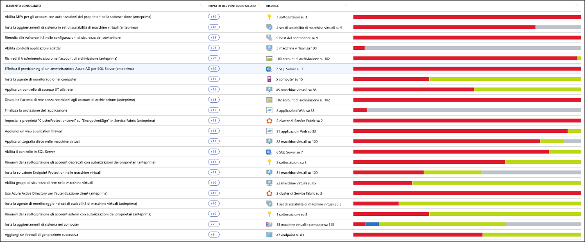
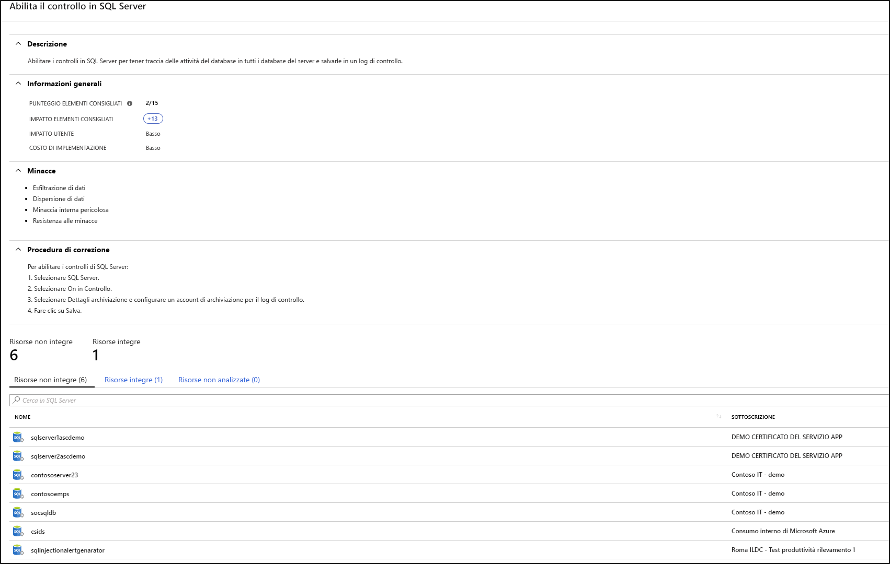
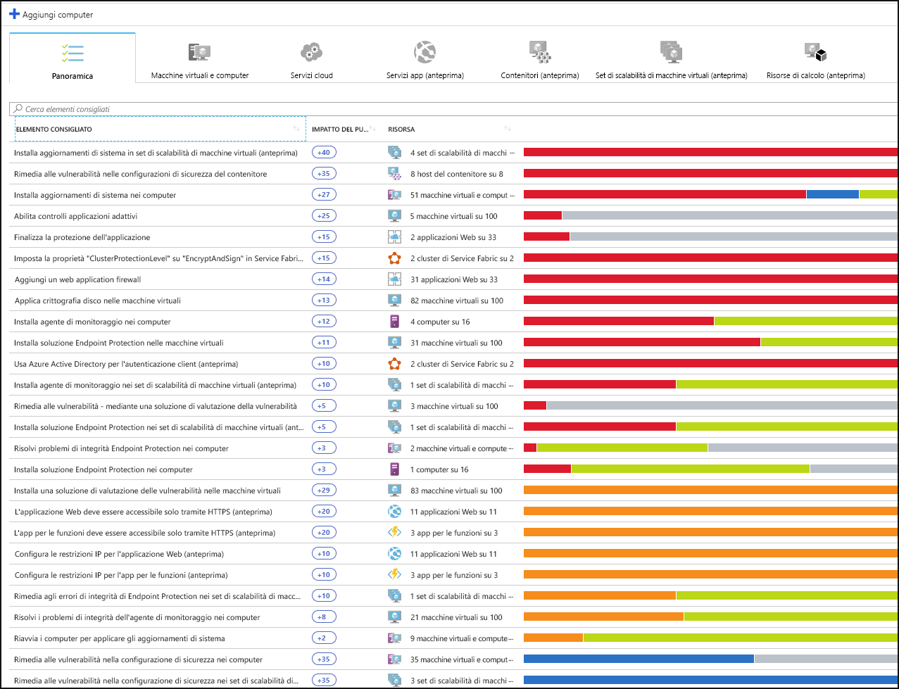
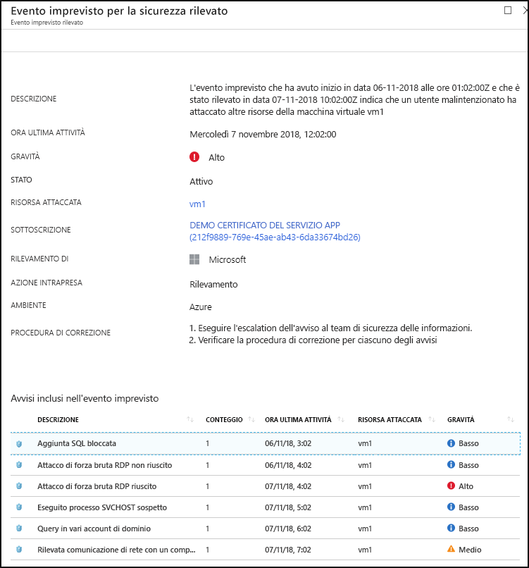

# Che cos'è il Centro sicurezza di Azure?

Centro sicurezza di Azure è un sistema di gestione della sicurezza delle infrastrutture unificato che rafforza la sicurezza dei data center e fornisce protezione avanzata dalle minacce per i carichi di lavoro ibridi su cloud, di Azure o meno, e in locale.

La protezione delle risorse è frutto della collaborazione tra il provider di cloud, Azure e il cliente. È necessario assicurarsi che i carichi di lavoro siano protetti quando si spostano nel cloud e allo stesso tempo, quando si passa a IaaS (infrastruttura distribuita come servizio), la responsabilità del cliente è maggiore rispetto a PaaS (piattaforma distribuita come servizio) e SaaS (software come servizio). Centro sicurezza di Azure offre gli strumenti necessari per la protezione avanzata della rete, dei servizi e per verificare che la sicurezza sia la massima possibile.

Centro sicurezza di Azure consente di risolvere le tre problematiche di sicurezza più urgenti:

-   **Carichi di lavoro in costante evoluzione**: è un punto di forza e al tempo stesso una delle difficoltà del cloud. Da una parte, gli utenti hanno a disposizione più opzioni. Da un’altra parte, come assicurarsi che i servizi in continua evoluzione che le persone usano e creano siano conformi agli standard di sicurezza e che le persone seguano le procedure consigliate?

-   **Attacchi sempre più sofisticati** : ogni volta che si eseguono carichi di lavoro, gli attacchi diventano sempre più sofisticati. È necessario proteggere i carichi di lavoro su cloud pubblico, che sono in realtà carichi di lavoro su Internet che possono rendere più vulnerabili, se non si rispettano le procedure consigliate per la sicurezza.

-   **Le competenze di sicurezza sono scarse** : il numero di avvisi e di sistemi di avviso per la sicurezza superano di gran lunga il numero di amministratori con le conoscenze e l’esperienza necessarie per garantire che gli ambienti siano protetti. Rimanere aggiornati sugli attacchi più recenti è una sfida costante che rende impossibile rimanere fermi quando il mondo della sicurezza si muove in continuazione.

Per garantire la protezione da questi problemi, Centro sicurezza offre gli strumenti necessari per:

-   **Migliorare il comportamento di sicurezza**: Centro sicurezza consente di valutare l'ambiente e di comprendere lo stato delle risorse, sono sicuro o no?

-   **Proteggiti dalle minacce**: Centro sicurezza consente di valutare i carichi di lavoro e genera raccomandazioni per la prevenzione delle minacce e avvisi di rilevamento delle minacce.

-   **Protezione più rapida**: In Centro sicurezza, tutto viene eseguito con la velocità del cloud. Poiché è integrato in modo nativo, la distribuzione di Centro sicurezza è facile e consente di utilizzare il provisioning automatico e la protezione dei servizi di Azure.

## Architettura

Poiché Centro sicurezza è nativo in Azure, i servizi PaaS di Azure, come Service Fabric, i database SQL e gli account di archiviazione, vengono monitorati e protetti da Centro sicurezza senza necessità di distribuzione.

Inoltre, Centro sicurezza protegge i server e le macchine virtuali non di Azure nel cloud o in locale, sia per i server di Windows che per quelli di Linux, installando Microsoft Monitoring Agent sui server stessi. Le macchine virtuali di Azure sono sottoposte a provisioning automatico in Centro sicurezza.

Gli eventi raccolti dagli agenti e da Azure sono correlati nel motore di analisi della sicurezza per fornire raccomandazioni su misura (attività di protezione avanzata), che è necessario seguire per assicurarsi che i carichi di lavoro siano protetti, e avvisi di rilevamento delle minacce. È necessario esaminare gli avvisi appena possibile per assicurarsi che non siano in corso attacchi dannosi ai carichi di lavoro.

Se si abilita Centro sicurezza, i criteri di sicurezza incorporati al suo interno si riflettono in Criteri di Azure come iniziativa predefinita nella categoria Centro sicurezza. L'iniziativa predefinita viene automaticamente assegnata a tutte le sottoscrizioni registrate di Centro sicurezza (livello Gratuito o Standard). L'iniziativa predefinita contiene solo criteri di controllo. Per altre informazioni sui criteri di Centro sicurezza in Criteri di Azure, vedere [Utilizzo dei criteri di sicurezza](tutorial-security-policy.md).

## Migliorare il comportamento di sicurezza

Centro sicurezza di Azure migliora il comportamento di sicurezza. Ciò significa che consente di identificare ed eseguire le attività di protezione avanzata come procedure consigliate di sicurezza e di implementarle su computer, servizi di dati e app. Ciò include la gestione e l'applicazione delle policy di sicurezza e la verifica della conformità di macchine virtuali Azure, server non Azure e servizi PaaS di Azure. Centro sicurezza offre gli strumenti necessari per avere una panoramica generale sui carichi di lavoro, con uno sguardo approfondito all’estate della sicurezza di rete. 

### Gestione delle policy di sicurezza dell’organizzazione e conformità

Conoscere e verificare che i carichi di lavoro siano protetti è fondamentale. Per farlo, è necessario disporre di policy di sicurezza personalizzate. Poiché tutte le policy di Centro sicurezza si basano sui sistemi di controllo delle policy di Azure, si può usufruire dell’intera gamma e flessibilità di una  **soluzione di policy leader**. In Centro sicurezza è possibile impostare le proprie policy da eseguire su gruppi di gestione, sulle sottoscrizioni e anche su un intero tenant.

Centro sicurezza permette di  **identificare le sottoscrizioni di utenti non autorizzati**. Esaminando le sottoscrizioni con l'etichetta **non coperto** nel dashboard, è possibile sapere immediatamente quando vengono create nuove sottoscrizioni e assicurarsi che siano coperte dalle policy e protette da Centro sicurezza di Azure.

Le funzionalità avanzate di monitoraggio di Centro sicurezza consentono inoltre di  **rilevare e gestire la conformità e la governance nel tempo**. La  **conformità complessiva** fornisce una misura di quanto le sottoscrizioni siano conformi alle policy associate al carico di lavoro. 

### Valutazioni continue

Centro sicurezza individua continuamente le nuove risorse distribuite tra i carichi di lavoro e consente di valutare se sono configurate in base alle procedure ottimali di protezione; in caso contrario, vengono contrassegnate e viene restituito un elenco in ordine di priorità delle raccomandazioni sulle risorse da correggere per proteggere i computer.

Uno degli strumenti più potenti che Centro sicurezza mette a disposizione per monitorare in modo continuo lo stato di sicurezza di rete è la  **mappa della rete**. La mappa consente di visualizzare la topologia dei carichi di lavoro, pertanto è possibile controllare che ogni nodo sia configurato correttamente. È possibile visualizzare come sono connessi i nodi per bloccare le connessioni indesiderate che potrebbero potenzialmente agevolare l’attacco alla rete da parte di un utente malintenzionato.

Centro sicurezza rende più semplice la riduzione degli avvisi di sicurezza consentendo di aggiungere un  **punteggio di sicurezza**. I punteggi di sicurezza sono associati a ogni raccomandazione ricevuta per consentire di comprendere quanto è importante ogni raccomandazione per il comportamento di sicurezza complessivo. Questo è fondamentale per  **stabilire le priorità degli interventi sulla sicurezza**.

### Ottimizzare e migliorare la sicurezza mediante la configurazione di controlli consigliati

La parte più importante di Centro sicurezza di Azure sono le raccomandazioni. Le raccomandazioni sono personalizzate per i problemi di sicurezza specifici rilevati nei carichi di lavoro e Centro sicurezza funge da amministratore rilevando le vulnerabilità e fornendo istruzioni specifiche per risolverle.

In questo modo, Centro sicurezza consente non solo di impostare policy di sicurezza, ma anche di applicare gli standard di una configurazione protetta in tutte le risorse.

Gli elementi consigliati aiutano a ridurre la superficie di attacco in ognuna delle risorse. La superficie include macchine virtuali di Azure, server non Azure e servizi PaaS di Azure come SQL, account di storage e altro, in cui ciascun tipo di risorsa viene valutato in modo diverso e dispone di standard propri.

## Protezione dalle minacce

La protezione dalle minacce di Centro sicurezza consente di rilevare ed evitare possibili minacce al livello IaaS (infrastruttura distribuita come servizio), dei server non Azure e PaaS (piattaforme distribuite come servizio) in Azure.

La protezione dalle minacce di Centro sicurezza include un’analisi unificata della catena di attacco che genera automaticamente avvisi nell’ambiente per comprendere meglio la storia completa di una campagna di attacco, da dove è iniziata e che tipo di impatto ha avuto sulle risorse.

### Protezione avanzata dalle minacce

Centro sicurezza offre da subito l'integrazione nativa con Windows Defender Advanced Threat Protection. Ciò significa che senza alcuna configurazione, le macchine virtuali Windows e i server sono completamente integrati con le raccomandazioni e le valutazioni del Centro sicurezza. La protezione avanzata dalle minacce è disponibile anche a parte per macchine virtuali e server Linux.

Inoltre, Centro sicurezza consente di automatizzare le policy di controllo delle applicazioni in ambienti server. I controlli adattivi delle applicazioni di Centro sicurezza consentono di inserire le app end-to-end in whitelist valide per i server Windows. Non è necessario creare le regole e verificare le violazioni, viene tutto effettuato automaticamente.

### Protezione di PaaS

Centro sicurezza aiuta a rilevare le minacce in tutti i servizi PaaS di Azure. È possibile rilevare le minacce destinate ai servizi di Azure, tra cui Servizio app di Azure, Azure SQL, Account di archiviazione di Azure e ad altri servizi dati. È anche possibile sfruttare l'integrazione nativa con le analisi sul comportamento di utenti ed entità (UEBA) di Microsoft Cloud App Security per rilevare le anomalie nei log attività di Azure.

### Blocco degli attacchi di forza bruta

Centro sicurezza consente di limitare l’esposizione agli attacchi di forza bruta. Riducendo l'accesso alle porte delle macchine virtuali, tramite l'accesso alle macchine virtuali JIT, è possibile rafforzare la protezione della rete impedendo accessi non necessari. È possibile impostare policy di accesso sicure su porte selezionate, per i soli utenti autorizzati, intervalli di indirizzi IP di origine o singoli indirizzi IP e per un periodo di tempo limitato.

### Protezione dei servizi dati

Centro sicurezza include funzionalità che consentono di classificare automaticamente i dati di SQL Azure. È anche possibile ottenere valutazioni per le potenziali vulnerabilità nei servizi di archiviazione e SQL di Azure e raccomandazioni su come attenuarle.

## Protezione più rapida

L’integrazione nativa in Azure (compresi Criteri di Azure e log di Monitoraggio di Azure), combinata con la perfetta integrazione con altre soluzioni di sicurezza Microsoft, ad esempio Microsoft Cloud App Security e Windows Defender Advanced Threat Protection, consente di creare una soluzione di sicurezza completa semplice da caricare e implementare.

Inoltre, è possibile usare la soluzione completa al di fuori di Azure, su carichi di lavoro eseguiti in altri data center su cloud e in locale.

### Individuare automaticamente e caricare le risorse di Azure

Centro sicurezza offre un'integrazione nativa lineare con Azure e le relative risorse. Ciò significa che è possibile raccogliere una cronologia di sicurezza completa che includa Criteri di Azure e le policy integrate in Centro Sicurezza in tutte le risorse di Azure. Tutto ciò viene applicato automaticamente alle nuove risorse rilevate, man mano che vengono create in Azure.

Raccolta di log estesi: i registri di Windows e Linux sono tutti sfruttati dal motore di analisi della sicurezza e vengono usati per creare raccomandazioni e avvisi.

## Passaggi successivi

- Per iniziare a usare Centro sicurezza, è necessario avere una sottoscrizione di Microsoft Azure. Se non si ha una sottoscrizione, è possibile iscriversi per una [versione di valutazione gratuita](https://azure.microsoft.com/free/).
- Il Piano tariffario Gratuito del Centro sicurezza di Azure viene abilitato con la sottoscrizione di Azure. Per sfruttare i vantaggi della gestione della sicurezza avanzata e la funzionalità di rilevamento minacce, è necessario eseguire l'aggiornamento al piano tariffario Standard. È possibile provare gratuitamente il livello Standard. Per altre informazioni, vedere [Prezzi di Centro sicurezza](https://azure.microsoft.com/pricing/details/security-center/).
- Per attivare subito Centro sicurezza Standard, procedere come indicato in [Avvio rapido: Caricamento della sottoscrizione Azure in Centro sicurezza Standard](security-center-get-started.md).

