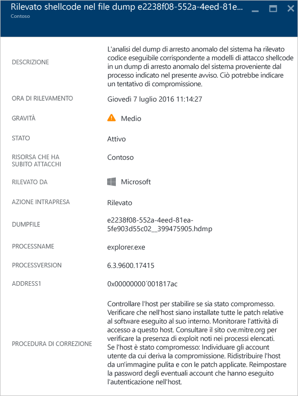
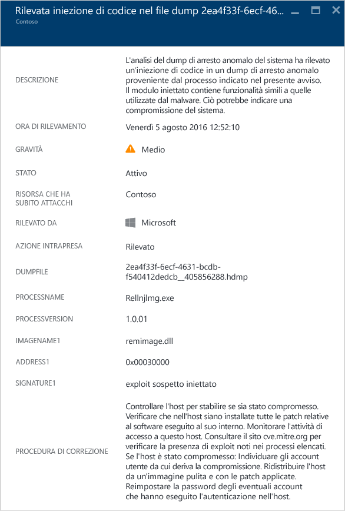
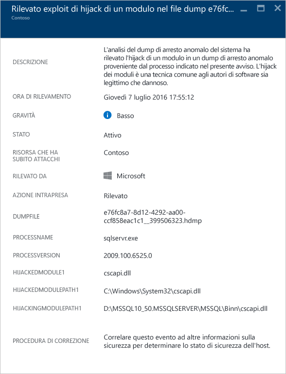
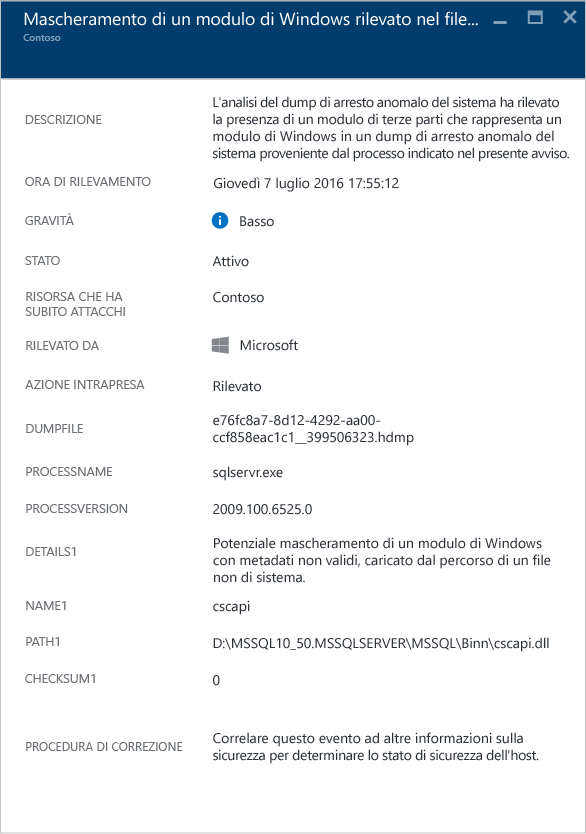
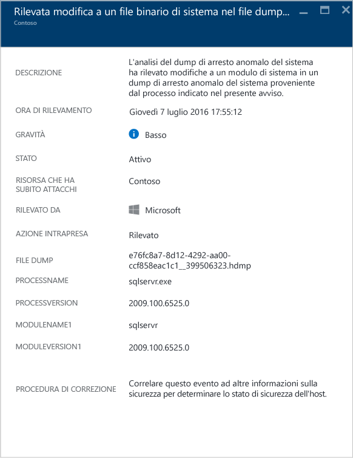

<properties
   pageTitle="Gestione e risposta agli avvisi di sicurezza nel Centro sicurezza di Azure | Microsoft Azure"
   description="Questo documento illustra come usare le funzionalità del Centro sicurezza di Azure per gestire e rispondere agli avvisi di sicurezza."
   services="security-center"
   documentationCenter="na"
   authors="YuriDio"
   manager="swadhwa"
   editor=""/>

<tags
   ms.service="security-center"
   ms.topic="hero-article"
   ms.devlang="na"
   ms.tgt_pltfrm="na"
   ms.workload="na"
   ms.date="08/26/2016"
   ms.author="yurid"/>

# Gestione e risposta agli avvisi di sicurezza nel Centro sicurezza di Azure
Questo documento illustra come usare il Centro sicurezza di Azure per gestire e rispondere agli avvisi di sicurezza.

> [AZURE.NOTE] Per abilitare le funzionalità di rilevamento avanzato, eseguire l'aggiornamento al livello Standard del Centro sicurezza di Azure. È disponibile una versione di valutazione gratuita di 90 giorni. Per eseguire l'aggiornamento, selezionare il piano tariffario nei [criteri di sicurezza](security-center-policies.md). Per altre informazioni, vedere la [pagina dei prezzi](https://azure.microsoft.com/pricing/details/security-center/).

## Informazioni sugli avvisi di sicurezza
Il Centro sicurezza raccoglie, analizza e integra automaticamente i dati di log delle risorse di Azure, della rete e delle soluzioni dei partner connesse, come soluzioni di protezione endpoint e firewall, per rilevare le minacce reali e ridurre i falsi positivi. Il Centro sicurezza visualizza un elenco degli avvisi di sicurezza in ordine di priorità, nonché le informazioni necessarie per analizzare rapidamente il problema e indicazioni per risolvere un attacco. Il Centro sicurezza di Azure aggrega anche gli avvisi corrispondenti ai modelli di catena di attacco in [eventi imprevisti](security-center-incident.md).

> [AZURE.NOTE] Per altre informazioni sulle funzionalità di rilevamento del Centro sicurezza, vedere [Funzionalità di rilevamento del Centro sicurezza di Azure](security-center-detection-capabilities.md).

## Gestire gli avvisi di sicurezza

È possibile esaminare gli avvisi correnti visualizzando il riquadro **Avvisi di sicurezza**. Aprire il portale di Azure e seguire questa procedura per visualizzare altri dettagli su ogni avviso:

1. Nel dashboard del Centro sicurezza è disponibile il riquadro **Avvisi di sicurezza**.

    

2.  Fare clic sul riquadro per aprire il pannello **Avvisi di sicurezza** contenente altri dettagli sugli avvisi, come illustrato di seguito.

    

Nella parte inferiore del pannello sono riportati i dettagli relativi ad ogni avviso. Per ordinarli, fare clic sulla colonna in base alle quale si vuole ordinare. Di seguito è riportata una definizione per ogni colonna:

- **Avviso**: breve spiegazione dell'avviso.
- **Conteggio**: elenco di tutti gli avvisi di questo tipo rilevati in un giorno specifico.
- **Rilevato da**: servizio responsabile dell'attivazione dell'avviso.
- **Data**: data in cui si è verificato l'evento.
- **Stato**: stato corrente dell'avviso. Esistono due tipi di stato:
    - **Attivo**: l'avviso di sicurezza è stato rilevato.
    - **Ignorato**: l'avviso di sicurezza è stato ignorato dall'utente. Questo stato viene usato generalmente per gli avvisi che, dopo essere stati esaminati, non sono stati valutati come un attacco effettivo oppure di cui ne sono stati attenuati gli effetti.

- **Gravità**: livello di gravità, che può essere alto, medio o basso.

### Filtro degli avvisi

È possibile filtrare gli avvisi in base a data, stato e gravità. Il filtro degli avvisi può risultare utile per scenari in cui è necessario limitare l'ambito degli avvisi di sicurezza da visualizzare. Ad esempio, potrebbe essere necessario gestire gli avvisi di sicurezza che si sono verificati nelle ultime 24 ore, perché si sta esaminando una potenziale violazione del sistema.

1. Fare clic su **Filtro** nel pannello **Avvisi di sicurezza**. Verrà visualizzato il pannello **Filtro** in cui è possibile selezionare i valori di data, stato e gravità da visualizzare.

	

2. 	Dopo avere analizzato un avviso di sicurezza, si potrebbe scoprire che si tratta di un falso positivo per il proprio ambiente o di un comportamento previsto per una determinata risorsa. In ogni caso, se si ritiene che un avviso di sicurezza non sia applicabile, è possibile ignorarlo ed escluderlo dalla visualizzazione. Esistono due modi per ignorare un avviso di sicurezza. Fare clic con il pulsante destro del mouse su un avviso e scegliere **Ignora** oppure passare il puntatore del mouse su un elemento, fare clic sui tre punti a destra e selezionare **Ignora**. È possibile visualizzare gli avvisi di sicurezza ignorati facendo clic su **Filtro** e selezionando **Ignorato**.

	

### Rispondere agli avvisi di sicurezza

Selezionare un avviso di sicurezza per altre informazioni sugli eventi che hanno attivato l'avviso e, se presenti, i passaggi da eseguire per correggere un attacco. Gli avvisi di sicurezza sono raggruppati per tipo e data. Se si fa clic su un avviso di sicurezza, viene aperto un pannello contenente un elenco degli avvisi raggruppati.

In questo caso, gli avvisi attivati fanno riferimento a un'attività RDP (Remote Desktop Protocol) sospetta. La prima colonna indica le risorse che sono state attaccate, la seconda quante volte la risorsa è stata attaccata, la terza l'ora dell'attacco, la quarta lo stato dell'avviso e la quinta il livello di gravità dell'attacco. Dopo aver esaminato queste informazioni, fare clic sulla risorsa che ha subito attacchi. Verrà visualizzato un nuovo pannello.

Nel campo **Descrizione** di questo pannello sono disponibili altri dettagli sull'evento. Tali dettagli aggiuntivi forniscono informazioni sull'azione che ha attivato l'avviso di sicurezza, la risorsa di destinazione, l'indirizzo IP di origine quando applicabile e raccomandazioni su come risolvere. In alcuni casi, l'indirizzo IP di origine sarà vuoto (non disponibile), perché non tutti i registri eventi di sicurezza di Windows includono l'indirizzo IP.

> [AZURE.NOTE] Le correzioni suggerite dal Centro sicurezza variano in base all'avviso di sicurezza. In alcuni casi, può essere necessario usare altre funzionalità di Azure per implementare la correzione consigliata. La correzione consigliata per questo tipo di attacco, ad esempio, consiste nell'aggiungere alla blacklist l'indirizzo IP che genera l'attacco usando un [ACL di rete](../virtual-network/virtual-networks-acl.md) o una regola del [gruppo di sicurezza di rete](../virtual-network/virtual-networks-nsg.md).

## Avvisi di sicurezza per tipo
La stessa procedura adottata per accedere all'avviso di attività RDP sospetta può essere usata per accedere ad altri tipi di avvisi. Di seguito sono illustrati alcuni altri esempi di avvisi che possono essere visualizzati tra gli avvisi del Centro sicurezza.

### Potenziale attacco SQL injection
In un attacco SQL injection, il malware viene inserito in stringhe che vengono successivamente passate a un'istanza di SQL Server per l'analisi e l'esecuzione. È consigliabile verificare la presenza di vulnerabilità a questo tipo di attacco in qualsiasi procedura che crea istruzioni SQL, perché SQL Server eseguirà tutte le query sintatticamente valide che riceve.

L'avviso contiene informazioni che consentono di identificare la risorsa che ha subito attacchi, la data e l'ora di rilevamento e lo stato dell'attacco, nonché un collegamento ad altri passaggi di analisi.

### Rilevamento di traffico in uscita sospetto

I dispositivi di rete possono essere individuati e profilati così come altri tipi di sistemi. L'attacco ha in genere inizio con la scansione o la scansione sistematica delle porte. Nell'esempio di seguito è presente un traffico SSH sospetto da una VM che può eseguire un attacco di scansione sistematica delle porte o di forza bruta SSH contro una risorsa esterna.

L'avviso contiene informazioni che consentono di identificare la risorsa usata per avviare l'attacco, il computer compromesso, la data e l'ora di rilevamento, il protocollo e la porta usata. Il pannello contiene anche un elenco dei passaggi di correzione che possono essere usati per attenuare il problema.

### Comunicazione di rete con un computer dannoso
 
Sfruttando i feed di intelligence per le minacce di Microsoft, il Centro sicurezza di Azure può rilevare i computer compromessi che comunicano con indirizzi IP dannosi, corrispondenti in molti casi a un centro di comando e controllo. In questo caso, il Centro sicurezza di Azure ha rilevato la comunicazione con il malware Pony Loader, noto anche come [Fareit](https://www.microsoft.com/security/portal/threat/encyclopedia/entry.aspx?Name=PWS:Win32/Fareit.AF).

L'avviso contiene informazioni che consentono di identificare la risorsa usata per avviare l'attacco, la risorsa che ha subito attacchi, l'IP vittima, l'IP dell'utente malintenzionato e la data e l'ora di rilevamento.

> [AZURE.NOTE] Gli indirizzi IP attivi sono stati rimossi dallo screenshot per motivi di privacy.

### Individuato attacco shellcode 

Uno shellcode è il payload che viene eseguito dopo che il malware ha sfruttato una vulnerabilità del software. Questo avviso indica che l'analisi di dump di arresto anomalo del sistema ha rilevato codice eseguibile che presenta un comportamento comunemente adottato dai payload dannosi. Sebbene anche il software non dannoso possa mostrare comportamenti simili, questo non fa generalmente parte delle normali procedure di sviluppo software.

I campi seguenti sono comuni a tutti gli avvisi di dump di arresto anomalo del sistema:

- DUMPFILE (FILE DUMP): nome del file di dump di arresto anomalo del sistema
- PROCESSNAME (NOME PROCESSO): nome del processo bloccato
- PROCESSVERSION (VERSIONE PROCESSO): versione del processo bloccato

Questo avviso fornisce il campo aggiuntivo seguente:

- ADDRESS (INDIRIZZO): posizione in memoria dello shellcode

Esempio di questo tipo di avviso:

### Individuato attacco di code injection

Un attacco di code injection è l'inserimento di moduli eseguibili in processi o thread in esecuzione. Questa tecnica è usata dal malware per accedere ai dati e nasconderne o impedirne la rimozione, ad esempio il salvataggio permanente. Questo avviso indica che l'analisi di dump di arresto anomalo del sistema ha rilevato un modulo di code injection nel dump di arresto anomalo.
 
Gli sviluppatori di software legittimo eseguono occasionalmente operazioni di code injection per motivi non dannosi, ad esempio per modificare o estendere un componente di un sistema operativo o di un'applicazione esistente. Per distinguere i moduli di code injection dannosi e non dannosi, il Centro sicurezza di Azure verifica se il modulo di code injection corrisponde a un profilo di comportamento sospetto. Il risultato di questa verifica è indicato dal campo "SIGNATURE" (FIRMA) dell'avviso e si riflette nella gravità dell'avviso, nella descrizione dell'avviso e nella procedura di correzione dell'avviso.

Oltre ai campi comuni descritti nella sezione "Individuato shellcode" precedente, questo avviso presenta i campi aggiuntivi seguenti:

- ADDRESS (INDIRIZZO): posizione in memoria del modulo di code injection
- IMAGENAME (NOME IMMAGINE): nome del modulo di code injection. Si noti che questo campo può essere vuoto se il nome dell'immagine non è specificato all'interno dell'immagine.
- SIGNATURE (FIRMA): indica se il modulo di code injection corrisponde a un profilo di comportamento sospetto. La tabella seguente mostra esempi di risultati con le relative descrizioni:

| **Valore firma** | **Descrizione** |
|--------------------------------------|-------------------------------------------------------------------------------------------------------------------|
| Exploit del caricatore riflessivo sospetto | Questo comportamento sospetto è spesso correlato al caricamento di code injection indipendentemente dal caricatore del sistema operativo |
| Exploit di code injection sospetto | Indica un comportamento dannoso spesso correlato a operazioni di code injection in memoria |
| Exploit di code injection sospetto | Indica un comportamento dannoso spesso correlato all'uso di code injection in memoria |
| Exploit del debugger di code injection sospetto | Indica un comportamento dannoso spesso correlato al rilevamento o all'aggiramento di un debugger |
| Exploit di code injection remoto sospetto | Indica un comportamento sospetto spesso correlato a scenari di command and control (C2) |

Esempio di questo tipo di avviso:

### Individuato hijack del modulo

Windows si basa sulle librerie a collegamento dinamico (DLL) per consentire al software di usare funzionalità del sistema di Windows comuni. L'hijack della DLL si verifica quando il malware modifica l'ordine di caricamento della DLL per caricare payload dannosi in memoria, dove è possibile eseguire codice arbitrario. Questo avviso indica che l'analisi di dump di arresto anomalo del sistema ha rilevato un modulo con un nome simile caricato da due percorsi diversi, dove uno dei percorsi caricati proviene da un percorso binario del sistema Windows comune.

Gli sviluppatori di software legittimo cambiano occasionalmente l'ordine di caricamento della DLL per motivi non dannosi, ad esempio per instrumentare o estendere il sistema operativo Windows o le applicazioni Windows. Per distinguere le modifiche dannose da quelle potenzialmente non dannose all'ordine di caricamento della DLL, il Centro sicurezza di Azure verifica se un modulo caricato corrisponde o meno a un profilo sospetto. Il risultato di questa verifica è indicato dal campo "SIGNATURE" (FIRMA) dell'avviso e si riflette nella gravità dell'avviso, nella descrizione dell'avviso e nella procedura di correzione dell'avviso. L'analisi della copia su disco del modulo di hijack, ad esempio tramite la verifica della firma digitale dei file o l'esecuzione di un'analisi antivirus, può fornire altre informazioni in merito alla natura legittima o dannosa del modulo di hijack.

Oltre ai campi comuni descritti nella sezione "Individuato shellcode" precedente, questo avviso presenta i campi seguenti:

- SIGNATURE (FIRMA): indica se il modulo di hijack corrisponde a un profilo di comportamento sospetto
- HIJACKEDMODULE (MODULO CONTROLLATO): nome del modulo di sistema Windows di cui è stato assunto il controllo
- HIJACKEDMODULEPATH (PERCORSO MODULO CONTROLLATO): percorso del modulo di sistema Windows di cui è stato assunto il controllo
- HIJACKINGMODULEPATH (PERCORSO MODULO HIJACK): percorso del modulo di hijack

Esempio di questo tipo di avviso:

### Rilevato modulo Windows mascherato

Il malware può usare nomi comuni di file binari di sistema Windows, ad esempio SVCHOST.EXE, oppure moduli, come NTDLL.DLL, per mimetizzarsi e nascondere la natura del software dannoso agli amministratori di sistema. Questo avviso indica che l'analisi di dump di arresto anomalo del sistema ha rilevato che il file di dump di arresto anomalo del sistema contiene moduli che usano nomi di moduli di sistema Windows ma che non soddisfano i criteri tipici dei moduli di Windows. L'analisi della copia su disco del modulo mascherato può fornire altre informazioni in merito alla natura legittima o dannosa di questo modulo. L'analisi può includere:

- La conferma che indica che il file in questione è incluso in un pacchetto software legittimo
- La verifica della firma digitale del file
- L'esecuzione dell'analisi antivirus sul file

Oltre ai campi comuni descritti nella sezione "Individuato shellcode" precedente, questo avviso presenta i campi aggiuntivi seguenti:

- DETAILS (DETTAGLI): descrive se i metadati dei moduli sono validi e se il modulo è stato caricato da un percorso di sistema.
- NAME (NOME): nome del modulo di Windows mascherato
- PATH (PERCORSO): percorso del modulo di Windows mascherato.

Questo avviso, inoltre, estrae e visualizza determinati campi dell'intestazione del modulo PE, ad esempio "CHECKSUM" e "TIMESTAMP". Questi campi vengono visualizzati solo se sono presenti nel modulo. Per informazioni dettagliate su questi campi, vedere il documento [Microsoft PE and COFF Specification](https://msdn.microsoft.com/windows/hardware/gg463119.aspx) (Specifica dei formati PE e COFF Microsoft).

Esempio di questo tipo di avviso:

### Individuato file binario di sistema modificato 

Il malware può modificare i file binari del sistema di base per accedere di nascosto ai dati o per essere furtivamente salvato in modo permanente in un sistema compromesso. Questo avviso indica che l'analisi di dump di arresto anomalo del sistema ha rilevato che i file binari del sistema operativo Windows di base sono stati modificati in memoria o su disco.

Gli sviluppatori di software legittimo modificano occasionalmente i moduli del sistema in memoria per motivi non dannosi, ad esempio per il pacchetto Detours o per la compatibilità delle applicazioni. Per distinguere i moduli dannosi da quelli potenzialmente legittimi, il Centro sicurezza di Azure verifica se un modulo caricato corrisponde o meno a un profilo sospetto. Il risultato di questa verifica si riflette nella gravità dell'avviso, nella descrizione dell'avviso e nella procedura di correzione dell'avviso.

Oltre ai campi comuni descritti nella sezione "Individuato shellcode" precedente, questo avviso presenta i campi aggiuntivi seguenti:

- MODULENAME (NOME MODULO): nome del file binario di sistema modificato
- MODULEVERSION (VERSIONE MODULO): versione del file binario di sistema modificato

Esempio di questo tipo di avviso:

## Vedere anche

In questo documento si è appreso come configurare i criteri di sicurezza nel Centro sicurezza. Per altre informazioni sul Centro sicurezza, vedere gli argomenti seguenti:

- [Gestione degli eventi imprevisti della sicurezza nel Centro sicurezza di Azure](security-center-incident.md)
- [Funzionalità di rilevamento del Centro sicurezza di Azure](security-center-detection-capabilities.md)
- [Guida alla pianificazione e alla gestione del Centro sicurezza di Azure](security-center-planning-and-operations-guide.md)
- [Domande frequenti sul Centro sicurezza di Azure](security-center-faq.md): domande frequenti sull'uso del servizio.
- [Blog sulla sicurezza di Azure](http://blogs.msdn.com/b/azuresecurity/): post di blog sulla sicurezza e sulla conformità di Azure.

<!---HONumber=AcomDC_0831_2016-->