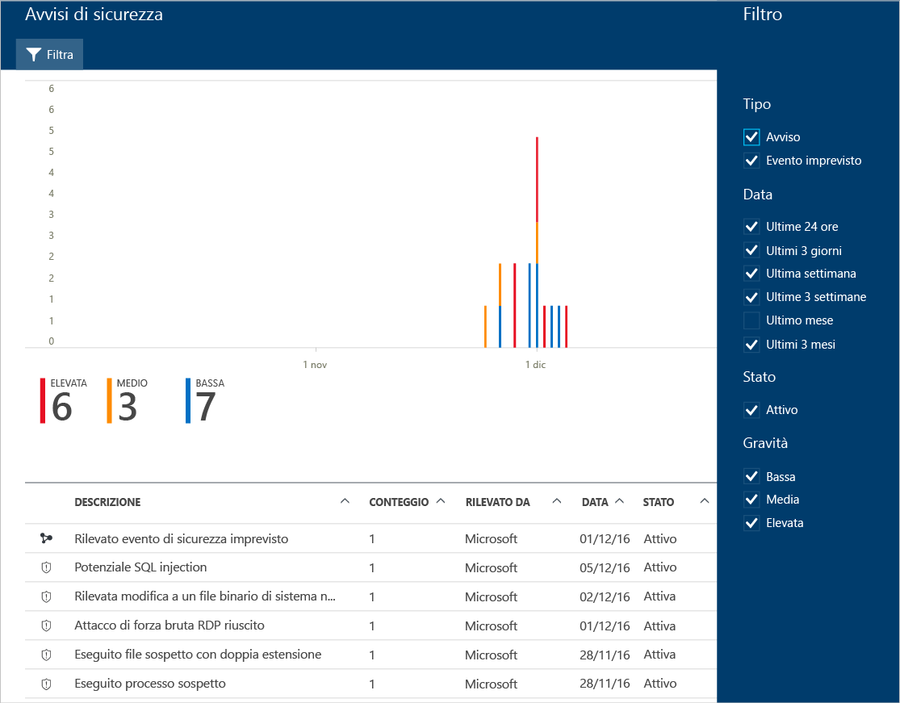

# Gestione e risposta agli avvisi di sicurezza nel Centro sicurezza di Azure
Questo documento illustra come usare il Centro sicurezza di Azure per gestire e rispondere agli avvisi di sicurezza.

> [!NOTE]
> Per abilitare le funzionalità di rilevamento avanzato, eseguire l'aggiornamento al livello Standard del Centro sicurezza di Azure. È disponibile una prova gratuita. Per eseguire l'aggiornamento, selezionare il piano tariffario nei [criteri di sicurezza](tutorial-security-policy.md). Per altre informazioni, vedere [Prezzi del Centro sicurezza di Azure](security-center-pricing.md).
>
>

## Informazioni sugli avvisi di sicurezza
Il Centro sicurezza raccoglie, analizza e integra automaticamente i dati di log delle risorse di Azure, della rete e delle soluzioni dei partner connesse, come soluzioni di protezione endpoint e firewall, per rilevare le minacce reali e ridurre i falsi positivi. Il Centro sicurezza visualizza un elenco degli avvisi di sicurezza in ordine di priorità, nonché le informazioni necessarie per analizzare rapidamente il problema e indicazioni per risolvere un attacco.

> [!NOTE]
> Per altre informazioni sulle funzionalità di rilevamento del Centro sicurezza, vedere [Funzionalità di rilevamento del Centro sicurezza di Azure](security-center-detection-capabilities.md).
>
>

## Gestire gli avvisi di sicurezza
È possibile esaminare gli avvisi correnti visualizzando il riquadro **Avvisi di sicurezza** . Seguire questa procedura per visualizzare altri dettagli su ogni avviso:

1. Nel dashboard del Centro sicurezza è disponibile il riquadro **Avvisi di sicurezza**.

    

2. Fare clic sul riquadro per aprire **Avvisi di sicurezza** e visualizzare altri dettagli sugli avvisi.

   

Nella parte inferiore della pagina sono riportati i dettagli relativi a ogni avviso. Per ordinarli, fare clic sulla colonna in base alle quale si vuole ordinare. Di seguito è riportata una definizione per ogni colonna:

* **Descrizione**: breve spiegazione dell'avviso.
* **Conteggio**: elenco di tutti gli avvisi di questo tipo rilevati in un giorno specifico.
* **Rilevato da**: servizio responsabile dell'attivazione dell'avviso.
* **Data**: data in cui si è verificato l'evento.
* **Stato**: stato corrente dell'avviso. Esistono due tipi di stato:
  * **Attivo**: l'avviso di sicurezza è stato rilevato.
  * **Ignorato**: l'avviso di sicurezza è stato ignorato dall'utente. Questo stato viene in genere usato per gli avvisi che, dopo essere stati esaminati, non sono stati valutati come generati da un attacco effettivo oppure sono stati attenuati.
* **Gravità**: Livello di gravità, che può essere alto, medio o basso.

> [!NOTE]
> Gli avvisi di sicurezza generati dal Centro sicurezza verranno visualizzati anche in Log attività di Azure. Per altre informazioni su come accedere a Log attività di Azure, vedere [Visualizzare i log attività per controllare le azioni sulle risorse](https://docs.microsoft.com/azure/azure-resource-manager/resource-group-audit).
>

### Gravità dell'avviso

-   **Alta**: esiste una forte probabilità che la risorsa sia compromessa. È consigliabile controllarla immediatamente. Il Centro sicurezza ha una certezza elevata sia delle finalità dannose che delle conclusioni usate per inviare l'avviso, ad esempio un avviso che rileva l'esecuzione di uno strumento dannoso noto, come Mimikatz, uno strumento comune usato per il furto di credenziali. 
-   **Medium**: si tratta di una probabile attività sospetta che potrebbe indicare che una risorsa è compromessa.
La fiducia del Centro sicurezza nell'analisi o nella conclusione è media e la certezza delle finalità dannose è da media a elevata. Si tratta in genere di rilevamenti basati sulle anomalie o su Machine Learning. Ad esempio, un tentativo di accesso da un percorso anomalo.
-   **Bassa**: potrebbe trattarsi di un falso positivo o di un attacco bloccato. 
    - Il Centro sicurezza non è del tutto certo che l'intento sia dannoso e che l'attività possa essere inoffensiva. La cancellazione di un log, ad esempio, è un'azione che può verificarsi quando un utente malintenzionato cerca di nascondere le proprie tracce, ma in molti casi è un'operazione di routine eseguita dagli amministratori.
    - Il Centro sicurezza non segnala in genere quando sono stati bloccati attacchi, a meno che non si tratti di un caso interessante che si consiglia di esaminare. 
-   **Informazioni**: gli avvisi informativi verranno visualizzati solo quando si esegue il drill-down di un evento imprevisto relativo alla sicurezza oppure se si usa l'API REST con un ID avviso specifico. Un evento imprevisto è in genere costituito da più avvisi, alcuni dei quali sono di per sé semplicemente informativi, ma nel contesto degli altri avvisi potrebbero richiedere un'analisi più approfondita.  

> [!NOTE]
> Se si usa la versione dell'API **2015-06-01-Preview** , esistono differenze nei tipi di gravità degli avvisi applicati agli scenari, da quelli elencati in precedenza.  

### Filtro degli avvisi
È possibile filtrare gli avvisi in base a data, stato e gravità. Il filtro degli avvisi può risultare utile per scenari in cui è necessario limitare l'ambito degli avvisi di sicurezza da visualizzare. Ad esempio, potrebbe essere necessario gestire gli avvisi di sicurezza che si sono verificati nelle ultime 24 ore, perché si sta esaminando una potenziale violazione del sistema.

1. Fare clic su **Filtro** in **Avvisi di sicurezza**. Verrà visualizzato il **Filtro** in cui è possibile selezionare i valori di data, stato e gravità da visualizzare.

    

### Rispondere agli avvisi di sicurezza
Selezionare un avviso di sicurezza per altre informazioni sugli eventi che hanno attivato l'avviso e, se presenti, i passaggi da eseguire per correggere un attacco. Gli avvisi di sicurezza sono raggruppati per tipo e data. Se si fa clic su un avviso di sicurezza, viene aperta una pagina contenente un elenco degli avvisi raggruppati.

In questo caso, gli avvisi attivati fanno riferimento a un'attività RDP (Remote Desktop Protocol) sospetta. La prima colonna indica le risorse che sono state attaccate, la seconda quante volte la risorsa è stata attaccata, la terza l'ora dell'attacco, la quarta lo stato dell'avviso e la quinta il livello di gravità dell'attacco. Dopo aver esaminato queste informazioni, fare clic sulla risorsa che ha subito attacchi.

Nel campo **Descrizione** sono disponibili altri dettagli su questo evento. Tali dettagli aggiuntivi forniscono informazioni sull'azione che ha attivato l'avviso di sicurezza, la risorsa di destinazione, l'indirizzo IP di origine quando applicabile e raccomandazioni su come risolvere.  In alcuni casi, l'indirizzo IP di origine è vuoto (non disponibile), perché non tutti i log eventi di sicurezza di Windows includono l'indirizzo IP.

Le correzioni suggerite dal Centro sicurezza variano in base all'avviso di sicurezza. In alcuni casi, può essere necessario usare altre funzionalità di Azure per implementare la correzione consigliata. Ad esempio, la correzione per questo attacco consiste nel non consentire l'indirizzo IP che genera questo attacco tramite un [ACL di rete](../virtual-network/virtual-networks-acl.md) o una regola del gruppo di [sicurezza di rete](../virtual-network/security-overview.md#security-rules) . Per ulteriori informazioni sui diversi tipi di avvisi, vedere [tipi di avvisi di sicurezza](security-center-alerts-overview.md#security-alert-types).

> [!NOTE]
> Il Centro sicurezza ha rilasciato un'anteprima limitata di un nuovo set di strumenti di rilevamento, che sfruttano i record di controllo, un framework di controllo comune, per rilevare comportamenti dannosi nei computer Linux. Inviare un messaggio di posta elettronica con l'ID sottoscrizione a [Microsoft](mailto:ASC_linuxdetections@microsoft.com) per accedere all'anteprima.

## Vedere anche
In questo documento si è appreso come configurare i criteri di sicurezza nel Centro sicurezza. Per altre informazioni sul Centro sicurezza, vedere gli argomenti seguenti:

* [Gestione degli eventi imprevisti della sicurezza nel Centro sicurezza di Azure](security-center-incident.md)
* [Funzionalità di rilevamento del Centro sicurezza di Azure](security-center-detection-capabilities.md)
* [Guida alla pianificazione e alla gestione del Centro sicurezza di Azure](security-center-planning-and-operations-guide.md)
* [Domande frequenti sul Centro sicurezza di Azure](security-center-faq.md) : domande frequenti sull'uso del servizio.
* [Blog sulla sicurezza di Azure](https://blogs.msdn.com/b/azuresecurity/) : post di blog sulla sicurezza e sulla conformità di Azure.
