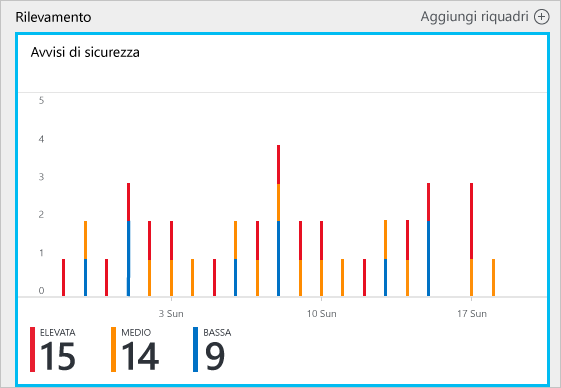
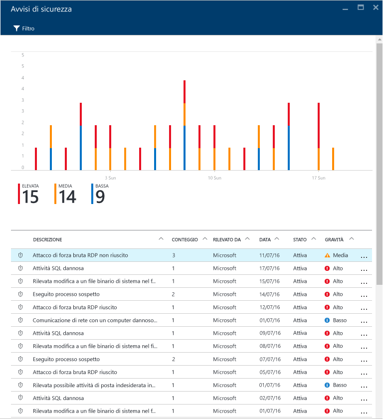
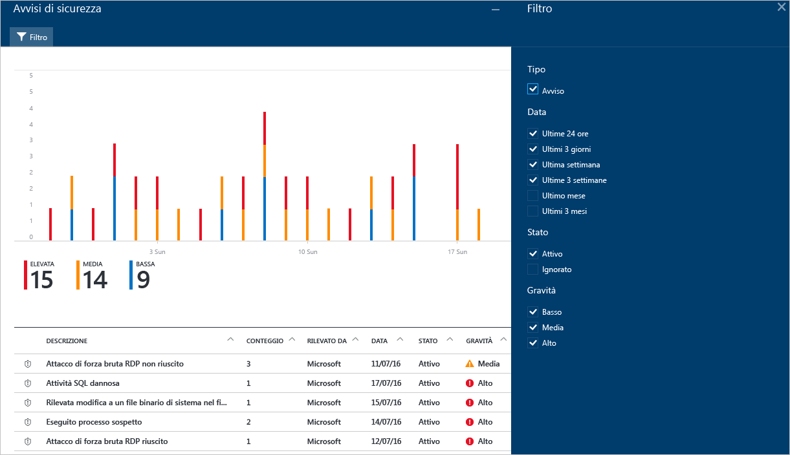
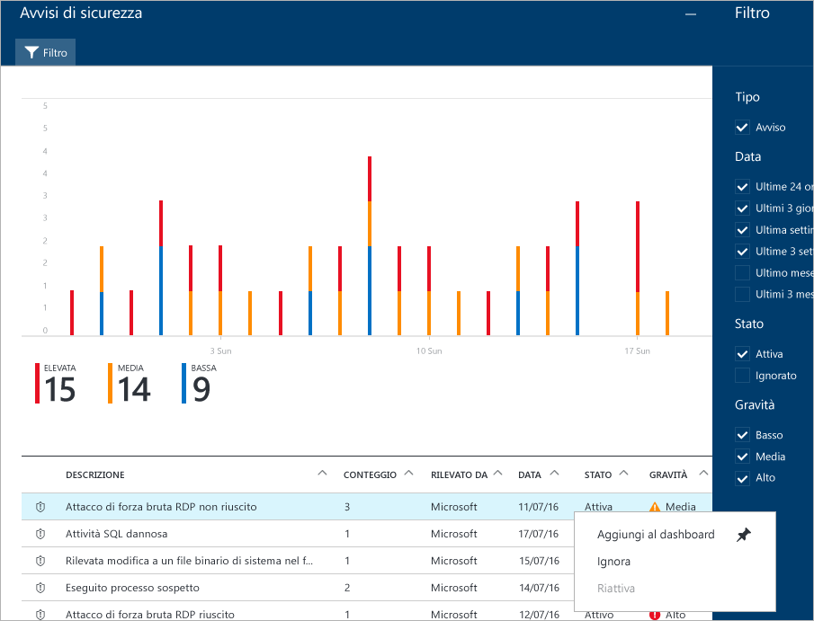
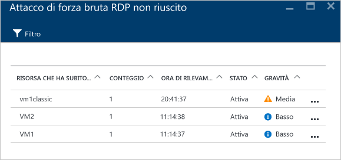
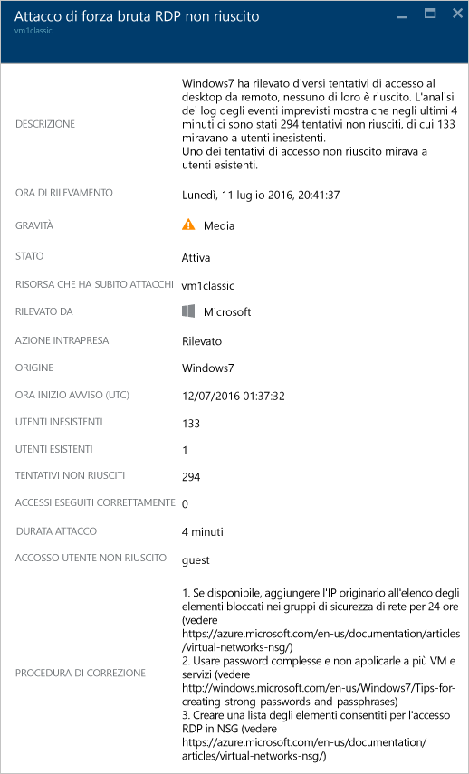

<properties
   pageTitle="Gestione e risposta agli avvisi di sicurezza nel Centro sicurezza di Azure | Microsoft Azure"
   description="Questo documento illustra come usare le funzionalità del Centro sicurezza di Azure per gestire e rispondere agli avvisi di sicurezza."
   services="security-center"
   documentationCenter="na"
   authors="YuriDio"
   manager="swadhwa"
   editor=""/>

<tags
   ms.service="security-center"
   ms.topic="hero-article"
   ms.devlang="na"
   ms.tgt_pltfrm="na"
   ms.workload="na"
   ms.date="09/19/2016"
   ms.author="yurid"/>

# Gestione e risposta agli avvisi di sicurezza nel Centro sicurezza di Azure
Questo documento illustra come usare il Centro sicurezza di Azure per gestire e rispondere agli avvisi di sicurezza.

> [AZURE.NOTE] Per abilitare le funzionalità di rilevamento avanzato, eseguire l'aggiornamento al livello Standard del Centro sicurezza di Azure. È disponibile una versione di valutazione gratuita di 90 giorni. Per eseguire l'aggiornamento, selezionare il piano tariffario nei [criteri di sicurezza](security-center-policies.md). Per altre informazioni, vedere la [pagina dei prezzi](https://azure.microsoft.com/pricing/details/security-center/).

## Informazioni sugli avvisi di sicurezza
Il Centro sicurezza raccoglie, analizza e integra automaticamente i dati di log delle risorse di Azure, della rete e delle soluzioni dei partner connesse, come soluzioni di protezione endpoint e firewall, per rilevare le minacce reali e ridurre i falsi positivi. Il Centro sicurezza visualizza un elenco degli avvisi di sicurezza in ordine di priorità, nonché le informazioni necessarie per analizzare rapidamente il problema e indicazioni per risolvere un attacco. Il Centro sicurezza di Azure aggrega anche gli avvisi corrispondenti ai modelli di catena di attacco in [eventi imprevisti](security-center-incident.md).

> [AZURE.NOTE] Per altre informazioni sulle funzionalità di rilevamento del Centro sicurezza, vedere [Funzionalità di rilevamento del Centro sicurezza di Azure](security-center-detection-capabilities.md).

## Gestire gli avvisi di sicurezza

È possibile esaminare gli avvisi correnti visualizzando il riquadro **Avvisi di sicurezza**. Aprire il portale di Azure e seguire questa procedura per visualizzare altri dettagli su ogni avviso:

1. Nel dashboard del Centro sicurezza è disponibile il riquadro **Avvisi di sicurezza**.

    

2.  Fare clic sul riquadro per aprire il pannello **Avvisi di sicurezza** contenente altri dettagli sugli avvisi, come illustrato di seguito.

    

Nella parte inferiore del pannello sono riportati i dettagli relativi ad ogni avviso. Per ordinarli, fare clic sulla colonna in base alle quale si vuole ordinare. Di seguito è riportata una definizione per ogni colonna:

- **Avviso**: breve spiegazione dell'avviso.
- **Conteggio**: elenco di tutti gli avvisi di questo tipo rilevati in un giorno specifico.
- **Rilevato da**: servizio responsabile dell'attivazione dell'avviso.
- **Data**: data in cui si è verificato l'evento.
- **Stato**: stato corrente dell'avviso. Esistono due tipi di stato:
    - **Attivo**: l'avviso di sicurezza è stato rilevato.
    - **Ignorato**: l'avviso di sicurezza è stato ignorato dall'utente. Questo stato viene usato generalmente per gli avvisi che, dopo essere stati esaminati, non sono stati valutati come un attacco effettivo oppure di cui ne sono stati attenuati gli effetti.

- **Gravità**: livello di gravità, che può essere alto, medio o basso.

### Filtro degli avvisi

È possibile filtrare gli avvisi in base a data, stato e gravità. Il filtro degli avvisi può risultare utile per scenari in cui è necessario limitare l'ambito degli avvisi di sicurezza da visualizzare. Ad esempio, potrebbe essere necessario gestire gli avvisi di sicurezza che si sono verificati nelle ultime 24 ore, perché si sta esaminando una potenziale violazione del sistema.

1. Fare clic su **Filtro** nel pannello **Avvisi di sicurezza**. Verrà visualizzato il pannello **Filtro** in cui è possibile selezionare i valori di data, stato e gravità da visualizzare.

	

2. 	Dopo avere analizzato un avviso di sicurezza, si potrebbe scoprire che si tratta di un falso positivo per il proprio ambiente o di un comportamento previsto per una determinata risorsa. In ogni caso, se si ritiene che un avviso di sicurezza non sia applicabile, è possibile ignorarlo ed escluderlo dalla visualizzazione. Esistono due modi per ignorare un avviso di sicurezza. Fare clic con il pulsante destro del mouse su un avviso e scegliere **Ignora** oppure passare il puntatore del mouse su un elemento, fare clic sui tre punti a destra e selezionare **Ignora**. È possibile visualizzare gli avvisi di sicurezza ignorati facendo clic su **Filtro** e selezionando **Ignorato**.

	

### Rispondere agli avvisi di sicurezza

Selezionare un avviso di sicurezza per altre informazioni sugli eventi che hanno attivato l'avviso e, se presenti, i passaggi da eseguire per correggere un attacco. Gli avvisi di sicurezza sono raggruppati per tipo e data. Se si fa clic su un avviso di sicurezza, viene aperto un pannello contenente un elenco degli avvisi raggruppati.

In questo caso, gli avvisi attivati fanno riferimento a un'attività RDP (Remote Desktop Protocol) sospetta. La prima colonna indica le risorse che sono state attaccate, la seconda quante volte la risorsa è stata attaccata, la terza l'ora dell'attacco, la quarta lo stato dell'avviso e la quinta il livello di gravità dell'attacco. Dopo aver esaminato queste informazioni, fare clic sulla risorsa che ha subito attacchi. Verrà visualizzato un nuovo pannello.

Nel campo **Descrizione** di questo pannello sono disponibili altri dettagli sull'evento. Tali dettagli aggiuntivi forniscono informazioni sull'azione che ha attivato l'avviso di sicurezza, la risorsa di destinazione, l'indirizzo IP di origine quando applicabile e raccomandazioni su come risolvere. In alcuni casi, l'indirizzo IP di origine sarà vuoto (non disponibile), perché non tutti i registri eventi di sicurezza di Windows includono l'indirizzo IP.

Le correzioni suggerite dal Centro sicurezza variano in base all'avviso di sicurezza. In alcuni casi, può essere necessario usare altre funzionalità di Azure per implementare la correzione consigliata. La correzione consigliata per questo tipo di attacco, ad esempio, consiste nell'aggiungere alla blacklist l'indirizzo IP che genera l'attacco usando un [ACL di rete](../virtual-network/virtual-networks-acl.md) o una regola del [gruppo di sicurezza di rete](../virtual-network/virtual-networks-nsg.md).

> [AZURE.NOTE] Per altre informazioni sui diversi tipi di avvisi, vedere [Avvisi di sicurezza per tipo nel Centro sicurezza di Azure](security-center-alerts-type.md).

## Vedere anche

In questo documento si è appreso come configurare i criteri di sicurezza nel Centro sicurezza. Per altre informazioni sul Centro sicurezza, vedere gli argomenti seguenti:

- [Gestione degli eventi imprevisti della sicurezza nel Centro sicurezza di Azure](security-center-incident.md)
- [Funzionalità di rilevamento del Centro sicurezza di Azure](security-center-detection-capabilities.md)
- [Guida alla pianificazione e alla gestione del Centro sicurezza di Azure](security-center-planning-and-operations-guide.md)
- [Domande frequenti sul Centro sicurezza di Azure](security-center-faq.md): domande frequenti sull'uso del servizio.
- [Blog sulla sicurezza di Azure](http://blogs.msdn.com/b/azuresecurity/): post di blog sulla sicurezza e sulla conformità di Azure.

<!---HONumber=AcomDC_0921_2016-->