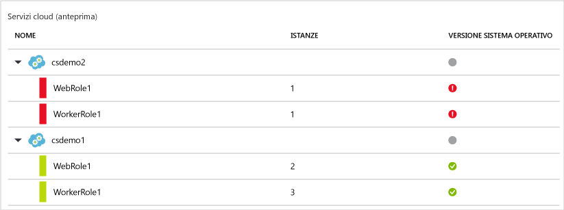

<properties
   pageTitle="Monitoraggio dell'integrità della sicurezza nel Centro sicurezza di Azure | Microsoft Azure"
   description="Questo documento consente di iniziare a utilizzare le funzionalità di monitoraggio nel Centro sicurezza di Azure."
   services="security-center"
   documentationCenter="na"
   authors="YuriDio"
   manager="swadhwa"
   editor=""/>

<tags
   ms.service="security-center"
   ms.devlang="na"
   ms.topic="hero-article"
   ms.tgt_pltfrm="na"
   ms.workload="na"
   ms.date="06/29/2016"virtual
   ms.author="yurid"/>

#Monitoraggio dell'integrità della sicurezza nel Centro sicurezza di Azure
Questo documento descrive come usare le funzionalità di monitoraggio nel Centro sicurezza di Azure per verificare la conformità ai criteri.

> [AZURE.NOTE] Le informazioni contenute in questo documento si applicano alla versione di anteprima del Centro sicurezza di Azure.

## Informazioni sul Centro sicurezza PC di Azure
Il Centro sicurezza consente di prevenire, rilevare e rispondere alle minacce con livelli avanzati di visibilità e controllo della sicurezza delle risorse di Azure. Offre funzionalità integrate di monitoraggio della sicurezza e gestione dei criteri tra le sottoscrizioni, facilita il rilevamento delle minacce che altrimenti passerebbero inosservate e funziona con un ampio ecosistema di soluzioni di sicurezza

##Che cos'è il monitoraggio dello stato di sicurezza?
Spesso si pensa al monitoraggio come l'osservazione e l'attesa di un evento al fine di reagire alla situazione verificatasi. Per monitoraggio della sicurezza si intende una strategia proattiva per il controllo delle risorse, al fine di identificare i sistemi non conformi agli standard o alle procedure consigliate della società.

##Monitoraggio dello stato di sicurezza
Dopo l'abilitazione dei [criteri di sicurezza](security-center-policies.md) per le risorse di una sottoscrizione, il Centro sicurezza analizza la sicurezza delle risorse per identificare le potenziali vulnerabilità. Le informazioni sulla configurazione di rete sono disponibili immediatamente, mentre le informazioni sulla configurazione della macchina virtuale, ad esempio lo stato di aggiornamento della sicurezza e la configurazione del sistema operativo, potrebbero diventare disponibili dopo un'ora o più. Nel pannello **Integrità sicurezza delle risorse** è possibile visualizzare lo stato di sicurezza delle risorse ed eventuali problemi rilevati, mentre nel pannello **Raccomandazioni** è disponibile l'elenco dei problemi riscontrati.

Per ulteriori informazioni su come applicare i suggerimenti leggere [Implementazione dei suggerimenti per la sicurezza nel Centro sicurezza di Azure](security-center-recommendations.md).

Il riquadro **Integrità sicurezza delle risorse** consente di monitorare lo stato di sicurezza delle risorse. L'esempio seguente mostra alcuni problemi con livelli di gravità medio e alto che richiedono attenzione. I criteri di sicurezza abilitati influiranno sui tipi di controlli monitorati.

Se il Centro sicurezza identifica una vulnerabilità che deve essere risolta, ad esempio una macchina virtuale a cui mancano aggiornamenti della sicurezza o una subnet senza un [gruppo di sicurezza di rete](../virtual-network/virtual-networks-nsg.md), viene elencata qui.

###Monitorare le macchine virtuali
Quando si fa clic su **Macchine virtuali** nel riquadro **Integrità sicurezza delle risorse**, si apre il pannello **Macchine virtuali** con altri dettagli sulle operazioni di caricamento e prevenzione, nonché un elenco di tutte le VM monitorate dal Centro sicurezza, come illustrato di seguito.

- Operazioni di caricamento
- Raccomandazioni per le macchine virtuali
- Macchine virtuali

In ogni sezione è possibile selezionare una singola opzione per visualizzare altri dettagli riguardanti il passaggio consigliato per risolvere il problema. Di seguito viene fornita una descrizione dettagliata delle singole sezioni.

####Operazioni di caricamento
Questa sezione mostra il numero totale di VM inizializzate per la raccolta dei dati, con il relativo stato corrente. Dopo l'inizializzazione della raccolta dei dati in tutte le VM, queste potranno ricevere i criteri di sicurezza dal Centro sicurezza. Quando si fa clic su questa voce, viene aperto il pannello **Inizializzazione della raccolta dati in corso** in cui è possibile vedere i nomi delle VM e lo stato corrente della raccolta dei dati nella colonna **STATO DELL'INSTALLAZIONE** illustrata di seguito:

####Raccomandazioni per le macchine virtuali
Questa sezione include una serie di raccomandazioni per ogni VM monitorata dal Centro sicurezza di Azure. La prima colonna include la raccomandazione, la seconda il numero totale di VM interessate dalla raccomandazione e la terza il livello di gravità del problema, come illustrato di seguito.

Ogni raccomandazione è inoltre associata a una serie di azioni che è possibile eseguire facendo clic su di essa. Ad esempio, se si fa clic su **Aggiornamenti di sistema mancanti**, viene aperto il pannello **Aggiornamenti di sistema mancanti**. Elenca le VM senza patch e il livello di gravità per l'aggiornamento mancante, come illustrato di seguito.

Il pannello **Aggiornamenti di sistema mancanti** mostra una tabella con le informazioni seguenti:

- **MACCHINA VIRTUALE**: nome della macchina virtuale priva di aggiornamenti.
- **AGGIORNAMENTI DI SISTEMA**: numero di aggiornamenti di sistema mancanti.
- **ORA ULTIMA ANALISI**: ora dell'ultima volta in cui il Centro sicurezza di Azure ha verificato la disponibilità di aggiornamenti per le VM.
- **STATO**: stato attuale della raccomandazione:
	- **Aperta**: la raccomandazione non è ancora stata risolta.
	- **In corso**: la raccomandazione è stata applicata alle risorse specificate e non è richiesta alcuna azione da parte dell'utente.
	- **Risolta**: la raccomandazione è già stata completata. Dopo che il problema è stato risolto, la voce è visualizzata in grigio.
- **GRAVITÀ**: descrive il livello di gravità della raccomandazione:
	- **Elevata**: esiste una vulnerabilità associata a una risorsa significativa, ad esempio applicazione, macchina virtuale, gruppo di sicurezza di rete, che richiede attenzione.
	- **Media**: sono necessari passaggi aggiuntivi, o non critici, per completare un processo o eliminare una vulnerabilità.
	- **Bassa**: vulnerabilità che è opportuno risolvere, ma non richiede attenzione immediata. Per impostazione predefinita, le raccomandazioni con gravità bassa non appaiono, ma è possibile visualizzarle applicando il filtro corrispondente.

Per visualizzare i dettagli delle raccomandazioni, fare clic sul nome della VM. Viene aperto un nuovo pannello per la VM con l'elenco degli aggiornamenti, come illustrato di seguito.

> [AZURE.NOTE] I suggerimenti per la sicurezza contenuti qui sono identici a quelli nel pannello relativo ai suggerimenti. Vedere l'articolo [Implementazione dei suggerimenti per la sicurezza nel Centro sicurezza di Azure](security-center-recommendations.md) per ulteriori informazioni sui suggerimenti per la risoluzione dei problemi. Questo vale non solo per le VM, ma anche per tutte le risorse disponibili nel riquadro Integrità delle risorse.

####Sezione Macchine virtuali
La sezione relativa alle macchine virtuali offre una panoramica di tutte le VM con le relative raccomandazioni. Ogni colonna rappresenta un set di raccomandazioni, come illustrato di seguito:

L'icona visualizzata sotto ogni tipo di raccomandazione consente di identificare rapidamente le VM che richiedono attenzione e il tipo di raccomandazione.

Nell'esempio precedente una VM presenta una raccomandazione critica relativa a programmi antimalware. Per ottenere altre informazioni, fare clic sulla VM. Viene aperto un nuovo pannello che rappresenta questa VM, come illustrato di seguito.

Nel pannello sono presenti anche dettagli di sicurezza relativi alla VM. Nella parte inferiore è possibile vedere l'azione consigliata e il livello di gravità di ogni problema.

#### Sezione Servizi cloud (anteprima)
Lo stato di integrità per i servizi cloud è incluso nel riquadro di integrità della sicurezza delle macchine virtuali. Quando la versione del sistema operativo non è aggiornata, viene creata una raccomandazione come illustrato di seguito:

È necessario seguire i passaggi indicati nella raccomandazione per aggiornare la versione del sistema operativo. Ad esempio, se si fa clic nell'avviso rosso in un ruolo Web (che esegue Windows Server con l'app Web distribuita automaticamente in IIS) o un ruolo di lavoro (che esegue Windows Server con l'app Web distribuita automaticamente in IIS), verrà visualizzato un nuovo pannello con altri dettagli su questa raccomandazione come illustrato di seguito:

Per visualizzare una spiegazione più esaustiva riguardante questa raccomandazione, fare clic su Aggiorna **versione del sistema operativo** nella colonna **DESCRIZIONE **. Verrà aperto il pannello **Aggiorna la versione del sistema operativo (anteprima)** con altri dettagli.

### Monitorare le reti virtuali
Quando si fa clic su **Rete** nel riquadro **Integrità sicurezza delle risorse**, viene aperto il pannello **Rete** con altri dettagli, come illustrato di seguito:

####Raccomandazioni di rete

Analogamente alle informazioni sull'integrità delle risorse delle macchine virtuali, il pannello fornisce un elenco riepilogativo dei problemi nella parte superiore e un elenco delle reti monitorate nella parte inferiore.

La sezione dei dettagli sullo stato della rete elenca i problemi di sicurezza potenziali e fornisce raccomandazioni. I possibili problemi possono includere:

- Firewall di nuova generazione non installato
- Gruppi di sicurezza di rete nelle subnet non abilitati
- Gruppi di sicurezza di rete nelle VM non abilitati
- Limitare l'accesso esterno tramite endpoint esterni pubblici
- Endpoint con connessione Internet integri

Quando si fa clic su una delle raccomandazioni, si apre un pannello con altre informazioni su di essa, come illustrato nell'esempio seguente:

In questo esempio il pannello **Configura i gruppi di sicurezza di rete mancanti per le subnet** include un elenco di subnet e macchine virtuali prive della protezione dei gruppi di sicurezza di rete. Se si fa clic sulla subnet a cui si vuole applicare il gruppo di sicurezza di rete, verrà aperto un altro pannello.

Nel pannello **Scegli un gruppo di sicurezza di rete** è possibile selezionare il gruppo di sicurezza di rete più appropriato per la subnet oppure creare un nuovo gruppo di sicurezza di rete.

####Sezione Endpoint con connessione Internet

Nella sezione **Endpoint con connessione Internet** è possibile visualizzare le macchine virtuali attualmente configurate con un endpoint con connessione Internet e il relativo stato corrente.

La tabella include il nome dell'endpoint che rappresenta la macchina virtuale, l'indirizzo IP con connessione Internet, lo stato corrente di gravità del gruppo di sicurezza di rete e del firewall di nuova generazione. Questa tabella è ordinata in base alla gravità, come descritto di seguito:
- Rosso (in alto): priorità elevata e da risolvere immediatamente
- Arancione: priorità media e da risolvere appena possibile
- Verde (ultimo): stato di integrità

####Sezione Topologia di rete

La sezione **Topologia di rete** include una visualizzazione gerarchica delle risorse, come illustrato di seguito:

Questa tabella è ordinata (VM e subnet) in base a gravità, come illustrato di seguito:
- Rosso (in alto): priorità elevata e da risolvere immediatamente
- Arancione: priorità media e da risolvere appena possibile
- Verde (ultimo): stato di integrità

Nella visualizzazione della topologia il primo livello include [Reti virtuali](../virtual-network/virtual-networks-overview.md), [Gateway di rete virtuale](../vpn-gateway/vpn-gateway-site-to-site-create.md) e la [Rete virtuale (versione classica)](../virtual-network/virtual-networks-create-vnet-classic-pportal.md). Il secondo livello include le subnet e il terzo livello include le VM appartenenti alle subnet. La colonna destra include lo stato attuale del gruppo di sicurezza di rete per queste risorse. L'esempio seguente è il risultato della selezione della macchina virtuale VM-CL-W1:

La parte inferiore del pannello include le raccomandazioni per questa VM, simili a quanto illustrato in precedenza. È possibile fare clic su una raccomandazione per ottenere altre informazioni o per applicare il controllo di sicurezza necessario o la configurazione.

###Monitorare le risorse SQL
Se si fa clic su **SQL** nel riquadro **Integrità sicurezza delle risorse**, verrà aperto il pannello SQL con raccomandazioni relative a problemi come la mancata abilitazione del servizio di controllo e di Transparent Data Encryption. Include anche raccomandazioni relative allo stato di integrità generale del database.

È possibile fare clic su una di queste raccomandazioni e visualizzare altri dettagli, nonché eseguire altre azioni per risolvere il problema. L'esempio seguente illustra l'espansione della raccomandazione **Controllo database non abilitato**.

Il pannello **Abilita il controllo sui database SQL** include le informazioni seguenti:

- Elenco di database SQL.
- Server in cui si trovano.
- Informazioni sull'impostazione, ovvero se è stata ereditata dal server o se è univoca in questo database.
- Stato corrente.
- Gravità del problema.

Se si fa clic sul database per gestire la raccomandazione, verrà aperto il pannello **Controllo e rilevamento minacce**, come illustrato di seguito.

Per abilitare questa funzionalità, selezionare semplicemente **SÌ** sotto l'opzione **Controllo** e quindi fare clic su **Salva**.

###Monitorare le applicazioni
Se il carico di lavoro di Azure include applicazioni che si trovano in [macchine virtuali di Resource Manager](../resource-manager-deployment-model.md) con porte Web esposte (porte TCP 80 e 443), il Centro sicurezza può monitorarle per identificare potenziali problemi di sicurezza, suggerendo le procedure di correzione possibili. Quando si fa clic sul riquadro **Applicazioni**, verrà aperto il pannello **Applicazioni** con una serie di raccomandazioni nella sezione relativa alla procedura di prevenzione. Visualizza anche il dettaglio dell'applicazione per host/IP virtuale, come illustrato di seguito.

Proprio come per le altre raccomandazioni, è possibile fare clic su di essa per visualizzare altri dettagli sul problema e su come risolverlo. L'esempio illustrato nella figura seguente è un'applicazione identificata come applicazione Web non sicura. Se si seleziona l'applicazione considerata non sicura, si aprirà un altro pannello con l'opzione seguente disponibile:

Nel pannello **Applicazioni Web non protette** è disponibile un elenco di tutte le macchine virtuali che contengono applicazioni considerate non sicure. L'elenco mostra il nome della VM, lo stato corrente del problema e il relativo livello di gravità. Facendo clic su questa applicazione Web, verrà aperto il pannello **Aggiungi un web application firewall** con opzioni per installare un WAF (web application firewall) di terze parti, come illustrato di seguito.

## Passaggi successivi
In questo documento è stato descritto come utilizzare le funzionalità di monitoraggio nel Centro sicurezza di Azure. Per ulteriori informazioni sul Centro sicurezza di Azure, vedere gli argomenti seguenti:

- [Impostazione dei criteri di sicurezza nel Centro sicurezza di Azure](security-center-policies.md): informazioni su come configurare le impostazioni di sicurezza nel Centro sicurezza di Azure
- [Gestione e risposta agli avvisi di sicurezza nel Centro sicurezza di Azure](security-center-managing-and-responding-alerts.md): informazioni su come gestire e rispondere agli avvisi di sicurezza
- [Monitoraggio delle soluzioni dei partner con il Centro sicurezza di Azure](security-center-partner-solutions.md): informazioni su come monitorare lo stato integrità delle soluzioni dei partner.
- [Domande frequenti sul Centro sicurezza di Azure](security-center-faq.md): domande frequenti sull'uso del servizio
- [Blog sulla sicurezza di Azure](http://blogs.msdn.com/b/azuresecurity/): post di blog sulla sicurezza e sulla conformità di Azure

<!---HONumber=AcomDC_0706_2016-->