# Monitoraggio dell'integrità della sicurezza nel Centro sicurezza di Azure
Questo articolo descrive come usare le funzionalità di monitoraggio nel Centro sicurezza di Azure per verificare la conformità ai criteri.

## Che cos'è il monitoraggio dello stato di sicurezza?
Spesso si pensa al monitoraggio come l'osservazione e l'attesa di un evento al fine di reagire alla situazione verificatasi. Per monitoraggio della sicurezza si intende una strategia proattiva per il controllo delle risorse, al fine di identificare i sistemi non conformi agli standard o alle procedure consigliate della società.

## Monitoraggio dello stato di sicurezza
Dopo avere abilitato i [criteri di sicurezza](security-center-policies.md) per le risorse di una sottoscrizione, il Centro sicurezza analizza la sicurezza delle risorse per identificare le potenziali vulnerabilità. Le informazioni sulla configurazione di rete sono disponibili immediatamente. Le informazioni sulla configurazione della macchina virtuale, ad esempio lo stato di aggiornamento della sicurezza e la configurazione del sistema operativo, potrebbero diventare disponibili dopo un'ora o più. Nel pannello **Integrità sicurezza delle risorse** è possibile visualizzare lo stato di sicurezza delle risorse ed eventuali problemi rilevati. Anche nel pannello **Raccomandazioni** è disponibile l'elenco dei problemi riscontrati.

Per altre informazioni su come applicare le raccomandazioni, leggere l'articolo sull'[implementazione delle raccomandazioni sulla sicurezza nel Centro sicurezza di Azure](security-center-recommendations.md).

Il riquadro **Integrità sicurezza delle risorse** consente di monitorare lo stato di sicurezza delle risorse. L'esempio seguente mostra alcuni problemi con livelli di gravità medio e alto che richiedono attenzione. I criteri di sicurezza abilitati influiranno sui tipi di controlli monitorati.

Se il Centro sicurezza identifica una vulnerabilità che deve essere risolta, ad esempio una macchina virtuale in cui mancano aggiornamenti della sicurezza o una subnet senza un [gruppo di sicurezza di rete](/virtual-network/virtual-networks-nsg.md), la vulnerabilità verrà riportata qui.

### Monitorare le risorse di calcolo
Quando si fa clic su **Calcolo** nel riquadro **Integrità sicurezza delle risorse**, il pannello **Calcolo** visualizzato comprende tre schede:

- **Panoramica**: consigli sul monitoraggio e sulle macchine virtuali.
- **Macchine virtuali**: elenco di tutte le macchine virtuali e il rispettivo stato di sicurezza corrente.
- **Servizi cloud**: elenco di tutti i ruoli Web e di lavoro monitorati dal Centro sicurezza.

In ogni scheda possono essere presenti più sezioni ed è possibile selezionare in ogni sezione una singola opzione per visualizzare altri dettagli sulla procedura consigliata per risolvere il problema. 

#### Monitoraggio delle raccomandazioni
Questa sezione mostra il numero totale di macchine virtuali inizializzate per la raccolta dei dati, con i relativi stati correnti. Dopo l'inizializzazione della raccolta dei dati in tutte le macchine virtuali, queste potranno ricevere i criteri di sicurezza dal Centro sicurezza. Quando si fa clic su questa voce, viene visualizzato il pannello **L'agente di macchine virtuali non è presente o non risponde**. 

#### Raccomandazioni per le macchine virtuali
Questa sezione include una serie di [raccomandazioni per ogni macchina virtuale](security-center-virtual-machine-recommendations.md) monitorata dal Centro sicurezza di Azure. La prima colonna elenca la raccomandazione. La seconda colonna mostra il numero totale di macchine virtuali interessate da questa raccomandazione. La terza colonna indica la gravità del problema, come illustrato nello screenshot seguente.

> [!NOTE]
> Nell'elenco **Network topology** (Topologia di rete) del pannello **Networking Health** (Integrità rete) vengono visualizzate soltanto le macchine virtuali con almeno un endpoint pubblico.
>
>

Ogni raccomandazione è inoltre associata a una serie di azioni che è possibile eseguire dopo aver fatto clic su di essa. Ad esempio, se si fa clic su **Aggiornamenti di sistema mancanti**, viene aperto il pannello **Aggiornamenti di sistema mancanti**. Elenca le macchine virtuali senza patch e il livello di gravità per l'aggiornamento mancante, come illustrato nello screenshot seguente.

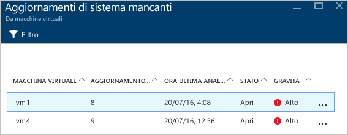

Il pannello **Aggiornamenti di sistema mancanti** mostra una tabella con le informazioni seguenti:

* **MACCHINA VIRTUALE**: nome della macchina virtuale priva di aggiornamenti.
* **AGGIORNAMENTI DI SISTEMA**: numero di aggiornamenti di sistema mancanti.
* **ORA ULTIMA ANALISI**: ora dell'ultima volta in cui il Centro sicurezza di Azure ha verificato la disponibilità di aggiornamenti per le macchine virtuali.
* **STATO**: stato attuale della raccomandazione:
  * **Aperta**: la raccomandazione non è ancora stata risolta.
  * **In corso**: la raccomandazione è stata applicata alle risorse e non è richiesta alcuna azione da parte dell'utente.
  * **Risolta**: la raccomandazione è stata già completata. Quando il problema è stato risolto, la voce viene visualizzata in grigio.
* **GRAVITÀ**: descrive il livello di gravità della raccomandazione:
  * **Elevata**: esiste una vulnerabilità associata a una risorsa significativa, ad esempio applicazione, macchina virtuale, gruppo di sicurezza di rete, che richiede attenzione.
  * **Media**: sono necessari passaggi aggiuntivi, o non critici, per completare un processo o eliminare una vulnerabilità.
  * **Bassa**: vulnerabilità che è opportuno risolvere, ma non richiede attenzione immediata. Per impostazione predefinita, le raccomandazioni con gravità bassa non appaiono, ma è possibile visualizzarle applicando il filtro corrispondente.

Per visualizzare i dettagli delle raccomandazioni, fare clic sul nome della macchina virtuale. Viene visualizzato un nuovo pannello per la macchina virtuale con l'elenco degli aggiornamenti, come illustrato nello screenshot seguente.

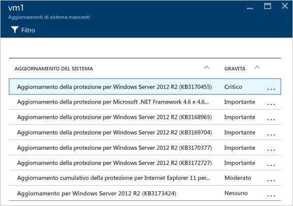

> [!NOTE]
> Le raccomandazioni sulla sicurezza contenute qui sono identiche a quelle nel pannello **Raccomandazioni**. Per altre informazioni su come gestire correttamente le raccomandazioni, leggere l'articolo sull'[implementazione delle raccomandazioni sulla sicurezza nel Centro sicurezza di Azure](security-center-recommendations.md). Questo vale non solo per le macchine virtuali, ma anche per tutte le risorse disponibili nel riquadro **Integrità delle risorse**.
>
>

#### Sezione Macchine virtuali
La sezione relativa alle macchine virtuali offre una panoramica di tutte le macchine virtuali con le relative raccomandazioni. Ogni colonna rappresenta un set di raccomandazioni, come illustrato nello screenshot seguente:

L'icona visualizzata sotto ogni tipo di raccomandazione consente di identificare rapidamente le macchine virtuali che richiedono attenzione e il tipo di raccomandazione.

Nell'esempio precedente, per una macchina virtuale è disponibile una raccomandazione critica relativa a Endpoint Protection. Per ottenere altre informazioni relative alla macchina virtuale, fare clic su di essa. Un nuovo pannello che viene visualizzato rappresenta questa macchina virtuale, come illustrato nello screenshot seguente.

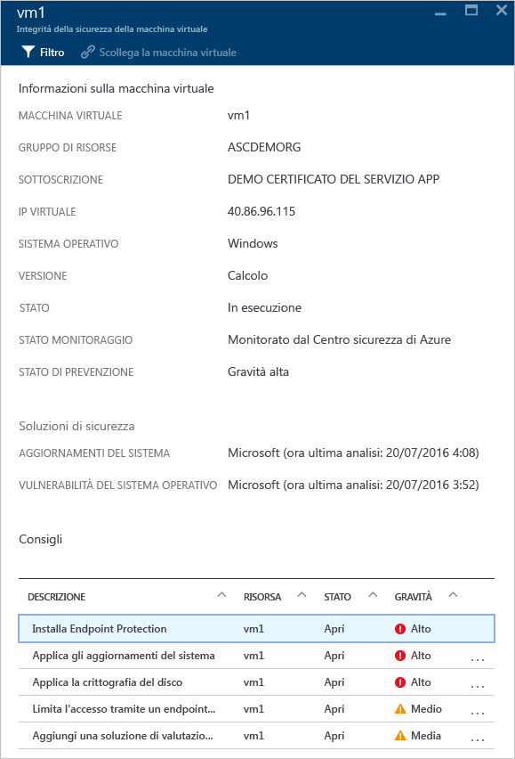

Il pannello include dettagli di sicurezza per la macchina virtuale. Nella parte inferiore di questo pannello è possibile vedere l'azione consigliata e il livello di gravità di ogni problema.

#### Sezione Servizi cloud
Per i servizi cloud viene creata una raccomandazione quando la versione del sistema operativo non è aggiornata, come illustrato nello screenshot seguente:

In uno scenario in cui è presente una raccomandazione, a differenza dell'esempio precedente, è necessario seguire la procedura illustrata nella raccomandazione per aggiornare la versione del sistema operativo. Quando è disponibile un aggiornamento, verrà visualizzato un avviso di tipo rosso o arancione, in base alla gravità del problema. Quando si fa clic su questo avviso in un ruolo Web1 (che esegue Windows Server con l'app Web distribuita automaticamente in IIS) o un ruolo di lavoro1 (che esegue Windows Server con l'app Web distribuita automaticamente in IIS), verrà visualizzato un nuovo pannello con altri dettagli su questa raccomandazione, come illustrato nello screenshot seguente:

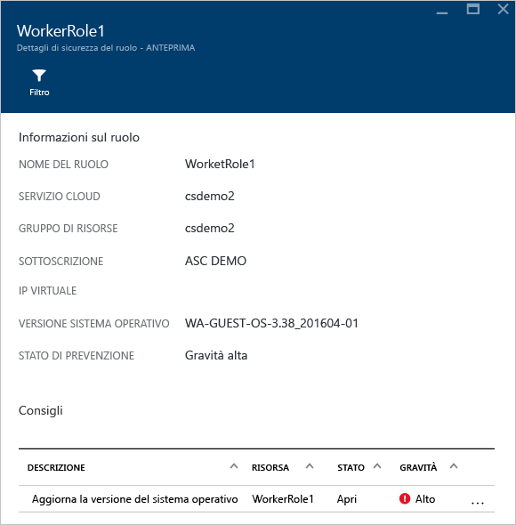

Per visualizzare una spiegazione più esaustiva riguardante questa raccomandazione, fare clic su **Aggiorna la versione del sistema operativo** nella colonna **DESCRIZIONE**. Viene aperto il pannello **Aggiorna la versione del sistema operativo (anteprima)** con altri dettagli.

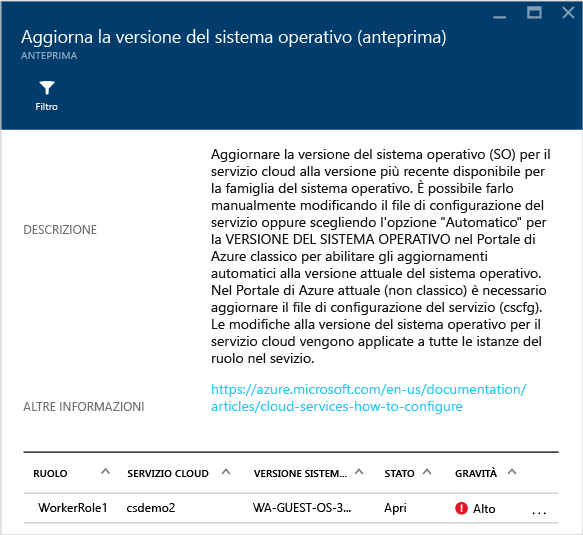  

### Monitorare le reti virtuali
Quando si fa clic su **Rete** nel riquadro **Integrità sicurezza delle risorse**, viene aperto il pannello **Rete** con altri dettagli, come illustrato nello screenshot seguente:

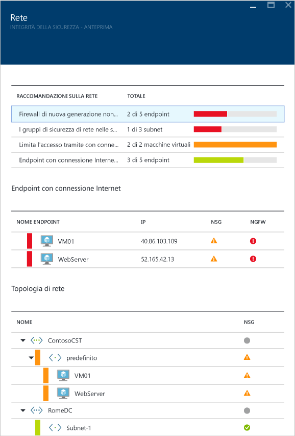

#### Raccomandazioni di rete
Come le informazioni sull'integrità delle risorse delle macchine virtuali, il pannello fornisce un elenco riepilogativo dei problemi nella parte superiore e un elenco delle reti monitorate nella parte inferiore.

La sezione dei dettagli sullo stato della rete elenca i problemi di sicurezza potenziali e fornisce [raccomandazioni](security-center-network-recommendations.md). I possibili problemi possono includere:

* Firewall di nuova generazione non installato
* Gruppi di sicurezza di rete nelle subnet non abilitati
* Gruppi di sicurezza di rete nelle macchine virtuali non abilitati
* Limitare l'accesso esterno tramite endpoint esterni pubblici
* Endpoint con connessione Internet integri

Quando si fa clic su una raccomandazione, viene visualizzato un nuovo pannello con altri dettagli sulla raccomandazione, come illustrato nello screenshot seguente.

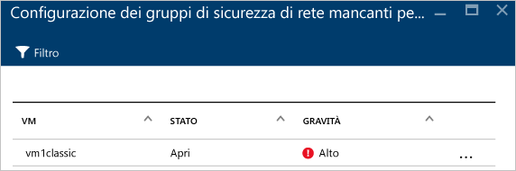

In questo esempio il pannello **Configura i gruppi di sicurezza di rete mancanti per le subnet** include un elenco di subnet e macchine virtuali prive della protezione dei gruppi di sicurezza di rete. Se si sfa clic sulla subnet a cui applicare il gruppo di sicurezza di rete, viene visualizzato un altro pannello.

Nel pannello **Scegli un gruppo di sicurezza di rete** è possibile selezionare il gruppo di sicurezza di rete più appropriato per la subnet oppure creare un nuovo gruppo di sicurezza di rete.

#### Sezione Endpoint con connessione Internet
Nella sezione **Endpoint con connessione Internet** è possibile visualizzare le macchine virtuali attualmente configurate con un endpoint con connessione Internet e il relativo stato corrente.

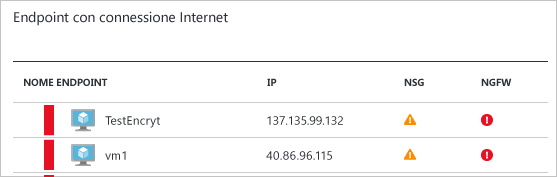

La tabella include il nome dell'endpoint che rappresenta la macchina virtuale, l'indirizzo IP con connessione Internet, lo stato corrente di gravità del gruppo di sicurezza di rete e del firewall di nuova generazione. Questa tabella è ordinata in base alla gravità:

* Rosso (in alto): priorità elevata e da risolvere immediatamente
* Arancione: priorità media e da risolvere appena possibile
* Verde (ultimo): stato di integrità

#### Sezione Topologia di rete
La sezione **Topologia di rete** include una visualizzazione gerarchica delle risorse, come illustrato nello screenshot seguente:

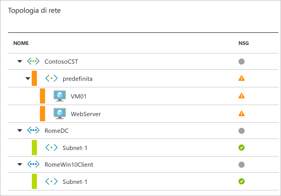

Questa tabella è ordinata (macchine virtuali e subnet) in base alla gravità:

* Rosso (in alto): priorità elevata e da risolvere immediatamente
* Arancione: priorità media e da risolvere appena possibile
* Verde (ultimo): stato di integrità

Nella visualizzazione della topologia il primo livello include [Reti virtuali](../virtual-network/virtual-networks-overview.md), [Gateway di rete virtuale](/vpn-gateway/vpn-gateway-site-to-site-create.md) e [Rete virtuale (versione classica)](/virtual-network/virtual-networks-create-vnet-classic-pportal.md). Il secondo livello include le subnet e il terzo livello include le macchine virtuali appartenenti alle subnet. La colonna destra include lo stato attuale del gruppo di sicurezza di rete per queste risorse, come illustrato nell'esempio seguente:

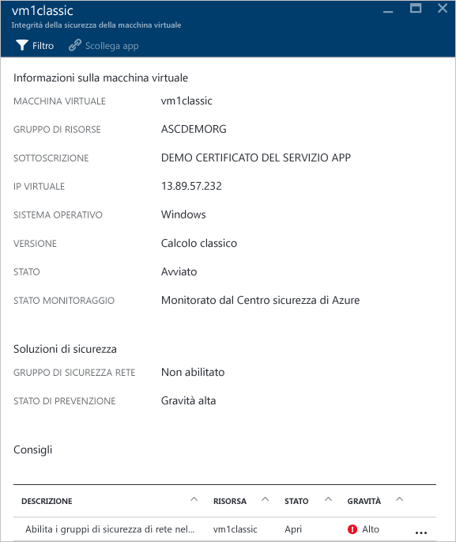

La parte inferiore del pannello include le raccomandazioni per questa macchina virtuale, simili a quanto illustrato in precedenza. È possibile fare clic su una raccomandazione per ottenere altre informazioni o per applicare la configurazione o il controllo di sicurezza necessario.

### Monitorare di dati

Quando si fa clic su **SQL & Data** (SQL e dati) nel riquadro **Resources security health** (Integrità della sicurezza delle risorse) viene aperto il pannello **Risorse dati** con raccomandazioni relative a SQL e all'archiviazione. Il pannello include anche [raccomandazioni](security-center-sql-service-recommendations.md) sullo stato di integrità generale del database. Per altre informazioni sulla crittografia per l'archiviazione, vedere [Enable encryption for Azure storage account in Azure Security Center](security-center-enable-encryption-for-storage-account.md) (Abilitare la crittografia per l'account di archiviazione di Azure nel Centro sicurezza di Azure).

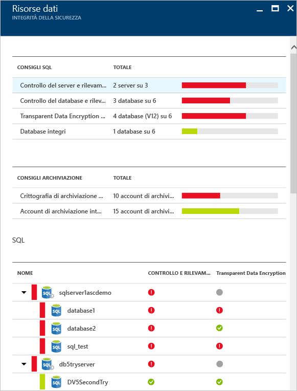

In **Raccomandazioni su SQL** è possibile fare clic su qualsiasi raccomandazione e ottenere maggiori dettagli sulle ulteriori azioni per risolvere un problema. L'esempio seguente illustra l'espansione della raccomandazione **Database Auditing & Threat detection on SQL databases** (Controllo database e rilevamento minacce nei database SQL).

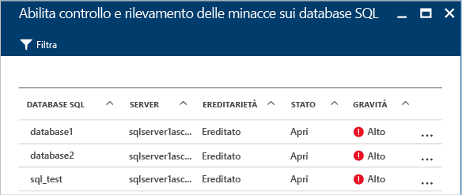

Il pannello **Abilita il controllo e il rilevamento minacce nei database SQL** contiene le informazioni seguenti:

* Elenco di database SQL.
* Server in cui si trovano.
* Informazioni sull'impostazione, ovvero se è stata ereditata dal server o se è univoca in questo database.
* Stato corrente.
* Gravità del problema.

Quando si fa clic sul database per applicare la raccomandazione, viene aperto il pannello **Controllo e rilevamento minacce** come illustrato nella schermata seguente.

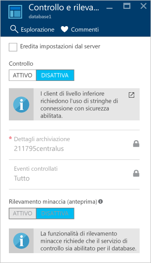

Per abilitare il controllo, selezionare semplicemente **SÌ** nell'opzione **Controllo**.

### Monitorare le applicazioni

Se il carico di lavoro di Azure include applicazioni che si trovano nelle [macchine virtuali create tramite Azure Resource Manager](../azure-resource-manager/resource-manager-deployment-model.md) con porte Web esposte (porte TCP 80 e 443), il Centro sicurezza può monitorarle per identificare potenziali problemi di sicurezza, raccomandando le procedure di correzione. Quando si fa clic sul riquadro **Applicazioni**, viene aperto il pannello **Applicazioni** con una serie di raccomandazioni nella sezione **Application recommendations** (Raccomandazioni applicazione). Visualizza anche il dettaglio dell'applicazione per host/IP virtuale, come illustrato nello screenshot seguente.

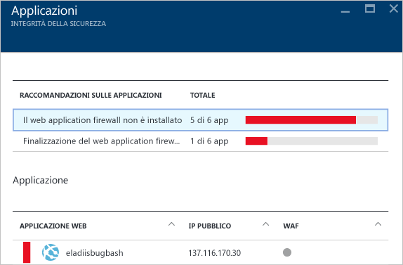

Proprio come per le altre raccomandazioni, è possibile fare clic su una raccomandazione per visualizzare altri dettagli sul problema e su come risolverlo. L'esempio illustrato nella figura seguente è un'applicazione identificata come applicazione Web non sicura. Se si seleziona l'applicazione considerata non sicura, si apre un altro pannello con l'opzione seguente disponibile:

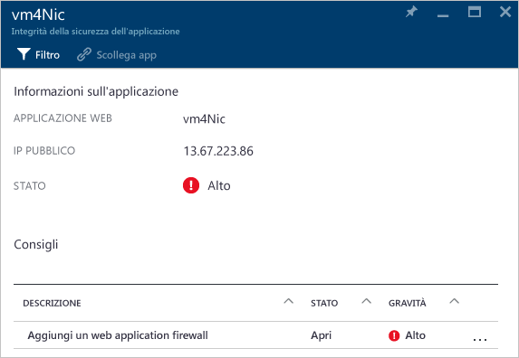

Questo pannello visualizza un elenco di tutte le raccomandazioni per l'applicazione. Facendo clic sulla raccomandazione **Aggiungi un web application firewall** verrà aperto il pannello **Aggiungi un web application firewall** con opzioni per installare un web application firewall (WAF) di un partner, come illustrato nello screenshot seguente.

## Vedere anche
Questo articolo descrive come usare le funzionalità di monitoraggio nel Centro sicurezza di Azure. Per ulteriori informazioni sul Centro sicurezza di Azure, vedere gli argomenti seguenti:

* [Impostazione dei criteri di sicurezza nel Centro sicurezza di Azure](security-center-policies.md): informazioni su come configurare le impostazioni di sicurezza nel Centro sicurezza di Azure.
* [Gestione e risposta agli avvisi di sicurezza nel Centro sicurezza di Azure](security-center-managing-and-responding-alerts.md): informazioni su come gestire e rispondere agli avvisi di sicurezza.
* [Monitoraggio delle soluzioni dei partner con il Centro sicurezza di Azure](security-center-partner-solutions.md): informazioni su come monitorare l'integrità delle soluzioni dei partner.
* [Domande frequenti sul Centro sicurezza di Azure](security-center-faq.md): domande frequenti sull'uso del servizio.
* [Blog sulla sicurezza di Azure](http://blogs.msdn.com/b/azuresecurity/): post di blog sulla sicurezza e sulla conformità di Azure.

