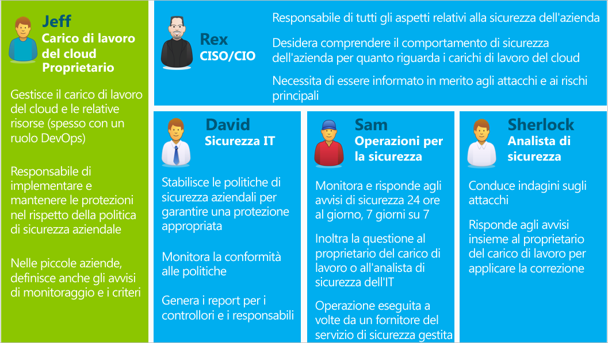

<properties
   pageTitle="Guida alla pianificazione e alla gestione del Centro sicurezza di Azure | Microsoft Azure"
   description="Questo documento contiene indicazioni utili per l'adozione del Centro sicurezza di Azure e considerazioni relative alle operazioni quotidiane."
   services="security-center"
   documentationCenter="na"
   authors="YuriDio"
   manager="swadhwa"
   editor=""/>

<tags
   ms.service="security-center"
   ms.topic="hero-article" 
   ms.devlang="na"
   ms.tgt_pltfrm="na"
   ms.workload="na"
   ms.date="04/25/2016"
   ms.author="yurid"/>
 
# Guida alla pianificazione e alla gestione del Centro sicurezza di Azure
Questa guida è destinata a professionisti IT, architetti IT, analisti della sicurezza delle informazioni e amministratori cloud le cui organizzazioni intendano usare il Centro sicurezza di Azure.

> [AZURE.NOTE] Le informazioni contenute in questo documento si applicano alla versione di anteprima del Centro sicurezza di Azure.

## Panoramica sul Centro sicurezza di Azure
Il Centro sicurezza PC di Azure impedisce, rileva e risponde alle minacce mediante visibilità e controllo avanzati della sicurezza delle risorse di Azure. Offre funzionalità integrate di monitoraggio della sicurezza e gestione dei criteri tra le sottoscrizioni, facilita il rilevamento delle minacce che altrimenti passerebbero inosservate e funziona con un ampio ecosistema di soluzioni di sicurezza.

Per un elenco delle domande più comuni che possono anche risultare utili durante la fase di progettazione e di pianificazione, vedere [Domande frequenti sul Centro sicurezza di Azure](security-center-faq.md).

## Guida alla pianificazione
Questa guida illustra una serie di passaggi e attività che è possibile eseguire per ottimizzare l'uso del Centro sicurezza di Azure in base ai requisiti di sicurezza e al modello di gestione cloud dell'organizzazione. Per poter sfruttare tutti i vantaggi del Centro sicurezza di Azure, è importante sapere come i vari utenti o team dell'organizzazione useranno il servizio per soddisfare le esigenze di gestione e sviluppo sicuri, monitoraggio, governance e risposta agli eventi imprevisti. Le aree principali da considerare quando si prevede di usare il Centro sicurezza di Azure sono:

- Ruoli di sicurezza e controlli di accesso
- Criteri di sicurezza e raccomandazioni
- Raccolta dati e archiviazione
- Monitoraggio continuo della sicurezza 
- Risposta agli eventi imprevisti

Nella sezione successiva si apprenderà come pianificare ogni singola area e applicare le raccomandazioni in base alle esigenze.

## Ruoli di sicurezza e controlli di accesso 

A seconda delle dimensioni e della struttura dell'organizzazione, il Centro sicurezza di Azure potrebbe essere usato da più utenti e team per l'esecuzione di diverse attività correlate alla sicurezza. Di seguito è riportato un esempio di utenti fittizi e dei rispettivi ruoli e responsabilità di sicurezza:

Il Centro sicurezza di Azure permette a queste persone di svolgere i relativi ruoli. Ad esempio:

**Jeff (proprietario del carico di lavoro cloud)**

- Visualizza e completa le raccomandazioni del Centro sicurezza di Azure nel portale di Azure. 
- Può anche usare un sistema di creazione di ticket per tenere traccia delle modifiche e popola le raccomandazioni tramite API.

**Rex (CISO/CIO)**

- Visualizza i report del Centro sicurezza di Azure in Power BI o Excel.

**David (sicurezza IT)**

- Imposta i criteri di sicurezza e visualizza l'integrità della sicurezza nel portale di Azure.
- Analizza i dati e genera report in Power BI. 

**Sam (attività di sicurezza)**

- Visualizza e valuta gli avvisi del Centro sicurezza di Azure nel portale di Azure. 
- Può usare un dashboard esistente e popola gli avvisi tramite API.

**Sherlock (analista di sicurezza)**

- Visualizza gli avvisi del Centro sicurezza di Azure nel portale di Azure. 
- Può usare un dashboard esistente e popola gli avvisi tramite API.
- Analizza le tendenze degli avvisi in Power BI. 
- Esamina i log eventi di Archiviazione.

Il Centro sicurezza di Azure fa uso del [controllo degli accessi in base al ruolo](../active-directory/role-based-access-control-configure.md), con [ruoli predefiniti](../active-directory/role-based-access-built-in-roles.md) che possono essere assegnati a utenti, gruppi e servizi in Azure. Quando un utente apre il Centro sicurezza di Azure, vede unicamente le informazioni relative alle risorse a cui ha accesso. Ciò significa che l'utente viene assegnato al ruolo Proprietario, Collaboratore o Lettore per la sottoscrizione o il gruppo di risorse a cui appartengono tali risorse. Con gli utenti fittizi precedenti, sarebbe necessario il controllo degli accessi in base al ruolo illustrato di seguito:

**Jeff (proprietario del carico di lavoro cloud)**

- Proprietario del gruppo di risorse/Collaboratore.

**David (sicurezza IT)**

- Proprietario della sottoscrizione/Collaboratore.

**Sam (attività di sicurezza)**

- Lettore della sottoscrizione per la visualizzazione di avvisi.
- Proprietario della sottoscrizione/Collaboratore che deve ignorare gli avvisi.

**Sherlock (analista di sicurezza)**

- Lettore della sottoscrizione per la visualizzazione di avvisi.
- Proprietario della sottoscrizione/Collaboratore che deve correggere o ignorare gli avvisi.
- Potrebbe essere necessario l'accesso all'archiviazione.

Altre informazioni importanti da considerare:

- Soltanto i ruoli di Proprietario e Collaboratore della sottoscrizione possono modificare i criteri di sicurezza.
- Soltanto i ruoli di Proprietario e Collaboratore della sottoscrizione e del gruppo di risorse possono applicare le raccomandazioni sulla sicurezza per una risorsa.

Quando si pianifica il controllo di accesso con il controllo degli accessi in base al ruolo per il Centro sicurezza di Azure, è necessario sapere chi userà il Centro sicurezza di Azure all'interno dell'organizzazione e quali tipi di attività dovrà eseguire. Configurare quindi il controllo degli accessi in base al ruolo in modo appropriato.

> [AZURE.NOTE] È consigliabile assegnare il ruolo con il minor numero di autorizzazioni che permetta agli utenti di completare le attività. Ad esempio, agli utenti che hanno solo necessità di visualizzare le informazioni sullo stato di sicurezza delle risorse senza intervenire, per applicare le raccomandazioni o modificare i criteri, deve essere assegnato il ruolo Lettore.

## Criteri di sicurezza e raccomandazioni
I criteri di sicurezza definiscono il set di controlli consigliato per le risorse all'interno della sottoscrizione o di un gruppo di risorse specificato. Nel Centro sicurezza di Azure è possibile definire i criteri in base ai requisiti di sicurezza della società e al tipo di applicazione o al livello di riservatezza dei dati.

I criteri abilitati nel livello di sottoscrizione vengono propagati automaticamente a tutti i gruppi di risorse all'interno della sottoscrizione, come illustrato nel diagramma seguente:

Come illustrato nella figura precedente, i criteri di sicurezza per i gruppi di risorse possono essere ereditati dal livello di sottoscrizione.

In alcuni scenari in cui le risorse in un gruppo di risorse richiedono un set di criteri diverso è possibile disattivare l'ereditarietà e applicare criteri personalizzati a un gruppo di risorse specifico.

Se sono necessari criteri personalizzati in gruppi di risorse specifici, occorre disabilitare l'ereditarietà nel gruppo di risorse e modificare i criteri di sicurezza. Ad esempio, se alcuni carichi di lavoro non richiedono il criterio Transparent Data Encryption di SQL, occorre disabilitarlo a livello di sottoscrizione e abilitarlo solo nei gruppi di risorse in cui è richiesto.
 
Quando si avvia la creazione di criteri personalizzati per diversi gruppi di risorse, è necessario pianificare la distribuzione dei criteri. In caso di conflitto tra criteri della sottoscrizione e del gruppo di risorse, i criteri del gruppo di risorse hanno la priorità.

> [AZURE.NOTE] Per esaminare i criteri modificati, è possibile usare i [log di controllo di Azure](https://blogs.msdn.microsoft.com/cloud_solution_architect/2015/03/10/audit-logs-for-azure-events/). Le modifiche ai criteri vengono sempre registrate nei log di controllo di Azure.

### Suggerimenti per la sicurezza

Prima di configurare i criteri di sicurezza, è consigliabile rivedere attentamente le [raccomandazioni sulla sicurezza](security-center-recommendations.md) e determinare se sono applicabili alle diverse sottoscrizioni e ai gruppi di risorse usati. È importante sapere anche quali operazioni verranno eseguite il relazione alle raccomandazioni sulla sicurezza.

**Protezione endpoint**: se in una macchina virtuale non è abilitata una soluzione di protezione endpoint, il Centro sicurezza di Azure invia una raccomandazione a installarla. Se in locale è già stata adottata una soluzione di protezione endpoint preferita, è necessario stabilire se usare lo stesso antimalware per le macchine virtuali di Azure. Il Centro sicurezza di Azure offre diverse opzioni di protezione endpoint. È possibile usare un antimalware Microsoft gratuito o scegliere tra un elenco di soluzioni di protezione endpoint di partner integrati. Per altre informazioni su come distribuire un antimalware con il Centro sicurezza di Azure, vedere [Abilitare la protezione antimalware nel Centro sicurezza di Azure](security-center-enable-antimalware.md).

**Aggiornamenti di sistema**: il Centro sicurezza di Azure identifica le macchine virtuali prive di soluzioni di sicurezza o che necessitano di aggiornamenti critici del sistema operativo. Valutare chi sarà responsabile dell'applicazione degli aggiornamenti necessari e le relative modalità di applicazione. Molte organizzazioni usano WSUS, Windows Update o un altro strumento.

**Configurazioni baseline**: se le configurazioni del sistema operativo delle macchine virtuali non corrispondono alle baseline consigliate, viene visualizzata una raccomandazione. Esaminare [qui](https://gallery.technet.microsoft.com/Azure-Security-Center-a789e335) il set di baseline e valutare come verranno applicate le configurazioni del sistema operativo.

**Crittografia del disco**: se sono presenti dischi di macchina virtuale non crittografati, il Centro sicurezza di Azure invia una raccomandazione perché venga applicata la Crittografia dischi di Azure, che usa BitLocker per Windows e DM-Crypt per Linux per la crittografia del volume dei dischi dati e del sistema operativo. La raccomandazione reindirizza a una [guida dettaglia](security-center-disk-encryption.md) con istruzioni su come eseguire tale crittografia.

Tenere presente che gli scenari di crittografia da risolvere sono diversi. È necessario pianificare i requisiti specifici di ognuno di questi scenari:

- Crittografia di nuove macchine virtuali di Azure da dischi rigidi virtuali crittografati con chiavi di crittografia proprie.
- Crittografia di nuove macchine virtuali di Azure create dalla raccolta di Azure.
- Crittografia di macchine virtuali di Azure già in esecuzione in Azure.

La pianificazione dei requisiti sarà diversa per ogni scenario. Per informazioni dettagliate sui singoli scenari, vedere il [white paper sulla Crittografia dischi di Azure](https://gallery.technet.microsoft.com/Azure-Disk-Encryption-for-a0018eb0).

**Web application firewall**: il Centro sicurezza di Azure identifica le macchine virtuali che eseguono applicazioni Web e invia una raccomandazione a installare un Web application firewall (WAF). Valutare le soluzioni partner disponibili per determinare la soluzione più adatta all'organizzazione e come verrà concessa la relativa licenza. I partner potrebbero supportare modelli Bring Your Own License e/o con pagamento in base al consumo. Per altre informazioni su come distribuire un Web application firewall nelle macchine virtuali di Azure tramite il Centro sicurezza di Azure, vedere [Aggiungere un Web application firewall al Centro sicurezza di Azure](security-center-add-web-application-firewall.md).

**Rete virtuale**: il Centro sicurezza di Azure valuta l'infrastruttura e la configurazione della [rete virtuale di Azure](https://azure.microsoft.com/documentation/services/virtual-network/) per verificare che il [gruppo di sicurezza di rete](../virtual-network/virtual-networks-nsg.md) sia applicato e configurato correttamente con regole per il traffico in ingresso. È necessario valutare quali regole del traffico definire e comunicarlo alle persone che dovranno applicare le raccomandazioni sulla sicurezza correlate.

## Raccolta dati e archiviazione

È consigliabile abilitare la raccolta dati per ogni sottoscrizione per fare in modo che il monitoraggio della sicurezza sia disponibile per tutte le VM nuove ed esistenti. La raccolta dati viene abilitata tramite l'agente di monitoraggio di Azure (ASMAgentLauncher.exe) e l'estensione per il monitoraggio della sicurezza di Azure (ASMMonitoringAgent.exe).

L'estensione per il monitoraggio della sicurezza di Azure esegue l'analisi delle varie configurazioni pertinenti per la sicurezza e raccoglie i log di sicurezza dalle macchine virtuali. I dati vengono inviati a un account di archiviazione specificato. Nella macchina virtuale viene installata anche l'utilità di gestione analisi (ASMSoftwareScanner.exe), da usare per l'analisi delle patch.

Dopo aver abilitato la raccolta dati nei criteri di sicurezza, le estensioni e l'agente di monitoraggio vengono installati automaticamente in tutte le macchine virtuali supportate, nuove ed esistenti, di cui è stato effettuato il provisioning in Azure. Il processo dell'agente non è invasivo e non influisce sulle prestazioni della macchina virtuale.
 
Per disabilitare successivamente la raccolta dati, è possibile usare i criteri di sicurezza. Per eliminare gli agenti di monitoraggio distribuiti in precedenza, selezionare l'opzione di menu Elimina agenti.

> [AZURE.NOTE] Per un elenco di macchine virtuali supportate, vedere le [Domande frequenti sul Centro sicurezza di Azure](security-center-faq.md).

Per ciascuna area in cui si dispone di macchine virtuali in esecuzione, è necessario selezionare l'account di archiviazione in cui vengono archiviati i dati raccolti da tali macchine virtuali. Se non si sceglie un account di archiviazione per ogni area, ne verrà creato uno automaticamente. È possibile scegliere la posizione di archiviazione per ogni area o archiviare tutte le informazioni in una posizione centrale. I criteri di sicurezza possono essere impostati a livello di sottoscrizione di Azure e a livello di gruppo di risorse, mentre la selezione di un'area per l'account di archiviazione può avvenire solo a livello di sottoscrizione.

Se si usa un account di archiviazione condiviso tra diverse risorse di Azure, vedere l'articolo [Obiettivi di scalabilità e prestazioni per Archiviazione di Azure](../storage/storage-scalability-targets.md) per altre informazioni sui limiti di dimensioni e sui vincoli. Anche la sottoscrizione prevede limiti dell'account di archiviazione. Per comprendere meglio tali limiti, vedere [Sottoscrizione di Azure e limiti, quote e vincoli dei servizi](../azure-subscription-service-limits).

> [AZURE.NOTE] I costi associati all'archiviazione non sono inclusi nel prezzo del servizio Centro sicurezza di Azure e vengono addebitati separatamente in base alle normali [tariffe di Archiviazione di Azure](https://azure.microsoft.com/pricing/details/storage/).

Anche le considerazioni relative a prestazioni e scalabilità devono essere pianificate in base alle dimensioni dell'ambiente Azure e alle risorse che utilizzano l'account di archiviazione. Per altre informazioni, vedere [Elenco di controllo di prestazioni e scalabilità per Archiviazione di Microsoft Azure](../storage/storage-performance-checklist.md).

## Monitoraggio continuo della sicurezza

Dopo la configurazione iniziale e l'applicazione delle raccomandazioni del Centro sicurezza di Azure, il passaggio successivo consiste nel valutare i processi operativi del Centro sicurezza di Azure.

Per accedere al Centro sicurezza di Azure dal portale di Azure è possibile fare clic su **Sfoglia** e digitare **Centro sicurezza** nel campo **Filtro**. Il contenuto visualizzato dall'utente dipende dai filtri applicati.

Il Centro sicurezza di Azure non interferisce con le normali procedure operative, esegue un monitoraggio passivo delle distribuzioni e fornisce raccomandazioni in base ai criteri di sicurezza abilitati.

Il dashboard del Centro sicurezza di Azure è suddiviso in due parti principali:

- Prevenzione 
- Rilevamento 

Quando si abilita per la prima volta la raccolta dati nel Centro sicurezza di Azure per l'ambiente Azure corrente, rivedere tutte le raccomandazioni nel pannello **Raccomandazioni** o nelle singole risorse, vale a dire **Macchina virtuale**, **Rete**, **SQL** e **Applicazione**.

Dopo aver applicato tutte le raccomandazioni, la sezione **Prevenzione** dovrebbe essere verde per tutte le risorse che sono state corrette. Il monitoraggio continuo a questo punto risulta più semplice perché le azioni da intraprendere dipendono unicamente dalle modifiche apportate nei riquadri Integrità sicurezza delle risorse e Raccomandazioni.

La sezione **Rilevamento** è più reattiva, contiene avvisi relativi a problemi in corso o che si sono verificati in precedenza e sono stati rilevati dai controlli del Centro sicurezza di Azure e di sistemi di terze parti. Il riquadro Avvisi di sicurezza mostra grafici a barre che rappresentano il numero di avvisi di rilevamento delle minacce trovati ogni giorno e la relativa distribuzione per categorie basate sulla gravità, bassa, media o alta. Per altre informazioni sugli avvisi di sicurezza, vedere [Come gestire e rispondere agli avvisi di sicurezza nel Centro sicurezza di Azure](security-center-managing-and-responding-alerts.md).

> [AZURE.NOTE] È anche possibile usare Microsoft Power BI per visualizzare i dati del Centro sicurezza di Azure. Vedere in proposito [Ottenere informazioni dettagliate sui dati del Centro sicurezza di Azure con Power BI](security-center-powerbi.md).

### Monitoraggio di risorse nuove o modificate

Gli ambienti Azure sono per la maggior parte dinamici, con nuove risorse che vengono attivate e disattivate a intervalli regolari, nuove configurazioni, modifiche e così via. Il Centro sicurezza di Azure contribuisce a garantire la visibilità dello stato di sicurezza delle nuove risorse.

Quando si aggiungono nuove risorse all'ambiente Azure, come macchine virtuali o database SQL, il Centro sicurezza di Azure le rileva automaticamente e iniziare a monitorarne la sicurezza. Se la raccolta dati è abilitata nei criteri di sicurezza, vengono abilitate automaticamente funzionalità di monitoraggio aggiuntive per le macchine virtuali.

1.	Per le macchine virtuali, accedere al riquadro **Integrità sicurezza delle risorse** e fare clic su **Macchine virtuali**. Gli eventuali problemi di abilitazione della raccolta dati e le relative raccomandazioni verranno visualizzati nella sezione delle **raccomandazioni sul monitoraggio**.
2.	Per conoscere gli eventuali rischi di sicurezza identificati per la nuova risorsa, vedere il riquadro **Raccomandazioni**.
3.	Accade spesso che nelle nuove macchine virtuali aggiunte all'ambiente inizialmente sia installato solo il sistema operativo. Il proprietario della risorsa potrebbe avere bisogno di tempo per distribuire altre app per l'uso da parte delle macchine virtuali. È preferibile conoscere la finalità del carico di lavoro, ad esempio se verrà usato come server applicazioni. In base alla finalità del nuovo carico di lavoro è possibile abilitare i **criteri di sicurezza** appropriati, che rappresentano il terzo passaggio del flusso di lavoro.
4.	Man mano che le nuove risorse vengono aggiunte all'ambiente Azure, potrebbero essere visualizzati nuovi avvisi nel riquadro **Avvisi di sicurezza**. Controllare sempre se sono presenti nuovi avvisi in questo riquadro e intraprendere le azioni necessarie in base alle raccomandazioni del Centro sicurezza di Azure.

È anche possibile monitorare regolarmente lo stato delle risorse esistenti per identificare le modifiche alla configurazione che hanno creato rischi di sicurezza, deviazioni dalle baseline consigliate e avvisi di sicurezza. Avviare il dashboard del Centro sicurezza di Azure. Qui sono presenti tre aree principali da esaminare in modo continuativo.

1.	Il pannello **Integrità sicurezza delle risorse** permette di accedere rapidamente alle risorse chiave. Usare questa opzione per monitorare Macchine virtuali, Reti, SQL e Applicazioni. 
2.	Il pannello **Raccomandazioni** permette di esaminare le raccomandazioni del Centro sicurezza di Azure. Durante il monitoraggio continuo è normale non ricevere raccomandazioni ogni giorno, dal momento che tutte le raccomandazioni sono state risolte durante la configurazione iniziale del Centro sicurezza di Azure. Per questo motivo, in questa sezione potrebbero non essere presenti nuove informazioni ogni giorno e sarà sufficiente accedervi solo quando necessario.
3.	Il pannello **Rilevamento** potrebbe cambiare molto di frequente o solo saltuariamente. Esaminare sempre gli avvisi di sicurezza e intraprendere le azioni necessarie in base alle raccomandazioni del Centro sicurezza di Azure. 

## Risposta agli eventi imprevisti

Il Centro sicurezza di Azure rileva le minacce appena si verificano e avvisa l'utente. Le organizzazioni devono monitorare i nuovi avvisi di sicurezza e intraprendere le azioni necessarie per indagare più a fondo o correggere l'attacco.

> [AZURE.NOTE] Fornire una guida alla creazione di un piano di risposta agli eventi imprevisti non rientra nelle finalità di questo articolo. A tale scopo è possibile usare la [guida alla gestione degli eventi di sicurezza imprevisti nei computer](http://nvlpubs.nist.gov/nistpubs/SpecialPublications/NIST.SP.800-61r2.pdf) del National Institute of Standards and Technology (NIST).

Ogni avviso di sicurezza fornisce informazioni che possono essere usate per comprendere meglio la natura dell'attacco e trovare soluzioni di mitigazione. Alcuni avvisi forniscono anche collegamenti ad altre informazioni o fonti di informazioni all'interno di Azure. Le informazioni fornite possono essere usate per migliorare la ricerca e iniziare la mitigazione.

L'esempio seguente mostra un'attività RDP sospetta in azione:

Questo pannello include dettagli relativi al momento in cui si è verificato l'attacco, al nome host di origine, alla macchina virtuale di destinazione e ai passaggi necessari per applicare la raccomandazione. In alcuni casi le informazioni sull'origine dell'attacco potrebbero non essere disponibili. Per altre informazioni su questo tipo di comportamento, vedere il post di blog relativo alle [informazioni sull'origine mancanti negli avvisi del Centro sicurezza di Azure](https://blogs.msdn.microsoft.com/azuresecurity/2016/03/25/missing-source-information-in-azure-security-center-alerts/).

| **Livello** | **Rilevamento degli attacchi** | **Mitigazione proposta** |
|------------------|------------------------------------------|-----------------------------------------------------------------------------------------------|
| Rete | Rilevamento attacco di forza bruta RDP | Ridurre la superficie di attacco rimuovendo gli endpoint aperti non necessari, configurare gli ACL, usare password complesse |
| Macchine virtuali | SVCHOST in esecuzione dalla directory sbagliata | Spostare la macchina virtuale in una subnet diversa isolata, eseguirne l'analisi e ricrearla |
| Applicazione | Attacchi SQL injection nel database di Azure | Applicare la protezione avanzata delle configurazioni database |

## Passaggi successivi
In questo documento si è appreso come configurare i criteri di sicurezza nel Centro sicurezza. Per altre informazioni sul Centro sicurezza, vedere gli argomenti seguenti:

- [Monitoraggio dell'integrità della sicurezza nel Centro sicurezza di Azure](security-center-monitoring.md): informazioni su come monitorare l'integrità delle risorse di Azure.
- [Domande frequenti sul Centro sicurezza di Azure](security-center-faq.md): domande frequenti sull'uso del servizio.
- [Blog sulla sicurezza di Azure](http://blogs.msdn.com/b/azuresecurity/): post di blog sulla sicurezza e sulla conformità di Azure.

<!---HONumber=AcomDC_0427_2016-->