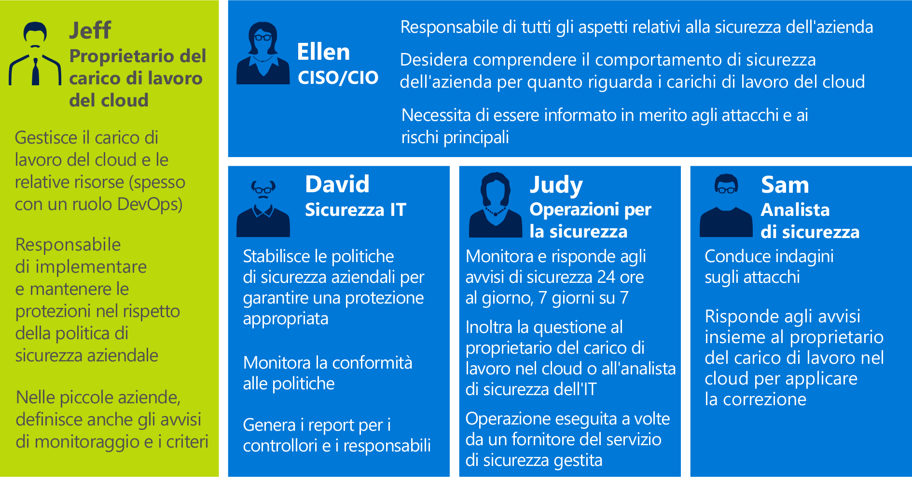
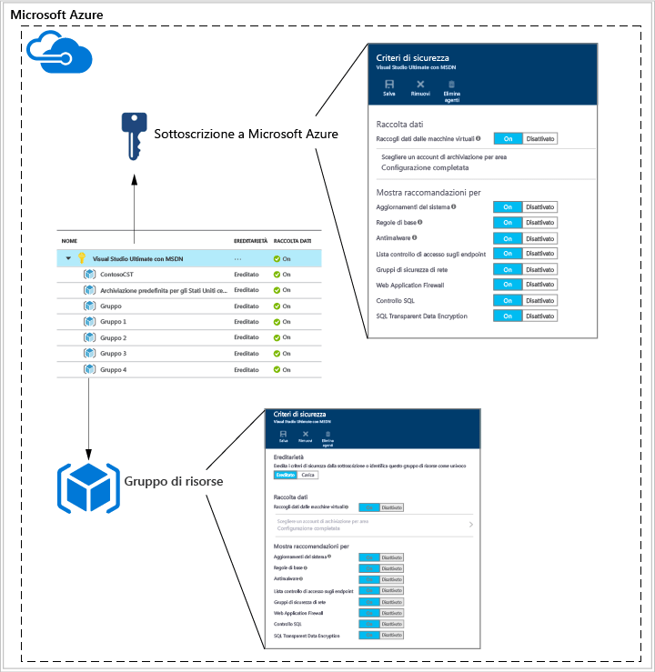
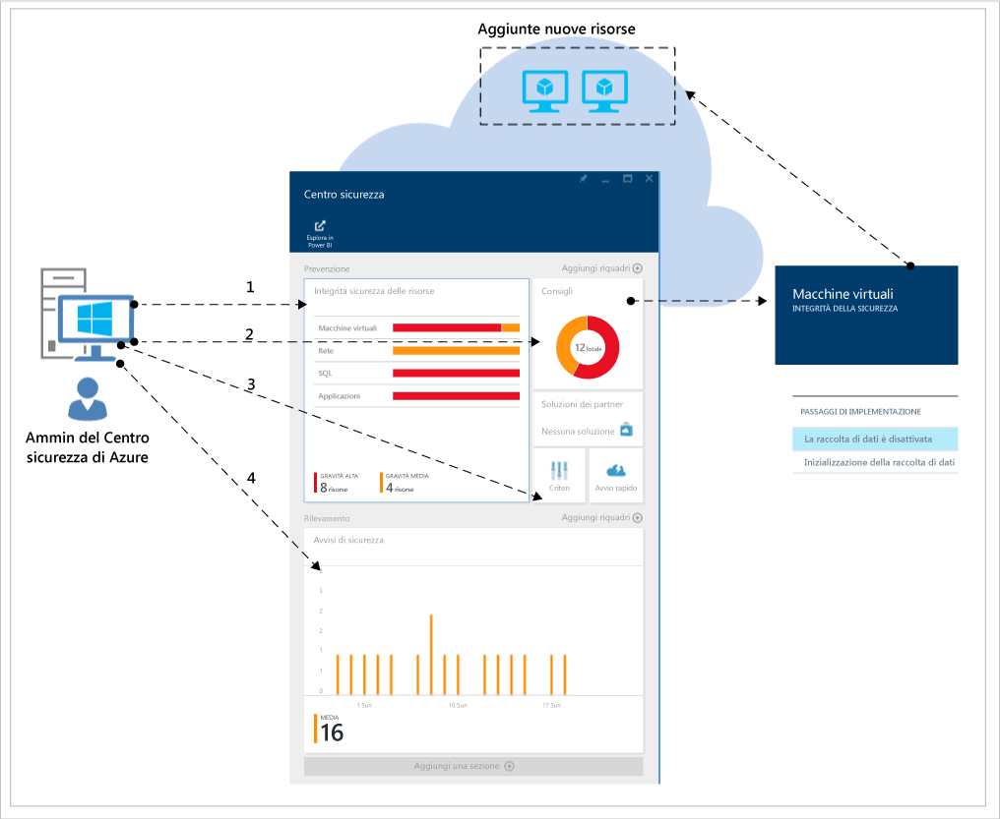
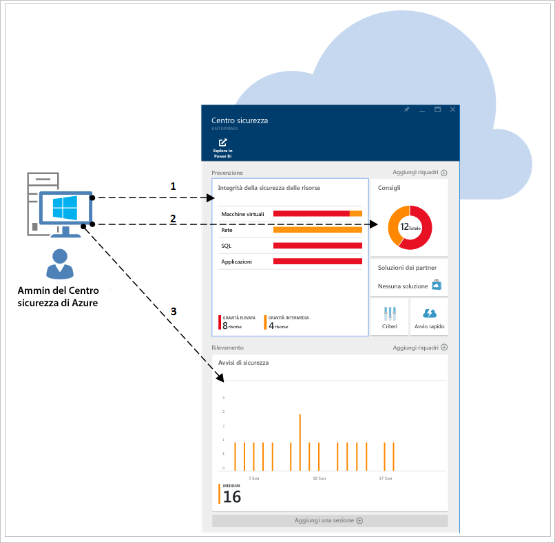
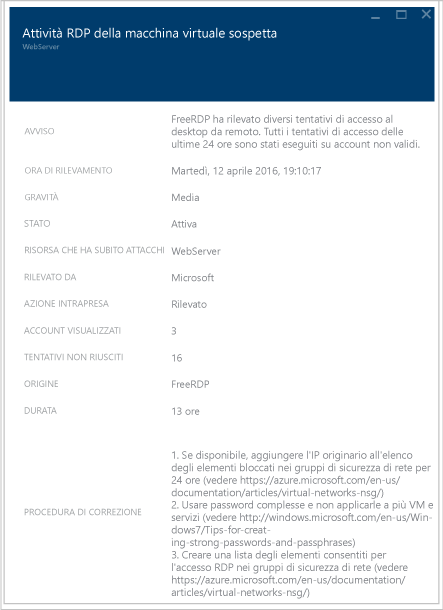

# Guida alla pianificazione e alla gestione del Centro sicurezza di Azure
Questa guida è destinata a professionisti IT, architetti IT, analisti della sicurezza delle informazioni e amministratori cloud le cui organizzazioni intendano usare il Centro sicurezza di Azure.

## Guida alla pianificazione
Questa guida illustra una serie di passaggi e attività che è possibile eseguire per ottimizzare l'uso del Centro sicurezza in base ai requisiti di sicurezza e al modello di gestione cloud dell'organizzazione. Per sfruttare tutti i vantaggi del Centro sicurezza, è importante sapere come i vari utenti o team dell'organizzazione usano il servizio per soddisfare le esigenze di gestione e sviluppo, monitoraggio, governance e risposta agli eventi imprevisti in modo sicuro. Le aree principali da considerare quando si intende usare il Centro sicurezza sono:

* Ruoli di sicurezza e controlli di accesso
* Criteri di sicurezza e raccomandazioni
* Raccolta dati e archiviazione
* Monitoraggio continuo della sicurezza
* Risposta agli eventi imprevisti

Nella sezione successiva si apprenderà come pianificare ogni singola area e applicare le raccomandazioni in base alle esigenze.

> [!NOTE]
> Per un elenco delle domande comuni che possono risultare utili anche durante la fase di progettazione e di pianificazione, vedere [Domande frequenti sul Centro sicurezza di Azure](security-center-faq.md).
> 
> 

## Ruoli di sicurezza e controlli di accesso
A seconda delle dimensioni e della struttura dell'organizzazione, il Centro sicurezza di Azure potrebbe essere usato da più utenti e team per l'esecuzione di diverse attività correlate alla sicurezza. Nel diagramma seguente è riportato un esempio di utenti fittizi e dei rispettivi ruoli e responsabilità in materia di sicurezza:

Il Centro sicurezza consente a questi utenti di svolgere i relativi ruoli, ad esempio:

**Jeff (proprietario del carico di lavoro cloud)**

* Gestisce un carico di lavoro cloud e le risorse correlate.
* È responsabile delle attività di implementazione e gestione della protezione secondo i criteri di sicurezza aziendale.

**Ellen (CISO/CIO)**

* È responsabile di tutti gli aspetti della sicurezza aziendale.
* Deve conoscere i comportamenti di sicurezza aziendale per i carichi di lavoro cloud.
* Ha l'esigenza di ricevere informazioni sui rischi e sugli attacchi principali.

**David (sicurezza IT)**

* Imposta i criteri di sicurezza aziendali per garantire l'applicazione della protezione appropriata.
* Monitora la conformità ai criteri.
* Genera report per la direzione o i revisori.

**Judy (attività di sicurezza)**

* Monitora e risponde agli avvisi di sicurezza 24x7.
* Si occupa dell'escalation al proprietario del carico di lavoro cloud o all'analista della sicurezza IT.

**Sam (analista della sicurezza)**

* Analizza gli attacchi
* Risolve gli avvisi o collabora con il proprietario del carico di lavoro cloud per applicare la correzione.

Il Centro sicurezza usa il [controllo degli accessi in base al ruolo](../active-directory/role-based-access-control-configure.md), che offre [ruoli predefiniti](../active-directory/role-based-access-built-in-roles.md) assegnabili a utenti, gruppi e servizi in Azure. Quando un utente apre il Centro sicurezza, visualizza solo informazioni correlate alle risorse a cui ha accesso. All'utente viene infatti assegnato il ruolo Proprietario, Collaboratore o Lettore per la sottoscrizione o il gruppo di risorse a cui appartiene la risorsa. Con gli utenti tipo descritti nel diagramma precedente sarebbe necessario il controllo degli accessi in base al ruolo seguente:

**Jeff (proprietario del carico di lavoro cloud)**

* Proprietario del gruppo di risorse/Collaboratore.

**David (sicurezza IT)**

* Proprietario della sottoscrizione/Collaboratore.

**Judy (attività di sicurezza)**

* Lettore della sottoscrizione per visualizzare gli avvisi.
* Proprietario della sottoscrizione/Collaboratore per ignorare gli avvisi.

**Sam (analista della sicurezza)**

* Lettore della sottoscrizione per visualizzare gli avvisi.
* Proprietario della sottoscrizione/Collaboratore per risolvere o ignorare gli avvisi.
* Potrebbe essere necessario l'accesso all'archiviazione.

Altre informazioni importanti da considerare:

* Solto i ruoli Proprietario e Collaboratore della sottoscrizione possono modificare i criteri di sicurezza.
* Solo i ruoli Proprietario e Collaboratore della sottoscrizione e del gruppo di risorse possono applicare le raccomandazioni relative alla sicurezza per una risorsa.

Quando si pianifica il controllo di accesso con il Controllo degli accessi in base al ruolo per il Centro sicurezza, è necessario sapere chi userà il Centro sicurezza nell'organizzazione. Si dovrà sapere anche quali tipi di attività eseguiranno e configurare di conseguenza il Controllo degli accessi in base al ruolo.

> [!NOTE]
> È consigliabile assegnare il ruolo con il minor numero di autorizzazioni che permetta agli utenti di completare le attività. Ad esempio, agli utenti che hanno solo necessità di visualizzare le informazioni sullo stato di sicurezza delle risorse senza intervenire, per applicare le raccomandazioni o modificare i criteri, deve essere assegnato il ruolo Lettore.
> 
> 

## Criteri di sicurezza e raccomandazioni
I criteri di sicurezza definiscono il set di controlli consigliati per le risorse all'interno della sottoscrizione o del gruppo di risorse specificato. Nel Centro sicurezza è possibile definire i criteri in base ai requisiti di sicurezza della società e al tipo di applicazioni o al livello di riservatezza dei dati.

I criteri abilitati nel livello sottoscrizione vengono propagati automaticamente a tutti i gruppi di risorse all'interno della sottoscrizione, come illustrato nel diagramma seguente:

Come illustrato nella figura precedente, i criteri di sicurezza per i gruppi di risorse possono essere ereditati dal livello sottoscrizione.

In alcuni scenari in cui le risorse in un gruppo di risorse richiedono un set di criteri diverso è possibile disattivare l'ereditarietà e applicare criteri personalizzati a un gruppo di risorse specifico.

Se sono necessari criteri personalizzati in gruppi di risorse specifici, occorre disabilitare l'ereditarietà nel gruppo di risorse e modificare i criteri di sicurezza. Ad esempio, se alcuni carichi di lavoro non richiedono il criterio Transparent Data Encryption di SQL, occorre disabilitarlo al livello di sottoscrizione e abilitarlo solo nei gruppi di risorse in cui è richiesto.

Quando si avvia la creazione di criteri personalizzati per diversi gruppi di risorse, è necessario pianificare la distribuzione dei criteri, tenendo presente che, in caso di conflitto tra criteri della sottoscrizione e del gruppo di risorse, i criteri del gruppo di risorse hanno la priorità.

> [!NOTE]
> Per esaminare i criteri modificati, è possibile usare i [log di controllo di Azure](https://blogs.msdn.microsoft.com/cloud_solution_architect/2015/03/10/audit-logs-for-azure-events/). Le modifiche ai criteri vengono sempre registrate nei log di controllo di Azure.
> 
> 

### Suggerimenti per la sicurezza
Prima di configurare i criteri di sicurezza, è consigliabile esaminare tutte le [raccomandazioni sulla sicurezza](security-center-recommendations.md) e determinare se sono appropriate per le varie sottoscrizioni e i vari gruppi di risorse usati. È importante sapere anche quali azioni vengono eseguite in relazione alle raccomandazioni sulla sicurezza.

**Endpoint Protection**: se in una macchina virtuale non è abilitata una soluzione Endpoint Protection, il Centro sicurezza visualizza una raccomandazione perché venga installata. Se in locale è già stata adottata una soluzione Endpoint Protection preferita, è necessario stabilire se usare lo stesso antimalware per le macchine virtuali di Azure. Il Centro sicurezza di Azure offre diverse opzioni per Endpoint Protection. È possibile usare un antimalware Microsoft gratuito o scegliere tra un elenco di soluzioni di protezione endpoint di partner integrati. Per altre informazioni su come distribuire antimalware con il Centro sicurezza, vedere [Installare Endpoint Protection nel Centro sicurezza di Azure](security-center-install-endpoint-protection.md).

**Aggiornamenti di sistema**: il Centro sicurezza identifica le macchine virtuali in cui non sono presenti aggiornamenti della sicurezza o aggiornamenti critici del sistema operativo per IaaS e Servizi cloud (PaaS). Valutare chi è responsabile dell'applicazione degli aggiornamenti necessari e le relative modalità di applicazione. Molte organizzazioni usano WSUS, Windows Update o un altro strumento.

**Configurazioni di base**: se le configurazioni del sistema operativo delle macchine virtuali non corrispondono alle baseline consigliate, viene visualizzata una raccomandazione. Esaminare il set di baseline [qui](https://gallery.technet.microsoft.com/Azure-Security-Center-a789e335) e valutare come vengono applicate le configurazioni del sistema operativo.

**Crittografia dischi**: se sono disponibili dischi della macchina virtuale non crittografati, Centro sicurezza suggerisce di applicare Crittografia dischi di Azure. Questa funzionalità sfrutta BitLocker per Windows e DM-Crypt per Linux per la crittografia del volume per i dischi dati e del sistema operativo. La raccomandazione reindirizza l'utente a una [guida dettagliata](security-center-disk-encryption.md) con istruzioni su come eseguire tale crittografia.

Tenere presente che gli scenari di crittografia da risolvere sono diversi. È necessario pianificare i requisiti specifici di ognuno di questi scenari:

* Crittografia di nuove macchine virtuali di Azure da dischi rigidi virtuali crittografati con chiavi di crittografia proprie.
* Crittografia di nuove macchine virtuali di Azure create dalla raccolta di Azure.
* Crittografia di macchine virtuali di Azure già in esecuzione in Azure.

La pianificazione dei requisiti sarà diversa per ogni scenario. Per informazioni dettagliate sui singoli scenari, vedere il white paper [Azure Disk Encryption for Windows and Linux Azure Virtual Machines](https://gallery.technet.microsoft.com/Azure-Disk-Encryption-for-a0018eb0) (Crittografia dischi di Azure per macchine virtuali di Azure per Windows e Linux).

**Web application firewall**: il Centro sicurezza identifica le macchine virtuali che eseguono applicazioni Web e visualizza una raccomandazione perché venga installato un Web application firewall (WAF). Valutare le soluzioni partner disponibili per determinare la soluzione più adatta all'organizzazione e come verrà concessa la relativa licenza. I partner potrebbero supportare modelli Bring Your Own License e/o con pagamento in base al consumo. Per altre informazioni su come distribuire un Web application firewall nelle macchine virtuali di Azure con il Centro sicurezza, vedere [Aggiungere un Web application firewall nel Centro sicurezza di Azure](security-center-add-web-application-firewall.md).

**Firewall di nuova generazione**: consente di effettuare il provisioning di un'appliance virtuale di importanti fornitori, tra cui Check Point e presto Cisco e Fortinet. Estende le protezioni di rete oltre i gruppi di sicurezza di rete incorporati in Azure. Il Centro sicurezza individuerà le distribuzioni per cui è consigliabile un firewall di nuova generazione e consentirà di effettuare il provisioning di un'appliance virtuale.

**Rete virtuale**: il Centro sicurezza valuta l'infrastruttura e la configurazione della [rete virtuale di Azure](https://azure.microsoft.com/documentation/services/virtual-network/) per verificare che i [gruppi di sicurezza di rete](../virtual-network/virtual-networks-nsg.md) siano applicati e configurati correttamente con regole per il traffico in ingresso. È necessario valutare quali regole del traffico definire e comunicarlo alle persone che dovranno applicare le raccomandazioni sulla sicurezza correlate.

Il Centro sicurezza visualizza una raccomandazione perché vengano specificati i dettagli dei contatti di sicurezza per la sottoscrizione di Azure. Queste informazioni verranno usate da Microsoft per contattare l'utente se il Microsoft Security Response Center (MSRC) rileva che un'entità illegale o non autorizzata ha effettuato l'accesso ai dati del cliente. Per altre informazioni su come abilitare questa raccomandazione, vedere [Specificare i dettagli dei contatti di sicurezza nel Centro sicurezza di Azure](security-center-provide-security-contact-details.md).

## Raccolta dati e archiviazione
È consigliabile abilitare la raccolta dati per ogni sottoscrizione, per assicurare che il monitoraggio della sicurezza sia disponibile per tutte le macchine virtuali nuove ed esistenti. La raccolta dati viene abilitata tramite l'agente di monitoraggio di Azure (ASMAgentLauncher.exe) e l'estensione per il monitoraggio della sicurezza di Azure (ASMMonitoringAgent.exe).

L'estensione per il monitoraggio della sicurezza di Azure esegue l'analisi delle varie configurazioni pertinenti per la sicurezza e raccoglie i log di sicurezza dalle macchine virtuali. I dati vengono inviati a un account di archiviazione specificato. Nella macchina virtuale viene installata anche l'utilità di gestione analisi (ASMSoftwareScanner.exe), da usare per l'analisi delle patch.

Dopo aver abilitato la raccolta dati nei criteri di sicurezza, le estensioni e l'agente di monitoraggio vengono installati automaticamente in tutte le macchine virtuali supportate, nuove ed esistenti, di cui è stato effettuato il provisioning in Azure. Il processo dell'agente non è invasivo e non influisce sulle prestazioni della macchina virtuale.

> [!NOTE]
> Per risolvere i problemi relativi all'agente di monitoraggio della sicurezza di Azure, vedere [Guida alla risoluzione dei problemi del Centro sicurezza di Azure](security-center-troubleshooting-guide.md).
> 
> 

Per disabilitare successivamente la raccolta dati, è possibile usare i criteri di sicurezza. Per eliminare gli agenti di monitoraggio distribuiti in precedenza, selezionare l'opzione di menu Elimina agenti.

> [!NOTE]
> Per un elenco delle macchine virtuali supportate, vedere [Domande frequenti sul Centro sicurezza di Azure](security-center-faq.md).
> 
> 

Per ciascuna area in cui si dispone di macchine virtuali in esecuzione, è necessario selezionare l'account di archiviazione in cui vengono archiviati i dati raccolti da tali macchine virtuali. Se non si sceglie un account di archiviazione per ogni area, ne verrà creato uno automaticamente. È possibile scegliere la posizione di archiviazione per ogni area o archiviare tutte le informazioni in una posizione centrale. Mentre i criteri di sicurezza possono essere impostati a livello di sottoscrizione di Azure e a livello di gruppo di risorse, la selezione di un'area per l'account di archiviazione può avvenire solo a livello di sottoscrizione.

Se si usa un account di archiviazione condiviso tra diverse risorse di Azure, vedere l'articolo [Obiettivi di scalabilità e prestazioni per Archiviazione di Azure](../storage/storage-scalability-targets.md) per altre informazioni sui limiti di dimensioni e sui vincoli. Anche la sottoscrizione prevede limiti per l'account di archiviazione. Per comprendere meglio tali limiti, vedere [Sottoscrizione di Azure e limiti, quote e vincoli dei servizi](../azure-subscription-service-limits.md).

> [!NOTE]
> I costi associati all'archiviazione non sono inclusi nel prezzo del servizio Centro sicurezza e vengono addebitati separatamente in base ai normali [Prezzi di Archiviazione di Azure](https://azure.microsoft.com/pricing/details/storage/).
> 
> 

Anche le considerazioni relative a prestazioni e scalabilità devono essere pianificate in base alle dimensioni dell'ambiente Azure e alle risorse che utilizzano l'account di archiviazione. Per altre informazioni, vedere [Elenco di controllo di prestazioni e scalabilità per Archiviazione di Microsoft Azure](../storage/storage-performance-checklist.md).

## Monitoraggio continuo della sicurezza
Dopo la configurazione iniziale e l'applicazione delle raccomandazioni del Centro sicurezza, il passaggio successivo consiste nel valutare i processi operativi del Centro sicurezza.

Per accedere al Centro sicurezza dal portale di Azure è possibile fare clic su **Esplora** e digitare **Centro sicurezza** nel campo **Filtro**. Il contenuto visualizzato dall'utente dipende dai filtri applicati.

Il Centro sicurezza non interferisce con le normali procedure operative, esegue un monitoraggio passivo delle distribuzioni e fornisce raccomandazioni in base ai criteri di sicurezza abilitati.

Il dashboard del Centro sicurezza è suddiviso in due parti principali:

* Prevenzione
* Rilevamento

Quando si abilita per la prima volta la raccolta dati nel Centro sicurezza per l'ambiente Azure corrente, esaminare tutte le raccomandazioni nel pannello **Raccomandazioni** o nelle singole risorse (**Macchina virtuale**, **Rete**, **SQL** e **Applicazione**).

Dopo avere applicato tutte le raccomandazioni, la sezione **Prevenzione** sarà verde per tutte le risorse che sono state corrette. Il monitoraggio continuo a questo punto risulta più semplice perché le azioni da intraprendere dipendono unicamente dalle modifiche apportate nei riquadri Integrità sicurezza delle risorse e Raccomandazioni.

La sezione **Rilevamento** è più reattiva e contiene avvisi relativi a problemi in corso o che si sono verificati in precedenza e sono stati rilevati dai controlli del Centro sicurezza e da sistemi di terze parti. Il riquadro Avvisi di sicurezza mostra grafici a barre che rappresentano il numero di avvisi di rilevamento delle minacce trovati ogni giorno e la relativa distribuzione per categorie basate sulla gravità, bassa, media o alta. Per altre informazioni sugli avvisi di sicurezza, vedere [Gestione e risposta agli avvisi di sicurezza nel Centro sicurezza di Azure](security-center-managing-and-responding-alerts.md).

> [!NOTE]
> È anche possibile usare Microsoft Power BI per visualizzare i dati del Centro sicurezza. Vedere [Ottenere informazioni dettagliate sui dati del Centro sicurezza di Azure con Power BI](security-center-powerbi.md).
> 
> 

### Monitoraggio di risorse nuove o modificate
Gli ambienti Azure sono per la maggior parte dinamici, con nuove risorse che vengono attivate e disattivate a intervalli regolari, nuove configurazioni, modifiche e così via. Il Centro sicurezza contribuisce a garantire la visibilità dello stato di sicurezza delle nuove risorse.

Quando si aggiungono nuove risorse all'ambiente Azure, come VM o database SQL, il Centro sicurezza le individua automaticamente e iniziare a monitorarne la sicurezza. Ciò include anche i ruoli di lavoro e i ruoli Web PaaS. Se la raccolta dati è abilitata nei [criteri di sicurezza](security-center-policies.md), vengono abilitate automaticamente funzionalità di monitoraggio aggiuntive per le macchine virtuali.

1. Per le macchine virtuali, accedere al riquadro **Integrità sicurezza delle risorse** e fare clic su **Macchine virtuali**. Gli eventuali problemi di abilitazione della raccolta dati e le relative raccomandazioni verranno visualizzati nella sezione **Raccomandazioni sul monitoraggio**.
2. Per conoscere gli eventuali rischi di sicurezza identificati per la nuova risorsa, vedere **Raccomandazioni**.
3. Accade spesso che nelle nuove macchine virtuali aggiunte all'ambiente inizialmente sia installato solo il sistema operativo. Il proprietario della risorsa potrebbe avere bisogno di tempo per distribuire altre app per l'uso da parte delle macchine virtuali. È preferibile conoscere la finalità del carico di lavoro, ad esempio se verrà usato come server applicazioni. In base alla finalità del nuovo carico di lavoro, è possibile abilitare i **Criteri di sicurezza** appropriati, che rappresentano il terzo passaggio del flusso di lavoro.
4. Con l'aggiunta di nuove risorse all'ambiente Azure, potrebbero essere visualizzati nuovi avvisi nel riquadro **Avvisi di sicurezza**. Verificare sempre se sono presenti nuovi avvisi in questo riquadro e intraprendere le azioni necessarie in base alle raccomandazioni del Centro sicurezza.

È anche possibile monitorare regolarmente lo stato delle risorse esistenti per identificare le modifiche alla configurazione che hanno creato rischi di sicurezza, deviazioni dalle baseline consigliate e avvisi di sicurezza. Avviare il dashboard del Centro sicurezza. Qui sono presenti tre aree principali da esaminare in modo continuativo.

1. Il pannello **Integrità sicurezza delle risorse** consente di accedere rapidamente alle risorse chiave. Usare questa opzione per monitorare Macchine virtuali, Reti, SQL e Applicazioni.
2. Il pannello **Raccomandazioni** consente di esaminare le raccomandazioni del Centro sicurezza. Durante il monitoraggio continuo è normale non ricevere raccomandazioni ogni giorno, perché tutte le raccomandazioni sono state applicate durante la configurazione iniziale del Centro sicurezza. Per questo motivo, in questa sezione potrebbero non essere presenti nuove informazioni ogni giorno e sarà sufficiente accedervi solo quando necessario.
3. Il pannello **Rilevamento** potrebbe cambiare molto di frequente o solo saltuariamente. Esaminare sempre gli avvisi di sicurezza e intraprendere le azioni necessarie in base alle raccomandazioni del Centro sicurezza.

## Risposta agli eventi imprevisti
Il Centro sicurezza rileva le minacce appena si verificano e avvisa l'utente. Le organizzazioni devono monitorare i nuovi avvisi di sicurezza e intraprendere le azioni necessarie per indagare più a fondo o correggere l'attacco. Per altre informazioni sul funzionamento del rilevamento delle minacce nel Centro sicurezza, vedere [Funzionalità di rilevamento del Centro sicurezza di Azure](security-center-detection-capabilities.md).

Per quanto offrire una guida alla creazione di un piano di risposta agli eventi imprevisti non rientri nelle finalità di questo articolo, il ciclo di vita della risposta del Centro sicurezza di Microsoft Azure nel cloud verrà usato come base per le fasi della risposta agli eventi imprevisti. Le fasi sono illustrate nel diagramma seguente:

> [!NOTE]
> Per tale scopo è possibile usare la [Computer Security Incident Handling Guide](http://nvlpubs.nist.gov/nistpubs/SpecialPublications/NIST.SP.800-61r2.pdf) (Guida alla gestione degli eventi imprevisti della sicurezza nei computer) del National Institute of Standards and Technology (NIST).
> 
> 

È possibile usare gli avvisi del Centro sicurezza durante le fasi seguenti.

* **Rilevamento**: identificazione di un'attività sospetta in una o più risorse.
* **Valutazione**: esecuzione della valutazione iniziale per ottenere altre informazioni sull'attività sospetta.
* **Diagnosi**: uso dei passaggi di correzione per completare la procedura tecnica per risolvere il problema.

Ogni avviso di sicurezza fornisce informazioni che possono essere usate per comprendere meglio la natura dell'attacco e trovare soluzioni di mitigazione. Alcuni avvisi forniscono anche collegamenti ad altre informazioni o fonti di informazioni all'interno di Azure. Le informazioni fornite possono essere usate per migliorare la ricerca e iniziare la mitigazione.

L'esempio seguente mostra un'attività RDP sospetta in azione:

Questo pannello include dettagli relativi al momento in cui si è verificato l'attacco, al nome host di origine, alla macchina virtuale di destinazione e ai passaggi necessari per applicare la raccomandazione. In alcuni casi le informazioni sull'origine dell'attacco potrebbero non essere disponibili. Per altre informazioni su questo tipo di comportamento, vedere [Missing Source Information in Azure Security Center Alerts](https://blogs.msdn.microsoft.com/azuresecurity/2016/03/25/missing-source-information-in-azure-security-center-alerts/) (Informazioni sull'origine mancanti negli avvisi del Centro sicurezza di Azure).

Nel video [How to Leverage the Azure Security Center & Microsoft Operations Management Suite for an Incident Response](https://channel9.msdn.com/Blogs/Taste-of-Premier/ToP1703) (Come sfruttare il Centro sicurezza di Azure e Microsoft Operations Management Suite per la risposta a un evento imprevisto) è possibile vedere alcune demo che consentono di comprendere come usare il Centro sicurezza per ognuna di queste fasi.

> [!NOTE]
> Vedere [Uso del Centro sicurezza di Azure per rispondere agli eventi imprevisti](security-center-incident-response.md) per altre informazioni sull'uso delle funzionalità del Centro sicurezza di Azure per rispondere agli eventi imprevisti.
> 
> 

## Vedere anche
In questo documento è stato descritto come pianificare l'adozione del Centro sicurezza di Azure. Per altre informazioni sul Centro sicurezza, vedere gli argomenti seguenti:

* [Gestione e risposta agli avvisi di sicurezza nel Centro sicurezza di Azure](security-center-managing-and-responding-alerts.md)
* [Monitoraggio dell'integrità della sicurezza nel Centro sicurezza di Azure](security-center-monitoring.md): informazioni su come monitorare l'integrità delle risorse di Azure.
* [Monitoraggio delle soluzioni dei partner con il Centro sicurezza di Azure](security-center-partner-solutions.md): informazioni su come monitorare l'integrità delle soluzioni dei partner.
* [Domande frequenti sul Centro sicurezza di Azure](security-center-faq.md): domande frequenti sull'uso del servizio.
* [Blog sulla sicurezza di Azure](http://blogs.msdn.com/b/azuresecurity/): post di blog sulla sicurezza e sulla conformità di Azure.

<!---HONumber=AcomDC_0928_2016-->