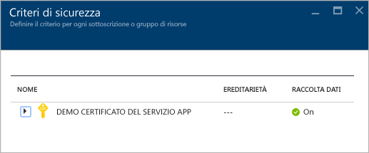
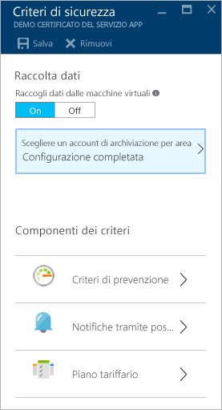
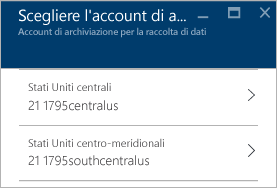
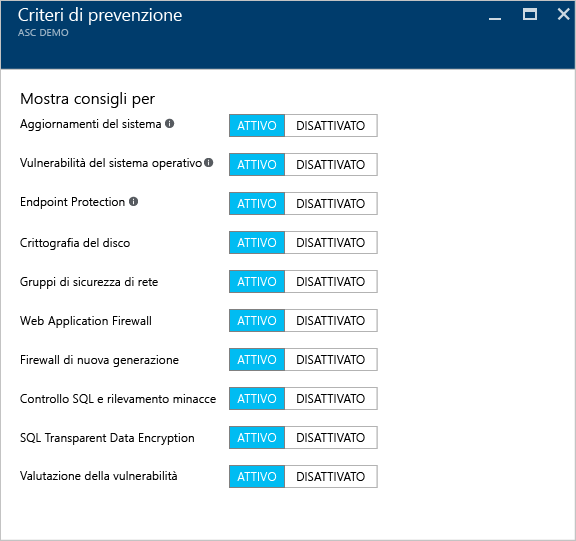
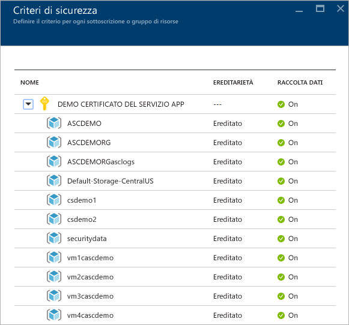
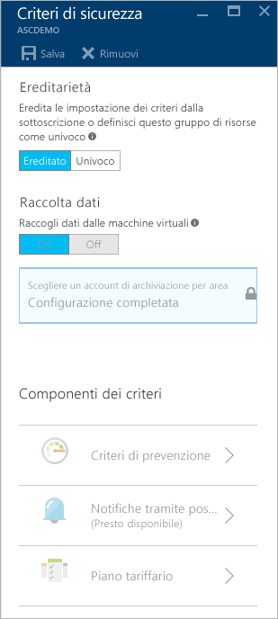

<properties
   pageTitle="Impostare i criteri di sicurezza nel Centro sicurezza di Azure | Microsoft Azure"
   description="Questo documento consente di configurare i criteri di sicurezza nel Centro sicurezza di Azure."
   services="security-center"
   documentationCenter="na"
   authors="YuriDio"
   manager="swadhwa"
   editor=""/>

<tags
   ms.service="security-center"
   ms.devlang="na"
   ms.topic="hero-article"
   ms.tgt_pltfrm="na"
   ms.workload="na"
   ms.date="09/22/2016"
   ms.author="yurid"/>

# Impostare i criteri di sicurezza nel Centro sicurezza di Azure
Questo documento consente di configurare i criteri di sicurezza nel Centro sicurezza mostrando i passaggi necessari per eseguire questa attività.

## Informazioni sui criteri di sicurezza
I criteri di sicurezza definiscono il set di controlli consigliati per le risorse all'interno della sottoscrizione o del gruppo di risorse specificato. Nel Centro sicurezza è possibile definire i criteri per le sottoscrizioni o i gruppi di risorse di Azure in base alle esigenze di sicurezza della società e al tipo di applicazioni o al livello di riservatezza dei dati di ogni sottoscrizione.

Ad esempio, le risorse usate per lo sviluppo o il test possono avere requisiti di sicurezza diversi da quelli delle risorse usate per le applicazioni di produzione. In modo analogo, le applicazioni che usano dati regolamentati come le informazioni personali possono richiedere un maggiore livello di sicurezza. I criteri di protezione abilitati nel Centro sicurezza di Azure determinano i suggerimenti per la sicurezza e il monitoraggio per identificare le potenziali vulnerabilità e attenuare le minacce. Per altre informazioni su come determinare l'opzione più appropriata, vedere [Guida alla pianificazione e alla gestione del Centro sicurezza di Azure](security-center-planning-and-operations-guide.md).

## Impostare i criteri di sicurezza per le sottoscrizioni

È possibile configurare criteri di sicurezza per ogni sottoscrizione o gruppo di risorse. Per modificare i criteri di sicurezza, è necessario essere proprietario o collaboratore di tale sottoscrizione. Accedere al portale di Azure e seguire questa procedura per configurare i criteri di sicurezza nel Centro sicurezza di Azure:

1. Fare clic sul riquadro **Criteri** nel dashboard del Centro sicurezza.

2. Nel pannello **Criteri di sicurezza - Definire il criterio per ogni sottoscrizione o gruppo di risorse** visualizzato selezionare la sottoscrizione in cui abilitare i criteri di sicurezza. Se si preferisce abilitare i criteri di sicurezza per un gruppo di risorse invece che per l'intera sottoscrizione, scorrere fino alla sezione successiva dove viene descritto come configurare i criteri di sicurezza per i gruppi di risorse.

    

3. Il pannello **Criteri di sicurezza** per la sottoscrizione selezionata viene aperto con un set di opzioni simile a quelle illustrate nello screenshot seguente:

    

	Le opzioni disponibili in questo pannello sono:
	- **Criteri di prevenzione**: usare questa opzione per configurare criteri per ogni sottoscrizione o gruppo di risorse.
	- **Notifica di posta elettronica**: usare questa opzione per configurare una notifica di posta elettronica che viene inviata alla prima occorrenza giornaliera di un avviso e per gli avvisi di elevata gravità. Le preferenze di posta elettronica possono essere configurate solo per i criteri della sottoscrizione. Per altre informazioni su come configurare una notifica di posta elettronica, vedere [Specificare i dettagli dei contatti di sicurezza nel Centro sicurezza di Azure](security-center-provide-security-contact-details.md).
	- **Piano tariffario**: usare questa opzione per aggiornare il piano tariffario selezionato. Per altre informazioni sui prezzi, vedere la [pagina del Centro sicurezza](https://azure.microsoft.com/pricing/details/security-center/).

4.  Verificare che l'opzione **Raccogli dati dalle macchine virtuali** sia **Sì**. Questa opzione abilita la raccolta automatica dei log per le risorse nuove ed esistenti.

    >[AZURE.NOTE] È consigliabile attivare la raccolta dati per ogni sottoscrizione per assicurare che il monitoraggio della sicurezza sia disponibile per tutte le macchine virtuali esistenti e nuove. Abilitando la raccolta dati viene installato l'agente di monitoraggio. Se non si vuole abilitare subito la raccolta dati da questo percorso, è possibile farlo successivamente nelle visualizzazioni **Integrità** e **Raccomandazioni**. È anche possibile abilitare la raccolta dati solo per la sottoscrizione o per la macchina virtuale selezionata. Consultare le [Domande frequenti sul Centro sicurezza di Azure](security-center-faq.md) per maggiori informazioni sulle macchine virtuali supportate.

5. Se l'account di archiviazione non è ancora configurato, può essere visualizzato un avviso simile a quello illustrato nello screenshot seguente quando si apre **Criteri di sicurezza**:

    

6. Se viene visualizzato questo avviso, fare clic su questa opzione e selezionare l'area, come illustrato nello screenshot seguente:

    

7. Per ogni area in cui si hanno macchine virtuali in esecuzione, scegliere l'account di archiviazione in cui vengono archiviati i dati raccolti da tali macchine virtuali. Ciò semplifica la conservazione dei dati nella stessa area geografica per scopi di sovranità dei dati e di privacy. Dopo avere stabilito l'area da usare, selezionarla e quindi selezionare l'account di archiviazione.

8. Nel pannello **Scegliere gli account di archiviazione** fare clic su **OK**.

    > [AZURE.NOTE] Se si preferisce, è possibile aggregare i dati in un account di archiviazione centrale per le macchine virtuali che si trovano in diverse aree. Per altre informazioni, vedere [Domande frequenti sul Centro sicurezza di Azure](security-center-faq.md).

9. Nel pannello **Criteri di sicurezza** fare clic su **Sì** per abilitare le raccomandazioni sulla sicurezza da usare per la sottoscrizione. Fare clic su **Criteri di prevenzione** per visualizzare opzioni simili a quelle illustrate nello screenshot seguente:

	

Usare la tabella seguente come riferimento per comprendere ogni opzione:

| Criterio | Quando lo stato è Sì |
|----- |-----|
| Aggiornamenti del sistema | Recupera un elenco giornaliero degli aggiornamenti della sicurezza e critici da Windows Update o da Windows Server Update Services. L'elenco recuperato dipende dal servizio configurato per tale macchina virtuale e consiglia di applicare gli aggiornamenti mancanti. Per i sistemi Linux, il criterio usa il sistema di gestione pacchetti fornito dalla distribuzione per determinare per quali pacchetti sono disponibili aggiornamenti. Controlla anche la presenza di aggiornamenti critici e della sicurezza dalle macchine virtuali di [Servizi cloud di Azure](./cloud-services/cloud-services-how-to-configure.md). |
| Vulnerabilità del sistema operativo | Analizza giornalmente le configurazioni del sistema operativo per determinare i problemi che potrebbero rendere vulnerabile agli attacchi la macchina virtuale. Il criterio consiglia anche le modifiche alla configurazione necessarie per risolvere queste vulnerabilità. Vedere l'[elenco delle baseline consigliate](https://gallery.technet.microsoft.com/Azure-Security-Center-a789e335) per altre informazioni sulle configurazioni specifiche monitorate. |
| Endpoint Protection | Suggerisce l'Endpoint Protection di cui eseguire il provisioning per tutte le macchine virtuali di Windows, per identificare e rimuovere virus, spyware e altro software dannoso.|
| Crittografia del disco | Suggerisce di abilitare la crittografia dischi in tutte le macchine virtuali per migliorare la protezione dei dati inattivi.
| Gruppi di sicurezza di rete | Consiglia di configurare [gruppi di sicurezza di rete](../virtual-network/virtual-networks-nsg.md) per controllare il traffico in ingresso e in uscita nelle VM che hanno endpoint pubblici. I gruppi di sicurezza di rete configurati per una subnet verranno ereditati da tutte le interfacce di rete della macchina virtuale se non diversamente specificato. Oltre a controllare che sia stato configurato un gruppo di sicurezza di rete, questo criterio valuta le regole di sicurezza in ingresso per identificare le regole che consentono il traffico in ingresso. |
| Web application firewall | Consiglia di effettuare il provisioning di un Web application firewall nelle macchine virtuali quando una delle due affermazioni seguenti è vera:  Viene usato l'[IP pubblico a livello di istanza](../virtual-network/virtual-networks-instance-level-public-ip.md) e le regole di sicurezza per il gruppo di sicurezza di rete associato sono configurate per consentire l'accesso alla porta 80/443.  IP con carico bilanciato e le regole NAT (Network Address Translation) in ingresso e di bilanciamento del carico associate sono configurate per consentire l'accesso alla porta 80/443. Per altre informazioni, vedere [Supporto di Azure Resource Manager per il servizio di bilanciamento del carico](../load-balancer/load-balancer-arm.md). |
| Firewall di nuova generazione | Estende le protezioni di rete oltre i gruppi di sicurezza di rete predefiniti di Azure. Il Centro sicurezza troverà le distribuzioni per cui è consigliabile un firewall di nuova generazione e consentirà di effettuare il provisioning di un'appliance virtuale. |
| Servizio di controllo SQL e rilevamento delle minacce | Consiglia l'abilitazione del controllo dell'accesso al database di Azure per la conformità e il rilevamento avanzato delle minacce, per scopi di analisi. |
| SQL Transparent Data Encryption | Consiglia l'abilitazione della crittografia dati inattivi per il database SQL di Azure, i backup associati e file di log delle transazioni. Anche se i dati vengono violati, non saranno leggibili. |
| Valutazione della vulnerabilità | Consiglia di installare una soluzione di valutazione della vulnerabilità nella macchina virtuale. |

Dopo avere configurato tutte le opzioni, fare clic su **OK** nel pannello **Criteri di sicurezza** contenente le raccomandazioni e quindi su **Salva** nel pannello **Criteri di sicurezza** contenente le impostazioni iniziali.

## Impostare i criteri di sicurezza per i gruppi di risorse

Se si preferisce configurare i criteri di sicurezza per ogni gruppo di risorse, i passaggi sono simili a quelli usati per configurare i criteri di sicurezza per le sottoscrizioni. La differenza principale riguarda la necessità di espandere il nome della sottoscrizione e selezionare il gruppo di risorse per cui si vogliono configurare criteri di sicurezza univoci:

Dopo aver selezionato il gruppo di risorse, viene aperto il pannello **Criteri di sicurezza**. Per impostazione predefinita, l'opzione **Ereditarietà** è abilitata, quindi tutti i criteri di sicurezza per questo gruppo di risorse vengono ereditati dal livello della sottoscrizione. Per impostare criteri di sicurezza personalizzati per un gruppo di risorse, è possibile modificare questa configurazione. In tal caso, è necessario selezionare **Univoco** e apportare le modifiche nell'opzione **Criteri di prevenzione**.

> [AZURE.NOTE] In caso di conflitto tra i criteri definiti a livello di sottoscrizione e quelli a livello di gruppo di risorse, i criteri a livello di gruppo di risorse avranno la precedenza.

## Vedere anche

In questo documento è stato descritto come configurare i criteri di sicurezza nel Centro sicurezza di Azure. Per ulteriori informazioni sul Centro sicurezza di Azure, vedere gli argomenti seguenti:

- [Guida alla pianificazione e alla gestione del Centro sicurezza di Azure](security-center-planning-and-operations-guide.md). Informazioni sulla pianificazione e considerazioni di progettazione per l'adozione del Centro sicurezza di Azure.
- [Monitoraggio dell'integrità della sicurezza nel Centro sicurezza di Azure](security-center-monitoring.md). Informazioni su come monitorare l'integrità delle risorse di Azure.
- [Gestione e risposta agli avvisi di sicurezza nel Centro sicurezza di Azure](security-center-managing-and-responding-alerts.md). Informazioni su come gestire e rispondere agli avvisi di sicurezza.
- [Monitoraggio delle soluzioni dei partner con il Centro sicurezza di Azure](security-center-partner-solutions.md). Informazioni su come monitorare lo stato integrità delle soluzioni dei partner.
- [Domande frequenti sul Centro sicurezza di Azure](security-center-faq.md). Domande frequenti sull'uso del servizio.
- [Blog sulla sicurezza di Azure](http://blogs.msdn.com/b/azuresecurity/). Post di blog sulla sicurezza e sulla conformità di Azure.

<!---HONumber=AcomDC_0928_2016-->