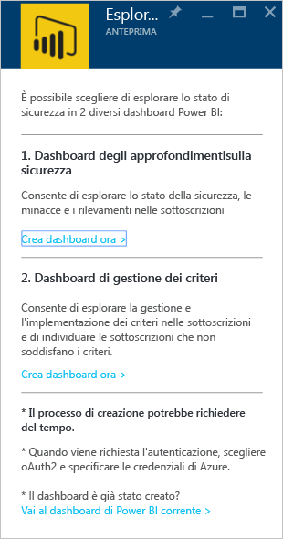
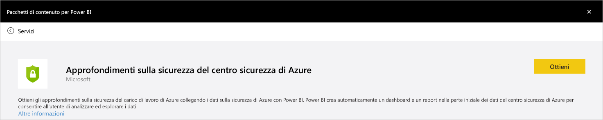
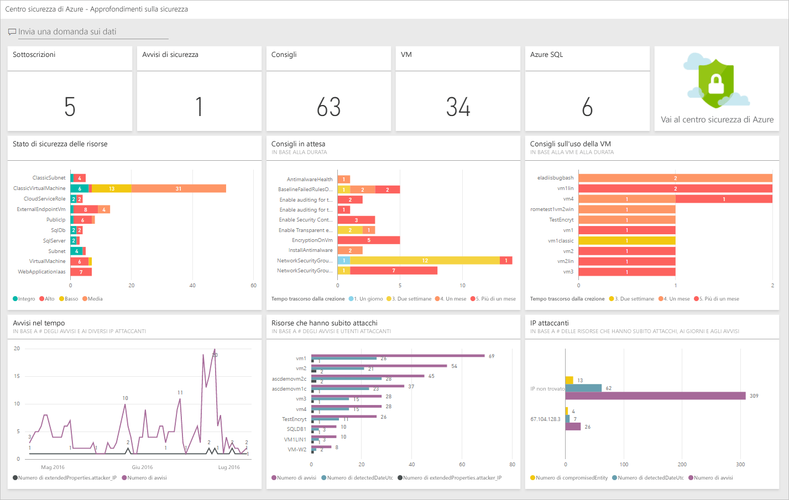
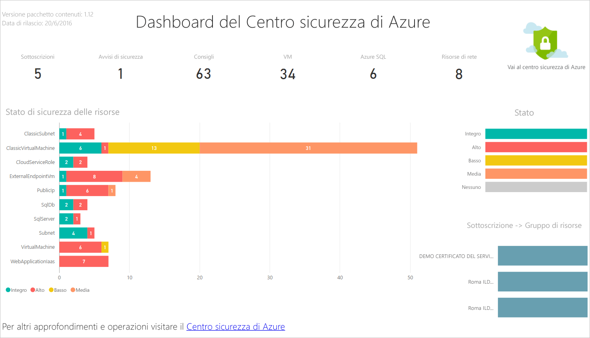
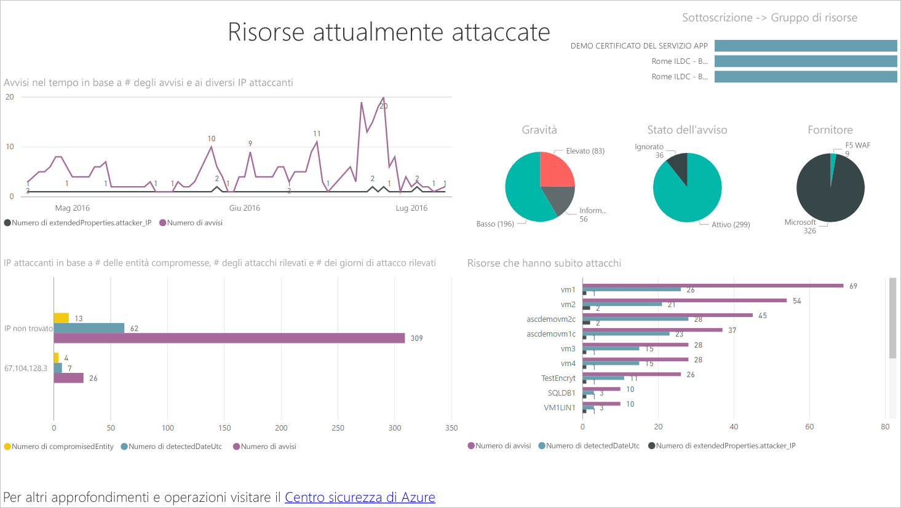
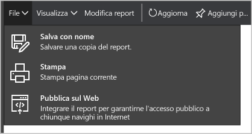
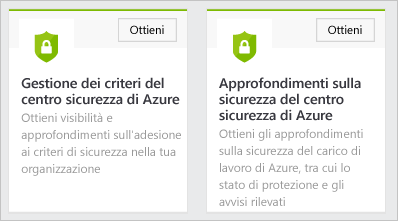
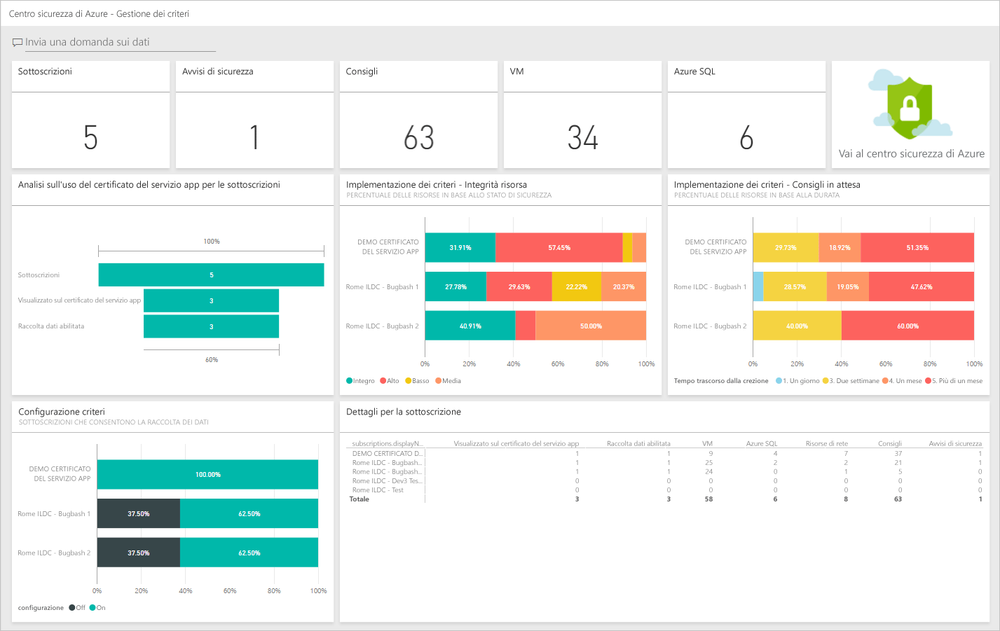

<properties
   pageTitle="Ottenere informazioni dettagliate sui dati del Centro sicurezza di Azure con Power BI| Microsoft Azure"
   description="Il pacchetto di contenuto di Power BI nel Centro sicurezza di Azure rende più semplice trovare gli avvisi e le indicazioni di sicurezza, le risorse che hanno subito attacchi e le tendenze sulla base di un set di dati creato per il report."
   services="security-center"
   documentationCenter="na"
   authors="YuriDio"
   manager="swadhwa"
   editor=""/>

<tags
   ms.service="security-center"
   ms.devlang="na"
   ms.topic="hero-article"
   ms.tgt_pltfrm="na"
   ms.workload="na"
   ms.date="07/19/2016"
   ms.author="yurid"/>

# Ottenere informazioni dettagliate sui dati del Centro sicurezza di Azure con Power BI
Il [dashboard di Power BI](http://aka.ms/azure-security-center-power-bi) nel Centro sicurezza di Azure consente di visualizzare, analizzare e filtrare indicazioni e avvisi di sicurezza da qualunque origine, inclusi i dispositivi mobili. Usare il dashboard di Power BI per rivelare tendenze e modelli di attacco, visualizzare avvisi di sicurezza per ogni risorsa o indirizzo IP di origine, nonché i rischi per la sicurezza non risolti per risorsa ed età. È anche possibile eseguire il mashup delle indicazioni e degli avvisi di sicurezza del Centro sicurezza con altri dati in modi interessanti, ad esempio con i [log di controllo di Azure ](https://powerbi.microsoft.com/blog/monitor-azure-audit-logs-with-power-bi/) e il [servizio di controllo del database SQL di Azure](https://powerbi.microsoft.com/blog/monitor-your-azure-sql-database-auditing-activity-with-power-bi/), che offrono entrambi dashboard di Power BI, oppure è possibile esportare questi dati in Excel per creare facilmente report sullo stato della sicurezza delle risorse cloud.

> [AZURE.NOTE] Le informazioni contenute in questo documento si applicano alla versione di anteprima del Centro sicurezza di Azure.

##Uso del dashboard del Centro sicurezza di Azure per accedere a Power BI
È anche possibile usare il dashboard del Centro sicurezza di Azure per accedere ai report di Power BI. Seguire questa procedura per eseguire questa attività:

1. Nel dashboard **Centro sicurezza di Azure** fare clic sul pulsante **Esplora in Power BI**.

	

2. Sul lato destro verrà visualizzato il pannello **Esplora in Power BI**, come illustrato di seguito:

	

3. Se si sta creando il dashboard di Power BI per la prima volta, è possibile scegliere una delle opzioni seguenti nel pannello Esplora in Power BI:

	- **Dashboard degli approfondimenti sulla sicurezza**: scegliere questa opzione se si vuole creare un dashboard che include lo stato di sicurezza, i thread e i rilevamenti. Si tratta di un'opzione più comune per il ruolo DevOps responsabile dell'analisi relativo stato di protezione e ha rilevato avvisi tra le sottoscrizioni.
	- **Dashboard di gestione dei criteri**: scegliere questa opzione per esplorare i criteri di gestione e imposizione. Si tratta di un'opzione più comune per il reparto IT centrale che è più focalizzato sulla governance. È possibile usare questo dashboard per ottenere visibilità e approfondimenti sull'aderenza ai criteri di sicurezza dell'organizzazione.
	- Se è già disponibile un dashboard di Power BI, fare clic su **Vai al dashboard di Power BI corrente**.

4. Ai fini di questo esempio, fare clic su **Dashboard degli approfondimenti sulla sicurezza**. Se è la prima volta che si crea un dashboard di Power BI per il Centro sicurezza verrà chiesto di installare il pacchetto di contenuto. Fare clic sul pulsante **Recupera** nella finestra **Pacchetti di contenuto per Power BI** come illustrato di seguito:

	

5. Verrà visualizzata la finestra **Connect to Azure Security Center Security Insights** (Connessione ad approfondimenti sulla sicurezza del Centro sicurezza di Azure). Verificare che **Metodo di autenticazione** sia impostato su **oAuth2** come illustrato di seguito e fare clic su **Accedi**.
	
	

6. Potrebbe essere necessario eseguire nuovamente l'autenticazione con le credenziali di Azure. Dopo l'autenticazione verrà creato il dashboard. Dopo aver creato il dashboard verrà visualizzato un report con una struttura analoga a quella illustrata di seguito:

	

> [AZURE.NOTE] Un aggiornamento del report è pianificato su base giornaliera. In caso di errore di questo aggiornamento, vedere [Potential Refresh Issues with the Azure Security Center Power BI](https://blogs.msdn.microsoft.com/azuresecurity/2016/04/07/azure-security-center-power-bi-refresh-fails/) (Potenziali problemi di aggiornamento con Power BI nel Centro sicurezza di Azure) per altre informazioni su come risolverli.

È possibile visualizzare il numero di raccomandazioni e avvisi di sicurezza, nonché il numero di macchine virtuali, database SQL di Azure e risorse di rete monitorate dal Centro sicurezza di Azure.

Un collegamento al Centro sicurezza di Azure reindirizza al portale di Azure. I grafici rendono più semplice visualizzare le informazioni su indicazioni e avvisi relativi alla sicurezza, ad esempio:

- Stato della sicurezza delle risorse
- Raccomandazioni in attesa
- Raccomandazioni per le VM
- Avvisi nel tempo
- Risorse che hanno subito attacchi
- IP utenti malintenzionati

Per ogni grafico sono disponibili informazioni aggiuntive. Selezionare un riquadro per visualizzare altre informazioni. Il riquadro **Resource Security State** (Stato sicurezza risorse) offre dettagli aggiuntivi sulle raccomandazioni in attesa, per ogni risorsa, come illustrato di seguito:

Se si fa clic su una riga qualsiasi di questo grafico, le altre saranno visualizzate in grigio permettendo di concentrarsi solo su quella selezionata. Per tornare al dashboard, fare clic su **Centro sicurezza di Azure** sotto l'opzione **Dashboard** nel riquadro sinistro della pagina.

> [AZURE.NOTE] Se si vogliono personalizzare i report aggiungendo altri campi o modificando gli oggetti visivi esistenti, è possibile farlo modificando il report. Per altre informazioni, vedere [Interagire con un report nella Visualizzazione di modifica in Power BI](https://powerbi.microsoft.com/documentation/powerbi-service-interact-with-a-report-in-editing-view/).

L'output dei riquadri **Avvisi nel tempo, Risorse che hanno subito attacchi** e **IP utenti malintenzionati** sarà simile al seguente quando si fa clic su ognuno di essi. Ciò accade perché il report aggrega le informazioni relative a tutte e tre le variabili e le definisce **Risorse sotto attacco** come illustrato di seguito:

A questo punto è anche possibile salvare una copia di questo report, stamparlo o pubblicarlo sul Web usando le opzioni disponibili nel menu **File**.

## Esplorazione dei dati del Centro sicurezza di Azure con i servizi Power BI

Connettersi ai [servizi per i pacchetti di contenuto di Power BI](https://msit.powerbi.com/groups/me/getdata/services) in Power BI e seguire questa procedura:

1. Nella finestra **Content Pack for Power BI** (Pacchetto di contenuto per Power BI) verranno visualizzate due opzioni, come illustrato di seguito.

	

	>[AZURE.NOTE] Se è già stata eseguita la prima parte di questo articolo si vedrà solo un'opzione, ovvero Azure Security Center Policy Management (Gestione criteri del Centro sicurezza di Azure).

2. Ai fini di questo esempio, fare clic su **Recupera** nel riquadro **Azure Security Center Policy Management** (Gestione criteri del Centro sicurezza di Azure).

3. Nella finestra **Connect to Azure Security Center Policy Management** (Connessione a Gestione criteri del Centro sicurezza di Azure) assicurarsi di selezionare **oAuth2** nell'elenco a discesa **Metodo di autenticazione** come illustrato di seguito e fare clic sul pulsante **Accedi**.

	

4. Si verrà reindirizzati a una pagina di autenticazione in cui è necessario digitare le credenziali usate per connettersi al Centro sicurezza di Azure. Al termine del processo di autenticazione, Power BI inizierà a importare dati per compilare i report. Durante questa fase potrebbe essere visualizzato il messaggio seguente nell'angolo destro del browser:

	

	>[AZURE.NOTE] Quando viene creato il dashboard per la prima volta, è possibile che richieda più tempo del solito, soprattutto per gli scenari in cui sono disponibili più sottoscrizioni.

5. Una volta completato il processo, nel dashboard di Power BI nel Centro sicurezza di Azure verrà caricato un report di **Gestione criteri** simile al seguente:

	

## Vedere anche
In questo documento è stato descritto come usare Power BI nel Centro sicurezza di Azure. Per ulteriori informazioni sul Centro sicurezza di Azure, vedere gli argomenti seguenti:

- [Guida alla pianificazione e alla gestione del Centro sicurezza di Azure](security-center-planning-and-operations-guide.md): informazioni sulla pianificazione dell'adozione del Centro sicurezza di Azure.
- [Impostazione dei criteri di sicurezza nel Centro sicurezza di Azure](security-center-policies.md): informazioni su come configurare le impostazioni di sicurezza nel Centro sicurezza di Azure
- [Gestione e risposta agli avvisi di sicurezza nel Centro sicurezza di Azure](security-center-managing-and-responding-alerts.md): informazioni su come gestire e rispondere agli avvisi di sicurezza
- [Domande frequenti sul Centro sicurezza di Azure](security-center-faq.md): domande frequenti sull'utilizzo del servizio
- [Blog sulla sicurezza di Azure](http://blogs.msdn.com/b/azuresecurity/): post di blog sulla sicurezza e sulla conformità di Azure

<!---HONumber=AcomDC_0720_2016-->