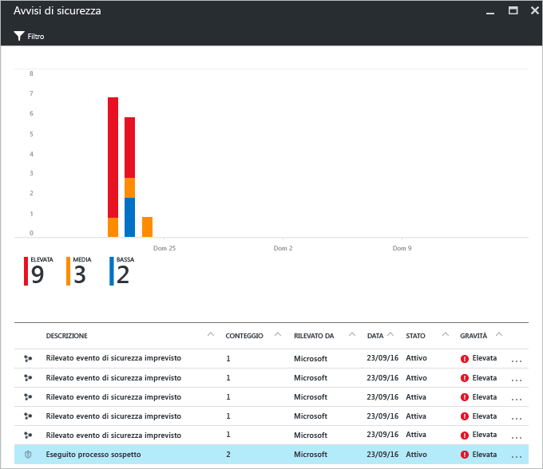
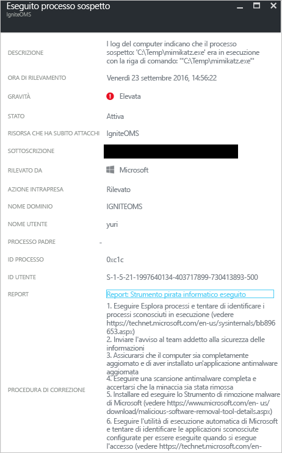

# Report di intelligence per le minacce generato dal Centro sicurezza di Azure
Questo documento spiega come i report di intelligence per le minacce del Centro sicurezza di Azure possono essere utili per raccogliere informazioni più dettagliate su una minaccia che ha generato un avviso di sicurezza.

## Informazioni sui report di intelligence per le minacce
Il sistema di rilevamento delle minacce del Centro sicurezza è basato sul monitoraggio delle informazioni sulla sicurezza fornite dalle risorse di Azure, dalla rete e dalle soluzioni dei partner connessi. Per identificare le minacce, analizza queste informazioni, correlando spesso quelle raccolte da più origini. Questo processo fa parte delle [funzionalità di rilevamento](security-center-detection-capabilities.md) del Centro sicurezza.

Quando il Centro sicurezza identifica una minaccia, attiva un [avviso di sicurezza](security-center-managing-and-responding-alerts.md) contenente informazioni dettagliate su un evento specifico, inclusi i suggerimenti per la correzione. Per consentire ai team che gestiscono la risposta agli eventi imprevisti di analizzare e correggere le minacce, il Centro sicurezza include un report di intelligence per le minacce contenente informazioni sulla minaccia rilevata, come:

* Identità o associazioni dell'utente malintenzionato, se queste informazioni sono disponibili
* Obiettivi degli utenti malintenzionati
* Campagne di attacco attuali e cronologiche, se queste informazioni sono disponibili
* Tattiche, strumenti e procedure usate dagli utenti malintenzionati
* Indicatori di compromissione (IoC) associati, ad esempio URL e hash file
* Vittimologia, ovvero la diffusione geografica e nel settore utile per determinare se le risorse di Azure sono esposte a rischi
* Informazioni sulla mitigazione dei rischi e correzione

> [!NOTE]
> La quantità di informazioni in un report specifico varia; il livello di dettaglio è basato sulle attività e la diffusione del malware.
>
>

Il Centro sicurezza rende disponibili tre tipi di report sulle minacce, che possono variare a seconda dell'attacco. I report disponibili sono:

* **Report sui gruppi di attività**: fornisce approfondimenti sugli utenti malintenzionati e relativi obiettivi e strategie.
* **Report sulle campagne**: si concentra sui dettagli di specifiche campagne di attacco.
* **Report di riepilogo delle minacce**: tratta tutti gli elementi presenti nei due report precedenti.

Questo tipo di informazioni è molto utile nel corso del processo di [risposta agli eventi imprevisti](security-center-incident-response.md), in cui è in corso un'analisi per identificare l'origine dell'attacco, le motivazioni dell'utente malintenzionato e le azioni da eseguire per attenuare il problema in futuro.

## Come accedere alle informazioni sui report di intelligence per le minacce
È possibile esaminare gli avvisi correnti visualizzando il riquadro **Avvisi di sicurezza** . Aprire il portale di Azure e seguire questa procedura per visualizzare altri dettagli su ogni avviso:

1. Nel dashboard del Centro sicurezza è disponibile il riquadro **Avvisi di sicurezza** .
2. Fare clic sul riquadro per aprire il pannello **Avvisi di sicurezza** contenente altre informazioni sugli avvisi e fare clic sull'avviso di sicurezza per cui si vuole ottenere altre informazioni.

    
3. In questo caso il pannello **Processo sospetto eseguito** visualizza i dettagli sull'avviso, come illustrato nella figura seguente:

    
4. La quantità di informazioni disponibili per ogni avviso di sicurezza varia in base al tipo di avviso. Nel campo **REPORT** è presente un collegamento al report di intelligence sulle minacce. Fare clic su di esso; verrà visualizzata un'altra finestra del browser con un file PDF.

   

Da qui è possibile scaricare il file PDF per questo report e ottenere altre informazioni sul problema di sicurezza rilevato e intraprendere azioni in base alle informazioni fornite.

## Vedere anche
In questo documento è stata evidenziata l'importanza dei report di intelligence per le minacce generati dal Centro sicurezza di Azure nel corso di un'analisi degli avvisi di sicurezza. Per ulteriori informazioni sul Centro sicurezza di Azure, vedere gli argomenti seguenti:

* [Domande frequenti sul Centro sicurezza di Azure](security-center-faq.md). Domande frequenti sull'uso del servizio.
* [Uso del Centro sicurezza di Azure per rispondere agli eventi imprevisti](security-center-incident-response.md)
* [Funzionalità di rilevamento del Centro sicurezza di Azure](security-center-detection-capabilities.md)
* [Guida alla pianificazione e alla gestione del Centro sicurezza di Azure](security-center-planning-and-operations-guide.md). Informazioni sulla pianificazione e considerazioni di progettazione per l'adozione del Centro sicurezza di Azure.
* [Gestione e risposta agli avvisi di sicurezza nel Centro sicurezza di Azure](security-center-managing-and-responding-alerts.md). Informazioni su come gestire e rispondere agli avvisi di sicurezza.
* [Gestione degli eventi imprevisti della sicurezza nel Centro sicurezza di Azure](security-center-incident.md)
* [Blog sulla sicurezza di Azure](http://blogs.msdn.com/b/azuresecurity/). Post di blog sulla sicurezza e sulla conformità di Azure.
