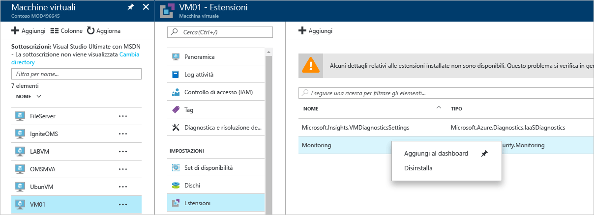

# Guida alla risoluzione dei problemi del Centro sicurezza di Azure
Questa guida è destinata a professionisti IT, analisti della sicurezza delle informazioni e amministratori cloud le cui organizzazioni usano il Centro sicurezza di Azure e devono risolvere i problemi correlati.

## Guida per la risoluzione dei problemi
Questa guida illustra come risolvere i problemi correlati al Centro sicurezza. La maggior parte delle attività di risoluzione dei problemi nel Centro sicurezza di Azure viene eseguita osservando prima di tutto i record del [log di controllo](https://azure.microsoft.com/updates/audit-logs-in-azure-preview-portal/) del componente in cui si è verificato il problema. Tramite i log di controllo, è possibile determinare:

* Quali operazioni sono state eseguite.
* Chi ha avviato l'operazione.
* Quando si è verificata l'operazione.
* Lo stato dell'operazione.
* I valori di altre proprietà che possono essere utili per ricerche sull'operazione.

Il log di controllo contiene tutte le operazioni di scrittura (PUT, POST, DELETE) eseguite sulle risorse, ma non include quelle di lettura (GET).

## Risoluzione dei problemi di installazione dell'agente di monitoraggio in Windows
L'agente di monitoraggio del Centro sicurezza viene usato per eseguire la raccolta dei dati. Dopo avere abilitato la raccolta dei dati e installato correttamente l'agente nel computer di destinazione, saranno in esecuzione i processi seguenti:

* ASMAgentLauncher.exe: agente di monitoraggio di Azure 
* ASMMonitoringAgent.exe: estensione per il monitoraggio della sicurezza di Azure
* ASMSoftwareScanner.exe: gestione analisi di Azure

L'estensione per il monitoraggio della sicurezza di Azure esegue l'analisi delle varie configurazioni pertinenti per la sicurezza e raccoglie i log di sicurezza dalle macchine virtuali. La funzionalità di gestione analisi verrà usata per l'analisi delle patch.

Se l'installazione riesce, nei log di controllo per la macchina virtuale di destinazione si noterà una voce simile alla seguente:

È anche possibile ottenere altre informazioni sul processo di installazione nei log dell'agente, disponibili nel percorso *%systemdrive%\windowsazure\logs*, ad esempio C:\WindowsAzure\Logs.

> [!NOTE]
> Se l'agente del Centro sicurezza di Azure non funziona correttamente, sarà necessario riavviare la macchina virtuale di destinazione, perché non esiste un comando per arrestare e avviare l'agente.

Se i problemi di raccolta dei dati persistono, è possibile disinstallare l'agente seguendo questa procedura:

1. Dal **portale di Azure** selezionare la macchina virtuale che ha problemi di raccolta dei dati e fare clic su **Estensioni**.
2. Fare clic con il pulsante destro del mouse su **Microsoft.Azure.Security.Monitoring** e selezionare **Disinstalla**.

L'estensione per il monitoraggio della sicurezza di Azure si reinstalla automaticamente entro alcuni minuti.

## Risoluzione dei problemi di installazione dell'agente monitoraggio in Linux
Nel caso di risoluzione dei problemi di installazione dell'agente di macchine virtuali in un sistema Linux, è necessario assicurarsi che l'estensione sia stata scaricata in/var/lib/waagent/. Per verificare se è stato installato, è possibile eseguire il comando seguente:

`cat /var/log/waagent.log` 

Ecco altri file di log che è possibile esaminare per la risoluzione dei problemi: 

* /var/log/mdsd.err
* /var/log/azure/

In un sistema funzionante si noterà una connessione al processo mdsd su TCP 29130. Si tratta del Syslog che comunica con il processo mdsd. È possibile convalidare il comportamento eseguendo questo comando:

`netstat -plantu | grep 29130`

## Risoluzione dei problemi relativi al mancato funzionamento della protezione degli endpoint

L'agente guest è il processo padre di tutte le operazioni eseguite dall'estensione [Microsoft Antimalware](../security/azure-security-antimalware.md). Quando il processo dell'agente guest non riesce, anche Microsoft Antimalware che viene eseguito come processo figlio dell'agente guest potrebbe non riuscire.  In scenari come questi è consigliabile verificare le opzioni seguenti:

- Che la macchina virtuale di destinazione sia un'immagine personalizzata e che l'autore della macchina virtuale non abbia mai installato l'agente guest.
- Che la destinazione sia una VM di Linux e non una VM di Windows per cui l'installazione della versione di Windows dell'estensione antimalware su una VM Linux avrebbe esito negativo. L'agente guest Linux presenta requisiti specifici per quanto riguarda la versione del sistema operativo e i pacchetti necessari e se questi requisiti non vengono soddisfatti l'agente della VM non funzionerà. 
- Che la VM sia stata creata con una versione precedente dell'agente guest. In questo caso è necessario tenere presente che alcuni agenti precedenti potrebbero non aggiornarsi automaticamente alla versione più recente e questo potrebbe causare il problema. Usare sempre la versione più recente dell'agente guest quando si creano le immagini personali.
- Alcuni software di amministrazione di terze parti possono disabilitare l'agente guest o bloccare l'accesso a determinati percorsi di file. Se sulla VM sono installati software terzi, assicurarsi che l'agente si trovi nell'elenco di esclusione.
- Alcune impostazioni del firewall o il gruppo di sicurezza di rete (NSG) potrebbero bloccare il traffico di rete da e verso l'agente guest.
- Determinati elenchi di controllo di accesso (ACL) potrebbero impedire l'accesso al disco.
- La mancanza di spazio su disco può bloccare il corretto funzionamento dell'agente guest. 

Per impostazione predefinita l'interfaccia utente di Microsoft Antimalware è disabilitata, leggere [Enabling Microsoft Antimalware User Interface on Azure Resource Manager VMs Post Deployment](https://blogs.msdn.microsoft.com/azuresecurity/2016/03/09/enabling-microsoft-antimalware-user-interface-post-deployment/) (Abilitazione dell'interfaccia utente di Microsoft Antimalware in seguito alla distribuzione delle VM in Azure Resource Manager) per ulteriori informazioni su come abilitarla in caso di necessità.

## Risoluzione dei problemi di caricamento del dashboard

In caso di problemi di caricamento del dashboard del Centro sicurezza, assicurarsi che l'utente che registra la sottoscrizione al Centro sicurezza, vale a dire il primo utente che apre il Centro sicurezza con la sottoscrizione, e l'utente che vuole abilitare la raccolta dei dati siano *Proprietario* o *Collaboratore* nella sottoscrizione. A partire da quel momento, anche gli utenti con il ruolo *Lettore* nella sottoscrizione possono visualizzare i dashboard, gli avvisi, le raccomandazioni e i criteri.

## Contattare il supporto tecnico Microsoft
Alcuni problemi possono essere identificati usando le linee guida contenute in questo articolo, altri sono documentati nel [forum](https://social.msdn.microsoft.com/Forums/en-US/home?forum=AzureSecurityCenter)pubblico del Centro sicurezza. Tuttavia, se è necessario un altro tipo di risoluzione dei problemi, è possibile aprire una nuova richiesta di supporto tramite il **portale di Azure**, come illustrato di seguito: 

## Vedere anche
In questo documento è stato descritto come configurare i criteri di sicurezza nel Centro sicurezza di Azure. Per ulteriori informazioni sul Centro sicurezza di Azure, vedere gli argomenti seguenti:

* [Guida alla pianificazione e alla gestione del Centro sicurezza di Azure](security-center-planning-and-operations-guide.md) : informazioni sulla pianificazione e considerazioni di progettazione per l'adozione del Centro sicurezza di Azure.
* [Monitoraggio dell'integrità della sicurezza nel Centro sicurezza di Azure](security-center-monitoring.md) : informazioni su come monitorare l'integrità delle risorse di Azure
* [Gestione e risposta agli avvisi di sicurezza nel Centro sicurezza di Azure](security-center-managing-and-responding-alerts.md) : informazioni su come gestire e rispondere agli avvisi di sicurezza
* [Monitoraggio delle soluzioni dei partner con il Centro sicurezza di Azure](security-center-partner-solutions.md) : informazioni su come monitorare l'integrità delle soluzioni dei partner.
* [Domande frequenti sul Centro sicurezza di Azure](security-center-faq.md) : domande frequenti sull'uso del servizio
* [Blog sulla sicurezza di Azure](http://blogs.msdn.com/b/azuresecurity/) : post di blog sulla sicurezza e sulla conformità di Azure

