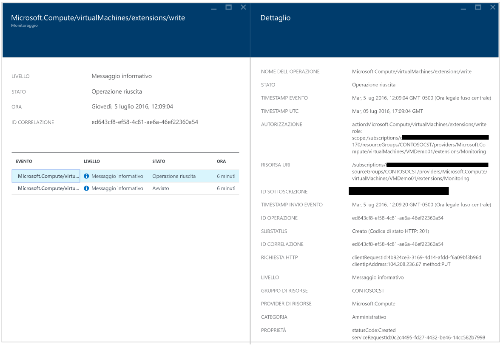
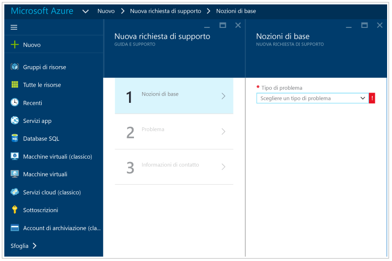

# Guida alla risoluzione dei problemi del Centro sicurezza di Azure
Questa guida è destinata a professionisti IT, analisti della sicurezza delle informazioni e amministratori cloud le cui organizzazioni usano il Centro sicurezza di Azure e devono risolvere i problemi correlati.

## Guida per la risoluzione dei problemi
Questa guida illustra come risolvere i problemi correlati al Centro sicurezza. La maggior parte delle attività di risoluzione dei problemi nel Centro sicurezza di Azure viene eseguita osservando prima di tutto i record del [log di controllo](https://azure.microsoft.com/updates/audit-logs-in-azure-preview-portal/) del componente in cui si è verificato il problema. Tramite i log di controllo, è possibile determinare:

* Quali operazioni sono state eseguite.
* Chi ha avviato l'operazione.
* Quando si è verificata l'operazione.
* Lo stato dell'operazione.
* I valori di altre proprietà che possono essere utili per ricerche sull'operazione.

Il log di controllo contiene tutte le operazioni di scrittura (PUT, POST, DELETE) eseguite sulle risorse, ma non include quelle di lettura (GET).

## Risoluzione dei problemi di installazione dell'agente di monitoraggio in Windows
L'agente di monitoraggio del Centro sicurezza viene usato per eseguire la raccolta dei dati. Dopo avere abilitato la raccolta dei dati e installato correttamente l'agente nel computer di destinazione, saranno in esecuzione i processi seguenti:

* ASMAgentLauncher.exe: agente di monitoraggio di Azure 
* ASMMonitoringAgent.exe: estensione per il monitoraggio della sicurezza di Azure
* ASMSoftwareScanner.exe: gestione analisi di Azure

L'estensione per il monitoraggio della sicurezza di Azure esegue l'analisi delle varie configurazioni pertinenti per la sicurezza e raccoglie i log di sicurezza dalle macchine virtuali. La funzionalità di gestione analisi verrà usata per l'analisi delle patch.

Se l'installazione riesce, nei log di controllo per la macchina virtuale di destinazione si noterà una voce simile alla seguente:

È anche possibile ottenere altre informazioni sul processo di installazione nei log dell'agente, disponibili nel percorso *%systemdrive%\windowsazure\logs*, ad esempio C:\WindowsAzure\Logs.

> [!NOTE]
> Se l'agente del Centro sicurezza di Azure non funziona correttamente, sarà necessario riavviare la macchina virtuale di destinazione, perché non esiste un comando per arrestare e avviare l'agente.
> 
> 

## Risoluzione dei problemi di installazione dell'agente monitoraggio in Linux
Nel caso di risoluzione dei problemi di installazione dell'agente di macchine virtuali in un sistema Linux, è necessario assicurarsi che l'estensione sia stata scaricata in/var/lib/waagent/. Per verificare se è stato installato, è possibile eseguire il comando seguente:

`cat /var/log/waagent.log` 

Ecco altri file di log che è possibile esaminare per la risoluzione dei problemi: 

* /var/log/mdsd.err
* /var/log/azure/

In un sistema funzionante si noterà una connessione al processo mdsd su TCP 29130. Si tratta del Syslog che comunica con il processo mdsd. È possibile convalidare il comportamento eseguendo questo comando:

`netstat -plantu | grep 29130`

## Contattare il supporto tecnico Microsoft
Alcuni problemi possono essere identificati usando le linee guida contenute in questo articolo, altri sono documentati nel [forum](https://social.msdn.microsoft.com/Forums/en-US/home?forum=AzureSecurityCenter)pubblico del Centro sicurezza. Tuttavia, se è necessario un altro tipo di risoluzione dei problemi, è possibile aprire una nuova richiesta di supporto tramite il portale di Azure, come illustrato di seguito: 

## Vedere anche
In questo documento è stato descritto come configurare i criteri di sicurezza nel Centro sicurezza di Azure. Per ulteriori informazioni sul Centro sicurezza di Azure, vedere gli argomenti seguenti:

* [Guida alla pianificazione e alla gestione del Centro sicurezza di Azure](security-center-planning-and-operations-guide.md) : informazioni sulla pianificazione e considerazioni di progettazione per l'adozione del Centro sicurezza di Azure.
* [Monitoraggio dell'integrità della sicurezza nel Centro sicurezza di Azure](security-center-monitoring.md) : informazioni su come monitorare l'integrità delle risorse di Azure
* [Gestione e risposta agli avvisi di sicurezza nel Centro sicurezza di Azure](security-center-managing-and-responding-alerts.md) : informazioni su come gestire e rispondere agli avvisi di sicurezza
* [Monitoraggio delle soluzioni dei partner con il Centro sicurezza di Azure](security-center-partner-solutions.md) : informazioni su come monitorare l'integrità delle soluzioni dei partner.
* [Domande frequenti sul Centro sicurezza di Azure](security-center-faq.md) : domande frequenti sull'uso del servizio
* [Blog sulla sicurezza di Azure](http://blogs.msdn.com/b/azuresecurity/) : post di blog sulla sicurezza e sulla conformità di Azure

<!--HONumber=Dec16_HO2-->

