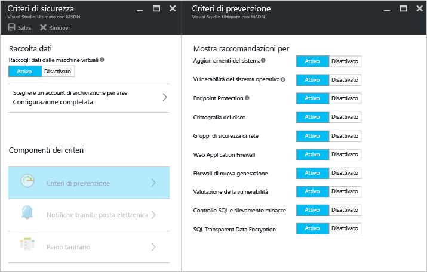
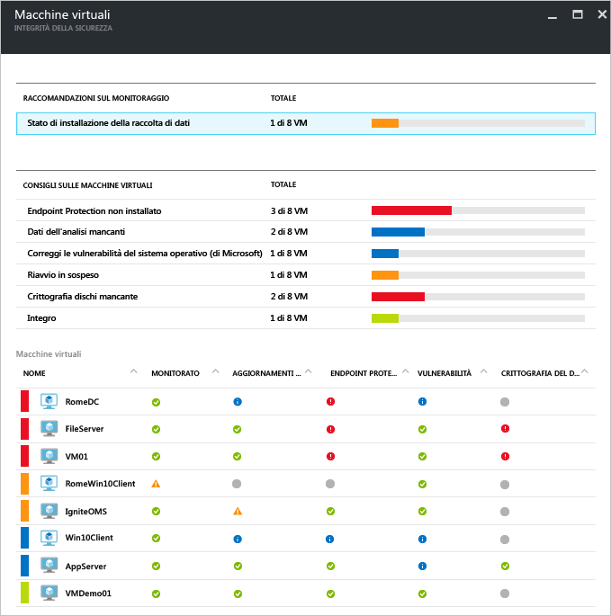
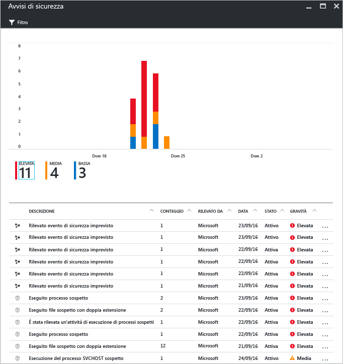

# Centro sicurezza di Azure e macchine virtuali di Azure
Il [Centro sicurezza di Azure](https://azure.microsoft.com/services/security-center/) consente di impedire, rilevare e gestire le minacce. Offre funzionalità integrate di monitoraggio della sicurezza e gestione dei criteri tra le sottoscrizioni di Azure, facilita il rilevamento delle minacce che altrimenti passerebbero inosservate e funziona con un ampio ecosistema di soluzioni di sicurezza.

Questo articolo illustra come il Centro sicurezza consente di proteggere le macchine virtuali (VM) di Azure.

## Perché usare il Centro sicurezza?
Il Centro sicurezza consente di proteggere i dati delle macchine virtuali di Azure fornendo visibilità sulle impostazioni di sicurezza di queste ultime. Quando si usa il Centro sicurezza per la protezione delle VM, sono disponibili le funzionalità seguenti:

* Impostazioni di sicurezza del sistema operativo con le regole di configurazione consigliate
* Aggiornamenti della sicurezza del sistema e altri aggiornamenti di importanza critica eventualmente mancanti
* Consigli per la protezione degli endpoint
* Convalida della crittografia del disco
* Valutazione della vulnerabilità e correzioni
* Introduzione al rilevamento delle minacce

Oltre a proteggere le macchine virtuali di Azure, il Centro sicurezza offre funzionalità per il monitoraggio e la gestione dei servizi cloud, dei servizi app, delle reti virtuali e molto altro. 

> [!NOTE]
> Per altre informazioni sul Centro sicurezza di Azure, vedere l'articolo [Introduzione al Centro sicurezza di Azure](security-center-intro.md).
> 
> 

## Prerequisiti
Per iniziare a usare il Centro sicurezza di Azure, è necessario conoscere e tenere in considerazione quanto segue:

* È necessaria una sottoscrizione a Microsoft Azure. Per altre informazioni sui livelli gratuito e standard del Centro sicurezza, vedere [Centro sicurezza Prezzi](https://azure.microsoft.com/pricing/details/security-center/).
* Pianificare l'adozione del Centro sicurezza. Per informazioni sulle considerazioni relative alla pianificazione e alle operazioni, vedere [Guida alla pianificazione e alla gestione del Centro sicurezza di Azure](security-center-planning-and-operations-guide.md).
* Per informazioni relative al supporto dei sistemi operativi, vedere [Domande frequenti sul Centro sicurezza di Azure](security-center-faq.md). 

## Impostare i criteri di sicurezza
È necessario abilitare la funzionalità di raccolta dati per consentire al Centro sicurezza di Azure di raccogliere le informazioni di cui ha bisogno per fornire indicazioni e avvisi generati sulla base dei criteri di sicurezza configurati. Nella figura seguente è possibile osservare che la funzionalità **Raccolta dati** è stato impostata su **On**.

I criteri di sicurezza definiscono il set di controlli consigliato per le risorse all'interno della sottoscrizione o di un gruppo di risorse specificato. Prima di abilitare i criteri di sicurezza, è necessario abilitare la funzionalità di raccolta dati. Il Centro sicurezza raccoglie i dati dalle macchine virtuali per valutarne lo stato della sicurezza, fornire raccomandazioni sulla sicurezza e avvisare delle minacce. Nel Centro sicurezza è possibile definire i criteri per le sottoscrizioni o i gruppi di risorse di Azure in base alle esigenze di sicurezza della propria società e al tipo di applicazioni o al livello di riservatezza dei dati di ogni sottoscrizione. 

> [!NOTE]
> Per altre informazioni su ciascun **criterio di prevenzione** disponibile, vedere l'articolo [Impostare i criteri di sicurezza](security-center-policies.md).
> 
> 

## Gestire le raccomandazioni per la sicurezza
Il Centro sicurezza analizza lo stato di sicurezza delle risorse di Azure. Quando identifica potenziali vulnerabilità della sicurezza, crea raccomandazioni. Queste raccomandazioni illustrano in dettaglio il processo di configurazione dei controlli necessari.

Una volta impostato un criterio di sicurezza, il Centro sicurezza analizza lo stato di sicurezza delle risorse per identificare le potenziali vulnerabilità. Le raccomandazioni vengono visualizzate sotto forma di tabella, in cui ogni riga rappresenta una particolare raccomandazione. La tabella seguente offre alcuni esempi di raccomandazioni e illustra gli effetti prodotti dalla messa in atto di queste ultime. Quando di seleziona una raccomandazione, vengono visualizzate informazioni per l'implementazione della stessa nel Centro sicurezza.

| Raccomandazione | Descrizione |
| --- | --- |
| [Abilita la raccolta di dati per le sottoscrizioni](security-center-enable-data-collection.md) |Consiglia di attivare la raccolta dati nei criteri di sicurezza per ogni sottoscrizione e per tutte le macchine virtuali nelle sottoscrizioni. |
| [Remediate OS vulnerabilities (Risolvi vulnerabilità del sistema operativo)](security-center-remediate-os-vulnerabilities.md) |Consiglia di allineare le configurazioni dei sistemi operativi alle regole di configurazione raccomandate, ad esempio non consentire il salvataggio delle password. |
| [Applicare gli aggiornamenti di sistema](security-center-apply-system-updates.md) |Consiglia di distribuire gli aggiornamenti critici e della sicurezza di sistema mancanti nelle macchine virtuali. |
| [Riavvia dopo gli aggiornamenti del sistema](security-center-apply-system-updates.md#reboot-after-system-updates) |Consiglia di riavviare una macchina virtuale per completare il processo di applicazione degli aggiornamenti del sistema. |
| [Installa Endpoint Protection](security-center-install-endpoint-protection.md) |Suggerisce di effettuare il provisioning dei programmi antimalware nelle macchine virtuali (solo VM Windows). |
| [Risolvi gli avvisi sull'integrità di Endpoint Protection](security-center-resolve-endpoint-protection-health-alerts.md) |Si consiglia di correggere gli errori relativi alla protezione degli endpoint. |
| [Abilita l'agente di macchine virtuali](security-center-enable-vm-agent.md) |Consente di identificare le macchine virtuali per le quali è necessario l'agente di macchine virtuali, che deve essere installato nelle macchine virtuali per poter effettuare il provisioning dei programmi di analisi delle patch, analisi della baseline e antimalware. Per impostazione predefinita, l'agente di macchine virtuali è installato nelle macchine virtuali distribuite da Azure Marketplace. L'articolo relativo all'[agente di macchine virtuali e relative estensioni, parte 2](http://azure.microsoft.com/blog/2014/04/15/vm-agent-and-extensions-part-2/) offre informazioni su come installare l'agente di macchine virtuali. |
| [Applicare Crittografia dischi](security-center-apply-disk-encryption.md) |Suggerisce di crittografare i dischi delle macchine virtuali con Crittografia dischi di Azure (VM Windows e Linux). La crittografia è consigliabile sia per il sistema operativo sia per i volumi di dati della macchina virtuale. |
| [La valutazione della vulnerabilità non è installata](security-center-vulnerability-assessment-recommendations.md) |Consiglia di installare una soluzione di valutazione della vulnerabilità nella VM. |
| [Correggi le vulnerabilità](security-center-vulnerability-assessment-recommendations.md#review-recommendation) |Consente di visualizzare le vulnerabilità del sistema e delle applicazioni rilevate dalla soluzione di valutazione delle vulnerabilità installata nella VM. |

> [!NOTE]
> Per altre informazioni sulle raccomandazioni, vedere l'articolo [Gestione delle raccomandazioni di sicurezza](security-center-recommendations.md).
> 
> 

## Monitorare l'integrità della sicurezza
Una volta abilitati i [criteri di sicurezza](security-center-policies.md) per le risorse di una sottoscrizione, il Centro sicurezza analizza la sicurezza delle risorse per identificare le potenziali vulnerabilità.  Nel pannello **Integrità sicurezza delle risorse** è possibile visualizzare lo stato di sicurezza delle risorse ed eventuali problemi rilevati. Quando si fa clic su **Macchine virtuali** nel riquadro **Integrità sicurezza delle risorse**, viene visualizzato il pannello **Macchine virtuali** con raccomandazioni per le macchine virtuali. 

## Gestire e rispondere agli avvisi di sicurezza
Il Centro sicurezza raccoglie, analizza e integra automaticamente i dati di log delle risorse di Azure, della rete e delle soluzioni dei partner connesse, ad esempio soluzioni di protezione endpoint e firewall, per rilevare le minacce reali e ridurre i falsi positivi. Sfruttando le potenzialità dell'aggregazione di diverse [funzionalità di rilevamento](security-center-detection-capabilities.md), Security Center è in grado di generare avvisi di protezione ordinati in base alla priorità che consentono di esaminare rapidamente un problema e forniscono indicazioni su come risolvere possibili attacchi.

Selezionare un avviso di sicurezza per altre informazioni sugli eventi che hanno attivato l'avviso e, se presenti, i passaggi da eseguire per correggere un attacco. Gli avvisi di sicurezza vengono raggruppati per [tipo](security-center-alerts-type.md) e data.

## Vedere anche
Per altre informazioni sul Centro sicurezza, vedere gli argomenti seguenti:

* [Impostazione dei criteri di sicurezza nel Centro sicurezza di Azure](security-center-policies.md) : informazioni su come configurare i criteri di sicurezza per le sottoscrizioni e i gruppi di risorse di Azure.
* [Gestione e risposta agli avvisi di sicurezza nel Centro sicurezza di Azure](security-center-managing-and-responding-alerts.md) : informazioni su come gestire e rispondere agli avvisi di sicurezza.
* [Domande frequenti sul Centro sicurezza di Azure](security-center-faq.md) : domande frequenti sull'uso del servizio.

<!--HONumber=Dec16_HO2-->

