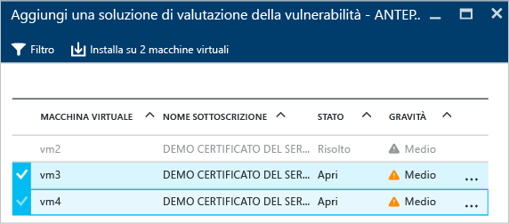
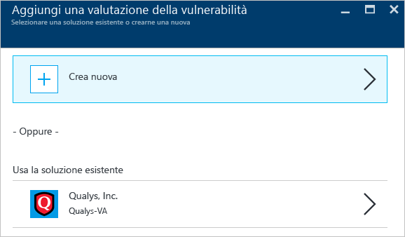
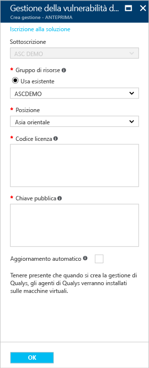
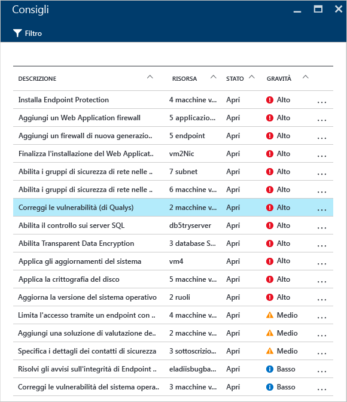
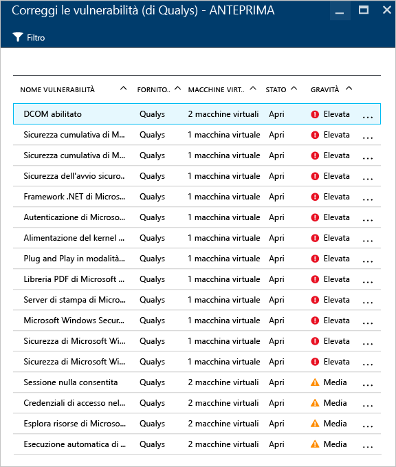
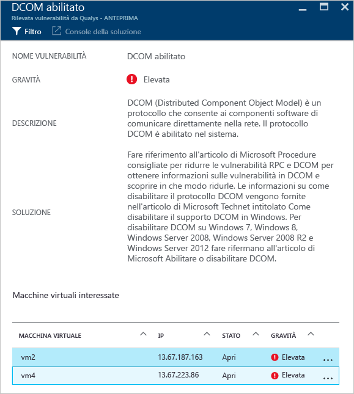

# Valutazione della vulnerabilità nel Centro sicurezza di Azure
Questo documento descrive le raccomandazioni di valutazione della vulnerabilità applicabili alle macchine virtuali eseguite in Azure.

## Informazioni sulla valutazione della vulnerabilità
La valutazione della vulnerabilità nel Centro sicurezza di Azure fa parte delle raccomandazioni sulle macchine virtuali. Se il Centro sicurezza non trova una soluzione di valutazione della vulnerabilità installata nella macchina virtuale, ne raccomanda l'installazione. Una volta distribuito, l'agente del partner inizierà a inviare i dati di vulnerabilità alla piattaforma di gestione del partner che, a sua volta, trasmetterà i dati di vulnerabilità e monitoraggio dello stato al Centro sicurezza. Gli utenti possono identificare rapidamente le macchine virtuali vulnerabili dal dashboard del Centro sicurezza e ottenere altri report e informazioni passando alla console di gestione del partner direttamente dal Centro sicurezza.

> [!NOTE]
> Il documento introduce il servizio usando una distribuzione di esempio. Questa non è una guida dettagliata.
>
>

## Limiti dell'anteprima pubblica
Le limitazioni seguenti si applicano all'attuale anteprima pubblica della valutazione della vulnerabilità:

* L'unica soluzione di valutazione della vulnerabilità disponibile è quella del partner [Qualys](https://www.qualys.com/lp/azure). ne verranno aggiunti altri a breve.
* È possibile installare la soluzione di valutazione della vulnerabilità in più macchine virtuali, purché appartengano alla stessa sottoscrizione.
* Sono supportate solo le macchine virtuali Windows, mentre le macchine virtuali Linux verranno aggiunte per la disponibilità generale (GA).

## Implementare la raccomandazione sulle macchine virtuali
Quando il Centro sicurezza identifica una o più macchine virtuali supportate che non hanno una soluzione di valutazione della vulnerabilità, viene attivata una raccomandazione sulle macchine virtuali. I passaggi che seguono illustrano come accedere a questa raccomandazione e come applicarla a più macchine virtuali che appartengono alla stessa sottoscrizione:

1. Nel riquadro **Integrità sicurezza delle risorse** fare clic su **Macchine virtuali**
2. Nel pannello **Macchine virtuali** selezionare **La valutazione della vulnerabilità non è installata** come illustrato nella schermata seguente:

    
3. Nel pannello **Aggiungi una soluzione di valutazione della vulnerabilità - ANTEPRIMA** selezionare le macchine virtuali nelle quali installare la soluzione di valutazione della vulnerabilità, come illustrato nella schermata seguente:

    
4. Nel pannello **Aggiungi una soluzione di valutazione della vulnerabilità - ANTEPRIMA** fare clic sull'opzione **Installa nelle VM 2**. Il nome può variare a seconda del numero di VM selezionate. Verrà visualizzato il pannello **Add a Vulnerability Assessment** (Aggiungi valutazione della vulnerabilità), come illustrato nella schermata seguente:

    
5. In questo pannello è possibile scegliere di creare una nuova valutazione della vulnerabilità, che consente di selezionare una soluzione partner da **Azure Marketplace** oppure è possibile selezionare una soluzione partner esistente in Usa la soluzione esistente, in questo caso **Qualys**.

> [!NOTE]
> L'aggiornamento automatico può essere attivato o disattivato dal pannello **Partner Solutions** (Soluzioni partner). Quando si seleziona la soluzione partner, fare clic su **Configura** e nel pannello **Configure security solution** (Configura la soluzione di sicurezza) selezionare ON oppure OFF per l'aggiornamento automatico. 

## Creare una nuova soluzione di valutazione della vulnerabilità
In presenza di più sottoscrizioni è possibile creare una soluzione di valutazione della vulnerabilità per ogni sottoscrizione. I passaggi principali sono gli stessi descritti nella sezione precedente, l'unica differenza è che nel passaggio 4 si farà clic sull'opzione **Crea nuova** . Dopo aver selezionato questa opzione, procedere nel modo seguente.

> [!NOTE]
> Nell'esempio seguente viene usato Qualys. Per distribuire un agente cloud Qualys dal Centro sicurezza è necessario ottenere un codice di licenza e una chiave pubblica da Qualys. Vedere la [documentazione di Qualys](https://community.qualys.com/docs/DOC-5823-deploying-qualys-cloud-agents-from-microsoft-azure-security-center) per informazioni su come ottenere il codice di licenza e la chiave pubblica.

1. Nel pannello **Create a new Vulnerability Assessment** (Crea una nuova valutazione della vulnerabilità) fare clic sul nome del partner, in questo caso **Qualys**.
2. Verrà visualizzato il pannello del partner. I campi di questo pannello possono variare a seconda del partner. In questo esempio verrà usato **Qualys**:

    
3. Nel campo **Resource group** (Gruppo di risorse) selezionare un gruppo di risorse esistente.
4. Nel campo **Località** selezionare la località geografica in cui si troverà la soluzione.
5. Nel campo **Codice di licenza** , specifico di Qualys, digitare il codice di licenza fornito dal partner.
6. Nel campo **Public key** (Chiave pubblica), specifico di Qualys, digitare le informazioni di chiave pubblica fornite dal partner.
7. Per installare automaticamente un agente di valutazione delle vulnerabilità in tutte le VM individuate nella sottoscrizione di questa soluzione Qualys, selezionare la casella di controllo **Auto update** (Aggiornamento automatico).
8. Fare clic su **OK**.

## Verificare la raccomandazione
Dopo l'installazione nella macchina virtuale, la soluzione di valutazione della vulnerabilità analizzerà la macchina virtuale per rilevare e identificare le vulnerabilità del sistema e delle applicazioni.

> [!NOTE]
> Il completamento della prima scansione può richiedere un paio di ore; successivamente si tratterà di un processo orario.
>
>

I problemi verranno elencati nelle opzioni **Raccomandazioni sulle macchine virtuali** . L'esempio seguente illustra la visualizzazione delle raccomandazioni nel pannello **Raccomandazioni** :

In questo esempio, la raccomandazione selezionata indica che il rilevamento è stato eseguito da Qualys. Se si fa clic su questa raccomandazione, verrà visualizzato un nuovo pannello con un elenco delle vulnerabilità come illustrato nella schermata seguente:

Questo elenco indica tutte le vulnerabilità in ordine di gravità e il numero di macchine virtuali interessate. Per questo esempio è stata selezionata la vulnerabilità Enabled DCOM (DCOM abilitato) e viene visualizzato un nuovo pannello con le procedure consigliate per risolvere questa vulnerabilità:

## Vedere anche
In questo documento è stato descritto come applicare le raccomandazioni della valutazione della vulnerabilità nel Centro sicurezza di Azure. Per ulteriori informazioni sul Centro sicurezza di Azure, vedere gli argomenti seguenti:

* [Guida alla pianificazione e alla gestione del Centro sicurezza di Azure](security-center-planning-and-operations-guide.md). Informazioni sulla pianificazione e considerazioni di progettazione per l'adozione del Centro sicurezza di Azure.
* [Monitoraggio dell'integrità della sicurezza nel Centro sicurezza di Azure](security-center-monitoring.md). Informazioni su come monitorare l'integrità delle risorse di Azure.
* [Gestione e risposta agli avvisi di sicurezza nel Centro sicurezza di Azure](security-center-managing-and-responding-alerts.md). Informazioni su come gestire e rispondere agli avvisi di sicurezza.
* [Monitoraggio delle soluzioni dei partner con il Centro sicurezza di Azure](security-center-partner-solutions.md). Informazioni su come monitorare lo stato integrità delle soluzioni dei partner.
* [Domande frequenti sul Centro sicurezza di Azure](security-center-faq.md). Domande frequenti sull'uso del servizio.
* [Blog sulla sicurezza di Azure](http://blogs.msdn.com/b/azuresecurity/). Post di blog sulla sicurezza e sulla conformità di Azure.

