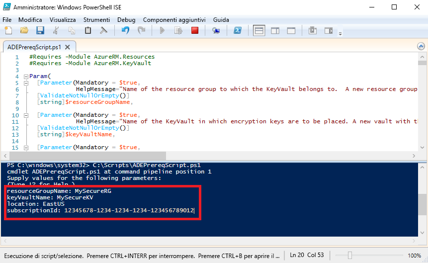

# <a name="quickstart-encrypt-a-windows-iaas-vm-with-azure-powershell"></a>Guida introduttiva: Crittografare una macchina virtuale IaaS Windows con Azure PowerShell

Crittografia dischi di Azure consente di crittografare i dischi delle macchine virtuali IaaS Windows e Linux. La soluzione è integrata con Azure Key Vault per consentire il controllo e la gestione dei segreti e delle chiavi di crittografia dei dischi. Con Crittografia dischi di Azure è possibile garantire che le macchine virtuali inattive siano protette usando la tecnologia di crittografia standard del settore. In questa guida introduttiva verrà creata una macchina virtuale Windows Server 2016 e verrà crittografato il disco del sistema operativo.

Se non si ha una sottoscrizione di Azure, creare un [account gratuito](https://azure.microsoft.com/free/?WT.mc_id=A261C142F) prima di iniziare.

## <a name="prerequisites"></a>Prerequisiti

- Windows PowerShell ISE
- Installare o eseguire l'aggiornamento all'[ultima versione del modulo AzureRM PowerShell](/powershell/azure/azurerm/install-azurerm-ps?view=azurermps-6.13.0)
    - La versione del modulo AzureRM deve essere 6.0.0 o superiore. `Get-Module AzureRM -ListAvailable | Select-Object -Property Name,Version,Path`
- Copia dello [script dei prerequisiti di Crittografia dischi di Azure](https://raw.githubusercontent.com/Azure/azure-powershell/master/src/Compute/Compute/Extension/AzureDiskEncryption/Scripts/AzureDiskEncryptionPreRequisiteSetup.ps1).
    - Se si ha già questo script, scaricare una nuova copia perché è stato modificato di recente. 
    - Usare **CTRL + A** per selezionare tutto il testo e quindi usare **CTRL + C** per copiare tutto il testo nel Blocco note.
    - Salvare il file come **ADEPrereqScript.ps1**


## <a name="sign-in-to-azure"></a>Accedere ad Azure

1. Fare clic con il pulsante destro del mouse su **Windows PowerShell ISE** e scegliere **Esegui come amministratore**.
1. Nella finestra **Amministratore: Windows PowerShell ISE** fare clic su **Visualizza** e quindi su **Mostra riquadro di script**.
1. Nel riquadro di script digitare il cmdlet seguente: 

     ```azurepowershell
      Connect-AzureRMAccount
     ```

1. Fare clic sulla freccia verde per **Esegui script** o usare F5. 
2. Usare l'accesso interattivo per completare la connessione all'account Azure.
3. Copiare l'**ID sottoscrizione** che viene restituito eseguendo lo script di PowerShell successivo. 

## <a name="bkmk_PrereqScript"></a> Eseguire lo script dei prerequisiti di Crittografia dischi di Azure
 **ADEPrereqScript.ps1** creerà un gruppo di risorse, un insieme di credenziali delle chiavi e imposterà i criteri di accesso dell'insieme di credenziali delle chiavi. Lo script crea anche un blocco di risorsa nell'insieme di credenziali delle chiavi per consentirne la protezione da eliminazioni accidentali.  

1. Nella finestra **Amministratore: Windows PowerShell ISE** fare clic su **File** e quindi su **Apri**. Passare al file **ADEPrereqScript.ps1** e fare doppio clic su di esso. Lo script verrà aperto nel riquadro di script.
2. Fare clic sulla freccia verde per **Esegui script** o usare F5 per eseguire lo script. 
3. Digitare i nomi di un nuovo **gruppo di risorse** e di un nuovo **insieme di credenziali delle chiavi**. Non usare un gruppo di risorse o un insieme di credenziali delle chiavi esistente per questa guida introduttiva perché più avanti il gruppo di risorse verrà eliminato. 
4. Digitare il percorso in cui si vogliono creare le risorse, ad esempio **EastUS**. Ottenere un elenco di percorsi con `Get-AzureRMLocation`.
5. Copiare l'**ID sottoscrizione**. È possibile ottenere l'ID della sottoscrizione con `Get-AzureRMSubscription`.  
6. Fare clic sulla freccia verde per **Esegui script**. 
7. Copiare gli oggetti **DiskEncryptionKeyVaultUrl** e **DiskEncryptionKeyVaultId** restituiti da usare più avanti.




## <a name="create-a-virtual-machine"></a>Creare una macchina virtuale 
È ora necessario creare una macchina virtuale in modo da poterne crittografare il disco. Lo script che verrà usato crea una macchina virtuale Windows Server 2016 con 8 GB di RAM e un disco del sistema operativo da 30 GB. 

1. Copiare lo script nel riquadro do script **Amministratore: Windows PowerShell ISE** e modificare le prime tre variabili. Il gruppo di risorse e il percorso devono essere gli stessi di quelli usati per lo [script dei prerequisiti](#bkmk_PrereqScript).  

   ```azurepowershell
    # Variables for common values
    $resourceGroup = "MySecureRG"
    $location = "EastUS"
    $vmName = "MySecureVM"
    
    # Create user object
    $cred = Get-Credential -Message "Enter a username and password for the virtual machine."
    
    # Create a resource group
    #New-AzureRmResourceGroup -Name $resourceGroup -Location $location
    
    # Create a subnet configuration
    $subnetConfig = New-AzureRmVirtualNetworkSubnetConfig -Name mySubnet -AddressPrefix 192.168.1.0/24
    
    # Create a virtual network
    $vnet = New-AzureRmVirtualNetwork -ResourceGroupName $resourceGroup -Location $location `
      -Name MYvNET -AddressPrefix 192.168.0.0/16 -Subnet $subnetConfig
    
    # Create a public IP address and specify a DNS name
    $pip = New-AzureRmPublicIpAddress -ResourceGroupName $resourceGroup -Location $location `
      -Name "mypublicdns$(Get-Random)" -AllocationMethod Static -IdleTimeoutInMinutes 4
    
    # Create an inbound network security group rule for port 3389
    $nsgRuleRDP = New-AzureRmNetworkSecurityRuleConfig -Name myNetworkSecurityGroupRuleRDP  -Protocol Tcp `
      -Direction Inbound -Priority 1000 -SourceAddressPrefix * -SourcePortRange * -DestinationAddressPrefix * `
      -DestinationPortRange 3389 -Access Allow
    
    # Create a network security group
    $nsg = New-AzureRmNetworkSecurityGroup -ResourceGroupName $resourceGroup -Location $location `
      -Name myNetworkSecurityGroup -SecurityRules $nsgRuleRDP
    
    # Create a virtual network card and associate with public IP address and NSG
    $nic = New-AzureRmNetworkInterface -Name myNic -ResourceGroupName $resourceGroup -Location $location `
      -SubnetId $vnet.Subnets[0].Id -PublicIpAddressId $pip.Id -NetworkSecurityGroupId $nsg.Id
    
    # Create a virtual machine configuration
    $vmConfig = New-AzureRmVMConfig -VMName $vmName -VMSize Standard_D2_v3 | `
    Set-AzureRmVMOperatingSystem -Windows -ComputerName $vmName -Credential $cred | `
    Set-AzureRmVMSourceImage -PublisherName MicrosoftWindowsServer -Offer WindowsServer -Skus 2016-Datacenter-smalldisk -Version latest | `
    Add-AzureRmVMNetworkInterface -Id $nic.Id
    
    # Create a virtual machine
    New-AzureRmVM -ResourceGroupName $resourceGroup -Location $location -VM $vmConfig
   ```

2. Fare clic sulla freccia verde per **Esegui script** per creare la macchina virtuale.  


## <a name="encrypt-the-disk-of-the-vm"></a>Crittografare il disco della macchina virtuale
Dopo avere stato creato e configurato un insieme di credenziali delle chiavi e una macchina virtuale, è possibile crittografare il disco con il cmdlet **Set-AzureRmVmDiskEncryptionExtension**. 
 
1. Eseguire il cmdlet seguente per crittografare il disco della macchina virtuale:

    ```azurepowershell
     Set-AzureRmVmDiskEncryptionExtension -ResourceGroupName "MySecureRG" -VMName "MySecureVM" `
     -DiskEncryptionKeyVaultId "<Returned by the prerequisites script>" -DiskEncryptionKeyVaultUrl "<Returned by the prerequisites script>"
     ```


1. Al termine della crittografia è possibile verificare che il disco sia stato crittografato con il cmdlet seguente: 

     ```azurepowershell
     Get-AzureRmVmDiskEncryptionStatus -ResourceGroupName "MySecureRG" -VMName "MySecureVM"
     ```
    
    
## <a name="clean-up-resources"></a>Pulire le risorse
 **ADEPrereqScript.ps1** crea un blocco di risorsa nell'insieme di credenziali delle chiavi. Per pulire le risorse di questa guida introduttiva, è necessario innanzitutto rimuovere il blocco di risorsa, quindi eliminare il gruppo di risorse. 

1. Rimuovere il blocco di risorsa dall'insieme di credenziali delle chiavi

     ```azurepowershell
     $LockId =(Get-AzureRMResourceLock -ResourceGroupName "MySecureRG" -ResourceName "MySecureVault" -ResourceType "Microsoft.KeyVault/vaults").LockID 
     Remove-AzureRmResourceLock -LockID $LockId
      ```
    
2. Rimuovere il gruppo di risorse. Verranno eliminate anche tutte le risorse nel gruppo. 
     ```azurepowershell
      Remove-AzureRmResourceGroup -Name "MySecureRG"
      ```

## <a name="next-steps"></a>Passaggi successivi
Passare all'articolo successivo per altre informazioni sui prerequisiti di Crittografia dischi di Azure per le macchine virtuali IaaS.

> [!div class="nextstepaction"]
> [Prerequisiti di Crittografia dischi di Azure](azure-security-disk-encryption-prerequisites.md)