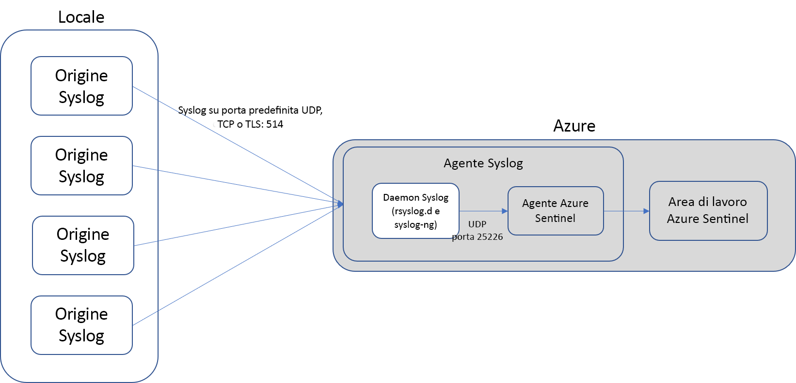
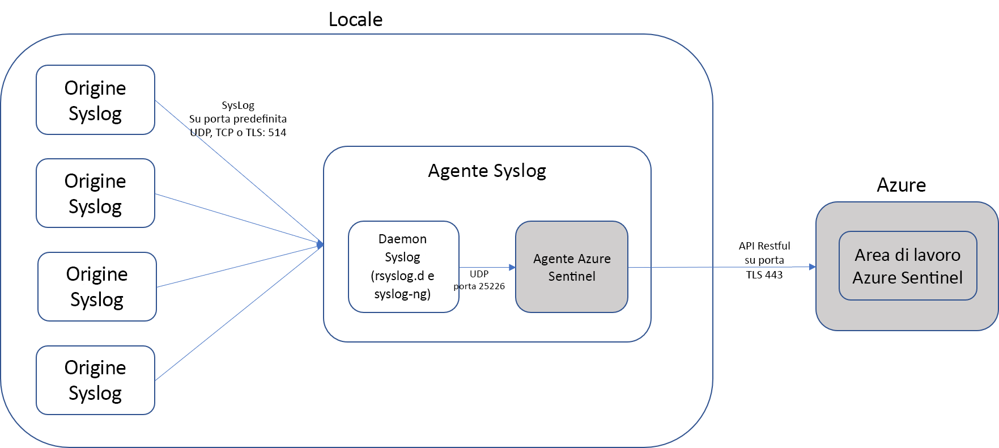

# Connettere la soluzione esterna usando Common Event Format

> [!IMPORTANT]
> Azure Sentinel è attualmente in anteprima pubblica.
> Questa versione di anteprima viene messa a disposizione senza contratto di servizio e non è consigliata per i carichi di lavoro di produzione. Alcune funzionalità potrebbero non essere supportate o potrebbero presentare funzionalità limitate. Per altre informazioni, vedere [Condizioni supplementari per l'utilizzo delle anteprime di Microsoft Azure](https://azure.microsoft.com/support/legal/preview-supplemental-terms/).

È possibile connettere Azure Sentinel con una soluzione esterna che consente di salvare i file di log in Syslog. Se l'appliance consente di salvare i log come Syslog Common Event Format (CEF), l'integrazione con Azure Sentinel consente di eseguire facilmente analitica e le query tra i dati.

> [!NOTE] 
> I dati vengono archiviati nella posizione geografica dell'area di lavoro in cui in esecuzione Azure Sentinel.

## Funzionamento

La connessione tra l'appliance CEF e Sentinel Azure viene eseguita in tre passaggi:

1. Nell'appliance è necessario impostare questi valori in modo che l'appliance invia i log necessari nel formato necessario per l'agente Azure Sentinel Syslog. È possibile modificare questi parametri nel dispositivo, purché si anche modificarli nel daemon Syslog sull'agente di Azure Sentinel.
    - Protocollo UDP =
    - Port = 514
    - Funzione Local-4 =
    - Formato = CEF
2. L'agente di Syslog raccoglie i dati e lo invia in modo sicuro al Log Analitica, dove viene analizzato e arricchito.
3. L'agente archivia i dati in un'area di lavoro di Log Analitica in modo che è possibile eseguire query in base alle esigenze, utilizzando analitica, le regole di correlazione e i dashboard.

## Passaggio 1: Connettersi all'Appliance CEF tramite VM di Azure dedicata

È necessario distribuire un agente in un computer Linux dedicato (macchina virtuale o in locale) per supportare la comunicazione tra il dispositivo e Sentinel di Azure. È possibile distribuire l'agente manualmente o automaticamente. Distribuzione automatica è basata su modelli di Resource Manager e può essere utilizzata solo se la macchina Linux dedicata è una nuova macchina virtuale in Azure si sta creando.

 

In alternativa, è possibile distribuire l'agente manualmente in una macchina virtuale di Azure esistente, in una macchina virtuale in un altro cloud o in un computer locale. 

 

### Distribuire l'agente di Azure

1. Nel portale di Azure Sentinel, fare clic su **connettori dati** e selezionare il tipo di dispositivo. 

1. Sotto **configurazione dell'agente Linux Syslog**:
   - Scegli **distribuzione automatica** se si desidera creare una nuova macchina è pre-installata con l'agente Azure Sentinel e include tutte le necessarie di configurazione, come descritto in precedenza. Selezionare **distribuzione automatica** e fare clic su **distribuzione automatica dell'agente**. Consente di andare alla pagina di acquisto per una VM di Linux dedicata che viene connesso automaticamente all'area di lavoro, è. La macchina virtuale è una **v3 D2s standard (2 Vcpu, 8 GB di memoria)** e ha un indirizzo IP pubblico.
      1. Nel **distribuzione personalizzata** pagina, fornire i dettagli e scegliere un nome utente e una password e se si accettano i termini e condizioni, la macchina virtuale di acquisto.
      1. Configurare l'appliance per inviare i log usando le impostazioni riportate nella pagina di connessione. Per il connettore Generic Common Event Format, usare queste impostazioni:
         - Protocollo UDP =
         - Port = 514
         - Funzione Local-4 =
         - Formato = CEF
   - Scegli **distribuzione manuale** se si desidera usare una macchina virtuale esistente della macchina Linux dedicata in cui deve essere installato l'agente Azure Sentinel. 
      1. Sotto **scaricare e installare l'agente di Syslog**, selezionare **macchina virtuale Linux di Azure**. 
      1. Nel **macchine virtuali** schermata che si apre, selezionare la macchina si vuole usare e fare clic su **Connect**.
      1. Nella schermata di connettore, sotto **configurazione e l'inoltro Syslog**, impostare che il daemon Syslog sia **rsyslog.d** o **syslog-ng**. 
      1. Copiare i comandi seguenti ed eseguirli nell'appliance:
          - Se si seleziona rsyslog.d:
              
            1. Indicare il daemon Syslog per l'ascolto su struttura local_4 e per inviare i messaggi Syslog per l'agente Azure Sentinel tramite porta 25226 locale. `sudo bash -c "printf 'local4.debug  @127.0.0.1:25226' > /etc/rsyslog.d/security-config-omsagent.conf"`
            
            2. Scaricare e installare il [file di configurazione security_events](https://aka.ms/asi-syslog-config-file-linux) che configura l'agente di Syslog per l'ascolto sulla porta 25226 locale. `sudo wget -O /etc/opt/microsoft/omsagent/{0}/conf/omsagent.d/security_events.conf "https://aka.ms/syslog-config-file-linux"` In cui {0} deve essere sostituito con il GUID dell'area di lavoro.
            
            1. Riavviare il daemon syslog `sudo service rsyslog restart`  Per altre informazioni vedere il [rsyslog documentazione](https://www.rsyslog.com/doc/v8-stable/tutorials/tls_cert_summary.html)
           
          - Se è stato selezionato syslog-ng:

              1. Indicare il daemon Syslog per l'ascolto su struttura local_4 e per inviare i messaggi Syslog per l'agente Azure Sentinel tramite porta 25226 locale. `sudo bash -c "printf 'filter f_local4_oms { facility(local4); };\n  destination security_oms { tcp(\"127.0.0.1\" port(25226)); };\n  log { source(src); filter(f_local4_oms); destination(security_oms); };' > /etc/syslog-ng/security-config-omsagent.conf"`
              2. Scaricare e installare il [file di configurazione security_events](https://aka.ms/asi-syslog-config-file-linux) che configura l'agente di Syslog per l'ascolto sulla porta 25226 locale. `sudo wget -O /etc/opt/microsoft/omsagent/{0}/conf/omsagent.d/security_events.conf "https://aka.ms/syslog-config-file-linux"` In cui {0} deve essere sostituito con il GUID dell'area di lavoro.

              3. Riavviare il daemon syslog `sudo service syslog-ng restart`  Per altre informazioni, vedere il [documentazione syslog-ng](https://www.syslog-ng.com/technical-documents/doc/syslog-ng-open-source-edition/3.16/mutual-authentication-using-tls/2)
      2. Riavviare l'agente di Syslog usando questo comando: `sudo /opt/microsoft/omsagent/bin/service_control restart [{workspace GUID}]`
      1. Verificare che non siano presenti errori nel log dell'agente, eseguire questo comando: `tail /var/opt/microsoft/omsagent/log/omsagent.log`

 Per usare lo schema appropriato nel Log Analitica per gli eventi CEF, cercare `CommonSecurityLog`.

### Distribuire l'agente in un server Linux locale

Se non si usa Azure, è necessario distribuire manualmente l'agente Azure Sentinel per l'esecuzione in un server Linux dedicato.

1. Nel portale di Azure Sentinel, fare clic su **connettori dati** e selezionare il tipo di dispositivo.
1. Per creare una VM Linux dedicata, in **configurazione dell'agente Linux Syslog** sceglie **distribuzione manuale**.
   1. Sotto **scaricare e installare l'agente di Syslog**, selezionare **computer Non Azure Linux**. 
   1. Nel **degli agenti diretti** schermata che si apre selezionare **Agent per Linux** per scaricare l'agente o eseguire questo comando per scaricarlo nel computer Linux:   `wget https://raw.githubusercontent.com/Microsoft/OMS-Agent-for-Linux/master/installer/scripts/onboard_agent.sh && sh onboard_agent.sh -w {workspace GUID} -s gehIk/GvZHJmqlgewMsIcth8H6VqXLM9YXEpu0BymnZEJb6mEjZzCHhZgCx5jrMB1pVjRCMhn+XTQgDTU3DVtQ== -d opinsights.azure.com`
      1. Nella schermata di connettore, sotto **configurazione e l'inoltro Syslog**, impostare che il daemon Syslog sia **rsyslog.d** o **syslog-ng**. 
      1. Copiare i comandi seguenti ed eseguirli nell'appliance:
         - Se si seleziona rsyslog:
           1. Indicare il daemon Syslog per l'ascolto su struttura local_4 e per inviare i messaggi Syslog per l'agente Azure Sentinel tramite porta 25226 locale. `sudo bash -c "printf 'local4.debug  @127.0.0.1:25226' > /etc/rsyslog.d/security-config-omsagent.conf"`
            
           2. Scaricare e installare il [file di configurazione security_events](https://aka.ms/asi-syslog-config-file-linux) che configura l'agente di Syslog per l'ascolto sulla porta 25226 locale. `sudo wget -O /etc/opt/microsoft/omsagent/{0}/conf/omsagent.d/security_events.conf "https://aka.ms/syslog-config-file-linux"` In cui {0} deve essere sostituito con il GUID dell'area di lavoro.
           3. Riavviare il daemon syslog `sudo service rsyslog restart`
         - Se è stato selezionato syslog-ng:
            1. Indicare il daemon Syslog per l'ascolto su struttura local_4 e per inviare i messaggi Syslog per l'agente Azure Sentinel tramite porta 25226 locale. `sudo bash -c "printf 'filter f_local4_oms { facility(local4); };\n  destination security_oms { tcp(\"127.0.0.1\" port(25226)); };\n  log { source(src); filter(f_local4_oms); destination(security_oms); };' > /etc/syslog-ng/security-config-omsagent.conf"`
            2. Scaricare e installare il [file di configurazione security_events](https://aka.ms/asi-syslog-config-file-linux) che configura l'agente di Syslog per l'ascolto sulla porta 25226 locale. `sudo wget -O /etc/opt/microsoft/omsagent/{0}/conf/omsagent.d/security_events.conf "https://aka.ms/syslog-config-file-linux"` In cui {0} deve essere sostituito con il GUID dell'area di lavoro.
            3. Riavviare il daemon syslog `sudo service syslog-ng restart`
      1. Riavviare l'agente di Syslog usando questo comando: `sudo /opt/microsoft/omsagent/bin/service_control restart [{workspace GUID}]`
      1. Verificare che non siano presenti errori nel log dell'agente, eseguire questo comando: `tail /var/opt/microsoft/omsagent/log/omsagent.log`
  
 Per usare lo schema appropriato nel Log Analitica per gli eventi CEF, cercare `CommonSecurityLog`.

## Passaggio 3: Convalidare la connettività

Potrebbero occorrere fino a 20 minuti fino a quando i log di avvio venga visualizzato nel Log Analitica. 

1. Assicurarsi di che usare la funzione a destra. La funzionalità deve essere lo stesso nell'appliance e in Azure Sentinel. È possibile controllare quali file di funzionalità è in uso in Azure Sentinel e modificarlo nel file `security-config-omsagent.conf`. 

2. Assicurarsi che i log vengano alla porta di destra nell'agente di Syslog. Eseguire questo comando nel computer agente Syslog: `tcpdump -A -ni any  port 514 -vv` Questo comando Visualizza i log che consente di trasmettere dal dispositivo al computer Syslog. Assicurarsi che i log vengono ricevuti da appliance di origine sulla porta di destra e struttura a destra.

3. Assicurarsi che i log si inviano rispettino [RFC 5424](https://tools.ietf.org/html/rfc542).

4. Nel computer che esegue l'agente di Syslog, assicurarsi che queste porte 514, 25226 locale sono aperti ed è in ascolto, usando il comando `netstat -a -n:`. Per altre informazioni sull'uso di questo comando, vedere [netstat(8) - pagina di manuale di Linux](https://linux.die.netman/8/netstat). Se è in ascolto in modo corretto, si noterà questo:

    

5. Assicurarsi che il daemon è impostato per l'ascolto sulla porta 514, in cui si sta inviando i log.
    - Per rsyslog: Assicurarsi che il file `/etc/rsyslog.conf` include questa configurazione:

           # provides UDP syslog reception
           module(load="imudp")
           input(type="imudp" port="514")
        
           # provides TCP syslog reception
           module(load="imtcp")
           input(type="imtcp" port="514")

      Per altre informazioni, vedere [imudp: Modulo di Input UDP Syslog](https://www.rsyslog.com/doc/v8-stable/configuration/modules/imudp.html#imudp-udp-syslog-input-module) e [imtcp: Modulo Syslog Input TCP](https://www.rsyslog.com/doc/v8-stable/configuration/modules/imtcp.html#imtcp-tcp-syslog-input-module)

   - Per syslog-ng: Assicurarsi che il file `/etc/syslog-ng/syslog-ng.conf` include questa configurazione:

           # source s_network {
            network( transport(UDP) port(514));
             };
     Per altre informazioni, vedere [imudp: Modulo di Input UDP Syslog] (per altre informazioni, vedere il [syslog-ng 3.16 edizione Open Source - Administration Guide](https://www.syslog-ng.com/technical-documents/doc/syslog-ng-open-source-edition/3.16/administration-guide/19#TOPIC-956455).

1. Verificare che vi sia la comunicazione tra il daemon Syslog e l'agente. Eseguire questo comando nel computer agente Syslog: `tcpdump -A -ni any  port 25226 -vv` Questo comando Visualizza i log che consente di trasmettere dal dispositivo al computer Syslog. Assicurarsi che i log vengono anche ricevuti nell'agente.

6. Se entrambi i comandi forniti risultati corretti, controllare i Log Analitica per vedere se i log sono in arrivo. Tutti gli eventi trasferiti da questi dispositivi vengono visualizzati in formato non elaborato nel Log Analitica in `CommonSecurityLog` tipo.

7. Per verificare se sono presenti errori o se i log non sono in arrivo, Cerca in `tail /var/opt/microsoft/omsagent/<workspace id>/log/omsagent.log`. Se lo stato sono presenti errori di mancata corrispondenza tra formato di log, passare a `/etc/opt/microsoft/omsagent/{0}/conf/omsagent.d/security_events.conf "https://aka.ms/syslog-config-file-linux"` ed esaminare il file `security_events.conf`e assicurarsi che i log corrispondano al formato di espressione regolare vedere in questo file.

8. Assicurarsi che le dimensioni predefinite del messaggio Syslog sono limitata a 2048 byte (2KB). Se i log sono troppo lunghi, aggiornare il security_events usando questo comando: `message_length_limit 4096`

## Passaggi successivi
In questo documento è stato descritto come connettere Azure Sentinel di Appliance CEF. Per altre informazioni su Azure Sentinel, vedere gli articoli seguenti:
- Informazioni su come [ottenere la visibilità di dati e le potenziali minacce](quickstart-get-visibility.md).
- Iniziare a usare [rilevando minacce con Azure Sentinel](tutorial-detect-threats.md).

