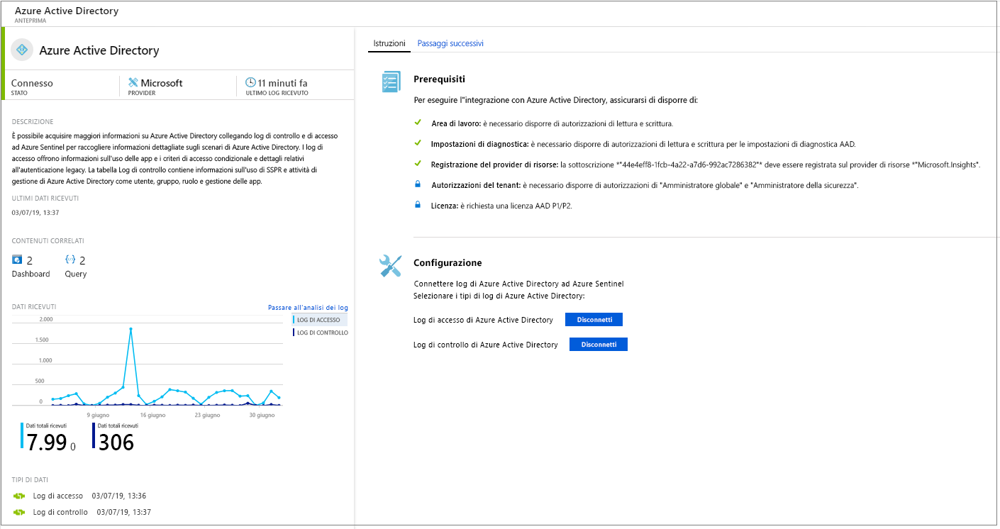
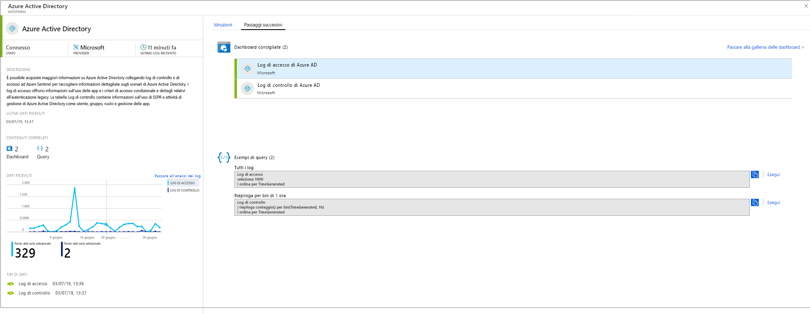

# Connettere le origini dati

Per eseguire l'onboarding di Azure Sentinel, è necessario innanzitutto connettersi alle origini dati. Azure Sentinel include numerosi connettori predefiniti per l'integrazione in tempo reale con le soluzioni Microsoft, comprese le soluzioni Microsoft Threat Protection e origini Microsoft 365, tra cui Office 365, Azure AD, Azure ATP, Microsoft Cloud App Security e altre ancora. Inoltre, sono presenti connettori predefiniti a soluzioni non Microsoft, per l'ecosistema di sicurezza allargato. Per connettere le origini dati con Azure Sentinel è anche possibile usare Common Event Format, Syslog o API REST.  

1. Nel menu selezionare **Data connectors** (Connettori dati). Questa pagina consente di visualizzare l'elenco completo dei connettori forniti da Azure Sentinel e il relativo stato. Selezionare il connettore che si vuole connettere e scegliere **Open connector page** (Apri la pagina del connettore). 

   

1. Nella pagina del connettore specifico assicurarsi di aver soddisfatto tutti i prerequisiti e seguire le istruzioni per connettere i dati ad Azure Sentinel. L'avvio della sincronizzazione dei log con Azure Sentinel potrebbe richiedere tempo. Dopo la connessione viene visualizzato un riepilogo dei dati nel grafico **Data received** (Dati ricevuti), oltre allo stato di connettività dei tipi di dati.

   
  
1. Fare clic sulla scheda **Next steps** (Passaggi successivi) per ottenere un elenco del contenuto predefinito fornito da Azure Sentinel per il tipo di dati specifico.

   
 

## Metodi di connessione dati

Azure Sentinel supporta i metodi di connessione dati seguenti:

- **Servizi Microsoft**:  I servizi Microsoft sono connessi in modo nativo. Sfruttando la struttura di Azure per l'integrazione immediata, è possibile connettere le soluzioni seguenti in pochi clic:
    - [Office 365](connect-office-365.md)
    - [Log di controllo e di accesso di Azure AD](connect-azure-active-directory.md)
    - [Attività di Azure](connect-azure-activity.md)
    - [Azure AD Identity Protection](connect-azure-ad-Identity-protection.md)
    - [Centro sicurezza di Azure](connect-azure-security-center.md)
    - [Azure Information Protection](connect-azure-information-protection.md)
    - [Azure Advanced Threat Protection](connect-azure-atp.md)
    - [Cloud App Security](connect-cloud-app-security.md)
    - [Eventi di sicurezza di Windows](connect-windows-security-events.md) 
    - [Windows Firewall](connect-windows-firewall.md)

- **Soluzioni esterne tramite API**: alcune origini dati vengono connesse tramite le API fornite dall'origine dati connessa. In genere, la maggior parte delle tecnologie di sicurezza fornisce un set di API tramite cui è possibile recuperare i registri eventi. Le API si connettono ad Azure Sentinel e raccolgono tipi di dati specifici da inviare ad Azure Log Analytics. Le appliance connesse tramite API includono:
    - [Barracuda](connect-barracuda.md)
    - [Symantec](connect-symantec.md)
- **Soluzioni esterne tramite agente**: Azure Sentinel può essere connesso a tutte le altre origini dati in grado di eseguire lo streaming dei log in tempo reale usando il protocollo Syslog, tramite un agente.  La maggior parte delle appliance usa il protocollo Syslog per inviare messaggi di evento che includono il log stesso e dati sul log. Il formato dei log varia, ma la maggior parte delle appliance supporta lo standard CEF (Common Event Format).  L'agente di Azure Sentinel, che si basa sull'agente di Log Analytics, converte i log CEF in un formato che può essere inserito in Log Analytics. A seconda del tipo di appliance, l'agente è installato direttamente nell'appliance oppure in un server Linux dedicato. L'agente per Linux riceve gli eventi dal daemon Syslog tramite UDP, ma se è previsto che un computer Linux raccolga un numero elevato di eventi Syslog, questi vengono inviati tramite TCP dal daemon Syslog all'agente e quindi dall'agente a Log Analytics.
    - Firewall, proxy ed endpoint:
        - [F5](connect-f5.md)
        - [Check Point](connect-checkpoint.md)
        - [Cisco ASA](connect-cisco.md)
        - [Fortinet](connect-fortinet.md)
        - [Palo Alto](connect-paloalto.md)
        - [Altre appliance CEF](connect-common-event-format.md)
        - [Altre appliance Syslog](connect-syslog.md)
    - Soluzioni DLP
    - [Provider di intelligence sulle minacce](connect-threat-intelligence.md)
    - [Computer DNS](connect-dns.md) -agente installato direttamente nel computer DNS
    - Server Linux
    - Altri cloud
    
## Opzioni di connessione tramite agente

Per connettere l'appliance esterna ad Azure Sentinel, l'agente deve essere distribuito in un computer dedicato (macchina virtuale o locale) per supportare la comunicazione tra l'appliance e Azure Sentinel. È possibile distribuire l'agente manualmente o automaticamente. La distribuzione automatica è disponibile solo se il computer dedicato è una nuova macchina virtuale che si sta creando in Azure. 

In alternativa, è possibile distribuire l'agente manualmente in una macchina virtuale di Azure esistente, in una macchina virtuale in un altro cloud o in un computer locale.

## Mappare i tipi di dati alle opzioni di connessione di Azure Sentinel

| **Tipo di dati** | **Modalità di connessione** | **Connettore dati?** | **Commenti** |
|------|---------|-------------|------|
| AWSCloudTrail | [Connettere AWS](connect-aws.md) | V | |
| AzureActivity | [Connettere il log attività di Azure](connect-azure-activity.md) e [Panoramica del log attività di Azure](../azure-monitor/platform/activity-logs-overview.md)| V | |
| AuditLogs | [Connettere Azure AD](connect-azure-active-directory.md)  | V | |
| SigninLogs | [Connettere Azure AD](connect-azure-active-directory.md)  | V | |
| AzureFirewall |[Diagnostica di Azure](../firewall/tutorial-diagnostics.md) | V | |
| InformationProtectionLogs_CL  | [Report di Azure Information Protection](https://docs.microsoft.com/azure/information-protection/reports-aip) [Connettere Azure Information Protection](connect-azure-information-protection.md)  | V | Oltre al tipo di dati, in genere si usa la funzione **InformationProtectionEvents**. Per altre informazioni, vedere [Come modificare i report e creare query personalizzate](https://docs.microsoft.com/azure/information-protection/reports-aip#how-to-modify-the-reports-and-create-custom-queries)|
| AzureNetworkAnalytics_CL  | [Schema di analisi del traffico](../network-watcher/traffic-analytics.md) [Analisi del traffico](../network-watcher/traffic-analytics.md)  | | |
| CommonSecurityLog  | [Connettere CEF](connect-common-event-format.md)  | V | |
| OfficeActivity | [Connettere Office 365](connect-office-365.md) | V | |
| SecurityEvents | [Connettere gli eventi di sicurezza di Windows](connect-windows-security-events.md)  | V | Per le cartelle di lavoro dei protocolli non sicuri, vedere la pagina relativa alla [configurazione di cartelle di lavoro di protocolli non sicuri](https://blogs.technet.microsoft.com/jonsh/azure-sentinel-insecure-protocols-dashboard-setup/).  |
| syslog | [Connettere Syslog](connect-syslog.md) | V | |
| Microsoft Web Application Firewall (WAF) - (AzureDiagnostics) |[Connettere Microsoft web application firewall](connect-microsoft-waf.md) | V | |
| SymantecICDx_CL | [Connettere Symantec](connect-symantec.md) | V | |
| ThreatIntelligenceIndicator  | [Connettere Intelligence sulle minacce](connect-threat-intelligence.md)  | V | |
| VMConnection   ServiceMapComputer_CL  ServiceMapProcess_CL|  [Elenco dei servizi di Monitoraggio di Azure](../azure-monitor/insights/service-map.md) [Onboarding di Informazioni dettagliate macchina virtuale di Monitoraggio di Azure](../azure-monitor/insights/vminsights-onboard.md)   [Abilitare Informazioni dettagliate macchina virtuale di Monitoraggio di Azure](../azure-monitor/insights/vminsights-enable-overview.md)   [Uso dell'onboarding di singole macchine virtuali](../azure-monitor/insights/vminsights-enable-single-vm.md)   [Uso dell'onboarding tramite criteri](../azure-monitor/insights/vminsights-enable-at-scale-policy.md)| X | Cartella di lavoro di Informazioni dettagliate macchina virtuale  |
| DnsEvents | [Connettere DNS](connect-dns.md) | V | |
| W3CIISLog | [Connettere i log di IIS](../azure-monitor/platform/data-sources-iis-logs.md)  | X | |
| WireData | [Connettere Dati in transito](../azure-monitor/insights/wire-data.md) | X | |
| WindowsFirewall | [Connettere Windows Firewall](connect-windows-firewall.md) | V | |
| SecurityAlert per Azure AD Identity Protection  | [Connettere Azure AD Identity Protection](connect-azure-ad-identity-protection.md)  | V | |
| SecurityAlert per Azure ATP  | [Connettere Azure ATP](connect-azure-atp.md) | V | |
| SecurityAlert per Centro sicurezza di Azure  | [Connettere il Centro sicurezza di Azure](connect-azure-security-center.md)  | V | |
| SecurityAlert per Microsoft Cloud App Security  | [Connettere Microsoft Cloud App Security](connect-cloud-app-security.md)  | V | |
| SecurityAlert | | | |
| Sysmon (evento) | [Connettere Sysmon](https://azure.microsoft.com/blog/detecting-in-memory-attacks-with-sysmon-and-azure-security-center)  [Connettere Eventi Windows](../azure-monitor/platform/data-sources-windows-events.md)   [Ottenere il parser Sysmon](https://github.com/Azure/Azure-Sentinel/blob/master/Parsers/SysmonParser.txt)| X | La raccolta Sysmon non è installata per impostazione predefinita nelle macchine virtuali. Per altre informazioni su come installare l'agente Sysmon, vedere [Sysmon](https://docs.microsoft.com/sysinternals/downloads/sysmon). |
| ConfigurationData  | [Automatizzare l'inventario delle macchine virtuali](../automation/automation-vm-inventory.md)| X | |
| ConfigurationChange  | [Automatizzare il rilevamento delle macchine virtuali](../automation/change-tracking.md) | X | |
| BIG-IP F5 | [Connettere BIG-IP F5](https://devcentral.f5.com/s/articles/Integrating-the-F5-BIGIP-with-Azure-Sentinel.md)  | X | |
| McasShadowItReporting  |  | X | |
| Barracuda_CL | [Connettere Barracuda](connect-barracuda.md) | V | |

## Passaggi successivi

- Per iniziare a usare Azure Sentinel, è necessario avere una sottoscrizione di Microsoft Azure. Se non si ha una sottoscrizione, è possibile iscriversi per una [versione di valutazione gratuita](https://azure.microsoft.com/free/).
- Informazioni su come [caricare i dati in Azure Sentinel](quickstart-onboard.md) e [ottenere visibilità sui dati e sulle potenziali minacce](quickstart-get-visibility.md).
