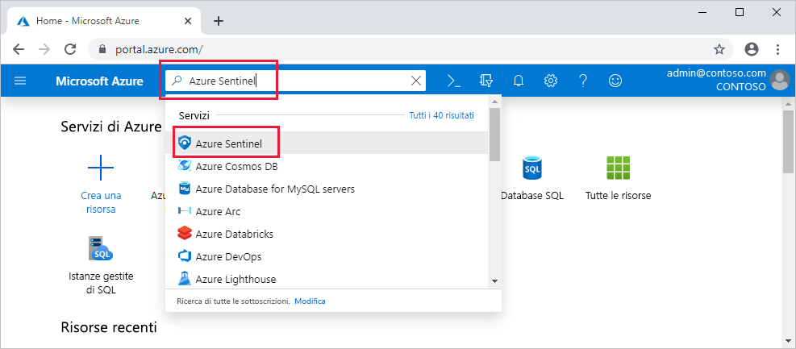

# Sentinella di Azure a bordo

In questa Guida introduttiva si apprenderà come caricare Azure Sentinel. 

Per la sentinella di Azure, è prima di tutto necessario abilitare Azure Sentinel e quindi connettere le origini dati. Azure Sentinel è dotato di un numero di connettori per le soluzioni Microsoft, disponibile in modalità predefinita e fornisce integrazione in tempo reale, incluse soluzioni di protezione dalle minacce Microsoft, Microsoft 365 origini, tra cui Office 365, Azure AD, Azure ATP e Microsoft Cloud App Security e altro ancora. Inoltre, sono presenti connettori predefiniti a soluzioni non Microsoft, per l'ecosistema di sicurezza allargato. È anche possibile usare il formato di evento comune, syslog o REST-API per connettere le origini dati a Sentinel di Azure.  

Dopo aver connesso le origini dati, è possibile scegliere da una raccolta di cartelle di lavoro create in maniera specialistica che emergono informazioni dettagliate in base ai dati. Queste cartelle di lavoro possono essere facilmente personalizzate in base alle esigenze.

## Prerequisiti globali

- Una sottoscrizione di Azure attiva, se non è già disponibile, creare un [account gratuito](https://azure.microsoft.com/free/?WT.mc_id=A261C142F) prima di iniziare.

- Area di lavoro Log Analytics. Informazioni su come [creare un'area di lavoro log Analytics](../log-analytics/log-analytics-quick-create-workspace.md)

-  Per abilitare Sentinel di Azure, sono necessarie le autorizzazioni di collaboratore per la sottoscrizione in cui risiede l'area di lavoro di Azure Sentinel. 
- Per usare Sentinel di Azure, è necessario disporre delle autorizzazioni Collaboratore o lettore per il gruppo di risorse a cui appartiene l'area di lavoro.
- Potrebbero essere necessarie autorizzazioni aggiuntive per connettere origini dati specifiche.
- Azure Sentinel è un servizio a pagamento. Per informazioni sui prezzi, vedere informazioni [su Sentinel di Azure](https://go.microsoft.com/fwlink/?linkid=2104058).
 
## Abilitare Sentinel di Azure

1. Passare alla portale di Azure.
2. Assicurarsi che la sottoscrizione in cui è stato creato Azure Sentinel sia selezionata. 
3. Cercare Azure Sentinel. 
   

1. Fare clic su **+Aggiungi**.
1. Selezionare l'area di lavoro che si vuole usare o crearne una nuova. È possibile eseguire Azure Sentinel in più di un'area di lavoro, ma i dati sono isolati in una singola area di lavoro.

   

   >[!NOTE] 
   > - Le aree di lavoro predefinite create dal centro sicurezza di Azure non verranno visualizzate nell'elenco; non è possibile installare Sentinel di Azure su di essi.
   > - Azure Sentinel può essere eseguito su aree di lavoro in qualsiasi [area GA di log Analytics](https://azure.microsoft.com/global-infrastructure/services/?products=monitor) ad eccezione della Cina, della Germania e delle aree di Azure per enti pubblici. I dati generati da Azure Sentinel, ad esempio eventi imprevisti, segnalibri e regole di avviso, che possono contenere dati del cliente originati da queste aree di lavoro, vengono salvati in Europa occidentale (per aree di lavoro situate in Europa) o Stati Uniti orientali (per tutte le aree di lavoro basate sugli Stati Uniti) e qualsiasi altra area ad eccezione dell'Europa.

6. Fare clic su **Aggiungi Sentinel di Azure**.
  

## Connettere le origini dati

Azure Sentinel crea la connessione ai servizi e alle app connettendosi al servizio e inviando gli eventi e i log ad Azure Sentinel. Per i computer e le macchine virtuali, è possibile installare l'agente Sentinel di Azure che raccoglie i log e li trasmette ad Azure Sentinel. Per i firewall e i proxy, Azure Sentinel usa un server syslog Linux. L'agente è installato e da cui l'agente raccoglie i file di log e li trasmette ad Azure Sentinel. 
 
1. Fare clic su **raccolta dati**.
2. È disponibile un riquadro per ogni origine dati che è possibile connettere. 
Ad esempio, fare clic su **Azure Active Directory**. Se si connette questa origine dati, è possibile trasmettere tutti i log da Azure AD in Sentinel di Azure. È possibile selezionare il tipo di log da ottenere per i log di accesso e/o i log di controllo.  
In fondo, Azure Sentinel fornisce consigli per le cartelle di lavoro da installare per ogni connettore, in modo da poter ottenere immediatamente informazioni interessanti sui dati.   Per ulteriori informazioni, seguire le istruzioni di installazione o [fare riferimento alla guida alla connessione pertinente](connect-data-sources.md) . Per informazioni sui connettori dati, vedere [connettere i servizi Microsoft](connect-data-sources.md).

Una volta connesse le origini dati, i dati avviano lo streaming in Sentinel di Azure ed è possibile iniziare a usare. È possibile visualizzare i log nei [dashboard predefiniti](quickstart-get-visibility.md) e iniziare a creare query in log Analytics per [analizzare i dati](tutorial-investigate-cases.md).

## Passaggi successivi
In questo documento si è appreso come connettere le origini dati ad Azure Sentinel. Per altre informazioni su Azure Sentinel, vedere gli articoli seguenti:
- Scopri come [ottenere visibilità sui dati e potenziali minacce](quickstart-get-visibility.md).
- Iniziare a [rilevare le minacce con Azure Sentinel](tutorial-detect-threats-built-in.md).
- Trasmettere i dati dalle [Appliance comuni in formato errore](connect-common-event-format.md) in Sentinel di Azure.
