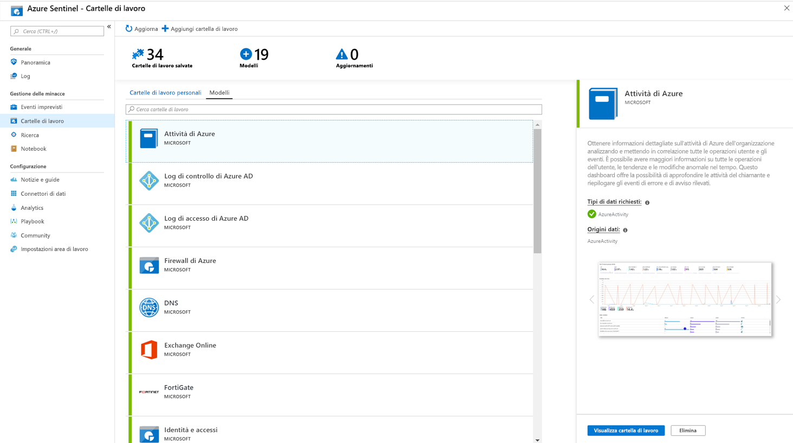

# Esercitazione: Monitora le tue

Dopo aver [connesso le origini](quickstart-onboard.md) dati ad Azure Sentinel, è possibile monitorare i dati tramite l'integrazione di Azure Sentinel con le cartelle di lavoro di monitoraggio di Azure, che offre versatilità nella creazione di dashboard personalizzati. Mentre le cartelle di lavoro vengono visualizzate in modo diverso in Sentinel di Azure, può essere utile vedere come [creare report interattivi con le cartelle di lavoro di monitoraggio di Azure](../azure-monitor/app/usage-workbooks.md). Azure Sentinel consente di creare cartelle di lavoro personalizzate tra i dati e offre anche modelli di cartella di lavoro predefiniti che consentono di ottenere rapidamente informazioni dettagliate sui dati non appena si connette un'origine dati.

Questa esercitazione consente di monitorare i dati in Sentinel di Azure.
> [!div class="checklist"]
> * Usare cartelle di lavoro predefinite
> * Crea nuove cartelle di lavoro

## Prerequisiti

- Per il gruppo di risorse dell'area di lavoro di Azure Sentinel è necessario disporre almeno delle autorizzazioni di collaboratore Reader o cartella di lavoro.

> [!NOTE]
> Le cartelle di lavoro che è possibile visualizzare in Sentinel di Azure vengono salvate nel gruppo di risorse dell'area di lavoro di Azure Sentinel e sono contrassegnate dall'area di lavoro in cui sono state create.

## Usare cartelle di lavoro predefinite

1. Passare a **cartelle di lavoro** e quindi selezionare **modelli** per visualizzare l'elenco completo delle cartelle di lavoro predefinite di Sentinel di Azure. Per visualizzare le informazioni rilevanti per i tipi di dati connessi, il campo **tipi di dati richiesti** in ogni cartella di lavoro elenca il tipo di dati accanto a un segno di spunta verde se si esegue già lo streaming dei dati rilevanti in Sentinel di Azure.
  
1. Fare clic su **Visualizza cartella di lavoro** per visualizzare il modello popolato con i dati.
  
1. Per modificare la cartella di lavoro, selezionare **Save (Salva**) e quindi selezionare il percorso in cui si vuole salvare il file JSON per il modello. 

   > [!NOTE]
   > In questo modo si crea una risorsa di Azure basata sul modello pertinente e si salva il file JSON del modello e non i dati.

1. Selezionare **Visualizza cartella di lavoro**. Quindi, fare clic sul pulsante **Edit (modifica** ) nella parte superiore. È ora possibile modificare la cartella di lavoro e personalizzarla in base alle esigenze. Per altre informazioni su come personalizzare la cartella di lavoro, vedere come [creare report interattivi con le cartelle di lavoro di monitoraggio di Azure](../azure-monitor/app/usage-workbooks.md).

1. Dopo avere apportato le modifiche, è possibile salvare la cartella di lavoro. 

1. È anche possibile clonare la cartella di lavoro: Selezionare **modifica** e quindi **Salva**con nome, assicurandosi di salvarlo con un altro nome, nella stessa sottoscrizione e nel gruppo di risorse. Queste cartelle di lavoro vengono visualizzate nella scheda **cartelle di lavoro** .

## Crea nuova cartella di lavoro

1. Passare a **cartelle di lavoro** e quindi selezionare **Aggiungi cartella** di lavoro per creare una nuova cartella di lavoro da zero.
  

1. Per modificare la cartella di lavoro, selezionare **modifica**, quindi aggiungere testo, query e parametri, se necessario. Per altre informazioni su come personalizzare la cartella di lavoro, vedere come [creare report interattivi con le cartelle di lavoro di monitoraggio di Azure](../azure-monitor/app/usage-workbooks.md). 

1. Quando si compila una query, impostare l' **origine dati** su **log**, il **tipo di risorsa** è impostato su **log Analytics** , quindi scegliere le aree di lavoro pertinenti. 

1. Dopo aver creato la cartella di lavoro, salvare la cartella di lavoro assicurandosi di salvarla nella sottoscrizione e nel gruppo di risorse dell'area di lavoro di Azure Sentinel.

1. Se si vuole consentire ad altri utenti dell'organizzazione di usare la cartella di lavoro, in **Salva per** selezionare i **report condivisi**. Se si desidera che la cartella di lavoro sia disponibile solo per l'utente, selezionare **report personali**.

1. Per passare da una cartella di lavoro all'altra nell'area di lavoro, è possibile](./media/tutorial-monitor-data/switch.png)selezionare **Apri** 

## Come eliminare cartelle di lavoro

È possibile eliminare le cartelle di lavoro create da un modello di Sentinel di Azure. 

Per eliminare una cartella di lavoro personalizzata:
1.  Selezionare **Visualizza cartella di lavoro**.
2.  Selezionare **Apri** nella parte superiore.
3.  Nella tabella che elenca le cartelle di lavoro, nella riga per la cartella di lavoro che si desidera eliminare, selezionare i tre puntini alla fine della riga... per aprire il menu, quindi selezionare **Elimina**. La cartella di lavoro salvata verrà rimossa.

> [!NOTE]
> In questo modo viene rimossa la risorsa e tutte le modifiche apportate al modello. Il modello originale rimarrà disponibile.

## Passaggi successivi

In questa esercitazione si è appreso come visualizzare i dati in Sentinel di Azure.

Per informazioni su come automatizzare le risposte alle minacce, vedere [configurare le risposte automatiche alle minacce in Sentinel di Azure](tutorial-respond-threats-playbook.md).
