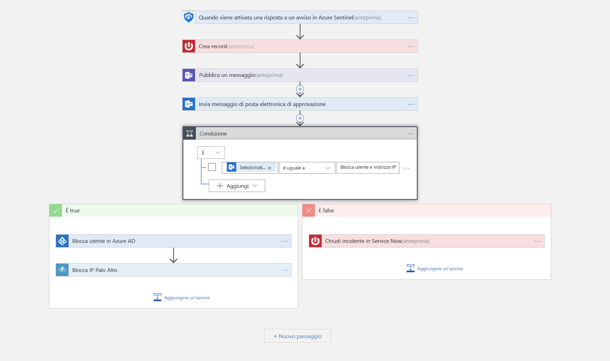

# Esercitazione: Configurare le risposte automatiche alle minacce nell'anteprima di Azure Sentinel

> [!IMPORTANT]
> Azure Sentinel è attualmente in anteprima pubblica.
> Questa versione di anteprima viene messa a disposizione senza contratto di servizio e non è consigliata per i carichi di lavoro di produzione. Alcune funzionalità potrebbero non essere supportate o potrebbero presentare funzionalità limitate. Per altre informazioni, vedere [Condizioni supplementari per l'utilizzo delle anteprime di Microsoft Azure](https://azure.microsoft.com/support/legal/preview-supplemental-terms/).

Questa esercitazione illustra come usare i playbook di sicurezza in Azure Sentinel per impostare risposte automatiche ai problemi relativi alla sicurezza rilevati da Azure Sentinel.

> [!div class="checklist"]
> * Informazioni sui playbook
> * Creare un playbook
> * Eseguire un playbook
> * Automatizzare le risposte alle minacce

## Definizione di playbook di sicurezza in Azure Sentinel

Un playbook di sicurezza è una raccolta di procedure che possono essere eseguite da Azure Sentinel in risposta a un avviso. Un playbook di sicurezza può contribuire ad automatizzare e orchestrare la risposta e può essere eseguito manualmente o impostato per l'esecuzione automatica quando vengono attivati avvisi specifici. I playbook di sicurezza in Azure Sentinel si basano su [App per la logica di Azure](https://docs.microsoft.com/azure/logic-apps/logic-apps-what-are-logic-apps), il che significa che sarà possibile sfruttare tutta la potenza, la personalizzazione e i modelli integrati di App per la logica. Ogni playbook viene creato per la specifica sottoscrizione scelta, ma quando si osserva la pagina dei playbook verranno visualizzati tutti i playbook delle sottoscrizioni selezionate.

> [!NOTE]
> I playbook sfruttano le funzionalità di App per la logica di Azure, quindi sono previsti addebiti. Per altre informazioni, vedere la pagina dei prezzi per [App per la logica di Azure](https://azure.microsoft.com/pricing/details/logic-apps/).

Se ad esempio si teme che utenti malintenzionati accedano alle risorse di rete, è possibile impostare un avviso che cerca indirizzi IP dannosi che accedono alla rete. È quindi possibile creare un playbook che esegue queste operazioni:
1. Quando viene attivato l'avviso, aprire un ticket in ServiceNow o in qualsiasi altro sistema di creazione di ticket IT.
2. Inviare un messaggio al canale delle operazioni di sicurezza in Microsoft Teams o Slack per assicurarsi che i propri analisti della sicurezza siano a conoscenza dell'evento imprevisto.
3. Inviare tutte le informazioni nell'avviso all'amministratore di rete senior e all'amministratore della sicurezza. Il messaggio di posta elettronica include anche due pulsanti di opzione **Blocca** o **Ignora**.
4. Il playbook continua a funzionare dopo la ricezione di una risposta dagli amministratori.
5. Se gli amministratori scelgono **Blocca**, l'indirizzo IP viene bloccato nel firewall e l'utente è disabilitato in Azure AD.
6. Se gli amministratori scelgono **Ignora**, l'avviso viene chiuso in Azure Sentinel e l'evento imprevisto viene chiuso in ServiceNow.

I playbook di sicurezza possono essere eseguiti manualmente o automaticamente. Se vengono eseguiti manualmente, quando si riceve un avviso è possibile scegliere di eseguire un playbook su richiesta come risposta all'avviso selezionato. Se vengono eseguiti automaticamente, la regola di correlazione creata viene impostata per l'esecuzione automatica di uno o più playbook quando viene attivato l'avviso.

## Creare un playbook di sicurezza

Seguire questa procedura per creare un nuovo playbook di sicurezza in Azure Sentinel:

1. Aprire il dashboard di **Azure Sentinel**.
2. In **Gestione** selezionare **Playbook**.

   

3. Nella pagina**Azure Sentinel - Playbook (anteprima)** fare clic sul pulsante **Aggiungi**.

    

4. Nella pagina **Crea app per la logica** digitare le informazioni richieste per creare la nuova app per la logica e fare clic su **Crea**. 

5. In [**Progettazione app per la logica**](../logic-apps/logic-apps-overview.md) selezionare il modello che si vuole usare. Se si seleziona un modello che richiede credenziali, sarà necessario fornirle. In alternativa è possibile creare un nuovo playbook vuoto da zero. Selezionare **App per la logica vuota**. 

   

6. Verrà visualizzata la pagina Progettazione app per la logica in cui è possibile creare un nuovo modello oppure modificarne uno esistente. Vedere altre informazioni sulla creazione di un playbook con [App per la logica](../logic-apps/logic-apps-create-logic-apps-from-templates.md).

7. Se si sta creando un playbook vuoto, nel campo **Cerca tutti i connettori e i trigger** digitare *Azure Sentinel* e selezionare **When a response to an Azure Sentinel alert is triggered** (Quando viene attivata una risposta a un avviso di Azure Sentinel).  Dopo averlo creato, il nuovo playbook viene visualizzato nell'elenco **Playbook**. Se non viene visualizzato, fare clic su **Aggiorna**. 

7. È ora possibile definire cosa accade quando si attiva il playbook. È possibile aggiungere un'azione, una condizione logica, condizioni switch case o cicli.

   

## Come eseguire un playbook di sicurezza

È possibile eseguire un playbook su richiesta.

Per eseguire un playbook su richiesta:

1. Nella pagina **incidents** (eventi imprevisti) selezionare un evento imprevisto e fare clic su **View full details** (Visualizza i dettagli completi).

2. Nella scheda**Alerts** (Avvisi) fare clic sull'avviso sul quale eseguire il playbook, scorrere verso destra e fare clic su **View playbooks** (Visualizza i playbook). Selezionare quindi un playbook da **eseguire** dall'elenco di playbook disponibili nella sottoscrizione. 

## Automatizzare le risposte alle minacce

I team SIEM/SOC possono essere inondati periodicamente da avvisi di sicurezza. Il numero degli avvisi generati è talmente elevato che gli amministratori della sicurezza disponibili sono sovraccaricati. La conseguenza è che troppo spesso molti avvisi non possono essere analizzati, lasciando l'organizzazione vulnerabile ad attacchi che non vengono rilevati. 

Molti di questi avvisi, se non la maggior parte, seguono modelli ricorrenti che possono essere risolti con azioni correttive specifiche e definite. Azure Sentinel consente già di definire le misure correttive nei playbook. È anche possibile impostare l'automazione in tempo reale come parte della definizione dei playbook, consentendo di automatizzare completamente una risposta definita a determinati avvisi di sicurezza. Usando l'automazione in tempo reale, i team di sicurezza possono ridurre sensibilmente il loro carico di lavoro automatizzando completamente le risposte di routine ai tipi di avviso ricorrenti, con la possibilità di concentrarsi maggiormente su avvisi univoci, analisi dei modelli, ricerca di minacce e altro ancora.

Per automatizzare le risposte:

1. Selezionare l'avviso per cui si vuole automatizzare la risposta.
1. Nella pagina **Modifica la regola di avviso**, in **Playbook attivati** della sezione **Automazione in tempo reale**, scegliere il playbook che si vuole eseguire quando viene trovata una corrispondenza con la regola di avviso.
1. Selezionare **Salva**.

   

## Passaggi successivi

In questa esercitazione si è appreso come eseguire un playbook in Azure Sentinel. Vedere ora [come cercare le minacce in modo proattivo](hunting.md) usando Azure Sentinel.

