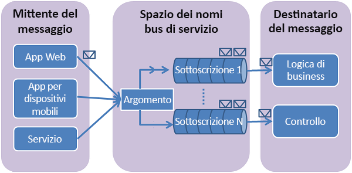

# <a name="how-to-use-service-bus-topics-and-subscriptions"></a>Come usare gli argomenti e le sottoscrizioni del bus di servizio
[!INCLUDE [service-bus-selector-topics](../../includes/service-bus-selector-topics.md)]

Questa guida descrive come usare gli argomenti e le sottoscrizioni del bus di servizio. Gli esempi sono scritti in Java e usano [Azure SDK per Java][Azure SDK for Java]. Gli scenari presentati includono **la creazione di argomenti e sottoscrizioni**, **la creazione di filtri per le sottoscrizioni**, **l’invio di messaggi a un argomento**, **la ricezione di messaggi da una sottoscrizione** e **l’eliminazione di argomenti e sottoscrizioni**.

## <a name="what-are-service-bus-topics-and-subscriptions"></a>Cosa sono gli argomenti e le sottoscrizioni del bus di servizio?
Gli argomenti e le sottoscrizioni del bus di servizio supportano un modello di comunicazione con messaggistica di *pubblicazione-sottoscrizione* . Quando si usano gli argomenti e le sottoscrizioni, i componenti di un'applicazione distribuita non comunicano direttamente l'uno con l'altro, ma scambiano messaggi tramite un argomento, che agisce da intermediario.



Diversamente dalle code del bus di servizio, in cui ogni messaggio viene elaborato da un unico consumer, gli argomenti e le sottoscrizioni offrono una forma di comunicazione "uno a molti" tramite un modello di pubblicazione-sottoscrizione. È possibile registrare più sottoscrizioni a un argomento. Quando un messaggio viene inviato a un argomento, viene reso disponibile affinché ogni sottoscrizione possa gestirlo o elaborarlo in modo indipendente.

La sottoscrizione a un argomento è simile a una coda virtuale che riceve copie dei messaggi che sono stati inviati all'argomento. È possibile registrare regole di filtro per un argomento in base alla sottoscrizione in modo da poter filtrare/limitare i messaggi a un argomento ricevuti dalle diverse sottoscrizioni degli argomenti.

Gli argomenti e le sottoscrizioni del bus di servizio garantiscono scalabilità, consentendo di elaborare grandi quantità di messaggi tra un numero elevato di utenti e applicazioni.

## <a name="create-a-service-namespace"></a>Creare uno spazio dei nomi del servizio
Per iniziare a usare gli argomenti e le sottoscrizioni del bus di servizio in Azure, è innanzitutto necessario creare uno spazio dei nomi che fornisca un contenitore di ambito per fare riferimento alle risorse del bus di servizio all'interno dell'applicazione.

Per creare uno spazio dei nomi:

[!INCLUDE [service-bus-create-namespace-portal](../../includes/service-bus-create-namespace-portal.md)]

## <a name="configure-your-application-to-use-service-bus"></a>Configurare l'applicazione per l'uso del bus di servizio
Assicurarsi di aver installato [Azure SDK per Java][Azure SDK for Java] prima di compilare questo esempio. Se si usa Eclipse, è possibile installare [Azure Toolkit for Eclipse][Azure Toolkit for Eclipse] che include Azure SDK per Java. È quindi possibile aggiungere le **librerie di Microsoft Azure per Java** al progetto:


Aggiungere le seguenti istruzioni `import` all'inizio del file Java:

```java
import com.microsoft.windowsazure.services.servicebus.*;
import com.microsoft.windowsazure.services.servicebus.models.*;
import com.microsoft.windowsazure.core.*;
import javax.xml.datatype.*;
```

Aggiungere le librerie di Azure per Java al percorso di compilazione e includerlo nell'assembly di distribuzione del progetto.

## <a name="create-a-topic"></a>Creare un argomento
Per eseguire operazioni di gestione per gli argomenti del bus di servizio, è possibile usare la classe **ServiceBusContract**. Un oggetto **ServiceBusContract** è costruito con una configurazione appropriata che incapsula il token di firma di accesso condiviso con le autorizzazioni necessarie a gestirlo. La classe **ServiceBusContract** rappresenta l'unico punto di comunicazione con Azure.

La classe **ServiceBusService** definisce i metodi per creare, enumerare ed eliminare gli argomenti. L'esempio seguente illustra come usare un oggetto **ServiceBusService** per creare un argomento con il nome `TestTopic` e uno spazio dei nomi denominato `HowToSample`:

```java
Configuration config =
    ServiceBusConfiguration.configureWithSASAuthentication(
      "HowToSample",
      "RootManageSharedAccessKey",
      "SAS_key_value",
      ".servicebus.windows.net"
      );

ServiceBusContract service = ServiceBusService.create(config);
TopicInfo topicInfo = new TopicInfo("TestTopic");
try  
{
    CreateTopicResult result = service.createTopic(topicInfo);
}
catch (ServiceException e) {
    System.out.print("ServiceException encountered: ");
    System.out.println(e.getMessage());
    System.exit(-1);
}
```

In **TopicInfo** sono disponibili metodi che consentono di impostare le proprietà dell'argomento, ad esempio il valore TTL predefinito da applicare ai messaggi inviati all'argomento. L'esempio seguente illustra come creare un argomento denominato `TestTopic` con una dimensione massima pari a 5 GB:

```java
long maxSizeInMegabytes = 5120;  
TopicInfo topicInfo = new TopicInfo("TestTopic");  
topicInfo.setMaxSizeInMegabytes(maxSizeInMegabytes);
CreateTopicResult result = service.createTopic(topicInfo);
```

Si noti che è possibile usare il metodo **listTopics** su oggetti **ServiceBusContract** per verificare se in uno spazio dei nomi servizio esiste già un argomento con il nome specificato.

## <a name="create-subscriptions"></a>Creare sottoscrizioni
È possibile creare le sottoscrizioni a un argomento anche tramite la classe **ServiceBusService**. Le sottoscrizioni sono denominate e possono includere un filtro facoltativo che limita l'insieme dei messaggi passati alla coda virtuale della sottoscrizione.

### <a name="create-a-subscription-with-the-default-matchall-filter"></a>Creare una sottoscrizione con il filtro (MatchAll) predefinito
Il filtro **MatchAll** è il filtro predefinito e viene usato se non vengono specificati altri filtri durante la creazione di una nuova sottoscrizione. Quando si usa il filtro **MatchAll**, tutti i messaggi pubblicati nell'argomento vengono inseriti nella coda virtuale della sottoscrizione. Nell'esempio seguente viene creata una sottoscrizione denominata "AllMessages" e viene usato il filtro **MatchAll** predefinito.

```java
SubscriptionInfo subInfo = new SubscriptionInfo("AllMessages");
CreateSubscriptionResult result =
    service.createSubscription("TestTopic", subInfo);
```

### <a name="create-subscriptions-with-filters"></a>Creare sottoscrizioni con i filtri
È anche possibile creare filtri che consentono di specificare i messaggi inviati a un argomento da visualizzare in una specifica sottoscrizione dell'argomento.

Il tipo di filtro più flessibile tra quelli supportati dalle sottoscrizioni è [SqlFilter][SqlFilter], che implementa un subset di SQL92. I filtri SQL agiscono sulle proprietà dei messaggi pubblicati nell'argomento. Per altri dettagli sulle espressioni che è possibile usare con un filtro SQL, esaminare la sintassi di [SqlFilter.SqlExpression][SqlFilter.SqlExpression].

L'esempio seguente crea una sottoscrizione denominata `HighMessages` con un oggetto [SqlFilter][SqlFilter] che seleziona solo i messaggi che hanno una proprietà **MessageNumber** personalizzata maggiore di 3:

```java
// Create a "HighMessages" filtered subscription  
SubscriptionInfo subInfo = new SubscriptionInfo("HighMessages");
CreateSubscriptionResult result = service.createSubscription("TestTopic", subInfo);
RuleInfo ruleInfo = new RuleInfo("myRuleGT3");
ruleInfo = ruleInfo.withSqlExpressionFilter("MessageNumber > 3");
CreateRuleResult ruleResult = service.createRule("TestTopic", "HighMessages", ruleInfo);
// Delete the default rule, otherwise the new rule won't be invoked.
service.deleteRule("TestTopic", "HighMessages", "$Default");
```

Analogamente, l'esempio seguente crea una sottoscrizione denominata `LowMessages` con un oggetto [SqlFilter][SqlFilter] che seleziona solo i messaggi in cui il valore della proprietà **MessageNumber** è minore o uguale a 3:

```java
// Create a "LowMessages" filtered subscription
SubscriptionInfo subInfo = new SubscriptionInfo("LowMessages");
CreateSubscriptionResult result = service.createSubscription("TestTopic", subInfo);
RuleInfo ruleInfo = new RuleInfo("myRuleLE3");
ruleInfo = ruleInfo.withSqlExpressionFilter("MessageNumber <= 3");
CreateRuleResult ruleResult = service.createRule("TestTopic", "LowMessages", ruleInfo);
// Delete the default rule, otherwise the new rule won't be invoked.
service.deleteRule("TestTopic", "LowMessages", "$Default");
```

Un messaggio inviato a `TestTopic` verrà sempre recapitato a destinatari con sottoscrizione a `AllMessages` e recapitato selettivamente a destinatari con sottoscrizioni a `HighMessages` e `LowMessages` (a seconda del contenuto del messaggio).

## <a name="send-messages-to-a-topic"></a>Inviare messaggi a un argomento
Per inviare un messaggio a un argomento del bus di servizio, l'applicazione ottiene un oggetto **ServiceBusContract**. Il codice seguente illustra come inviare un messaggio all'argomento `TestTopic` creato in precedenza nello spazio dei nomi `HowToSample`:

```java
BrokeredMessage message = new BrokeredMessage("MyMessage");
service.sendTopicMessage("TestTopic", message);
```

I messaggi inviati ad argomenti del bus di servizio sono istanze della classe [BrokeredMessage][BrokeredMessage]. Gli oggetti [BrokeredMessage][BrokeredMessage] *includono un insieme di metodi standard, ad esempio* *setLabel* *e* *TimeToLive** , un dizionario usato per contenere le proprietà personalizzate specifiche dell'applicazione e un corpo di dati arbitrari dell'applicazione. Per impostare il corpo del messaggio, un'applicazione può passare qualsiasi oggetto serializzabile nel costruttore di [BrokeredMessage][BrokeredMessage]. In tal caso per serializzare l'oggetto verrà usato l'oggetto **DataContractSerializer** appropriato. In alternativa, è possibile specificare un oggetto **java.io.InputStream** .

L'esempio seguente illustra come inviare cinque messaggi di prova all'oggetto `TestTopic` **MessageSender** ottenuto nel frammento di codice sopra riportato.
Si noti come il valore della proprietà **MessageNumber** di ogni messaggio varia nell'iterazione del ciclo, determinando le sottoscrizioni che lo riceveranno:

```java
for (int i=0; i<5; i++)  {
// Create message, passing a string message for the body
BrokeredMessage message = new BrokeredMessage("Test message " + i);
// Set some additional custom app-specific property
message.setProperty("MessageNumber", i);
// Send message to the topic
service.sendTopicMessage("TestTopic", message);
}
```

Gli argomenti del bus di servizio supportano messaggi di dimensioni massime fino a 256 KB nel [livello Standard](service-bus-premium-messaging.md) e fino a 1 MB nel [livello Premium](service-bus-premium-messaging.md). Le dimensioni massime dell'intestazione, che include le proprietà standard e personalizzate dell'applicazione, non possono superare 64 KB. Non esiste alcun limite al numero di messaggi mantenuti in un argomento, mentre è prevista una limitazione alla dimensione totale dei messaggi di un argomento. Questa dimensione dell'argomento viene definita al momento della creazione, con un limite massimo di 5 GB.

## <a name="how-to-receive-messages-from-a-subscription"></a>Come ricevere messaggi da una sottoscrizione
Per ricevere i messaggi da una sottoscrizione, usare un oggetto **ServiceBusContract**. I messaggi ricevuti possono essere usati in due modalità diverse: **ReceiveAndDelete** e **PeekLock**.

Quando si usa la modalità **ReceiveAndDelete**, l'operazione di ricezione viene eseguita in un'unica fase. Quando infatti il bus di servizio riceve la richiesta di lettura relativa a un messaggio, lo contrassegna come usato e lo restituisce all'applicazione. La modalità **ReceiveAndDelete** costituisce il modello più semplice ed è adatta per scenari in cui un'applicazione può tollerare la mancata elaborazione di un messaggio in caso di errore. Per comprendere meglio questo meccanismo, si consideri uno scenario in cui il consumer invia la richiesta di ricezione e viene arrestato in modo anomalo prima dell'elaborazione. Poiché il bus di servizio contrassegna il messaggio come utilizzato, quando l'applicazione viene riavviata e inizia a utilizzare nuovamente i messaggi, il messaggio utilizzato prima dell'arresto anomalo risulterà perso.

Nella modalità **PeekLock** l'operazione di ricezione viene suddivisa in due fasi, in modo da consentire il supporto di applicazioni che non possono tollerare messaggi mancanti. Quando il bus di servizio riceve una richiesta, individua il messaggio successivo da usare, lo blocca per impedirne la ricezione da parte di altri consumer e quindi lo restituisce all'applicazione. Dopo aver elaborato il messaggio o averlo archiviato in modo affidabile per successive elaborazioni, l'applicazione esegue la seconda fase del processo di ricezione chiamando **Delete** sul messaggio ricevuto. Quando il bus di servizio vede la chiamata **Delete**, contrassegna il messaggio come usato e lo rimuove dall'argomento.

Nell'esempio seguente viene illustrato come ricevere ed elaborare messaggi usando la modalità **PeekLock** non predefinita. L'esempio seguente esegue un ciclo, elabora i messaggi nella sottoscrizione "HighMessages" e infine esce quando non vi sono più messaggi (in alternativa, l'esempio può essere impostato per attendere l'arrivo di nuovi messaggi).

```java
try
{
    ReceiveMessageOptions opts = ReceiveMessageOptions.DEFAULT;
    opts.setReceiveMode(ReceiveMode.PEEK_LOCK);

    while(true)  {
        ReceiveSubscriptionMessageResult  resultSubMsg =
            service.receiveSubscriptionMessage("TestTopic", "HighMessages", opts);
        BrokeredMessage message = resultSubMsg.getValue();
        if (message != null && message.getMessageId() != null)
        {
            System.out.println("MessageID: " + message.getMessageId());
            // Display the topic message.
            System.out.print("From topic: ");
            byte[] b = new byte[200];
            String s = null;
            int numRead = message.getBody().read(b);
            while (-1 != numRead)
            {
                s = new String(b);
                s = s.trim();
                System.out.print(s);
                numRead = message.getBody().read(b);
            }
            System.out.println();
            System.out.println("Custom Property: " +
                message.getProperty("MessageNumber"));
            // Delete message.
            System.out.println("Deleting this message.");
            service.deleteMessage(message);
        }  
        else  
        {
            System.out.println("Finishing up - no more messages.");
            break;
            // Added to handle no more messages.
            // Could instead wait for more messages to be added.
        }
    }
}
catch (ServiceException e) {
    System.out.print("ServiceException encountered: ");
    System.out.println(e.getMessage());
    System.exit(-1);
}
catch (Exception e) {
    System.out.print("Generic exception encountered: ");
    System.out.println(e.getMessage());
    System.exit(-1);
}
```

## <a name="how-to-handle-application-crashes-and-unreadable-messages"></a>Come gestire arresti anomali e messaggi illeggibili dell'applicazione
Il bus di servizio fornisce funzionalità per il ripristino gestito automaticamente in caso di errori nell'applicazione o di problemi di elaborazione di un messaggio. Se un'applicazione ricevitore non è in grado di elaborare il messaggio per un qualsiasi motivo, può chiamare il metodo **unlockMessage**, anziché **deleteMessage**, per il messaggio ricevuto. In questo modo, il bus di servizio sbloccherà il messaggio nell'argomento rendendolo nuovamente disponibile per la ricezione da parte della stessa o da un'altra applicazione consumer.

Al messaggio bloccato nell'argomento è associato anche un timeout. Se l'applicazione non riesce a elaborare il messaggio prima della scadenza del timeout, ad esempio a causa di un arresto anomalo, il bus di servizio sbloccherà automaticamente il messaggio rendendolo nuovamente disponibile per la ricezione.

In caso di arresto anomalo dell'applicazione dopo l'elaborazione del messaggio ma prima dell'invio della richiesta **deleteMessage**, il messaggio verrà nuovamente recapitato all'applicazione al riavvio. Questo processo di elaborazione viene spesso definito di tipo **At-Least-Once**, per indicare che ogni messaggio verrà elaborato almeno una volta ma che in determinate situazioni potrà essere recapitato una seconda volta. Se lo scenario non tollera la doppia elaborazione, gli sviluppatori dovranno aggiungere logica aggiuntiva all'applicazione per gestire il secondo recapito del messaggio. A tale scopo viene spesso usato il metodo **getMessageId** del messaggio, che rimane costante in tutti i tentativi di recapito.

## <a name="delete-topics-and-subscriptions"></a>Eliminare argomenti e sottoscrizioni
Per eliminare argomenti e sottoscrizioni si usa principalmente un oggetto **ServiceBusContract**. Se si elimina un argomento, verranno eliminate anche tutte le sottoscrizioni registrate con l'argomento. Le sottoscrizioni possono essere eliminate anche in modo indipendente.

```java
// Delete subscriptions
service.deleteSubscription("TestTopic", "AllMessages");
service.deleteSubscription("TestTopic", "HighMessages");
service.deleteSubscription("TestTopic", "LowMessages");

// Delete a topic
service.deleteTopic("TestTopic");
```

## <a name="next-steps"></a>Passaggi successivi
A questo punto, dopo aver appreso le nozioni di base delle code del bus di servizio, per altre informazioni vedere [Code, argomenti e sottoscrizioni del bus di servizio][Service Bus queues, topics, and subscriptions].

[Azure SDK for Java]: http://azure.microsoft.com/develop/java/
[Azure Toolkit for Eclipse]: ../azure-toolkit-for-eclipse.md
[Service Bus queues, topics, and subscriptions]: service-bus-queues-topics-subscriptions.md
[SqlFilter]: /dotnet/api/microsoft.servicebus.messaging.sqlfilter 
[SqlFilter.SqlExpression]: /dotnet/api/microsoft.servicebus.messaging.sqlfilter#Microsoft_ServiceBus_Messaging_SqlFilter_SqlExpression
[BrokeredMessage]: /dotnet/api/microsoft.servicebus.messaging.brokeredmessage

[0]: ./media/service-bus-java-how-to-use-topics-subscriptions/sb-queues-13.png
[2]: ./media/service-bus-java-how-to-use-topics-subscriptions/sb-queues-04.png
[3]: ./media/service-bus-java-how-to-use-topics-subscriptions/sb-queues-09.png

