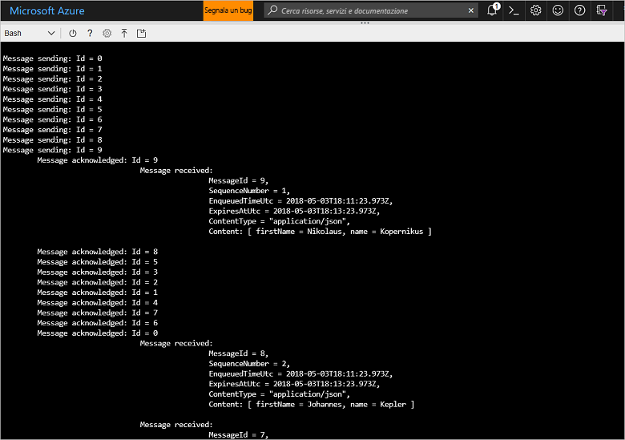

# <a name="quickstart-send-and-receive-messages-using-azure-cli-and-java"></a>Guida introduttiva: Inviare e ricevere messaggi usando l'interfaccia della riga di comando di Azure e Java

Il bus di servizio di Microsoft Azure è un broker di messaggi di integrazione aziendale che garantisce la sicurezza della messaggistica e affidabilità. Uno scenario tipico del bus di servizio comporta in genere il disaccoppiamento di due o più applicazioni, servizi o processi (non è necessario che le applicazioni siano online contemporaneamente), il trasferimento delle modifiche apportate ai dati o allo stato e l'invio di messaggi tra le applicazioni. 

Una società di vendita al dettaglio, ad esempio, potrebbe inviare i dati dei punti vendita a un back office o al centro di distribuzione locale per gli aggiornamenti di rifornimento e inventario. In questo caso l'app client invia e riceve messaggi verso e da una coda del bus di servizio:


Questa guida introduttiva descrive come inviare e ricevere messaggi con il bus di servizio, usando l'interfaccia della riga di comando di Azure e la libreria Java del bus di servizio. Per dettagli più tecnici, è [vedere la spiegazione](#understand-the-sample-code) degli elementi chiave del codice di esempio.

Se non si ha una sottoscrizione di Azure, è possibile creare un [account gratuito][] prima di iniziare.

[!INCLUDE [cloud-shell-try-it.md](../../includes/cloud-shell-try-it.md)]

## <a name="log-in-to-azure"></a>Accedere ad Azure

Fare clic sul pulsante Cloud Shell del menu nell'angolo in alto a destra del portale di Azure e nell'elenco a discesa **Seleziona ambiente** selezionare **Bash**. 

## <a name="use-cli-to-create-resources"></a>Usare l'interfaccia della riga di comando per creare risorse

In Cloud Shell, dal prompt di Bash eseguire i comandi seguenti per il provisioning delle risorse del bus di servizio. Assicurarsi di sostituire tutti i segnaposto con i valori appropriati:

```azurecli-interactive
# Create a resource group
az group create --name myResourceGroup --location eastus

# Create a Service Bus messaging namespace with a unique name
namespaceName=myNameSpace$RANDOM
az servicebus namespace create \
   --resource-group myResourceGroup \
   --name $namespaceName \
   --location eastus

# Create a Service Bus queue
az servicebus queue create --resource-group myResourceGroup \
   --namespace-name $namespaceName \
   --name myQueue

# Get the connection string for the namespace
connectionString=$(az servicebus namespace authorization-rule keys list \
   --resource-group myResourceGroup \
   --namespace-name  $namespaceName \
   --name RootManageSharedAccessKey \
   --query primaryConnectionString --output tsv)
```

Dopo l'esecuzione dell'ultimo comando, copiare e incollare la stringa di connessione e il nome della coda selezionato in una posizione temporanea, ad esempio il Blocco note. Saranno necessari nel passaggio successivo.

## <a name="send-and-receive-messages"></a>Inviare e ricevere messaggi

Dopo che lo spazio dei nomi e la coda sono stati creati e sono disponibili le credenziali necessarie, è possibile inviare e ricevere messaggi. È possibile esaminare il codice in [questa cartella dell'esempio di GitHub](https://github.com/Azure/azure-service-bus/tree/master/samples/Java/quickstarts-and-tutorials/quickstart-java/src/main/java/samples/quickstart/SendAndReceiveMessages.java).

1. Assicurarsi che Cloud Shell sia aperto e visualizzi il prompt di Bash.

2. Clonare il [repository GitHub del bus di servizio](https://github.com/Azure/azure-service-bus/) eseguendo il comando seguente:

   ```bash
   git clone https://github.com/Azure/azure-service-bus.git
   ```

2. Sostituire la directory corrente con la cartella di esempio, usando le barre come separatore di percorso:

   ```bash
   cd azure-service-bus/samples/Java/quickstarts-and-tutorials/quickstart-java 
   ```

3. Eseguire il comando seguente per compilare l'applicazione:
   
   ```bash
   mvn clean package -DskipTests
   ```

4. Per eseguire il programma, eseguire il comando seguente. Fino a quando non si riavvia la shell Bash, la variabile contenente il valore della stringa di connessione viene automaticamente sostituita:

   ```bash
   java -jar ./target/samples.quickstart-1.0.0-jar-with-dependencies.jar -c $connectionString -q myQueue
   ```

6. Osservare l'invio di 10 messaggi alla coda. Si noti che l'ordinamento dei messaggi non è garantito, ma è possibile visualizzare i messaggi che vengono inviati, quindi riconosciuti e ricevuti, insieme ai dati di payload:

   

## <a name="clean-up-resources"></a>Pulire le risorse

Eseguire questo comando per rimuovere il gruppo di risorse, lo spazio dei nomi e tutte le risorse correlate:

```azurecli-interactive
az group delete --resource-group myResourceGroup
```

## <a name="understand-the-sample-code"></a>Informazioni sul codice di esempio

Questa sezione contiene altri dettagli sulle sezioni chiave del codice di esempio. È possibile esaminare il codice presente nel repository GitHub [qui](https://github.com/Azure/azure-service-bus/blob/master/samples/Java/quickstarts-and-tutorials/quickstart-java/src/main/java/samples/quickstart/SendAndReceiveMessages.java).

### <a name="get-connection-string-and-queue"></a>Ottenere la stringa di connessione e la coda

Il codice dichiara prima di tutto due variabili di stringa che vengono passate al programma come argomenti nella riga di comando:

```java
String ConnectionString = null;
String QueueName = null;
```

Questi valori vengono aggiunti tramite parametri e allocati nel metodo `runApp()`:

```java
public static void main(String[] args) {
    SendAndReceiveMessages app = new SendAndReceiveMessages();
    try {
        app.runApp(args);
        app.run();
    } catch (Exception e) {
        System.out.printf("%s", e.toString());
    }
    System.exit(0);
}

public void runApp(String[] args) {
    try {
        // parse connection string from command line             
        Options options = new Options();
        options.addOption(new Option("c", true, "Connection string"));
        options.addOption(new Option("q", true, "Queue Name"));
        CommandLineParser clp = new DefaultParser();
        CommandLine cl = clp.parse(options, args);
        if (cl.getOptionValue("c") != null && cl.getOptionValue("q") != null) {
            ConnectionString = cl.getOptionValue("c");
            QueueName =  cl.getOptionValue("q");
        }
        else
        {
            HelpFormatter formatter = new HelpFormatter();
            formatter.printHelp("run jar with", "", options, "", true);
        }

    } catch (Exception e) {
        System.out.printf("%s", e.toString());
    }
}
```

### <a name="create-queue-clients-to-send-and-receive"></a>Creare i client di accodamento per l'invio e ricezione

Per inviare e ricevere messaggi, il metodo `run()` crea istanze del client di accodamento, che vengono costituite a partire dalla stringa di connessione e dal nome della coda. Questo codice crea due client di accodamento, rispettivamente per l'invio e ricezione:

```java
public void run() throws Exception {
// Create a QueueClient instance for receiving using the connection string builder
// We set the receive mode to "PeekLock", meaning the message is delivered
// under a lock and must be acknowledged ("completed") to be removed from the queue
QueueClient receiveClient = new QueueClient(new ConnectionStringBuilder(ConnectionString, QueueName), ReceiveMode.PEEKLOCK);
this.registerReceiver(receiveClient);

// Create a QueueClient instance for sending and then asynchronously send messages.
QueueClient sendClient = new QueueClient(new ConnectionStringBuilder(ConnectionString, QueueName), ReceiveMode.PEEKLOCK);
```

Il metodo `run()` avvia anche l'operazione di invio dei messaggi asincrono e chiude il mittente al termine dell'operazione di invio:

```java
this.sendMessagesAsync(sendClient).thenRunAsync(() -> sendClient.closeAsync());
``` 

### <a name="construct-and-send-messages"></a>Creare e inviare messaggi

Il metodo `sendMessagesAsync()` crea un set di 10 messaggi e li invia in modo asincrono usando il client di accodamento:

```java
CompletableFuture<Void> sendMessagesAsync(QueueClient sendClient) {
List<HashMap<String, String>> data =
        GSON.fromJson(
                "[" +
                        "{'name' = 'Einstein', 'firstName' = 'Albert'}," +
                        "{'name' = 'Heisenberg', 'firstName' = 'Werner'}," +
                        "{'name' = 'Curie', 'firstName' = 'Marie'}," +
                        "{'name' = 'Hawking', 'firstName' = 'Steven'}," +
                        "{'name' = 'Newton', 'firstName' = 'Isaac'}," +
                        "{'name' = 'Bohr', 'firstName' = 'Niels'}," +
                        "{'name' = 'Faraday', 'firstName' = 'Michael'}," +
                        "{'name' = 'Galilei', 'firstName' = 'Galileo'}," +
                        "{'name' = 'Kepler', 'firstName' = 'Johannes'}," +
                        "{'name' = 'Kopernikus', 'firstName' = 'Nikolaus'}" +
                        "]",
                new TypeToken<List<HashMap<String, String>>>() {}.getType());

List<CompletableFuture> tasks = new ArrayList<>();
for (int i = 0; i < data.size(); i++) {
    final String messageId = Integer.toString(i);
    Message message = new Message(GSON.toJson(data.get(i), Map.class).getBytes(UTF_8));
    message.setContentType("application/json");
    message.setLabel("Scientist");
    message.setMessageId(messageId);
    message.setTimeToLive(Duration.ofMinutes(2));
    System.out.printf("\nMessage sending: Id = %s", message.getMessageId());
    tasks.add(
            sendClient.sendAsync(message).thenRunAsync(() -> {
                System.out.printf("\n\tMessage acknowledged: Id = %s", message.getMessageId());
            }));
}
return CompletableFuture.allOf(tasks.toArray(new CompletableFuture<?>[tasks.size()]));
```

### <a name="receive-messages"></a>Ricevere messaggi

Il metodo `registerReceiver()` registra il callback `RegisterMessageHandler` e imposta anche alcune opzioni del gestore di messaggi:

```java
void registerReceiver(QueueClient queueClient) throws Exception {
    // register the RegisterMessageHandler callback
    queueClient.registerMessageHandler(new IMessageHandler() {
                           // callback invoked when the message handler loop has obtained a message
                           public CompletableFuture<Void> onMessageAsync(IMessage message) {
                               // receives message is passed to callback
                               if (message.getLabel() != null &&
                                       message.getContentType() != null &&
                                       message.getLabel().contentEquals("Scientist") &&
                                       message.getContentType().contentEquals("application/json")) {
                                    byte[] body = message.getBody();
                                   Map scientist = GSON.fromJson(new String(body, UTF_8), Map.class);

                                   System.out.printf(
                                           "\n\t\t\t\tMessage received: \n\t\t\t\t\t\tMessageId = %s, \n\t\t\t\t\t\tSequenceNumber = %s, \n\t\t\t\t\t\tEnqueuedTimeUtc = %s," +
                                                   "\n\t\t\t\t\t\tExpiresAtUtc = %s, \n\t\t\t\t\t\tContentType = \"%s\",  \n\t\t\t\t\t\tContent: [ firstName = %s, name = %s ]\n",
                                           message.getMessageId(),
                                           message.getSequenceNumber(),
                                           message.getEnqueuedTimeUtc(),
                                           message.getExpiresAtUtc(),
                                           message.getContentType(),
                                           scientist != null ? scientist.get("firstName") : "",
                                           scientist != null ? scientist.get("name") : "");
                               }
                               return CompletableFuture.completedFuture(null);
                           }

                           // callback invoked when the message handler has an exception to report
                           public void notifyException(Throwable throwable, ExceptionPhase exceptionPhase) {
                               System.out.printf(exceptionPhase + "-" + throwable.getMessage());
                           }
                       },
    // 1 concurrent call, messages are auto-completed, auto-renew duration
    new MessageHandlerOptions(1, true, Duration.ofMinutes(1)));

}
```

## <a name="next-steps"></a>Passaggi successivi

In questo articolo sono stati creati uno spazio dei nomi del bus di servizio e altre risorse necessarie per inviare e ricevere messaggi da una coda. Per altre informazioni sulla scrittura di codice per inviare e ricevere messaggi, continuare per l'esercitazione seguente per il bus di servizio:

> [!div class="nextstepaction"]
> [Aggiornare l'inventario usando l'interfaccia della riga di comando e Java](./service-bus-tutorial-topics-subscriptions-cli.md)

[account gratuito]: https://azure.microsoft.com/free/?ref=microsoft.com&utm_source=microsoft.com&utm_medium=docs&utm_campaign=visualstudio
[fully qualified domain name]: https://wikipedia.org/wiki/Fully_qualified_domain_name
[Install the Azure CLI]: /cli/azure/install-azure-cli
[az group create]: /cli/azure/group#az_group_create