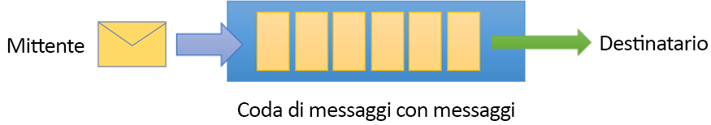
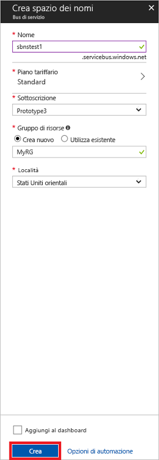

# <a name="quickstart-use-azure-portal-to-create-a-service-bus-queue"></a>Avvio rapido: Usare il portale di Azure per creare una coda del bus di servizio
Il bus di servizio di Microsoft Azure è un broker di messaggi di integrazione aziendale che garantisce la sicurezza della messaggistica e completa affidabilità. Uno scenario tipico del bus di servizio comporta in genere il disaccoppiamento di due o più applicazioni, servizi o processi e il trasferimento delle modifiche apportate ai dati o allo stato. Scenari di questo tipo potrebbero comportare la pianificazione di più processi batch in un'altra applicazione o servizio oppure l'attivazione dell'evasione degli ordini. Una società di vendita al dettaglio, ad esempio, potrebbe inviare i dati dei punti vendita a un back office o al centro di distribuzione locale per gli aggiornamenti di rifornimento e inventario. In questo scenario l'app client invia e riceve messaggi verso e da una coda del bus di servizio.  



Questa guida introduttiva illustra come inviare e ricevere messaggi verso e da una coda del bus di servizio, usando il [portale di Azure][Azure portal] per creare uno spazio dei nomi di messaggistica e una coda in tale spazio dei nomi e come ottenere le credenziali di autorizzazione per tale spazio dei nomi. La procedura illustra quindi come inviare e ricevere messaggi da questa coda usando la [libreria .NET Standard](https://www.nuget.org/packages/Microsoft.Azure.ServiceBus).

Se non si ha una sottoscrizione di Azure, è possibile creare un [account gratuito][] prima di iniziare.

## <a name="prerequisites"></a>Prerequisiti

Per completare questa esercitazione, accertarsi di avere installato:

- [Visual Studio 2017 Update 3 (versione 15.3, 26730.01)](https://www.visualstudio.com/vs) o versioni successive.
- [NET Core SDK](https://www.microsoft.com/net/download/windows) versione 2.0 o successiva.

## <a name="log-on-to-the-azure-portal"></a>Accedere al portale di Azure

Aprire e accedere prima di tutto al [portale di Azure][Azure portal] con la propria sottoscrizione di Azure. Il primo passaggio è la creazione di uno spazio dei nomi del bus di servizio di tipo **Messaggistica**.

## <a name="create-a-service-bus-namespace"></a>Creare uno spazio dei nomi del bus di servizio

Uno spazio dei nomi di messaggistica del bus di servizio fornisce un contenitore di ambito univoco, a cui fa riferimento il [nome di dominio completo][], in cui si crea una o più code, argomenti e sottoscrizioni. L'esempio seguente crea uno spazio dei nomi di messaggistica del bus di servizio in un [gruppo di risorse](/azure/azure-resource-manager/resource-group-portal) nuovo o esistente:

1. Nel riquadro di spostamento sinistro del portale fare clic su **+ Crea una risorsa**, quindi su **Enterprise Integration** e infine su **Bus di servizio**.
2. Nella finestra di dialogo **Crea spazio dei nomi** immettere un nome per lo spazio dei nomi. Verrà effettuato immediatamente un controllo sulla disponibilità del nome.
3. Dopo aver verificato che il nome dello spazio dei nomi sia disponibile, scegliere il piano tariffario, ovvero Standard o Premium.
4. Nel campo **Sottoscrizione** scegliere una sottoscrizione di Azure in cui creare lo spazio dei nomi.
5. Nel campo **Gruppo di risorse** scegliere un gruppo di risorse esistente nel quale risiederà lo spazio dei nomi oppure crearne uno nuovo.      
6. In **Località**scegliere il paese o l'area in cui deve essere ospitato lo spazio dei nomi.
7. Fare clic su **Create**(Crea). A questo punto, lo spazio dei nomi verrà creato e abilitato nel sistema. Potrebbero essere necessari alcuni minuti per consentire al sistema di effettuare il provisioning delle risorse per lo spazio dei nomi creato.



### <a name="obtain-the-management-credentials"></a>Ottenere le credenziali di gestione

Con la creazione di un nuovo spazio dei nomi viene generata automaticamente una regola di firma di accesso condiviso iniziale con una coppia associata di chiavi primaria e secondaria, ognuna delle quali concede il controllo completo su tutti gli aspetti dello spazio dei nomi. Per copiare la regola iniziale seguire questa procedura: 

1.  Fare clic su **Tutte le risorse**, quindi sul nome dello spazio dei nomi appena creato.
2. Nella finestra dello spazio dei nomi fare clic su **Criteri di accesso condiviso**.
3. Nella schermata **Criteri di accesso condiviso** fare clic su **RootManageSharedAccessKey**.
4. Nella finestra **Criteri: RootManageSharedAccessKey** fare clic sul pulsante **Copia** accanto a **Stringa di connessione primaria** per copiare la stringa di connessione negli Appunti e usarla in un secondo momento. Incollare questo valore nel Blocco note o in un'altra posizione temporanea. 

    ![connection-string][connection-string]
5. Ripetere il passaggio precedente e copiare e incollare il valore della **chiave primaria** in un percorso temporaneo per usarlo in seguito.

## <a name="create-a-queue"></a>Creare una coda

Per creare una coda del bus di servizio, specificare lo spazio dei nomi in cui crearla. L'esempio seguente mostra come creare una coda nel portale:

1. Nel riquadro di spostamento a sinistra del portale, fare clic su **Bus di servizio** (se non viene visualizzato **Bus di servizio**, fare clic su **Altri servizi**).
2. Fare clic sullo spazio dei nomi in cui si vuole creare la coda.
3. Nella finestra dello spazio dei nomi fare clic su **Code** e quindi nella finestra **Code** fare clic su **+ Coda**.
4. Immettere il nome della coda in **Nome** e lasciare le impostazioni predefinite per gli altri valori.
5. Nella parte inferiore della finestra fare clic su **Crea**.
6. Prendere nota del nome della coda.

## <a name="send-and-receive-messages"></a>Inviare e ricevere messaggi

Dopo che è stato effettuato il provisioning dello spazio dei nomi e della coda e sono disponibili le credenziali necessarie, è possibile inviare e ricevere messaggi. È possibile esaminare il codice in [questa cartella dell'esempio di GitHub](https://github.com/Azure/azure-service-bus/tree/master/samples/Java/azure-servicebus/TopicFilters).

Per eseguire il codice, seguire questa procedura:

1. Clonare il [repository GitHub del bus di servizio](https://github.com/Azure/azure-service-bus/) eseguendo il comando seguente:

   ```shell
   git clone https://github.com/Azure/azure-service-bus.git
   ```

3. Passare alla cartella dell'esempio `azure-service-bus\samples\DotNet\GettingStarted\BasicSendReceiveQuickStart\BasicSendReceiveQuickStart`.

4. Copiare la stringa di connessione e il nome della coda ottenuti nella sezione [Ottenere le credenziali di gestione](#obtain-the-management-credentials).

5.  Al prompt dei comandi digitare il comando seguente:

   ```shell
   dotnet build
   ```

6.  Passare alla cartella `bin\Debug\netcoreapp2.0`.

7.  Digitare il comando seguente per eseguire il programma. Assicurarsi di sostituire `myConnectionString` con il valore ottenuto in precedenza e `myQueueName` con il nome della coda creata:

   ```shell
   dotnet BasicSendReceiveQuickStart.dll -ConnectionString "myConnectionString" -QueueName "myQueueName"
   ``` 

8. 10 messaggi vengono inviati alla coda e successivamente vengono ricevuti dalla coda:

   

## <a name="clean-up-resources"></a>Pulire le risorse

È possibile usare il portale per rimuovere il gruppo di risorse, lo spazio dei nomi e la coda.

## <a name="understand-the-sample-code"></a>Informazioni sul codice di esempio

Questa sezione contiene altri dettagli sulle operazioni eseguite dal codice di esempio. 

### <a name="get-connection-string-and-queue"></a>Ottenere la stringa di connessione e la coda

La stringa di connessione e il nome della coda vengono passati al metodo `Main()` come argomenti della riga di comando. `Main()` dichiara due variabili di stringa per contenere tali valori:

```csharp
static void Main(string[] args)
{
    string ServiceBusConnectionString = "";
    string QueueName = "";

    for (int i = 0; i < args.Length; i++)
    {
        var p = new Program();
        if (args[i] == "-ConnectionString")
        {
            Console.WriteLine($"ConnectionString: {args[i+1]}");
            ServiceBusConnectionString = args[i + 1]; 
        }
        else if(args[i] == "-QueueName")
        {
            Console.WriteLine($"QueueName: {args[i+1]}");
            QueueName = args[i + 1];
        }                
    }

    if (ServiceBusConnectionString != "" && QueueName != "")
        MainAsync(ServiceBusConnectionString, QueueName).GetAwaiter().GetResult();
    else
    {
        Console.WriteLine("Specify -Connectionstring and -QueueName to execute the example.");
        Console.ReadKey();
    }                            
}
```
 
Il metodo `Main()` avvia quindi il ciclo di messaggi asincrono, `MainAsync()`.

### <a name="message-loop"></a>Ciclo di messaggi

Il metodo MainAsync() crea un client di accodamento con gli argomenti della riga di comando, chiama un gestore di messaggi ricevente denominato `RegisterOnMessageHandlerAndReceiveMessages()` e invia il set di messaggi:

```csharp
static async Task MainAsync(string ServiceBusConnectionString, string QueueName)
{
    const int numberOfMessages = 10;
    queueClient = new QueueClient(ServiceBusConnectionString, QueueName);

    Console.WriteLine("======================================================");
    Console.WriteLine("Press any key to exit after receiving all the messages.");
    Console.WriteLine("======================================================");

    // Register QueueClient's MessageHandler and receive messages in a loop
    RegisterOnMessageHandlerAndReceiveMessages();

    // Send Messages
    await SendMessagesAsync(numberOfMessages);

    Console.ReadKey();

    await queueClient.CloseAsync();
}
```

Il metodo `RegisterOnMessageHandlerAndReceiveMessages()` imposta semplicemente alcune opzioni del gestore di messaggi, quindi chiama il metodo `RegisterMessageHandler()` del client di accodamento, che avvia la ricezione:

```csharp
static void RegisterOnMessageHandlerAndReceiveMessages()
{
    // Configure the MessageHandler Options in terms of exception handling, number of concurrent messages to deliver etc.
    var messageHandlerOptions = new MessageHandlerOptions(ExceptionReceivedHandler)
    {
        // Maximum number of Concurrent calls to the callback `ProcessMessagesAsync`, set to 1 for simplicity.
        // Set it according to how many messages the application wants to process in parallel.
        MaxConcurrentCalls = 1,

        // Indicates whether MessagePump should automatically complete the messages after returning from User Callback.
        // False below indicates the Complete will be handled by the User Callback as in `ProcessMessagesAsync` below.
        AutoComplete = false
    };

    // Register the function that will process messages
    queueClient.RegisterMessageHandler(ProcessMessagesAsync, messageHandlerOptions);
} 
```

### <a name="send-messages"></a>Inviare messaggi

Le operazioni di creazione e invio dei messaggi vengono eseguite nel metodo `SendMessagesAsync()`:

```csharp
static async Task SendMessagesAsync(int numberOfMessagesToSend)
{
    try
    {
        for (var i = 0; i < numberOfMessagesToSend; i++)
        {
            // Create a new message to send to the queue
            string messageBody = $"Message {i}";
            var message = new Message(Encoding.UTF8.GetBytes(messageBody));

            // Write the body of the message to the console
            Console.WriteLine($"Sending message: {messageBody}");

            // Send the message to the queue
            await queueClient.SendAsync(message);
        }
    }
    catch (Exception exception)
    {
        Console.WriteLine($"{DateTime.Now} :: Exception: {exception.Message}");
    }
}
```

### <a name="process-messages"></a>Elaborare i messaggi

Il metodo `ProcessMessagesAsync()` riconosce, elabora e completa la ricezione dei messaggi:

```csharp
static async Task ProcessMessagesAsync(Message message, CancellationToken token)
{
    // Process the message
    Console.WriteLine($"Received message: SequenceNumber:{message.SystemProperties.SequenceNumber} Body:{Encoding.UTF8.GetString(message.Body)}");

    // Complete the message so that it is not received again.
    await queueClient.CompleteAsync(message.SystemProperties.LockToken);
}
```

## <a name="next-steps"></a>Passaggi successivi

In questo articolo sono stati creati uno spazio dei nomi del bus di servizio e altre risorse necessarie per inviare e ricevere messaggi da una coda. Per altre informazioni sulla scrittura di codice per inviare e ricevere messaggi, continuare per l'esercitazione seguente per il bus di servizio:

> [!div class="nextstepaction"]
> [Aggiornare l'inventario usando il portale di Azure](./service-bus-tutorial-topics-subscriptions-portal.md)


[account gratuito]: https://azure.microsoft.com/free/?ref=microsoft.com&utm_source=microsoft.com&utm_medium=docs&utm_campaign=visualstudio
[nome di dominio completo]: https://wikipedia.org/wiki/Fully_qualified_domain_name
[Azure portal]: https://portal.azure.com/

[connection-string]: ./media/service-bus-quickstart-portal/connection-string.png
[service-bus-flow]: ./media/service-bus-quickstart-portal/service-bus-flow.png
