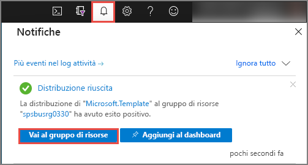
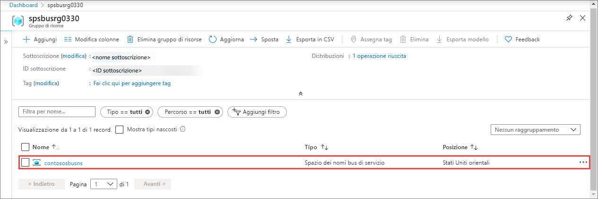
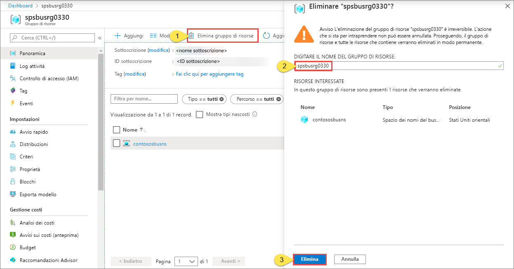

# Avvio rapido: Creare uno spazio dei nomi e una coda del bus di servizio usando un modello di Azure Resource Manager

Questo articolo illustra come usare un modello di Azure Resource Manager (modello di Resource Manager) per creare uno spazio dei nomi e una coda del bus di servizio all'interno dello spazio dei nomi. L'articolo spiega come specificare le risorse da distribuire e come definire i parametri che devono essere specificati quando viene eseguita la distribuzione. È possibile usare questo modello per le proprie distribuzioni o personalizzarlo in base alle esigenze.

[!INCLUDE [About Azure Resource Manager](../../includes/resource-manager-quickstart-introduction.md)]

Se l'ambiente soddisfa i prerequisiti e si ha familiarità con l'uso dei modelli di Resource Manager, selezionare il pulsante **Distribuisci in Azure**. Il modello verrà aperto nel portale di Azure.

## Prerequisiti

Se non si ha una sottoscrizione di Azure, [creare un account gratuito](https://azure.microsoft.com/free/) prima di iniziare.

## Rivedere il modello

Il modello usato in questo avvio rapido proviene dai [modelli di avvio rapido di Azure](https://azure.microsoft.com/resources/templates/201-servicebus-create-queue).

:::code language="json" source="~/quickstart-templates/201-servicebus-create-queue/azuredeploy.json":::

Nel modello sono definite le risorse seguenti:

- [**Microsoft.ServiceBus/namespaces**](/azure/templates/microsoft.servicebus/namespaces)
- [**Microsoft.ServiceBus/namespaces/queues**](/azure/templates/microsoft.servicebus/namespaces/queues)

> [!NOTE]
> I modelli di Azure Resource Manager seguenti sono disponibili per il download e la distribuzione.
>
> * [Creare uno spazio dei nomi del bus di servizio con coda e regola di autorizzazione](service-bus-resource-manager-namespace-auth-rule.md)
> * [Creare uno spazio dei nomi del bus di servizio con argomento e sottoscrizione](service-bus-resource-manager-namespace-topic.md)
> * [Creare uno spazio dei nomi del bus di servizio](service-bus-resource-manager-namespace.md)
> * [Creare uno spazio dei nomi del bus di servizio con argomento, sottoscrizione e regola](service-bus-resource-manager-namespace-topic-with-rule.md)

Altri modelli sono disponibili in [Modelli di avvio rapido di Azure](https://azure.microsoft.com/resources/templates/?resourceType=Microsoft.Servicebus&pageNumber=1&sort=Popular)

## Distribuire il modello

Questo modello consente di distribuire uno spazio dei nomi del bus di servizio con una coda.

Le [code del bus di servizio](service-bus-queues-topics-subscriptions.md#queues) consentono un recapito dei messaggi di tipo FIFO (First In, First Out) a uno o più consumer concorrenti.

Per eseguire automaticamente la distribuzione, fare clic sul pulsante seguente: Creare un nuovo gruppo di risorse per la distribuzione in modo da poterlo pulire facilmente in un secondo momento.

## Convalidare la distribuzione

1. Selezionare **Notifiche** nella parte superiore per visualizzare lo stato della distribuzione. Attendere il completamento della distribuzione. Selezionare quindi **Vai al gruppo di risorse** nel messaggio di notifica per passare alla pagina del gruppo di risorse che contiene lo spazio dei nomi del bus di servizio. 

    
2. Verificare che lo spazio dei nomi del bus di servizio sia visibile nell'elenco delle risorse. 

    
3. Selezionare lo spazio dei nomi nell'elenco per visualizzare la pagina **Spazio dei nomi del bus di servizio**. 

## Pulire le risorse

1. Nel portale di Azure passare alla pagina **Gruppo di risorse** relativa al gruppo di risorse desiderato.
2. Selezionare **Elimina gruppo di risorse** sulla barra degli strumenti. 
3. Digitare il nome del gruppo di risorse e selezionare **Elimina**. 

    

## Passaggi successivi

Vedere l'argomento seguente che illustra come creare una regola di autorizzazione per lo spazio dei nomi o la coda:

[Creare una regola di autorizzazione del bus di servizio per spazio dei nomi e coda usando un modello di Azure Resource Manager](service-bus-resource-manager-namespace-auth-rule.md)

Per informazioni su come gestire queste risorse, vedere gli articoli seguenti:

* [Gestire Bus di servizio con PowerShell](service-bus-manage-with-ps.md)
* [Gestire le risorse del bus di servizio con Service Bus Explorer](https://github.com/paolosalvatori/ServiceBusExplorer/releases)

[Authoring Azure Resource Manager templates]: ../azure-resource-manager/templates/template-syntax.md
[Service Bus namespace and queue template]: https://github.com/Azure/azure-quickstart-templates/blob/master/201-servicebus-create-queue/
[Azure Quickstart Templates]: https://azure.microsoft.com/documentation/templates/?term=service+bus
[Learn more about Service Bus queues]: service-bus-queues-topics-subscriptions.md
[Using Azure PowerShell with Azure Resource Manager]: ../azure-resource-manager/management/manage-resources-powershell.md
[Using the Azure CLI for Mac, Linux, and Windows with Azure Resource Management]: ../azure-resource-manager/management/manage-resources-cli.md