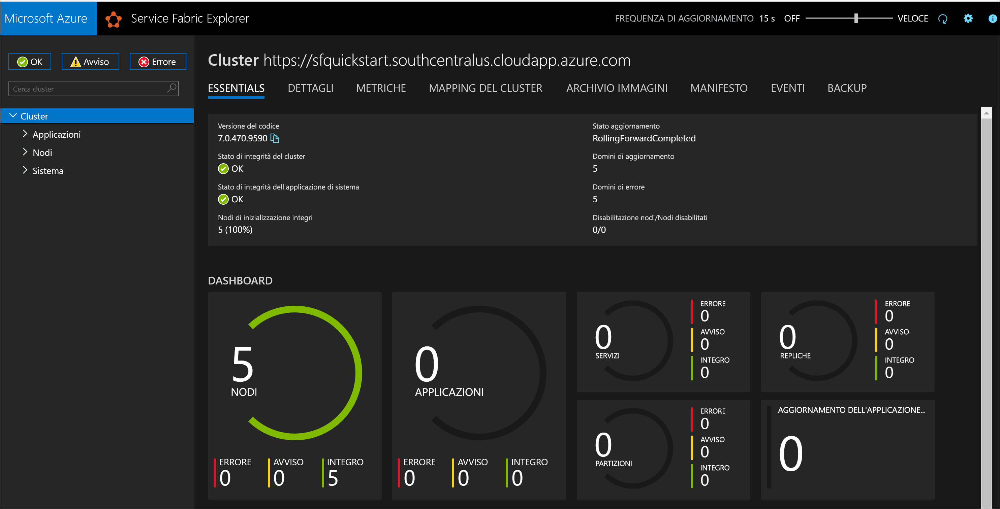

# <a name="quickstart-create-a-service-fabric-cluster-using-arm-template"></a>Avvio rapido: Configurare un cluster di Service Fabric mediante un modello di Resource Manager

Azure Service Fabric è una piattaforma di sistemi distribuiti che semplifica la disposizione in pacchetti, la distribuzione e la gestione di microservizi e contenitori scalabili e affidabili. Un *cluster* di Service Fabric è un set di macchine virtuali connesse in rete, in cui vengono distribuiti e gestiti i microservizi. Questo articolo descrive come distribuire un cluster di test di Service Fabric in Azure usando un modello di Resource Manager.

[!INCLUDE [About Azure Resource Manager](../../includes/resource-manager-quickstart-introduction.md)]

Questo cluster Windows a cinque nodi è protetto tramite un certificato autofirmato ed è quindi è destinato solo a scopo didattico e non ai carichi di lavoro di produzione. Per distribuire il modello si userà Azure PowerShell. Oltre ad Azure PowerShell, è anche possibile usare il portale di Azure, l'interfaccia della riga di comando di Azure e l'API REST. Per informazioni sugli altri metodi di distribuzione, vedere [Distribuire modelli](../azure-resource-manager/templates/deploy-portal.md).

Se l'ambiente soddisfa i prerequisiti e si ha familiarità con l'uso dei modelli di Resource Manager, selezionare il pulsante **Distribuisci in Azure**. Il modello verrà aperto nel portale di Azure.

[](https://portal.azure.com/#create/Microsoft.Template/uri/https%3A%2F%2Fraw.githubusercontent.com%2FAzure%2Fazure-quickstart-templates%2Fmaster%2Fservice-fabric-secure-cluster-5-node-1-nodetype%2Fazuredeploy.json)

## <a name="prerequisites"></a>Prerequisiti

Se non si ha una sottoscrizione di Azure, creare un account [gratuito](https://azure.microsoft.com/free/) prima di iniziare.

### <a name="install-service-fabric-sdk-and-powershell-modules"></a>Installare i moduli Service Fabric SDK e PowerShell

Per completare questa guida di avvio rapido, è necessario:

* Installare [Service Fabric SDK e il modulo PowerShell](service-fabric-get-started.md).

* Installare [Azure PowerShell](https://docs.microsoft.com/powershell/azure/install-Az-ps).

### <a name="download-the-sample-template-and-certificate-helper-script"></a>Scaricare il modello di esempio e lo script di supporto per i certificati

Clonare o scaricare il repository dei [Modelli di avvio rapido di Azure Resource Manager](https://github.com/Azure/azure-quickstart-templates). In alternativa, copiare localmente i file seguenti, che verranno usati dalla cartella *service-fabric-secure-cluster-5-node-1-nodetype*:

* [New-ServiceFabricClusterCertificate.ps1](https://raw.githubusercontent.com/Azure/azure-quickstart-templates/master/service-fabric-secure-cluster-5-node-1-nodetype/New-ServiceFabricClusterCertificate.ps1)
* [azuredeploy.json](https://raw.githubusercontent.com/Azure/azure-quickstart-templates/master/service-fabric-secure-cluster-5-node-1-nodetype/azuredeploy.json)
* [azuredeploy.parameters.json](https://raw.githubusercontent.com/Azure/azure-quickstart-templates/master/service-fabric-secure-cluster-5-node-1-nodetype/azuredeploy.parameters.json)

### <a name="sign-in-to-azure"></a>Accedere ad Azure

Accedere ad Azure e designare la sottoscrizione da usare per la creazione del cluster di Service Fabric.

```powershell
# Sign in to your Azure account
Login-AzAccount -SubscriptionId "<subscription ID>"
```

### <a name="create-a-self-signed-certificate-stored-in-key-vault"></a>Creare un certificato autofirmato archiviato in Key Vault

Service Fabric usa certificati X.509 per [proteggere un cluster](./service-fabric-cluster-security.md) e fornire le funzionalità di sicurezza dell'applicazione e usa [Key Vault](../key-vault/general/overview.md) per gestire tali certificati. Per la creazione di un cluster, è necessario un certificato del cluster per abilitare la comunicazione da nodo a nodo. Ai fini della creazione del cluster di test in questa guida di avvio rapido, verrà creato un certificato autofirmato per l'autenticazione del cluster. I carichi di lavoro di produzione richiedono certificati creati tramite un servizio certificati di Windows Server configurato correttamente o tramite un'Autorità di certificazione (CA) approvata.

```powershell
# Designate unique (within cloudapp.azure.com) names for your resources
$resourceGroupName = "SFQuickstartRG"
$keyVaultName = "SFQuickstartKV"

# Create a new resource group for your Key Vault and Service Fabric cluster
New-AzResourceGroup -Name $resourceGroupName -Location SouthCentralUS

# Create a Key Vault enabled for deployment
New-AzKeyVault -VaultName $KeyVaultName -ResourceGroupName $resourceGroupName -Location SouthCentralUS -EnabledForDeployment

# Generate a certificate and upload it to Key Vault
.\New-ServiceFabricClusterCertificate.ps1
```

Lo script richiederà di eseguire le operazioni seguenti (assicurarsi di modificare *CertDNSName* e *KeyVaultName* in base ai valori di esempio seguenti):

* **Password:** Password!1
* **CertDNSName:** *sfquickstart*.southcentralus.cloudapp.azure.com
* **KeyVaultName:** *SFQuickstartKV*
* **KeyVaultSecretName:** clustercert

Al termine, lo script fornirà i valori dei parametri necessari per la distribuzione del modello. Assicurarsi di archiviarle nelle variabili seguenti, perché saranno necessarie per distribuire il modello di cluster:

```powershell
$sourceVaultId = "<Source Vault Resource Id>"
$certUrlValue = "<Certificate URL>"
$certThumbprint = "<Certificate Thumbprint>"
```

## <a name="review-the-template"></a>Rivedere il modello

Il modello usato in questo avvio rapido proviene dai [modelli di avvio rapido di Azure](https://azure.microsoft.com/resources/templates/service-fabric-secure-cluster-5-node-1-nodetype/). Il modello per questo articolo è troppo lungo per essere visualizzato qui. Per visualizzare il modello, vedere il file [azuredeploy.json](https://raw.githubusercontent.com/Azure/azure-quickstart-templates/master/service-fabric-secure-cluster-5-node-1-nodetype/azuredeploy.json).

Nel modello sono state definite più risorse di Azure.

* [Microsoft.Storage/storageAccounts](/azure/templates/microsoft.storage/storageaccounts)
* [Microsoft.Network/virtualNetworks](/azure/templates/microsoft.network/virtualnetworks)
* [Microsoft.Network/publicIPAddresses](/azure/templates/microsoft.network/publicipaddresses)
* [Microsoft.Network/loadBalancers](/azure/templates/microsoft.network/loadbalancers)
* [Microsoft.Compute/virtualMachineScaleSets](/azure/templates/microsoft.compute/virtualmachinescalesets)
* [Microsoft.ServiceFabric/clusters](/azure/templates/microsoft.servicefabric/clusters)

Per altri modelli correlati ad Azure Service Fabric, vedere [Modelli di avvio rapido di Azure](https://azure.microsoft.com/resources/templates/?sort=Popular&term=service+fabric).

### <a name="customize-the-parameters-file"></a>Personalizzare il file dei parametri

Aprire il file *azuredeploy.parameters.json* e modificare i valori dei parametri in modo che:

* **clustername** corrisponda al valore specificato per *CertDNSName* durante la creazione del certificato del cluster
* **adminUserName** corrisponda a un valore diverso dal token *GEN-UNIQUE* predefinito
* **adminPassword** corrisponda a un valore diverso dal token *GEN-PASSWORD* predefinito
* **certificateThumbprint**, **sourceVaultResourceId** e **certificateUrlValue** siano tutti stringhe vuote (`""`)

Ad esempio:

```json
{
  "$schema": "https://schema.management.azure.com/schemas/2019-04-01/deploymentParameters.json#",
  "contentVersion": "1.0.0.0",
  "parameters": {
    "clusterName": {
      "value": "sfquickstart"
    },
    "adminUsername": {
      "value": "testadm"
    },
    "adminPassword": {
      "value": "Password#1234"
    },
    "certificateThumbprint": {
      "value": ""
    },
    "sourceVaultResourceId": {
      "value": ""
    },
    "certificateUrlValue": {
      "value": ""
    }
  }
}
```

## <a name="deploy-the-template"></a>Distribuire il modello

Archiviare i percorsi del modello di Resource Manager e dei file dei parametri in variabili, quindi distribuire il modello.

```powershell
$templateFilePath = "<full path to azuredeploy.json>"
$parameterFilePath = "<full path to azuredeploy.parameters.json>"

New-AzResourceGroupDeployment `
    -ResourceGroupName $resourceGroupName `
    -TemplateFile $templateFilePath `
    -TemplateParameterFile $parameterFilePath `
    -CertificateThumbprint $certThumbprint `
    -CertificateUrlValue $certUrlValue `
    -SourceVaultResourceId $sourceVaultId `
    -Verbose
```

## <a name="review-deployed-resources"></a>Esaminare le risorse distribuite

Al termine della distribuzione, trovare il valore `managementEndpoint` nell'output e aprire l'indirizzo in un Web browser per visualizzare il cluster in [Service Fabric Explorer](./service-fabric-visualizing-your-cluster.md).



È anche possibile trovare l'endpoint Service Fabric Explorer dal pannello della risorsa Service Explorer nel portale di Azure.


## <a name="clean-up-resources"></a>Pulire le risorse

Quando non è più necessario, eliminare il gruppo di risorse per eliminare tutte le risorse contenute al suo interno.

```powershell
$resourceGroupName = Read-Host -Prompt "Enter the Resource Group name"
Remove-AzResourceGroup -Name $resourceGroupName
Write-Host "Press [ENTER] to continue..."
```

## <a name="next-steps"></a>Passaggi successivi

Per informazioni su come creare un modello di cluster di Azure Service Fabric personalizzato, vedere:

> [!div class="nextstepaction"]
> [Creare un modello di Resource Manager per un cluster di Service Fabric](service-fabric-cluster-creation-create-template.md)
