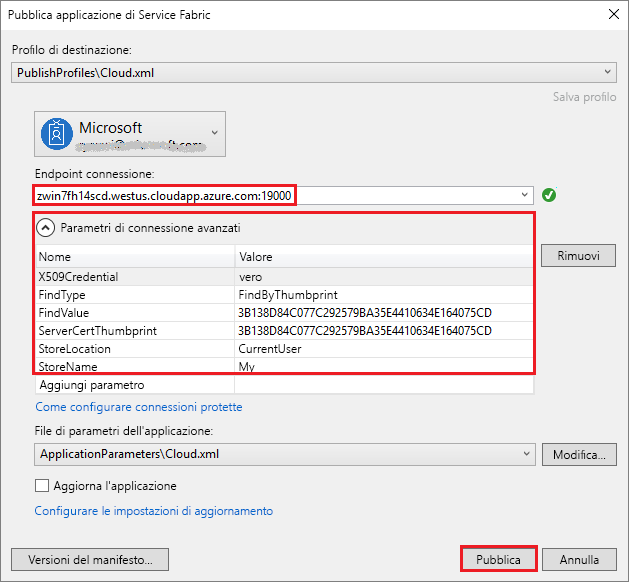

# <a name="quickstart-deploy-windows-containers-to-service-fabric"></a>Avvio rapido: Distribuire contenitori Windows in Service Fabric

Azure Service Fabric è una piattaforma di sistemi distribuiti per la distribuzione e la gestione di microservizi e contenitori scalabili e affidabili.

Per eseguire un'applicazione esistente in un contenitore Windows in un cluster di Service Fabric non è necessario apportare modifiche all'applicazione. Questa guida introduttiva illustra come distribuire un'immagine del contenitore Docker predefinita in un'applicazione di Service Fabric. Al termine, saranno in esecuzione un server Windows Server Core 2016 e un contenitore IIS. Questa guida introduttiva descrive la distribuzione di un contenitore Windows. Vedere [questa guida introduttiva](service-fabric-quickstart-containers-linux.md) per distribuire un contenitore Linux.

![Pagina Web predefinita di IIS][iis-default]

In questa guida introduttiva si apprende come:

* Creare un pacchetto di un contenitore di un'immagine Docker
* Configurare la comunicazione
* Compilare l'applicazione di Service Fabric e creare il pacchetto
* Distribuire l'applicazione del contenitore in Azure


[!INCLUDE [updated-for-az](../../includes/updated-for-az.md)]

## <a name="prerequisites"></a>Prerequisiti

* Una sottoscrizione di Azure. È possibile creare un [account gratuito](https://azure.microsoft.com/free/?WT.mc_id=A261C142F).
* Un computer di sviluppo che esegue:
  * Visual Studio 2015 o Visual Studio 2017.
  * [SDK e strumenti di Service Fabric](service-fabric-get-started.md).

## <a name="package-a-docker-image-container-with-visual-studio"></a>Creare un pacchetto di un contenitore di un'immagine Docker con Visual Studio

L'SDK e gli strumenti di Service Fabric offrono un modello di servizio che permette di distribuire un contenitore in un cluster di Service Fabric.

Avviare Visual Studio come "Amministratore".  Selezionare **File** > **Nuovo** > **Progetto**.

Selezionare l'**applicazione di Service Fabric**, denominarla "MyFirstContainer" e fare clic su **OK**.

Selezionare **Contenitore** dai modelli **Applicazioni e contenitori ospitati**.

In **Nome immagine** immettere "mcr.microsoft.com/windows/servercore/iis:windowservercore-ltsc2016", ossia l'[immagine di base di Windows Server Core Server e IIS](https://hub.docker.com/r/microsoft-windows-servercore-iis).

Configurare il mapping dalla porta all'host del contenitore in modo che per le richieste in ingresso per il servizio sulla porta 80 venga eseguito il mapping alla porta 80 del contenitore.  Impostare la **Porta del contenitore** su "80" e impostare **Porta host** su "80".  

Assegnare al servizio il nome "MyContainerService" e fare clic su **OK**.

![Finestra di dialogo Nuovo servizio][new-service]

## <a name="specify-the-os-build-for-your-container-image"></a>Specificare la build del sistema operativo per l'immagine del contenitore

I contenitori compilati con una versione specifica di Windows Server potrebbero non supportare l'esecuzione in un host con una versione diversa di Windows Server. Ad esempio, i contenitori compilati con Windows Server 1709 non possono essere eseguiti negli host che eseguono Windows Server versione 2016. Per altre informazioni, vedere [Windows Server container OS and host OS compatibility](service-fabric-get-started-containers.md#windows-server-container-os-and-host-os-compatibility) (Compatibilità tra il sistema operativo del contenitore di Windows Server e il sistema operativo dell'host). 

Con la versione 6.1 del runtime di Service Fabric e le versioni più recenti, è possibile specificare più immagini del sistema operativo per ogni contenitore e contrassegnare ognuna con la versione della build del sistema operativo in cui deve essere distribuita. Ciò consente di assicurarsi che l'applicazione venga eseguita in host che eseguono versioni diverse del sistema operativo Windows. Per altre informazioni, vedere [Specificare immagini del contenitore specifiche per la build del sistema operativo](service-fabric-get-started-containers.md#specify-os-build-specific-container-images). 

Microsoft pubblica immagini diverse per le versioni di IIS compilate per versioni differenti di Windows Server. Per assicurarsi che Service Fabric distribuisca un contenitore compatibile con la versione di Windows Server in esecuzione nei nodi del cluster in cui si distribuisce l'applicazione, aggiungere le righe seguenti righe al file *ApplicationManifest.xml*. La versione della build per Windows Server 2016 è 14393 e la versione della build per Windows Server versione 1709 è 16299.

```xml
    <ContainerHostPolicies CodePackageRef="Code"> 
      <ImageOverrides> 
        ...
          <Image Name="mcr.microsoft.com/windows/servercore/iis:windowservercore-1803" /> 
          <Image Name= "mcr.microsoft.com/windows/servercore/iis:windowservercore-ltsc2016" Os="14393" /> 
          <Image Name="mcr.microsoft.com/windows/servercore/iis:windowservercore-1709" Os="16299" /> 
      </ImageOverrides> 
    </ContainerHostPolicies> 
```

Il manifesto del servizio continua a specificare solo un'immagine per nanoserver, `mcr.microsoft.com/windows/servercore/iis:windowservercore-ltsc2016`.

Nel file *ApplicationManifest.xml* impostare anche **PasswordEncrypted** su **false**. Dato che l'account e la password sono vuoti per l'immagine del contenitore pubblica disponibile nell'hub Docker, si disattiva la crittografia perché la crittografia di una password vuota genera un errore di compilazione.

```xml
<RepositoryCredentials AccountName="" Password="" PasswordEncrypted="false" />
```

## <a name="create-a-cluster"></a>Creare un cluster

Lo script di esempio seguente crea un cluster di Service Fabric con cinque nodi protetto con un certificato X.509. Il comando crea un certificato autofirmato e lo carica in un nuovo insieme di credenziali delle chiavi. Il certificato viene copiato anche in una directory locale. Per altre informazioni sulla creazione di un cluster con questo script, vedere [Creare un cluster di Service Fabric](scripts/service-fabric-powershell-create-secure-cluster-cert.md).

Se necessario, installare Azure PowerShell seguendo le istruzioni presenti nella [guida di Azure PowerShell](/powershell/azure/overview).

Prima di eseguire questo script, in PowerShell eseguire `Connect-AzAccount` per creare una connessione con Azure.

Copiare lo script seguente negli Appunti e aprire **Windows PowerShell ISE**.  Incollare il contenuto nella finestra vuota Untitled1.ps1. Specificare quindi i valori per le variabili nello script: `subscriptionId`, `certpwd`, `certfolder`, `adminuser`, `adminpwd` e così via.  La directory specificata per `certfolder` deve essere già presente prima dell'esecuzione dello script.

[!code-powershell[main](../../powershell_scripts/service-fabric/create-secure-cluster/create-secure-cluster.ps1 "Create a Service Fabric cluster")]

Dopo avere specificato i valori per le variabili, premere **F5** per eseguire lo script.

Dopo l'esecuzione dello script e la creazione del cluster, trovare `ClusterEndpoint` nell'output. Ad esempio: 

```powershell
...
ClusterEndpoint : https://southcentralus.servicefabric.azure.com/runtime/clusters/b76e757d-0b97-4037-a184-9046a7c818c0
```

### <a name="install-the-certificate-for-the-cluster"></a>Installare il certificato per il cluster

Si installerà ora il certificato PFX nell'archivio certificati *CurrentUser\My*. Il file PFX si troverà nella directory specificata con la variabile di ambiente `certfolder` nello script di PowerShell precedente.

Passare a tale directory e quindi eseguire il comando di PowerShell seguente sostituendo il nome del file PFX che si trova nella directory `certfolder` e la password specificata nella variabile `certpwd`. In questo esempio, come directory corrente è impostata la directory specificata dalla variabile `certfolder` nello script di PowerShell. Da questa posizione viene eseguito il comando `Import-PfxCertificate`:

```powershell
PS C:\mycertificates> Import-PfxCertificate -FilePath .\mysfclustergroup20190130193456.pfx -CertStoreLocation Cert:\CurrentUser\My -Password (ConvertTo-SecureString Password#1234 -AsPlainText -Force)
```

Il comando restituisce l'identificazione personale:

```powershell
  ...
  PSParentPath: Microsoft.PowerShell.Security\Certificate::CurrentUser\My

Thumbprint                                Subject
----------                                -------
0AC30A2FA770BEF566226CFCF75A6515D73FC686  CN=mysfcluster.SouthCentralUS.cloudapp.azure.com
```

Ricordare il valore di identificazione personale per il passaggio seguente.

## <a name="deploy-the-application-to-azure-using-visual-studio"></a>Distribuire l'applicazione in Azure usando Visual Studio

Ora che l'applicazione è pronta, è possibile distribuirla in un cluster direttamente da Visual Studio.

Fare clic con il pulsante destro del mouse su **MyFirstContainer** in Esplora soluzioni e scegliere **Pubblica**. Verrà visualizzata la finestra di dialogo Pubblica.

Copiare il contenuto che segue **CN=** nella finestra di PowerShell in cui è stato eseguito il comando `Import-PfxCertificate` precedente e aggiungervi la porta `19000`. Ad esempio: `mysfcluster.SouthCentralUS.cloudapp.azure.com:19000`. Copiare nel campo **Endpoint connessione**. Ricordare questo valore perché sarà necessario in un passaggio successivo.

Fare clic su **Parametri di connessione avanzati** e verificare le informazioni sui parametri di connessione.  I valori di *FindValue* e *ServerCertThumbprint* devono corrispondere all'identificazione personale del certificato installato eseguendo `Import-PfxCertificate` nel passaggio precedente.



Fare clic su **Pubblica**.

Ogni applicazione nel cluster deve avere un nome univoco. Se è presente un conflitto di nomi, ridenominare il progetto di Visual Studio e distribuirlo di nuovo.

Aprire un browser e passare all'indirizzo inserito nel campo **Endpoint connessione** nel passaggio precedente. Facoltativamente, è possibile anteporre l'identificatore di schema, `http://`, e accodare la porta, `:80`, all'URL. Ad esempio, http:\//mysfcluster.SouthCentralUS.cloudapp.azure.com:80.

 Dovrebbe essere visualizzata la pagina Web predefinita di IIS: ![Pagina Web predefinita di IIS][iis-default]

## <a name="clean-up"></a>Eseguire la pulizia

Mentre il cluster è in esecuzione, continuano a essere addebitati i relativi costi. Valutare la possibilità di [eliminare il cluster](service-fabric-cluster-delete.md).

## <a name="next-steps"></a>Passaggi successivi

In questa guida introduttiva si è appreso come:

* Creare un pacchetto di un contenitore di un'immagine Docker
* Configurare la comunicazione
* Compilare l'applicazione di Service Fabric e creare il pacchetto
* Distribuire l'applicazione del contenitore in Azure

Per altre informazioni sull'uso di contenitori Windows in Service Fabric, continuare con l'esercitazione sulle app contenitore Windows.

> [!div class="nextstepaction"]
> [Creare un'app contenitore Windows](./service-fabric-host-app-in-a-container.md)

[iis-default]: ./media/service-fabric-quickstart-containers/iis-default.png
[publish-dialog]: ./media/service-fabric-quickstart-containers/publish-dialog.png
[new-service]: ./media/service-fabric-quickstart-containers/NewService.png
