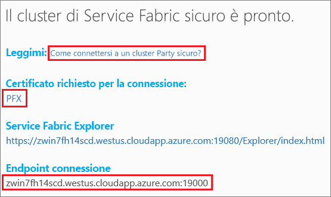

# <a name="quickstart-deploy-windows-containers-to-service-fabric"></a>Avvio rapido: Distribuire i contenitori Windows in Service Fabric

Azure Service Fabric è una piattaforma di sistemi distribuiti per la distribuzione e la gestione di microservizi e contenitori scalabili e affidabili.

Per eseguire un'applicazione esistente in un contenitore Windows in un cluster di Service Fabric non è necessario apportare modifiche all'applicazione. Questa guida introduttiva illustra come distribuire un'immagine del contenitore Docker predefinita in un'applicazione di Service Fabric. Al termine, saranno in esecuzione Nano Server per Windows Server 2016 e un contenitore IIS. Questa guida introduttiva descrive la distribuzione di un contenitore Windows. Vedere [questa guida introduttiva](service-fabric-quickstart-containers-linux.md) per distribuire un contenitore Linux.

![Pagina Web predefinita di IIS][iis-default]

In questa guida introduttiva si apprende come:

* Creare un pacchetto di un contenitore di un'immagine Docker
* Configurare la comunicazione
* Compilare l'applicazione di Service Fabric e creare il pacchetto
* Distribuire l'applicazione del contenitore in Azure

## <a name="prerequisites"></a>prerequisiti

* Una sottoscrizione di Azure. È possibile creare un [account gratuito](https://azure.microsoft.com/free/?WT.mc_id=A261C142F).
* Un computer di sviluppo che esegue:
  * Visual Studio 2015 o Visual Studio 2017.
  * [SDK e strumenti di Service Fabric](service-fabric-get-started.md).

## <a name="package-a-docker-image-container-with-visual-studio"></a>Creare un pacchetto di un contenitore di un'immagine Docker con Visual Studio

L'SDK e gli strumenti di Service Fabric offrono un modello di servizio che permette di distribuire un contenitore in un cluster di Service Fabric.

Avviare Visual Studio come "Amministratore".  Selezionare **File** > **Nuovo** > **Progetto**.

Selezionare l'**applicazione di Service Fabric**, denominarla "MyFirstContainer" e fare clic su **OK**.

Selezionare **Contenitore** dai modelli **Applicazioni e contenitori ospitati**.

In **Nome immagine** immettere "microsoft/iis:nanoserver", l'[immagine di base di IIS e Nano Server per Windows Server](https://hub.docker.com/r/microsoft/iis/).

Configurare il mapping dalla porta all'host del contenitore in modo che per le richieste in ingresso per il servizio sulla porta 80 venga eseguito il mapping alla porta 80 del contenitore.  Impostare la **Porta del contenitore** su "80" e impostare **Porta host** su "80".  

Assegnare al servizio il nome "MyContainerService" e fare clic su **OK**.

<<<<<<< Upstream aggiornato![Finestra di dialogo Nuovo servizio][new-service]
=======
## <a name="configure-communication-and-container-port-to-host-port-mapping"></a>Configurare la comunicazione e il mapping tra porta del contenitore e porta dell'host

Il servizio richiede un endpoint per la comunicazione.  Per questa guida introduttiva il servizio in contenitori è in ascolto sulla porta 80.  In Esplora soluzioni aprire *MyFirstContainer/ApplicationPackageRoot/MyContainerServicePkg/ServiceManifest.xml*.  Aggiornare l'elemento `Endpoint` esistente nel file ServiceManifest.xml e aggiungere il protocollo, la porta e lo schema URI:

```xml
<Resources>
    <Endpoints>
        <Endpoint Name="MyContainerServiceTypeEndpoint" UriScheme="http" Port="80" Protocol="http"/>
   </Endpoints>
</Resources>
```

Se si specifica `UriScheme`, l'endpoint del contenitore viene registrato automaticamente con Service Fabric Naming Service per l'individuazione. Alla fine di questo articolo viene fornito un file di esempio completo di ServiceManifest.xml.

Configurare il mapping dalla porta all'host del contenitore in modo che per le richieste in ingresso per il servizio sulla porta 80 venga eseguito il mapping alla porta 80 del contenitore.  In Esplora soluzioni aprire *MyFirstContainer/ApplicationPackageRoot/ApplicationManifest.xml* e specificare i criteri `PortBinding` in `ContainerHostPolicies`.  Per questa guida introduttiva, `ContainerPort` è 80 ed `EndpointRef` è "MyContainerServiceTypeEndpoint" (l'endpoint definito nel manifesto del servizio).

```xml
<ServiceManifestImport>
...
  <ConfigOverrides />
  <Policies>
    <ContainerHostPolicies CodePackageRef="Code">
      <PortBinding ContainerPort="80" EndpointRef="MyContainerServiceTypeEndpoint"/>
    </ContainerHostPolicies>
  </Policies>
</ServiceManifestImport>
```

Alla fine di questo articolo viene fornito un file di esempio completo di ApplicationManifest.xml.
>>>>>>> Modifiche accantonate

## <a name="specify-the-os-build-for-your-container-image"></a>Specificare la build del sistema operativo per l'immagine del contenitore
I contenitori compilati con una versione specifica di Windows Server potrebbero non supportare l'esecuzione in un host con una versione diversa di Windows Server. Ad esempio, i contenitori compilati con Windows Server 1709 non possono essere eseguiti negli host che eseguono Windows Server versione 2016. Per altre informazioni, vedere [Windows Server container OS and host OS compatibility](service-fabric-get-started-containers.md#windows-server-container-os-and-host-os-compatibility) (Compatibilità tra il sistema operativo del contenitore di Windows Server e il sistema operativo dell'host). 

Con la versione 6.1 del runtime di Service Fabric e le versioni più recenti, è possibile specificare più immagini del sistema operativo per ogni contenitore e contrassegnare ognuna con la versione della build del sistema operativo in cui deve essere distribuita. Ciò consente di assicurarsi che l'applicazione venga eseguita in host che eseguono versioni diverse del sistema operativo Windows. Per altre informazioni, vedere [Specificare immagini del contenitore specifiche per la build del sistema operativo](service-fabric-get-started-containers.md#specify-os-build-specific-container-images). 

Microsoft pubblica immagini diverse per le versioni di IIS compilate per versioni differenti di Windows Server. Per assicurarsi che Service Fabric distribuisca un contenitore compatibile con la versione di Windows Server in esecuzione nei nodi del cluster in cui si distribuisce l'applicazione, aggiungere le righe seguenti righe al file *ApplicationManifest.xml*. La versione della build per Windows Server 2016 è 14393 e la versione della build per Windows Server versione 1709 è 16299. 

```xml
    <ContainerHostPolicies CodePackageRef="Code"> 
      <ImageOverrides> 
        ...
          <Image Name="microsoft/iis:nanoserverDefault" /> 
          <Image Name= "microsoft/iis:nanoserver" Os="14393" /> 
          <Image Name="microsoft/iis:windowsservercore-1709" Os="16299" /> 
      </ImageOverrides> 
    </ContainerHostPolicies> 
```

Il manifesto del servizio continua a specificare solo un'immagine per nanoserver, `microsoft/iis:nanoserver`. 

## <a name="create-a-cluster"></a>Creare un cluster

Per distribuire l'applicazione in un cluster in Azure, è possibile aggiungere un party cluster. I cluster di entità sono cluster Service Fabric gratuiti e disponibili per un periodo di tempo limitato ospitati in Azure e gestiti dal team di Service Fabric, in cui chiunque può distribuire applicazioni e ottenere informazioni sulla piattaforma.  Il cluster usa un solo certificato autofirmato per la sicurezza da nodo a nodo e da client a nodo. I cluster di entità supportano i contenitori. Se si decide di configurare e usare il proprio cluster, questo deve essere in esecuzione in uno SKU che supporti i contenitori, come Windows Server 2016 Datacenter con contenitori.

Eseguire l'accesso e [aggiungere un cluster Windows](http://aka.ms/tryservicefabric). Scaricare il certificato PFX nel computer facendo clic sul collegamento **PFX**. Fare clic sul collegamento **How to connect to a secure Party cluster?** (Come connettersi a un cluster di entità sicuro?) e copiare la password del certificato. Il certificato, la password del certificato e il valore di **Endpoint connessione** vengono usati nei passaggi seguenti.



> [!Note]
> È disponibile un numero limitato di cluster di entità ogni ora. Se viene restituito un errore quando si tenta di connettersi a un cluster di entità, è possibile attendere e riprovare in seguito, oppure seguire i passaggi descritti nell'esercitazione sulla [distribuzione di un'app .NET](https://docs.microsoft.com/azure/service-fabric/service-fabric-tutorial-deploy-app-to-party-cluster#deploy-the-sample-application) per creare un cluster di Service Fabric nella propria sottoscrizione di Azure e distribuirvi l'applicazione. Il cluster creato tramite Visual Studio supporta i contenitori. Dopo avere distribuito e verificato l'applicazione nel proprio cluster, è possibile passare direttamente a [Manifesti di esempio completi del servizio e dell'applicazione di Service Fabric](#complete-example-service-fabric-application-and-service-manifests) in questa guida introduttiva.
>

In un computer Windows installare il certificato PFX nell'archivio certificati *CurrentUser\My*.

```powershell
PS C:\mycertificates> Import-PfxCertificate -FilePath .\party-cluster-873689604-client-cert.pfx -CertStoreLocation Cert:\CurrentUser\My -Password (ConvertTo-SecureString 873689604 -AsPlainText -Force)


  PSParentPath: Microsoft.PowerShell.Security\Certificate::CurrentUser\My

Thumbprint                                Subject
----------                                -------
3B138D84C077C292579BA35E4410634E164075CD  CN=zwin7fh14scd.westus.cloudapp.azure.com
<<<<<<< Updated upstream
``` 
=======
```

Remember the thumbprint for the following step.
>>>>>>> Stashed changes

## Deploy the application to Azure using Visual Studio

Now that the application is ready, you can deploy it to a cluster directly from Visual Studio.

Right-click **MyFirstContainer** in the Solution Explorer and choose **Publish**. The Publish dialog appears.

<<<<<<< Updated upstream
Copy the **Connection Endpoint** from the Party cluster page into the **Connection Endpoint** field. For example, `zwin7fh14scd.westus.cloudapp.azure.com:19000`. 
=======
Copy the **Connection Endpoint** from the Party cluster page into the **Connection Endpoint** field. For example, `zwin7fh14scd.westus.cloudapp.azure.com:19000`. Click **Advanced Connection Parameters** and verify the connection parameter information.  *FindValue* and *ServerCertThumbprint* values must match the thumbprint of the certificate installed in the previous step.


>>>>>>> Stashed changes

Click **Publish**.

Each application in the cluster must have a unique name.  Party clusters are a public, shared environment however and there may be a conflict with an existing application.  If there is a name conflict, rename the Visual Studio project and deploy again.

Open a browser and navigate to the **Connection endpoint** specified in the Party cluster page. You can optionally prepend the scheme identifier, `http://`, and append the port, `:80`, to the URL. For example, http://zwin7fh14scd.westus.cloudapp.azure.com:80. You should see the IIS default web page:
![IIS default web page][iis-default]

<<<<<<< Updated upstream
=======
## Complete example Service Fabric application and service manifests

Here are the complete service and application manifests used in this quickstart.

### ServiceManifest.xml

```xml
<?xml version="1.0" encoding="utf-8"?>
<ServiceManifest Name="MyContainerServicePkg"
                 Version="1.0.0"
                 xmlns="http://schemas.microsoft.com/2011/01/fabric"
                 xmlns:xsd="http://www.w3.org/2001/XMLSchema"
                 xmlns:xsi="http://www.w3.org/2001/XMLSchema-instance">
  <ServiceTypes>
    <!-- This is the name of your ServiceType.
         The UseImplicitHost attribute indicates this is a guest service. -->
    <StatelessServiceType ServiceTypeName="MyContainerServiceType" UseImplicitHost="true" />
  </ServiceTypes>

  <!-- Code package is your service executable. -->
  <CodePackage Name="Code" Version="1.0.0">
    <EntryPoint>
      <!-- Follow this link for more information about deploying Windows containers to Service Fabric: https://aka.ms/sfguestcontainers -->
      <ContainerHost>
        <ImageName>microsoft/iis:nanoserver</ImageName>
      </ContainerHost>
    </EntryPoint>
    <!-- Pass environment variables to your container: -->
    <!--
    <EnvironmentVariables>
      <EnvironmentVariable Name="VariableName" Value="VariableValue"/>
    </EnvironmentVariables>
    -->
  </CodePackage>

  <!-- Config package is the contents of the Config directoy under PackageRoot that contains an 
       independently-updateable and versioned set of custom configuration settings for your service. -->
  <ConfigPackage Name="Config" Version="1.0.0" />

  <Resources>
    <Endpoints>
      <!-- This endpoint is used by the communication listener to obtain the port on which to 
           listen. Please note that if your service is partitioned, this port is shared with 
           replicas of different partitions that are placed in your code. -->
      <Endpoint Name="MyContainerServiceTypeEndpoint" UriScheme="http" Port="80" Protocol="http"/>
    </Endpoints>
  </Resources>
</ServiceManifest>
```

### <a name="applicationmanifestxml"></a>ApplicationManifest.xml

```xml
<?xml version="1.0" encoding="utf-8"?>
<ApplicationManifest ApplicationTypeName="MyFirstContainerType"
                     ApplicationTypeVersion="1.0.0"
                     xmlns="http://schemas.microsoft.com/2011/01/fabric"
                     xmlns:xsd="http://www.w3.org/2001/XMLSchema"
                     xmlns:xsi="http://www.w3.org/2001/XMLSchema-instance">
  <Parameters>
    <Parameter Name="MyContainerService_InstanceCount" DefaultValue="-1" />
  </Parameters>
  <!-- Import the ServiceManifest from the ServicePackage. The ServiceManifestName and ServiceManifestVersion 
       should match the Name and Version attributes of the ServiceManifest element defined in the 
       ServiceManifest.xml file. -->
  <ServiceManifestImport>
    <ServiceManifestRef ServiceManifestName="MyContainerServicePkg" ServiceManifestVersion="1.0.0" />
    <ConfigOverrides />
    <Policies>
      <ContainerHostPolicies CodePackageRef="Code">
        <PortBinding ContainerPort="80" EndpointRef="MyContainerServiceTypeEndpoint"/>
      </ContainerHostPolicies>
    </Policies>
  </ServiceManifestImport>
  <DefaultServices>
    <!-- The section below creates instances of service types, when an instance of this 
         application type is created. You can also create one or more instances of service type using the 
         ServiceFabric PowerShell module.
         
         The attribute ServiceTypeName below must match the name defined in the imported ServiceManifest.xml file. -->
    <Service Name="MyContainerService" ServicePackageActivationMode="ExclusiveProcess">
      <StatelessService ServiceTypeName="MyContainerServiceType" InstanceCount="[MyContainerService_InstanceCount]">
        <SingletonPartition />
      </StatelessService>
    </Service>
  </DefaultServices>
</ApplicationManifest>
```

>>>>>>> Modifiche accantonate
## <a name="next-steps"></a>Passaggi successivi

In questa guida introduttiva si è appreso come:

* Creare un pacchetto di un contenitore di un'immagine Docker
* Configurare la comunicazione
* Compilare l'applicazione di Service Fabric e creare il pacchetto
* Distribuire l'applicazione del contenitore in Azure

Per altre informazioni sull'uso di contenitori Windows in Service Fabric, continuare con l'esercitazione sulle app contenitore Windows.

> [!div class="nextstepaction"]
> [Creare un'app contenitore Windows](./service-fabric-host-app-in-a-container.md)

[iis-default]: ./media/service-fabric-quickstart-containers/iis-default.png
[publish-dialog]: ./media/service-fabric-quickstart-containers/publish-dialog.png
[new-service]: ./media/service-fabric-quickstart-containers/NewService.png
