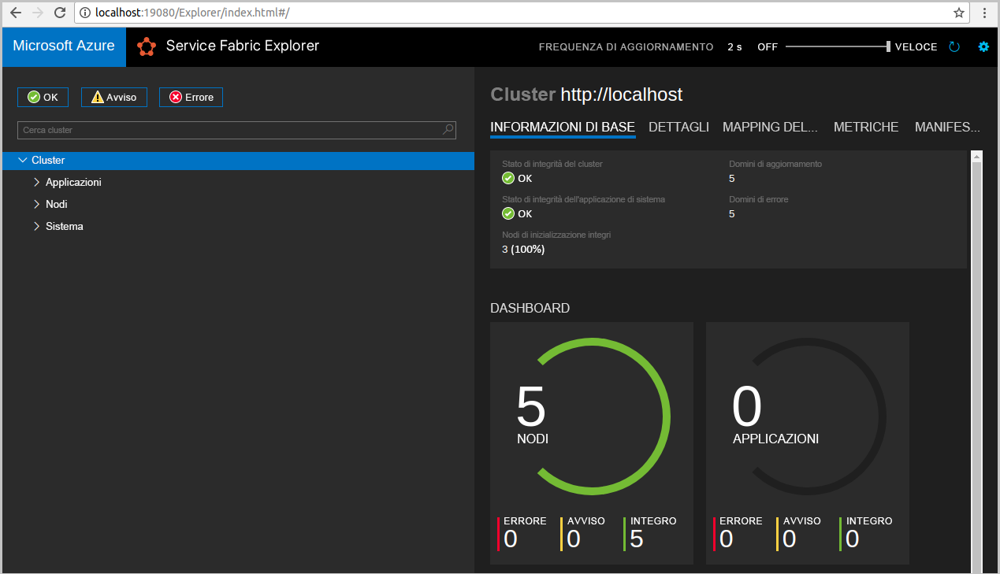
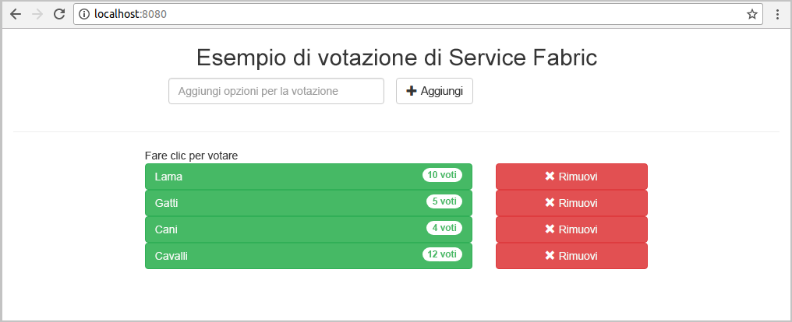
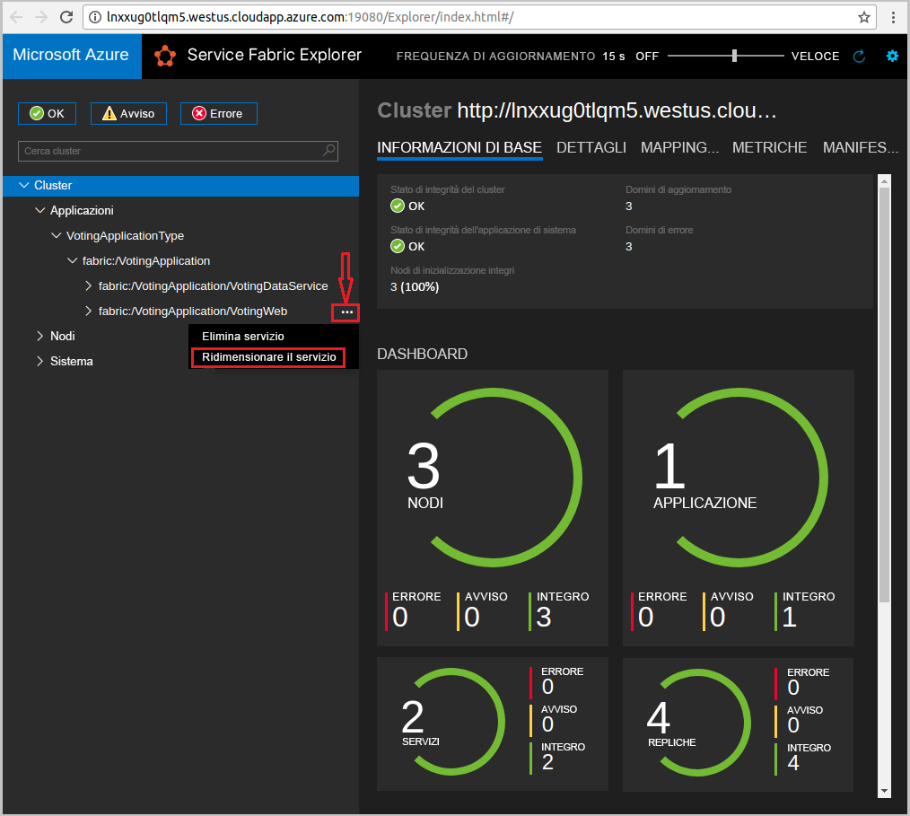
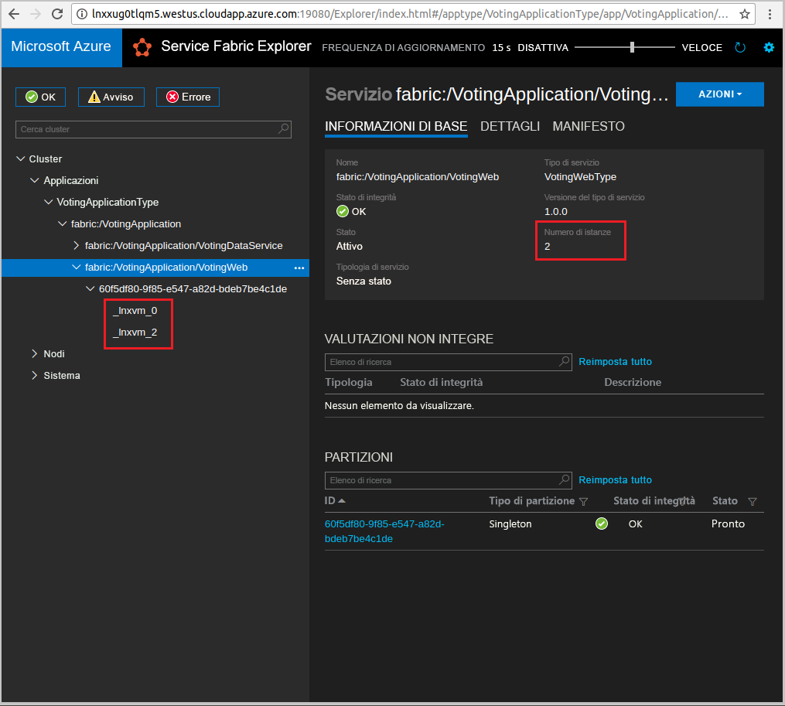

# <a name="quickstart--deploy-a-java-app-to-azure-service-fabric-on-linux"></a>Guida introduttiva:  Distribuire un'app Java in Azure Service Fabric in Linux

Questo argomento di avvio rapido illustra come distribuire un'applicazione Java in Azure Service Fabric usando l'IDE Eclipse in un computer di sviluppo Linux. Al termine, sarà disponibile un'applicazione di voto con un front-end Web Java che salva i risultati delle votazioni in un servizio back-end con stato nel cluster.

Azure Service Fabric è una piattaforma di sistemi distribuiti per la distribuzione e la gestione di microservizi e contenitori.

## <a name="prerequisites"></a>Prerequisiti

- [Ambiente Java](https://docs.microsoft.com/azure/service-fabric/service-fabric-get-started-linux#set-up-java-development) e [Yeoman](https://docs.microsoft.com/azure/service-fabric/service-fabric-get-started-linux#set-up-yeoman-generators-for-containers-and-guest-executables)
- [Eclipse Neon (4.6)+](https://www.eclipse.org/downloads/packages/) e [plug-in Eclipse per Service Fabric](https://docs.microsoft.com/azure/service-fabric/service-fabric-get-started-linux#install-the-eclipse-plug-in-optional)
- [Service Fabric SDK e l'interfaccia della riga di comando](https://docs.microsoft.com/azure/service-fabric/service-fabric-get-started-linux#installation-methods)
- [Git](https://git-scm.com/downloads)

## <a name="download-the-sample"></a>Scaricare l'esempio

In una finestra di comando eseguire il comando seguente per clonare il repository dell'app di esempio nel computer locale.

```bash
git clone https://github.com/Azure-Samples/service-fabric-java-quickstart.git
```

## <a name="run-the-application-locally"></a>Eseguire l'applicazione in locale

1. Avviare il cluster locale eseguendo il comando seguente:

    ```bash
    sudo /opt/microsoft/sdk/servicefabric/common/clustersetup/devclustersetup.sh
    ```
    L'avvio del cluster locale può richiedere tempo. Per verificare se il cluster è in esecuzione, accedere a Service Fabric Explorer in `http://localhost:19080`. I cinque nodi integri indicano che il cluster locale è in esecuzione.

    

2. Aprire Eclipse.
3. Selezionare **File** > **Import** (Importa)  > **Gradle** > **Existing Gradle Project** (Progetto Gradle esistente) e seguire la procedura guidata.
4. Selezionare **Directory** e scegliere la directory **Valutazione** nella cartella **service-fabric-java-quickstart** clonata da GitHub. Selezionare **Fine**.

    

5. A questo punto, il progetto `Voting` si trova nella finestra Package Explorer (Esplora pacchetti) di Eclipse.
6. Fare clic con il pulsante destro del mouse sul progetto e selezionare **Publish Application** (Pubblica applicazione) nell'elenco a discesa **Service Fabric**. Scegliere **PublishProfiles/Local.json** come profilo target e selezionare **Publish** (Pubblica).

    

7. Aprire il Web browser preferito e accedere all'applicazione tramite `http://localhost:8080`.

    

È ora possibile aggiungere un set di opzioni per le votazioni e iniziare a raccogliere i voti. L'applicazione viene eseguita e archivia tutti i dati nel cluster di Service Fabric, senza che sia necessario un database separato.



## <a name="scale-applications-and-services-in-a-cluster"></a>Ridimensionare applicazioni e servizi in un cluster

I servizi possono essere facilmente ridimensionati in un cluster per supportare le modifiche del carico sui servizi. È possibile ridimensionare un servizio modificando il numero di istanze in esecuzione nel cluster. Sono disponibili diversi sistemi per garantire il ridimensionamento dei servizi. È ad esempio possibile usare gli script o i comandi dell'interfaccia della riga di comando di Service Fabric (`sfctl`). I passaggi seguenti usano Service Fabric Explorer.

Service Fabric Explorer è in esecuzione in tutti i cluster di Service Fabric ed è accessibile da un browser passando alla porta di gestione HTTP (19080) del cluster. Ad esempio: `http://localhost:19080`.

Per ridimensionare il servizio front-end Web, seguire questa procedura:

1. Aprire Service Fabric Explorer nel cluster. Ad esempio: `https://localhost:19080`.
2. Selezionare i puntini di sospensione ( **...** ) accanto al nodo **fabric:/Voting/VotingWeb** nella visualizzazione ad albero e selezionare **Scale Service** (Ridimensiona servizio).

    

    Ora è possibile scegliere di modificare il numero di istanze del servizio front-end Web.

3. Impostare il numero su **2** e selezionare **Scale Service** (Ridimensiona servizio).
4. Selezionare il nodo **fabric:/Voting/VotingWeb** nella visualizzazione ad albero ed espandere il nodo della partizione (rappresentato da un GUID).

    

    È ora possibile vedere che il servizio dispone di due istanze. Nella visualizzazione ad albero viene indicato su quali nodi vengono eseguite le istanze.

Con questa semplice attività di gestione, sono state raddoppiate le risorse disponibili per il servizio front-end per l'elaborazione del carico utente. È importante comprendere che non sono necessarie più istanze di un servizio perché questo venga eseguito in modo affidabile. In caso di problemi di un servizio, Service Fabric assicura l'esecuzione di una nuova istanza del servizio nel cluster.

## <a name="next-steps"></a>Passaggi successivi

In questa guida introduttiva si è appreso come:

* Usare Eclipse come strumento per le applicazioni Java di Service Fabric
* Distribuire le applicazioni Java nel cluster locale
* Scalare orizzontalmente l'applicazione in più nodi

Per altre informazioni sull'uso di app Java in Service Fabric, continuare con l'esercitazione sulle app Java.

> [!div class="nextstepaction"]
> [Distribuire un'app Java](./service-fabric-tutorial-create-java-app.md)
