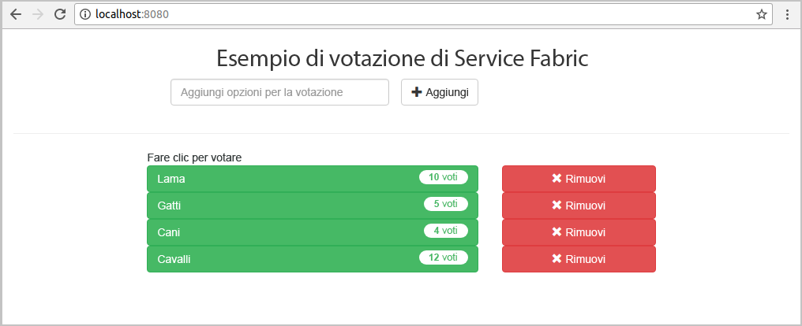
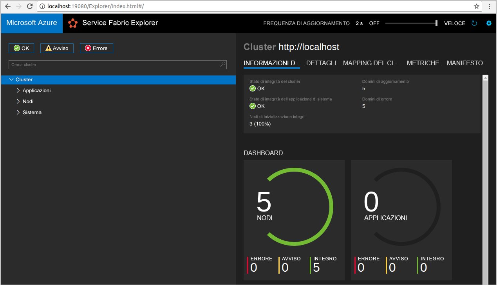
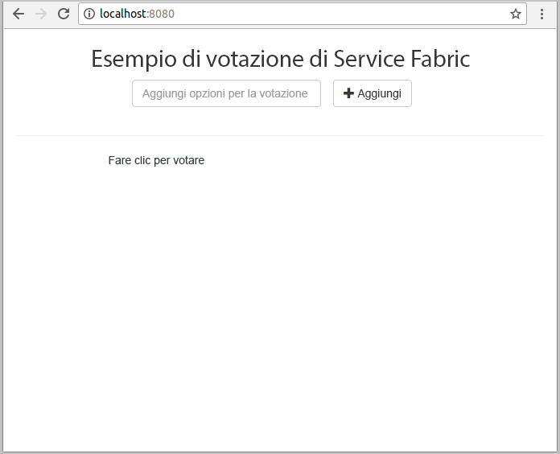
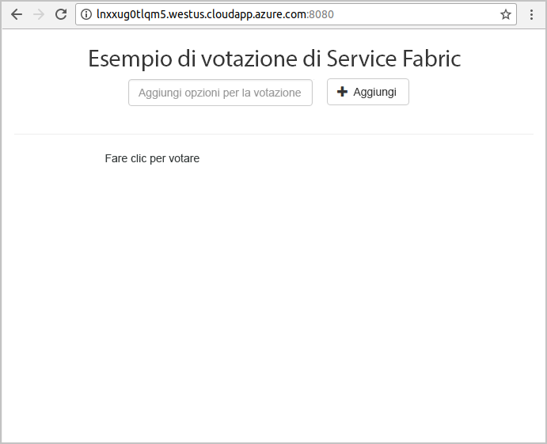
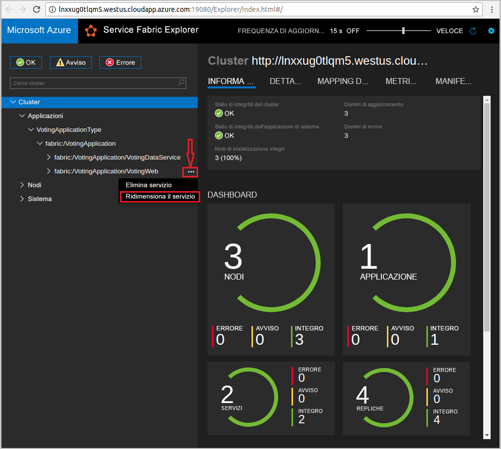
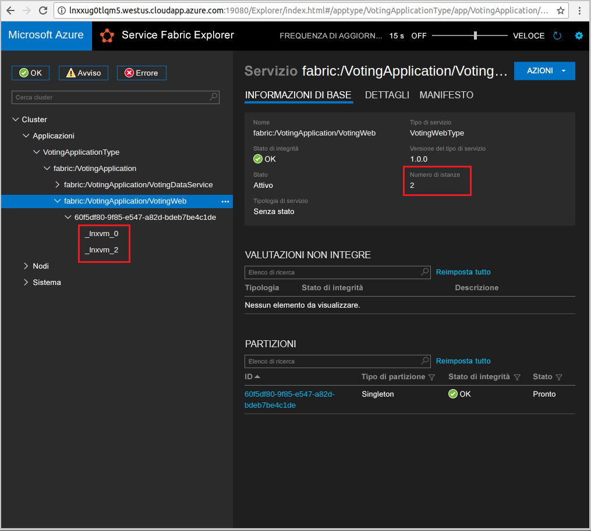

# <a name="create-a-java-application"></a>Creare un'applicazione Java
Azure Service Fabric è una piattaforma di sistemi distribuiti per la distribuzione e la gestione di microservizi e contenitori. 

In questa guida introduttiva viene illustrato come distribuire l'applicazione Java in Service Fabric tramite l'IDE Eclipse in un computer di sviluppo Linux. Al termine, sarà disponibile un'applicazione di voto con un front-end Web Java che salva i risultati delle votazioni in un servizio back-end con stato nel cluster.



In questa guida introduttiva si apprende come:

> [!div class="checklist"]
> * Usare Eclipse come strumento per le applicazioni Java di Service Fabric
> * Distribuire l'applicazione nel cluster locale 
> * Distribuire l'applicazione in un cluster in Azure
> * Scalare orizzontalmente l'applicazione in più nodi

## <a name="prerequisites"></a>Prerequisiti
Per completare questa guida introduttiva:
1. [Installare Service Fabric SDK e l'interfaccia della riga di comando di Service Fabric](https://docs.microsoft.com/en-us/azure/service-fabric/service-fabric-get-started-linux#installation-methods)
2. [Installare Git](https://git-scm.com/)
3. [Installare Eclipse](https://www.eclipse.org/downloads/)
4. [Configurare l'ambiente Java](https://docs.microsoft.com/en-us/azure/service-fabric/service-fabric-get-started-linux#set-up-java-development), assicurandosi di seguire i passaggi facoltativi per installare il plug-in Eclipse 

## <a name="download-the-sample"></a>Scaricare l'esempio
In una finestra di comando eseguire il comando seguente per clonare il repository dell'app di esempio nel computer locale.
```
git clone https://github.com/Azure-Samples/service-fabric-java-quickstart.git
```

## <a name="run-the-application-locally"></a>Eseguire l'applicazione in locale
1. Avviare il cluster locale eseguendo il comando seguente:

    ```bash
    sudo /opt/microsoft/sdk/servicefabric/common/clustersetup/devclustersetup.sh
    ```
    L'avvio del cluster locale può richiedere tempo. Per verificare se il cluster è in esecuzione, accedere a Service Fabric Explorer in **http://localhost:19080**. I cinque nodi integri indicano che il cluster locale è in esecuzione. 
    
    

2. Aprire Eclipse.
3. Fare clic su File -> Open Projects from File System (Apri progetti da file system). 
4. Fare clic su Directory e scegliere la directory `Voting` nella cartella `service-fabric-java-quickstart` clonata da Github. Fare clic su Finish. 

    
    
5. A questo punto, il progetto `Voting` si trova nella finestra Package Explorer (Esplora pacchetti) di Eclipse. 
6. Fare clic con il pulsante destro del mouse sul progetto e selezionare **Publish Application** (Pubblica applicazione) nell'elenco a discesa **Service Fabric**. Scegliere **PublishProfiles/Local.json** come profilo target e fare clic su Publish (Pubblica). 

    
    
7. Aprire il Web browser preferito e accedere all'applicazione tramite **http://localhost:8080**. 

    
    
È ora possibile aggiungere un set di opzioni per le votazioni e iniziare a raccogliere i voti. L'applicazione viene eseguita e archivia tutti i dati nel cluster di Service Fabric, senza che sia necessario un database separato.

## <a name="deploy-the-application-to-azure"></a>Distribuzione dell'applicazione in Azure

### <a name="set-up-your-azure-service-fabric-cluster"></a>Configurare il cluster di Azure Service Fabric
Per distribuire l'applicazione in un cluster in Azure, creare il proprio cluster o usare un party cluster.

I party cluster sono cluster di Service Fabric gratuiti disponibili per un periodo di tempo limitato, ospitati in Azure. Sono gestiti dal team di Service Fabric e consentono a chiunque di distribuirvi applicazioni e imparare a usare la piattaforma. Per ottenere l'accesso a un cluster di entità, [seguire le istruzioni](http://aka.ms/tryservicefabric). 

Per informazioni sulla creazione di un cluster, vedere [Creare il primo cluster di Service Fabric di Azure](service-fabric-get-started-azure-cluster.md).

> [!Note]
> Il servizio front-end Web è configurato per l'ascolto del traffico in ingresso sulla porta 8080. Assicurarsi che tale porta sia aperta nel cluster. Se si usa il cluster di entità, questa porta è aperta.
>

### <a name="deploy-the-application-using-eclipse"></a>Distribuire l'applicazione tramite Eclipse
Ora che l'applicazione e il cluster sono pronti, è possibile procedere alla distribuzione in un cluster direttamente da Eclipse.

1. Aprire il file **Cloud.json** nella directory **PublishProfiles** e compilare i campi `ConnectionIPOrURL` e `ConnectionPort` in modo appropriato. Di seguito è illustrato un esempio: 

    ```bash
    {
         "ClusterConnectionParameters": 
         {
            "ConnectionIPOrURL": "lnxxug0tlqm5.westus.cloudapp.azure.com",
            "ConnectionPort": "19080",
            "ClientKey": "",
            "ClientCert": ""
         }
    }
    ```

2. Fare clic con il pulsante destro del mouse sul progetto e selezionare **Publish Application** (Pubblica applicazione) nell'elenco a discesa **Service Fabric**. Scegliere **PublishProfiles/Cloud.json** come profilo target e fare clic su Publish (Pubblica). 

    

3. Aprire il Web browser preferito e accedere all'applicazione tramite **http://\<ConnectionIPOrURL>:8080**. 

    
    
## <a name="scale-applications-and-services-in-a-cluster"></a>Ridimensionare applicazioni e servizi in un cluster
I servizi possono essere facilmente ridimensionati in un cluster per supportare le modifiche del carico sui servizi. È possibile ridimensionare un servizio modificando il numero di istanze in esecuzione nel cluster. Sono disponibili diversi sistemi per garantire la scalabilità dei servizi: è infatti possibile usare gli script o i comandi dell'interfaccia della riga di comando di Service Fabric (sfctl). In questo esempio verrà usato Service Fabric Explorer.

Service Fabric Explorer è in esecuzione in tutti i cluster di Service Fabric ed è accessibile da un browser, passando alla porta di gestione HTTP (19080) del cluster, ad esempio `http://lnxxug0tlqm5.westus.cloudapp.azure.com:19080`.

Per scalare il servizio front-end Web, seguire questa procedura:

1. Aprire Service Fabric Explorer nel cluster, ad esempio `http://lnxxug0tlqm5.westus.cloudapp.azure.com:19080`.
2. Fare clic sui puntini di sospensione accanto al nodo **fabric:/Voting/VotingWeb** nella visualizzazione ad albero e scegliere **Scale Service** (Ridimensiona servizio).

    

    Ora è possibile scegliere di modificare il numero di istanze del servizio front-end Web.

3. Impostare il numero su **2** e fare clic su **Scale Service** (Ridimensiona servizio).
4. Fare clic sul nodo **fabric:/Voting/VotingWeb** nella visualizzazione ad albero ed espandere il nodo della partizione (rappresentato da un GUID).

    

    È ora possibile vedere che il servizio dispone di due istanze. Nella visualizzazione ad albero viene indicato su quali nodi vengono eseguite le istanze.

Con questa semplice attività di gestione abbiamo raddoppiato le risorse disponibili per il servizio front-end per l'elaborazione del carico utente. È importante comprendere che non sono necessarie più istanze di un servizio perché questo venga eseguito in modo affidabile. In caso di problemi di un servizio, Service Fabric assicura l'esecuzione di una nuova istanza del servizio nel cluster.

## <a name="next-steps"></a>Passaggi successivi
In questa guida introduttiva si è appreso come:

> [!div class="checklist"]
> * Usare Eclipse come strumento per le applicazioni Java di Service Fabric
> * Distribuire le applicazioni Java nel cluster locale 
> * Distribuire le applicazioni Java in un cluster in Azure
> * Scalare orizzontalmente l'applicazione in più nodi

* Altre informazioni sui [servizi di debug in Java tramite Eclipse](service-fabric-debugging-your-application-java.md)
* Altre informazioni sulla [configurazione di integrazione e distribuzione continue tramite Jenkins](service-fabric-cicd-your-linux-java-application-with-jenkins.md)
* Fare riferimento ad altri [esempi di Java](https://github.com/Azure-Samples/service-fabric-java-getting-started)