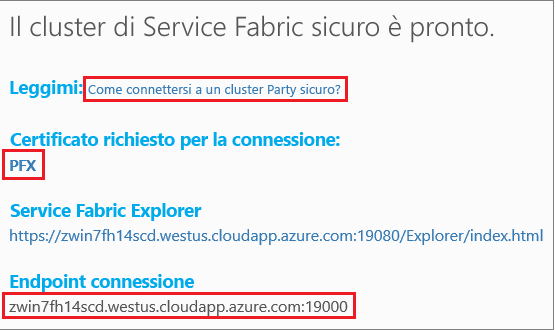

# <a name="tutorial-deploy-a-service-fabric-application-to-a-cluster-in-azure"></a>Esercitazione: Distribuire un'applicazione Service Fabric in un cluster in Azure

Questa è la seconda di una serie di esercitazioni. Illustra come distribuire un'applicazione Azure Service Fabric in un nuovo cluster in Azure.

In questa esercitazione si apprenderà come:
> [!div class="checklist"]
> * Creare un party cluster.
> * Distribuire un'applicazione in un cluster remoto tramite Visual Studio.

In questa serie di esercitazioni si apprenderà come:
> [!div class="checklist"]
> * [Creare un'applicazione di Service Fabric .NET](service-fabric-tutorial-create-dotnet-app.md).
> * Distribuire l'applicazione in un cluster remoto.
> * [Aggiungere un endpoint HTTPS a un servizio front-end ASP.NET Core](service-fabric-tutorial-dotnet-app-enable-https-endpoint.md).
> * [Configurare l'integrazione continua e la distribuzione continua con Azure Pipelines](service-fabric-tutorial-deploy-app-with-cicd-vsts.md).
> * [Configurare il monitoraggio e la diagnostica per l'applicazione](service-fabric-tutorial-monitoring-aspnet.md).

## <a name="prerequisites"></a>Prerequisiti

Prima di iniziare questa esercitazione:

* Se non si ha una sottoscrizione di Azure, creare un [account gratuito](https://azure.microsoft.com/free/?WT.mc_id=A261C142F).
* [Installare Visual Studio 2017](https://www.visualstudio.com/) e installare i carichi di lavoro **Sviluppo di Azure** e **Sviluppo ASP.NET e Web**.
* [Installare Service Fabric SDK](service-fabric-get-started.md).

## <a name="download-the-voting-sample-application"></a>Scaricare l'applicazione di voto di esempio

Se non si è creata l'applicazione di voto di esempio nella [prima parte di questa serie di esercitazioni](service-fabric-tutorial-create-dotnet-app.md), è possibile scaricarla. In una finestra di comando eseguire il codice seguente per clonare il repository dell'app di esempio nel computer locale.

```git
git clone https://github.com/Azure-Samples/service-fabric-dotnet-quickstart 
```

## <a name="publish-to-a-service-fabric-cluster"></a>Eseguire la pubblicazione in un cluster di Service Fabric

Ora che l'applicazione è pronta, è possibile distribuirla in un cluster direttamente da Visual Studio. Un [cluster di Service Fabric](https://docs.microsoft.com/azure/service-fabric/service-fabric-deploy-anywhere) è un set di computer fisici o macchine virtuali connesse tramite rete in cui vengono distribuiti e gestiti i microservizi.

Per questa esercitazione sono disponibili due opzioni per distribuire l'applicazione di voto in un cluster di Service Fabric con Visual Studio:

* Eseguire la pubblicazione in un party cluster di prova. 
* Eseguire la pubblicazione in un cluster esistente nella sottoscrizione. È possibile creare cluster di Service Fabric tramite il [portale di Azure](https://portal.azure.com), usando [PowerShell](./scripts/service-fabric-powershell-create-secure-cluster-cert.md) oppure script dell'[interfaccia della riga di comando di Azure](./scripts/cli-create-cluster.md) o da un [modello di Azure Resource Manager](service-fabric-tutorial-create-vnet-and-windows-cluster.md).

> [!NOTE]
> Molti servizi usano il proxy inverso per comunicare tra loro. Nei cluster creati da Visual Studio e nei party cluster, il proxy inverso è abilitato per impostazione predefinita. Se si usa un cluster esistente, è necessario [abilitare il proxy inverso nel cluster](service-fabric-reverseproxy-setup.md).


### <a name="find-the-voting-web-service-endpoint-for-your-azure-subscription"></a>Trovare l'endpoint del servizio Web di voto per la sottoscrizione di Azure

Per pubblicare l'applicazione di voto nella propria sottoscrizione di Azure, trovare l'endpoint del servizio Web front-end. Se si usa un party cluster, connettersi alla porta 8080 usando l'esempio di voto aperto automaticamente. Non è necessario configurarlo nel servizio di bilanciamento del carico del party cluster.

Il servizio Web front-end è in ascolto su una porta specifica. Quando l'applicazione viene distribuita in un cluster in Azure, sia il cluster che l'applicazione vengono eseguiti dietro un servizio di bilanciamento del carico di Azure. Per aprire la porta dell'applicazione è necessaria una regola di Azure Load Balancer per il cluster. La porta aperta invia il traffico in ingresso al servizio Web. La porta è indicata nel file **VotingWeb/PackageRoot/ServiceManifest.xml** nell'elemento **Endpoint**. Un esempio è la porta 8080.

```xml
<Endpoint Protocol="http" Name="ServiceEndpoint" Type="Input" Port="8080" />
```

Per la sottoscrizione di Azure, aprire questa porta usando una regola di bilanciamento del carico in Azure tramite uno [script di PowerShell](./scripts/service-fabric-powershell-open-port-in-load-balancer.md) oppure mediante il servizio di bilanciamento del carico per il cluster nel [portale di Azure](https://portal.azure.com).

### <a name="join-a-party-cluster"></a>Aggiungere un party cluster

> [!NOTE]
>  Per pubblicare l'applicazione nel proprio cluster in una sottoscrizione di Azure, passare alla sezione [Pubblicare l'applicazione con Visual Studio](#publish-the-application-by-using-visual-studio). 

I cluster di entità sono cluster di Service Fabric gratuiti disponibili per un periodo di tempo limitato, ospitati in Azure ed eseguiti dal team di Service Fabric. Chiunque può distribuire applicazioni e ottenere informazioni sulla piattaforma. Il cluster usa un solo certificato autofirmato per la sicurezza da nodo a nodo e da client a nodo.

Eseguire l'accesso e [aggiungere un cluster Windows](https://aka.ms/tryservicefabric). Per scaricare il certificato PFX nel computer, selezionare il collegamento **PFX**. Fare clic sul collegamento **How to connect to a secure Party cluster?** (Come connettersi a un party cluster sicuro?) e copiare la password del certificato. Il certificato, la password del certificato e il valore dell'**endpoint di connessione** vengono usati nei passaggi seguenti.



> [!Note]
> È disponibile un numero limitato di party cluster ogni ora. Se si verifica un errore quando si prova a registrarsi per un party cluster, attendere e riprovare. In alternativa, seguire questi passaggi nell'esercitazione [Distribuire un'app .NET](https://docs.microsoft.com/azure/service-fabric/service-fabric-tutorial-deploy-app-to-party-cluster#deploy-the-sample-application) per creare un cluster di Service Fabric nella sottoscrizione di Azure e distribuirvi l'applicazione. Se non si ha già una sottoscrizione di Azure, è possibile creare un [account gratuito](https://azure.microsoft.com/free/?WT.mc_id=A261C142F).
>

Nel computer Windows in uso installare il certificato PFX nell'archivio certificati **CurrentUser\My**.

```powershell
PS C:\mycertificates> Import-PfxCertificate -FilePath .\party-cluster-873689604-client-cert.pfx -CertStoreLocation Cert:\CurrentUser\My -Password (ConvertTo-SecureString 873689604 -AsPlainText -Force)


   PSParentPath: Microsoft.PowerShell.Security\Certificate::CurrentUser\My

Thumbprint                                Subject
----------                                -------
3B138D84C077C292579BA35E4410634E164075CD  CN=zwin7fh14scd.westus.cloudapp.azure.com
```

Ricordare l'identificazione personale per il passaggio seguente.

> [!Note]
> Per impostazione predefinita, il servizio front-end Web è configurato per l'ascolto del traffico in ingresso sulla porta 8080. La porta 8080 è aperta nel party cluster. Se è necessario cambiare la porta dell'applicazione, sostituirla con una delle porte aperte nel party cluster.
>

### <a name="publish-the-application-by-using-visual-studio"></a>Pubblicare l'applicazione con Visual Studio

Ora che l'applicazione è pronta, è possibile distribuirla in un cluster direttamente da Visual Studio.

1. Fare clic con il pulsante destro del mouse su **Voting** in Esplora soluzioni. Scegliere **Publish** (Pubblica). Viene visualizzata la finestra di dialogo **Pubblica**.

2. Copiare l'**endpoint di connessione** dalla pagina del party cluster o dalla sottoscrizione di Azure al campo **Endpoint connessione**. Un esempio è `zwin7fh14scd.westus.cloudapp.azure.com:19000`. Selezionare **Parametri di connessione avanzati**.  Verificare che i valori di **FindValue** e **ServerCertThumbprint** corrispondano all'identificazione personale del certificato installato in un passaggio precedente per un party cluster o del certificato corrispondente alla sottoscrizione di Azure.

    

    Ogni applicazione nel cluster deve avere un nome univoco. Un party cluster è un ambiente pubblico condiviso e potrebbe verificarsi un conflitto con un'applicazione esistente. Se è presente un conflitto di nomi, rinominare il progetto di Visual Studio e distribuirlo di nuovo.

3. Selezionare **Pubblica**.

4. Per passare all'applicazione di voto nel cluster, aprire un browser e digitare l'indirizzo del cluster seguito da **:8080**. In alternativa immettere un'altra porta, se ne è stata configurata una. Un esempio è `http://zwin7fh14scd.westus.cloudapp.azure.com:8080`. Viene visualizzata l'applicazione in esecuzione nel cluster in Azure. Nella pagina Web dell'applicazione di voto provare ad aggiungere ed eliminare opzioni di voto e a votare una o più di queste opzioni.

    


## <a name="next-steps"></a>Passaggi successivi

Passare all'esercitazione successiva:
> [!div class="nextstepaction"]
> [Abilitare HTTPS](service-fabric-tutorial-dotnet-app-enable-https-endpoint.md)
