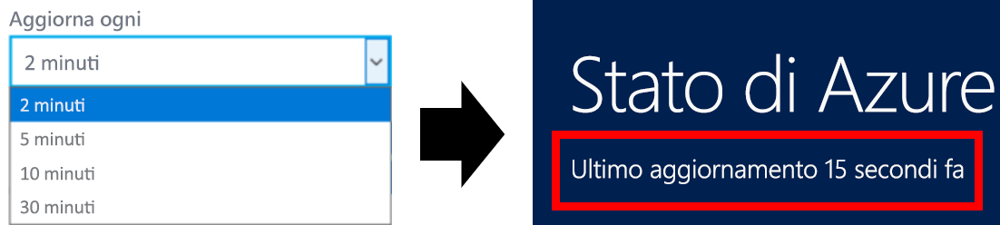

# Stato di Azure
Lo [stato di Azure](https://azure.microsoft.com/status/) offre una visualizzazione globale dell'integrità dei servizi di Azure. Con lo stato di Azure è possibile ottenere informazioni aggiornate sulla disponibilità del servizio. Chiunque disponga dell'accesso allo stato di Azure e possa visualizzare tutti i servizi che segnalano lo stato di integrità del servizio. 

## Aggiornamenti dello stato di Azure
La pagina relativa allo stato di Azure viene aggiornata in tempo reale quando l'integrità dei servizi di Azure cambia. Lasciando la pagina dello stato di Azure aperta è possibile controllare la frequenza con cui la pagina viene aggiornata con i nuovi dati. Nella parte superiore è possibile visualizzare l'ora dell'ultimo aggiornamento della pagina.

## Cronologia dello stato di Azure
Mentre la pagina relativa allo stato di Azure mostra sempre i dati sull'integrità più recenti, è possibile visualizzare gli eventi meno recenti usando la [pagina della cronologia dello stato di Azure](https://azure.microsoft.com/status/history/).

Qui è possibile visualizzare gli eventi dei 90 giorni precedenti, incluso una causa radice preliminare, la mitigazione dei rischi e i passaggi successivi in Azure.

## Feed RSS
Lo stato di Azure offre anche un [feed RSS](https://azure.microsoft.com/status/feed/) delle modifiche all'integrità dei servizi di Azure che è possibile sottoscrivere.

## Passaggi successivi
* Informazioni su come ottenere una visualizzazione più personalizzata dello stato di integrità di Azure tramite [Integrità dei servizi](./service-health-overview.md).
* Informazioni su come ottenere una visualizzazione più dettagliata dello stato di integrità di risorse di Azure specifiche tramite [Integrità risorsa](./resource-health-overview.md).
