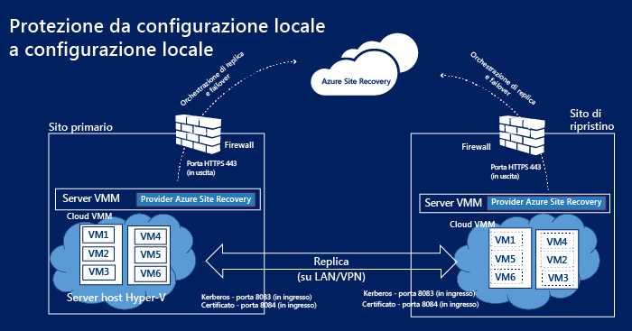
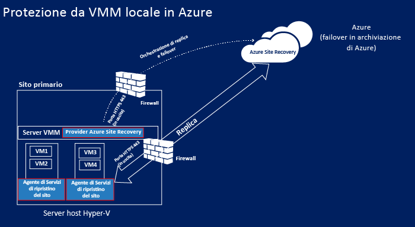
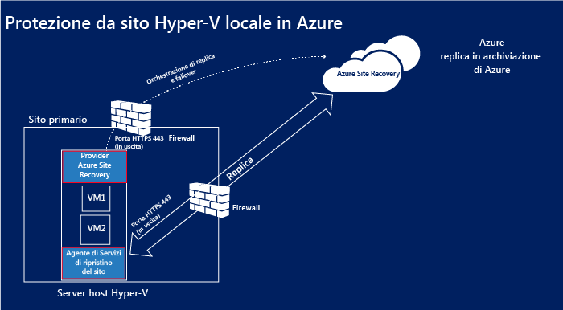
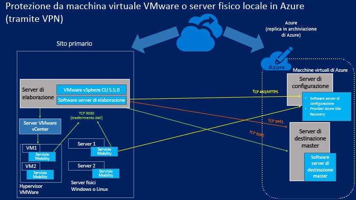
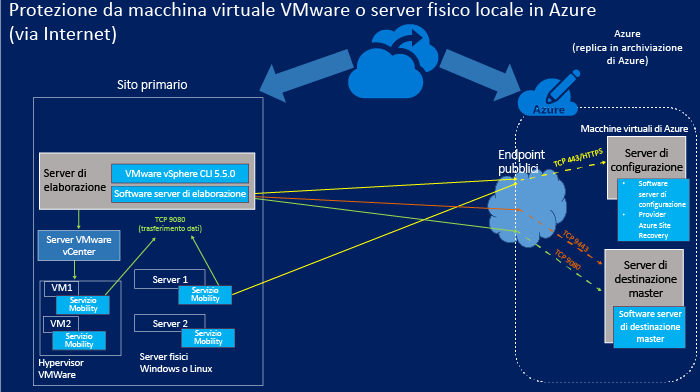

<properties
	pageTitle="Componenti di Ripristino sito"
	description="In questo articolo viene fornita una panoramica dei componenti di Ripristino sito e di come gestirli"
	services="site-recovery"
	documentationCenter=""
	authors="rayne-wiselman"
	manager="jwhit"
	editor=""/>

<tags
	ms.service="site-recovery"
	ms.workload="backup-recovery"
	ms.tgt_pltfrm="na"
	ms.devlang="na"
	ms.topic="get-started-article"
	ms.date="08/10/2015"
	ms.author="raynew"/>

# Componenti di Ripristino sito

Azure Site Recovery favorisce l'attuazione della strategia di continuità aziendale e ripristino di emergenza orchestrando le operazioni di replica, failover e ripristino delle macchine virtuali e dei server fisici. È possibile replicare i computer in Azure o in un data center locale secondario. [Leggere i cenni preliminari](site-recovery-overview.md).

In questo articolo vengono riepilogati e vengono descritti i componenti di Ripristino sito installati nei server e nelle macchine virtuali.

È possibile pubblicare eventuali domande su questo articolo nel [forum relativo ai servizi di ripristino di Azure](https://social.msdn.microsoft.com/forums/azure/home?forum=hypervrecovmgr).

## Panoramica

I componenti di Ripristino sito variano leggermente a seconda dello scenario di protezione.

### Protezione tra due data center con VMM

**Scenario** | **Descrizione** | **Componenti richiesti** | **Dettagli**
--- | --- | --- | ---
Distribuire Azure Site Recovery per replicare le macchine virtuali tra due data center | 
Ogni data center ha un server VMM

Ogni server VMM dispone di un cloud privato che contiene uno o più server host Hyper-V con le macchine virtuali da proteggere
 | Il provider di Azure Site Recovery viene installato in ciascun server VMM | 
Nessun componente è installato nei server host Hyper-V o nelle macchine virtuali protette

Il provider di Azure Site Recovery nel server VMM comunica con il servizio Ripristino sito tramite HTTPS 443 per gestire la protezione

La replica viene eseguita tra i server host Hyper-V primario e secondario in Internet utilizzando Kerberos e l'autenticazione dei certificati sulle porte 8083 e 8084.

### Protezione tra un data center con VMM e Azure

**Scenario** | **Descrizione** | **Componenti richiesti** | **Dettagli**
--- | --- | --- | ---
Distribuire Azure Site Recovery per replicare le macchine virtuali tra un data center e Azure | 
Il data center locale ha un server VMM con un cloud privato che contiene uno o più server host Hyper-V con le macchine virtuali da proteggere
 | 
Il provider di Azure Site Recovery viene installato nel server VMM

L’agente di Servizi di ripristino di Microsoft viene installato nei server host Hyper-V di origine
 | 
Nessun componente è installato nelle macchine virtuali protette

Il provider di Azure Site Recovery nel server VMM comunica con il servizio Ripristino sito tramite HTTPS 443 per gestire la protezione

La replica viene eseguita tra l’agente di Servizi di ripristino di Microsoft in esecuzione nei server host Hyper-V di origine e Azure su HTTPS 443.

###  Protezione tra un sito Hyper-V e Azure

**Scenario** | **Descrizione** | **Componenti richiesti** | **Dettagli**
--- | --- | --- | ---
Distribuire Azure Site Recovery per replicare le macchine virtuali tra un data center e Azure | 
Il data center locale dispone di uno o più server host Hyper-V con le macchine virtuali da proteggere

Durante la configurazione è possibile definire un sito Hyper-V che contiene uno o più server host Hyper-V
 | 
Viene eseguita l’installazione di un singolo componente per installare il provider di Azure Site Recovery e l'agente di Servizi di ripristino di Microsoft nei server host Hyper-V
 | 
Nessun server VMM nella distribuzione

Nessun componente è installato nelle macchine virtuali protette

Il provider di Azure Site Recovery nel server host Hyper-V comunica con il servizio Ripristino sito tramite HTTPS 443 per gestire la protezione

La replica viene eseguita tra l’agente di Servizi di ripristino di Microsoft in esecuzione nel server host Hyper-V e Azure su HTTPS 443.

### Protezione tra un server fisico locale o una macchina virtuale VMWare e Azure

In questo scenario la replica può verificarsi in due modi:

- Su una connessione VPN (utilizzando Azure ExpressRoute o una VPN da sito a sito)
- Su una connessione sicura in Internet

#### Su una connessione VPN da sito a sito (o ExpressRoute)

Le comunicazioni dai server locali vengono indirizzate alle porte interne sulla rete virtuale di Azure a cui sono connesse le macchine virtuali master di destinazione e di configurazione.

#### In internet

Tutte le comunicazioni dai server locali vengono indirizzate agli endpoint pubblici di cui è stato eseguito il mapping nel servizio cloud di Azure per la macchina virtuale server di configurazione e la macchina virtuale server master di destinazione. Gli endpoint vengono creati dinamicamente quando si distribuiscono le macchine virtuali.

#### Porte

**Componente** | **Porta** | **Dettagli**
--- | --- | --- | ---
**Server di elaborazione** |9080 | I computer protetti inviano i dati per la replica al server di elaborazione su TCP 9080.
**Server di configurazione** | HTTPS/443 | Il servizio di mobilità in esecuzione nel computer protetto invia i metadati della replica al server di configurazione sulla porta 443.
 | HTTPS/443 | Il server di configurazione coordina e gestisce la protezione del computer. Il server di elaborazione comunica con il server di configurazione su 443 o sull'endpoint pubblico di cui è stato eseguito il mapping per ricevere le informazioni di gestione e controllo.
 | 9443 | Nella direzione di failback, lo strumento vContinuum richiede controllo e i metadati dal server di configurazione sulla porta 9443 (non presente nel diagramma)
 | 5986 | La gestione remota con PowerShell usa la porta 5986 (non presente nel diagramma)
 | 3389 | La connessione RDP al server di configurazione utilizzando 3389 (non presente nel diagramma)
**Server master di destinazione** | 80 | Il sito di elaborazione invia le comunicazioni sul traffico di replica al server master di destinazione su 9080
 | HTTP/443 | Il server di elaborazione replica i dati al server master di destinazione tramite HTTP o 443 (VPN)
 | HTTP/443 | Il server di elaborazione replica i dati al server master di destinazione tramite HTTP o 443 (VPN)
**Regole del firewall** | | 
Per il funzionamento corretto dell’installazione push del servizio di mobilità, è necessario che nel firewall del computer protetto siano abilitate le opzioni Condivisione file e stampanti e Strumentazione gestione Windows.

Le regole del firewall dei computer da proteggere devono permettere di raggiungere il server di configurazione.

Per connettersi alle macchine virtuali di Azure su Internet dopo il failover, le regole del firewall dei computer devono consentire le connessioni Desktop remoto tramite Internet. Per connettersi a un computer Linux di cui è stato eseguito il failover in Azure, il servizio Secure Shell deve essere impostato per l’avvio automatico nel sistema e le regole del firewall devono consentire una connessione ssh.

## Componenti di Ripristino sito

**Componente** | **Dettagli** | **Installazione** | **Scenario di distribuzione**
--- | --- | --- | ---
**Provider di Azure Site Recovery per VMM** | Gestisce le comunicazioni tra il server VMM e il servizio Ripristino sito. | Installato in un server VMM | Usato quando si imposta la protezione tra due siti VMM o tra un sito VMM e Azure.
**Provider di Azure Site Recovery per Hyper-V** | Gestisce le comunicazioni tra l'host Hyper-V e il servizio Ripristino sito quando VMM non è distribuito. | Installato in un server host Hyper-V | Utilizzato quando si imposta la protezione tra un sito Hyper-V e Azure.
**Agente di Servizi di ripristino di Microsoft** | Gestisce le comunicazioni tra il server host Hyper-V e il servizio Ripristino sito. | Installato in un server host Hyper-V | 
Usato quando si imposta la protezione tra un sito Hyper-V e Azure.

Download di un unico provider che include il provider di Azure Site Recovery per Hyper-V e l'agente di Servizi di ripristino di Microsoft.

**Server di elaborazione/Server di elaborazione failback** | 
Ottimizza i dati dai computer VMware protetti o dal server fisico Windows/Linux prima di inviarli al server master di destinazione in Azure

Esegue l’installazione push del servizio di mobilità nelle macchine virtuali VMware o nei server fisici

Esegue il rilevamento automatico delle macchine virtuali VMware.
 
Server di elaborazione failback: solo il primo punto dell'ottimizzazione dei dati prima della replica è applicabile per il server di elaborazione failback
 | 
Installato in un server locale con almeno Windows Server 2012 R2

Server di elaborazione failback: viene eseguito in una macchina virtuale di Azure di dimensione standard A4
 | 
Usato quando si imposta la protezione tra un server fisico locale o le macchine virtuali VMware e Azure.

Server di elaborazione failback: usato per il failback da Azure in locale

**Servizio Mobility** | Acquisisce le modifiche nei computer protetti e le comunica al server di elaborazione locale per la replica in Azure. | Installato nelle macchine virtuali VMware locali o nei server fisici da proteggere| Usato quando si imposta la protezione tra un server fisico locale o le macchine virtuali VMWare e Azure.
**Server master di destinazione/Server master di destinazione failback** | 
Contiene i dati replicati dai computer protetti tramite VHD collegati e creati nell'archivio BLOB dell'account di archiviazione di Azure in uso

Server master di destinazione failback: contiene i dati di replica delle macchine virtuali di cui è stato eseguito il failover in Azure. I dati sono contenuti in VMDK creati nell'archivio dati selezionato quando è abilitata la replica inversa per il failback.
 | 
Installato come macchina virtuale di Azure, come server Windows basato su un'immagine della raccolta di Windows Server 2012 R2 (per proteggere i computer Windows) o come server Linux basato su un'immagine della raccolta di OpenLogic CentOS 6.6 (per proteggere i computer Linux)

Per le dimensioni sono disponibili due opzioni: standard A3 e standard D14

Server master di destinazione failback: viene eseguito in una macchina virtuale VMware. Viene sottoposto al provisioning nello stesso host per cui si verifica il failback del computer.
| 
Usato quando si imposta la protezione tra un server fisico locale o le macchine virtuali VMware e Azure.

Server master di destinazione failback: usato per il failback del failover virtuale da Azure a locale.

**Server di configurazione** | 
Coordina le comunicazioni tra i computer protetti, il server di elaborazione e i server mater di destinazione in Azure

Imposta la replica e coordina il ripristino in Azure quando si verifica il failover
 | Installato in una macchina virtuale di Azure standard A3 nella stessa sottoscrizione di Azure Site Recovery. | Usato quando si imposta la protezione tra un server fisico locale o le macchine virtuali VMWare e Azure.

## Pianificazione della distribuzione dei componenti

### Provider di Azure Site Recovery

Il provider viene eseguito nei server VMM, nei server host Hyper-V se non si dispone di un server VMM nella distribuzione o in un server di configurazione. Si connette al servizio Ripristino sito tramite Internet, mediante una connessione HTTPS crittografata. Si noti che:

- Non è necessario aggiungere un’eccezione del firewall specifica per connettere il provider a Ripristino sito.
- Se si desidera che il server in cui il provider viene eseguito si connetta a Internet tramite un server proxy, è possibile utilizzare le impostazioni del proxy esistente oppure specificare un proxy personalizzato.
- Il proxy deve autorizzare questi indirizzi attraverso il firewall:

	-  **.accesscontrol.windows.net
-  .backup.windowsazure.com
	-  **.blob.core.windows.net
-  **.store.core.windows.net

- Se nel firewall sono disponibili le regole basate sull'indirizzo IP, verificare che autorizzino la comunicazione tra il server di configurazione e gli indirizzi IP descritti in [Intervalli IP dei data center di Azure](https://www.microsoft.com/download/details.aspx?id=41653) e per HTTPS (443). È necessario inserire in un elenco di elementi consentiti gli indirizzi IP compresi negli intervalli dell'area di Azure che si prevede di utilizzare e per Stati Uniti occidentali.
- Se si distribuisce Site Recovery con VMM e si utilizza un proxy personalizzato, verrà creato automaticamente un account RunAs VMM (DRAProxyAccount) utilizzando le credenziali proxy specificate nelle impostazioni del proxy personalizzato nel portale di Site Recovery. È necessario configurare il server proxy in modo che l'account possa eseguire correttamente l'autenticazione.
- Se si utilizza il traffico proxy inviato dal provider installato in un server host Hyper-V al proxy, è necessario utilizzare HTTP per l’invio.

### Agente di Servizi di ripristino di Microsoft

L’agente si connette al servizio Ripristino sito tramite Internet, mediante una connessione HTTPS crittografata. Non è necessario specificare eccezioni del firewall.

### Componenti per la protezione dei server fisici o VMware

#### Server master di destinazione

- Il server master di destinazione può essere una macchina virtuale di tipo A4 o D14 standard di Azure.
- Con un server master di destinazione A4 standard è possibile aggiungere 16 dischi dati (con un massimo di 1023 GB per disco dati) a ogni macchina virtuale.
- Con un server master di destinazione D14 standard è possibile aggiungere 32 dischi dati (con un massimo di 1023 GB per disco dati) a ogni macchina virtuale.
- Un server master di destinazione D14 standard è necessario solo se si desidera proteggere un server che dispone di più di 15 dischi collegati. Per tutte le altre configurazioni è possibile distribuire server master di destinazione A4 standard.
- Si noti che un disco collegato al server di destinazione master viene riservato come unità di conservazione. Azure Site Recovery permette di definire gli intervalli di conservazione e ripristinare i computer protetti a un punto di ripristino all'interno di tale intervallo. L'unità di conservazione mantiene un journal delle modifiche del disco per la durata dell’intervallo. Ciò riduce il numero massimo di dischi disponibile per la replica su un A4 a 15 e su un D14 a 31.

#### Server di elaborazione

- Il server di elaborazione usa una cache basata su disco. Assicurarsi che su C:/ sia disponibile spazio sufficiente per la cache. La frequenza di modifica dei dati dei computer protetti influirà sulle dimensioni della cache. In genere, per una directory cache sono consigliabili 600 GB per distribuzioni di medie dimensioni.
- Se la frequenza di modifica dei dati dei computer protetti supera la capacità di un server di elaborazione esistente, è consigliabile distribuirne uno aggiuntivo.
- Per ridimensionare la distribuzione, aggiungere server di elaborazione e server di destinazione master. Se in un server di destinazione master esistente non vi sono dischi disponibili sufficienti, distribuire un secondo server di destinazione master.
-  Si noti che i server di elaborazione e i server di destinazione master non richiedono il mapping uno-a-uno. È possibile distribuire il primo server di elaborazione con il secondo server di destinazione master e così via.

#### Server di configurazione

- Il server di configurazione è una macchina virtuale A3 standard basata su un'immagine della raccolta di Windows Server 2012 R2 con Azure Site Recovery creata nella sottoscrizione del server di configurazione. Viene creata come prima istanza in un nuovo servizio cloud con un indirizzo IP pubblico riservato.
- Il percorso di installazione è solo in caratteri inglesi.

#### Servizio Mobility

Viene installato in macchine virtuali VMware o in server fisici. I computer e i server devono rispettare i requisiti seguenti:

- **Server Windows**:
	-  Sistema operativo a 64 bit: Windows Server 2012 R2, Windows Server 2012 o Windows Server 2008 R2 con SP1 o successivo.
	-  Il nome host, i punti di montaggio, i nomi dei dispositivi e il percorso di sistema di Windows (ad esempio, C:\\Windows) devono essere specificati solo con caratteri dell'alfabeto latino.
	-  Il sistema operativo nell'unità C:\\.
	-  Sono supportati solo i dischi di base. Non sono supportati i dischi dinamici.

- **Server Linux**:
	- Sistema operativo a 64 bit supportato: Centos 64 (6.4, 6.5, 6.6 o 6.4, 6.5 bit), Oracle Enterprise Linux 3 (11 o 64 bit) che esegue il kernel compatibile Red Hat o Unbreakable Enterprise Kernel versione 3 (UEK3), SUSE Linux Enterprise Server 11 SP3.
	- Ifile /etc/hosts nei computer protetti devono contenere le voci che eseguono il mapping del nome host locale agli indirizzi IP associati a tutte le schede NIC.
	- Il nome host, i punti di montaggio, i nomi dei dispositivi, i percorsi di sistema e i nomi file di Linux (ad esempio /etc/; /usr) devono essere specificati solo con caratteri dell'alfabeto latino.
	-  Archiviazione successiva supportata: file system: EXT3, ETX4, ReiserFS, XFS/Software per percorsi multipli-Device Mapper (percorsi multipli)/Archiviazione volumi: LVM2. I server fisici con archiviazione del controller HP CCISS non sono supportati.

Per informazioni dettagliate sulla pianificazione di questi componenti, leggere la sezione relativa alla pianificazione della capacità in [questo articolo](site-recovery-vmware-to-azure.md).

## Mantenere aggiornati i componenti

**Componente** | **Come aggiornare**
--- | ---

**Provider di Azure Site Recovery per VMM**

**Agente di Servizi di ripristino di Azure**
 | 

**Installazione iniziale**: scaricare la versione più recente dalla pagina Avvio rapido

**In esecuzione**: è possibile scaricare le versioni più recenti e quelle precedenti dal dashboard di Site Recovery. In alternativa, se è stato fornito il consenso esplicito per Microsoft Updates, la versione più recente del provider e dell’agente verrà installata automaticamente nel server.

**Server di elaborazione**

**Server di configurazione**

**Server master di destinazione**
 | Cercare gli aggiornamenti nel dashboard di Ripristino sito.
**Servizio Mobility** | 
Assicurarsi di disporre degli ultimi aggiornamenti del servizio Mobility in ogni computer che si desidera proteggere.

È possibile scaricare gli aggiornamenti più recenti:

[Windows](http://download.microsoft.com/download/7/C/7/7C70CA53-2D8E-4FE0-BD85-8F7A7A8FA163/Microsoft-ASR_UA_8.3.0.0_Windows_GA_03Jul2015_release.exe)

[RHELP6-64](http://download.microsoft.com/download/B/4/5/B45D1C8A-C287-4339-B60A-70F2C7EB6CFE/Microsoft-ASR_UA_8.3.0.0_RHEL6-64_GA_03Jul2015_release.tar.gz)

[OL6-64](http://download.microsoft.com/download/9/4/8/948A2D75-FC47-4DED-B2D7-DA4E28B9E339/Microsoft-ASR_UA_8.3.0.0_OL6-64_GA_03Jul2015_release.tar.gz)

[SLES11-SP3-64](http://download.microsoft.com/download/6/A/2/6A22BFCD-E978-41C5-957E-DACEBD43B353/Microsoft-ASR_UA_8.3.0.0_SLES11-SP3-64_GA_03Jul2015_release.tar.gz)

In alternativa, dopo aver verificato che il server di elaborazione è aggiornato, è possibile scaricare la versione più recente del servizio Mobility dalla cartella C:\\pushinstallsvc\\repository del server di elaborazione
  

## Passaggi successivi

Iniziare a configurare i componenti per lo scenario di distribuzione. [Altre informazioni](site-recovery-overview.md)

<!---HONumber=August15_HO7-->