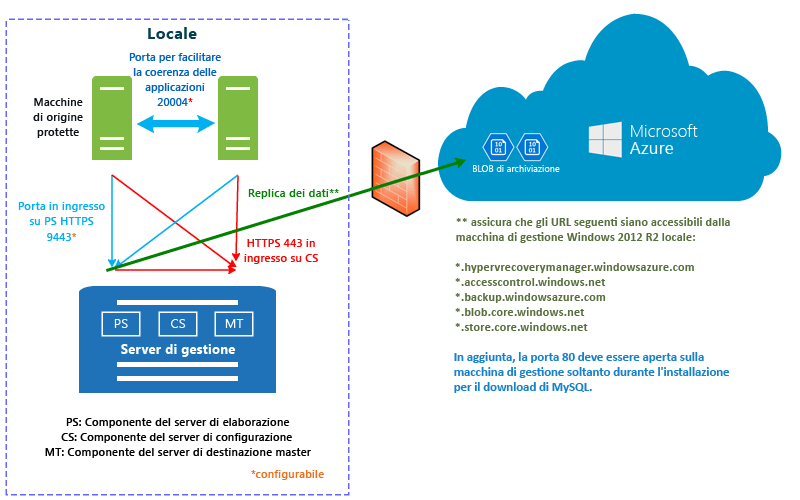

# Funzionamento di Azure Site Recovery

Leggere questo articolo per capire l'architettura sottostante del servizio Azure Site Recovery e i componenti necessari per il suo funzionamento.

Le organizzazioni necessitano di una strategia di continuità aziendale e ripristino di emergenza per determinare come app, carichi di lavoro e dati possano rimanere in esecuzione e disponibili durante i periodi di inattività, pianificati o meno, e come ripristinare le normali condizioni di lavoro il prima possibile. La strategia di continuità aziendale e ripristino di emergenza deve garantire la sicurezza dei dati aziendali e la possibilità di recuperarli, oltre alla disponibilità costante dei carichi di lavoro in caso di emergenza.

Il servizio Azure Site Recovery contribuisce alla strategia BCDR orchestrando la replica dei server fisici locali e delle macchine virtuali nel cloud (Azure) o in un data center secondario. In caso di interruzioni nella località primaria, verrà eseguito il failover alla località secondaria per mantenere disponibili app e carichi di lavoro. Quando la località primaria sarà di nuovo operativa, si tornerà a tale località. Per altre informazioni, vedere [Che cos'è Site Recovery?](site-recovery-overview.md)

Questo articolo descrive la distribuzione nel [portale di Azure](https://portal.azure.com). Il [portale di Azure classico](https://manage.windowsazure.com/) può essere usato per gestire gli insiemi di credenziali di Site Recovery esistenti, ma non per crearne di nuovi.

È possibile inserire commenti nella parte inferiore di questo articolo. In caso di domande tecniche, visitare il [forum di Azure Site Recovery](https://social.msdn.microsoft.com/forums/azure/home?forum=hypervrecovmgr).

## Scenari di distribuzione

È possibile distribuire Site Recovery per orchestrare la replica in diversi scenari:

- **Replicare macchine virtuali VMware**: è possibile replicare le macchine virtuali VMware locali in Azure o in un data center secondario.
- **Replicare computer fisici**: è possibile replicare i computer fisici (Windows o Linux) in Azure o in un data center secondario. Il processo di replica dei computer fisici è quasi uguale a quello di replica delle macchine virtuali VMware.
- **Replicare VM Hyper-V**: è possibile replicare le VM Hyper-V in Azure o in un sito VMM secondario. Per replicarle in un sito secondario, devono essere gestite in cloud di System Center Virtual Machine Manager (VMM).
- **Eseguire la migrazione di VM**: oltre alla replica (replica, failover e failback) di VM locali e server fisici in Azure, è anche possibile eseguirne la migrazione in VM di Azure (replica e failover, non il failback). Ecco di cosa è possibile eseguire la migrazione:
    - Eseguire la migrazione di carichi di lavoro in esecuzione in server fisici e VM Hyper-V e VMware locali, perché vengano eseguiti in VM di Azure.
    - Eseguire la migrazione di [VM IaaS di Azure](site-recovery-migrate-azure-to-azure.md) tra aree di Azure. Questo scenario supporta attualmente solo la migrazione, non il failback.
    - Eseguire la migrazione di [istanze di Windows per Amazon Web Services](site-recovery-migrate-aws-to-azure.md) a VM IaaS di Azure. Questo scenario supporta attualmente solo la migrazione, non il failback.

Site Recovery replica app in esecuzione in VM e server fisici supportati. Per un riepilogo completo delle app supportate, vedere [Carichi di lavoro che è possibile proteggere con Azure Site Recovery](site-recovery-workload.md)

## Replicare VM VMware/server fisici in Azure

### Componenti

**Componente** | **Dettagli**
--- | ---
**Azzurro** | In Azure sono necessari un account Microsoft Azure, un account di archiviazione di Azure e una rete di Azure.   La risorsa di archiviazione e la rete possono essere account Resource Manager o account classici.    I dati replicati vengono salvati nell'account di archiviazione e,quando si verifica un failover dal sito locale, vengono create VM di Azure con i dati replicati. Le VM di Azure si connettono alla rete virtuale di Azure quando vengono create.
**Server di configurazione** | Si imposta un server di configurazione locale per coordinare le comunicazioni tra il sito locale e Azure e per gestire la replica dei dati.
**Server di elaborazione** | Installato per impostazione predefinita nel server di configurazione locale.   Agisce come un gateway di replica. Riceve i dati di replica dai computer di origine protetti, li ottimizza attraverso la memorizzazione nella cache, la compressione e la crittografia e li invia all'archiviazione di Azure.   Gestisce l'installazione push del servizio Mobility nei computer protetti ed esegue l'individuazione automatica delle VM VMware.   Man mano che la distribuzione cresce, è possibile aggiungere altri server di elaborazione dedicati e distinti per gestire i volumi più elevati di traffico di replica.
**Server master di destinazione** | Installato per impostazione predefinita nel server di configurazione locale.   Gestisce i dati di replica durante il failback da Azure. Se i volumi del traffico di failback sono elevati, è possibile distribuire un server di destinazione master separato per il failback.
**Server VMware** | È possibile aggiungere server vCenter e vSphere all'insieme di credenziali di Servizi di ripristino, per replicare le VM VMware.   Se si replicano server fisici, sarà necessaria un'infrastruttura VMware locale per il failback. Non è possibile eseguire il failback a un computer fisico.
**Computer replicati** | Il servizio Mobility deve essere installato in ogni computer da replicare. Può essere installato manualmente in ogni computer o con un'installazione push dal server di elaborazione.

**Figura 1: Componenti da VMware ad Azure**

### Processo di replica

1. Si configurano la distribuzione, inclusi i componenti di Azure, e un insieme di credenziali di Servizi di ripristino. Nell'insieme di credenziali si specificano l'origine e la destinazione della replica, si imposta il server di configurazione, si aggiungono i server VMware, si crea un criterio di replica, si distribuisce il servizio Mobility, si abilita la replica e si esegue un failover di test.
2.  I computer avviano la replica in base al criterio di replica e una copia iniziale dei dati viene replicata in Archiviazione di Azure.
4. La replica delle modifiche differenziali in Azure viene avviata al termine della replica iniziale. Le modifiche rilevate vengono salvate in un file HRL.
    - I computer di replica comunicano con il server di configurazione tramite la porta HTTPS 443 in ingresso, per la gestione delle repliche.
    - I computer di replica inviano i dati delle repliche al server di elaborazione tramite la porta HTTPS 9443 in ingresso (configurabile).
    - Il server di configurazione orchestra la gestione delle repliche con Azure tramite la porta HTTPS 443 in uscita.
    - Il server di elaborazione riceve i dati dai computer di origine, li ottimizza e li crittografa e li invia ad Archiviazione di Azure tramite la porta 443 in uscita.
    - Se si abilita la coerenza tra più VM, i computer del gruppo di replica comunicano tra loro tramite la porta 20004. La coerenza tra più VM viene usata se si raggruppano più computer in gruppi di replica che condividono punti di ripristino coerenti con l'arresto anomalo del sistema e coerenti con l'app quando si esegue il failover. È utile se i computer eseguono lo stesso carico di lavoro e devono essere coerenti.
5. Il traffico viene replicato negli endpoint pubblici di archiviazione di Azure, tramite Internet. In alternativa, è possibile usare il [peering pubblico](https://docs.microsoft.com/en-us/azure/expressroute/expressroute-circuit-peerings#public-peering) di Azure ExpressRoute. La replica del traffico tramite una VPN da sito a sito da un sito locale ad Azure non è supportata.

**Figura 2: Replica da VMware ad Azure**

### Processo di failover e failback

1. Si eseguono failover non pianificati da VM VMware locali e da server fisici ad Azure. Il failover pianificato non è supportato.
2. È possibile effettuare il failover di un solo computer o creare [piani di ripristino](site-recovery-create-recovery-plans.md) per orchestrare il failover di più computer.
3. Quando si esegue un failover, verranno create VM di replica in Azure. Si esegue il commit di un failover per avviare l'accesso al carico di lavoro dalla VM di Azure di replica.
4. Quando il sito locale primario è di nuovo disponibile, è possibile effettuare il failback. Si configura un'infrastruttura di failback, si avvia la replica del computer dal sito secondario a quello primario e si esegue un failover non pianificato dal sito secondario. Dopo il commit di questo failover, i dati saranno di nuovo locali e sarà necessario abilitare ancora la replica in Azure. [Altre informazioni](site-recovery-failback-azure-to-vmware.md)

Esistono alcuni requisiti per il failback:

- **Il failback da computer fisico a computer fisico non è supportato**: se si esegue il failover di server fisici in Azure e quindi si vuole eseguire il failback, sarà necessario eseguire il failback in una macchina virtuale VMware. Non è possibile eseguire il failback a un server fisico. È necessaria una VM di Azure a cui eseguire il failback. Se il server di configurazione non è stato distribuito come macchina virtuale VMware, sarà necessario configurare un server di destinazione master separato come macchina virtuale VMware. Questa operazione è necessaria perché il server di destinazione master interagisce e si collega con le risorse di archiviazione VMware per ripristinare i dischi in una macchina virtuale VMware.
- **Server di elaborazione temporaneo in Azure**: se si vuole eseguire il failback da Azure dopo il failover, è necessario impostare una VM di Azure configurata come server di elaborazione per gestire la replica da Azure. Questa VM può essere eliminata al termine del failback.
- **Connessione VPN**: per eseguire il failback è necessaria una connessione VPN, oppure Azure ExpressRoute, configurata dalla rete di Azure al sito locale.
- **Server di destinazione master locale distinto**: il server di destinazione master locale gestisce il failback. Il server di destinazione master viene installato per impostazione predefinita nel server di gestione, ma se si esegue il failback di volumi di traffico più grandi, è consigliabile configurare un server di destinazione master locale distinto a questo scopo.
- **Criteri di failback**: per eseguire la replica nel sito locale, è necessario un criterio di failback, che viene creato automaticamente quando si crea il criterio di replica.

**Figura 3: Failback VMware/fisico**

## Replicare VM VMware/server fisici in un sito secondario

### Componenti

**Componente** | **Dettagli**
--- | ---
**Azzurro** | Questo scenario viene distribuito con InMage Scout. Per ottenerlo, è necessario avere una sottoscrizione di Azure.   Dopo aver creato un insieme di credenziali di Servizi di ripristino, scaricare InMage Scout e installare gli aggiornamenti più recenti per configurare la distribuzione.
**Server di elaborazione** | Si distribuisce il componente del server di elaborazione nel sito primario per gestire la memorizzazione nella cache, la compressione e l'ottimizzazione dei dati.   Gestisce anche l'installazione push di Unified Agent nei computer da proteggere.
**Server VMware ESX/ESXi e vCenter** |  È necessaria un'infrastruttura VMware per replicare le VM VMware.
**VM/server fisici** |  Si installa Unified Agent nelle VM VMware o nei server fisici Windows/Linux da replicare.   L'agente funge da provider di comunicazioni tra tutti i componenti.
**Server di configurazione** | Il server di configurazione viene installato nel sito secondario per gestire, configurare e monitorare la distribuzione usando il sito Web di gestione o la console vContinuum.
**Server vContinuum** | Installato nella stessa posizione del server di configurazione.   Fornisce una console per la gestione e il monitoraggio dell'ambiente protetto.
**Server di destinazione master (sito secondario)** | Questo server contiene i dati replicati. Riceve i dati dal server di elaborazione e crea un computer di replica nel sito secondario e include i punti di conservazione dei dati.   Il numero di server di destinazione master necessari dipende dal numero di computer da proteggere.   Se si vuole eseguire il failback al sito primario, deve essere disponibile anche un server di destinazione master. Unified Agent viene installato in questo server.

### Processo di replica

1. Configurare i server del componente in ogni sito, ovvero configurazione, elaborazione, destinazione master, e installare Unified Agent nei computer da replicare.
2. Dopo la replica iniziale, l'agente installato in ogni computer invia le modifiche della replica differenziale al server di elaborazione.
3. Il server di elaborazione ottimizza i dati e li trasferisce nel server di destinazione master nel sito secondario. Il server di configurazione gestisce il processo di replica.

**Figura 4: Replica da VMware a VMware**

## Replicare VM Hyper-V in Azure

### Componenti

**Componente** | **Dettagli**
--- | ---
**Azzurro** | In Azure sono necessari un account Microsoft Azure, un account di archiviazione di Azure e una rete di Azure.   La risorsa di archiviazione e la rete possono essere account basati su Resource Manager o classici.   I dati replicati vengono salvati nell'account di archiviazione e,quando si verifica un failover dal sito locale, vengono create VM di Azure con i dati replicati.   Le VM di Azure si connettono alla rete virtuale di Azure quando vengono create.
**Server VMM** | Se gli host Hyper-V si trovano in cloud VMM, sono necessarie reti logiche e VM impostate per configurare il [mapping di rete](site-recovery-network-mapping.md). È necessario che una rete VM sia collegata a una rete logica associata al cloud.
**Host Hyper-V** | È necessario uno o più server host Hyper-V.
**VM Hyper-V** | È necessaria una o più macchine virtuali nel server host Hyper-V. Il provider in esecuzione nell'host Hyper-V coordina e orchestra la replica con il servizio Site Recovery su Internet. L'agente gestisce i dati di replica tramite HTTPS 443. Le comunicazioni dal provider e dall'agente sono protette e crittografate. I dati replicati nell'archiviazione di Azure vengono anche crittografati.

## Processo di replica

1. Si configurano i componenti di Azure. È consigliabile configurare gli account di archiviazione e di rete prima di iniziare la distribuzione di Site Recovery.
2. Si crea un insieme di credenziali dei servizi di replica per Site Recovery e si configurano le impostazioni dell'insieme di credenziali, tra cui:
    - Se non si gestiscono gli host Hyper-V in un cloud VMM, si crea un contenitore del sito Hyper-V a cui si aggiungono gli host Hyper-V.
    - L'origine e la destinazione della replica. Se gli host Hyper-V vengono gestiti in VMM, l'origine è il cloud VMM. In caso contrario, l'origine è il sito Hyper-V.
    - Installazione del provider di Azure Site Recovery e dell'agente Servizi di ripristino di Microsoft Azure. Il provider verrà installato in VMM, se disponibile, e l'agente in ogni host Hyper-V. Se non si ha VMM, sia il provider che l'agente vengono installati in ogni host.
    - Si crea un criterio di replica per il sito Hyper-V o per il cloud VMM. Il criterio viene applicato a tutte le VM negli host del sito o del cloud.
    - Si abilita la replica per le VM Hyper-V. La replica iniziale viene eseguita in base alle impostazioni del criterio di replica.
4. Le modifiche ai dati vengono rilevate e la replica delle modifiche differenziali in Azure viene avviata al termine della replica iniziale. Le modifiche rilevate per un elemento vengono salvate in un file HRL.
5. Si esegue un failover di test per verificare che tutto funzioni correttamente.

### Processo di failover e failback

1. È possibile eseguire un [failover](site-recovery-failover.md) pianificato o non pianificato dalle VM Hyper-V locali ad Azure. Se si esegue un failover pianificato, le macchine virtuali di origine vengono arrestate per assicurare che non si verifichino perdite di dati.
2. È possibile effettuare il failover di un solo computer o creare [piani di ripristino](site-recovery-create-recovery-plans.md) per orchestrare il failover di più computer.
4. Dopo avere eseguito il failover, le VM di replica create verranno visualizzate in Azure. È possibile assegnare un indirizzo IP pubblico alla VM, se necessario.
5. Si esegue quindi il commit del failover per avviare l'accesso al carico di lavoro dalla VM di Azure di replica.
6. Quando il sito locale primario è di nuovo disponibile, è possibile effettuare il failback. Si avvia un failover pianificato da Azure al sito primario. Per un failover pianificato è possibile scegliere di effettuare il failback nella stessa VM o in una posizione alternativa e di sincronizzare le modifiche tra Azure e l'ambiente locale, per evitare perdite di dati. Quando le VMs vengono create in locale, si esegue il commit del failover.

**Figura 5: Replica dal sito Hyper-V ad Azure**

**Figura 6: Replica da Hyper-V nei cloud VMM ad Azure**

## Replicare le VM Hyper-V in un sito secondario

### Componenti

**Componente** | **Dettagli**
--- | ---
**Account di Azure** | È necessario un account Microsoft Azure.
**Server VMM** | È consigliabile distribuire un server VMM in un sito primario e uno nel sito secondario, connessi a Internet.   Ogni server deve avere almeno un cloud privato VMM, con il profilo funzionalità di Hyper-V impostato.   Il provider di Azure Site Recovery viene installato nel server VMM. Il provider coordina e orchestra la replica con il servizio Site Recovery su Internet. Le comunicazioni tra il provider e Azure sono protette e crittografate.
**Server Hyper-V** |  È necessario uno o più server host Hyper-V nei cloud VMM primario e secondario. I server devono essere connessi a Internet.   I dati vengono replicati tra il server host Hyper-V primario e secondario su LAN o VPN usando l'autenticazione Kerberos o del certificato.  
**Computer di origine** | Il server host Hyper-V di origine deve avere almeno una VM che si vuole replicare.

## Processo di replica

1. Si configura l'account Azure.
2. Si crea un insieme di credenziali dei servizi di replica per Site Recovery e si configurano le impostazioni dell'insieme di credenziali, tra cui:

    - L'origine e la destinazione della replica (siti primario e secondario).
    - Installazione del provider di Azure Site Recovery e dell'agente Servizi di ripristino di Microsoft Azure. Il provider viene installato nei server VMM e l'agente in ogni host Hyper-V.
    - Si crea un criterio di replica per il cloud VMM di origine. Il criterio viene applicato a tutte le VM negli host del cloud.
    - Si abilita la replica per le VM Hyper-V. La replica iniziale viene eseguita in base alle impostazioni del criterio di replica.
4. Le modifiche ai dati vengono rilevate e la replica delle modifiche differenziali viene avviata al termine della replica iniziale. Le modifiche rilevate per un elemento vengono salvate in un file HRL.
5. Si esegue un failover di test per verificare che tutto funzioni correttamente.

**Figura 7: Replica da VMM a VMM**

### Processo di failover e failback

1. È possibile eseguire un [failover](site-recovery-failover.md) pianificato o non pianificato tra siti locali. Se si esegue un failover pianificato, le macchine virtuali di origine vengono arrestate per assicurare che non si verifichino perdite di dati.
2. È possibile effettuare il failover di un solo computer o creare [piani di ripristino](site-recovery-create-recovery-plans.md) per orchestrare il failover di più computer.
4. Se si esegue un failover non pianificato in un sito secondario, dopo il failover i computer della posizione secondaria non sono abilitati per la protezione o la replica. Se è stato eseguito un failover pianificato, dopo il failover i computer della posizione secondaria sono protetti.
5. Si esegue quindi il commit del failover per avviare l'accesso al carico di lavoro dalla VM di replica.
6. Quando il sito primario è nuovamente disponibile, si avvia la replica inversa dal sito secondario a quello primario. La replica inversa porta le macchine virtuali in uno stato protetto, ma il data center secondario resta la posizione attiva.
7. Per rendere di nuovo il sito primario la posizione attiva, occorre avviare un failover pianificato da sito secondario a primario, seguito da un'altra replica inversa.

### Flusso di lavoro di replica Hyper-V

**Fase del flusso di lavoro** | **Azione**
--- | ---
1. **Abilitare la protezione** | Dopo avere abilitato la protezione per una VM Hyper-V, viene avviato il processo **Abilita protezione** per controllare che il computer sia conforme ai prerequisiti. Il processo richiama due metodi:   [CreateReplicationRelationship](https://msdn.microsoft.com/library/hh850036.aspx) per impostare la replica con le impostazioni configurate.   [StartReplication](https://msdn.microsoft.com/library/hh850303.aspx), per inizializzare una replica della VM completa.
2. **Replica iniziale** |  Viene eseguito uno snapshot della macchina virtuale e i dischi rigidi virtuali vengono replicati uno alla volta, fino a quando non sono stati tutti copiati nella posizione secondaria.   Il tempo necessario per completare l'operazione dipende dalle dimensioni della VM, dalla larghezza di banda della rete e dal metodo di replica iniziale.   Se vengono apportate modifiche al disco mentre è in corso la replica iniziale, la gestione delle repliche di Hyper-V tiene traccia delle modifiche sotto forma di log di replica di Hyper-V (con estensione hrl), che si trovano nella stessa cartella dei dischi.   A ogni disco è associato un file con estensione hrl, che verrà inviato alla risorsa di archiviazione secondaria.   Si noti che lo snapshot e i file di log usano risorse del disco durante l'esecuzione della replica iniziale. Al termine della replica iniziale, lo snapshot della macchina virtuale viene eliminato e le modifiche differenziali al disco nel log vengono sincronizzate e unite.
3. **Finalizzare la protezione** | Al termine della replica iniziale, il processo **Finalizza protezione** configura la rete e altre impostazioni successive alla replica, in modo che la macchina virtuale sia protetta.   Se si esegue la replica in Azure, potrebbe essere necessario modificare le impostazioni della macchina virtuale, in modo che sia pronta per il failover.   A questo punto è possibile eseguire un failover di test per controllare che tutto funzioni come previsto.
4. **Replica** | Dopo la replica iniziale, viene avviata la sincronizzazione differenziale in base alle impostazioni della replica.   **Errore di replica**: se la replica differenziale non riesce e una replica completa risulta costosa a livello di larghezza di banda o del tempo richiesto, verrà eseguita la risincronizzazione. Ad esempio, se i file con estensione hrl raggiungono il 50% delle dimensioni del disco, la macchina virtuale verrà contrassegnata per la risincronizzazione. La risincronizzazione riduce al minimo la quantità di dati inviati calcolando i checksum delle macchine virtuali di origine e di destinazione e inviando solo il relativo differenziale. Al termine della risincronizzazione, viene ripresa la replica differenziale. Per impostazione predefinita, la risincronizzazione è pianificata per l'esecuzione automatica negli orari non lavorativi, ma è possibile risincronizzare manualmente una macchina virtuale.   **Errore di replica**: se si verifica un errore di replica, per impostazione predefinita viene effettuato un nuovo tentativo. Se si tratta di un errore irreversibile, ad esempio un errore di autenticazione o di autorizzazione oppure se lo stato del computer di replica non è valido, non verranno effettuati nuovi tentativi. Se si tratta di un errore reversibile, ad esempio un errore di rete o spazio su disco o memoria insufficiente, verranno eseguiti nuovi tentativi a intervalli crescenti (ogni 1, 2, 4, 8, 10 e quindi 30 minuti).
5. **Failover pianificato/non pianificato** | È possibile eseguire failover pianificati o non pianificati in base alle esigenze.   Se si esegue un failover pianificato, le macchine virtuali di origine vengono arrestate per assicurare che non si verifichino perdite di dati.   Dopo la creazione, le macchine virtuali di replica sono in uno stato di commit in sospeso. È necessario eseguirne il commit per completare il failover.   Dopo che il sito primario è operativo, è possibile effettuare il failback nel sito primario, quando è disponibile.

**Figura 8: Flusso di lavoro di Hyper-V**

## Passaggi successivi

[Preparare la distribuzione](site-recovery-best-practices.md)

<!--HONumber=Jan17_HO1-->

