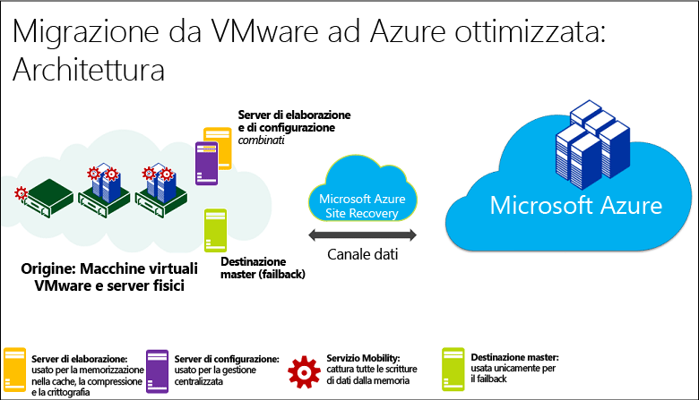
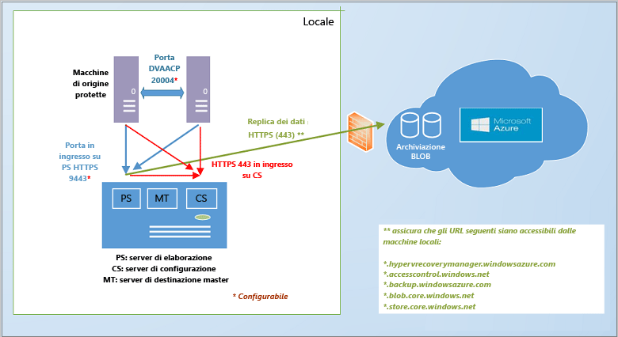
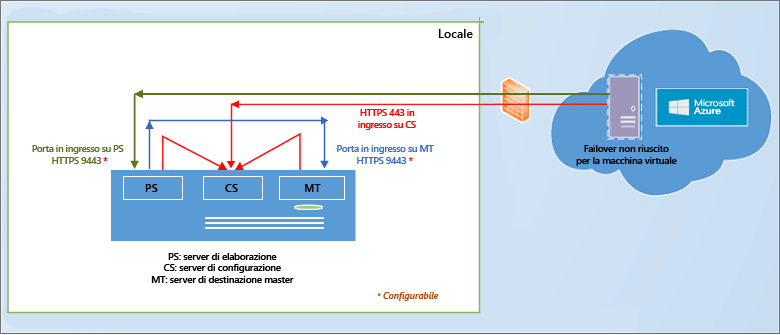
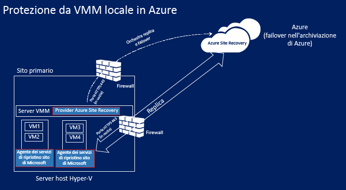
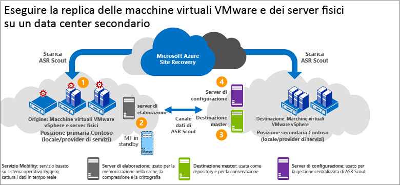
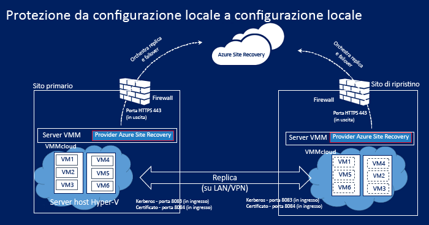
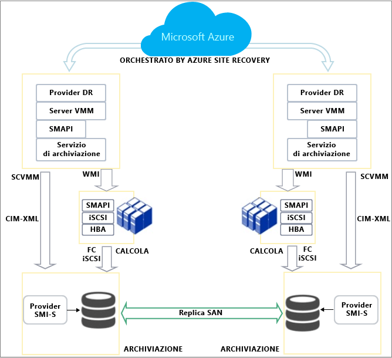
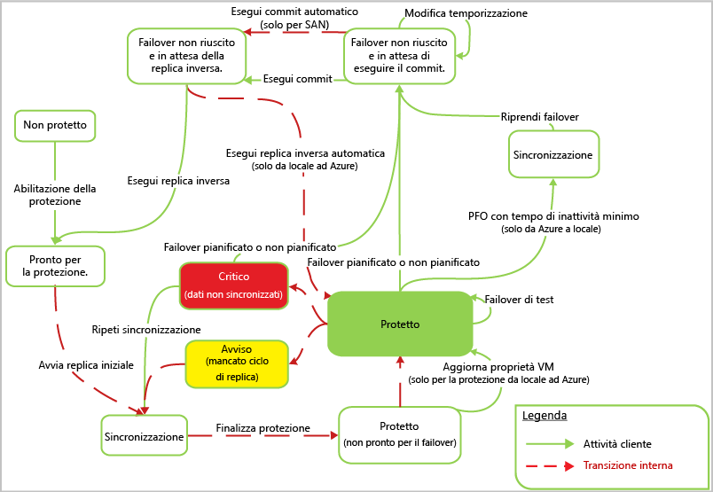

# Funzionamento di Azure Site Recovery
Leggere questo articolo per comprendere l'architettura sottostante del servizio Azure Site Recovery e i componenti necessari per il funzionamento.

Per inviare commenti o domande è possibile usare la parte inferiore di questo articolo oppure il [forum sui Servizi di ripristino di Azure](https://social.msdn.microsoft.com/forums/azure/home?forum=hypervrecovmgr).

## Panoramica
Le organizzazioni necessitano di una strategia di continuità aziendale e ripristino di emergenza per determinare come app, carichi di lavoro e dati possano rimanere in esecuzione e disponibili durante i periodi di inattività, pianificati o meno, e come ripristinare le normali condizioni di lavoro il prima possibile. La strategia di continuità aziendale e ripristino di emergenza deve garantire la sicurezza dei dati aziendali e la possibilità di recuperarli, oltre alla disponibilità costante dei carichi di lavoro in caso di emergenza.

Il servizio Azure Site Recovery contribuisce alla strategia BCDR orchestrando la replica dei server fisici locali e delle macchine virtuali sul cloud (Azure) o in un data center secondario. In caso di interruzioni nella località primaria, verrà eseguito il failover alla località secondaria per mantenere disponibili app e carichi di lavoro. Quando la località primaria sarà di nuovo operativa, si tornerà a tale località. Per altre informazioni, vedere [Che cos'è Site Recovery?](site-recovery-overview.md)

## Site Recovery nel portale di Azure
Azure offre due [modelli di distribuzione](../resource-manager-deployment-model.md) diversi per la creazione e l'uso delle risorse: il modello Azure Resource Manager e il modello di gestione classica dei servizi. Sono anche disponibili il [portale di Azure classico](https://manage.windowsazure.com/), che supporta il modello di distribuzione classica, e il [portale di Azure](https://portal.azure.com), che supporta entrambi i modelli di distribuzione.

Site Recovery è disponibile sia nel portale classico che nel portale di Azure. Nel portale di Azure classico è possibile supportare Site Recovery con il modello di gestione classica dei servizi. Nel portale di Azure è possibile supportare il modello di distribuzione classica o il modello Azure Resource Model. [Altre informazioni](site-recovery-overview.md#site-recovery-in-the-azure-portal) sulla distribuzione con il portale di Azure.

Le informazioni in questo articolo sono applicabili al modello di distribuzione classica e al modello di distribuzione tramite il portale di Azure. Le differenze sono indicate ove applicabili.

## Scenari di distribuzione
È possibile distribuire Site Recovery per orchestrare la replica in diversi scenari:

* **Replicare macchine virtuali VMware**: è possibile replicare le macchine virtuali VMware locali in Azure o in un data center secondario.
* * **Replicare computer fisici**: è possibile replicare i computer fisici che eseguono Windows o Linux in Azure o in un data center secondario. Il processo di replica dei computer fisici è quasi uguale al processo di replica delle macchine virtuali VMware.
* **Replicare VM Hyper-V (senza VMM)**: è possibile replicare le macchine virtuali Hyper-V non gestite da VMM in Azure.
* **Replicare VM Hyper-V gestite in cloud VMM di System Center**: è possibile replicare le macchine virtuali Hyper-V locali in esecuzione in server host Hyper-V in cloud VMM in Azure o in un data center secondario. È possibile eseguire la replica usando la replica Hyper-V standard oppure la replica SAN.
* **Eseguire la migrazione di macchine virtuali**: è possibile usare Site Recovery per [eseguire la migrazione di macchine virtuali IaaS di Azure](site-recovery-migrate-azure-to-azure.md) tra aree geografiche oppure per [eseguire la migrazione di istanze Windows di AWS](site-recovery-migrate-aws-to-azure.md) in macchine virtuali IaaS di Azure. Attualmente è supportata solo la migrazione. Ciò significa che è possibile eseguire il failover di queste macchine virtuali, ma non il failback.

Site Recovery può replicare la maggior parte delle app in esecuzione su queste VM e questi server fisici. Per un riepilogo completo delle app supportate, vedere [Carichi di lavoro che è possibile proteggere con Azure Site Recovery](site-recovery-workload.md)

## Eseguire la replica in Azure: macchine virtuali VMware o server Windows/Linux fisici
È possibile replicare macchine virtuali VMware con Site Recovery in alcuni modi diversi.

* **Usando il portale di Azure**: quando si distribuisce Site Recovery nel portale di Azure, è possibile eseguire il failover di macchine virtuali nelle risorse di archiviazione di Service Manager classiche oppure in Azure Resource Manager. La replica di macchine virtuali VMware nel portale di Azure offre alcuni vantaggi, inclusa la possibilità di eseguire la replica nelle risorse di archiviazione classiche o in Resource Manager in Azure. [Altre informazioni](site-recovery-vmware-to-azure.md).
* **Con portale classico**: è possibile distribuire Site Recovery nel portale classico usando un'esperienza ottimizzata. Questo approccio deve essere usato per tutte le nuove distribuzioni nel portale classico. In questa distribuzione è possibile eseguire il failover delle VM solo nelle risorse di archiviazione classiche di Azure e non in quelle di Resource Manager. [Altre informazioni](site-recovery-vmware-to-azure-classic.md). È anche disponibile un'[esperienza legacy](site-recovery-vmware-to-azure-classic-legacy.md) per la configurazione della replica VMware nel portale classico. Questo approccio non deve essere usato per le nuove distribuzioni.  Se la distribuzione è già stata eseguita con l'esperienza legacy, vedere le [informazioni sulla migrazione](site-recovery-vmware-to-azure-classic-legacy.md#migrate-to-the-enhanced-deployment) alla distribuzione ottimizzata.

I requisiti dell'architettura per la distribuzione di Site Recovery per replicare macchine virtuali VMware o server fisici nel portale di Azure o nel portale di Azure classico (modalità ottimizzata) sono simili, con alcune differenze:

* Se si esegue la distribuzione nel portale di Azure, è possibile eseguire la replica nelle risorse di archiviazione basate su Resource Manager e usare le reti di Resource Manager per la connessione delle macchine virtuali di Azure dopo il failover.
* Quando si esegue la distribuzione nel portale di Azure, sono supportate risorse di archiviazione con ridondanza locale e risorse di archiviazione con ridondanza geografica. Nel portale classico è necessario usare le risorse di archiviazione con ridondanza geografica.
* Il processo di distribuzione è semplificato e più facile da usare nel portale di Azure.

Sono necessari gli elementi seguenti:

* **Account Azure**: sarà necessario un account Microsoft Azure.
* **Archiviazione di Azure**: per archiviare i dati replicati è necessario un account di archiviazione di Azure. È possibile usare un account classico o un account di archiviazione di Resource Manager. L'account può essere di tipo archiviazione con ridondanza locale o archiviazione con ridondanza geografica quando si esegue la distribuzione nel portale di Azure. I dati replicati vengono memorizzati nell'archiviazione di Azure e le macchine virtuali di Azure vengono attivate quando si verifica il failover.
* **Rete di Azure**: è necessaria una rete virtuale di Azure a cui le VM di Azure possano connettersi quando si vengono create in fase di failover. Nel portale di Azure è possibile usare reti create con il modello di gestione classica dei servizi o con il modello Resource Manager.
* **Server di configurazione locale**: sarà necessario un computer locale con Windows Server 2012 R2 che esegue il server di configurazione e altri componenti di Site Recovery. Se si replicano macchine virtuali VMware, questa deve essere una macchina virtuale VMware a disponibilità elevata. Per replicare server fisici, il computer può essere fisico. Nel computer verranno installati questi componenti di Site Recovery:
  * **Server di configurazione**: per coordinare la comunicazione tra l'ambiente locale e Azure e gestire la replica e il ripristino dei dati.
  * **Server di elaborazione**: agisce come un gateway di replica. Riceve i dati di replica dai computer di origine protetti, li ottimizza attraverso la memorizzazione nella cache, la compressione e la crittografia e li invia all'archiviazione di Azure. Gestisce anche l'installazione push del servizio Mobility nei computer protetti ed esegue l'individuazione automatica delle VM VMware. Man mano che la distribuzione cresce, è possibile aggiungere altri server di elaborazione dedicati e distinti per gestire i volumi più elevati di traffico di replica.
  * **Server di destinazione master**: gestisce i dati di replica durante il failback da Azure.
* **VM VMware o server fisici da replicare**: in ogni computer che si vuole replicare in Azure dovrà essere installato il componente del servizio Mobility. Questo servizio acquisisce le scritture di dati nel computer e le inoltra al server di elaborazione. Questo componente può essere installato manualmente oppure si può effettuarne il push e installarlo automaticamente tramite il server di elaborazione quando si abilita la replica per un computer.
* **Host vSPhere/server vCenter**: è necessario avere uno o più server host vSphere che eseguono macchine virtuali VMware. È consigliabile distribuire un server vCenter per gestire questi host.
* **Failback**: ecco le informazioni necessarie.
  * **Il failback da computer fisico a computer fisico non è supportato**: se si esegue il failover di server fisici in Azure e quindi si vuole eseguire il failback, sarà necessario eseguire il failback in una macchina virtuale VMware. Non è possibile eseguire il failback a un server fisico. È necessaria una VM di Azure a cui eseguire il failback. Se il server di configurazione non è stato distribuito come macchina virtuale VMware, sarà necessario configurare un server di destinazione master separato come macchina virtuale VMware. Questa operazione è necessaria perché il server di destinazione master interagisce e si collega con le risorse di archiviazione VMware per ripristinare i dischi in una macchina virtuale VMware.
  * * **Server di elaborazione temporaneo in Azure**: se si vuole eseguire il failback da Azure dopo il failover, è necessario impostare una VM di Azure configurata come server di elaborazione per gestire la replica da Azure. Questa VM può essere eliminata al termine del failback.
  * **Connessione VPN**: per eseguire il failback è necessaria una connessione VPN, oppure Azure ExpressRoute, configurata dalla rete di Azure al sito locale.
  * **Server di destinazione master locale distinto**: il server di destinazione master locale gestisce il failback. Il server di destinazione master viene installato per impostazione predefinita nel server di gestione, ma se si esegue il failback di volumi di traffico più grandi, è consigliabile configurare un server di destinazione master locale distinto a questo scopo.

**Architettura generale**

**Componenti della distribuzione**

**Failback**

* [Altre informazioni](site-recovery-vmware-to-azure.md#azure-prerequisites) sui requisiti per la distribuzione tramite il portale di Azure.
* [Altre informazioni](site-recovery-vmware-to-azure-classic.md#before-you-start-deployment) sui requisiti di distribuzione avanzati nel portale classico.
* [Altre informazioni](site-recovery-failback-azure-to-vmware.md) sul failback nel portale di Auzre.
* [Altre informazioni](site-recovery-failback-azure-to-vmware-classic.md) sul failback nel portale di classico.

## Eseguire la replica in Azure: macchine virtuali Hyper-V non gestite da VMM
È possibile replicare macchine virtuali Hyper-V non gestite da System Center VMM in Azure con Site Recovery come illustrato di seguito:

* **Usando il portale di Azure**: quando si distribuisce Site Recovery nel portale di Azure, è possibile eseguire il failover di macchine virtuali nelle risorse di archiviazione classiche oppure in Azure Resource Manager. [Altre informazioni](site-recovery-hyper-v-site-to-azure.md)
* **Usando il portale classico**: è possibile distribuire Site Recovery nel portale classico. In questa distribuzione è possibile eseguire il failover delle VM solo nelle risorse di archiviazione classiche di Azure e non in quelle di Resource Manager. [Altre informazioni](site-recovery-hyper-v-site-to-azure-classic.md)

L'architettura per entrambe le distribuzioni è simile, con queste differenze:

* Se si esegue la distribuzione nel portale di Azure, è possibile eseguire la replica nelle risorse di archiviazione di Resource Manager e usare le reti di Resource Manager per la connessione delle macchine virtuali di Azure dopo il failover.
* Il processo di distribuzione è semplificato e più facile da usare nel portale di Azure.

Sono necessari gli elementi seguenti:

* **Account Azure**: sarà necessario un account Microsoft Azure.
* **Archiviazione di Azure**: per archiviare i dati replicati è necessario un account di archiviazione di Azure. Nel portale di Azure è possibile usare un account classico o un account di archiviazione di Resource Manager. Nel portale classico è possibile usare solo un account classico. I dati replicati vengono memorizzati in Archiviazione di Azure e le macchine virtuali di Azure vengono create quando si verifica il failover.
* **Rete di Azure**: sarà necessaria una rete di Azure a cui le macchine virtuali di Azure possano connettersi quando vengono create dopo il failover.
* **Host Hyper-v**: sarà necessario avere uno o più server host Windows Server 2012 R2 Hyper-V. Durante la distribuzione di Azure Site Recovery, nell'host verranno installati il provider di Azure Site Recovery e l'agente Servizi di ripristino di Microsoft Azure.
* **Macchine virtuali Hyper-V**: sarà necessario avere una o più macchine virtuali nel server host Hyper-V. È necessario avere anche il provider di Azure Site Recovery e l'agente di Servizi di ripristino di Azure nell'host Hyper-V durante la distribuzione di Site Recovery. Il provider coordina e orchestra la replica con il servizio Site Recovery su Internet. L'agente gestisce i dati di replica tramite HTTPS 443. Le comunicazioni dal provider e dall'agente sono protette e crittografate. I dati replicati nell'archiviazione di Azure vengono anche crittografati.

**Architettura generale**

* [Altre informazioni](site-recovery-hyper-v-site-to-azure.md#azure-prerequisites) sui requisiti per la distribuzione tramite il portale di Azure.
* [Altre informazioni](site-recovery-hyper-v-site-to-azure-classic.md#azure-prerequisites) sui requisiti per la distribuzione tramite il portale classico.

## Eseguire la replica in Azure: macchine virtuali Hyper-V gestite da VMM
È possibile replicare macchine virtuali Hyper-V in cloud VMM in Azure con Site Recovery come illustrato di seguito:

* **Usando il portale di Azure**: quando si distribuisce Site Recovery nel portale di Azure, è possibile eseguire il failover di macchine virtuali nelle risorse di archiviazione classiche oppure in Azure Resource Manager. [Altre informazioni](site-recovery-vmm-to-azure.md)
* **Usando il portale classico**: è possibile distribuire Site Recovery nel portale classico. In questa distribuzione è possibile eseguire il failover delle VM solo nelle risorse di archiviazione classiche di Azure e non in quelle di Resource Manager. [Altre informazioni](site-recovery-vmm-to-azure-classic.md)

L'architettura per entrambe le distribuzioni è simile, con queste differenze:

* Se si esegue la distribuzione nel portale di Azure, è possibile eseguire la replica nelle risorse di archiviazione basate su Resource Manager e usare le reti di Resource Manager per la connessione delle macchine virtuali di Azure dopo il failover.
* Il processo di distribuzione è semplificato e più facile da usare nel portale di Azure.

Sono necessari gli elementi seguenti:

* **Account Azure**: sarà necessario un account Microsoft Azure.
* **Archiviazione di Azure**: per archiviare i dati replicati è necessario un account di archiviazione di Azure. Nel portale di Azure è possibile usare un account classico o un account di archiviazione di Resource Manager. Nel portale classico è possibile usare solo un account classico. I dati replicati vengono memorizzati in Archiviazione di Azure e le macchine virtuali di Azure vengono create quando si verifica il failover.
* **Rete di Azure**: sarà necessario configurare il mapping di rete in modo che le macchine virtuali di Azure siano connesse alle reti appropriate quando vengono create dopo il failover.
* **Server VMM**: sarà necessario avere uno o più server VMM locali in esecuzione su System Center 2012 R2 e configurati con uno o più cloud privati. Se si esegue la distribuzione nel portale di Azure, sarà necessario configurare reti logiche e di macchine virtuali, per consentire la configurazione del mapping di rete. Nel portale classico questa operazione è facoltativa.  È necessario che una rete VM sia collegata a una rete logica associata al cloud.
* **Host Hyper-v**: sarà necessario avere uno o più server host Windows Server 2012 R2 Hyper-V nel cloud VMM.
* **Macchine virtuali Hyper-V**: sarà necessario avere una o più macchine virtuali nel server host Hyper-V.

**Architettura generale**

* [Altre informazioni](site-recovery-vmm-to-azure.md#azure-requirements) sui requisiti per la distribuzione tramite il portale di Azure.
* [Altre informazioni](site-recovery-vmm-to-azure-classic.md#before-you-start) sui requisiti per la distribuzione tramite il portale classico.

## Eseguire la replica in un sito secondario; macchine virtuali VMware o server fisici
Per replicare macchine virtuali VMware o server fisici in un sito secondario, scaricare InMage Scout incluso nella sottoscrizione di Azure Site Recovery. È possibile scaricarlo dal portale di Azure o dal portale di Azure classico.

Configurare i server del componente in ogni sito, ovvero configurazione, elaborazione, destinazione master, e installare Unified Agent nei computer da replicare. Dopo la replica iniziale l'agente in ogni computer invia le modifiche della replica differenziale al server di elaborazione. Il server di elaborazione ottimizza i dati e li trasferisce al server di destinazione master nel sito secondario. Il server di configurazione gestisce il processo di replica.

Ecco gli elementi necessari:

**Account Azure**: questo scenario viene distribuito con InMage Scout. Per ottenerlo, è necessario avere una sottoscrizione di Azure. Dopo aver creato un insieme di credenziali di Site Recovery, scaricare InMage Scout e installare gli aggiornamenti più recenti per configurare la distribuzione.
**Server di elaborazione (sito primario)**: configurare il componente del server di elaborazione nel sito primario per gestire la memorizzazione nella cache, la compressione e l'ottimizzazione dei dati. Gestisce anche l'installazione push di Unified Agent nei computer da proteggere.
**VMware ESX/ESXi e Server vCenter (sito primario)**: se si prevede di proteggere macchine virtuali VMware, è necessario un hypervisor VMware EXS/ESXi e facoltativamente un server VMware vCenter per gestire gli hypervisor.

* **VM/server fisici (sito primario)**: nelle VM VMware o nei server fisici Windows/Linux da proteggere deve essere installato Unified Agent. Unified Agent viene installato anche nei computer configurati come server di destinazione master. L'agente funge da provider di comunicazioni tra tutti i componenti.
* * **Server di configurazione (sito secondario)**: il server di configurazione è il primo componente da installare e viene installato nel sito secondario per gestire, configurare e monitorare la distribuzione mediante il sito Web di gestione o la console vContinuum. È presente un solo server di configurazione in una distribuzione e deve essere installato in un computer che esegue Windows Server 2012 R2.
* **Server vContinuum (sito secondario)**: è installato nella stessa posizione (sito secondario) del server di configurazione. Fornisce una console per la gestione e il monitoraggio dell'ambiente protetto. In un'installazione predefinita il server vContinuum è il primo server di destinazione master e include l'installazione di Unified Agent.
* **Server di destinazione master (sito secondario)**: questo server contiene i dati replicati. Riceve i dati dal server di elaborazione e crea un computer di replica nel sito secondario e include i punti di conservazione dei dati. Il numero di server di destinazione master necessari dipende dal numero di computer da proteggere. Se si vuole eseguire il failback al sito primario, dovrà essere disponibile anche un server di destinazione master.

**Architettura generale**

## Eseguire la replica in un sito secondario: macchine virtuali Hyper-V gestite da VMM
È possibile replicare macchine virtuali Hyper-V gestite da System Center VMM in un data center secondario con Site Recovery come illustrato di seguito:

* **Usando il portale di Azure**: quando si distribuisce Site Recovery nel portale di Azure. [Altre informazioni](site-recovery-hyper-v-site-to-azure.md)
* **Usando il portale classico**: è possibile distribuire Site Recovery nel portale classico. [Altre informazioni](site-recovery-hyper-v-site-to-azure-classic.md)

L'architettura per entrambe le distribuzioni è simile, con queste differenze:

* Se si esegue la distribuzione nel portale di Azure, è necessario configurare il mapping di rete. Questa operazione è facoltativa nel portale classico.
* Il processo di distribuzione è semplificato e più facile da usare nel portale di Azure.
* * Se si esegue la distribuzione nel portale di Azure classico, è disponibile il [mapping di archiviazione](site-recovery-storage-mapping.md) .

Sono necessari gli elementi seguenti:

* **Account Azure**: sarà necessario un account Microsoft Azure.
* **Server VMM**: è consigliabile avere un server VMM nel sito primario e uno nel sito secondario, ognuno dei quali contiene almeno un cloud privato VMM. Il server deve eseguire almeno System Center 2012 SP1 con gli ultimi aggiornamenti cumulativi ed essere connesso a Internet. I cloud devono avere impostato il profilo funzionalità di Hyper-V. Verrà installato il provider di Azure Site Recovery nel server VMM. Il provider coordina e orchestra la replica con il servizio Site Recovery su Internet. Le comunicazioni tra il provider e Azure sono protette e crittografate.
* **Server Hyper-V**: i server host Hyper-V devono trovarsi nei cloud VMM primario e secondario. I server host devono eseguire almeno Windows Server 2012 con gli aggiornamenti più recenti installati ed essere connessi a Internet. I dati vengono replicati tra il server host Hyper-V primario e secondario sulla LAN o la VPN usando l'autenticazione Kerberos o del certificato.  
* **Computer protetti**: il server host Hyper-V di origine deve avere almeno una VM che si vuole proteggere.

**Architettura generale**

* [Altre informazioni](site-recovery-vmm-to-vmm.md#azure-prerequisites) sui requisiti di distribuzione nel portale di Azure.
* * [Altre informazioni](site-recovery-vmm-to-vmm-classic.md#before-you-start) sui requisiti di distribuzione nel portale di Azure classico.

## Eseguire la replica in un sito secondario con la replica SAN: macchine virtuali Hyper-V gestite da VMM
È possibile replicare macchine virtuali Hyper-V gestite in cloud VMM in un sito secondario usando la replica SAN con il portale di Azure classico. Questo scenario non è attualmente supportato nel nuovo portale di Azure.

In questo scenario durante la distribuzione di Site Recovery installare il provider di Azure Site Recovery nei server VMM. Il provider coordina e orchestra la replica con il servizio Site Recovery su Internet. I dati vengono replicati tra le matrici di archiviazione primaria e secondaria mediante la replica SAN sincrona.

Sono necessari gli elementi seguenti:

**Account Azure**: sarà necessaria una sottoscrizione di Azure.

* **Matrice SAN**: una [matrice SAN supportata](http://social.technet.microsoft.com/wiki/contents/articles/28317.deploying-azure-site-recovery-with-vmm-and-san-supported-storage-arrays.aspx) gestita dal server VMM primario. La rete SAN condivide un'infrastruttura di rete con un altro array SAN nel sito secondario.
* **Server VMM**: è consigliabile avere un server VMM nel sito primario e uno nel sito secondario, ognuno dei quali contiene almeno un cloud privato VMM. Il server deve eseguire almeno System Center 2012 SP1 con gli ultimi aggiornamenti cumulativi ed essere connesso a Internet. I cloud devono avere impostato il profilo funzionalità di Hyper-V.
* **Server Hyper-V**: server host Hyper-V presenti nei cloud VMM primario e secondario. I server host devono eseguire almeno Windows Server 2012 con gli aggiornamenti più recenti installati ed essere connessi a Internet.
* **Computer protetti**: il server host Hyper-V di origine deve avere almeno una VM che si vuole proteggere.

**Architettura della replica SAN**

[Altre informazioni](site-recovery-vmm-san.md#before-you-start) sui requisiti di distribuzione.

### Locale
## Ciclo di vita di protezione di Hyper-V
Questo flusso di lavoro mostra il processo di protezione, replica e failover delle macchine virtuali Hyper-V.

1. **Abilitare la protezione**: configurare l'insieme di credenziali di Site Recovery, configurare le impostazioni di replica per un cloud VMM o un sito Hyper-V e abilitare la protezione per le VM. Viene avviato un processo denominato **Abilita protezione**, che è possibile monitorare nella scheda **Processi**. Il processo verifica che il computer sia conforme ai prerequisiti e quindi richiama il metodo [CreateReplicationRelationship](https://msdn.microsoft.com/library/hh850036.aspx) , che configura la replica in Azure con le impostazioni configurate. Il processo **Abilita protezione** richiama anche il metodo [StartReplication](https://msdn.microsoft.com/library/hh850303.aspx) per inizializzare una replica completa della VM.
2. **Replica iniziale**: viene creato uno snapshot macchina virtuale e i dischi rigidi virtuali vengono replicati uno alla volta, fino a quando non sono stati tutti copiati in Azure o nel data center secondario. Il tempo necessario per completare l'operazione dipende dalle dimensioni della VM, dalla larghezza di banda della rete e dal metodo di replica iniziale. Se vengono apportate modifiche al disco mentre è in corso la replica iniziale, Hyper-V Replica Replication Tracker tiene traccia delle modifiche sotto forma di log di replica di Hyper-V (con estensione hrl), che si trovano nella stessa cartella dei dischi. A ogni disco è associato un file con estensione hrl, che verrà inviato alla risorsa di archiviazione secondaria. Si noti che lo snapshot e i file di log utilizzano risorse del disco durante l'esecuzione della replica iniziale. Al termine della replica iniziale, lo snapshot della VM viene eliminato e le modifiche differenziali al disco nel log vengono sincronizzate e unite.
3. **Finalizzare la protezione**: al termine della replica iniziale, il processo **Finalizza protezione** configura la rete e altre impostazioni successive alla replica, in modo che la macchina virtuale risulti protetta. Se si esegue la replica in Azure, potrebbe essere necessario modificare le impostazioni della macchina virtuale, in modo che sia pronta per il failover. A questo punto è possibile eseguire un failover di test per controllare che tutto funzioni come previsto.
4. **Replica**: dopo la replica differenziale iniziale inizia la sincronizzazione, in base alle impostazioni della replica.
   * **Errore di replica**: se la replica differenziale non riesce e una replica completa risulta costosa a livello di larghezza di banda o del tempo richiesto, verrà eseguita la risincronizzazione. Ad esempio, se i file con estensione hrl raggiungono il 50% delle dimensioni del disco, la VM verrà contrassegnata per la risincronizzazione. La risincronizzazione riduce al minimo la quantità di dati inviati calcolando i checksum delle macchine virtuali di origine e di destinazione e inviando solo il relativo differenziale. Al termine della risincronizzazione, riprendere la replica differenziale. Per impostazione predefinita, la risincronizzazione è pianificata per l'esecuzione automatica negli orari non lavorativi, ma è possibile risincronizzare manualmente una macchina virtuale.
   * **Errore di replica**: se si verifica un errore di replica, per impostazione predefinita viene effettuato un nuovo tentativo. Se si tratta di un errore irreversibile, ad esempio un errore di autenticazione o di autorizzazione oppure se lo stato del computer di replica non è valido, non verranno effettuati nuovi tentativi. Se si tratta di un errore reversibile, ad esempio un errore di rete o spazio su disco o memoria insufficiente, verranno eseguiti nuovi tentativi a intervalli crescenti (ogni 1, 2, 4, 8, 10 e quindi 30 minuti).
5. **Failover pianificati e non pianificati**: è possibile eseguire failover pianificati e non pianificati in base alle esigenze. Se si esegue un failover pianificato, le VM di origine vengono arrestate per assicurare che non si verifichino perdite di dati. Dopo la creazione, le VM di replica sono in uno stato di commit in sospeso. È necessario eseguirne il commit per completare il failover, a meno che non si stia eseguendo la replica con SAN. In questo caso, il commit è automatico. Quando il sito primario è attivo e in esecuzione, è possibile eseguire il failback. Se è stata eseguita la replica in Azure, la replica inversa sarà automatica. In caso contrario, è possibile attivare una replica inversa manualmente.

## Passaggi successivi
[Preparare la distribuzione](site-recovery-best-practices.md)

<!--HONumber=Nov16_HO2-->

