#Azure Site Recovery Deployment Planner
Guida dell'utente di Azure Site Recovery Deployment Planner per distribuzioni di produzione da VMware ad Azure.

##Panoramica

Prima di proteggere le macchine virtuali VMware con Azure Site Recovery, è necessario allocare larghezza di banda sufficiente in base alla frequenza di modifica dei dati giornaliera per soddisfare il valore RPO desiderato. È necessario distribuire il numero corretto di server di configurazione e di server di elaborazione in locale. È anche necessario creare il tipo e il numero corretto di account di archiviazione di Azure di destinazione, Standard o Premium, considerando la crescita nei server di produzione di origine a causa del maggiore utilizzo nel tempo. Il tipo di archiviazione viene stabilito per ogni macchina virtuale in base alle caratteristiche del carico di lavoro (operazioni di I/O al secondo in lettura/scrittura, varianza dei dati) e ai limiti di Azure Site Recovery.  

L'anteprima pubblica di Azure Site Recovery Deployment Planner è uno strumento da riga di comando attualmente disponibile solo per lo scenario da VMware ad Azure. Questo strumento consente di profilare le macchine virtuali VMware in modalità remota, senza alcun impatto sulla produzione, per determinare i requisiti di larghezza di banda e archiviazione di Azure per operazioni di replica e failover di test.  È possibile eseguire lo strumento senza installare componenti di Azure Site Recovery in locale, anche se per ottenere risultati accurati sulla velocità effettiva ottenuta è consigliabile eseguire lo strumento di pianificazione in un server Windows che soddisfi i requisiti minimi del server di configurazione di Azure Site Recovery che dovrà essere successivamente distribuito nell'ambito di uno dei primi passaggi della distribuzione di produzione.

Lo strumento indica i dettagli seguenti:

**Valutazione della compatibilità** 
* Valutazione dell'idoneità delle macchine virtuali in base al numero di dischi, dimensioni dei dischi, operazioni di I/O al secondo e varianza

**Valutazione della larghezza di banda di rete necessaria rispetto al valore RPO** 
* Larghezza di banda stimata necessaria per la replica differenziale 
* Velocità effettiva ottenibile da Azure Site Recovery dall'ambiente locale ad Azure 
* Numero di macchine virtuali da riunire in batch in base alla larghezza di banda stimata per completare la replica iniziale in un determinato periodo di tempo 

**Requisiti dell'infrastruttura di Microsoft Azure** 
* Requisito relativo al tipo di archiviazione (Standard o Premium) per ogni macchina virtuale 
* Numero totale di account di archiviazione Standard e Premium dei quali eseguire il provisioning per la replica 
* Suggerimenti di denominazione degli account di archiviazione in base alle linee guida di archiviazione di Azure 
* Selezione host di ogni account di archiviazione della macchina virtuale 
* Numero di core di Microsoft Azure dei quali eseguire il provisioning prima del failover di test o del failover nella sottoscrizione 
* Dimensioni consigliate per le macchine virtuali di Microsoft Azure per ogni macchina virtuale locale 

**Requisiti dell'infrastruttura locale** 
* Numero di server di configurazione e di server di elaborazione da distribuire in locale 

>[!IMPORTANT]
>
>Tutti questi calcoli vengono eseguiti nello strumento presupponendo un fattore di crescita del 30% per le caratteristiche del carico di lavoro, a causa di un possibile incremento dell'utilizzo nel tempo, e considerando il 95° percentile di tutte le metriche di profilatura (operazioni di I/O al secondo in lettura/scrittura, varianza e così via) Entrambi questi parametri (fattore di crescita e calcolo percentile) sono configurabili. Per altre informazioni, vedere [Fattore di crescita](site-recovery-deployment-planner.md#growth-factor) e [Valore percentile usato per il calcolo](site-recovery-deployment-planner.md#percentile-value-used-for-the-calculation).
>

## Requisiti
Lo strumento prevede due fasi principali: profilatura e generazione di report. È anche disponibile una terza opzione per calcolare solo la velocità effettiva. Di seguito sono indicati i requisiti per il server dal quale vengono avviate la profilatura e la misurazione della velocità effettiva.

| Requisito | Descrizione|
|---|---|
|Profilatura e misurazione della velocità effettiva|  Sistema operativo: Microsoft Windows Server 2012 R2  Idealmente corrispondente almeno alle [dimensioni](https://aka.ms/asr-v2a-on-prem-components) seguenti del server di configurazione Configurazione del computer: 8 vCPU, 16 GB di RAM, disco rigido da 300 GB [VMware vSphere PowerCLI 6.0 R3](https://developercenter.vmware.com/tool/vsphere_powercli/6.0) [Microsoft Visual C++ Redistributable per Visual Studio 2012](https://aka.ms/vcplusplus-redistributable)  Accesso Internet a Microsoft Azure da questo server  Account di archiviazione di Microsoft Azure Accesso di amministratore al server Spazio libero minimo su disco di 100 GB, presupponendo 1000 macchine virtuali con 3 dischi in media per ognuna profilate per 30 giorni|
| Generazione di report| Qualsiasi PC o server Windows con Microsoft Excel 2013 e versioni successive |
| Autorizzazioni utente | Autorizzazioni di sola lettura per l'account utente usato per accedere al server VMware vCenter/vSphere durante la profilatura|

> [!NOTE]
>
> Lo strumento può profilare solo macchine virtuali con dischi VMDK e RDM. Non può profilare macchine virtuali con dischi iSCSI o NFS. Anche se Azure Site Recovery supporta dischi iSCSI e NFS per i server VMware, dato che lo strumento di pianificazione della distribuzione non si trova nel guest ed esegue la profilatura usando solo i contatori delle prestazioni di vCenter, lo strumento non ha visibilità per questi tipi di disco.
>

##Scaricare
[Scaricare](https://aka.ms/asr-deployment-planner) la versione più recente dell'anteprima pubblica di Azure Site Recovery Deployment Planner.  Lo strumento è compresso nel formato ZIP.  La versione corrente dello strumento supporta solo lo scenario da VMware ad Azure.

Copiare il file ZIP nel server Windows dal quale si intende eseguire lo strumento. Anche se è possibile eseguire lo strumento da qualsiasi Windows Server 2012 R2 che abbia accesso alla rete per la connessione al server VMware vCenter o all'host VMware vSphere ESXi che contiene le macchine virtuali da profilare, è consigliabile eseguire lo strumento in un server la cui configurazione hardware corrisponda alle [dimensioni consigliate per il server di configurazione](https://aka.ms/asr-v2a-on-prem-components).  Se i componenti di Azure Site Recovery sono già stati distribuiti in locale, eseguire lo strumento dal server di configurazione. È consigliabile avere la stessa configurazione hardware del server di configurazione (che ha un server di elaborazione integrato) nel server in cui si esegue lo strumento, in modo che la velocità effettiva ottenuta indicata dallo strumento corrisponda alla velocità effettiva che Azure Site Recovery potrà raggiungere durante la replica. Il calcolo della velocità effettiva varia a seconda della larghezza di banda di rete disponibile nel server e della configurazione hardware (CPU, archiviazione e così via) del server. Se si esegue lo strumento da qualsiasi altro server, la velocità effettiva verrà calcolata da tale server a Microsoft Azure; la configurazione hardware del server potrebbe essere diversa da quella del server di configurazione e quindi la velocità effettiva ottenuta indicata dallo strumento non sarà precisa.

Estrarre la cartella ZIP. Sono presenti più file e sottocartelle. Il file eseguibile è ASRDeploymentPlanner.exe e si trova nella cartella padre.

Esempio: copiare il file ZIP nell'unità E:\ ed estrarlo.
E:\ASR Deployment Planner-Preview_v1.0.zip

E:\ASR Deployment Planner-Preview_v1.0\ ASR Deployment Planner-Preview_v1.0\ ASRDeploymentPlanner.exe

##Funzionalità
Lo strumento da riga di comando (ASRDeploymentPlanner.exe) può essere eseguito in una delle tre modalità seguenti:

1.    Profilatura  
2.    Generazione di report
3.    Misurazione della velocità effettiva

È prima necessario eseguire lo strumento nella modalità di profilatura per ottenere la varianza dei dati e le operazioni di I/O al secondo delle macchine virtuali.  Eseguire quindi lo strumento per generare il report e determinare i requisiti di larghezza di banda e archiviazione.

##Profilatura
Nella modalità di profilatura, lo strumento Deployment Planner si connette agli host vCenter Server o vSphere ESXi per raccogliere dati sulle prestazioni della macchina virtuale.

* La profilatura non influenza le prestazioni delle macchine virtuali di produzione perché non vengono eseguite connessioni dirette alla macchina virtuale di produzione. Tutti i dati sulle prestazioni vengono raccolti dall'host vCenter Server/vSphere ESXi.
* L'host vCenter Server/vSphere ESXi viene sottoposto a query ogni 15 minuti per assicurarsi che l'impatto della profilatura nel server sia trascurabile. Questa operazione non compromette tuttavia la precisione della profilatura perché lo strumento archivia i dati del contatore delle prestazioni di ogni minuto.

####Creare un elenco di macchine virtuali per la profilatura
È prima necessario creare un elenco delle macchine virtuali da profilare. È possibile ottenere tutti i nomi delle macchine virtuali in un server VMware vCenter o in un host VMware vSphere ESXi usando i comandi di VMware vSphere PowerCLI seguenti. In alternativa è possibile semplicemente elencare manualmente in un file i nomi descrittivi/indirizzi IP delle macchine virtuali da profilare.

1.    Accedere alla macchina virtuale in cui è installato VMware vSphere PowerCLI
2.    Aprire la console di VMware vSphere PowerCLI
3.    Verificare che i criteri di esecuzione non siano disabilitati per lo script. Se disabilitati, avviare la console di VMware vSphere PowerCLI in modalità amministratore ed eseguire questo comando per abilitarli:

            Set-ExecutionPolicy –ExecutionPolicy AllSigned

4.    Eseguire questi due comandi per ottenere tutti i nomi delle macchine virtuali in un server VMware vCenter o in un host VMware vSphere ESXi e archiviarli in un file .txt.
Sostituire &lsaquo;server name&rsaquo;, &lsaquo;user name&rsaquo;, &lsaquo;password&rsaquo; e &lsaquo;outputfile.txt&rsaquo; con i propri input.

            Connect-VIServer -Server <server name> -User <user name> -Password <password>

            Get-VM |  Select Name | Sort-Object -Property Name >  <outputfile.txt>

5.    Aprire il file di output nel Blocco note. Copiare i nomi di tutte le macchine virtuali da profilare in un altro file, ad esempio ProfileVMList.txt, specificando un nome di macchina virtuale per riga. Questo file verrà usato come input per il parametro -VMListFile dello strumento da riga di comando

    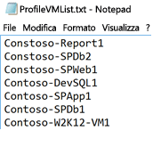

####Avviare la profilatura
Dopo aver ottenuto l'elenco di macchine virtuali da profilare, è possibile eseguire lo strumento in modalità di profilatura. Di seguito è riportato l'elenco dei parametri obbligatori e facoltativi dello strumento per l'esecuzione in modalità di profilatura. I parametri in [] sono facoltativi.

ASRDeploymentPlanner.exe -Operation StartProfiling /?

| Nome parametro | Descrizione |
|---|---|
| -Operation |      StartProfiling |
| -Server | Nome di dominio completo o indirizzo IP del server vCenter o dell'host ESXi con le macchine virtuali da profilare.|
| -User | Nome utente per la connessione al server vCenter o all'host ESXi. L'utente deve avere almeno l'accesso in sola lettura.|
| -VMListFile |    File con l'elenco di macchine virtuali da profilare. Il percorso del file può essere assoluto o relativo. Questo file deve contenere un solo nome/indirizzo IP di macchina virtuale per riga. Il nome della macchina virtuale specificato nel file deve corrispondere al nome nel server vCenter o nell'host ESXi.   Ad esempio, il file “VMList.txt” contiene le macchine virtuali seguenti: virtual_machine_A  10.150.29.110 virtual_machine_B |
| -NoOfDaysToProfile | Numero di giorni per i quali eseguire la profilatura. È consigliabile eseguire la profilatura per più di 15 giorni per far sì che il modello di carico di lavoro nell'ambiente venga osservato nel periodo specificato e usato per fornire un'indicazione accurata |
| [-Directory] |    UNC o percorso della directory locale per l'archiviazione dei dati generati durante la profilatura. Se non viene specificato, per impostazione predefinita verrà usata la directory denominata 'ProfiledData' nel percorso corrente. |
| [-Password ] | Modificare le credenziali usate per la connessione al server vCenter o all'host ESXi. Se non viene specificato in questa fase, verrà chiesto all'esecuzione del comando.|
|  [-StorageAccountName]  | Nome dell'account di archiviazione di Azure per determinare la velocità effettiva ottenibile per la replica dei dati dall'ambiente locale ad Azure. Lo strumento carica i dati di test in questo account di archiviazione per calcolare la velocità effettiva.|
| [-StorageAccountKey] | Chiave dell'account di archiviazione di Azure usata per accedere all'account di archiviazione. Passare al portale di Azure e scegliere Account di archiviazione > [nome account di archiviazione] > Impostazioni > Chiavi di accesso > Key1 oppure Chiave di accesso primaria per l'account di archiviazione classico. |

È consigliabile profilare le macchine virtuali per almeno 15-30 giorni. Durante il periodo di profilatura, ASRDeploymentPlanner.exe rimane in esecuzione. Lo strumento accetta l'input della durata della profilatura in giorni. Se si vuole eseguire la profilatura per alcune ore o alcuni minuti per un rapido test dello strumento, nell'anteprima pubblica sarà necessario convertire la durata nella misura equivalente in giorni.  Per eseguire ad esempio la profilatura per 30 minuti, l'input dovrà essere 30 / (60*24) = 0,021 giorni.  La durata minima della profilatura è di 30 minuti.

Durante la profilatura è possibile passare il nome e la chiave di un account di archiviazione di Azure per determinare la velocità effettiva che Azure Site Recovery può raggiungere al momento della replica dal server di configurazione o dal server di elaborazione ad Azure. Se il nome e la chiave dell'account di archiviazione di Azure non vengono passati durante la profilatura, lo strumento non calcola la velocità effettiva ottenibile.

È possibile eseguire più istanze dello strumento per diversi set di macchine virtuali. Assicurarsi che i nomi delle macchine virtuali non siano ripetuti nei set di profilatura. Se ad esempio sono state profilate dieci macchine virtuali (VM1 - VM10) e dopo alcuni giorni si vogliono profilare altre cinque macchine virtuali (VM11 - VM15), è possibile eseguire lo strumento da un'altra console della riga di comando per il secondo set di macchine virtuali (VM11 - VM15). Verificare tuttavia che le macchine virtuali del secondo set non abbiano nomi uguali a quelli della prima istanza di profilatura oppure usare una directory di output diversa per la seconda esecuzione. Se vengono usate due istanze dello strumento per profilare le stesse macchine virtuali usando la stessa directory di output, il report generato sarà errato.

La configurazione della macchina virtuale viene acquisita una volta all'inizio dell'operazione di profilatura e archiviata in un file denominato VMDetailList.xml. Queste informazioni verranno usate al momento della generazione di report. Qualsiasi modifica apportata alla configurazione della macchina virtuale (ad esempio incremento del numero di core, dischi, schede di interfaccia di rete e così via) dall'avvio al termine della profilatura non verrà acquisita. In una situazione in cui la configurazione di una macchina virtuale profilata è stata modificata nel corso della profilatura, nell'anteprima pubblica è disponibile la soluzione alternativa seguente per ottenere i dettagli più recenti della macchina virtuale durante la generazione di report.   

* Eseguire il backup di 'VMdetailList.xml' ed eliminare il file dal percorso corrente.
* Passare gli argomenti -User e -Password al momento della generazione di report.

Il comando di profilatura genera diversi file nella directory della profilatura. Non eliminare questi file, altrimenti la generazione di report verrà compromessa.

#####Esempio 1: per profilare le macchine virtuali per 30 giorni e determinare la velocità effettiva dall'ambiente locale ad Azure
ASRDeploymentPlanner.exe **-Operation** StartProfiling -Directory “E:\vCenter1_ProfiledData” **-Server** vCenter1.contoso.com **-VMListFile** “E:\vCenter1_ProfiledData\ProfileVMList1.txt”  **-NoOfDaysToProfile**  30  **-User** vCenterUser1 **-StorageAccountName**  asrspfarm1 **-StorageAccountKey** Eby8vdM02xNOcqFlqUwJPLlmEtlCDXJ1OUzFT50uSRZ6IFsuFq2UVErCz4I6tq/K1SZFPTOtr/KBHBeksoGMGw==

#####Esempio 2: per profilare le macchine virtuali per 15 giorni
ASRDeploymentPlanner.exe **-Operation** StartProfiling **-Directory** “E:\vCenter1_ProfiledData” **-Server** vCenter1.contoso.com **-VMListFile** “E:\vCenter1_ProfiledData\ProfileVMList1.txt”  **-NoOfDaysToProfile**  15  -User vCenterUser1

#####Esempio 3: per profilare le macchine virtuali per 1 ora per un rapido test dello strumento
ASRDeploymentPlanner.exe **-Operation** StartProfiling **-Directory** “E:\vCenter1_ProfiledData” **-Server** vCenter1.contoso.com **-VMListFile** “E:\vCenter1_ProfiledData\ProfileVMList1.txt”  **-NoOfDaysToProfile**  0.04  **-User** vCenterUser1

>[!NOTE]
>
> * Se il server in cui viene eseguito lo strumento viene riavviato o si è arrestato in modo anomalo o si esce dallo strumento con Ctrl + C, i dati di profilatura verranno conservati. In questi casi potrebbero andare persi gli ultimi 15 minuti di dati profilati. È necessario eseguire nuovamente lo strumento in modalità di profilatura dopo il riavvio del server.
>
> * Quando vengono passati il nome e la chiave di un account di archiviazione di Azure, lo strumento misura la velocità effettiva all'ultimo passaggio della profilatura. Se lo strumento viene terminato prima del normale completamento della profilatura, la velocità effettiva non verrà calcolata. È sempre possibile eseguire l'operazione GetThroughput dalla console della riga di comando per determinare la velocità effettiva prima di generare il report, in caso contrario il report generato non conterrà le informazioni sulla velocità effettiva ottenuta.
>

##Generare il report
Lo strumento genera un file XLSM (file di Microsoft Excel con attivazione macro) come output del report, con il riepilogo di tutte le indicazioni di distribuzione. Il report è denominato DeploymentPlannerReport_<Unique Numeric Identifier>.xlsm e viene inserito nella directory specificata.

Al termine della profilatura è possibile eseguire lo strumento in modalità di generazione di report. Di seguito è riportato l'elenco dei parametri obbligatori e facoltativi dello strumento per l'esecuzione in modalità di generazione di report. I parametri in [] sono facoltativi.

ASRDeploymentPlanner.exe -Operation GenerateReport /?

|Nome parametro | Descrizione |
|-|-|
| -Operation | GenerateReport |
| -Server |  Nome dominio completo o indirizzo IP (usare lo stesso nome o indirizzo IP usato al momento della profilatura) del server vCenter/vSphere in cui si trovano le macchine virtuali profilate per le quali generare il report. Si noti che se è stato usato un server vCenter al momento della profilatura non è possibile usare un server vSphere per la generazione di report e viceversa.|
| -VMListFile | Il file con l'elenco di macchine virtuali profilate per cui viene generato il report. Il percorso del file può essere assoluto o relativo. Questo file deve contenere un solo nome/indirizzo IP di macchina virtuale per riga. I nomi delle macchine virtuali specificati nel file devono corrispondere ai nomi delle macchine virtuali nel server vCenter o nell'host ESXi e usati al momento della profilatura.|
| [-Directory] | UNC o percorso della directory locale in cui vengono archiviati i dati profilati, ovvero i file generati durante la profilatura. Questi dati sono necessari per la generazione di report. Se questo parametro non è specificato, verrà usata la directory 'ProfiledData'. |
| [-GoalToCompleteIR] |    Numero di ore in cui deve essere completata la replica iniziale delle macchine virtuali profilate. Il report generato indicherà il numero di macchine virtuali per cui è possibile eseguire la replica iniziale nel tempo specificato. Il valore predefinito è 72 ore. |
| [-User] | Nome utente per la connessione al server vCenter/vSphere. Viene usato per recuperare le informazioni di configurazione più recenti per le macchine virtuali, come numero di dischi, numero di core, numero di schede di interfaccia di rete e così via, da usare nel report. Se non viene specificato verranno usate le informazioni di configurazione raccolte all'inizio della profilatura. |
| [-Password] | Modificare le credenziali usate per la connessione al server vCenter o all'host ESXi. Se non viene specificato come parametro, verrà chiesto in un secondo momento all'esecuzione del comando. |
| [-DesiredRPO] | Obiettivo del punto di ripristino (RPO) in minuti. Il valore predefinito è 15 minuti.|
| [-Bandwidth] | Larghezza di banda in Mbps. Viene usato per calcolare il valore RPO ottenibile per la larghezza di banda specificata. |
| [-StartDate]  | Data e ora di inizio in MM-GG-AAAA:HH:MM, in formato 24 ore. 'StartDate' deve essere specificato insieme a 'EndDate'. Quando specificato, il report verrà generato per i dati profilati raccolti nell'intervallo compreso tra StartDate ed EndDate. |
| [-EndDate] | Data e ora di fine in MM-GG-AAAA:HH:MM, in formato 24 ore. 'EndDate' deve essere specificato insieme a 'StartDate'. Quando specificato, il report verrà generato per i dati profilati raccolti nell'intervallo compreso tra StartDate ed EndDate. |
| [-GrowthFactor] |Fattore di crescita in percentuale. Il valore predefinito è 30%.  |

##### Esempio 1: generare report con valori predefiniti quando i dati profilati si trovano nell'unità locale
ASRDeploymentPlanner.exe **-Operation** GenerateReport **-Server** vCenter1.contoso.com **-Directory** “E:\vCenter1_ProfiledData” **-VMListFile** “E:\vCenter1_ProfiledData\ProfileVMList1.txt”

##### Esempio 2: generare report quando i dati profilati si trovano su un server remoto. L'utente deve avere l'accesso in lettura/scrittura alla directory remota.
ASRDeploymentPlanner.exe **-Operation** GenerateReport **-Server** vCenter1.contoso.com **-Directory** “\\PS1-W2K12R2\vCenter1_ProfiledData” **-VMListFile** “\\PS1-W2K12R2\vCenter1_ProfiledData\ProfileVMList1.txt”

##### Esempio 3: generare report con la larghezza di banda specificata e l'obiettivo di completare la replica iniziale nel tempo specificato
ASRDeploymentPlanner.exe **-Operation** GenerateReport **-Server** vCenter1.contoso.com **-Directory** “E:\vCenter1_ProfiledData” **-VMListFile** “E:\vCenter1_ProfiledData\ProfileVMList1.txt” **-Bandwidth** 100 **-GoalToCompleteIR** 24

##### Esempio 4: generare report con un fattore di crescita del 5% al posto del valore predefinito pari al 30%
ASRDeploymentPlanner.exe **-Operation** GenerateReport **-Server** vCenter1.contoso.com **-Directory** “E:\vCenter1_ProfiledData” **-VMListFile** “E:\vCenter1_ProfiledData\ProfileVMList1.txt” **-GrowthFactor** 5

##### Esempio 5: generare report con un subset di dati profilati. Si supponga di avere 30 giorni di dati profilati e di voler generare il report solo per 20 giorni.
ASRDeploymentPlanner.exe **-Operation** GenerateReport **-Server** vCenter1.contoso.com **-Directory** “E:\vCenter1_ProfiledData” **-VMListFile** “E:\vCenter1_ProfiledData\ProfileVMList1.txt” **-StartDate**  01-10-2017:12:30 -**EndDate** 01-19-2017:12:30

##### Esempio 6: generare report per un valore RPO di 5 minuti.
ASRDeploymentPlanner.exe **-Operation** GenerateReport **-Server** vCenter1.contoso.com **-Directory** “E:\vCenter1_ProfiledData” **-VMListFile** “E:\vCenter1_ProfiledData\ProfileVMList1.txt”  **-DesiredRPO** 5

### Valore percentile usato per il calcolo
**Quale valore percentile predefinito delle metriche delle prestazioni raccolte durante la profilatura viene usato al momento della generazione di report?**

Lo strumento usa come valore predefinito il 95° percentile di operazioni di I/O al secondo in lettura/scrittura, operazioni di I/O al secondo in scrittura e varianza dei dati raccolte durante la profilatura di tutte le macchine virtuali. In questo modo, il picco del 100° percentile che può essere rilevato dalle macchine virtuali a causa di eventi temporanei, ad esempio un processo di backup eseguito una volta al giorno, l'indicizzazione periodica di un database, la generazione di report analitici o altri eventi di breve durata che si verificano durante il periodo di profilatura, non viene usato per determinare i requisiti dell'archiviazione di Azure di destinazione e della larghezza di banda di origine. L'uso dei valori di 95° percentile fornisce un quadro attendibile delle reali caratteristiche del carico di lavoro e offre prestazioni ottimali quando questi carichi di lavoro sono in esecuzione in Microsoft Azure. Questo numero non viene di norma modificato di frequente, ma se si vuole usare un valore inferiore, ad esempio il 90° percentile, è possibile aggiornare questo file di configurazione 'ASRDeploymentPlanner.exe.config' nella cartella predefinita e salvarlo per generare un nuovo report sui dati profilati esistenti.

        &lsaquo;add key="WriteIOPSPercentile" value="95" /&rsaquo;>      
        &lsaquo;add key="ReadWriteIOPSPercentile" value="95" /&rsaquo;>      
        &lsaquo;add key="DataChurnPercentile" value="95" /&rsaquo;

### Fattore di crescita
**Perché prendere in considerazione il fattore di crescita durante la pianificazione della distribuzione?**

È fondamentale prendere in considerazione la crescita nelle caratteristiche del carico di lavoro supponendo un potenziale aumento dell'utilizzo nel tempo. Dopo aver applicato la protezione, se le caratteristiche del carico di lavoro cambiano non è infatti attualmente possibile passare a un account di archiviazione di Azure diverso per la protezione senza disabilitare e riabilitare la protezione stessa. Ad esempio, se attualmente una macchina virtuale è idonea per un account di replica di archiviazione Standard, tra tre mesi potrebbe essere necessario disabilitare e riabilitare la protezione per passare a un account di archiviazione Premium a causa di un aumento del numero di utenti dell'applicazione in esecuzione nella macchina virtuale, se la varianza nella VM aumenta ed è necessario passare all'archiviazione Premium in modo che la replica di Azure Site Recovery possa sostenere la nuova varianza più elevata. È quindi fortemente consigliabile pianificare la crescita durante la pianificazione della distribuzione. Il valore predefinito è 30%. L'utente conosce il modello di utilizzo delle applicazioni e le previsioni di crescita e può modificare questo valore di conseguenza durante la generazione di un report. È possibile generare più report con fattori di crescita differenti per gli stessi dati profilati e determinare le raccomandazioni ottimali in termini di archiviazione di Azure di destinazione e larghezza di banda di origine.

Il report di Microsoft Excel generato contiene i fogli seguenti

* [Input](site-recovery-deployment-planner.md#input)
* [Raccomandazioni](site-recovery-deployment-planner.md#recommendations-with-desired-rpo-as-input)
* [Raccomandazioni con input della larghezza di banda](site-recovery-deployment-planner.md#recommendations-with-available-bandwidth-as-input)
* [Selezione host di archiviazione delle VM](site-recovery-deployment-planner.md#vm-storage-placement)
* [VM compatibili](site-recovery-deployment-planner.md#compatible-vms)
* [VM incompatibili](site-recovery-deployment-planner.md#incompatible-vms)

##Misurare la velocità effettiva
Per stimare la velocità effettiva che Azure Site Recovery può ottenere dall'ambiente locale ad Azure durante la replica, eseguire lo strumento in modalità GetThroughput. Lo strumento calcola la velocità effettiva dal server in cui è in esecuzione lo strumento, idealmente un server basato sulle linee guida di ridimensionamento del server di configurazione.  Se i componenti dell'infrastruttura di Azure Site Recovery sono già stati distribuiti in locale, eseguire lo strumento nel server di configurazione.

Aprire una console della riga di comando e passare alla cartella dello strumento di pianificazione della distribuzione di ASR.  Eseguire ASRDeploymentPlanner.exe con i parametri seguenti. I parametri in [] sono facoltativi.

ASRDeploymentPlanner.exe -Operation GetThroughput /?

|Nome parametro | Descrizione |
|-|-|
| -operation | GetThroughput |
| [-Directory] | UNC o percorso della directory locale in cui vengono archiviati i dati profilati, ovvero i file generati durante la profilatura. Questi dati sono necessari per la generazione di report. Se questo parametro non è specificato, verrà usata la directory 'ProfiledData'.  |
| -StorageAccountName | Nome dell'account di archiviazione di Azure per determinare la larghezza di banda utilizzata per la replica dei dati dall'ambiente locale ad Azure. Lo strumento carica i dati di test in questo account di archiviazione per determinare la larghezza di banda utilizzata. |
| -StorageAccountKey | Chiave dell'account di archiviazione di Azure usata per accedere all'account di archiviazione. Passare al portale di Azure e scegliere Account di archiviazione > [nome account di archiviazione] > Impostazioni > Chiavi di accesso > Key1 oppure Chiave di accesso primaria per l'account di archiviazione classico. |
| -VMListFile | File con l'elenco di macchine virtuali da profilare per calcolare la larghezza di banda utilizzata. Il percorso del file può essere assoluto o relativo. Questo file deve contenere un solo nome/indirizzo IP di macchina virtuale per riga. I nomi delle macchine virtuali specificati nel file devono corrispondere ai nomi delle macchine virtuali nel server vCenter o nell'host ESXi. Ad esempio, Il file “VMList.txt” contiene le macchine virtuali seguenti: virtual machine_A  10.150.29.110 virtual machine_B|

Lo strumento crea diversi file 'asrvhdfile<#>.vhd' (dove # è il numero) da 64 MB nella directory specificata.  Questi file vengono caricati nell'account di archiviazione di Azure per determinare la velocità effettiva. Dopo aver misurato la velocità effettiva, lo strumento elimina tutti i file dall'account di archiviazione di Azure e dal server locale. Se lo strumento viene terminato per un motivo qualsiasi durante il calcolo della velocità effettiva, i file non verranno eliminati dall'account di archiviazione di Azure o dal server locale e dovranno essere eliminati manualmente.

La velocità effettiva viene misurata in un determinato momento ed è la velocità effettiva massima che Azure Site Recovery può raggiungere durante la replica se tutti gli altri fattori rimangono invariati. Se ad esempio un'applicazione inizia a utilizzare più larghezza di banda nella stessa rete, la velocità effettiva varierà durante la replica. Se si esegue il comando GetThroughput da un server di configurazione, lo strumento non rileva le macchine virtuali protette e la replica in corso. Il risultato della velocità effettiva misurata differirà a seconda che l'operazione GetThroughput venga eseguita quando le macchine virtuali protette hanno una varianza dei dati elevata o una varianza dei dati bassa.  È consigliabile eseguire lo strumento in momenti diversi durante la profilatura per determinare la velocità effettiva ottenibile in più momenti. Nel report, lo strumento indica l'ultima velocità effettiva misurata.

##### Esempio
ASRDeploymentPlanner.exe **-Operation** GetThroughput **-Directory**  E:\vCenter1_ProfiledData **-VMListFile** E:\vCenter1_ProfiledData\ProfileVMList1.txt  **-StorageAccountName**  asrspfarm1 **-StorageAccountKey** by8vdM02xNOcqFlqUwJPLlmEtlCDXJ1OUzFT50uSRZ6IFsuFq2UVErCz4I6tq/K1SZFPTOtr/KBHBeksoGMGw==

>[!NOTE]
>
> * Eseguire lo strumento su un server avente le stesse caratteristiche di archiviazione e CPU del server di configurazione
>
> * Per la replica, eseguire il provisioning della larghezza di banda consigliata per soddisfare il valore RPO per il 100% del tempo. Anche dopo il provisioning della larghezza di banda appropriata, se non è visibile un aumento della velocità effettiva ottenuta indicata dallo strumento, verificare quanto segue:
>
> a. Verificare se sono presenti requisiti di qualità del servizio (QoS) che limitano la velocità effettiva di Azure Site Recovery
>
> b. Verificare se l'insieme di credenziali di Azure Site Recovery si trova nell'area fisica di Microsoft Azure più vicina supportata per ridurre al minimo la latenza di rete
>
> c. Verificare le caratteristiche dell'archiviazione locale e migliorare l'hardware, ad esempio da unità HDD a unità SSD e così via.
>
> d. Modificare le impostazioni di Azure Site Recovery nel server di elaborazione per [aumentare la larghezza di banda di rete usata per la replica](./site-recovery-plan-capacity-vmware.md#control-network-bandwidth).
>

##Raccomandazioni con valore RPO desiderato come input

###Dati profilati

**Profiled data period** (Periodo profilatura dati) è la durata di esecuzione della profilatura. Per impostazione predefinita, lo strumento prende in considerazione tutti i dati profilati per il calcolo, a meno che il report non venga generato per un periodo specifico usando le opzioni StartDate ed EndDate durante la generazione del report.

**Server Name** (Nome server) è il nome o l'indirizzo IP del server VMware vCenter o dell'host ESXi contenente le macchine virtuali per le quali viene generato il report.

**Desired RPO** (RPO desiderato) è l'obiettivo del punto di ripristino per la distribuzione. Per impostazione predefinita, la larghezza di banda di rete viene calcolata per i valori RPO di 15, 30 e 60 minuti. A seconda della selezione, i valori interessati verranno aggiornati nel foglio. Se è stato usato il parametro DesiredRPOinMin durante la generazione del report, tale valore verrà visualizzato nell'elenco a discesa Desired RPO (RPO desiderato).

###Panoramica della profilatura

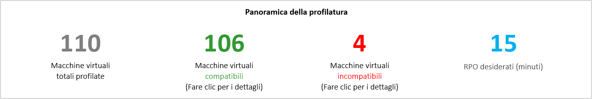

**Total Profiled Virtual Machines** (Totale macchine virtuali profilate) è il numero totale di macchine virtuali per le quali sono disponibili dati profilati. Se il parametro VMListFile presenta nomi di macchine virtuali che non sono state profilate, tali macchine virtuali non verranno considerate nella generazione di report ed escluse dal conteggio totale delle macchine virtuali profilate.

Le macchine virtuali **compatibili** sono le macchine virtuali che possono essere protette in Azure con Azure Site Recovery. Si tratta del numero totale di macchine virtuali compatibili per le quali vengono calcolati larghezza di banda di rete, numero di account di archiviazione di Azure, numero di core di Microsoft Azure, numero di server di configurazione e di server di elaborazione aggiuntivi. I dettagli di ogni macchina virtuale compatibile sono disponibili nel foglio Compatible VMs (VM compatibili) del report.

Le macchine virtuali **incompatibili** sono le macchine virtuali profilate incompatibili con la protezione con Azure Site Recovery. I motivi dell'incompatibilità sono indicati nella sezione Macchine virtuali incompatibili di seguito. Se il parametro VMListFile presenta nomi di macchine virtuali che non sono state profilate, tali macchine virtuali saranno escluse dal conteggio totale delle macchine virtuali incompatibili. Queste macchine virtuali sono elencate con la dicitura "Data not found" (Dati non trovati) alla fine del foglio Incompatible VMs (VM incompatibili).

**Desired RPO** (RPO desiderato) è il valore RPO desiderato in minuti. Il report viene generato per tre valori RPO, ovvero 15, 30 e 60 minuti. L'impostazione predefinita è 15 minuti. La raccomandazione relativa alla larghezza di banda nel report varierà in funzione della selezione nell'elenco a discesa Desired RPO (RPO desiderato) nella parte superiore destra del foglio. Se il report è stato generato usando il parametro "-DesiredRPO" con un valore personalizzato, questo valore personalizzato verrà visualizzato come predefinito nella casella a discesa Desired RPO (RPO desiderato).

###Larghezza di banda di rete necessaria (Mbps)

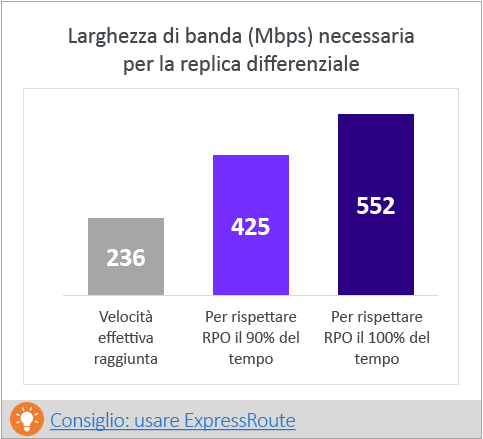

**To meet RPO 100% of the time** (Per soddisfare il valore RPO il 100% del tempo): larghezza di banda consigliata in Mbps per soddisfare il valore RPO desiderato il 100% del tempo. Questa larghezza di banda deve essere dedicata alla replica differenziale stazionaria di tutte le macchine virtuali compatibili per evitare violazioni di RPO.

**To meet RPO 90% of the time** (Per soddisfare il valore RPO il 90% del tempo): se a causa dei prezzi della banda larga o per altri motivi non è possibile effettuare il provisioning della larghezza di banda necessaria per soddisfare il valore RPO desiderato il 100% del tempo, è possibile scegliere di passare a una larghezza di banda inferiore che possa soddisfare il valore RPO desiderato il 90% del tempo. Per comprendere le implicazioni del provisioning di questa larghezza di banda inferiore, il report offre un'analisi ipotetica del numero e della durata delle violazioni del valore RPO prevedibili.

**Achieved Throughput** (Velocità effettiva ottenuta): velocità effettiva dal server in cui è stato eseguito il comando GetThroughput all'area di Microsoft Azure in cui si trova l'account di archiviazione di Azure. Indica la velocità effettiva approssimativa ottenibile quando si proteggono le macchine virtuali compatibili con Azure Site Recovery, se le caratteristiche di archiviazione e di larghezza di banda del server di configurazione e del server di elaborazione rimangono uguali a quelle del server dal quale è stato eseguito lo strumento. La velocità effettiva ottenuta è la velocità effettiva dal server in cui è stato eseguito il comando GetThroughput all'area di Microsoft Azure in cui si trova l'account di archiviazione di Azure. Indica la velocità effettiva approssimativa ottenibile quando si proteggono le macchine virtuali compatibili con Azure Site Recovery, se le caratteristiche di archiviazione e di larghezza di banda del server di configurazione e del server di elaborazione rimangono uguali a quelle del server dal quale è stato eseguito lo strumento.

Per la replica è necessario eseguire il provisioning della larghezza di banda consigliata per soddisfare il valore RPO per il 100% del tempo. Anche dopo il provisioning della larghezza di banda appropriata, se non è visibile un aumento della velocità effettiva ottenuta indicata dallo strumento, verificare quanto segue:

a.    Verificare se sono presenti requisiti di qualità del servizio (QoS) che limitano la velocità effettiva di Azure Site Recovery

b.    Verificare se l'insieme di credenziali di Azure Site Recovery si trova nell'area fisica di Microsoft Azure più vicina supportata per ridurre al minimo la latenza di rete

c.    Verificare le caratteristiche dell'archiviazione locale e migliorare l'hardware, ad esempio da unità HDD a unità SSD e così via.

d. Modificare le impostazioni di Azure Site Recovery nel server di elaborazione per [aumentare la larghezza di banda di rete usata per la replica](./site-recovery-plan-capacity-vmware.md#control-network-bandwidth).

Se lo strumento viene eseguito in un server di configurazione o server di elaborazione che ha già macchine virtuali protette, eseguire lo strumento più volte perché la velocità effettiva ottenuta cambia a seconda della varianza elaborata in quel particolare momento.

Per tutte le distribuzioni aziendali di Azure Site Recovery è consigliabile usare [ExpressRoute](https://aka.ms/expressroute).

###Required Azure Storage Accounts (Account di archiviazione di Azure necessari)
Questo grafico indica il numero totale di account di archiviazione di Azure (Standard e Premium) necessari per proteggere tutte le macchine virtuali compatibili.  Fare clic su [Recommended VM placement plan](site-recovery-deployment-planner.md#vm-storage-placement) (Piano di selezione host consigliato per VM) per determinare l'account di archiviazione da usare per ogni macchina virtuale.  

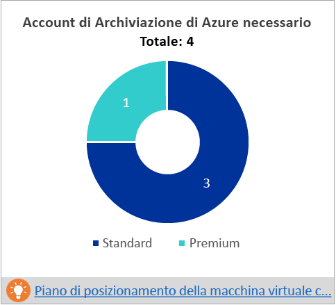

###Required Number of Azure Cores (Numero di core Azure necessari)
Numero totale di core da sottoporre a provisioning prima del failover o del failover di test di tutte le macchine virtuali compatibili. Se non sono disponibili core sufficienti nella sottoscrizione, Azure Site Recovery non creerà le macchine virtuali al momento del failover di test o del failover.

###Required On-premises Infrastructure (Infrastruttura locale necessaria)
Numero totale di server di configurazione e di altri server di elaborazione da configurare per proteggere tutte le macchine virtuali compatibili. Lo strumento consiglierà server aggiuntivi a seconda dei [limiti](https://aka.ms/asr-v2a-on-prem-components) supportati nella configurazione più grande, ovvero la varianza giornaliera o il numero massimo di macchine virtuali protette (presupponendo una media di tre dischi per macchina virtuale), a seconda del valore raggiunto per primo nel server di configurazione o nel server di elaborazione aggiuntivo. I dettagli della varianza totale giornaliera e il numero totale di dischi protetti sono disponibili nel foglio [Input](site-recovery-deployment-planner.md#input).

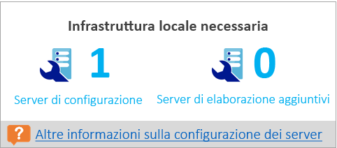

###Analisi ipotetica
Questa analisi indica quante violazioni possono verificarsi durante il periodo di profilatura quando si esegue il provisioning di una larghezza di banda inferiore per soddisfare il valore RPO desiderato solo il 90% del tempo. Possono verificarsi una o più violazioni del valore RPO in un giorno; il grafico illustra il valore RPO di picco del giorno.
In base a questa analisi è possibile stabilire se il numero di violazioni del valore RPO per il totale dei giorni e il valore RPO di picco raggiunto ogni giorno siano accettabili con la larghezza di banda inferiore specificata. Se sono accettabili è possibile allocare la larghezza di banda inferiore per la replica, altrimenti allocare la larghezza di banda superiore come suggerito per soddisfare il valore RPO desiderato il 100% del tempo.

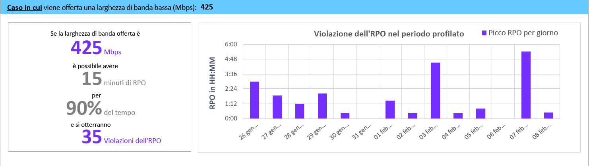

###Dimensioni raccomandate per i batch di VM per la replica iniziale
Questa sezione consiglia il numero di macchine virtuali che possono essere protette in parallelo per completare la replica iniziale entro 72 ore con il provisioning della larghezza di banda suggerita per soddisfare il valore RPO desiderato il 100% del tempo. Si tratta di un valore configurabile: usare il parametro GoalToCompleteIR durante la generazione di report per modificarlo.  Il grafico mostra un intervallo di valori di larghezza di banda e il numero calcolato di macchine virtuali per batch per completare la replica iniziale in 72 ore, in base alle dimensioni medie rilevate per tutte le macchine virtuali compatibili.  

Nell'anteprima pubblica, il report non specifica quali macchine virtuali includere in un batch. È possibile usare lo spazio su disco visualizzato nel foglio Compatible VMs (VM compatibili) per determinare le dimensioni di ogni macchina virtuale e selezionare le macchine virtuali per un batch oppure selezionare in base alle caratteristiche note del carico di lavoro.  Il tempo di completamento della replica iniziale varia in modo proporzionale allo spazio su disco effettivo della macchina virtuale, allo spazio su disco usato e alla velocità effettiva della rete disponibile.

###Fattore di crescita e valori percentili usati
Questa sezione nella parte inferiore del foglio indica il valore percentile usato per tutti i contatori delle prestazioni delle macchine virtuali profilate (il valore predefinito è il 95° percentile) e il fattore di crescita in percentuale usato in tutti i calcoli (il valore predefinito è 30%).

##Raccomandazioni con la larghezza di banda disponibile come input

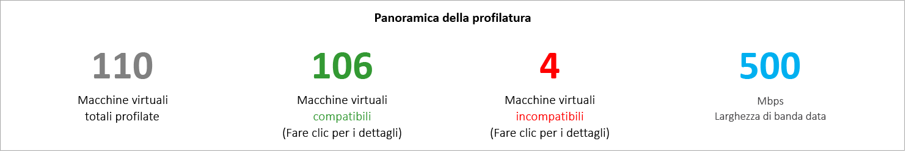

Si possono verificare situazioni in cui non è possibile effettuare il provisioning oltre un dato valore di Mbps di larghezza di banda per la replica di Azure Site Recovery. Lo strumento consente di immettere la larghezza di banda disponibile (con il parametro -Bandwidth durante la generazione di report) e determinare il valore RPO ottenibile in minuti. Con questo valore RPO ottenibile è possibile decidere se è necessario eseguire il provisioning di altra larghezza di banda o se è sufficiente una soluzione di ripristino di emergenza con questo valore RPO.

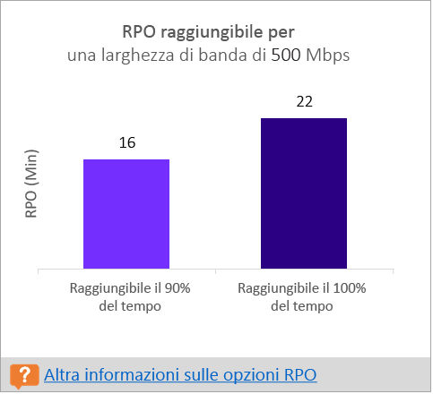

##Input
La pagina Input offre una panoramica dell'ambiente VMware profilato.

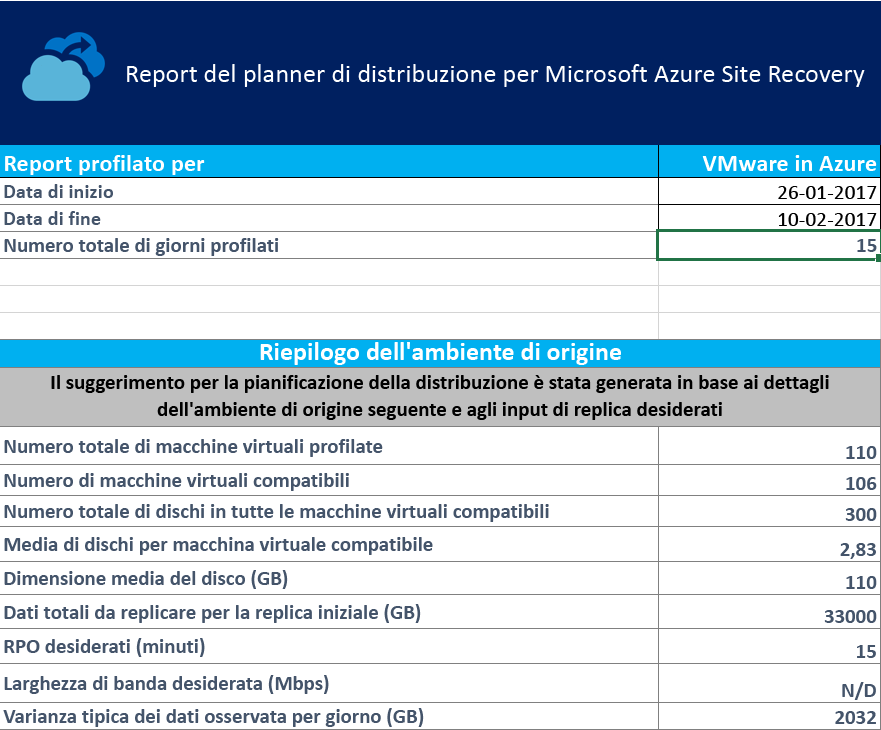

**Start Date (Data di inizio) ed End Date (Data di fine)** sono le date di inizio e fine dei dati di profilatura considerati per la generazione di report. Per impostazione predefinita, la data di inizio è la data in cui è iniziata la profilatura e la data di fine è la data in cui è terminata.  Può trattarsi dei valori di 'StartDate' ed 'EndDate' se il report viene generato con questi parametri. Start Date (Data di inizio) ed End Date (Data di fine): date di inizio e fine dei dati di profilatura considerati per la generazione di report. Per impostazione predefinita, la data di inizio è la data in cui è iniziata la profilatura e la data di fine è la data in cui è terminata.  Può trattarsi dei valori di 'StartDate' ed 'EndDate' se il report viene generato con questi parametri.

**Total number of profiling days** (Numero totale di giorni di profilatura) è il numero totale di giorni di profilatura tra le date di inizio e fine per i quali viene generato il report. Il numero totale di giorni di profilatura è il numero totale di giorni di profilatura tra le date di inizio e fine per i quali viene generato il report.

**Number of compatible virtual machines** (Numero di macchine virtuali compatibili) è il numero totale di macchine virtuali compatibili per le quali vengono calcolati la larghezza di banda di rete e il numero necessario di account di archiviazione di Azure, core di Microsoft Azure, server di configurazione e server di elaborazione aggiuntivi.
Total number of disks across all compatible virtual machines (Numero totale di dischi tra tutte le macchine virtuali compatibili) è il numero totale di dischi tra tutte le macchine virtuali compatibili. Questo numero viene usato come uno degli input per stabilire il numero di server di configurazione e di server di elaborazione aggiuntivi da usare nella distribuzione.

**Average number of disks per compatible virtual machine** (Numero medio di dischi per macchina virtuale compatibile) è il numero medio di dischi calcolato tra tutte le macchine virtuali compatibili.

**Average disk size (GB)** (Dimensioni medie disco - GB) sono le dimensioni medie dei dischi calcolate tra tutte le macchine virtuali compatibili.

**Desired RPO (minutes)** (RPO desiderato - minuti) è il valore RPO predefinito o il valore passato per il parametro 'DesiredRPO' al momento della generazione di report per stimare la larghezza di banda necessaria.

**Desired bandwidth (Mbps)** (Larghezza di banda desiderata - Mbps) è il valore passato per il parametro 'Bandwidth' al momento della generazione di report per stimare il valore RPO ottenibile.

**Observed typical data churn per day (GB)** (Varianza dei dati giornaliera tipica osservata - GB) è la varianza media dei dati osservata in tutti i giorni di profilatura. Questo numero viene usato come uno degli input per stabilire il numero di server di configurazione e di server di elaborazione aggiuntivi da usare nella distribuzione.

##Selezione host di archiviazione delle VM

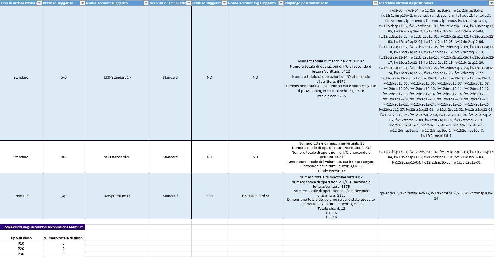

**Disk Storage Type** (Tipo di archiviazione disco) è l'account di archiviazione di Azure 'Standard' o 'Premium' usato per replicare tutte le macchine virtuali corrispondenti indicate nella colonna 'VMs to Place' (VM da posizionare).

**Suggested Prefix** (Prefisso suggerito) è il prefisso di tre caratteri che può essere usato per la denominazione dell'account di archiviazione di Azure. È sempre possibile usare un prefisso personalizzato, ma quello suggerito dallo strumento segue la [convenzione di denominazione delle partizioni degli account di archiviazione di Azure](https://aka.ms/storage-performance-checklist).

**Suggested Account Name** (Nome account suggerito) indica il nome dell'account di archiviazione di Azure dopo avere incluso il prefisso suggerito. Sostituire il nome in < > con l'input personalizzato.

**Log Storage Account** (Account di archiviazione log): tutti i log di replica vengono archiviati in un account di archiviazione di Azure Standard. Per le macchine virtuali che eseguono la replica in un account di archiviazione di Azure Premium, è necessario effettuare il provisioning di un account di archiviazione di Azure Standard aggiuntivo per l'archiviazione dei log. Un singolo account di archiviazione log Standard può essere usato da più account di archiviazione di replica Premium. Le macchine virtuali replicate negli account di archiviazione Standard usano lo stesso account di archiviazione per i log.

**Suggested Log Account Name** (Nome account log suggerito) indica il nome dell'account di archiviazione log di Azure dopo avere incluso il prefisso suggerito. Sostituire il nome in < > con l'input personalizzato.

**Placement Summary** (Riepilogo di selezione host) offre un riepilogo del carico totale delle macchine virtuali nell'account di archiviazione di Azure al momento della replica e del failover di test/failover. Comprende il numero totale di macchine virtuali mappate all'account di archiviazione di Azure, il numero totale di operazioni di I/O al secondo in lettura/scrittura per tutte le macchine virtuali inserite in questo account di archiviazione di Azure, il totale delle operazioni di I/O al secondo in scrittura (replica), le dimensioni totali di cui è stato effettuato il provisioning per tutti i dischi e il numero totale di dischi.

**VMs to Place** (Macchine virtuali da inserire) elenca tutte le macchine virtuali da inserire nell'account di archiviazione di Azure specificato per ottenere utilizzo e prestazioni ottimali.

##VM compatibili
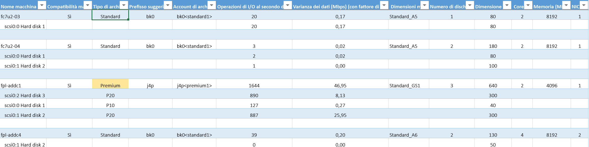

**VM Name** (Nome VM) è il nome della macchina virtuale o l'indirizzo IP usato nel parametro VMListFile al momento della generazione di report. Questa colonna elenca anche i dischi (VMDK) collegati alle macchine virtuali.

**VM Compatibility** (Compatibilità VM) presenta due valori: Yes / Yes*. Yes* è per i casi in cui la macchina virtuale sia idonea per l'[archiviazione di Azure Premium](https://aka.ms/premium-storage-workload) in virtù della varianza elevata e delle operazioni di I/O al secondo che rientrano nella categoria P20 o P30, ma le dimensioni del disco prevedono la mappatura alla categoria P10 o P20. Archiviazione di Azure determina a quale tipo di disco di archiviazione Premium mappare un disco in base alle dimensioni, ovvero dimensioni < 128 GB rientrano nella categoria P10, da 128 a 512 GB nella categoria P20 e da 512 GB a 1023 GB nella categoria P30. Se quindi in virtù delle caratteristiche del carico di lavoro un disco appartiene alla categoria P20 o P30, ma le dimensioni lo associano a un tipo di disco di archiviazione Premium inferiore, lo strumento contrassegna tale macchina virtuale con Yes* e consiglia di modificare le dimensioni del disco di origine per renderlo idoneo al tipo di disco di archiviazione Premium raccomandato oppure di modificare il tipo di disco di destinazione dopo il failover.
Il tipo di archiviazione è Standard o Premium.

**Suggested Prefix** (Prefisso suggerito) è il prefisso di tre caratteri dell'account di archiviazione di Azure

**Storage Account** (Account di archiviazione) è il nome con il prefisso suggerito

**R/W IOPS (with Growth Factor)** (Operazioni di I/O al secondo in lettura/scrittura - con fattore di crescita) indica il picco di operazioni di I/O al secondo nel disco (il valore predefinito è 95° percentile), incluso il fattore di crescita futuro (il valore predefinito è 30%). Si noti che il totale delle operazioni di I/O al secondo in lettura/scrittura della macchina virtuale non sarà sempre costituito dalla somma delle operazioni di I/O al secondo in lettura/scrittura dei singoli dischi della macchina virtuale perché il picco di operazioni di I/O al secondo in lettura/scrittura corrisponde al picco della somma delle operazioni di I/O al secondo in lettura/scrittura dei singoli dischi per ogni minuto del periodo di profilatura.

**Data Churn in Mbps (with Growth Factor)** (Varianza dati in Mbps - con fattore di crescita) indica il picco della frequenza di varianza nel disco (il valore predefinito è 95° percentile), incluso il fattore di crescita futuro (il valore predefinito è 30%). Si noti che la varianza dei dati totale della macchina virtuale non sarà sempre costituita dalla somma delle varianze dei singoli dischi della macchina virtuale perché il picco della varianza dei dati corrisponde al picco della somma delle varianze dei singoli dischi per ogni minuto del periodo di profilatura.

**Azure VM Size** (Dimensioni VM Azure) sono le dimensioni ideali del mapping per il calcolo di Azure per questa macchina virtuale locale. Questo mapping viene eseguito in base alla memoria, al numero di dischi/core/schede di interfaccia di rete e operazioni di I/O al secondo in lettura/scrittura della macchina virtuale locale. La raccomandazione prevede sempre le dimensioni minime della macchina virtuale di Azure corrispondenti a tutte queste caratteristiche della macchina virtuale locale.

**Number of Disks** (Numero di dischi) è il numero totale dei dischi (VMDK) nella macchina virtuale

**Disk size (GB)** (Dimensioni disco - GB) sono le dimensioni totali di provisioning di tutti i dischi della macchina virtuale. Lo strumento indica anche le dimensioni dei singoli dischi della macchina virtuale.

**Core** è il numero di core CPU nella macchina virtuale.

**Memoria (MB)** è la RAM disponibile nella macchina virtuale.

**Schede di interfaccia di rete** è il numero di schede di interfaccia di rete nella macchina virtuale.

##VM incompatibili

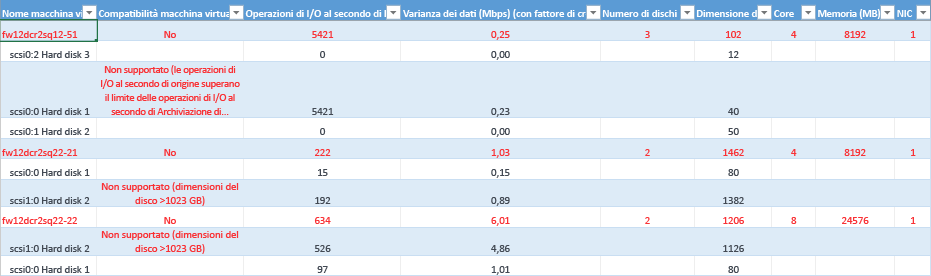

**VM Name** (Nome VM) è il nome della macchina virtuale o l'indirizzo IP usato nel parametro VMListFile al momento della generazione di report. Questa colonna elenca anche i dischi (VMDK) collegati alle macchine virtuali.

**VM Compatibility** (Compatibilità VM) indica perché la macchina virtuale è incompatibile per l'uso con Azure Site Recovery. I motivi vengono indicati per ogni disco incompatibile della macchina virtuale e possono essere i seguenti in base ai [limiti](https://aka.ms/azure-storage-scalbility-performance) pubblicati di Archiviazione di Azure.

* Disco di dimensioni > 1023 GB: Archiviazione di Azure non supporta attualmente dimensioni > 1 TB
* Le dimensioni totali della macchina virtuale (replica + failover di test) superano i limiti supportati dall'account di archiviazione di Azure (35 TB): questa situazione si verifica generalmente quando un singolo disco nella macchina virtuale ha caratteristiche di prestazioni che superano i limiti massimi supportati da Microsoft Azure / Azure Site Recovery per l'archiviazione Standard e di conseguenza la macchina virtuale rientra nell'area dell'archiviazione Premium. Le dimensioni massime supportate da un account di archiviazione di Azure Premium sono tuttavia pari a 35 TB e non è possibile proteggere una singola macchina virtuale su più account di archiviazione. Si noti anche che quando un failover di test viene eseguito su una macchina virtuale protetta, viene eseguito nello stesso account di archiviazione in cui è in corso la replica; è quindi è necessario effettuare il provisioning del doppio delle dimensioni del disco per far sì che la replica prosegua e il failover di test venga completato in parallelo.
* Le operazioni di I/O al secondo di origine superano il limite supportato di Archiviazione di Azure di 5000 operazioni per ogni disco
* Le operazioni di I/O al secondo di origine superano il limite supportato da Archiviazione di Azure di 80.000 operazioni per ogni VM
* La varianza media dei dati supera il limite supportato da Azure Site Recovery di 10 MBps per le dimensioni I/O medie del disco
* La varianza totale dei dati per tutti i dischi della macchina virtuale supera il limite massimo supportato da Azure Site Recovery di 54 MBps per VM
* Le operazioni di I/O al secondo in scrittura superano il limite supportato da Azure Site Recovery di 840 operazioni per disco
* L'archiviazione snapshot calcolata supera il limite supportato di 10 TB

**R/W IOPS (with Growth Factor)** (Operazioni di I/O al secondo in lettura/scrittura - con fattore di crescita) indica il picco di operazioni di I/O al secondo nel disco (il valore predefinito è 95° percentile), incluso il fattore di crescita futuro (il valore predefinito è 30%). Si noti che il totale delle operazioni di I/O al secondo in lettura/scrittura della macchina virtuale non sarà sempre costituito dalla somma delle operazioni di I/O al secondo in lettura/scrittura dei singoli dischi della macchina virtuale perché il picco di operazioni di I/O al secondo in lettura/scrittura corrisponde al picco della somma delle operazioni di I/O al secondo in lettura/scrittura dei singoli dischi per ogni minuto del periodo di profilatura.

**Data Churn in Mbps (with Growth Factor)** (Varianza dati in Mbps - con fattore di crescita) indica il picco della frequenza di varianza nel disco (il valore predefinito è 95° percentile), incluso il fattore di crescita futuro (il valore predefinito è 30%). Si noti che la varianza dei dati totale della macchina virtuale non sarà sempre costituita dalla somma delle varianze dei singoli dischi della macchina virtuale perché il picco della varianza dei dati corrisponde al picco della somma delle varianze dei singoli dischi per ogni minuto del periodo di profilatura.

**Number of Disks** (Numero di dischi) è il numero totale dei dischi (VMDK) nella macchina virtuale

**Disk size (GB)** (Dimensioni disco - GB) sono le dimensioni totali di provisioning di tutti i dischi della macchina virtuale. Lo strumento indica anche le dimensioni dei singoli dischi della macchina virtuale.

**Core** è il numero di core CPU nella macchina virtuale.

**Memoria (MB)** è la RAM disponibile nella macchina virtuale.

**Schede di interfaccia di rete** è il numero di schede di interfaccia di rete nella macchina virtuale.

##Limiti di Azure Site Recovery

**Destinazione archiviazione di replica** | **Dimensioni medie I/O disco di origine** |**Varianza dati media disco di origine** | **Varianza dati totale giornaliera disco di origine**
---|---|---|---
Archiviazione standard | 8 KB    | 2 MB/s | 168 GB per disco
Premium, disco P10 | 8 KB    | 2 MB/s | 168 GB per disco
Premium, disco P10 | 16 KB | 4 MB/s |    336 GB per disco
Premium, disco P10 | 32 KB o superiore | 8 MB/s | 672 GB per disco
Premium, disco P20/P30 | 8 KB    | 5 MB/s | 421 GB per disco
Premium, disco P20/P30 | 16 KB o superiore |10 MB/s    | 842 GB per disco

Si tratta di numeri medi presupponendo una sovrapposizione I/O del 30%. Azure Site Recovery può gestire una velocità effettiva maggiore in base alla percentuale di sovrapposizione, alle dimensioni di scrittura maggiori e all'effettivo I/O del carico di lavoro. I numeri precedenti presuppongono un backlog tipico di ~5 minuti, ovvero i dati caricati verranno elaborati e verrà creato un punto di ripristino entro 5 minuti.

I limiti pubblicati precedenti si basano su test di Microsoft, ma non possono coprire tutte le possibili combinazioni di I/O delle applicazioni. I risultati effettivi variano in base alla combinazione di I/O delle applicazioni. Per risultati ottimali, anche dopo la pianificazione della distribuzione è sempre consigliabile eseguire test approfonditi con il failover di test per ottenere il quadro reale delle prestazioni.

##Note sulla versione
L'anteprima pubblica di Azure Site Recovery Deployment Planner 1.0 presenta i problemi noti seguenti che verranno risolti negli aggiornamenti futuri.

* Lo strumento funziona solo per lo scenario da VMware ad Azure, non per distribuzioni da Hyper-V ad Azure. Per lo scenario da Hyper-V ad Azure usare lo [strumento di pianificazione della capacità di Hyper-V](./site-recovery-capacity-planning-for-hyper-v-replication.md).
* L'operazione GetThroughput non è supportata nelle aree US Government e Cina di Microsoft Azure.
* Lo strumento non può profilare macchine virtuali se vCenter ha due o più macchine virtuali con lo stesso nome/indirizzo IP in host ESXi differenti. In questa versione, lo strumento ignora la profilatura di macchine virtuali con nomi/indirizzi IP duplicati nel parametro VMListFile. La soluzione alternativa consiste nel profilare le macchine virtuali con l'host ESXi invece del server vCenter. È necessario eseguire una sola istanza per ogni host ESXi.

