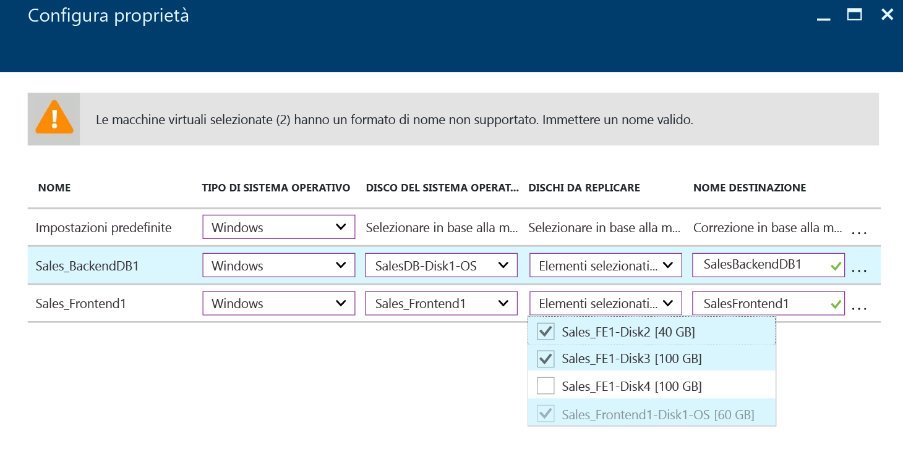
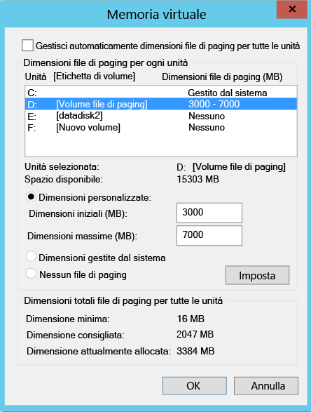
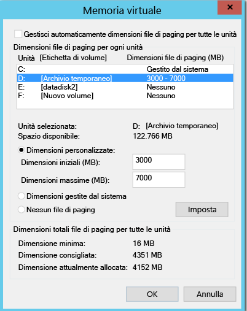
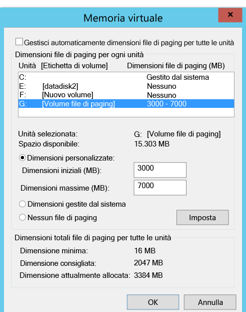
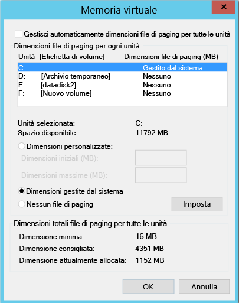

# Escludere dischi dalla replica
Questo articolo descrive come escludere dischi dalla replica, in modo da ottimizzare la larghezza di banda di replica usata o le risorse lato destinazione usate dai dischi. La funzionalità è supportata per due tipi di scenari: da VMware ad Azure e da Hyper-V ad Azure.

## Prerequisiti

Per impostazione predefinita, vengono replicati tutti i dischi presenti in un computer. Per escludere un disco dalla replica, è necessario installare manualmente il servizio Mobility nel computer prima di abilitare la replica, se si esegue la replica da VMware ad Azure.

## Perché escludere dischi dalla replica
Spesso è necessario escludere dischi dalla replica per i motivi riportati di seguito:

- I dati di varianza nel disco escluso non sono importanti o non devono essere necessariamente replicati.

- Si preferisce salvare le risorse di archiviazione e di rete non eseguendo la replica di questa varianza.

## Scenari tipici
È possibile identificare alcuni esempi specifici di varianza dei dati particolarmente adatti all'esclusione, come le scritture in un file di paging (pagefile.sys) e le scritture nel file tempdb di Microsoft SQL Server. A seconda del carico di lavoro e del sottosistema di archiviazione, il file di paging può registrare una varianza significativa. Tuttavia, la replica di questo tipo di dati dal sito primario ad Azure richiederebbe un utilizzo intensivo delle risorse. È quindi possibile ottimizzare la replica di una macchina virtuale con un singolo disco virtuale dotato di sistema operativo e file di paging eseguendo queste operazioni:

1. Suddividere il singolo disco virtuale in due dischi virtuali, uno con il sistema operativo e l'altro con il file di paging.
2. Escludere il disco del file di paging dalla replica.

Analogamente, per ottimizzare un disco in cui sono presenti sia il file tempdb di Microsoft SQL Server sia il file del database di sistema, è possibile eseguire queste operazioni:

1. Archiviare il database di sistema e il tempdb in due dischi distinti.
2. Escludere il disco del tempdb dalla replica.

## Come escludere dischi dalla replica

### Da VMware ad Azure
Per proteggere una macchina virtuale dal portale di Azure Site Recovery, seguire il flusso di lavoro [Abilitare la replica](site-recovery-vmware-to-azure.md#enable-replication). Nel passaggio 4 del flusso di lavoro usare la colonna **DISCHI DA REPLICARE** per escludere dischi dalla replica. Per impostazione predefinita, tutti i dischi sono selezionati per la replica. Deselezionare la casella di controllo relativa ai dischi da escludere dalla replica e quindi seguire la procedura per abilitare la replica.

>[!NOTE]
>
> * È possibile escludere solo i dischi in cui è già installato il servizio Mobility. È necessario installare manualmente il servizio Mobility perché questo servizio viene installato tramite il meccanismo di push solo dopo l'abilitazione della replica.
> * Solo i dischi di base possono essere esclusi dalla replica. Non è possibile escludere dischi del sistema operativo o dinamici.
> * Dopo aver abilitato la replica, non è più possibile aggiungere o rimuovere dischi da replicare. Se si vuole aggiungere o escludere un disco, è necessario disabilitare la protezione per il computer e quindi riabilitarla.
> * Se si esclude un disco necessario per il funzionamento di un'applicazione, dopo il failover in Azure è necessario crearlo manualmente in Azure per consentire l'esecuzione dell'applicazione replicata. In alternativa, è possibile integrare Automazione di Azure in un piano di ripristino per creare il disco durante il failover del computer.
> * Macchina virtuale Windows: per i dischi creati manualmente in Azure non viene eseguito il failback. Se, ad esempio, si esegue il failover di tre dischi e se ne creano due direttamente in Macchine virtuali di Azure, viene eseguito il failback solo dei tre dischi sottoposti a failover. Non è possibile includere i dischi creati manualmente nel failback o nella riprotezione da locale ad Azure.
> * Macchina virtuale Linux: per i dischi creati manualmente in Azure non viene eseguito il failback. Se, ad esempio, si esegue il failover di tre dischi e se ne creano due direttamente in Macchine virtuali di Azure, viene eseguito il failback di tutti e cinque i dischi. Non è possibile escludere i dischi creati manualmente dall'operazione di failback.
>

### Da Hyper-V ad Azure
Per proteggere una macchina virtuale dal portale di Azure Site Recovery, seguire il flusso di lavoro [Abilitare la replica](site-recovery-hyper-v-site-to-azure.md#enable-replication). Nel passaggio 4 del flusso di lavoro usare la colonna **DISCHI DA REPLICARE** per escludere dischi dalla replica. Per impostazione predefinita, tutti i dischi sono selezionati per la replica. Deselezionare la casella di controllo relativa ai dischi da escludere dalla replica e quindi seguire la procedura per abilitare la replica.

>[!NOTE]
>
> * È possibile escludere dalla replica solo dischi di base. Non è possibile escludere dischi del sistema operativo e non è consigliabile escludere dischi dinamici. Azure Site Recovery non è in grado di identificare se un disco rigido virtuale è un disco di base o un disco dinamico all'interno della macchina virtuale guest.  Se non vengono esclusi tutti i volumi dinamici dipendenti, in caso di failover della macchina virtuale il disco dinamico protetto risulta in stato di errore e non è possibile accedere ai dati in esso contenuti.
> * Dopo aver abilitato la replica, non è più possibile aggiungere o rimuovere dischi da replicare. Se si vuole aggiungere o escludere un disco, è necessario disabilitare la protezione per la macchina virtuale e quindi riabilitarla.
> * Se si esclude un disco necessario per il funzionamento di un'applicazione, dopo il failover in Azure è necessario crearlo manualmente in Azure per consentire l'esecuzione dell'applicazione replicata. In alternativa, è possibile integrare Automazione di Azure in un piano di ripristino per creare il disco durante il failover del computer.
> * Per i dischi creati manualmente in Azure non viene eseguito il failback. Se, ad esempio, si esegue il failover di tre dischi e se ne creano due direttamente in Macchine virtuali di Azure, viene eseguito il failback da Azure a Hyper-V solo dei tre dischi sottoposti a failover. Non è possibile includere nel failback o nella replica inversa da Hyper-V ad Azure i dischi creati manualmente.

## Scenari end-to-end di esclusione dei dischi
Per capire la funzionalità di esclusione dei dischi, si prendano in considerazione i due scenari seguenti:

- Disco del tempdb di SQL Server
- Disco del file di paging (pagefile.sys)

### Escludere il disco del tempdb di SQL Server
Si prenda ad esempio una macchina virtuale di SQL Server con un tempdb che è possibile escludere.

Il nome della macchina virtuale è SalesDB.

Di seguito sono elencati i dischi presenti nella macchina virtuale di origine:

**Nome del disco** | **N. disco sistema operativo guest** | **Lettera di unità** | **Tipo di dati nel disco**
--- | --- | --- | ---
DB-Disk0-OS | DISK0 | C:\ | Disco del sistema operativo
DB-Disk1| Disk1 | D:\ | Database di sistema SQL e Database1 dell'utente
DB-Disk2 (disco escluso dalla protezione) | Disk2 | E:\ | File temporanei
DB-Disk3 (disco escluso dalla protezione) | Disk3 | F:\ | Database tempdb di SQL (percorso della cartella, F:\MSSQL\Data\)    Annotare il percorso della cartella prima del failover.
DB-Disk4 | Disk4 |G:\ |Database2 dell'utente

Data la natura temporanea della varianza dei dati nei due dischi della macchina virtuale, è opportuno escludere Disk2 e Disk3 dalla replica quando si protegge la macchina virtuale SalesDB. Azure Site Recovery non eseguirà la replica di questi dischi, che durante il failover non saranno quindi presenti nella macchina virtuale di failover in Azure.

Di seguito sono elencati i dischi presenti nella macchina virtuale di Azure dopo il failover:

**N. disco sistema operativo guest** | **Lettera di unità** | **Tipo di dati nel disco**
--- | --- | ---
DISK0 |    C:\ | Disco del sistema operativo
Disk1 |    E:\ | Archiviazione temporanea   Azure aggiunge questo disco e assegna la prima lettera di unità disponibile.
Disk2 | D:\ | Database di sistema SQL e Database1 dell'utente
Disk3 | G:\ | Database2 dell'utente

Poiché Disk2 e Disk3 sono stati esclusi dalla macchina virtuale SalesDB, E: è la prima lettera di unità disponibile. Azure assegna quindi la lettera E: al volume di archiviazione temporanea. Per tutti i dischi replicati, la lettera di unità rimane invariata.

Disk3 era il disco del tempdb di SQL (percorso della cartella del tempdb, F:\MSSQL\Data\)) ed è stato escluso dalla replica, non risultando disponibile nella macchina virtuale di failover. Di conseguenza, il servizio SQL si trova nello stato arrestato e necessita del percorso F:\MSSQL\Data.

Per creare questo percorso, è possibile procedere in due modi:

- Aggiungere un nuovo disco e assegnare il percorso della cartella del tempdb.
- Usare un disco di archiviazione temporanea esistente per il percorso della cartella del tempdb.

#### Aggiungere un nuovo disco:

1. Prima del failover, annotare i percorsi di tempdb.mdf e tempdb.ldf di SQL.
2. Dal portale di Azure aggiungere un nuovo disco alla macchina virtuale di failover con dimensioni pari o superiori a quelle del disco di origine del tempdb SQL (Disk3).
3. Accedere alla macchina virtuale di Azure. Dalla console di gestione del disco, diskmgmt.msc, inizializzare e formattare il disco appena aggiunto.
4. Assegnare la stessa lettera di unità usata dal disco del tempdb SQL (F:).
5. Creare una cartella del tempdb nel volume F: (F:\MSSQL\Data).
6. Avviare il servizio SQL dalla console del servizio.

#### Usare un disco di archiviazione temporanea esistente per il percorso della cartella del tempdb SQL:

1. Aprire un prompt dei comandi.
2. Eseguire SQL Server in modalità di ripristino dal prompt dei comandi.

        Net start MSSQLSERVER /f / T3608

3. Eseguire il comando sqlcmd seguente per sostituire il percorso del tempdb con il nuovo percorso.

        sqlcmd -A -S SalesDB        **Use your SQL DBname**
        USE master;        
        GO        
        ALTER DATABASE tempdb        
        MODIFY FILE (NAME = tempdev, FILENAME = 'E:\MSSQL\tempdata\tempdb.mdf');
        GO        
        ALTER DATABASE tempdb        
        MODIFY FILE (NAME = templog, FILENAME = 'E:\MSSQL\tempdata\templog.ldf');        
        GO

4. Arrestare il servizio Microsoft SQL Server.

        Net stop MSSQLSERVER
5. Avviare il servizio Microsoft SQL Server.

        Net start MSSQLSERVER

Vedere le linee guida di Azure seguenti per il disco di archiviazione temporanea:

* [Using SSDs in Azure VMs to store SQL Server TempDB and Buffer Pool Extensions](https://blogs.technet.microsoft.com/dataplatforminsider/2014/09/25/using-ssds-in-azure-vms-to-store-sql-server-tempdb-and-buffer-pool-extensions/) (Uso di SSD in VM di Azure per archiviare estensioni del pool di buffer e del tempdb di SQL Server)
* [Procedure consigliate per le prestazioni per SQL Server in Macchine virtuali di Azure](https://docs.microsoft.com/azure/virtual-machines/windows/sql/virtual-machines-windows-sql-performance)

### Failback da Azure a un host locale
Questa sezione illustra quali dischi vengono replicati quando si esegue il failover da Azure all'host Hyper-V o VMware locale. Per i dischi creati manualmente in Azure non viene eseguita la replica. Se, ad esempio, si esegue il failover di tre dischi e se ne creano due direttamente in Macchine virtuali di Azure, viene eseguito il failback solo dei tre dischi sottoposti a failover. Non è possibile includere i dischi creati manualmente nel failback o nella riprotezione da locale ad Azure. Negli host locali non viene eseguita la replica neppure del disco di archiviazione temporanea.

#### Ripristino di failback nella posizione originale

Di seguito è illustrata la configurazione dei dischi della macchina virtuale di Azure nell'esempio precedente:

**N. disco sistema operativo guest** | **Lettera di unità** | **Tipo di dati nel disco**
--- | --- | ---
DISK0 | C:\ | Disco del sistema operativo
Disk1 |    E:\ | Archiviazione temporanea   Azure aggiunge questo disco e assegna la prima lettera di unità disponibile.
Disk2 |    D:\ | Database di sistema SQL e Database1 dell'utente
Disk3 |    G:\ | Database2 dell'utente

#### Da VMware ad Azure
Al termine del failback nella posizione originale, la configurazione dei dischi della macchina virtuale di failback non prevede l'esclusione di dischi. Nella macchina virtuale di failback non saranno quindi disponibili i dischi esclusi dalla replica da VMware ad Azure.

Dopo il failover pianificato da Azure a VMware in locale, i dischi della macchina virtuale VMWare (posizione originale) avranno la configurazione seguente:

**N. disco sistema operativo guest** | **Lettera di unità** | **Tipo di dati nel disco**
--- | --- | ---
DISK0 | C:\ | Disco del sistema operativo
Disk1 |    D:\ | Database di sistema SQL e Database1 dell'utente
Disk2 |    G:\ | Database2 dell'utente

#### Da Hyper-V ad Azure
Quando il failback viene eseguito nella posizione originale, la configurazione dei dischi della macchina virtuale di failback rimane identica a quella della macchina virtuale originale per Hyper-V. Nella macchina virtuale di failback non saranno quindi disponibili i dischi esclusi dalla replica dal sito Hyper-V ad Azure.

Dopo il failover pianificato da Azure a Hyper-V in locale, i dischi della macchina virtuale Hyper-V (posizione originale) avranno la configurazione seguente:

**Nome del disco** | **N. disco sistema operativo guest** | **Lettera di unità** | **Tipo di dati nel disco**
--- | --- | --- | ---
DB-Disk0-OS | DISK0 |    C:\ | Disco del sistema operativo
DB-Disk1 | Disk1 | D:\ | Database di sistema SQL e Database1 dell'utente
DB-Disk2 (disco escluso) | Disk2 | E:\ | File temporanei
DB-Disk3 (disco escluso) | Disk3 | F:\ | Database tempdb SQL (percorso della cartella, F:\MSSQL\Data\)
DB-Disk4 | Disk4 | G:\ | Database2 dell'utente

#### Escludere il disco del file di paging (pagefile.sys)

Si prenda ad esempio una macchina virtuale con un disco del file di paging che è possibile escludere.
I casi possibili sono due:

#### Caso 1: file di paging configurato nell'unità D:
Di seguito è illustrata la configurazione dei dischi:

**Nome del disco** | **N. disco sistema operativo guest** | **Lettera di unità** | **Tipo di dati nel disco**
--- | --- | --- | ---
DB-Disk0-OS | DISK0 | C:\ | Disco del sistema operativo
DB-Disk1 (disco escluso dalla protezione) | Disk1 | D:\ | pagefile.sys
DB-Disk2 | Disk2 | E:\ | Dati utente 1
DB-Disk3 | Disk3 | F:\ | Dati utente 2

Di seguito sono illustrate le impostazioni del file di paging nella macchina virtuale di origine:

Dopo il failover della macchina virtuale da VMware ad Azure o da Hyper-V ad Azure, i dischi nella macchina virtuale di Azure hanno la configurazione seguente:

**Nome del disco** | **N. disco sistema operativo guest** | **Lettera di unità** | **Tipo di dati nel disco**
--- | --- | --- | ---
DB-Disk0-OS | DISK0 | C:\ | Disco del sistema operativo
DB-Disk1 | Disk1 | D:\ | Archiviazione temporanea   pagefile.sys
DB-Disk2 | Disk2 | E:\ | Dati utente 1
DB-Disk3 | Disk3 | F:\ | Dati utente 2

Poiché Disk1 (D:) è stato escluso, D: è la prima lettera di unità disponibile e viene assegnata da Azure al volume di archiviazione temporanea. Poiché l'unità D: è disponibile nella macchina virtuale di Azure, le impostazioni del file di paging della macchina virtuale rimangono invariate.

Di seguito sono illustrate le impostazioni del file di paging nella macchina virtuale di Azure:

#### Caso 2: file di paging configurato in un'unità diversa da D:

Di seguito è illustrata la configurazione dei dischi della macchina virtuale di origine:

**Nome del disco** | **N. disco sistema operativo guest** | **Lettera di unità** | **Tipo di dati nel disco**
--- | --- | --- | ---
DB-Disk0-OS | DISK0 | C:\ | Disco del sistema operativo
DB-Disk1 (disco escluso dalla protezione) | Disk1 | G:\ | pagefile.sys
DB-Disk2 | Disk2 | E:\ | Dati utente 1
DB-Disk3 | Disk3 | F:\ | Dati utente 2

Di seguito sono illustrate le impostazioni del file di paging nella macchina virtuale locale:

Dopo il failover della macchina virtuale da VMware/Hyper-V ad Azure, i dischi nella macchina virtuale di Azure hanno la configurazione seguente:

**Nome del disco**| **N. disco sistema operativo guest**| **Lettera di unità** | **Tipo di dati nel disco**
--- | --- | --- | ---
DB-Disk0-OS | DISK0  |C:\ |Disco del sistema operativo
DB-Disk1 | Disk1 | D:\ | Archiviazione temporanea   pagefile.sys
DB-Disk2 | Disk2 | E:\ | Dati utente 1
DB-Disk3 | Disk3 | F:\ | Dati utente 2

Poiché D: è la prima lettera di unità disponibile dall'elenco, Azure assegna D: al volume di archiviazione temporanea. Per tutti i dischi replicati, la lettera di unità rimane invariata. Poiché il disco G: non è disponibile, il sistema userà l'unità C: per il file di paging.

Di seguito sono illustrate le impostazioni del file di paging nella macchina virtuale di Azure:

## Passaggi successivi
Dopo aver configurato correttamente la distribuzione, vedere [altre informazioni](site-recovery-failover.md) sui diversi tipi di failover.

