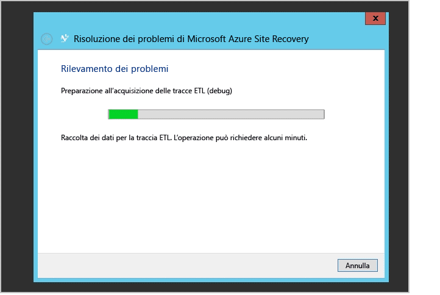

# Monitorare e risolvere i problemi di protezione per le macchine virtuali e i server fisici
Questa guida al monitoraggio e alla risoluzione dei problemi illustra come tenere traccia dello stato della replica e le tecniche di risoluzione dei problemi per Azure Site Recovery.

## Informazioni sui componenti
### Distribuzione del sito della macchina virtuale VMware o del server fisico per la replica tra ambiente locale e Azure
Per configurare il ripristino del database tra una macchina virtuale VMware o un server fisico in locale e Azure, è necessario configurare i componenti server di configurazione, server di destinazione master e server di elaborazione nella macchina virtuale o nel server. Quando si abilita la protezione per il server di origine, Azure Site Recovery installa la funzionalità App per dispositivi mobili del Servizio app di Microsoft Azure. Dopo un'interruzione del servizio locale e dopo il failover del server di origine in Azure, i clienti devono configurare un server di elaborazione in Azure e un server di destinazione master locale per ricostruire il server di origine in locale.

### Distribuzione del sito Virtual Machine Manager per la replica tra siti locali
Per configurare il ripristino del database tra due sedi locali, è necessario scaricare il provider di Azure Site Recovery e installarlo nel server Virtual Machine Manager. ll provider richiede la connettività a Internet per garantire che tutte le operazioni attivate dal portale di Azure vengano convertite in operazioni locali.

### Distribuzione del sito Virtual Machine Manager per la replica tra le sedi locali e Azure
Quando si configura il ripristino del database tra sedi locali e Azure, è necessario scaricare il provider di Azure Site Recovery e installarlo nel server Virtual Machine Manager. È anche necessario installare l'agente di Servizi di ripristino di Azure in ogni host Hyper-V. Per altre informazioni [approfondire qui](site-recovery-hyper-v-azure-architecture.md).

### Distribuzione del sito Hyper-V per la replica tra sedi locali e Azure
Questo processo è simile alla distribuzione di Virtual Machine Manager. L'unica differenza è rappresentata dal fatto che il provider di Azure Site Recovery e l'agente di Servizi di ripristino di Azure vengono installati nell'host Hyper-V stesso. [Altre informazioni](site-recovery-hyper-v-azure-architecture.md). .

## Monitorare le operazioni di configurazione, protezione e ripristino
Ogni operazione in Azure Site Recovery viene controllata e monitorata nella scheda **Processi**. In caso di errori di configurazione, protezione o ripristino, passare alla scheda **Processi** e controllare se vi sono errori.

Se si individuano errori nella scheda **Processi**, fare clic sul processo e fare clic su **Dettagli errore** per tale processo.

I dettagli dell'errore sono utili per identificare le possibili cause e includono una raccomandazione per la soluzione del problema.

Nell'esempio precedente, un'altra operazione in corso sembra essere la causa degli errori nella configurazione della protezione. Risolvere il problema in base alla raccomandazione e quindi fare clic su **Riavvia** per riavviare l'operazione.

L'opzione **Riavvia** non è disponibile per tutte le operazioni. Se l'opzione **Riavvia** non è disponibile per un'operazione, tornare all'oggetto e ripetere l'operazione. È possibile annullare qualsiasi processo in corso mediante il pulsante **Annulla**.

## Monitorare l'integrità della replica per le macchine virtuali
È possibile usare il portale di Azure per monitorare in remoto i provider di Azure Site Recovery per ogni entità protetta. Fare clic su **Elementi protetti** e quindi fare clic su **Cloud VMM** o **Gruppi di protezione**. La scheda **Cloud VMM** è disponibile solo per le distribuzioni basate su Virtual Machine Manager. Per altri scenari, le entità protette sono disponibili nella scheda **Gruppi di protezione**.

Fare clic su un'entità protetta nel rispettivo cloud o gruppo di protezione per visualizzare tutte le operazioni disponibili nel riquadro inferiore.

Come illustrato nello screenshot precedente, l'integrità della macchina virtuale è **Critica**. È possibile fare clic sul pulsante **Dettagli errore** nella parte inferiore per visualizzare l'errore. Risolvere l'errore in base a quanto indicato in **Possibili cause** e **Raccomandazione**.

> [!NOTE]
> Se vi sono operazioni attive in corso o non riuscite, passare alla visualizzazione **Processi** come indicato in precedenza per visualizzare l'errore per un processo specifico.
>
>

## Risoluzione dei problemi di Hyper-V a livello locale
Connettersi alla console Hyper-V Manager locale, selezionare la macchina virtuale e controllare l'integrità della replica.

In questo caso **Integrità della replica** è **Critica**. Fare clic con il pulsante destro del mouse sulla macchina virtuale e quindi scegliere **Replica** > **Visualizza stato di replica** per vedere i dettagli.

Se la replica è in pausa per la macchina virtuale, fare clic con il pulsante destro del mouse sulla macchina virtuale e quindi scegliere **Replica** > **Riprendi replica**.

Se una macchina virtuale esegue la migrazione di un nuovo host Hyper-V all'interno del cluster o di un computer autonomo e l'host Hyper-V è stato configurato con Azure Site Recovery, non ci sono ripercussioni sulla replica per la macchina virtuale. Assicurarsi che il nuovo host Hyper-V soddisfi tutti i prerequisiti e sia configurato tramite Azure Site Recovery.

### Registro eventi
| Origini eventi | Dettagli |
| --- |:--- |
| **Registri applicazioni e servizi/Microsoft/VirtualMachineManager/Server/Admin** (server Virtual Machine Manager) |Fornisce dati di registrazione utili per la risoluzione di molti problemi diversi di Virtual Machine Manager. |
| **Registri applicazioni e servizi/MicrosoftAzureRecoveryServices/Replication** (host Hyper-V) |Fornisce dati di registrazione utili per la risoluzione di molti problemi dell'agente di Servizi di ripristino di Microsoft Azure.    |
| **Registri applicazioni e servizi/Microsoft/Azure Site Recovery/Provider/Operational** (host Hyper-V) |Fornisce dati di registrazione utili per la risoluzione di molti problemi del servizio Azure Site Recovery di Microsoft Azure.    |
| **Registri applicazioni e servizi/Microsoft/Windows/Hyper-V-VMMS/Admin** (host Hyper-V) |Fornisce dati di registrazione utili per la risoluzione di molti problemi di gestione delle macchine virtuali Hyper-V.    |

### Opzioni di registrazione per la replica Hyper-V
Tutti gli eventi relativi alla replica Hyper-V vengono registrati nel registro Hyper-V-VMMS\\Admin in Registri applicazioni e servizi\\Microsoft\\Windows. È anche possibile abilitare un registro analitico per il servizio Virtual Machine Management di Hyper-V. Per abilitare questo registro, rendere i registri analitici e di debug visibili nel Visualizzatore eventi. Aprire il Visualizzatore eventi e quindi fare clic su **Visualizza** > **Visualizza registri analitici e di debug**.

Un registro analitico è visibile in **Hyper-V-VMMS**.

Nel riquadro **Azioni** fare clic su **Attiva registro**. Dopo l'attivazione viene visualizzato in **Performance Monitor** come **sessione di traccia eventi** in **Insiemi agenti di raccolta dati**.

Per visualizzare le informazioni raccolte, interrompere prima di tutto la sessione di traccia disabilitando il registro. Salvare il registro e aprirlo nuovamente nel Visualizzatore eventi o usare altri strumenti per convertirlo come desiderato.

## Contattare il supporto Microsoft
### Raccolta registri
Per la protezione del sito di Virtual Machine Manager, vedere [Azure Site Recovery log collection using Support Diagnostics Platform (SDP) Tool](http://social.technet.microsoft.com/wiki/contents/articles/28198.asr-data-collection-and-analysis-using-the-vmm-support-diagnostics-platform-sdp-tool.aspx) (Raccolta del log di Azure Site Recovery tramite lo strumento SDP (Support Diagnostics Platform)) per informazioni sulla raccolta dei log necessari.

Per la protezione dei siti di Hyper-V, scaricare lo [strumento](https://dcupload.microsoft.com/tools/win7files/DIAG_ASRHyperV_global.DiagCab) ed eseguirlo nell'host Hyper-V per raccogliere i log.

Per gli scenari con VMware/server fisico, vedere [Azure Site Recovery Log Collection for VMware and Physical site protection](http://social.technet.microsoft.com/wiki/contents/articles/30677.azure-site-recovery-log-collection-for-vmware-and-physical-site-protection.aspx) (Raccolta dei log di Azure Site Recovery per la protezione di siti VMware e fisici) per informazioni sulla raccolta dei log necessari.

Lo strumento raccoglie i log in locale in una sottocartella con nome casuale in %LocalAppData%\ElevatedDiagnostics.

### Aprire un ticket di supporto
Per generare un ticket di supporto per Azure Site Recovery, contattare il supporto di Azure tramite l'URL <http://aka.ms/getazuresupport>.

## Articoli della Knowledge Base
* [Come mantenere la lettera di unità per le macchine virtuali protette di cui è stato eseguito il failover o la migrazione in Azure](http://support.microsoft.com/kb/3031135)
* [Come gestire le impostazioni locali per l'uso della larghezza di banda della rete di protezione di Azure](https://support.microsoft.com/kb/3056159)
* [Azure Site Recovery: errore "Impossibile trovare la risorsa cluster" quando si tenta di abilitare la protezione per una macchina virtuale](http://support.microsoft.com/kb/3010979)
* [Hyper-V Replica Troubleshooting Guide](http://social.technet.microsoft.com/wiki/contents/articles/21948.hyper-v-replica-troubleshooting-guide.aspx) (Guida alla risoluzione dei problemi relativi alla replica Hyper-V)

## Errori più comuni di Azure Site Recovery e relative soluzioni
Di seguito sono elencati gli errori comuni e le relative soluzioni. Ogni errore è documentato in una pagina separata del wiki.

### Generale
* NUOVO [Processi con esito negativo con l’errore "un'operazione è in corso". Errore 505, 514, 532.](http://social.technet.microsoft.com/wiki/contents/articles/32190.azure-site-recovery-jobs-failing-with-error-an-operation-is-in-progress-error-505-514-532.aspx)
* NUOVO[Processi con esito negativo con l’errore "il server non è connesso a Internet". Errore 25018.](http://social.technet.microsoft.com/wiki/contents/articles/32192.azure-site-recovery-jobs-failing-with-error-server-isn-t-connected-to-the-internet-error-25018.aspx)

### Configurazione
* [Impossibile registrare il server Virtual Machine Manager a causa di un errore interno. Fare riferimento alla visualizzazione dei processi nel portale di Site Recovery per altri dettagli sull'errore. Eseguire nuovamente l'installazione per registrare il server.](http://social.technet.microsoft.com/wiki/contents/articles/25570.the-vmm-server-cannot-be-registered-due-to-an-internal-error-please-refer-to-the-jobs-view-in-the-site-recovery-portal-for-more-details-on-the-error-run-setup-again-to-register-the-server.aspx)
* [Impossibile stabilire una connessione all'insieme di credenziali per la gestione del ripristino Hyper-V. Verificare le impostazioni del proxy o riprovare più tardi.](http://social.technet.microsoft.com/wiki/contents/articles/25571.a-connection-cant-be-established-to-the-hyper-v-recovery-manager-vault-verify-the-proxy-settings-or-try-again-later.aspx)

### Configurazione
* [Impossibile creare il gruppo protezione dati: si è verificato un errore durante il recupero dell'elenco di server.](http://blogs.technet.com/b/somaning/archive/2015/08/12/unable-to-create-the-protection-group-in-azure-site-recovery-portal.aspx)
* [Il cluster host Hyper-V contiene almeno una scheda di rete statica oppure nessuna scheda collegata è configurata per utilizzare DHCP.](http://social.technet.microsoft.com/wiki/contents/articles/25498.hyper-v-host-cluster-contains-at-least-one-static-network-adapter-or-no-connected-adapters-are-configured-to-use-dhcp.aspx)
* [Virtual Machine Manager non dispone delle autorizzazioni necessarie per completare un'azione.](http://social.technet.microsoft.com/wiki/contents/articles/31110.vmm-does-not-have-permissions-to-complete-an-action.aspx)
* [Impossibile selezionare l'account di archiviazione nella sottoscrizione durante la configurazione della protezione.](http://social.technet.microsoft.com/wiki/contents/articles/32027.can-t-select-the-storage-account-within-the-subscription-while-configuring-protection.aspx)

### Protezione
* NUOVO[L’abilitazione della protezione ha esito negativo con l'errore "Impossibile configurare la protezione per la macchina virtuale". Errore 60007, 40003.](http://social.technet.microsoft.com/wiki/contents/articles/32194.azure-site-recovery-enable-protection-failing-with-error-protection-couldn-t-be-configured-for-the-virtual-machine-error-60007-40003.aspx)
* NUOVO [L’abilitazione della protezione ha esito negativo con l'errore "Impossibile abilitare la protezione per la macchina virtuale." Errore 70094.](http://social.technet.microsoft.com/wiki/contents/articles/32195.azure-site-recovery-enable-protection-failing-with-error-protection-couldn-t-be-enabled-for-the-virtual-machine-error-70094.aspx)
* NUOVO [Errore di migrazione in tempo reale 23848 - La macchina virtuale sta per essere spostata utilizzando il tipo Live. Questo potrebbe interrompere lo stato di protezione del ripristino della macchina virtuale.](http://social.technet.microsoft.com/wiki/contents/articles/32021.live-migration-error-23848-the-virtual-machine-is-going-to-be-moved-using-type-live-this-could-break-the-recovery-protection-status-of-the-virtual-machine.aspx)
* [L'abilitazione della protezione non è riuscita perché l'agente non è installato nel computer host.](http://social.technet.microsoft.com/wiki/contents/articles/31105.enable-protection-failed-since-agent-not-installed-on-host-machine.aspx)
* [Impossibile trovare un host adatto per la macchina virtuale di replica a causa delle scarse risorse di calcolo.](http://social.technet.microsoft.com/wiki/contents/articles/25501.a-suitable-host-for-the-replica-virtual-machine-can-t-be-found-due-to-low-compute-resources.aspx)
* [Impossibile trovare un host adatto per la macchina virtuale di replica a causa dell'assenza di una rete logica collegata.](http://social.technet.microsoft.com/wiki/contents/articles/25502.a-suitable-host-for-the-replica-virtual-machine-can-t-be-found-due-to-no-logical-network-attached.aspx)
* [Impossibile connettersi al computer host di replica. La connessione non è stata stabilita.](http://social.technet.microsoft.com/wiki/contents/articles/31106.cannot-connect-to-the-replica-host-machine-connection-could-not-be-established.aspx)

### Ripristino
* Virtual Machine Manager non è riuscito a completare l'operazione host:
  * [Failover sul punto di ripristino selezionato per la macchina virtuale: errore generico di accesso negato.](http://social.technet.microsoft.com/wiki/contents/articles/25504.fail-over-to-the-selected-recovery-point-for-virtual-machine-general-access-denied-error.aspx)
  * [Hyper-V: impossibile eseguire il failover al punto di ripristino selezionato per la macchina virtuale. L'operazione è stata interrotta.  Provare un punto di ripristino più recente. (0x80004004).](http://social.technet.microsoft.com/wiki/contents/articles/25503.hyper-v-failed-to-fail-over-to-the-selected-recovery-point-for-virtual-machine-operation-aborted-try-a-more-recent-recovery-point-0x80004004.aspx)
  * Impossibile stabilire una connessione al server (0x00002EFD).
    * [Hyper-V: impossibile abilitare la replica inversa per la macchina virtuale.](http://social.technet.microsoft.com/wiki/contents/articles/25505.a-connection-with-the-server-could-not-be-established-0x00002efd-hyper-v-failed-to-enable-reverse-replication-for-virtual-machine.aspx)
    * [Hyper-V: impossibile abilitare la replica per la macchina virtuale.](http://social.technet.microsoft.com/wiki/contents/articles/25506.a-connection-with-the-server-could-not-be-established-0x00002efd-hyper-v-failed-to-enable-replication-for-virtual-machine-virtual-machine.aspx)
  * [Impossibile eseguire il commit del failover per la macchina virtuale.](http://social.technet.microsoft.com/wiki/contents/articles/25508.could-not-commit-failover-for-virtual-machine.aspx)
* [Il piano di ripristino contiene macchine virtuali che non sono pronte per il failover pianificato.](http://social.technet.microsoft.com/wiki/contents/articles/25509.the-recovery-plan-contains-virtual-machines-which-are-not-ready-for-planned-failover.aspx)
* [La macchina virtuale non è pronta per il failover pianificato.](http://social.technet.microsoft.com/wiki/contents/articles/25507.the-virtual-machine-isn-t-ready-for-planned-failover.aspx)
* [La macchina virtuale non è in esecuzione e non è spenta.](http://social.technet.microsoft.com/wiki/contents/articles/25510.virtual-machine-is-not-running-and-is-not-powered-off.aspx)
* [Si è verificata un'operazione fuori banda in una macchina virtuale e il failover del commit non è riuscito.](http://social.technet.microsoft.com/wiki/contents/articles/25507.the-virtual-machine-isn-t-ready-for-planned-failover.aspx)
* Failover di test
  * [Impossibile avviare il failover perché il failover di test è in corso.](http://social.technet.microsoft.com/wiki/contents/articles/31111.failover-could-not-be-initiated-since-test-failover-is-in-progress.aspx)
* NUOVO Timeout del failover con un messaggio "PreFailoverWorkflow task WaitForScriptExecutionTaskTimeout" a causa di impostazioni di configurazione nel gruppo di sicurezza di rete associato alla macchina virtuale o alla subnet a cui appartiene la macchina virtuale. Per informazioni dettagliate, vedere ["PreFailoverWorkflow task WaitForScriptExecutionTaskTimeout"](https://aka.ms/troubleshoot-nsg-issue-azure-site-recovery) (WaitForScriptExecutionTaskTimeout dell'attività PreFailoverWorkflow).

### Server di configurazione, server di elaborazione, server master di destinazione
* [L'host ESXi in cui è ospitato PS/CS come macchina virtuale ha esito negativo con una schermata viola.](http://social.technet.microsoft.com/wiki/contents/articles/31107.vmware-esxi-host-experiences-a-purple-screen-of-death.aspx)

### Risoluzione dei problemi del desktop remoto dopo il failover
* Molti clienti hanno avuto problemi a connettersi a una macchina virtuale in Azure dopo il failover. [Usare il documento sulla risoluzione dei problemi per effettuare una connessione tramite protocollo RDP alla macchina virtuale](http://social.technet.microsoft.com/wiki/contents/articles/31666.troubleshooting-remote-desktop-connection-after-failover-using-asr.aspx).

#### Aggiunta di un indirizzo IP pubblico in una macchina virtuale di Resource Manager
Se il pulsante **Connetti** nel portale è disattivato e non si è connessi ad Azure tramite una connessione Express Route o VPN da sito a sito, per poter usare Desktop remoto o la shell condivisa è necessario creare un indirizzo IP pubblico e assegnarlo alla macchina virtuale. È quindi possibile aggiungere un indirizzo IP pubblico nell'interfaccia di rete della macchina virtuale.  

