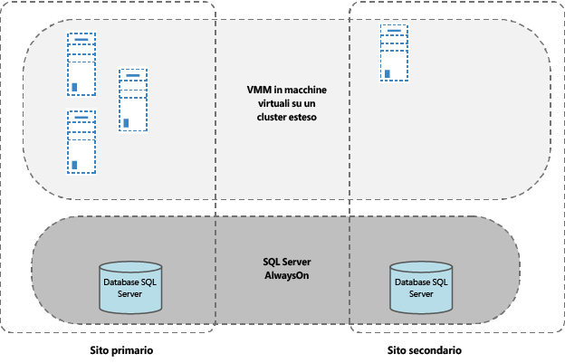
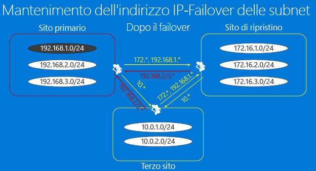
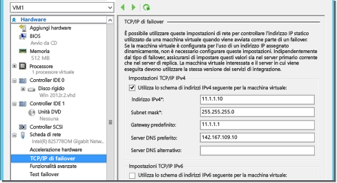
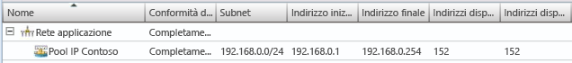
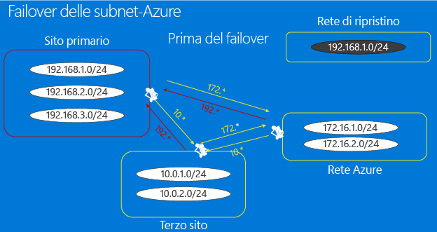
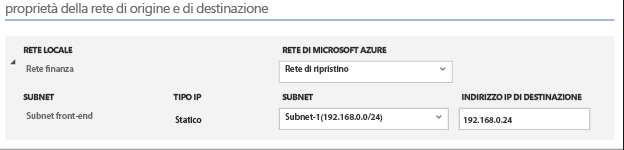
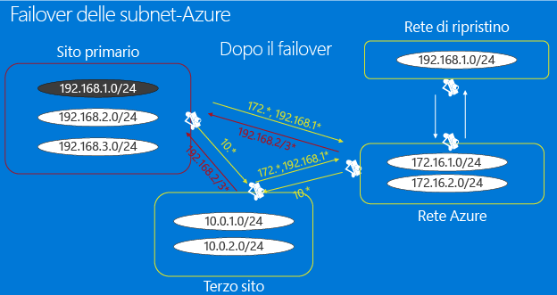
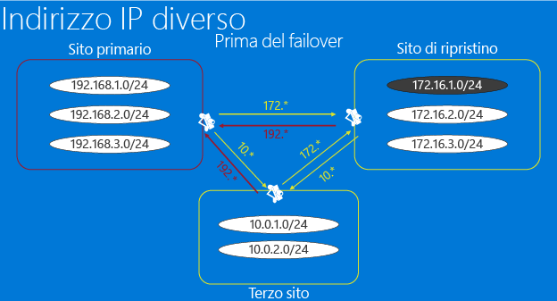
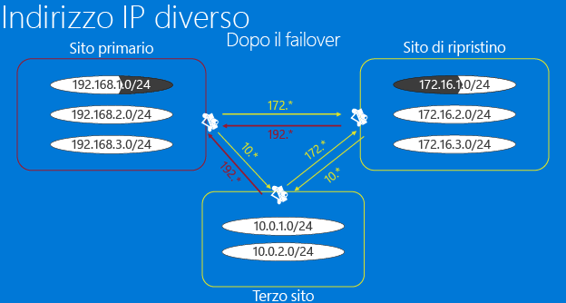

<properties
	pageTitle="Considerazioni relative all'infrastruttura di rete per Site Recovery | Microsoft Azure" 
	description="In questo articolo vengono illustrate alcune considerazioni pratiche sulla progettazione di rete per il failover con Site Recovery" 
	services="site-recovery" 
	documentationCenter="" 
	authors="rayne-wiselman" 
	manager="jwhit" 
	editor=""/>

<tags 
	ms.service="site-recovery" 
	ms.devlang="na"
	ms.topic="get-started-article"
	ms.tgt_pltfrm="na"
	ms.workload="storage-backup-recovery" 
	ms.date="12/14/2015" 
	ms.author="raynew"/>

#  Considerazioni relative all'infrastruttura di rete per Site Recovery

Il servizio Azure Site Recovery fornisce un'efficace soluzione di ripristino di emergenza e continuità aziendale (BCDR) che consente di proteggere e ripristinare le macchine virtuali e i server fisici locali orchestrando e automatizzando la replica e il failover in Azure o in un data center locale secondario.

Questo articolo è destinato al team di virtualizzazione responsabile della progettazione, dell'implementazione e del supporto delle soluzioni BCDR e delle infrastrutture dotate di System Center VMM e Azure Site Recovery.

## Panoramica

Lo scopo della strategia di BCDR è mantenere le applicazioni aziendali in esecuzione e di ripristinare i carichi di lavoro e servizi in caso di errore, affinché l'organizzazione possa riprendere le normali operazioni in tempi brevi. Lo sviluppo di strategie di ripristino di emergenza è un'operazione complessa, a causa dell'imprevedibilità degli eventi avversi e del costo elevato dell'implementazione di un'adeguata protezione contro gli errori di vasta portata. Azure Site Recovery consente di implementare la protezione e il failover dal data center principale in uno secondario (o in Azure) tramite la copia iniziale (replica) dei dati primari e il successivo aggiornamento periodico delle repliche.

Una parte fondamentale della pianificazione BCDR è la definizione dell'obiettivo tempo di ripristino (RTO, Recovery Time Objective) e dell'obiettivo punto di ripristino (RPO, Recovery Point Objective) in modo da consentire all'organizzazione di ripristinare i dati aziendali online nel minor tempo (con un RTO basso) e con la minor perdita di dati (RPO basso) possibile. La progettazione di rete dell'organizzazione è un potenziale collo di bottiglia per gli obiettivi RTO e RPO. Pianificando la progettazione in modo ottimale, è possibile evitare tale ostacolo.

Se si è deciso di utilizzare il servizio Azure Site Recovery per implementare protezione e failover, sussistono alcuni importanti problemi relativi alla progettazione della rete per la strategia BCDR:

- **Progettazione VMM**: utilizzo di System Center VMM. Come gestire la progettazione di rete per l'integrazione di VMM e Site Recovery?
- **Connettività dopo il failover**: utilizzo di Site Recovery per l'esecuzione di un failover. Come verificare che le applicazioni e i carichi di lavoro siano disponibili e raggiungibili al termine del failover?

## Progettazione VMM

È possibile creare livelli di Site Recovery sulla progettazione VMM esistente, indipendentemente dal fatto che la progettazione preveda uno o più server VMM.

### Server VMM autonomo

In questa topologia, si distribuisce un server VMM autonomo in una macchina virtuale in un sito primario, replicando tale macchina virtuale in un sito secondario con Site Recovery e Replica Hyper-V. Installando il server VMM e il relativo SQL Server di supporto nella stessa macchina virtuale è possibile ridurre i tempi di inattività, in quanto occorre creare un'istanza di una sola macchina virtuale. Quando il servizio VMM utilizza un SQL Server remoto, occorre ripristinare l'istanza di SQL Server prima del ripristino del server VMM.

Per distribuire un singolo VMM in una macchina virtuale con la Replica Hyper-V:

1. Configurare il server VMM in una macchina virtuale in cui è installato SQL Server.
2. Aggiungere al server VMM gli host da gestire nei cloud.
3. Accedere al portale di Azure e configurare la protezione dei cloud.
4. Abilitare la replica per tutte le macchine virtuali che devono essere protette dal server VMM.
5. Passare alla console di gestione di Hyper-V, selezionare la Replica Hyper-V e quindi abilitare la replica nella macchina virtuale VMM.
6. Verificare che la macchina virtuale VMM non venga aggiunta ai cloud protetti dal servizio Azure Site Recovery, affinché le impostazioni di replica Hyper-V non vengano sovrascritte da ASR.

In caso di emergenza, è possibile ripristinare i carichi di lavoro come indicato di seguito:

1. Eseguire il failover della macchina virtuale VMM di replica nel sito di ripristino, mediante la console di gestione di Hyper-V.
2. Al termine del ripristino della macchina virtuale VMM, l'utente può accedere a Gestione ripristino di Hyper-V dal sito secondario.
3. Al termine del failover non pianificato, l'utente può accedere a tutte le risorse nel sito primario.
4. Si noti che sarà necessario eseguire il failover manuale della macchina virtuale VMM nel sito secondario, prima di poter eseguire il failover dei carichi di lavoro. 

### Server VMM in cluster

La [distribuzione di VMM in un cluster](https://technet.microsoft.com/library/gg610675.aspx) garantisce disponibilità e protezione elevate contro il failover hardware. Se si distribuisce il cluster VMM con Site Recovery, si noti che:

Il server VMM deve essere distribuito in un cluster esteso in tutti i siti geograficamente separati. Il database di SQL Server usato da VMM deve essere protetto con gruppi di disponibilità AlwaysOn di SQL Server con una replica nel sito secondario. In caso di emergenze, il server VMM e il SQL Server corrispondente eseguiranno automaticamente il failover nel sito di ripristino. È quindi possibile eseguire il failover dei carichi di lavoro mediante Site Recovery.

## Connettività dopo il failover

Le applicazioni moderne necessitano quasi sempre di un collegamento in rete, dunque lo spostamento fisico di un servizio da un sito a un altro rende difficoltoso, a livello di rete, mantenere le applicazioni e i carichi di lavoro raggiungibili dopo il failover. Esistono due soluzioni principali a questo problema:

- **Indirizzi IP fissi**: il primo approccio consiste nel mantenere fissi gli indirizzi IP. Nonostante lo spostamento dei servizi e la presenza dei server di hosting in posizioni fisiche diverse, le applicazioni mantengono la configurazione degli indirizzi IP nella nuova posizione.
- **Indirizzi IP modificati**: il secondo approccio richiede la modifica dell'indirizzo IP durante la transizione al sito ripristinato. 

### Opzione 1: indirizzi IP fissi

Dal punto di vista del ripristino di emergenza, l'utilizzo di indirizzi IP fissi sembra essere il metodo più semplice da implementare. Tuttavia, esistono diversi potenziali problemi che lo rendono l'approccio meno utilizzato. Azure Site Recovery consente di conservare gli indirizzi IP in tutte le situazioni. Prima di decidere di adottare questo approccio, è opportuno esaminare le considerazioni per gli scenari principali (subnet estesa e failover sulla subnet).

#### Subnet estesa

In una subnet estesa, la subnet è disponibile contemporaneamente nella posizione primaria e in quella di destinazione. In altre parole, è possibile spostare un server e la relativa configurazione IP (livello 3) nel sito secondario. La rete instraderà automaticamente il traffico nella nuova posizione. Dal punto di vista del server si tratta di un'operazione semplice, tuttavia presenta una serie di difficoltà:

- Considerando il livello 2 (data-link layer), tale approccio richiede apparecchiature di rete in grado di gestire una VLAN estesa. Tuttavia, oggi questo tipo di apparecchiature è ampiamente disponibile.
- Il secondo e più difficile problema è il fatto che estendendo la VLAN, si estende il dominio di errore potenziale in entrambi i siti, creando in sostanza un singolo punto di errore. Tuttavia, l'eventualità di una broadcast storm impossibile da isolare è alquanto improbabile. Esistono opinioni discordanti su questo argomento: secondo alcuni tale implementazione è più che fattibile, secondo altri è irrealizzabile.
- In caso di failover in Azure utilizzato come sito di ripristino di emergenza, non è possibile disporre della subnet estesa.

#### Failover sulla subnet

È possibile implementare il failover sulla subnet per ottenere i vantaggi di una subnet estesa senza estenderla realmente. In questa configurazione, qualsiasi subnet specificata è presente nel sito 1 o nel sito 2, ma mai in entrambi i siti contemporaneamente. Per mantenere lo spazio degli indirizzi IP in caso di failover, è possibile programmare l'infrastruttura del router per lo spostamento delle subnet da un sito a un altro. In uno scenario di failover, le subnet vengono spostate assieme alle macchine virtuali protette associate. Lo svantaggio principale di questo approccio è che, in caso di errore, occorre spostare l'intera subnet. Ciò potrebbe essere una soluzione accettabile, ma può influire sulle considerazioni relative alla granularità di failover.

Osserviamo come un'azienda fittizia (Contoso) sia in grado di replicare le proprie macchine virtuali in un percorso di ripristino, durante il failover dell'intera subnet. Esamineremo il modo in cui Contoso è in grado di gestire le proprie subnet durante la replica delle macchine virtuali tra due posizioni locali e discuteremo del funzionamento del failover sulla subnet quando si utilizza Azure come sito di ripristino di emergenza.

##### Esempio: failover sulla subnet in un'organizzazione
 
- Il sito primario dispone di applicazioni in esecuzione nella subnet 192.168.1.0/24.
- L'intera subnet eseguirà il failover e tutte le macchine virtuali nella subnet verranno sottoposte a failover nel sito di ripristino e conserveranno gli indirizzi IP
- Come illustrato nella figura seguente, sarà necessario modificare in modo appropriato i percorsi tra il sito primario e quello di ripristino, il terzo sito e il sito primario e il terzo sito e quello di ripristino, per rispecchiare il fatto che tutte le macchine virtuali appartenenti alla subnet 192.168.1.0/24 sono state spostate nel sito di ripristino.
- Questo grafico presuppone che:
	-  Ciascun data center viene gestito da una istanza di VMM dedicata. Non sarà presente alcuna replica dei database di System Center VMM tra i data center.
	-  Ciascun data center utilizza indirizzi IP statici per le macchine virtuali.
	-  La connettività tra i data center avviene tramite un circuito dedicato e non tramite la connettività VPN su Internet.

**Prima del failover**

**Dopo il failover**

Quando si abilita la protezione per una macchina virtuale specifica, Site Recovery consente di allocare le risorse di rete come indicato di seguito:

1. Site Recovery consente di allocare un indirizzo IP per ciascuna interfaccia di rete nella macchina virtuale dal pool di indirizzi IP statici definiti nella rete pertinente per ciascuna istanza VMM.
2. Se l'amministratore definisce nel sito di ripristino lo stesso pool di indirizzi IP utilizzato per la rete nel sito primario, Site Recovery dovrà allocare nella macchina virtuale di replica lo stesso indirizzo IP utilizzato per la macchina virtuale primaria. L'indirizzo IP è riservato in VMM, ma non corrisponde a quello di failover. L'indirizzo IP di failover viene impostato subito prima del failover. Questa schermata indica le impostazioni TCP/IP del failover per la macchina virtuale di replica (nella console di Hyper-V). Queste impostazioni vengono replicate prima dell'inizio del failover per la macchina virtuale.

	

3. Se lo stesso indirizzo IP non è disponibile, Site Recovery dovrà allocare un indirizzo diverso dal pool.
4. Dopo aver abilitato la protezione nella macchina virtuale, è possibile utilizzare lo script di esempio seguente per verificare l'indirizzo IP allocato nella macchina virtuale. Lo stesso indirizzo IP dovrebbe essere impostato come indirizzo IP di failover e assegnato alla VM al momento del failover.

    $vm = Get-SCVirtualMachine -Name $na = $vm[0].VirtualNetworkAdapters $ip = Get-SCIPAddress -GrantToObjectID $na[0].id $ip.address

Si noti che se le macchine virtuali utilizzano il protocollo DHCP, la gestione degli indirizzi IP non avverrà tramite Site Recovery. È necessario verificare che il server DHCP responsabile dell'assegnazione di indirizzi IP nel sito di ripristino sia in grado di allocare gli indirizzi dallo stesso intervallo di quello del sito primario.

##### Esempio: failover sulla subnet in Azure

In caso di failover in Azure, esistono due ulteriori limitazioni. Esaminiamo una società fittizia (Woodgrove Bank) la cui infrastruttura locale ospita la linea di applicazioni aziendali, mentre Azure ospita le applicazioni per dispositivi mobili.

- La connettività tra le macchine virtuali di Woodgrove Bank nei server locali e in Azure avviene tramite VPN da sito a sito, pertanto la rete virtuale viene mostrata in Azure come un'estensione della rete locale della Woodgrove Bank. 
- Woodgrove intende utilizzare Site Recovery per replicare i propri carichi di lavoro locali in Azure. 
- Woodgrove deve tenere conto delle applicazioni e delle configurazioni che dipendono da indirizzi IP hardcoded, quindi occorre conservare gli indirizzi IP delle rispettive applicazioni dopo il failover in Azure.
- L'infrastruttura locale della Woodgrove è gestita da un server VMM 2012 R2.
- Esiste una rete logica basata su VLAN (rete delle applicazioni), creata nel server VMM. 
- È stata creata una rete VM (rete VM delle applicazioni) è stata creata mediante la rete logica. 
- Tutte le macchine virtuali nell'applicazione utilizzano indirizzi IP statici, pertanto è stato definito anche un pool di IP statici per la rete logica. 
- Woodgrove assegna gli indirizzi IP dall'intervallo di indirizzi IP (172.16.1.0/24, 172.16.2.0/24) alle relative risorse in esecuzione in Azure.

Affinché Woodgrove possa distribuire la replica e gestire gli indirizzi IP, occorre quanto segue:

- Una macchina virtuale Azure che sia l'estensione della rete locale, affinché le applicazioni possano subire il failover senza problemi.
- Si noti che quando si imposta la connessione da sito a sito in Azure, una rete di Azure consente di instradare il traffico verso il percorso locale (Azure lo definisce rete locale) solo se l'intervallo di indirizzi IP è diverso da quello degli indirizzi IP locali, poiché Azure non supporta l'estensione delle subnet. Ciò significa che se si dispone di una subnet 192.168.1.0/24 locale, è impossibile aggiungere una rete locale 192.168.1.0/24 nella rete di Azure. Ciò è previsto poiché Azure non rileva l'assenza di macchine virtuali attive nella subnet, né riconosce che la subnet viene creata solo per scopi di ripristino di emergenza. Per poter instradare correttamente il traffico di rete all'esterno di una rete di Azure, le subnet nella rete e quelle nella rete locale non devono essere in conflitto. 
- Sarà necessario creare una rete aggiuntiva in Azure (rete di ripristino), in cui verranno create le macchine virtuali di failover.

	

- Per verificare il mantenimento dell'indirizzo IP della VM, nelle relative proprietà in Site Recovery occorre specificare che deve essere utilizzato lo stesso indirizzo IP. Quindi, dopo il failover, Site Recovery consente di assegnare l'indirizzo IP specificato per la VM. 

- Quando viene attivato il failover e le VM vengono create nella rete di ripristino con l'indirizzo IP richiesto, è possibile stabilire la connettività alla VM mediante un. È possibile creare script per questa azione. Come illustrato nella sezione precedente relativa al failover sulla subnet, anche nel caso di failover in Azure occorre modificare in modo appropriato i percorsi per rispecchiare il fatto che la subnet 192.168.1.0/24 viene spostata in Azure. 

### Opzione 2: indirizzi IP modificati

Questo approccio sembra essere il più comune e prevede la modifica dell'indirizzo IP di ogni VM in cui viene eseguito il failover. Lo svantaggio principale di questo approccio è che l'infrastruttura di rete deve riconoscere la modifica degli indirizzi IP e che, di solito, occorre modificare o addirittura cancellare le voci DNS in tutta la rete, così come le voci memorizzate nella cache nelle tabelle di rete. Ciò potrebbe causare tempi di inattività, in base alla configurazione dell'infrastruttura DNS. È possibile ridurre questi problemi utilizzando valori TTL bassi nel caso di applicazioni Intranet e utilizzando [Gestione traffico di Azure con Site Recovery](https://azure.microsoft.com/blog/2015/03/03/reduce-rto-by-using-azure-traffic-manager-with-azure-site-recovery/) per le applicazioni basate su Internet.

#### Esempio: indirizzi IP modificati

Esaminiamo questo scenario con un esempio che comprende un terzo sito da cui è possibile accedere alle applicazioni ospitate nel sito primario o in quello di ripristino.

- Alcune applicazioni sono ospitate nella subnet 192.168.1.0/24 nel sito primario e sono state configurate per passare al sito di ripristino nella subnet 172.16.1.0/24 a seguito di un failover.
- La configurazione dei percorsi di rete o delle connessioni VPN è avvenuta in modo corretto, pertanto tutti e tre i siti dispongono dell'accesso reciproco. 
- Dopo il failover di una o più applicazioni, queste verranno ripristinate nella subnet di ripristino. In questo caso non occorre eseguire il failover dell'intera subnet contemporaneamente e non sono necessarie modifiche per riconfigurare i percorsi della VPN o di rete.
- Un failover e alcuni aggiornamenti DNS manterranno le applicazioni accessibili. Se il server DNS è configurato per consentire aggiornamenti dinamici, le macchine virtuali potrebbero registrarsi con il nuovo indirizzo IP, una volta avviate dopo un failover.

	

- Al termine del failover, la macchina virtuale di replica potrebbe avere un indirizzo IP diverso da quello della macchina virtuale primaria.
- Le macchine virtuali aggiorneranno il server DNS in uso dopo l'avvio. Di solito, occorre modificare o cancellare le voci DNS in tutta la rete, così come occorre aggiornare o cancellare le voci memorizzate nella cache nelle tabelle di rete, pertanto non è insolito riscontrare tempi di inattività durante tali modifiche. È possibile ridurre tale problema nei modi seguenti:

	- Utilizzando valori TTL bassi per le applicazioni Intranet.
	- Usando [Gestione traffico di Azure con Site Recovery]https://azure.microsoft.com/blog/2015/03/03/reduce-rto-by-using-azure-traffic-manager-with-azure-site-recovery/ per le applicazioni basate su Internet.
	- Utilizzando il seguente script all'interno del piano di ripristino per aggiornare il server DNS, al fine di garantire un aggiornamento tempestivo (lo script non è obbligatorio se è stata configurata la registrazione di DNS dinamici)

    [string]$Zone, [string]$name, [string]$IP ) $Record = Get-DnsServerResourceRecord -ZoneName $zone -Name $name $newrecord = $record.clone() $newrecord.RecordData[0].IPv4Address = $IP Set-DnsServerResourceRecord -zonename $zone -OldInputObject $record -NewInputObject $Newrecord

#### Esempio: failover in Azure

[Il post sul blog](https://azure.microsoft.com/blog/2014/09/04/networking-infrastructure-setup-for-microsoft-azure-as-a-disaster-recovery-site/) dedicato all'installazione dell'infrastruttura di rete per Azure come sito di ripristino di emergenza spiega come configurare l'infrastruttura di rete di Azure necessaria quando non è obbligatorio conservare gli indirizzi IP. L'articolo inizia descrivendo l'applicazione, per poi illustrare le modalità di installazione della rete in locale e in Azure. La conclusione presenta le istruzioni per l'esecuzione di un failover di test e un failover pianificato.

## Passaggi successivi

[Informazioni](site-recovery-network-mapping.md) sulla modalità di mapping delle reti di origine e destinazione di Site Recovery.

<!---HONumber=AcomDC_0128_2016-->