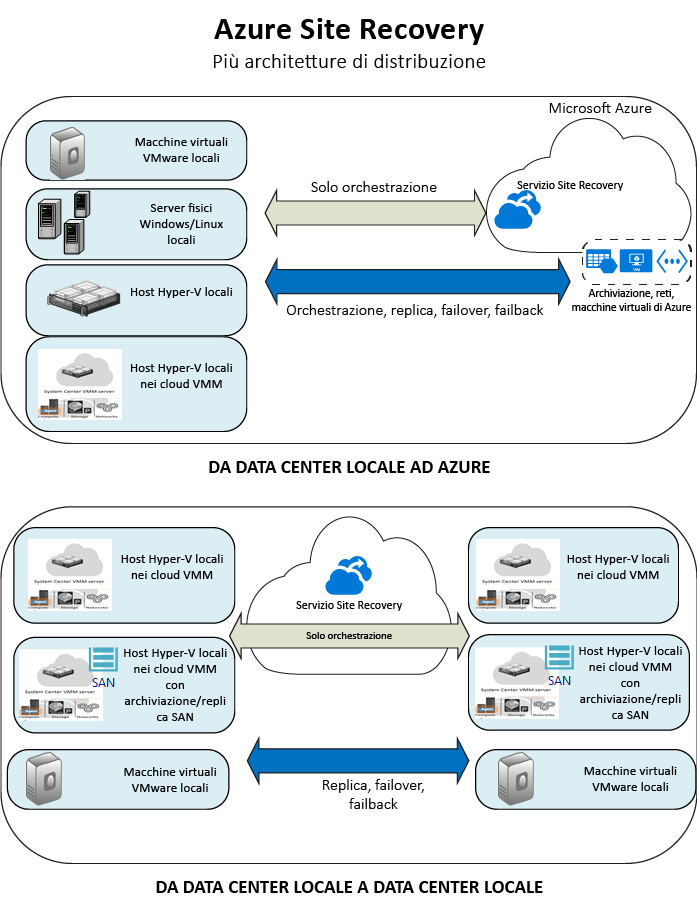

<properties
    pageTitle="Che cos'è Site Recovery? | Microsoft Azure"
    description="Panoramica del servizio Azure Site Recovery e riepilogo degli scenari di distribuzione."
    services="site-recovery"
    documentationCenter=""
    authors="rayne-wiselman"
    manager="cfreeman"
    editor=""/>

<tags
    ms.service="site-recovery"
    ms.devlang="na"
    ms.topic="get-started-article"
    ms.tgt_pltfrm="na"
    ms.workload="storage-backup-recovery"
    ms.date="10/13/2016"
    ms.author="raynew"/>

#  Che cos'è Site Recovery?

Benvenuti in Azure Site Recovery. Questo articolo offre una panoramica rapida del servizio Site Recovery e del relativo contributo all'attività aziendale.

Le organizzazioni necessitano di una strategia per la continuità aziendale e il ripristino di emergenza (BCDR, Business Continuity and Disaster Recovery) che consenta di mantenere le app, i carichi di lavoro e i dati al sicuro e disponibili durante i periodi di inattività pianificati e non pianificati e che ripristini prima possibile le normali condizioni di lavoro. Site Recovery è un servizio di Azure che contribuisce all'attuazione di tale strategia.

Site Recovery orchestra la replica dei carichi di lavoro in esecuzione in servizi fisici locali e macchine virtuali. È possibile replicare i server e le VM da un data center primario al cloud (Azure) oppure a un data center secondario. In caso di interruzioni nel sito primario, verrà eseguito il failover al sito secondario per mantenere accessibili e disponibili le app e i carichi di lavoro. Quando la località primaria sarà di nuovo operativa, si tornerà a tale località.

## Site Recovery nel portale di Azure

Azure offre due diversi [modelli di distribuzione](../resource-manager-deployment-model.md) per creare e usare le risorse: il modello Azure Resource Manager e il modello di gestione classica dei servizi. Azure offre anche due portali: il [portale di Azure classico](https://manage.windowsazure.com/), che supporta il modello di distribuzione classica, e il [portale di Azure](https://portal.azure.com), che supporta entrambi i modelli.

- Site Recovery è disponibile sia nel portale classico che nel portale di Azure.
- Nel portale di Azure classico è possibile supportare Site Recovery con il modello di gestione classica dei servizi.
- Nel portale di Azure è possibile supportare i modelli di distribuzione classica e Resource Manager. 

Le informazioni in questo articolo sono applicabili al modello di distribuzione classica e al modello di distribuzione tramite il portale di Azure. Le differenze sono indicate ove applicabili.

## Perché distribuire Azure Site Recovery?

Ecco cosa può fare Site Recovery per l'azienda:

- **Semplificare la continuità aziendale e il ripristino di emergenza**. È possibile gestire la replica, il failover e il ripristino di più carichi di lavoro in un'unica posizione nel portale di Azure. Site Recovery orchestra la replica e il failover, ma non intercetta i dati dell'applicazione né raccoglie le relative informazioni.
- **Offrire una modalità di replica flessibile**. Con Site Recovery è possibile replicare i carichi di lavoro in esecuzione nelle VM Hyper-V e VMware e nei server fisici Windows o Linux supportati.
- **Eseguire facilmente test della replica**. Site Recovery offre failover di test per supportare analisi del ripristino di emergenza senza alcun impatto sugli ambienti di produzione.
- **Eseguire il failover e il ripristino**. È possibile eseguire failover pianificati senza perdita di dati per interruzioni previste o failover non pianificati con perdita di dati minima (a seconda della frequenza di replica) in caso di emergenze impreviste. Dopo il failover è possibile eseguire il failback nei siti primari. Site Recovery offre piani di ripristino che possono includere script e cartelle di lavoro di automazione di Azure per consentire la personalizzazione del failover e del ripristino di applicazioni multilivello.
- **Eliminare un data center secondario**. È possibile replicare i carichi di lavoro in Azure anziché in un sito secondario, eliminando i costi e la complessità associati alla gestione di un data center secondario. I dati replicati vengono archiviati in Archiviazione di Azure, caratterizzato da elevati livelli di resilienza. Le VM vengono create con i dati replicati in caso di failover.
- **Offrire l'integrazione con le tecnologie BCDR esistenti**. Site Recovery si integra con altre funzionalità BCDR. È ad esempio possibile usare Site Recovery per proteggere il back-end SQL Server dei carichi di lavoro aziendali, con supporto nativo per SQL Server AlwaysOn, e gestire così il failover dei gruppi di disponibilità.

## Ciò che è possibile replicare?

Ecco un riepilogo di ciò che è possibile replicare con Site Recovery.

**REPLICA** | **DESTINAZIONE REPLICA** 
---|---
Carichi di lavoro in esecuzione in VM VMware locali | [Azure](site-recovery-vmware-to-azure-classic.md)   [Sito secondario](site-recovery-vmware-to-vmware.md)
Carichi di lavoro in esecuzione in VM Hyper-V locali gestite in cloud VMM  | [Azure](site-recovery-vmm-to-azure.md)   [Sito secondario](site-recovery-vmm-to-vmm.md) 
Carichi di lavoro in esecuzione in VM Hyper-V locali gestite in cloud VMM, con archiviazione SAN|  [Sito secondario](site-recovery-vmm-san.md)
Carichi di lavoro in esecuzione in VM Hyper-V locali senza VMM | [Azure](site-recovery-hyper-v-site-to-azure.md)
Carichi di lavoro in esecuzione in server fisici Windows/Linux locali | [Azure](site-recovery-vmware-to-azure-classic.md)   [Sito secondario](site-recovery-vmware-to-vmware.md)

## Quali carichi di lavoro è possibile proteggere?

Site Recovery supporta una strategia BCDR compatibile con le applicazioni, per consentire l'esecuzione continua e coerente dei carichi di lavoro e delle app in caso di interruzioni. Site Recovery offre:

- **Snapshot coerenti con l'applicazione**. La replica dei computer viene eseguita con snapshot coerenti con l'applicazione, per app a uno o più livelli. Oltre ai dati dei dischi, tali snapshot acquisiscono tutti i dati in memoria e tutte le transazioni in corso.
- **Replica quasi sincrona**. Site Recovery offre una frequenza di replica di soli 30 secondi per Hyper-V e la replica continua per VMware.
- **Piani di ripristino flessibili**. È possibile creare e personalizzare i piani di ripristino con script esterni e azioni manuali. L'integrazione con i runbook di automazione di Azure consente di ripristinare un intero stack di applicazioni con un solo clic.
- **Integrazione con SQL Server AlwaysOn**. È possibile gestire il failover dei gruppi di disponibilità nei piani di ripristino di Site Recovery.
- **Libreria di automazione**. Un'avanzata libreria di automazione di Azure offre script pronti per la produzione e specifici dell'applicazione che possono essere scaricati e integrati con Site Recovery.
- **Gestione semplice della rete**. La gestione di rete avanzata in Site Recovery e Azure semplifica i requisiti di rete per le applicazioni, come l'impostazione di indirizzi IP riservati, la configurazione di servizi di bilanciamento del carico e l'integrazione di Gestione traffico di Azure per cambi di rete efficienti.

## Passaggi successivi

- Per altre informazioni, vedere [Quali carichi di lavoro è possibile proteggere con Azure Site Recovery?](site-recovery-workload.md)
- Per altre informazioni sull'architettura di Site Recovery, vedere [Funzionamento di Azure Site Recovery](site-recovery-components.md)
 

<!--HONumber=Oct16_HO2-->

