<properties
	pageTitle="Azure Site Recovery: test di prestazioni e risultati di scalabilità per la replica Hyper-V da locale a locale"
	description="Questo articolo fornisce informazioni sul test di prestazioni eseguito durante un processo di replica da locale a locale usando Azure Site Recovery."
	services="site-recovery" 
	documentationCenter=""
	authors="rayne-wiselman"
	manager="jwhit"
	editor="tysonn"/>

<tags
	ms.service="site-recovery"
	ms.devlang="na"
	ms.topic="get-started-article"
	ms.tgt_pltfrm="na"
	ms.workload="storage-backup-recovery"
	ms.date="12/01/2015"
	ms.author="raynew"/>

# Azure Site Recovery: test di prestazioni e risultati di scalabilità per la replica Hyper-V da locale a locale

Microsoft Azure Site Recovery consente di coordinare e gestire la replica di macchine virtuali e server fisici in Azure o in un data center secondario. Questo articolo illustra i risultati del test di prestazioni eseguito durante la replica di macchine virtuali Hyper-V tra due data center locali.

## Panoramica

L'obiettivo del test è analizzare le prestazioni di Azure Site Recovery durante la replica in uno stato stazionario. La replica dello stato stazionario si verifica quando le macchine virtuali hanno completato la replica iniziale e sincronizzano le modifiche differenziali. È importante misurare le prestazioni usando lo stato stazionario perché è lo stato in cui resta la maggior parte delle macchine virtuali a meno che non si verifichino interruzioni impreviste.

La distribuzione di test è costituita da due siti locali con un server VMM in ciascuno di essi. Questa distribuzione di test è tipica di una distribuzione sede centrale/filiale, con la sede centrale che funge da sito primario e la filiale che funge da sito secondario o di ripristino.

### Passaggi eseguiti

Passaggi necessari per il superamento del test:

1. Creare macchine virtuali utilizzando modelli VMM.

1. Avviare le macchine virtuali e acquisire le metriche delle prestazioni di acquisizione dei dati di base per 12 ore.

1. Creare i cloud nei server VMM primario e di ripristino.

1. Configurare la protezione del cloud in Azure Site Recovery, compreso il mapping dei cloud di origine e di ripristino.

1. Abilitare la protezione per le macchine virtuali e consentire il completamento della replica iniziale.

1. Attendere un paio d'ore per la stabilizzazione del sistema.

1. Acquisire le metriche delle prestazioni per 12 ore, assicurandosi che tutte le macchine virtuali rimangano in uno stato di replica previsto per queste 12 ore.

1. Misurare il differenziale tra le metriche delle prestazioni di base e le metriche delle prestazioni di replica.

## Risultati della distribuzione di test

### Prestazioni del server primario

- Replica Hyper-V tiene traccia in modo asincrono delle modifiche apportate a un file di log con sovraccarico di archiviazione minimo nel server primario.

- Replica Hyper-V usa la cache in memoria autonoma per ridurre il sovraccarico di IOPS per la traccia. Archivia scritture nel disco VHDX in memoria e le scarica nel file di log prima dell'invio del log al sito di ripristino del log. Lo scaricamento del disco avviene anche se le scritture raggiungono un limite predeterminato.

- Il grafico seguente mostra il sovraccarico di IOPS nello stato stazionario per la replica. Si può notare che il sovraccarico di IOPS dovuto alla replica è pari al 5% circa, quindi abbastanza basso.

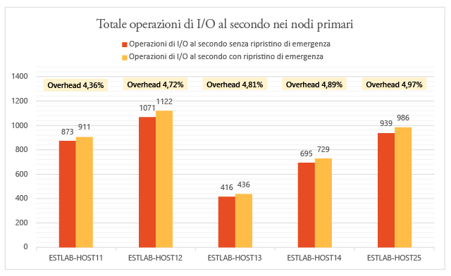

Replica Hyper-V usa la memoria nel server primario per ottimizzare le prestazioni del disco. Come illustrato nel grafico seguente, il sovraccarico della memoria in tutti i server del cluster primario è marginale. Il sovraccarico della memoria mostrato è la percentuale di memoria utilizzata dalla replica rispetto alla memoria totale installata sul server Hyper-V.

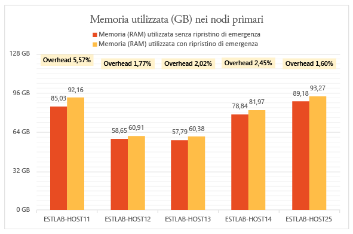

Replica Hyper-V ha un sovraccarico di CPU minimo. Come illustrato nel grafico, il sovraccarico della replica è tra il 2 e il 3%.

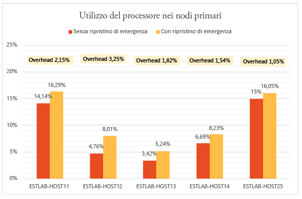

### Prestazioni del server secondario (ripristino)

Replica Hyper-V utilizza una piccola quantità di memoria nel server di ripristino per ottimizzare il numero di operazioni di archiviazione. Il grafico riepiloga l'utilizzo della memoria nel server di ripristino. Il sovraccarico della memoria mostrato è la percentuale di memoria utilizzata dalla replica rispetto alla memoria totale installata sul server Hyper-V.

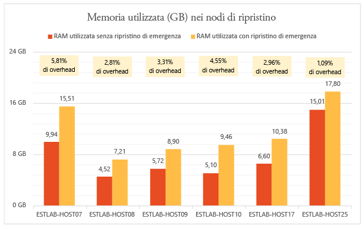

La quantità di operazioni di I/O nel sito di ripristino è una funzione del numero di operazioni di scrittura nel sito primario. Ora verranno esaminate le operazioni di I/O totali sul sito di ripristino rispetto alle operazioni di I/O totali e le operazioni di scrittura nel sito primario. I grafici mostrano che il totale di IOPS nel sito di ripristino è

- Circa 1,5 volte la scrittura di IOPS sul database primario.

- Circa il 37% del totale di IOPS nel sito primario.

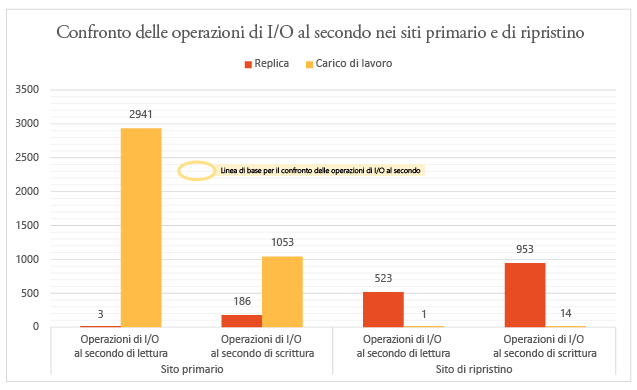

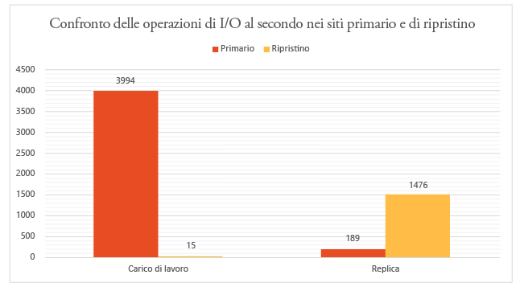

### Effetto della replica sull'uso della rete

Una media di 275 MB al secondo di larghezza di banda è stata utilizzata tra i nodi primario e di ripristino (con compressione abilitata) su una larghezza di banda esistente di 5 GB al secondo.

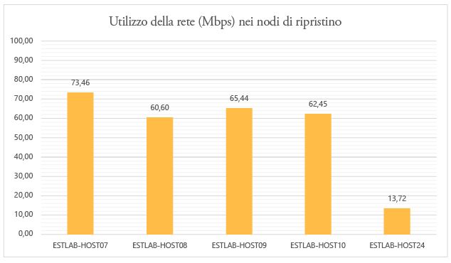

### Effetto della replica sulle prestazioni della macchina virtuale

Una considerazione importante è l'impatto della replica sui carichi di lavoro di produzione in esecuzione nelle macchine virtuali. Se viene eseguito il provisioning adeguato del sito primario per la replica, l’impatto sui carichi di lavoro dovrebbe essere nullo. Il meccanismo di traccia a basso utilizzo di risorse di Replica Hyper-V assicura che i carichi di lavoro in esecuzione nelle macchine virtuali non subiscano ripercussioni durante la replica nello stato stazionario. Tale condizione è illustrata nei grafici seguenti.

Questo grafico mostra IOPS eseguiti dalle macchine virtuali con carichi di lavoro diversi prima e dopo l'abilitazione della replica. È possibile osservare che non esiste alcuna differenza tra i due.

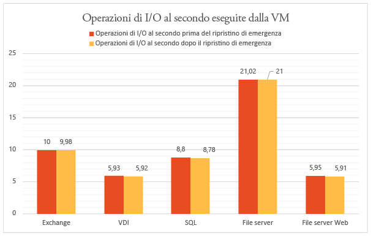

Il grafico seguente mostra la velocità effettiva della macchine virtuali con carichi di lavoro diversi prima e dopo l'abilitazione della replica. È possibile osservare che la replica non ha alcun impatto significativo.

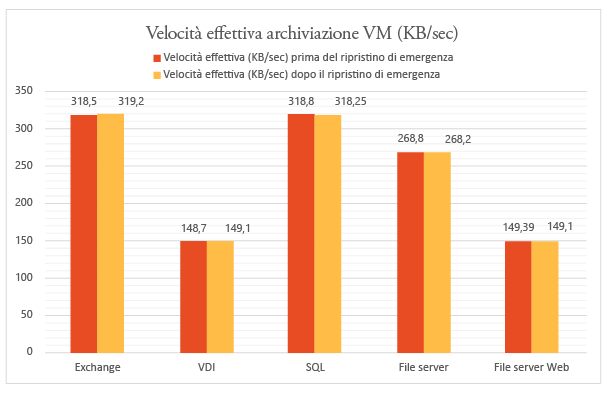

### Conclusioni

I risultati mostrano chiaramente che Azure Site Recovery, grazie a Hyper-V Replica, si adatta bene con un sovraccarico minimo per un cluster di grandi dimensioni. Azure Site Recovery consente di eseguire in modo semplice distribuzione, replica, gestione e monitoraggio. Replica Hyper-V fornisce l'infrastruttura necessaria per la corretta scalabilità della replica. Per la pianificazione di una distribuzione ottimale, è consigliabile scaricare [Hyper-V Replica Capacity Planner](https://www.microsoft.com/download/details.aspx?id=39057).

## Ambiente di test nel dettaglio

### Sito primario

- Il sito primario dispone di un cluster contenente cinque server Hyper-V con 470 macchine virtuali.

- Le macchine virtuali eseguono diversi carichi di lavoro e per tutte la protezione di Azure Site Recovery è abilitata.

- L’archiviazione per il nodo del cluster è fornita da una rete SAN iSCSI. Modello – Hitachi HUS130.

- Ogni server del cluster ha quattro schede di rete (NIC) di 1 Gbps ciascuna.

- Due delle schede di rete sono connesse a una rete privata iSCSI e due sono connesse a una rete aziendale esterna. Una delle reti esterne è riservata alle comunicazioni del cluster.

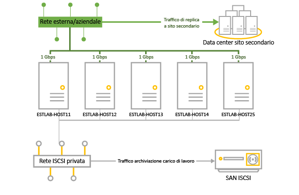

|Server|RAM|Modello|Processore|Numero di processori|NIC|Software|
|---|---|---|---|---|---|---|
|Server Hyper-V nel cluster:  ESTLAB-HOST11 ESTLAB-HOST12 ESTLAB-HOST13 ESTLAB-HOST14 ESTLAB-HOST25|128ESTLAB-HOST25 ha 256|Dell ™ PowerEdge ™ R820|CPU Intel(R) Xeon(R) E5-4620 0 a 2,20 GHz|4|I Gbps x 4|Windows Server Datacenter 2012 R2 (x64) + ruolo Hyper-V|
|Server VMM|2|||2|1 Gbps|Windows Server Database 2012 R2 (x64) + VMM 2012 R2|

### Sito secondario (ripristino)

- Il sito secondario ha un cluster di failover a sei nodi

- L’archiviazione per il nodo del cluster è fornita da una rete SAN iSCSI. Modello – Hitachi HUS130.

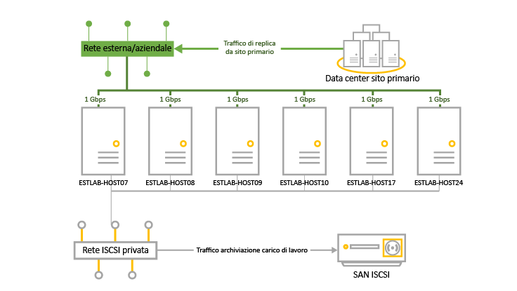

|Server|RAM|Modello|Processore|Numero di processori|NIC|Software|
|---|---|---|---|---|---|---|
|Server Hyper-V nel cluster:  ESTLAB-HOST07 ESTLAB-HOST08 ESTLAB-HOST09 ESTLAB-HOST10|96|Dell ™ PowerEdge ™ R720|CPU Intel(R) Xeon(R) E5-2630 0 a 2,30 GHz|2|I Gbps x 4|Windows Server Datacenter 2012 R2 (x64) + ruolo Hyper-V|
|ESTLAB-HOST17|128|Dell ™ PowerEdge ™ R820|CPU Intel(R) Xeon(R) E5-4620 0 a 2,20 GHz|4||Windows Server Datacenter 2012 R2 (x64) + ruolo Hyper-V|
|ESTLAB-HOST24|256|Dell ™ PowerEdge ™ R820|CPU Intel(R) Xeon(R) E5-4620 0 a 2,20 GHz|2||Windows Server Datacenter 2012 R2 (x64) + ruolo Hyper-V|
|Server VMM|2|||2|1 Gbps|Windows Server Database 2012 R2 (x64) + VMM 2012 R2|

### Carichi di lavoro server

- A scopo di test sono stati scelti i carichi di lavoro comunemente utilizzati negli scenari aziendali dei clienti.

- Si utilizza [IOMeter](http://www.iometer.org) con le caratteristiche del carico di lavoro riepilogate in tabella per la simulazione.

- Tutti i profili IOMeter sono impostati per scrivere byte casuali per simulare modelli di scrittura dei casi peggiori per i carichi di lavoro.

|Carico di lavoro|Dimensioni I/O (KB)|% accesso|% lettura|I/O in sospeso|Modello I/O|
|---|---|---|---|---|---|
|File Server|48163264|60%20%5%5%10%|80%80%80%80%80%|88888|Tutti 100% casuale|
|SQL Server (volume 1) SQL Server (volume 2)|864|100%100%|70%0%|88|100% casuale 100% sequenziale|
|Exchange|32|100%|67%|8|100% casuale|
|Workstation/VDI|464|66%34%|70%95%|11|Entrambi 100% casuale|
|File Server Web|4864|33%34%33%|95%95%95%|888|Tutti 75% casuale|

### Configurazione macchina virtuale

- 470 macchine virtuali nel cluster primario.

- Tutte le macchine virtuali con disco VHDX.

- Macchine virtuali con carichi di lavoro in esecuzione riepilogati nella tabella. Tutti sono stati creati con i modelli VMM.

|Carico di lavoro|N. di VM|RAM minima (GB)|RAM massima (GB)|Dimensioni disco logico (GB) per macchina virtuale|Numero massimo di IOPS|
|---|---|---|---|---|---|
|SQL Server|51|1|4|167|10|
|Exchange Server|71|1|4|552|10|
|File Server|50|1|2|552|22|
|VDI|149|0,5|1|80|6|
|Server Web|149|0,5|1|80|6|
|TOTALE|470|||96,83 TB|4108|

### Impostazioni di Azure Site Recovery

- Azure Site Recovery è stata configurata per la protezione da locale a locale

- Il server VMM ha quattro cloud configurati contenenti i server del cluster Hyper-V e le macchine virtuali.

|Cloud VMM primario|Macchine virtuali protette nel cloud|Frequenza di replica|Punti di ripristino aggiuntivi|
|---|---|---|---|
|PrimaryCloudRpo15m|142|15 min|Nessuno|
|PrimaryCloudRpo30s|47|30 secondi|Nessuno|
|PrimaryCloudRpo30sArp1|47|30 secondi|1|
|PrimaryCloudRpo5m|235|5 min|Nessuno|

### Metriche delle prestazioni

Nella tabella vengono riepilogate le metriche delle prestazioni e i contatori misurati nella distribuzione.

|Metrica|Contatore|
|---|---|
|CPU|\\Processore(\_Totale)\\% tempo del processore| |Memoria disponibile|\\Memoria\\MByte disponibili| |IOPS|\\DiscoFisico(\_Totale)\\Trasferimenti su disco/sec| | Operazioni lettura MV (IOPS)/sec|\\Dispositivo archiviazione virtuale Hyper-V(<VHD>)\\Operazioni lettura/sec| |Operazioni scrittura MV (IOPS)/sec|\\Dispositivo archiviazione virtuale Hyper-V(<VHD>)\\Operazioni scrittura/S| |Produttività lettura MV|\\Dispositivo archiviazione virtuale Hyper-V(<VHD>)\\Byte lettura/sec| |Produttività scrittura MV|\\Dispositivo archiviazione virtuale Hyper-V(<VHD>)\\Byte scrittura/sec|

## Passaggi successivi

- [Configurare la protezione tra due siti VMM locali](site-recovery-vmm-to-vmm.md)

 

<!---HONumber=AcomDC_1203_2015-->