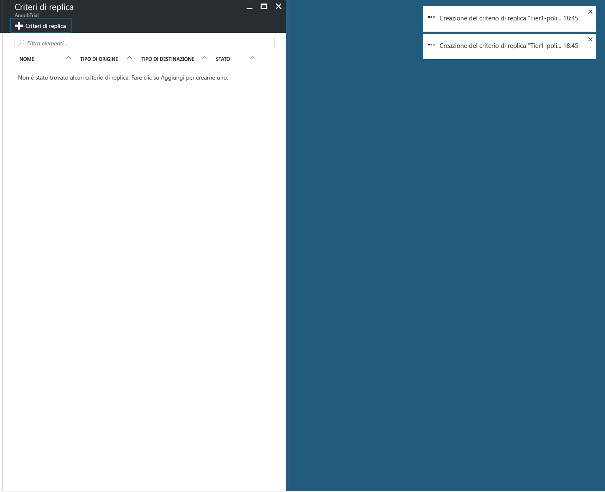
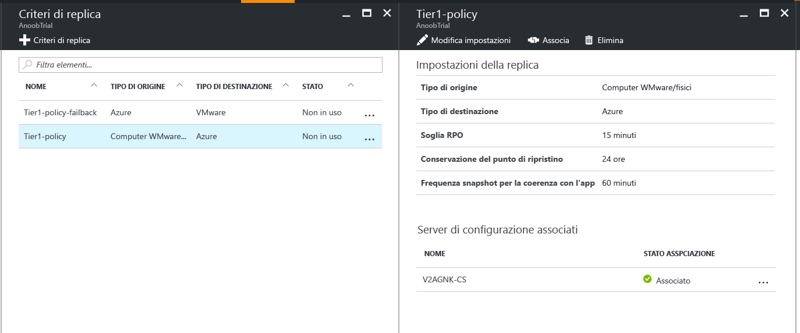
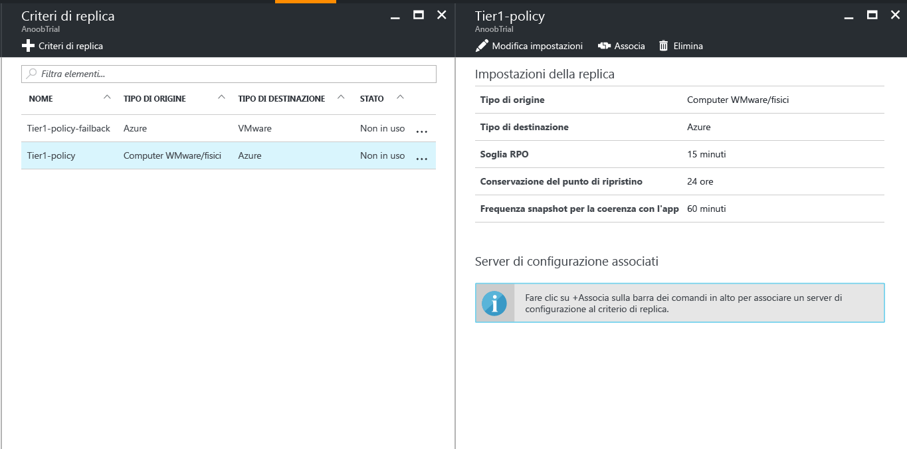
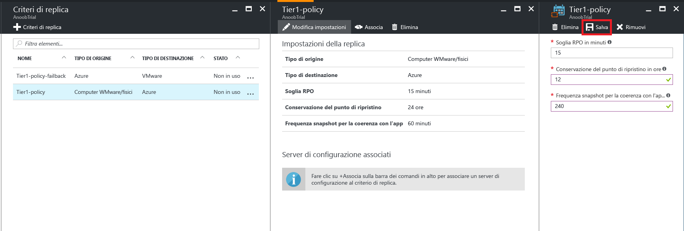

# Gestire i criteri di replica per VMware in Azure

## Creare un criterio di replica

1. Selezionare **Gestisci** > **Site Recovery Infrastructure** (Infrastruttura di Site Recovery).
2. Selezionare **Criteri di replica** in **For VMware and Physical machines** (Per VMware e computer fisici).
3. Selezionare **+Replication policy** (+Criteri di replica).

    

4. Immettere il nome del criterio.

5. In **Soglia RPO**specificare il limite per RPO. Quando la replica continua supera questo limite, verranno generati avvisi.
6. In **Conservazione del punto di ripristino** specificare la durata in ore dell'intervallo di conservazione per ogni punto di ripristino. I computer protetti possono essere ripristinati in qualsiasi punto all'interno di un intervallo di conservazione.

    > [!NOTE]
    > Per le macchine replicate nell'archiviazione Premium è supportato un intervallo di conservazione fino a 24 ore. Per le macchine replicate nell'archiviazione standard è supportato un intervallo di conservazione fino a 72 ore.

    > [!NOTE]
    > Viene creato automaticamente un criterio di replica per il failback.

7. In **Frequenza snapshot coerenti con l'app**specificare la frequenza, in minuti, per la creazione di punti di ripristino contenenti snapshot coerenti con l'applicazione.

8. Fare clic su **OK**. La creazione del criterio dovrebbe richiedere dai 30 secondi ai 60 secondi.

## Associare un server di configurazione ai criteri di replica
1. Scegliere il criterio di replica a cui si desidera associare il server di configurazione.
2. Fare clic su **Associa**.

3. Selezionare il server di configurazione nell'elenco dei server.
4. Fare clic su **OK**. L'associazione del server di configurazione dovrebbe richiedere da 1 a 2 minuti.

## Modificare un criterio di replica
1. Scegliere il criterio per cui si desidera modificare le impostazioni di replica.

2. Fare clic su **Edit Settings**.

3. Modificare le impostazioni in base alle esigenze.
4. Fare clic su **Save**. Il salvataggio del criterio dovrebbe richiedere approssimativamente 5 minuti, a seconda del numero di macchine virtuali che usano il criterio di replica.

## Annullare l'associazione del server di configurazione dai criteri di replica
1. Scegliere il criterio di replica a cui si desidera associare il server di configurazione.
2. Fare clic su **Annulla associazione**.
3. Selezionare il server di configurazione nell'elenco dei server.
4. Fare clic su **OK**. L'annullamento dell'associazione del server di configurazione dovrebbe richiedere 2 minuti.

    > [!NOTE]
    > Non è possibile annullare l'associazione di un server di configurazione se i criteri vengono usati da almeno un elemento replicato. Prima di annullare l'associazione del server di configurazione, verificare che nessun elemento replicato usi i criteri.

## Eliminare un criterio di replica

1. Scegliere il criterio di replica che si desidera eliminare.
2. Fare clic su **Elimina**. L'eliminazione del criterio dovrebbe richiedere dai 30 secondi ai 60 secondi.

    > [!NOTE]
    > Non è possibile eliminare criteri di replica a cui è associato almeno 1 server di configurazione. Prima di eliminare i criteri, verificare che nessun elemento replicato li usi ed eliminare tutti server di configurazione associati.
