# Replicare macchine virtuali Hyper-V nei cloud VMM in Azure
> [!div class="op_single_selector"]
> * [Portale di Azure](site-recovery-vmm-to-azure.md)
> * [PowerShell - Gestione risorse](site-recovery-vmm-to-azure-powershell-resource-manager.md)
> * [Portale classico](site-recovery-vmm-to-azure-classic.md)
> * [PowerShell - Classico](site-recovery-deploy-with-powershell.md)
>
>

Il servizio Azure Site Recovery favorisce l'attuazione della strategia di continuità aziendale e ripristino di emergenza (BCDR) orchestrando le operazioni di replica, failover e ripristino delle macchine virtuali e dei server fisici. È possibile replicare i computer in Azure o in un data center locale secondario. Per una rapida panoramica, leggere [Che cos'è Azure Site Recovery?](site-recovery-overview.md)

## Panoramica
Questo articolo descrive come distribuire Site Recovery per replicare le macchine virtuali Hyper-V in server host Hyper-V che si trovano nei cloud privati VMM in Azure.

Questo articolo include i prerequisiti per lo scenario e mostra come configurare un insieme di credenziali di Site Recovery, installare il provider di Azure Site Recovery nel server VMM di origine, registrare il server nell'insieme di credenziali, aggiungere un account di archiviazione di Azure, installare l'agente di Servizi di ripristino di Azure nei server host Hyper-V, configurare le impostazioni di protezione per i cloud VMM che verranno applicate a tutte le macchine virtuali protette e quindi abilitare la protezione per tali macchine virtuali. Terminare con il test del failover, per accertarsi che tutti gli elementi funzionino come previsto.

Per inviare commenti o domande, è possibile usare la parte inferiore di questo articolo oppure il [forum sui Servizi di ripristino di Azure](https://social.msdn.microsoft.com/forums/azure/home?forum=hypervrecovmgr).

## Architettura
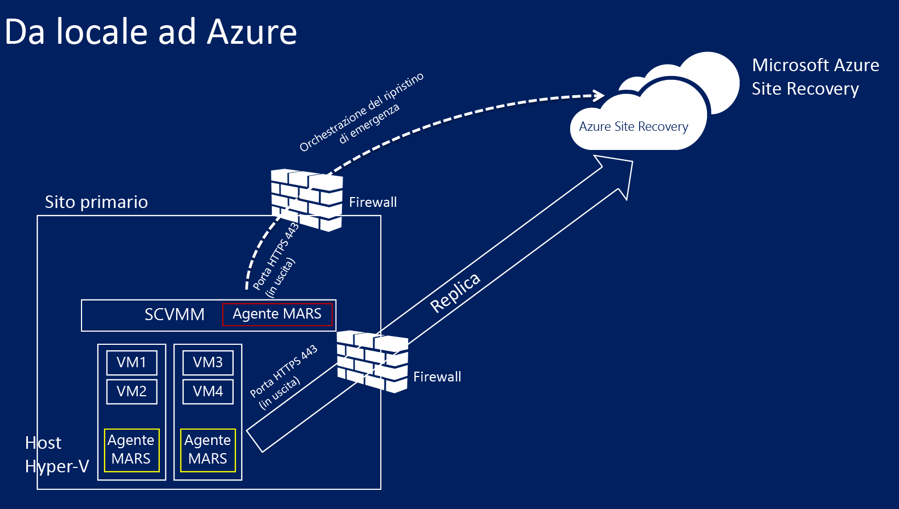

* Il provider di Azure Site Recovery viene installato in VMM durante la distribuzione di Site Recovery e il server VMM viene registrato nell'insieme di credenziali di Site Recovery. Il provider comunica con Site Recovery per gestire l'orchestrazione della replica.
* L'agente di Servizi di ripristino di Azure viene installato nei server host Hyper-V durante la distribuzione di Site Recovery. Gestisce la replica dei dati nell'archiviazione di Azure.

## Prerequisiti di Azure
Ecco gli elementi richiesti in Azure.

| **Prerequisito** | **Dettagli** |
| --- | --- |
| **Account di Azure** |È necessario un account [Microsoft Azure](https://azure.microsoft.com/) . È possibile iniziare con una [versione di valutazione gratuita](https://azure.microsoft.com/pricing/free-trial/). [Altre informazioni](https://azure.microsoft.com/pricing/details/site-recovery/) sui prezzi di Site Recovery. |
| **Archiviazione di Azure** |Per archiviare i dati replicati, sarà necessario un account di archiviazione di Azure. I dati replicati vengono memorizzati nell'archiviazione di Azure e le macchine virtuali di Azure vengono attivate quando si verifica il failover.   È necessario un [account di archiviazione con ridondanza geografica Standard](../storage/storage-redundancy.md#geo-redundant-storage). L'account deve trovarsi nella stessa area del servizio Site Recovery e deve essere associato alla stessa sottoscrizione. Si noti che la replica in account di archiviazione Premium non è attualmente supportata e non deve essere usata.  [Informazioni](../storage/storage-introduction.md) sull'archiviazione di Azure. |
| **Rete di Azure** |È necessaria una rete virtuale di Azure a cui le macchine virtuali di Azure possano connettersi quando si verifica il failover. La rete virtuale di Azure deve essere nella stessa area dell'insieme di credenziali di Site Recovery. |

## Prerequisiti locali
Ecco gli elementi richiesti in locale.

| **Prerequisito** | **Dettagli** |
| --- | --- |
| **VMM** |È necessario almeno un server VMM distribuito come server fisico o virtuale autonomo o come cluster virtuale.   Il server VMM deve eseguire System Center 2012 R2 con gli ultimi aggiornamenti cumulativi.  È necessario almeno un cloud configurato nel server VMM.  Il cloud di origine che si vuole proteggere deve includere uno o più gruppi di host VVM.  Per altre informazioni sulla configurazione dei cloud VMM, vedere la [procedura dettagliata per la creazione di cloud privati con System Center 2012 SP1 VMM](http://blogs.technet.com/b/keithmayer/archive/2013/04/18/walkthrough-creating-private-clouds-with-system-center-2012-sp1-virtual-machine-manager-build-your-private-cloud-in-a-month.aspx) nel blog di Keith Mayer. |
| **Hyper-V** |Sono necessari uno o più cluster o server host Hyper-V in ogni cloud VMM. Il server host deve avere una o più macchine virtuali.   Il server Hyper-V deve eseguire almeno **Windows Server 2012 R2** con ruolo Hyper-V **Microsoft Hyper-V Server 2012 R2** e disporre degli ultimi aggiornamenti installati.  Qualsiasi server Hyper-V contenente le macchine virtuali da proteggere deve trovarsi in un cloud VMM.  Se si esegue Hyper-V in un cluster, si noti che il gestore del cluster non viene creato automaticamente se viene usato un cluster basato su indirizzi IP statici. Sarà necessario configurare manualmente il broker del cluster. [Altre informazioni](https://www.petri.com/use-hyper-v-replica-broker-prepare-host-clusters) nel post di blog di Aidan Finn. |
| **Computer protetti** | Le VM da proteggere devono essere conformi ai [requisiti di Azure](site-recovery-support-matrix-to-azure.md#failed-over-azure-vm-requirements). |

## Prerequisiti di mapping di rete
Quando si proteggono le macchine virtuali in Azure il mapping di rete mappa tra le reti VM nel server VMM di origine e le reti di Azure in un server VMM di destinazione per eseguire le operazioni seguenti:

* Tutte le macchine virtuali di cui viene eseguito il failover nella stessa rete possono connettersi tra loro, indipendentemente dal piano di ripristino di appartenenza.
* Se nella rete di Azure di destinazione è configurato un gateway di rete, le macchine virtuali possono connettersi ad altre macchine virtuali locali.
* Se non si configura il mapping delle reti, solo le macchine virtuali di cui viene eseguito il failover nello stesso piano di ripristino possono connettersi tra loro dopo il failover in Azure.

Per distribuire il mapping di rete sarà necessario quanto segue:

* Le macchine virtuali che si vuole proteggere nel server VMM di origine devono essere connesse a una rete VM. È necessario che tale rete sia collegata a una rete logica associata al cloud.
* Una rete di Azure a cui le macchine virtuali replicate possono connettersi dopo il failover. Questa rete viene selezionata al momento del failover. La rete deve trovarsi nella stessa area della sottoscrizione di Azure Site Recovery.

Preparare le reti in VMM:

   * [Configurare le reti logiche](https://technet.microsoft.com/library/jj721568.aspx).
   * [Configurare le reti VM](https://technet.microsoft.com/library/jj721575.aspx).

## Passaggio 1: creare un insieme di credenziali di Ripristino sito
1. Accedere al [portale di gestione](https://portal.azure.com) dal server VMM che si vuole registrare.
2. Espandere **Servizi dati** > **Servizi di ripristino ** > **Insieme di credenziali di Site Recovery**.
3. Fare clic su **Creare nuovo** > **Creazione rapida**.
4. In **Nome**immettere un nome descrittivo per identificare l'insieme di credenziali.
5. In **Region**selezionare l'area geografica per l'insieme di credenziali. Per verificare le aree geografiche supportate, vedere la sezione Disponibilità a livello geografico in [Prezzi di Azure Site Recovery](https://azure.microsoft.com/pricing/details/site-recovery/).
6. Fare clic su **Create vault**.

    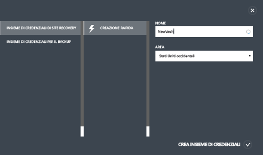

Controllare la barra di stato per verificare che l'insieme di credenziali sia stato creato correttamente. L'insieme di credenziali verrà elencato come **Attivo** nella pagina principale di Servizi di ripristino.

## Passaggio 2: generare una chiave di registrazione dell'insieme di credenziali
Generare una chiave di registrazione nell'insieme di credenziali. Dopo aver scaricato il provider di Azure Site Recovery e averlo installato sul server VMM, si userà questa chiave per registrare il server VMM nell'insieme di credenziali.

1. Nella pagina **Servizi di ripristino** fare clic sull'insieme di credenziali per aprire la pagina Avvio rapido. La pagina Avvio rapido può anche essere aperta in qualsiasi momento tramite l'icona.

    
2. Nell'elenco a discesa selezionare **Tra un sito VMM locale e Azure**.
3. In **Preparare i server VMM** fare clic sul file **Generate registration key**. Il file di chiave viene generato automaticamente ed è valido per 5 giorni dal momento in cui viene generato. Se non si accede al portale di Azure dal server VMM sarà necessario copiare questo file sul server.

    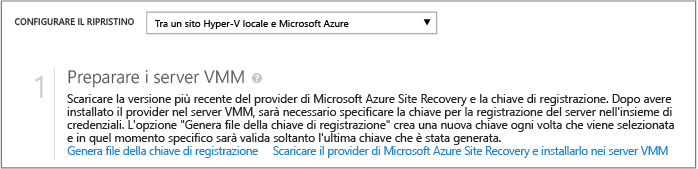

## Passaggio 3: installare il provider di Azure Site Recovery
1. In **Avvio rapido** > **Preparare i server VMM** fare clic su **Scaricare il provider di Microsoft Azure Site Recovery e installarlo nei server VMM** per ottenere la versione più recente del file di installazione del provider.
2. Eseguire il file nel server VMM di origine.

   > [!NOTE]
   > Se VMM viene distribuito in un cluster e si installa il provider per la prima volta, installarlo in un nodo attivo nel cluster e completare l'installazione per registrare il server VMM nell'insieme di credenziali. Quindi, installare il provider sugli altri nodi. Si noti che se si sta aggiornando il provider sarà necessario eseguire l'aggiornamento su tutti i nodi, in quanto dovrebbero eseguire tutti la stessa versione del provider.
   >
   >
3. Il programma di installazione esegue una verifica dei prerequisiti e chiede l'autorizzazione per arrestare il servizio VMM e avviare l'installazione del provider. Il servizio VMM verrà riavviato automaticamente al termine dell'installazione. Se si esegue l'installazione in un cluster VMM, verrà richiesto di interrompere il ruolo Cluster.
4. In **Microsoft Update** è possibile fornire il consenso esplicito agli aggiornamenti. Se questa impostazione è abilitata, gli aggiornamenti del provider verranno installati in base ai criteri indicati in Microsoft Update.

    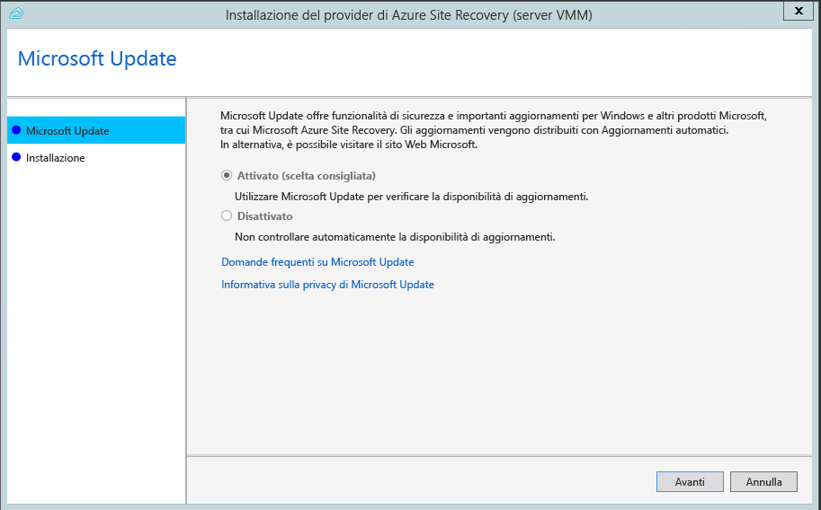
5. Il percorso di installazione per il provider è impostato su **<SystemDrive>\Programmi\Microsoft System Center 2012 R2\Virtual Machine Manager\bin**. Fare clic su **Installa**.

   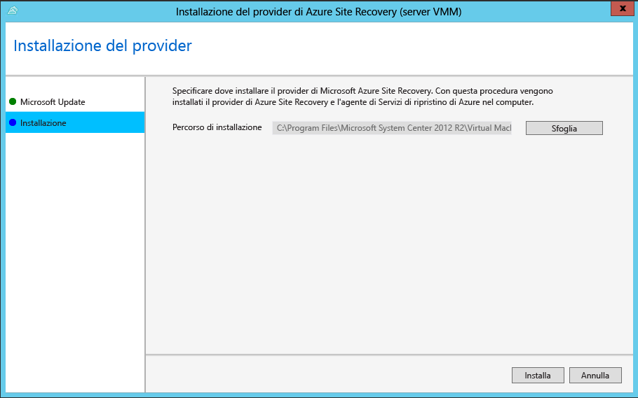
6. Dopo l'installazione del provider, fare clic su **Registra** per registrare il server nell'insieme di credenziali.

    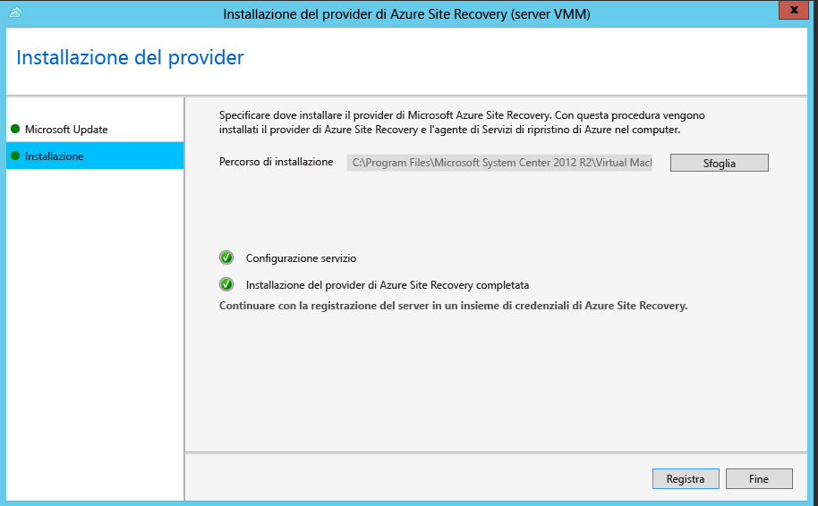
7. In **Vault name**verificare il nome dell'insieme di credenziali in cui verrà registrato il server. Fare clic su *Avanti*.

    
8. Nella pagina **Connessione Internet** specificare la modalità di connessione Internet del provider in esecuzione sul server VMM. Selezionare **Connect with existing proxy settings** (Connetti con le impostazioni proxy esistenti) per usare le impostazioni di connessione a Internet predefinite configurate nel server.

    

   * Se si vuole usare un server proxy personalizzato, configurarlo prima di installare il provider. Quando si configurano impostazioni proxy personalizzate, verrà eseguito un test per verificare la connessione proxy.
   * Se si usa un proxy personalizzato oppure se il proxy predefinito richiede l'autenticazione, sarà necessario immettere i dettagli del proxy, tra cui l'indirizzo e la porta.
   * Gli URL seguenti devono essere accessibili dal server VMM e dagli host Hyper-V
     * *.hypervrecoverymanager.windowsazure.com
     * *.accesscontrol.windows.net
     * *.backup.windowsazure.com
     * *.blob.core.windows.net
     * *.store.core.windows.net
   * Consentire gli indirizzi IP descritti in [Intervalli IP dei data center di Azure](https://www.microsoft.com/download/confirmation.aspx?id=41653) e il protocollo HTTPS (443). È necessario aggiungere all'elenco di indirizzi consentiti gli IP dell'area Azure che si prevede di utilizzare e quello degli Stati Uniti occidentali.
   * Se si usa un proxy personalizzato, un account RunAs di VMM (DRAProxyAccount) verrà creato automaticamente con le credenziali del proxy specificate. Configurare il server proxy in modo che l'account possa eseguire correttamente l'autenticazione. Le impostazioni dell'account RunAs di VMM possono essere modificate nella console VMM. A tale scopo, aprire l'area di lavoro **Impostazioni**, espandere **Sicurezza**, fare clic su **Account RunAs**, quindi modificare la password di DRAProxyAccount. È necessario riavviare il servizio VMM per rendere effettiva l'impostazione.
9. In **Chiave di registrazione**selezionare il codice di registrazione scaricato da Azure Site Recovery e copiato nel server VMM.
10. L'impostazione di crittografia viene usata solo quando si esegue la replica di VM Hyper-V in cloud VMM in Azure. Non viene usata se si esegue la replica in un sito secondario.
11. In **Nome server**specificare un nome descrittivo per identificare il server VMM nell'insieme di credenziali. In una configurazione cluster specificare il nome del ruolo relativo al cluster VMM.
12. In **Sincronizza i metadati cloud** selezionare se si vogliono sincronizzare i metadati per tutti i cloud presenti sul server VMM con l'insieme di credenziali. È necessario eseguire questa azione solo una volta in ogni server. Se non si vogliono sincronizzare tutti i cloud, è possibile lasciare deselezionata questa opzione e sincronizzare ogni cloud singolarmente nelle proprietà del cloud nella console VMM.
13. Fare clic su **Avanti** per completare il processo. Dopo la registrazione, i metadati del server VMM vengono recuperati da Azure Site Recovery. Il server viene visualizzato nella scheda **Server VMM** della pagina **Server** nell'insieme di credenziali.

    

Dopo la registrazione, i metadati del server VMM vengono recuperati da Azure Site Recovery. Il server viene visualizzato nella scheda **Server VMM** della pagina **Server** nell'insieme di credenziali.

### Installazione dalla riga di comando
Il provider di Azure Site Recovery può essere installato anche usando la riga di comando seguente. Questo metodo può essere usato per installare il provider in un Server Core per Windows Server 2012 R2.

1. Scaricare il file di installazione del provider e il codice di registrazione in una cartella, ad esempio C:\ASR.
2. Arrestare il servizio System Center Virtual Machine Manager.
3. Da un prompt dei comandi con privilegi elevati estrarre il programma di installazione del provider con i comandi seguenti:

        C:\Windows\System32> CD C:\ASR
        C:\ASR> AzureSiteRecoveryProvider.exe /x:. /q
4. Installare il provider come indicato di seguito:

        C:\ASR> setupdr.exe /i
5. Registrare il provider come indicato di seguito:

        CD C:\Program Files\Microsoft System Center 2012 R2\Virtual Machine Manager\bin
        C:\Program Files\Microsoft System Center 2012 R2\Virtual Machine Manager\bin\> DRConfigurator.exe /r  /Friendlyname <friendly name of the server> /Credentials <path of the credentials file> /EncryptionEnabled <full file name to save the encryption certificate>       

I parametri sono i seguenti:

* **/Credentials** : parametro obbligatorio che specifica la posizione in cui si trova il file della chiave di registrazione.  
* **/FriendlyName** : parametro obbligatorio per il nome del server host Hyper-V che viene visualizzato nel portale di Azure Site Recovery.
* **/EncryptionEnabled** : parametro facoltativo per specificare se devono essere crittografate le macchine virtuali di Azure (crittografia dei dati inattivi). Il nome file deve avere un'estensione **pfx** .
* **/proxyAddress** : parametro facoltativo che specifica l'indirizzo del server proxy.
* **/proxyport** : parametro facoltativo che specifica la porta del server proxy.
* **/proxyUsername** : parametro facoltativo che specifica il nome utente proxy.
* **/proxyPassword** : parametro facoltativo che specifica la password proxy.  

## Passaggio 4: Creare un account di archiviazione di Azure
1. Se non si ha account di archiviazione di Azure, fare clic su **Aggiungi un account di archiviazione di Azure** per crearne uno.
2. Creare un account con la replica geografica abilitata. L'account deve trovarsi nella stessa area geografica del servizio Azure Site Recovery e deve essere associato alla stessa sottoscrizione.

    

> [!NOTE]
> [La migrazione degli account di archiviazione](../azure-resource-manager/resource-group-move-resources.md) all'interno dei gruppi di risorse con la stessa sottoscrizione o all'interno delle sottoscrizioni non è supportata per gli account di archiviazione usati per la distribuzione di Site Recovery.
>
>

## Passaggio 5: Installare l'agente di Servizi di ripristino di Azure
Installare l'agente di Servizi di ripristino di Azure su ogni server host Hyper-V nel cloud VMM.

1. Fare clic su **Avvio rapido** > **Scaricare l'agente di Servizi di ripristino di Microsoft Azure per l'installazione nei server host Hyper-V** per ottenere la versione più recente del file di installazione dell'agente.

    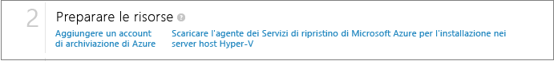
2. Eseguire il file di installazione in ogni server host Hyper-V.
3. Nella pagina **Controllo dei prerequisiti** fare clic su **Avanti**. Gli eventuali prerequisiti mancanti verranno installati automaticamente.

    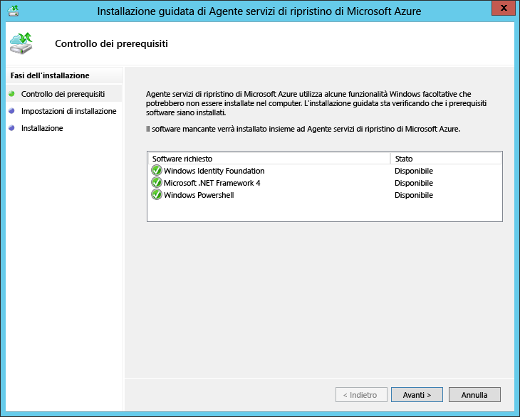
4. Nella pagina **Impostazioni di installazione** specificare dove installare l'agente e selezionare il percorso della cache in cui verranno installati i metadati di backup. Fare clic su **Installa**.
5. Al termine dell'installazione fare clic su **Chiudi** per completare la procedura guidata.

    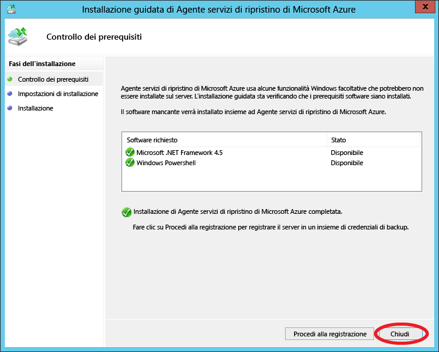

### Installazione dalla riga di comando
È anche possibile installare l'agente di Servizi di ripristino di Microsoft Azure dalla riga di comando con questo comando:

    marsagentinstaller.exe /q /nu

## Passaggio 6: configurare le impostazioni di protezione del cloud
Dopo la registrazione del server VMM, sarà possibile configurare le impostazioni di protezione del cloud. Quando si installa il provider, abilitare l'opzione **Sincronizza dati cloud con insieme credenziali** in modo che tutti i cloud presenti sul server VMM vengano visualizzati nella scheda <b>Elementi protetti</b> dell'insieme di credenziali.

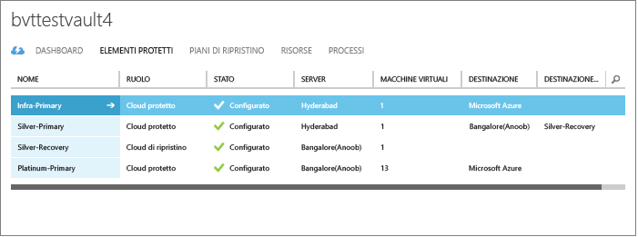

1. Nella pagina Avvio rapido fare clic su **Configurare la protezione per i cloud VMM**.
2. Nella scheda **Elementi protetti** fare clic sul cloud da configurare e passare alla scheda **Configurazione**.
3. In **Rete Azure di destinazione** select **Azure**.
4. In **Account di archiviazione** selezionare l'account di archiviazione di Azure usato per la replica.
5. Impostare **Crittografa dati archiviati** su **Disattivato**. Questa impostazione specifica che i dati devono essere crittografati durante la replica tra il sito locale e Azure.
6. In **Frequenza di copia** lasciare l'impostazione predefinita. Questo valore consente di specificare la frequenza della sincronizzazione dei dati tra il percorso di origine e di destinazione.
7. In **Mantieni punti di ripristino per**lasciare l'impostazione predefinita. Il valore predefinito zero indica che solo il punto di ripristino più recente per una macchina virtuale primaria viene archiviato in un server host di replica.
8. In **Frequenza degli snapshop coerenti con l'applicazione**lasciare l'impostazione predefinita. Questo valore consente di specificare la frequenza della creazione di snapshot. Gli snapshot usano il Servizio Copia Shadow del volume (VSS, Volume Shadow Copy Service) per assicurare che lo stato delle applicazioni sia coerente quando viene creato lo snapshot.  Se si imposta un valore, questo deve essere inferiore al numero di punti di ripristino aggiuntivi configurati.
9. In **Ora inizio replica**specificare quando deve essere avviata la replica iniziale dei dati in Azure. Verrà usato il fuso orario del server host Hyper-V. È consigliabile pianificare la replica iniziale durante le fasce orarie di minore attività.

    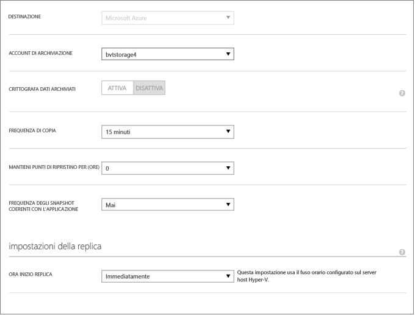

Dopo avere salvato le impostazioni, verrà creato un processo che potrà essere monitorato nella scheda **Processi** . Tutti i server host Hyper-V nel cloud di origine VMM verranno configurati per la replica.

Dopo il salvataggio, le impostazioni cloud possono essere modificate nella scheda **Configura** . Per modificare il percorso o l’account di archiviazione di destinazione, è necessario rimuovere la configurazione del cloud e quindi riconfigurare il cloud. Si noti che se si cambia l'account di archiviazione, la modifica viene applicata alle macchine virtuali abilitate per la protezione solo dopo la modifica dell'account di archiviazione. Non viene eseguita la migrazione delle macchine virtuali esistenti al nuovo account di archiviazione.

## Passaggio 7: Configurare il mapping di rete
Prima di iniziare il mapping di rete, verificare che le macchine virtuali nel server VMM di origine siano connesse a una rete VM. Inoltre, creare una o più rete virtuali di Azure. Si noti che è possibile mappare più reti VM a una singola rete di Azure.

1. Nella pagina Avvio rapido fare clic su **Mapping reti**.
2. Nella scheda **Reti**, in **Percorso di origine**, selezionare il server VMM di origine. In **Percorso di destinazione** selezionare Azure.
3. In Reti di **origine** viene visualizzato un elenco di reti VM associate al server VMM. In **Rete Azure di destinazione** vengono visualizzate le reti di Azure associate alla sottoscrizione.
4. Selezionare la rete VM di origine e fare clic su **Esegui mapping**.
5. Nella pagina **Seleziona una rete di destinazione** selezionare la rete di Azure di destinazione che si vuole usare.
6. Fare clic sul segno di spunta per completare il processo di mapping.

    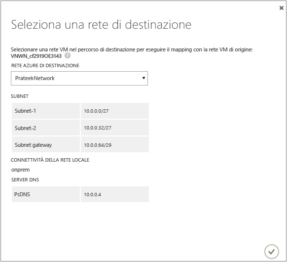

Dopo avere salvato le impostazioni, viene avviato un processo che tiene traccia dello stato del mapping e che può essere monitorato nella scheda Processi. Tutte le macchine virtuali di replica esistenti che corrispondono alla rete VM di origine verranno connesse alle reti di Azure di destinazione. Dopo la replica, le nuove macchine virtuali connesse alla rete VM di origine verranno connesse alla rete di Azure mappata. Se si modifica un mapping esistente con una nuova rete, le macchine virtuali di replica verranno connesse usando le nuove impostazioni.

Si noti che, se la rete di destinazione ha più subnet e una di esse ha lo stesso nome di una subnet in cui si trova la macchina virtuale di origine, la macchina virtuale di replica sarà connessa a tale subnet di destinazione dopo il failover. Se non è presente una subnet di destinazione con un nome corrispondente, la macchina virtuale sarà connessa alla prima subnet della rete.

> [!NOTE]
> La [migrazione di reti](../azure-resource-manager/resource-group-move-resources.md) all'interno dei gruppi di risorse con la stessa sottoscrizione o all'interno delle sottoscrizioni non è supportata per le reti usate per la distribuzione di Site Recovery.
>
>

## Passaggio 8: Abilitare la protezione per le macchine virtuali
Dopo la configurazione corretta di server, cloud e reti, sarà possibile abilitare la protezione per le macchine virtuali nel cloud. Tenere presente quanto segue:

* Le macchine virtuali devono essere conformi ai [requisiti di Azure](site-recovery-support-matrix-to-azure.md#failed-over-azure-vm-requirements).
* Per abilitare la protezione, è necessario che le proprietà del sistema operativo e del disco del sistema operativo siano impostate per la macchina virtuale. Quando si crea una macchina virtuale basata su un modello di macchina virtuale VMM è possibile impostare la proprietà. È possibile impostare queste proprietà anche per le macchine virtuali esistenti nelle schede **Generale** e **Configurazione hardware** delle proprietà delle macchine virtuali. Se queste proprietà non vengono impostate in VMM, sarà possibile configurarle nel portale di Azure Site Recovery.

    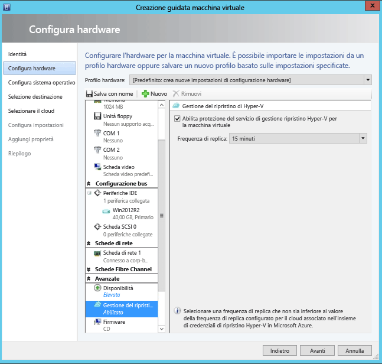

    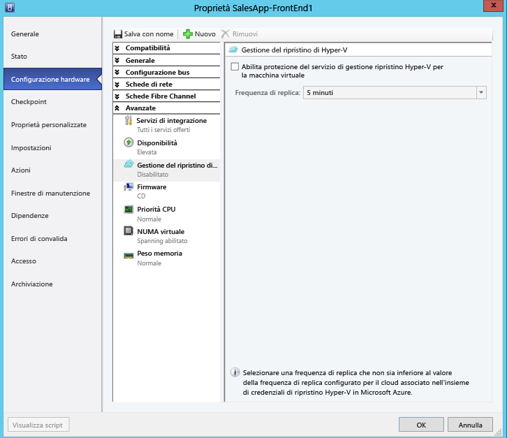

1. Per abilitare la protezione, nella scheda **Macchine virtuali** del cloud in cui si trova la macchina virtuale fare clic su **Abilita protezione** > **Aggiungi macchine virtuali**.
2. Nell'elenco di macchine virtuali nel cloud selezionare quella da proteggere.

    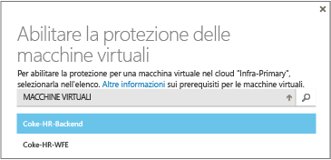

    Tenere traccia dello stato dell'azione **Abilita protezione**, inclusa la replica iniziale, nella scheda **Processi**. Dopo l'esecuzione del processo **Finalizza protezione** , la macchina virtuale è pronta per il failover. Al termine dell'operazione di abilitazione della protezione e di replica delle macchine virtuali, sarà possibile visualizzarle in Azure.

    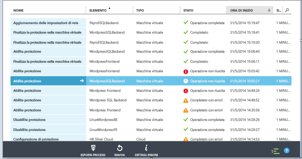

1. Verificare le proprietà della macchina virtuale e modificarle in base alle esigenze.

    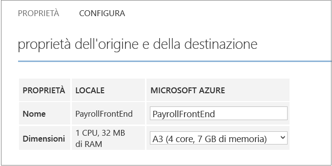
2. Nella scheda **Configura** delle proprietà della macchina virtuale è possibile modificare le proprietà di rete seguenti.

* **Numero di schede di rete nella macchina virtuale di destinazione** : il numero di schede di rete dipende dalle dimensioni specificate per la macchina virtuale di destinazione. Per il numero di schede supportate dalle dimensioni della macchina virtuale, vedere le [specifiche sulle dimensioni delle macchine virtuali](../virtual-machines/virtual-machines-linux-sizes.md) . Quando si modificano le dimensioni di una macchina virtuale e si salvano le impostazioni, il numero di schede di rete cambia alla successiva apertura della pagina **Configura**. Il numero di schede di rete delle macchine virtuali di destinazione corrisponde al numero minimo di schede di rete nella macchina virtuale di origine e al numero massimo di schede di rete supportate dalla dimensione della macchina virtuale selezionata, come segue:

  * Se il numero di schede di rete nella macchina di origine è minore o uguale al numero di schede consentite per la macchina di destinazione, la destinazione avrà lo stesso numero di schede dell’origine.
  * Se il numero di schede per la macchina virtuale di origine supera il numero consentito per le dimensioni di destinazione, verrà utilizzata la dimensione di destinazione massima.
  * Ad esempio, se una macchina di origine ha due schede di rete e le dimensioni della macchina di destinazione ne supportano quattro, la macchina di destinazione avrà due schede. Se la macchina di origine dispone di due schede ma le dimensioni di destinazione supportate ne consentono solo una, la macchina di destinazione avrà una sola scheda.     
* **Rete della macchina virtuale di destinazione** : la rete a cui si connette la macchina virtuale è determinata dal mapping di rete della rete della macchina virtuale di origine. Se la macchina virtuale di origine ha più di una scheda di rete e le reti di origine sono mappate a reti diverse nella destinazione, si dovrà scegliere una delle reti di destinazione.
* **Subnet di ogni scheda di rete** : per ogni scheda di rete è possibile scegliere la subnet a cui si connetterà la macchina virtuale di cui è stato eseguito il failover.
* **Indirizzo IP di destinazione** : se la scheda di rete della macchina virtuale di origine è configurata per l'uso dell'indirizzo IP statico, è possibile fornire l'indirizzo IP per la macchina virtuale di destinazione. Usare questa funzionalità per mantenere l'indirizzo IP di una macchina virtuale di origine dopo un failover. Se non viene fornito alcun indirizzo IP, alla scheda di rete verrà assegnato qualsiasi indirizzo IP disponibile al momento del failover. Se viene specificato un indirizzo IP di destinazione già usato da un'altra macchina virtuale in Azure, il failover non riuscirà.  

    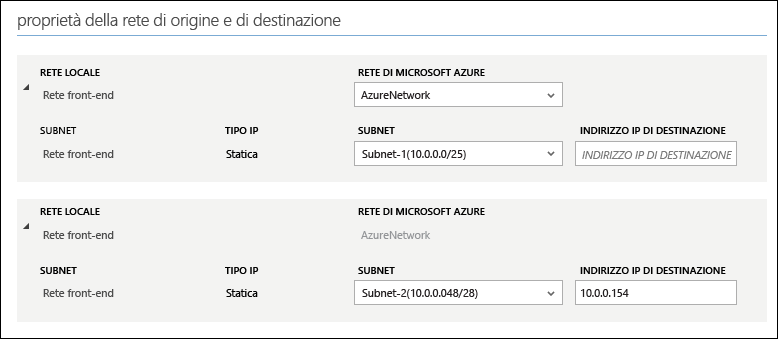

> [!NOTE]
> Le macchine virtuali Linux con indirizzo IP statico non sono supportate.
>
>

## Test della distribuzione
Per testare la distribuzione è possibile eseguire un failover di test per una singola macchina virtuale oppure creare un piano di ripristino costituito da più macchine virtuali ed eseguire un failover di test per il piano.  

Il failover di test consente di simulare il meccanismo di failover e di ripristino in una rete isolata. Si noti che:

* Per eseguire la connessione alla macchina virtuale in Azure tramite Desktop remoto dopo il failover, abilitare Connessione Desktop remoto sulla macchina virtuale prima di eseguire il failover di test.
* Dopo il failover si userà un indirizzo IP pubblico per connettersi alla VM di Azure tramite Desktop remoto. Se si vuole procedere in questo senso, assicurarsi che non siano presenti criteri di dominio che impediscono la connessione a una macchina virtuale mediante un indirizzo pubblico.

> [!NOTE]
> Per ottenere prestazioni ottimali quando si esegue un failover in Azure, assicurarsi di aver installato l'agente di Azure nella VM. Questo consente di avere tempi di avvio più rapidi e contribuisce alla risoluzione dei problemi. Scaricare l'[agente di Linux](https://github.com/Azure/WALinuxAgent), o l'[agente di Windows](http://go.microsoft.com/fwlink/?LinkID=394789).
>
>

### Creare un piano di ripristino
1. Nella scheda **Piani di ripristino** aggiungere un nuovo piano. Specificare un nome, immettere **VMM** in **Tipo origine** e specificare il server VMM di origine in **Origine**. La destinazione sarà Azure.

    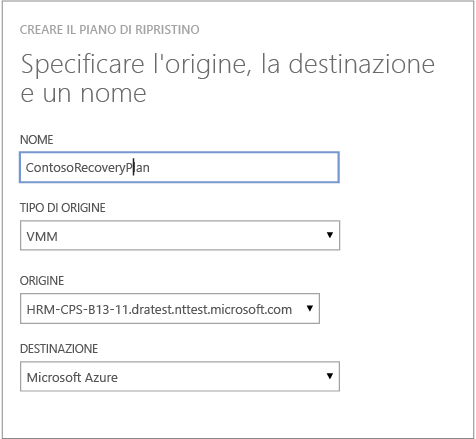
2. Nella pagina **Seleziona macchine virtuali** selezionare le macchine virtuali da aggiungere al piano di ripristino. Le macchine virtuali verranno aggiunte al gruppo predefinito del piano di ripristino, ossia il Gruppo 1. In un singolo piano di ripristino è stato testato un massimo di 100 macchine virtuali.

* Se si vuole verificare le proprietà delle macchine virtuali prima di aggiungerle al piano, fare clic sulla macchina virtuale nella pagina delle proprietà nel cloud in cui si trova. È anche possibile configurare le proprietà della macchina virtuale nella console VMM.
* Tutte le macchine virtuali visualizzate sono state abilitate per la protezione. L'elenco include sia le macchine virtuali abilitate per la protezione e per cui la replica iniziale è stata completata sia quelle abilitate per la protezione con la replica iniziale in corso. Solo le macchine virtuali con la replica iniziale completa possono eseguire il failover come parte di un piano di ripristino.

    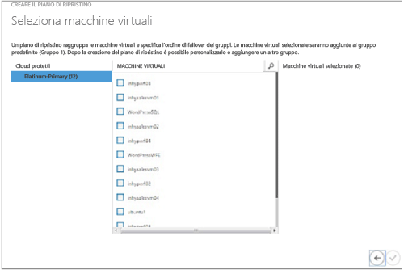

Una volta creato il piano di ripristino, verrà visualizzato nella scheda **Piani di ripristino** . È anche possibile aggiungere [runbook di Automazione di Azure](site-recovery-runbook-automation.md) al piano di ripristino per automatizzare le azioni durante il failover.

### Eseguire un failover di test
È possibile eseguire un failover di test in Azure in due modi.

* **Failover di test senza una rete di Azure**: questo tipo di failover di test verifica che la macchina virtuale sia rilevata correttamente in Azure. La macchina virtuale non sarà connessa ad alcuna rete di Azure dopo il failover.
* **Failover di test con una rete di Azure**: questo tipo di failover verifica che l'intero ambiente di replica venga rilevato come previsto e che le macchine virtuali di cui viene eseguito il failover siano connesse alla rete di destinazione di Azure specificata. Per la gestione della subnet, nel failover di test la subnet della macchina virtuale di test verrà rilevata in base alla subnet della macchina virtuale di replica. Questo comportamento è diverso dalla replica normale quando la subnet della macchina virtuale di replica si basa sulla subnet della macchina virtuale di origine.

Per eseguire un failover di test per una macchina virtuale abilitata per la protezione in Azure senza specificare una rete di Azure di destinazione, non occorre preparare l'ambiente. Per eseguire un failover di test con una rete di Azure di destinazione, è necessario creare una nuova rete di Azure isolata dalla rete di Azure di produzione, ovvero il comportamento predefinito quando si crea una nuova rete in Azure. Altre informazioni dettagliate su come [eseguire un failover di test](site-recovery-failover.md) .

Sarà anche necessario configurare l'infrastruttura per il corretto funzionamento della macchina virtuale replicata. Ad esempio, una macchina virtuale con DNS e Controller di dominio può essere replicata in Azure utilizzando Azure Site Recovery e può essere creata nella rete di test utilizzando Failover di test. Per altri dettagli, vedere la sezione [Considerazioni sul failover di test per Active Directory](site-recovery-active-directory.md#test-failover-considerations) .

Per eseguire un failover di test, eseguire le operazioni seguenti:

1. Nella scheda **Piani di ripristino** selezionare il piano e fare clic su **Failover di test**.
2. Nella pagina **Conferma failover di test** selezionare **Nessuno** o una rete di Azure specifica.  Tenere presente che se si seleziona Nessuno, il failover di test verifica che la macchina virtuale venga replicata correttamente in Azure ma non controlla la configurazione della rete di replica.

    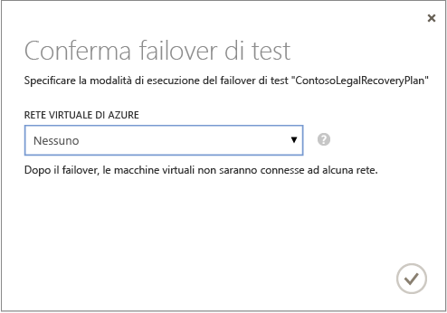
3. Se la crittografia dei dati è abilitata per il cloud, in **Chiave di crittografia** selezionare il certificato generato durante l'installazione del provider nel server VMM quando è stata attivata l'opzione per abilitare la crittografia dei dati per un cloud.
4. Nella scheda **Processi** è possibile tenere traccia dello stato di avanzamento del failover. Dovrebbe anche essere possibile vedere la replica di test della macchina virtuale nel portale di Azure. Se è stato impostato l'accesso alle macchine virtuali dalla rete locale, è possibile inizializzare una Connessione Desktop remoto alla macchina virtuale.
5. Quando il processo di failover raggiunge la fase **conclusiva del test**, fare clic su **Completa test** per completarlo. È possibile eseguire il drill-down fino alla scheda **Processo** per tenere traccia dello stato e dell’avanzamento del failover ed eseguire eventuali azioni necessarie.
6. Al termine del processo di failover, nel Portale di Azure è possibile visualizzare la replica del test eseguito sulla macchina virtuale. Se è stato impostato l'accesso alle macchine virtuali dalla rete locale, è possibile inizializzare una Connessione Desktop remoto alla macchina virtuale. Eseguire le operazioni seguenti:

   1. Verificare che le macchine virtuali vengano avviate correttamente.
   2. Per eseguire la connessione alla macchina virtuale in Azure tramite Desktop remoto dopo il failover, abilitare Connessione Desktop remoto sulla macchina virtuale prima di eseguire il failover di test. È anche necessario aggiungere un endpoint RDP nella macchina virtuale. A tale scopo, è possibile utilizzare un [Runbook di Automazione di Azure](site-recovery-runbook-automation.md) .
   3. Dopo il failover, se si utilizza un indirizzo IP pubblico per connettersi alla macchina virtuale in Azure tramite Desktop remoto, verificare che non siano definiti criteri di dominio che impediscono la connessione a una macchina virtuale utilizzando un indirizzo pubblico.
7. Al completamento del test, procedere come segue:

   * Fare clic su **Il failover di test è completo**. Pulire l'ambiente di test per spegnere automaticamente ed eliminare la macchine virtuali di test.
   * Fare clic su **Note** per registrare e salvare eventuali commenti associati al failover di test.

## Passaggi successivi
Altre informazioni sulla [configurazione dei piani di ripristino](site-recovery-create-recovery-plans.md) e sul [failover](site-recovery-failover.md).

