<properties
	pageTitle="Configurare la protezione tra un sito VMM locale e Azure"
	description="Azure Site Recovery coordina la replica, il failover e il ripristino in Azure di macchine virtuali Hyper-V ubicate in cloud VMM locali."
	services="site-recovery"
	documentationCenter=""
	authors="rayne-wiselman"
	manager="jwhit"
	editor="tysonn"/>

<tags
	ms.service="site-recovery"
	ms.workload="backup-recovery"
	ms.tgt_pltfrm="na"
	ms.devlang="na"
	ms.topic="hero-article"
	ms.date="09/23/2015"
	ms.author="raynew"/>

#  Configurare la protezione tra un sito VMM locale e Azure

## Panoramica

Azure Site Recovery favorisce la strategia di continuità aziendale e ripristino di emergenza (BCDR) gestendo la replica, il failover e il ripristino delle macchine virtuali in diversi scenari di distribuzione. Per un elenco completo degli scenari di distribuzione, vedere [Panoramica di Azure Site Recovery](site-recovery-overview.md).

Questo scenario descrive come distribuire Site Recovery per gestire e automatizzare la protezione per carichi di lavoro in esecuzione su macchine virtuali su server host Hyper-V situati in cloud privati VMM. In questo scenario le macchine virtuali vengono replicate da un sito VMM primario ad Azure usando la replica Hyper-V.

La guida include i prerequisiti per lo scenario e mostra come configurare un insieme di credenziali di Azure Site Recovery, installare il provider di Azure Site Recovery sul server VMM di origine, registrare il server nell'insieme di credenziali, aggiungere un account di archiviazione di Azure, installare l'agente di Servizi di ripristino di Azure nei server host Hyper-V, configurare le impostazioni di protezione per i cloud VMM che verranno applicate a tutte le macchine virtuali protette e quindi abilitare la protezione per tali macchine virtuali. Terminare con il test del failover, per accertarsi che tutti gli elementi funzionino come previsto.

Nel caso di problemi di configurazione di questo scenario, inviare le proprie domande al [forum sui Servizi di ripristino di Azure](http://go.microsoft.com/fwlink/?LinkId=313628).

## Prima di iniziare

Assicurarsi che siano rispettati i prerequisiti seguenti:
### Prerequisiti di Azure

- È necessario un account [Microsoft Azure](http://azure.microsoft.com/). Nel caso in cui non sia disponibile, cominciare con una [versione di valutazione gratuita](http://aka.ms/try-azure). Inoltre, è possibile leggere le informazioni sui [prezzi di Azure Site Recovery Manager](http://go.microsoft.com/fwlink/?LinkId=378268).
- Per archiviare dati replicati in Azure è necessario un account di archiviazione di Azure. Nell'account deve essere abilitata la replica geografica. L'account deve trovarsi nella stessa area geografica in cui si trova il servizio Azure Site Recovery e deve essere associato alla stessa sottoscrizione. Per altre informazioni sulla configurazione dell'archiviazione di Azure, vedere [Introduzione ad Archiviazione di Microsoft Azure](http://go.microsoft.com/fwlink/?LinkId=398704).
- È necessario assicurarsi che le macchine virtuali da proteggere soddisfino i requisiti di Azure. Per i dettagli, vedere [Supporto di macchine virtuali](https://msdn.microsoft.com/library/azure/dn469078.aspx#BKMK_E2A).

### Prerequisiti di VMM
- È necessario un server VMM in esecuzione su System Center 2012 R2.
- Nei server VMM contenenti macchine virtuali che si desidera proteggere deve essere in esecuzione il provider di Azure Site Recovery. Viene installato durante la distribuzione di Azure Site Recovery.
- È necessario almeno un cloud nel server VMM da proteggere. Il cloud deve contenere:
	- Uno o più gruppi host VMM.
	- Uno o più cluster o server host Hyper-V in ogni gruppo host.
	- Una o più macchine virtuali nel server Hyper-V di origine. Le macchine virtuali devono essere di generazione 1.
- Per altre informazioni sulla configurazione dei cloud VMM:
	- Per ulteriori informazioni sui cloud privati VMM, leggere [Novità del cloud privato con System Center 2012 R2 VMM](http://go.microsoft.com/fwlink/?LinkId=324952) e [VMM 2012 e i cloud](http://go.microsoft.com/fwlink/?LinkId=324956).
	- Per altre informazioni, vedere [Configurare l'infrastruttura cloud VMM](https://msdn.microsoft.com/library/azure/dn469075.aspx#BKMK_Fabric)
	- Una volta stabiliti gli elementi dell'infrastruttura cloud, leggere le informazioni su come creare i cloud privati in [Creazione di un cloud privato in VMM](http://go.microsoft.com/fwlink/?LinkId=324953) e [Procedura dettagliata: creazione di cloud privati con System Center 2012 SP1 VMM](http://go.microsoft.com/fwlink/?LinkId=324954).

### Prerequisiti di Hyper-V

- I server Hyper-V host devono eseguire almeno Windows Server 2012 R2 con ruolo Hyper-V e disporre degli ultimi aggiornamenti installati.
- Se si esegue Hyper-V in un cluster, si noti che il gestore del cluster non viene creato automaticamente se viene usato un cluster basato su indirizzi IP statici. Sarà necessario configurare manualmente il broker del cluster. Per istruzioni, vedere [Configurare il Gestore di replica Hyper-V](http://social.technet.microsoft.com/wiki/contents/articles/18792.configure-replica-broker-role-cluster-to-cluster-replication.aspx).
- Qualsiasi server o cluster Hyper-V per cui si vuole gestire la protezione deve essere incluso in un cloud VMM.

L'immagine seguente illustra i diversi canali e porte di comunicazione usati da Azure Site Recovery per la replica e l'orchestrazione

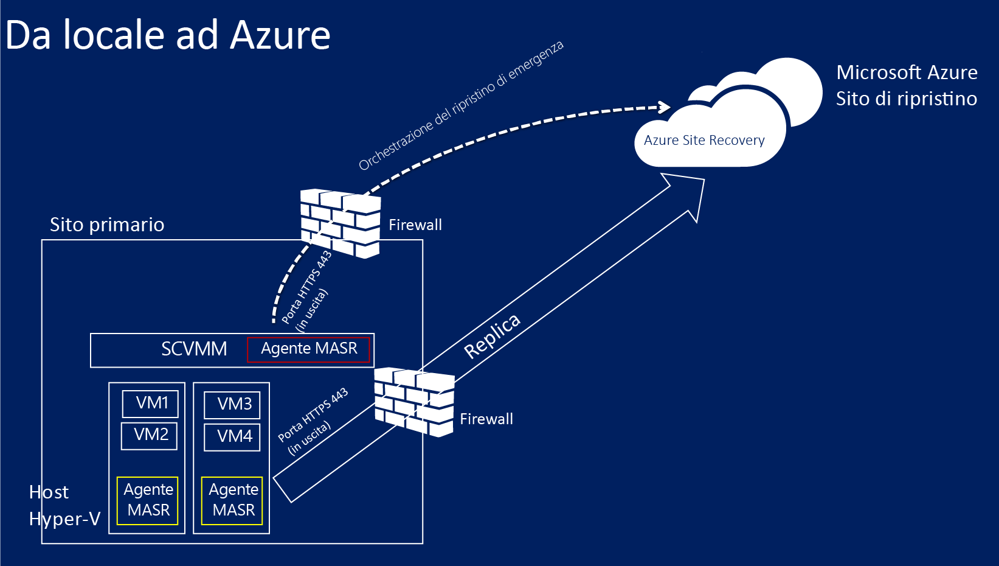

### Prerequisiti di mapping di rete
Quando si proteggono le macchine virtuali in Azure il mapping di rete mappa tra le reti VM nel server VMM di origine e le reti di Azure in un server VMM di destinazione per eseguire le operazioni seguenti:

- Tutte le macchine virtuali di cui viene eseguito il failover nella stessa rete possono connettersi tra loro, indipendentemente dal piano di ripristino di appartenenza.
- Se nella rete di Azure di destinazione è configurato un gateway di rete, le macchine virtuali possono connettersi ad altre macchine virtuali locali.
- Se non si configura il mapping delle reti, solo le macchine virtuali di cui viene eseguito il failover nello stesso piano di ripristino possono connettersi tra loro dopo il failover in Azure.

Per distribuire il mapping di rete sarà necessario quanto segue:

- Le macchine virtuali che si vuole proteggere nel server VMM di origine devono essere connesse a una rete VM. È necessario che tale rete sia collegata a una rete logica associata al cloud.
- Una rete di Azure a cui le macchine virtuali replicate possono connettersi dopo il failover. Questa rete viene selezionata al momento del failover. La rete deve trovarsi nella stessa area della sottoscrizione di Azure Site Recovery.
- Altre informazioni sul mapping di rete:
	- [Configurazione di reti logiche in VMM](http://go.microsoft.com/fwlink/?LinkId=386307)
	- [Configurazione di reti VM e gateway in VMM](http://go.microsoft.com/fwlink/?LinkId=386308)
	- [Configurare e monitorare le reti virtuali in Azure](http://go.microsoft.com/fwlink/?LinkId=402555)

## Passaggio 1: creare un insieme di credenziali di Ripristino sito

1. Accedere al [portale di gestione](https://portal.azure.com) dal server VMM che si vuole registrare.

2. Espandere
3. *Servizi dati*, quindi *Servizi di ripristino* e fare clic su *Insieme di credenziali di Ripristino sito*. *
3. Fare clic su *Crea nuovo* e quindi su *Creazione rapida*.

4. In *Name* immettere un nome descrittivo per identificare l'insieme di credenziali.

5. In *Region* selezionare l'area geografica per l'insieme di credenziali. Le aree geografiche disponibili includono Asia orientale, Europa occidentale, Stati Uniti occidentali, Stati Uniti orientali, Europa settentrionale e Asia sudorientale.
6. Fare clic su *Create vault*.

	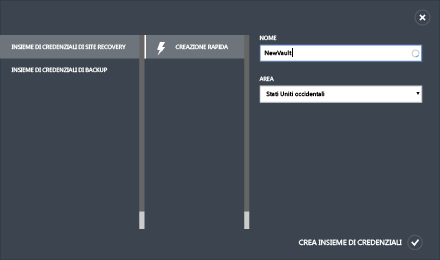

Controllare la barra di stato per verificare che l'insieme di credenziali sia stato creato correttamente. L'insieme di credenziali verrà elencato come *Attivo* nella pagina principale di Servizi di ripristino.

## Passaggio 2: generare una chiave di registrazione dell'insieme di credenziali

Generare una chiave di registrazione nell'insieme di credenziali. Dopo aver scaricato il provider di Azure Site Recovery e averlo installato sul server VMM, si userà questa chiave per registrare il server VMM nell'insieme di credenziali.

1. Nella pagina *Servizi di ripristino* fare clic sull'insieme di credenziali per aprire la pagina Avvio rapido. La pagina Avvio rapido può anche essere aperta in qualsiasi momento tramite l'icona.

	

2. Nell'elenco a discesa selezionare **Tra un sito Hyper-V locale e Microsoft Azure**.
3. In **Prepare VMM Servers** fare clic sul file **Generate registration key**. Il file di chiave viene generato automaticamente ed è valido per 5 giorni dal momento in cui viene generato. Se non si accede al portale di Azure dal server VMM sarà necessario copiare questo file sul server.

	

## Passaggio 3: installare il provider di Azure Site Recovery

4. Nella pagina *Avvio rapido*, in **Prepare VMM servers**, fare clic su *Download Microsoft Azure Site Recovery Provider for installation on VMM servers* per ottenere la versione più recente del file di installazione del provider.

2. Eseguire il file nel server VMM di origine. Se VMM viene distribuito in un cluster e si installa il provider per la prima volta, installarlo in un nodo attivo nel cluster e completare l'installazione per registrare il server VMM nell'insieme di credenziali. Quindi, installare il provider sugli altri nodi. Si noti che se si sta aggiornando il provider sarà necessario eseguire l'aggiornamento su tutti i nodi, in quanto dovrebbero eseguire tutti la stessa versione del provider.

3. Il programma di installazione effettua una **Verifica prerequisiti** e chiede l'autorizzazione ad arrestare il servizio VMM per avviare l'installazione del provider. Il servizio VMM verrà riavviato automaticamente al termine dell'installazione. Se si esegue l'installazione in un cluster VMM, verrà richiesto di interrompere il ruolo Cluster.

4. In **Microsoft Update** è possibile fornire il consenso esplicito agli aggiornamenti. Se questa impostazione è abilitata, gli aggiornamenti del provider verranno installati in base ai criteri indicati in Microsoft Update.

	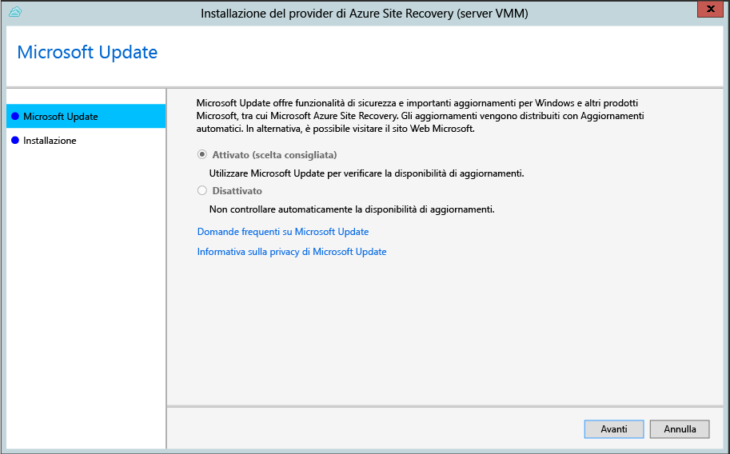

1.  Il percorso di installazione è impostato su **<SystemDrive>\\Programmi\\Microsoft System Center 2012 R2\\Virtual Machine Manager\\bin**. Fare clic sul pulsante di installazione per iniziare a installare il provider. 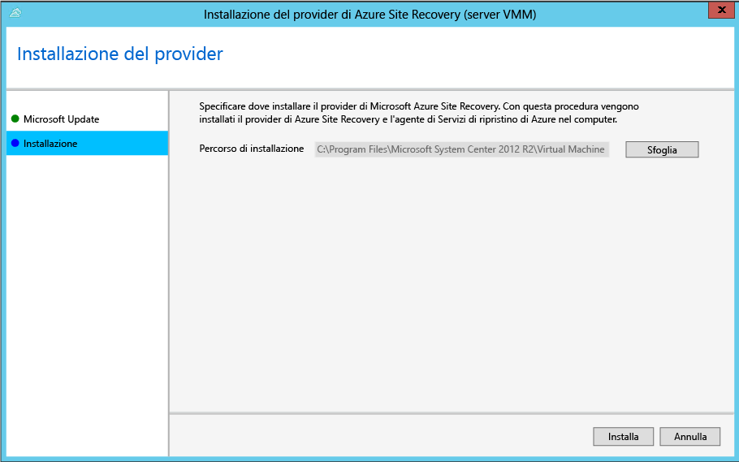

1. Dopo l'installazione del provider, fare clic sul pulsante di registrazione per registrare il server nell'insieme di credenziali. 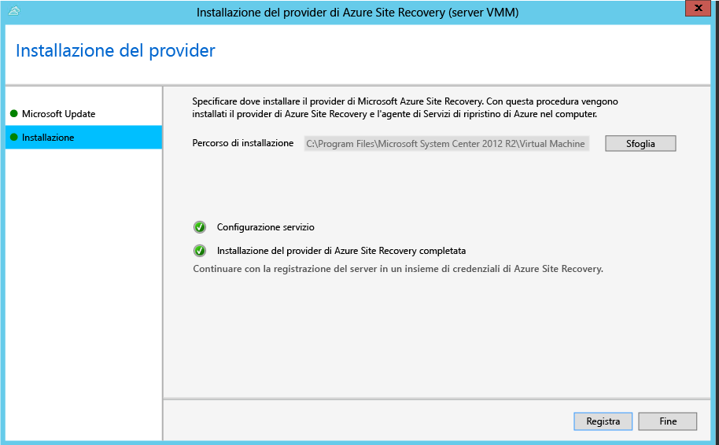

5. Nella pagina **Connessione Internet** specificare la modalità di connessione Internet del provider in esecuzione sul server VMM. Selezionare *Usa impostazioni proxy del sistema predefinite* per usare le impostazioni di connessione a Internet predefinite configurate nel server.

	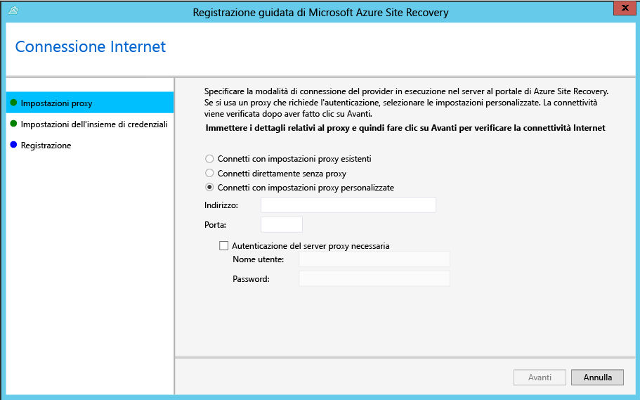 - Se si vuole usare un server proxy personalizzato, configurarlo prima di installare il provider. Quando si configurano impostazioni proxy personalizzate, verrà eseguito un test per verificare la connessione proxy. Se si usa un proxy personalizzato oppure se il proxy predefinito richiede l'autenticazione, sarà necessario immettere i dettagli del proxy, tra cui l'indirizzo e la porta. Gli URL seguenti dovrebbero essere accessibili dal Server VMM e dagli host Hyper-V - *.hypervrecoverymanager.windowsazure.com - *.accesscontrol.windows.net - *.backup.windowsazure.com - *.blob.core.windows.net - *.store.core.windows.net - Consentire l’uso degli indirizzi IP descritti in [Intervalli IP dei data center di Azure](http://go.microsoft.com/fwlink/?LinkId=511094) e del protocollo HTTPS (443). È necessario aggiungere all'elenco di indirizzi consentiti gli IP dell'area Azure che si prevede di utilizzare e quello degli Stati Uniti occidentali.

	- Se si usa un proxy personalizzato, un account RunAs di VMM (DRAProxyAccount) verrà creato automaticamente con le credenziali del proxy specificate. Configurare il server proxy in modo che l'account possa eseguire correttamente l'autenticazione. Le impostazioni dell'account RunAs di VMM possono essere modificate nella console VMM. A tale scopo, aprire l'area di lavoro Impostazioni, espandere Sicurezza, fare clic su Account RunAs, quindi modificare la password di DRAProxyAccount. È necessario riavviare il servizio VMM per rendere effettiva l'impostazione.

6. In **Registration Key** selezionare il codice di registrazione scaricato da Azure Site Recovery e copiato nel server VMM.
7. In **Vault name** verificare il nome dell'insieme di credenziali in cui verrà registrato il server. Fare clic su *Avanti*.

	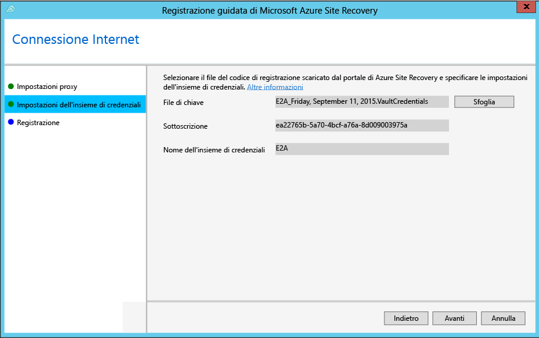

9. È possibile specificare un percorso in cui salvare un certificato SSL generato automaticamente per la crittografia dei dati. Questo certificato viene usato se si abilita la crittografia dei dati per un cloud protetto da Azure nel portale di Azure Site Recovery. Conservare il certificato in una posizione sicura, poiché sarà necessario selezionarlo per decrittografare i dati nel caso in cui venga eseguito un failover in Azure.

	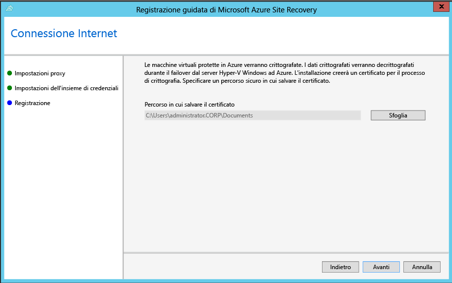

8. In **Nome server** specificare un nome descrittivo per identificare il server VMM nell'insieme di credenziali. In una configurazione cluster specificare il nome del ruolo relativo al cluster VMM.

8. In **Initial cloud metadata** selezionare l'opzione relativa alla sincronizzazione dei metadati per tutti i cloud presenti sul server VMM con l'insieme di credenziali. È necessario eseguire questa azione solo una volta in ogni server. Se non si vogliono sincronizzare tutti i cloud, è possibile lasciare deselezionata questa opzione e sincronizzare ogni cloud singolarmente nelle proprietà del cloud nella console VMM. 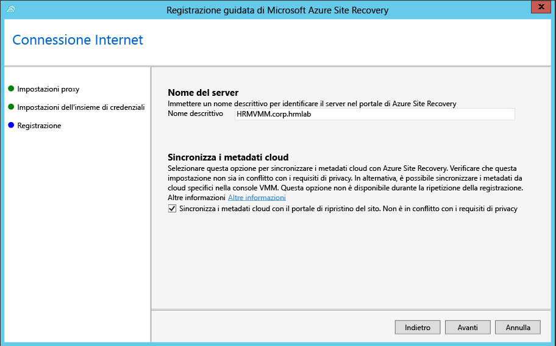

8. Fare clic su *Avanti* per completare il processo. Dopo la registrazione, i metadati del server VMM vengono recuperati da Azure Site Recovery. Il server viene visualizzato nella scheda *Server VMM* della pagina **Server** nell'insieme di credenziali.

>[AZURE.NOTE]Il provider di Azure Site Recovery può essere installato anche usando la riga di comando seguente. In questo modo il provider viene installato in un Server CORE per Windows Server 2012 R2.
>
>1. Scaricare il file di installazione del provider e il codice di registrazione in una cartella, ad esempio C:\\ASR.
>2. Arrestare il servizio System Center Virtual Machine Manager.
>3. Estrarre il programma di installazione del provider eseguendo i comandi seguenti dal prompt dei comandi con privilegi di **amministratore**.
>
    	C:\Windows\System32> CD C:\ASR
    	C:\ASR> AzureSiteRecoveryProvider.exe /x:. /q
>4. Installare il provider eseguendo il comando seguente.
>
		C:\ASR> setupdr.exe /i
>5. Registrare il provider eseguendo il comando seguente.
>
    	CD C:\Program Files\Microsoft System Center 2012 R2\Virtual Machine Manager\bin
    	C:\Program Files\Microsoft System Center 2012 R2\Virtual Machine Manager\bin> DRConfigurator.exe /r  /Friendlyname <friendly name of the server> /Credentials <path of the credentials file> /EncryptionEnabled <full file name to save the encryption certificate>         
 ####Elenco dei parametri di installazione dalla riga di comando####
>
 - **/Credentials** : parametro obbligatorio che specifica la posizione in cui si trova il file del codice di registrazione.  
 - **/FriendlyName** : parametro obbligatorio per il nome del server host Hyper-V che viene visualizzato nel portale di Azure Site Recovery.
 - **/EncryptionEnabled**: parametro facoltativo da usare solo nello scenario da VMM ad Azure se è necessario che la crittografia delle macchine virtuali sia inattiva in Azure. Assicurarsi che il nome del file specificato abbia l'estensione **pfx**.
 - **/proxyAddress**: parametro facoltativo che specifica l'indirizzo del server proxy.
 - **/proxyport**: parametro facoltativo che specifica la porta del server proxy.
 - **/proxyUsername**: parametro facoltativo che specifica il nome utente proxy (se il proxy richiede l'autenticazione).
 - **/proxyPassword**: parametro facoltativo che specifica la password per l'autenticazione nel server proxy (se il proxy richiede l'autenticazione).

## Passaggio 4: Creare un account di archiviazione di Azure

Se non si dispone di un account di archiviazione di Azure, fare clic su **Aggiungi un account di archiviazione di Azure**. Nell'account deve essere abilitata la replica geografica. L'account deve trovarsi nella stessa area geografica del servizio Azure Site Recovery e deve essere associato alla stessa sottoscrizione.

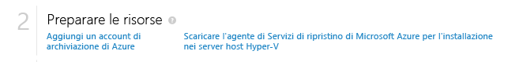

## Passaggio 5: Installare l'agente di Servizi di ripristino di Azure

Installare l'agente di Servizi di ripristino di Azure su ogni server host Hyper-V presente nei cloud VMM da proteggere.

1. Nella pagina Avvio rapido fare clic su <b>Scarica l’agente di servizi di Azure Site Recovery per l’installazione negli host</b> per ottenere la versione più recente del file di installazione dell'agente.

	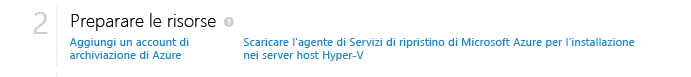

2. Eseguire il file di installazione su ogni server host Hyper-V presente nei cloud VMM da proteggere.
3. Nella pagina **Controllo dei prerequisiti** fare clic su <b>Avanti</b>. Gli eventuali prerequisiti mancanti verranno installati automaticamente.

	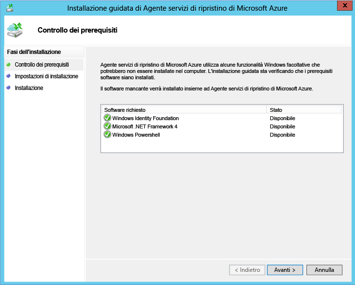

4. Nella pagina **Impostazioni di installazione** specificare dove si vuole installare l'agente e selezionare il percorso della cache in cui verranno installati i metadati di backup. Fare clic su <b>Installa</b>.

## Passaggio 6: configurare le impostazioni di protezione del cloud

Dopo la registrazione del server VMM, sarà possibile configurare le impostazioni di protezione del cloud. Quando si installa il provider, abilitare l'opzione **Sincronizza dati cloud con insieme credenziali** in modo che tutti i cloud presenti sul server VMM vengano visualizzati nella scheda <b>Elementi protetti</b> dell'insieme di credenziali.

1. Nella pagina Avvio rapido fare clic su **Configurare la protezione per i cloud VMM**.
2. Nella scheda **Elementi protetti** fare clic sul cloud da configurare e passare alla scheda **Configurazione**.
3. In <b>Destinazione</b> selezionare <b>Microsoft Azure</b>.
4. In <b>Account di archiviazione</b> selezionare l'account di archiviazione di Azure che si vuole usare per eseguire la replica nelle macchine virtuali.
5. Impostare <b>Crittografa dati archiviati</b> su <b>Disattivato</b>. Questa impostazione specifica che i dati devono essere replicati crittografati tra il sito locale e Azure.
6. In <b>Frequenza di copia</b> lasciare l'impostazione predefinita. Questo valore consente di specificare la frequenza della sincronizzazione dei dati tra il percorso di origine e di destinazione.
7. In <b>Mantieni punti di ripristino per</b> lasciare l'impostazione predefinita. Il valore predefinito zero indica che solo il punto di ripristino più recente per una macchina virtuale primaria viene archiviato in un server host di replica.
8. In <b>Frequenza dell’applicazione-Snapshot coerenti</b> lasciare l'impostazione predefinita. Questo valore consente di specificare la frequenza della creazione di snapshot. Gli snapshot usano il Servizio Copia Shadow del volume (VSS, Volume Shadow Copy Service) per assicurare che lo stato delle applicazioni sia coerente quando viene creato lo snapshot. Se si imposta un valore, questo deve essere inferiore al numero di punti di ripristino aggiuntivi configurati.
9. In <b>Ora inizio replica</b> specificare quando deve essere avviata la replica iniziale dei dati in Azure. Verrà usato il fuso orario del server host Hyper-V. È consigliabile pianificare la replica iniziale durante le fasce orarie di minore attività.

	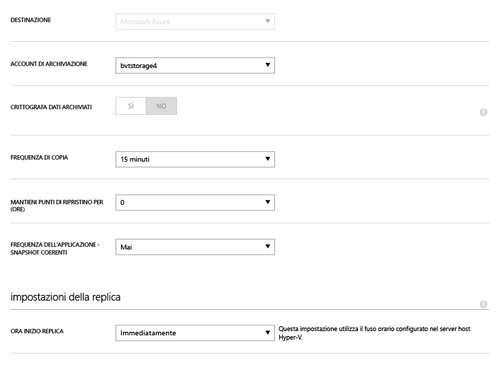

Dopo avere salvato le impostazioni, verrà creato un processo che potrà essere monitorato nella scheda <b>Processi</b>. Tutti i server host Hyper-V nel cloud di origine VMM verranno configurati per la replica.

Dopo il salvataggio, le impostazioni cloud possono essere modificate nella scheda <b>Configura</b>. Per modificare il percorso o l’account di archiviazione di destinazione, è necessario rimuovere la configurazione del cloud e quindi riconfigurare il cloud. Si noti che se si cambia l'account di archiviazione, la modifica viene applicata alle macchine virtuali abilitate per la protezione solo dopo la modifica dell'account di archiviazione. Non viene eseguita la migrazione delle macchine virtuali esistenti al nuovo account di archiviazione.

## Passaggio 7: Configurare il mapping di rete
Prima di iniziare il mapping di rete, verificare che le macchine virtuali nel server VMM di origine siano connesse a una rete VM. Inoltre, creare una o più rete virtuali di Azure. Si noti che è possibile mappare più reti VM a una singola rete di Azure.

1. Nella pagina Avvio rapido fare clic su **Mapping reti**.
2. Nella scheda **Reti**, in **Percorso di origine**, selezionare il server VMM di origine. In **Percorso di destinazione** selezionare Azure.
3. In Reti di **origine** viene visualizzato un elenco di reti VM associate al server VMM. In Reti di **destinazione** vengono visualizzate le reti di Azure associate alla sottoscrizione.
4. Selezionare la rete VM di origine e fare clic su **Esegui mapping**.
5. Nella pagina **Seleziona una rete di destinazione** selezionare la rete di Azure di destinazione che si vuole usare.
6. Fare clic sul segno di spunta per completare il processo di mapping.

	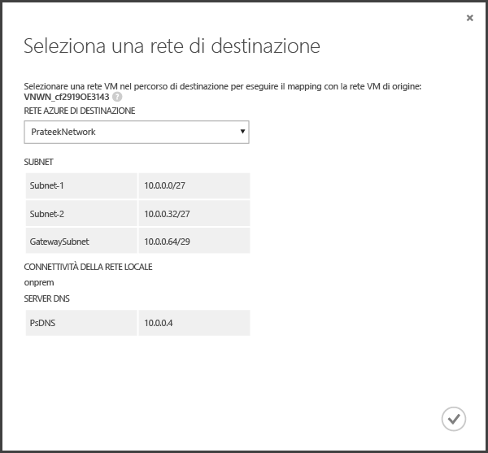

Dopo avere salvato le impostazioni, viene avviato un processo che tiene traccia dello stato del mapping e che può essere monitorato nella scheda Processi. Tutte le macchine virtuali di replica esistenti che corrispondono alla rete VM di origine verranno connesse alle reti di Azure di destinazione. Dopo la replica, le nuove macchine virtuali connesse alla rete VM di origine verranno connesse alla rete di Azure mappata. Se si modifica un mapping esistente con una nuova rete, le macchine virtuali di replica verranno connesse usando le nuove impostazioni.

Si noti che, se la rete di destinazione ha più subnet e una di esse ha lo stesso nome di una subnet in cui si trova la macchina virtuale di origine, la macchina virtuale di replica sarà connessa a tale subnet di destinazione dopo il failover. Se non è presente una subnet di destinazione con un nome corrispondente, la macchina virtuale sarà connessa alla prima subnet della rete.

## Passaggio 8: Abilitare la protezione per le macchine virtuali

Dopo la configurazione corretta di server, cloud e reti, sarà possibile abilitare la protezione per le macchine virtuali nel cloud. Tenere presente quanto segue:

- Le macchine virtuali devono essere conformi ai requisiti di Azure. Vedere tali requisiti in <a href="http://go.microsoft.com/fwlink/?LinkId=402602">Prerequisiti e supporto</a> nella Guida alla pianificazione.
- Per abilitare la protezione, è necessario che le proprietà del sistema operativo e del disco del sistema operativo siano impostate per la macchina virtuale. Quando si crea una macchina virtuale basata su un modello di macchina virtuale VMM è possibile impostare la proprietà. È possibile impostare queste proprietà anche per le macchine virtuali esistenti nelle schede **Generale** e **Configurazione hardware** delle proprietà delle macchine virtuali. Se queste proprietà non vengono impostate in VMM, sarà possibile configurarle nel portale di Azure Site Recovery.

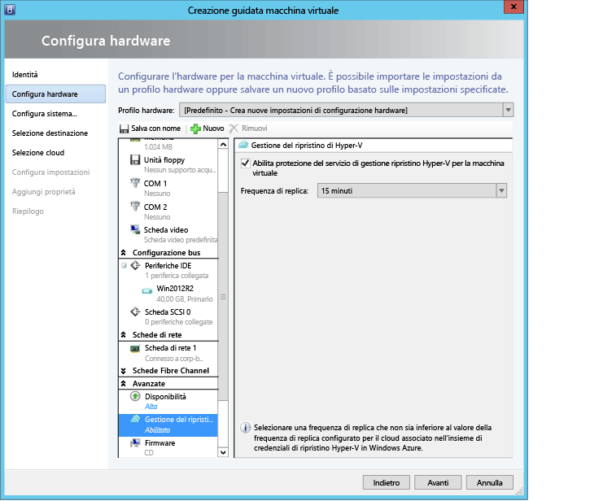

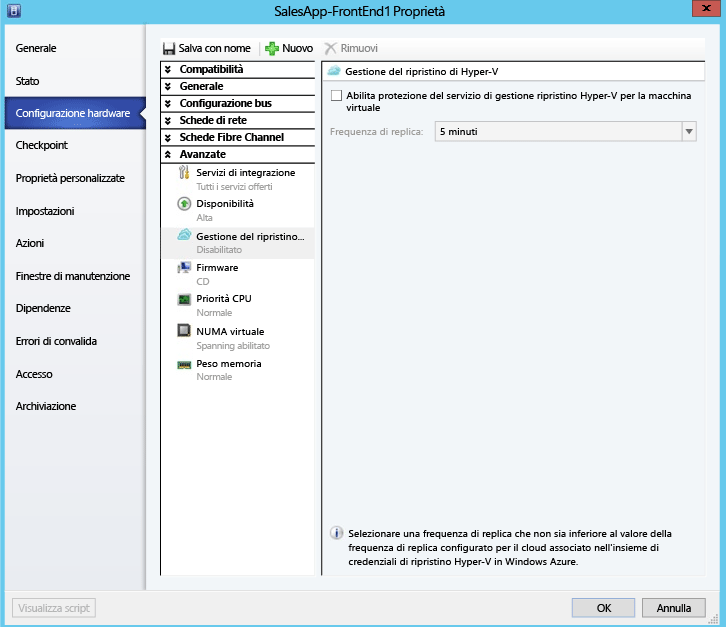

1. Per abilitare la protezione, nella scheda <b>Macchine virtuali</b> del cloud in cui si trova la macchina virtuale fare clic su <b>Abilita protezione</b> e selezionare <b>Aggiungi macchine virtuali</b>.
2. Nell'elenco di macchine virtuali nel cloud selezionare quella da proteggere.

	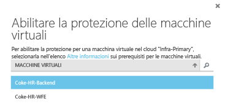

	Tenere traccia dell'avanzamento dell'azione di abilitazione della protezione, inclusa la replica iniziale, nella scheda **Processi** Dopo l'esecuzione del processo di finalizzazione della protezione la macchina virtuale è pronta per il failover. Al termine dell'operazione di abilitazione della protezione e di replica delle macchine virtuali, sarà possibile visualizzarle in Azure.

	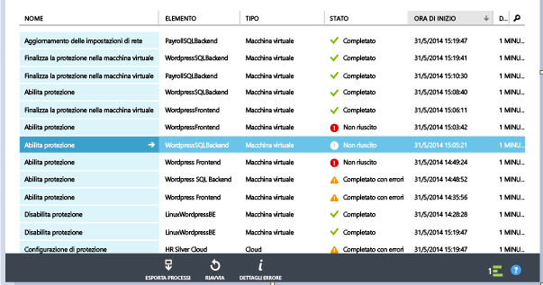

3. Verificare le proprietà della macchina virtuale e modificarle in base alle esigenze.

	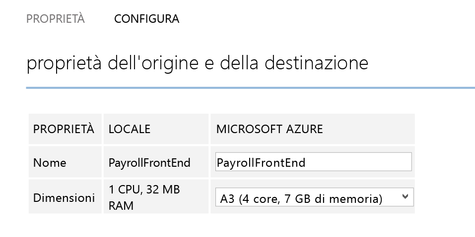

4. Nella scheda Configura della macchina virtuale le proprietà successive alle proprietà di rete possono essere modificate.

    1. Numero di schede di rete della macchina virtuale di destinazione: il numero di schede di rete nella macchina virtuale di destinazione dipende dalle dimensioni della macchina virtuale selezionata. Il numero di schede di rete delle macchine virtuali di destinazione corrisponde minimo al numero di schede di rete nella macchina virtuale di origine e massimo al numero di schede di rete supportate dalla dimensione della macchina virtuale selezionata.  

	1. Rete della macchina virtuale di destinazione: la rete a cui si connette la macchina virtuale è determinata dal mapping di rete della rete della macchina virtuale di origine. Nel caso in cui la macchina virtuale di origine dispone di più schede di rete e le reti di origine sono mappate a reti diverse nella destinazione, l'utente dovrà scegliere tra una delle reti di destinazione.

	1. Subnet di ciascuna delle schede di rete: per ogni scheda di rete, l'utente può scegliere la subnet a cui si connetterà la macchina virtuale di cui è stato eseguito il failover.

	1. Indirizzo IP di destinazione: se la scheda di rete della macchina virtuale di origine è configurata per utilizzare l'indirizzo IP statico, l'utente può fornire l'indirizzo IP per la macchina virtuale di destinazione. L’utente può utilizzare questa funzionalità per mantenere l'IP della macchina virtuale di origine dopo un failover. Se non viene fornito alcun indirizzo IP, nessun indirizzo IP disponibile verrà assegnato alla scheda di rete al momento del failover. Nel caso in cui l'indirizzo IP di destinazione fornito dall'utente è già utilizzato da altre macchine virtuali già in esecuzione in Azure, il failover non riesce.

		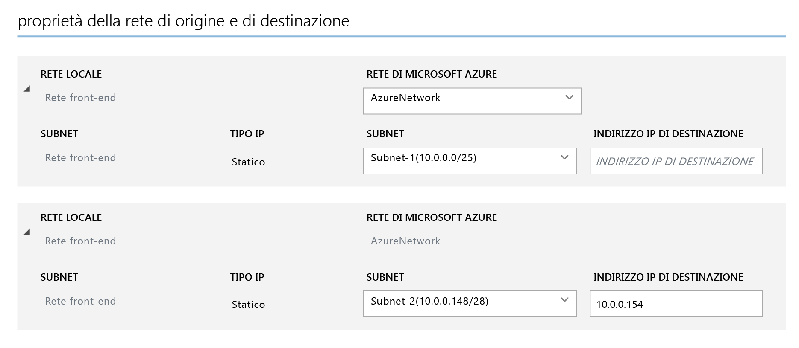

## Testare la distribuzione
Per testare la distribuzione è possibile eseguire un failover di test per una singola macchina virtuale oppure creare un piano di ripristino costituito da più macchine virtuali ed eseguire un failover di test per il piano. Il failover di test consente di simulare il meccanismo di failover e di ripristino in una rete isolata. Si noti che:

- Per eseguire la connessione alla macchina virtuale in Azure tramite Desktop remoto dopo il failover, abilitare Connessione Desktop remoto sulla macchina virtuale prima di eseguire il failover di test.
- Dopo il failover si userà un indirizzo IP pubblico per connettersi alla macchina virtuale in Azure tramite Desktop remoto. Se si vuole procedere in questo senso, assicurarsi che non siano presenti criteri di dominio che impediscono la connessione a una macchina virtuale mediante un indirizzo pubblico.

### Creare un piano di ripristino

1. Nella scheda **Piani di ripristino** aggiungere un nuovo piano. Specificare un nome, immettere **VMM** nel campo **Tipo origine**, specificare il server VMM di origine in **Origine** e digitare Azure nel campo relativo alla destinazione.

	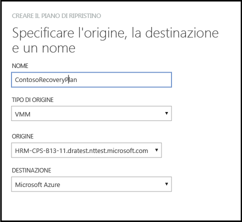

2. Nella pagina **Seleziona macchine virtuali** selezionare le macchine virtuali da aggiungere al piano di ripristino. Le macchine virtuali verranno aggiunte al gruppo predefinito del piano di ripristino, ossia il Gruppo 1. In un singolo piano di ripristino è stato testato un massimo di 100 macchine virtuali.

	- Se si vuole verificare le proprietà delle macchine virtuali prima di aggiungerle al piano, fare clic sulla macchina virtuale nella pagina delle proprietà nel cloud in cui si trova. È anche possibile configurare le proprietà della macchina virtuale nella console VMM.
	- Tutte le macchine virtuali visualizzate sono state abilitate per la protezione. L'elenco include sia le macchine virtuali abilitate per la protezione e per cui la replica iniziale è stata completata sia quelle abilitate per la protezione con la replica iniziale in corso. Solo le macchine virtuali con la replica iniziale completa possono eseguire il failover come parte di un piano di ripristino. Pertanto, verificare lo stato iniziale di replica delle macchine virtuali nel piano prima di avviare il failover dello stesso.

	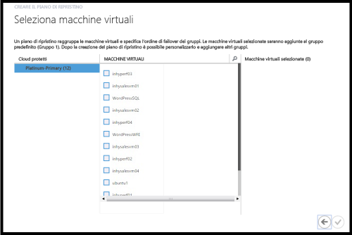

Una volta creato, il piano di ripristino verrà visualizzato nella scheda **Piani di ripristino**. È inoltre possibile aggiungere [runbook di Automazione di Azure](site-recovery-runbook-automation.md) al piano di ripristino per automatizzare le azioni del tempo di failover.

### Eseguire un failover di test

È possibile eseguire un failover di test in Azure in due modi.

- Failover di test senza una rete di Azure: questo tipo di failover di test verifica che la macchina virtuale sia rilevata correttamente in Azure. La macchina virtuale non sarà connessa ad alcuna rete di Azure dopo il failover.
- Failover di test con una rete di Azure: questo tipo di failover verifica che l'intero ambiente di replica venga rilevato come previsto e che le macchine virtuali di cui viene eseguito il failover siano connesse alla rete di Azure di destinazione specificata. Per la gestione della subnet, nel failover di test la subnet della macchina virtuale di test verrà rilevata in base alla subnet della macchina virtuale di replica. Questo comportamento è diverso dalla replica normale quando la subnet della macchina virtuale di replica si basa sulla subnet della macchina virtuale di origine.

Per eseguire un failover di test per una macchina virtuale abilitata per la protezione in Azure senza specificare una rete di Azure di destinazione, non occorre preparare l'ambiente. Per eseguire un failover di test con una rete di Azure di destinazione, è necessario creare una nuova rete di Azure isolata dalla rete di Azure di produzione (comportamento predefinito quando si crea una nuova rete in Azure) e configurare l'infrastruttura della macchina virtuale replicata in modo che funzioni come previsto. Ad esempio, una macchina virtuale con DNS e Controller di dominio può essere replicata in Azure utilizzando Azure Site Recovery e può essere creata nella rete di test utilizzando Failover di test. Per eseguire un failover di test, attenersi alla procedura seguente:

1. Eseguire un failover di test della macchina virtuale con Controller di dominio e DNS nella stessa rete che verrà usata per il failover di test effettivo della macchina virtuale locale.
2. Prendere nota degli indirizzi IP assegnati alla macchina virtuale DNS di failover.
3. Nella rete virtuale di Azure che verrà usata per il failover, aggiungere l’indirizzo IP come indirizzo del server DNS.
4. Eseguire il failover di test della macchina virtuale locale di origine, specificando la rete di test di Azure.
5. Dopo aver verificato che il test sia stato eseguito come previsto, contrassegnare il failover di test come completato per il piano di ripristino e quindi per le macchine virtuali di Controller di dominio e DNS.

Per eseguire un failover di test, eseguire le operazioni seguenti:

1. Nella scheda **Piani di ripristino** selezionare il piano e fare clic su **Failover di test**.
1. Nella pagina **Conferma failover di test** selezionare **Nessuno** o una rete di Azure specifica. Tenere presente che se si seleziona Nessuno, il failover di test verifica che la macchina virtuale venga replicata correttamente in Azure ma non controlla la configurazione della rete di replica.

	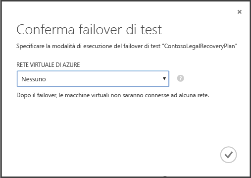

1. Se la crittografia dei dati è abilitata per il cloud, in **Chiave di crittografia** selezionare il certificato generato durante l'installazione del provider nel server VMM quando è stata attivata l'opzione per abilitare la crittografia dei dati per un cloud.
1. Nella scheda **Processi** è possibile tenere traccia dello stato di avanzamento del failover. Dovrebbe anche essere possibile vedere la replica di test della macchina virtuale nel portale di Azure. Se è stato impostato l'accesso alle macchine virtuali dalla rete locale, è possibile inizializzare una Connessione Desktop remoto alla macchina virtuale.
1. Quando il processo di failover raggiunge la **fase conclusiva**, fare clic su **Completa** test per completare il failover di test. È possibile eseguire il drill-down fino alla scheda **Processo** per tenere traccia dello stato e dell’avanzamento del failover ed eseguire eventuali azioni necessarie.
1. Al termine del processo di failover, nel portale di Azure sarà possibile visualizzare la replica del test eseguito sulla macchina virtuale. Se è stato impostato l'accesso alle macchine virtuali dalla rete locale, è possibile inizializzare una Connessione Desktop remoto alla macchina virtuale. Si noti che:

    1. Verificare che le macchine virtuali vengano avviate correttamente
    1. Per eseguire la connessione alla macchina virtuale in Azure tramite Desktop remoto dopo il failover, abilitare Connessione Desktop remoto sulla macchina virtuale prima di eseguire il failover di test. È necessario anche aggiungere un endpoint RDP nella macchina virtuale. A tale scopo, è possibile utilizzare un [Runbook di Automazione di Azure](site-recovery-runbook-automation.md).
    1. Dopo il failover, se si utilizza un indirizzo IP pubblico per connettersi alla macchina virtuale in Azure tramite Desktop remoto, verificare che non siano definiti criteri di dominio che impediscono la connessione a una macchina virtuale utilizzando un indirizzo pubblico.

1.  Al completamento del test, procedere come segue:
	- Fare clic su **Il failover di test è completo**. Pulire l'ambiente di test per spegnere automaticamente ed eliminare la macchine virtuali di test.
	- Fare clic su **Note** per registrare e salvare eventuali commenti associati al failover di test.

##  Monitorare l'attività

La scheda *Processi* e il *Dashboard* consentono di visualizzare e monitorare i processi principali eseguiti dall'insieme di credenziali di Azure Site Recovery, tra cui la configurazione della protezione per un cloud, l'abilitazione e la disabilitazione della protezione per una macchina virtuale, l'esecuzione di un failover (pianificato, non pianificato o di test) e il commit di un failover non pianificato.

Nella scheda *Processi* è possibile visualizzare i processi, eseguire il drill-down di dettagli ed errori dei processi, eseguire query sui processi per recuperare i processi che soddisfano specifici criteri, esportare processi in Excel e riavviare i processi non riusciti.

Nel *Dashboard* è possibile scaricare le versioni più recenti dei file di installazione del provider e dell'agente, ottenere informazioni di configurazione per l'insieme di credenziali, visualizzare il numero di macchine virtuali la cui protezione è gestita dall'insieme di credenziali, visualizzare i processi recenti, gestire il certificato dell'insieme di credenziali e risincronizzare le macchine virtuali.

Per altre informazioni sull'interazione con i processi e il dashboard, vedere la <a href="http://go.microsoft.com/fwlink/?LinkId=398534">guida alle operazioni e al monitoraggio</a>.

##Passaggi successivi
<UL>
<LI>Per pianificare e distribuire Azure Site Recovery in un ambiente di produzione completo, vedere la <a href="http://go.microsoft.com/fwlink/?LinkId=321294">guida alla pianificazione per Azure Site Recovery</a> e la <a href="http://go.microsoft.com/fwlink/?LinkId=321295">guida alla distribuzione per Azure Site Recovery</a>.</LI>

<LI>In caso di domande, visitare il <a href="http://go.microsoft.com/fwlink/?LinkId=313628">forum relativo ai Servizi di ripristino di Azure</a>.</LI> </UL>

<!---HONumber=Oct15_HO2-->